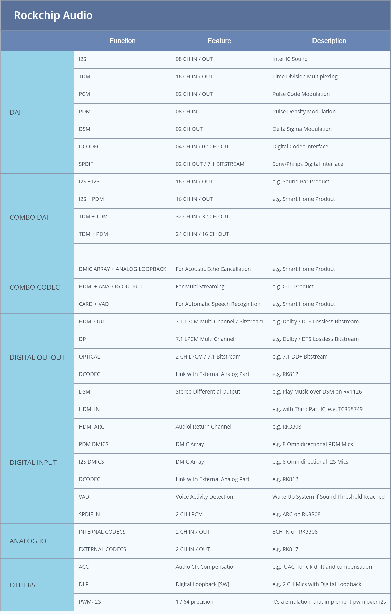
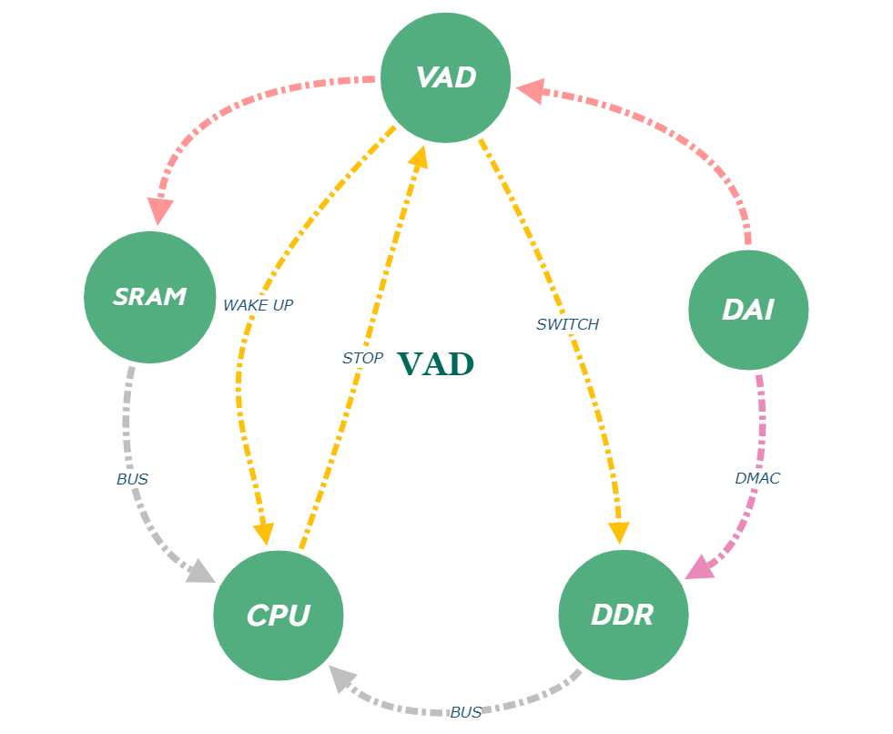
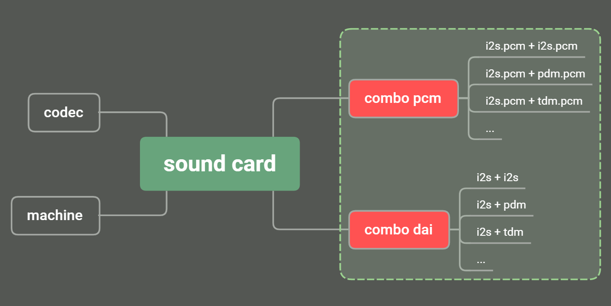
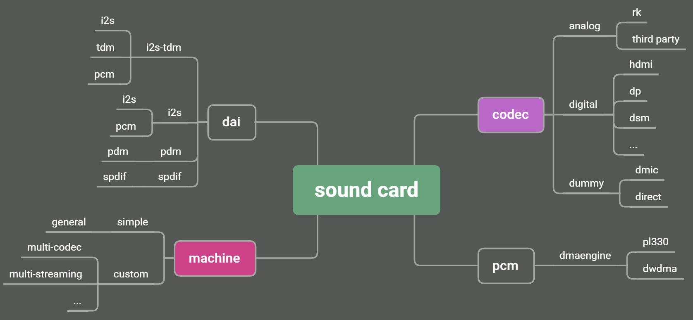
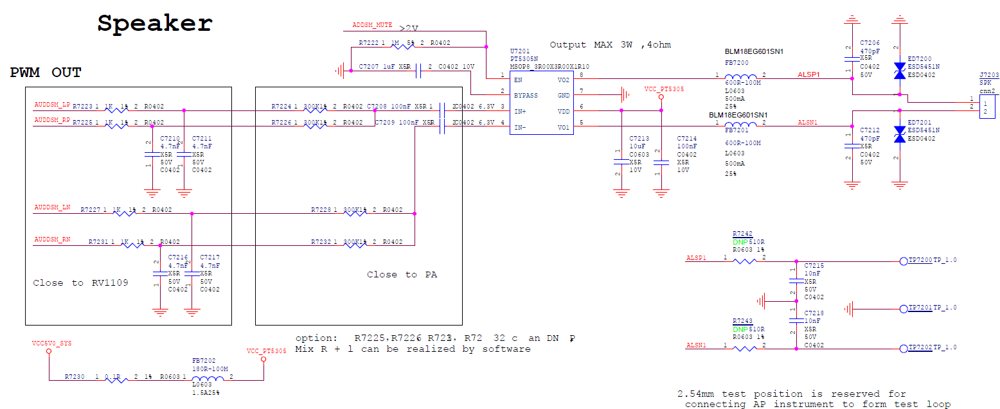
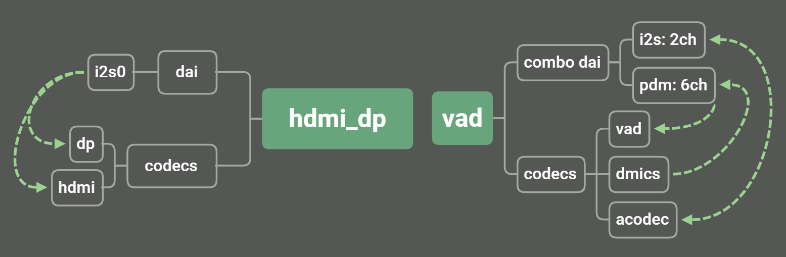
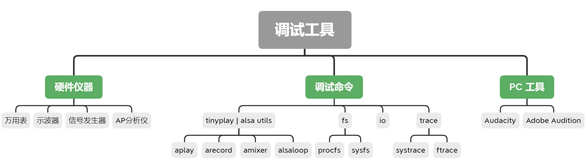
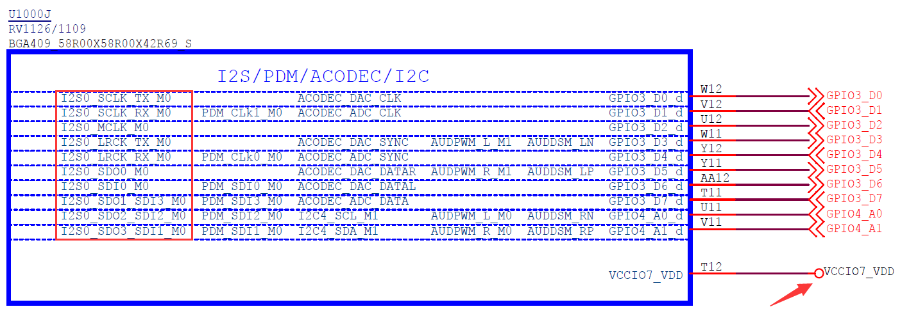
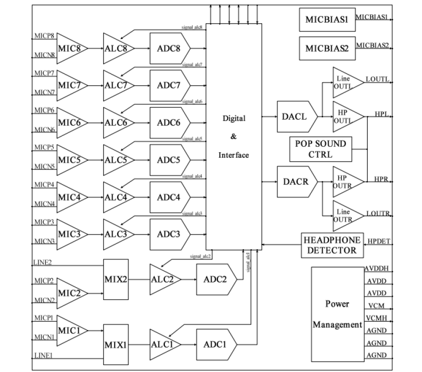

# Rockchip Audio 开发指南

文件标识：RK-KF-YF-145

发布版本：V1.5.0

日期：2021-01-20

文件密级：□绝密   □秘密   □内部资料   ■公开

---

**免责声明**

本文档按“现状”提供，瑞芯微电子股份有限公司（“本公司”，下同）不对本文档的任何陈述、信息和内容的准确性、可靠性、完整性、适销性、特定目的性和非侵权性提供任何明示或暗示的声明或保证。本文档仅作为使用指导的参考。

由于产品版本升级或其他原因，本文档将可能在未经任何通知的情况下，不定期进行更新或修改。

**商标声明**

“Rockchip”、“瑞芯微”、“瑞芯”均为本公司的注册商标，归本公司所有。

本文档可能提及的其他所有注册商标或商标，由其各自拥有者所有。

**版权所有 © 2021 瑞芯微电子股份有限公司**

超越合理使用范畴，非经本公司书面许可，任何单位和个人不得擅自摘抄、复制本文档内容的部分或全部，并不得以任何形式传播。

瑞芯微电子股份有限公司

Rockchip Electronics Co., Ltd.

地址：     福建省福州市铜盘路软件园A区18号

网址：     [www.rock-chips.com](http://www.rock-chips.com)

客户服务电话： +86-4007-700-590

客户服务传真： +86-591-83951833

客户服务邮箱： [fae@rock-chips.com](mailto:fae@rock-chips.com)

---

**前言**

**概述**

本文档主要介绍 Rockchip 系列芯片的音频功能，内核驱动开发及调试。

**产品版本**

| **芯片名称** | **内核版本**           |
| ------------ | ---------------------- |
| RK 系列芯片  | Linux  4.4, Linux 4.19 |

**读者对象**

本文档（本指南）主要适用于以下工程师：

技术支持工程师

软件开发工程师

**修订记录**

| **日期**   | **版本** | **作者** | **修改说明**             |
| ---------- | -------- | -------- | ------------------------ |
| 2016-06-06 | V1.0.0   | 张学广   | 初始版本                 |
| 2017-02-15 | V1.1.0   | 张学广   | 增加 DRM HDMI Audio 配置 |
| 2020-02-18 | V1.2.0   | 张学广   | 内容修订及更新           |
| 2020-02-25 | V1.3.0   | 张学广   | 增加FAQ章节              |
| 2020-06-26 | V1.4.0   | 张学广   | 增加数字 CODEC 音频接口  |
| 2021-01-21 | V1.5.0   | 张学广   | 增加音频时钟补偿         |

**目录**

---

[TOC]

---

## 概述

### Rockchip 音频特性

本小结描述 RK 平台的音频特性，如表 1-1 所示：



表 1-1 Rockchip Audio 特性

### DAI

本章节主要描述 RK 平台 数字音频接口支持情况。

#### I2S

RK 平台有两种 I2S 控制器：I2S 和 I2S-TDM。I2S 控制器支持 I2S, PCM 协议；I2S-TDM 控制器支持 I2S, PCM, TDM 协议。

##### I2S 控制器 Features

- 支持 8声道 I2S 协议：standard, left justified, right justified
- 支持 stereo PCM 协议：early, late 1, late 2, late 3
- 支持 master/slave 模式，模式同时应用于 TX/RX 逻辑
- 支持 8k ~ 192k 采样率，384k 采样率
- 支持 16 ~ 32 bits 位宽
- 支持 MSB/LSB 模式
- 支持 时钟相位调整
- 支持 时钟补偿

Note:

- 384k 采样率需要高精度 clk，可从 MCLK PIN 导入外部高精度 clk 或者采用 slave 模式
- 不支持 mono PCM，如有需求，可采用 stereo PCM 传输 mono PCM，有效数据放在 slot 0
- 时钟补偿应用于异源系统的时钟补偿，比如 UAC，但有使用条件限制，参考 [音频时钟补偿](#音频时钟补偿) 章节

##### I2S-TDM 控制器 Features

除了支持 I2S 控制器的功能之外，I2S-TDM 控制器新增支持如下功能：

- 支持 8 slots TDM PCM 协议：normal, left shift mode[0~3]
- 支持 8 slots TDM I2S 协议：normal, left justified, right justified
- 支持 slot 位宽可配：16 ~ 32 bits
- 支持 data line 全映射，可重映射 data line 与 path 的关系
- 支持 TX/RX 异步模式，独立的时钟，可支持独立的采样率，位宽，协议
- 支持 TX/RX 同步模式，共享时钟
- 支持 PCM FSYNC 宽度可配：[1~7] sclk cycle 或 one channel block
- 支持 I2S FSYNC 宽度可配： half frame / whole frame

Note:

- slot 仅支持偶数配置
- TDM I2S 长帧模式下，可支持 16 声道传输
- TDM 协议下，仅使用 path-0，所以物理连接的 PIN 与声道不对应时，请通过 data line 重映射到 path-0

##### RK 系列芯片 I2S 支持列表

如表 1-2 所示：

| 芯片          | I2S                  | I2S-TDM                                    |
| ------------- | -------------------- | ------------------------------------------ |
| PX30/RK3326   | I2S1_2CH, I2S2_2CH   | I2S0_8CH                                   |
| RK1808        | I2S1                 | I2S0                                       |
| RK3036        | I2S0                 |                                            |
| RK3066        | I2S0, I2S1, I2S2     |                                            |
| RK312X        | I2S_8CH, I2S_2CH     |                                            |
| RK3188        | I2S0                 |                                            |
| RK3288        | I2S0                 |                                            |
| RK322X        | I2S0, I2S1, I2S2     |                                            |
| RK3308        | I2S_2CH_0, I2S_2CH_1 | I2S_8CH_0, I2S_8CH_1, I2S_8CH_2, I2S_8CH_3 |
| RK3328        | I2S0, I2S1, I2S2     |                                            |
| RK3368        | I2S_8CH, I2S_2CH     |                                            |
| RK3399        | I2S0, I2S1, I2S2     |                                            |
| RK3568/RK3566 |                      | I2S0_8CH, I2S1_8CH, I2S2_2CH, I2S3_2CH     |
| RV1108        | I2S0, I2S1, I2S2     |                                            |
| RV1126/RV1109 | I2S1_2CH, I2S2_2CH   | I2S0_8CH                                   |

表 1-2 RK 系列芯片 I2S 支持列表

#### PDM

RK 平台支持 PDM 协议的数字麦或者 ADC，具体 Features 如下：

- 支持 master mode only
- 支持 最大8个 MIC 阵列
- 支持 16 ~ 24 bits 位宽
- 支持 8 ~ 48k 采样率
- 支持 声道交换
- 支持 高通滤波：3.79 Hz, 60 Hz, 243 Hz, 493 Hz
- 支持 存储对齐：左对齐， 右对齐
- 支持 data line 全映射
- 支持 时钟相位调整
- 支持 时钟补偿

Note:

- 存储对齐仅对于位宽大于16 bits 的格式，大于16 bits 的格式，数据按 word 存储，默认低位补0
- 时钟补偿应用于异源系统的时钟补偿，比如 UAC，但有使用条件限制，参考 [音频时钟补偿](#音频时钟补偿) 章节
- data line 全映射功能在 RV1126 及后续推出的芯片才支持： RV1126/RV1109, RK3568/RK3566...

#### DCODEC

RK 平台支持数字 CODEC 接口，可对接支持该协议的模拟 CODEC，比如 RK812，组合成完整 CODEC。

另外，控制器工作于 DSM 模式时，可驱动外部 PA，满足普通音质产品需求，节省成本。

- 支持 3声道 ADC
- 支持 stereo DAC
- 支持 异步模式：播放和录音采样率可不同。
- 支持 同步模式：播放和录音采样率必须相同。
- 支持 PGA / ALC
- 支持 DSM 输出，直驱 PA
- 支持 高通滤波

#### VAD

语音活性检测 (Voice Activity Detection)，VAD 接收来自 DAI 的数据，处理统计分析，达到预设阈值时，触发中断，唤醒系统。简要数据流图如图 1-1 所示：



图 1-1 RK VAD 数据流

1. 系统休眠时，DAI -> VAD -> SRAM 保持工作，VAD 持续的接收数据，滤波，噪声自学习，音频数据存储在SRAM 循环 Buffer 中。
2. VAD 检测到声音超过预设阈值时，产生中断唤醒 CPU，CPU 关闭 VAD，VAD 关闭时，数据流自动切换DMAC通路，即：DAI -> DMAC -> DDR -> CPU 标准录音路径。
3. CPU 将 SRAM 中的数据无缝填充到录音 Buffer 中，数据处理对用户态透明。
4. 唤醒后，ASR 程序对录取的数据做分析处理，关键词检测等。

#### SPDIF

RK 平台支持 SPDIF Transmitter 接口协议，特别的，RK3308 还支持 SPDIF Receiver。

- 支持 16 ~ 24 bits 位宽
- 支持 192k 采样率
- 支持 stereo uncompressed audio，即 LPCM
- 支持 5.1 / 7.1 compressed audio，比如：DD, DD+
- 支持 Optical, Coaxial

Note:

- 192k 采样率输出的时候，需要配套支持 192k 的 Optical 器件

### Combo DAI

RK 平台支持任意 DAI 的组合使用，重组 DAI 生成 Combo DAI，如图 1-2 所示：



图 1-2 Combo DAI

## Audio 驱动开发

本章节描述 RK 平台音频支持情况，驱动开发及调试。

### 声卡基本构成

本小节介绍声卡的基本构成，如图 2-1 所示：



图 2-1 ALSA 声卡构成

- DAI: Digital Audio Interface.
- MACHINE:  Link dai and codec to be a new sound card.
- DMAENGINE: Transfer data between memory and dai's fifo.

通常情况下，基于发布的 SDK 添加一个声卡，仅需要移植或者编写 codec 驱动即可，个别情况下需要添加 machine 驱动，详见 [Machine 驱动开发](#Machine 驱动开发) 章节。

### 代码清单

代码清单及描述如下所示：

```
kernel/sound/soc/rockchip$ tree -I "*.o|*.h"
.
├── rk3288_hdmi_analog.c
├── rk3399_gru_sound.c
├── rockchip_audio_pwm.c		/* low quality audio out by driving pa */
├── rockchip_cdndp.c
├── rockchip_da7219.c
├── rockchip_hdmi_analog.c		/* hdmi and codec share the same i2s */
├── rockchip_hdmi_dp.c			/* hdmi and dp share the same i2s */
├── rockchip_i2s.c				/* old i2s which support i2s/pcm */
├── rockchip_i2s_tdm.c			/* new i2s-tdm which support i2s/pcm/tdm */
├── rockchip_max98090.c
├── rockchip_multicodecs.c		/* support multi-streaming */
├── rockchip_multi_dais.c		/* support combo-dais */
├── rockchip_multi_dais_pcm.c	/* co-work with combo-dais */
├── rockchip_pcm.c				/* audio data flow and control */
├── rockchip_pdm.c				/* pdm dai driver */
├── rockchip_rt5645.c
├── rockchip_rt5651.c
├── rockchip_spdif.c			/* spdif tx dai driver */
├── rockchip_spdifrx.c			/* spdif rx dai driver */
├── rockchip_vad.c				/* voice activity detection driver */
├── vad_preprocess_arm64.S		/* vad preprocess algorithm for arm64 */
├── vad_preprocess_arm.S		/* vad preprocess algorithm for arm32 */
└── vad_preprocess_thumb.S		/* vad preprocess algorithm for thumb */

kernel/sound/soc/codecs$ tree -P "rk*.c|h*.c|d*.c"
.
├── dmic.c						/* driver for dmic, e.g. i2s dmics, pdm dmics */
├── dummy-codec.c				/* driver for dmic, direct, none-codec */
├── hdac_hdmi.c
├── hdmi-codec.c				/* hdmi codec driver */
├── rk1000_codec.c
├── rk312x_codec.c				/* internal codec */
├── rk3228_codec.c				/* internal codec */
├── rk3308_codec.c				/* internal codec 8ch adc */
├── rk3328_codec.c				/* internal codec */
├── rk817_codec.c				/* codec in rk817 pmic ic */
└── rk_codec_digital.c			/* link with external analog part, e.g. rk812. */
```

### DAI 驱动开发

发布的 SDK 里 DAI 的驱动都已经完成，开发者只需要根据应用场景配置属性启用相应功能。

#### I2S

##### 协议格式设置

协议格式设置 通过 Machine Driver 解析 DTS，然后调用 set_fmt API 设置控制器的协议格式，Simple Card 请参照 [Simple Card](#Simple Card) 章节。

##### master / slave 设置

master / slave 设置 通过 Machine Driver 解析 DTS，然后调用 set_fmt API 设置控制器的协议格式，Simple Card 请参照 [Simple Card](#Simple Card) 章节。

##### 时钟相位反相设置

时钟相位反相 通过 Machine Driver 解析 DTS，然后调用 set_fmt API 设置控制器的协议格式，Simple Card 请参照 [Simple Card](#Simple Card) 章节。

##### bclk-fs 设置

| Property         | Value | Description                     |
| ---------------- | ----- | ------------------------------- |
| rockchip,bclk-fs | int   | 默认情况下，bclk 为采样率的64倍 |

示例：bclk 为采样率的32倍

```
&i2s0 {
        rockchip,bclk-fs = <32>;
};
```

##### 高精度时钟设置

| Property                | Value   | Description                                                  |
| ----------------------- | ------- | ------------------------------------------------------------ |
| rockchip,mclk-calibrate | boolean | 支持高精度时钟，且支持时钟补偿，具体使用参照 [音频时钟补偿](#音频时钟补偿) |

##### 其他

| Property               | Value   | Description                                                  |
| ---------------------- | ------- | ------------------------------------------------------------ |
| rockchip,no-dmaengine  | boolean | 不绑定 dmaengine，具体使用参照 [Combo DAI 驱动开发](#Combo DAI 驱动开发) |
| rockchip,playback-only | boolean | 只支持播放功能，仅注册 TX DMA                                |
| rockchip,capture-only  | boolean | 只支持录音功能，仅注册 RX DMA                                |

更多功能详见内核文档：<u>kernel/Documentation/devicetree/bindings/sound/rockchip-i2s.txt</u>

#### I2S-TDM

除了支持 I2S 控制器的功能之外，I2S-TDM 控制器新增支持如下功能：

##### TX/RX 时钟共享设置

| Property          | Value | Description                                          |
| ----------------- | ----- | ---------------------------------------------------- |
| rockchip,clk-trcm | 0     | TX/RX 逻辑独立，使用各自的时钟，IO 上有两组时钟      |
| rockchip,clk-trcm | 1     | TX/RX 逻辑同步，共享 TX 的时钟，IO上只有 TX 的时钟   |
| rockchip,clk-trcm | 2     | TX/RX 逻辑同步，共享 RX 的时钟， IO 上只有 RX 的时钟 |

示例：设置为共享 TX 时钟模式

```
&i2s0 {
        rockchip,clk-trcm = <1>;
};
```

##### data line 全映射设置

硬件可接任意 data line，配置对应属性修正声道顺序。

| property              | value              | Description                              |
| --------------------- | ------------------ | ---------------------------------------- |
| rockchip,i2s-tx-route | \<int int int int> | 默认为正序：SDO0 \| SDO1 \| SDO2 \| SDO3 |
| rockchip,i2s-rx-route | \<int int int int> | 默认为正序：SDI0\| SDI1 \| SDI2 \| SDI3  |

示例：播放声道顺序为 “ SDO3 | SDO2 | SDO1 | SDO0" 排列

```
&i2s0 {
        rockchip,i2s-tx-route = <3 2 1 0>;
};
```

##### TDM 半帧模式设置

| property                      | value   | Description                                        |
| ----------------------------- | ------- | -------------------------------------------------- |
| rockchip,tdm-fsync-half-frame | boolean | TDM I2S 模式下，帧时钟支持半帧和长帧格式，默认长帧 |

示例：半帧格式

```
&i2s0 {
        rockchip,tdm-fsync-half-frame;
};
```

##### TDM slot 参数设置

驱动已经实现 set_tdm_slot 接口，Machine Driver 解析 DTS 属性，然后调用 set_tdm_slot API 设置控制器对应参数。Simple Card 请参照 [Simple Card](#Simple Card) 章节。

更多功能详见内核文档：<u>kernel/Documentation/devicetree/bindings/sound/rockchip,i2s-tdm.txt</u>

#### PDM

##### data line 全映射设置

硬件可接任意 data line，配置对应属性修正声道顺序。

| property          | value              | Description                              |
| ----------------- | ------------------ | ---------------------------------------- |
| rockchip,path-map | \<int int int int> | 默认为正序：SDI0 \| SDI1 \| SDI2 \| SDI3 |

示例：录音声道顺序为 “ SDI3 | SDI2 | SDI1 | SDI0" 排列

```
&pdm_8ch {
        rockchip,path-map = <3 2 1 0>;
};
```

##### 高精度时钟设置

| Property                | Value   | Description                                                  |
| ----------------------- | ------- | ------------------------------------------------------------ |
| rockchip,mclk-calibrate | boolean | 支持高精度时钟，且支持时钟补偿，具体使用参照 [音频时钟补偿](#音频时钟补偿) |

##### 其他

| Property              | Value   | Description                                                  |
| --------------------- | ------- | ------------------------------------------------------------ |
| rockchip,no-dmaengine | boolean | 不绑定 dmaengine，具体使用参照 [Combo DAI 驱动开发](#Combo DAI 驱动开发) |

更多功能详见内核文档：<u>kernel/Documentation/devicetree/bindings/sound/rockchip,pdm.txt</u>

#### DCODEC

##### 时钟同步模式设置

| Property               | Value   | Description                             |
| ---------------------- | ------- | --------------------------------------- |
| rockchip,clk-sync-mode | boolean | 默认为时钟异步模式，即 ADC/DAC 时钟独立 |

示例：设置为时钟同步模式，共享 ADC 时钟

```
&dig_acodec {
        rockchip,clk-sync-mode;
};
```

##### DSM 输出模式设置

| Property                 | Value   | Description      |
| ------------------------ | ------- | ---------------- |
| rockchip,pwm-output-mode | boolean | 外接 RC，直驱 PA |

示例：设置为 DSM PWM 输出模式，IOMUX 切换为 PWM 差分输出

```
&dig_acodec {
        rockchip,pwm-output-mode;
        pinctrl-names = "default";
        pinctrl-0 = <&audiopwmoutdiff_pins>;
};
```

硬件参考如图 2-2 所示：



图 2-2 DSM PWM OUT 参考图

更多功能详见内核文档：<u>kernel/Documentation/devicetree/bindings/sound/rockchip,codec-digital.txt</u>

#### VAD

##### 音频源设置

| Property           | Value   | Description              |
| ------------------ | ------- | ------------------------ |
| rockchip,audio-src | phandle | 设置用于语音检测的音频源 |

用于语音检测的音频源来自于 DAI，不同的芯片支持的音频源不同，如下表所示：

| 芯片          | 音频源                                              |
| ------------- | --------------------------------------------------- |
| RK1808        | I2S0, I2S1, PDM                                     |
| RK3308        | I2S_8CH_0, I2S_8CH_1, I2S_8CH_2, I2S_8CH_3, PDM_8CH |
| RK3568/RK3566 | I2S1_8CH, I2S2_2CH, I2S3_2CH                        |

示例：RK3308 上 VAD 使用 PDM_8CH 阵列麦 作为音频源

```
&vad {
        rockchip,audio-src = <&pdm_8ch>;
};
```

##### 检测声道设置

| Property             | Value | Description                   |
| -------------------- | ----- | ----------------------------- |
| rockchip,det-channel | int   | 设置用于检测的声道，默认声道0 |

示例：RK3308 上 VAD 使用 阵列麦2 作为检测声道

```
&vad {
        rockchip,det-channel = <2>;
};
```

##### 数据存储模式设置

| Property      | Value | Description                            |
| ------------- | ----- | -------------------------------------- |
| rockchip,mode | 0     | VAD 检测到语音信号后才开始缓存音频数据 |
| rockchip,mode | 1     | VAD 使能后即开始缓存音频数据           |
| rockchip,mode | 2     | VAD 不缓存音频数据                     |

示例：RK3308 上 VAD 使用模式1

```
&vad {
        rockchip,mode = <1>;
};
```

Note：

为了确保后级 ASR 应用能得到完整的音频数据，建议使用模式1。缓存的数据存储于 sram 的循环 bufer 中，VAD 唤醒系统后，将 sram 的缓存音频 合入音频流中，该部分数据处理对应用程序透明。

##### 缓存大小设置

| Property                | Value | Description                                                |
| ----------------------- | ----- | ---------------------------------------------------------- |
| rockchip,buffer-time-ms | int   | 设置 VAD 缓存大小，大小等于：采样率 * 位宽 * 声道 * 时间。 |

示例：缓存设置为100 ms，16k 16bits 8ch 条件下为 204800 bytes

```
&vad {
        rockchip,buffer-time-ms = <100>;
};
```

Note：缓存变大，会同等增大后级 ASR 应用的 Latency。且系统 sram 有限，谨慎调整。调整策略为 ”保证数据完整性“，即缓存的大小能覆盖 “唤醒-> 应用接管” 时间即可。如果该部分时间过长，请优化该部分时间。

更多功能详见内核文档：<u>kernel/Documentation/devicetree/bindings/sound/rockchip,vad.txt</u>

### Combo DAI 驱动开发

#### sub dai 设置

| Property | Value         | Description                                                  |
| -------- | ------------- | ------------------------------------------------------------ |
| dais     | \<phandle>... | sub dai，用于组合成 combo dai。sub dai 需要使用属性 “rockchip,no-dmaengine” 移除关联的 dmaengine，统一由 Combo DAI 框架注册绑定。 |

示例：将 i2s_8ch_2 和 pdm_8ch 组合成 Combo DAI

```
&i2s_8ch_2 {
        status = "okay";
        rockchip,no-dmaengine;
};

&pdm_8ch {
        status = "okay";
        rockchip,no-dmaengine;
};

&multi-dais {
        dais = <&i2s_8ch_2>, <&pdm_8ch>;
};
```

#### 声道映射设置

| Property                 | Value     | Description                        |
| ------------------------ | --------- | ---------------------------------- |
| capture,channel-mapping  | <int ...> | 每个sub dai 用于组合的录音声道数量 |
| playback,channel-mapping | <int ...> | 每个sub dai 用于组合的播放声道数量 |

示例：声卡立体声播放，8声道录音（6声道麦 + 2声道回采）

```
&multi-dais {
        dais = <&i2s_8ch_2>, <&pdm_8ch>;
        capture,channel-mapping = <2 0>;
        playback,channel-mapping = <2 6>;
};
```

#### master / slave 设置

| Property        | Value     | Description                                    |
| --------------- | --------- | ---------------------------------------------- |
| bitclock-master | <int ...> | 设置提供位时钟的设备，1表示提供时钟，即 master |
| frame-master    | <int ...> | 设置提供帧时钟的设备，1表示提供时钟，即 master |

示例1：i2s_8ch_2 和 pdm_8ch 组合成 8 声道录音（回采 + 麦克阵列），i2s_8ch_2 可配置为 master / slave 模式，该例中作为 master，pdm 只有 master 模式。

```
&multi-dais {
        dais = <&i2s_8ch_2>, <&pdm_8ch>;
        capture,channel-mapping = <2 6>;
        playback,channel-mapping = <2 0>;
        bitclock-master = <1 1>;
        frame-master = <1 1>;
};
```

示例2：两个 i2s 组合成 16 ch，一个为 master，一个为 slave，外部硬件连线需要将 提供时钟的 dai 连接到各 slave dai。

```
&multi-dais {
        dais = <&i2s_8ch_0>, <&i2s_8ch_1>;
        capture,channel-mapping = <8 8>;
        playback,channel-mapping = <8 8>;
        bitclock-master = <1 0>;
        frame-master = <1 0>;
};
```

示例3：两个 i2s 组合成 16 ch，都为 slave 模式，时钟由 codec 端提供。

```
&multi-dais {
        dais = <&i2s_8ch_0>, <&i2s_8ch_1>;
        capture,channel-mapping = <8 8>;
        playback,channel-mapping = <8 8>;
        bitclock-master = <0 0>;
        frame-master = <0 0>;
};
```

#### 时钟相位反相设置

| Property           | Value     | Description                |
| ------------------ | --------- | -------------------------- |
| bitclock-inversion | <int ...> | 1 表示反相 位时钟，即 BCLK |
| frame-inversion    | <int ...> | 1 反相 帧时钟，即 LRCK     |

示例：将 sub dai 的时钟都取反

```
&multi-dais {
        dais = <&i2s_8ch_0>, <&i2s_8ch_1>;
        bitclock-inversion = <1 1>;
        frame-inversion = <1 1>;
};
```

#### 实例

示例1：RK3308 PDM 阵列麦 +  立体声回采 + 立体声放音 + VAD 语音检测

```
multi_dais: multi-dais {
        status = "okay";
        compatible = "rockchip,multi-dais";
        dais = <&i2s_8ch_2>, <&pdm_8ch>;
        capture,channel-mapping = <2 6>;
        playback,channel-mapping = <2 0>;
        bitclock-master = <1 1>;
        frame-master = <1 1>;
        bitclock-inversion = <0 0>;
        frame-inversion = <0 0>;
        rockchip,grf = <&grf>;
};

&i2s_8ch_2 {
        status = "okay";
        rockchip,no-dmaengine;
};

&pdm_8ch {
        status = "okay";
        rockchip,no-dmaengine;
};

vad-sound {
        status = "okay";
        compatible = "rockchip,multicodecs-card";
        rockchip,card-name = "rockchip,rk3308-vad";
        rockchip,cpu = <&multi_dais>;
        rockchip,codec = <&acodec>, <&vad>;
};
```

示例2：RK3308 SoundBar I2S_8CH_0 + I2S_8CH_1 组合 16 声道输出

```
&i2s_8ch_0 {
        #sound-dai-cells = <0>;
        rockchip,no-dmaengine;
};

&i2s_8ch_1 {
        #sound-dai-cells = <0>;
        rockchip,no-dmaengine;
        pinctrl-names = "default";
        pinctrl-0 = <&i2s_8ch_1_m0_sdo0
                     &i2s_8ch_1_m0_sdo1_sdi3
                     &i2s_8ch_1_m0_sdo2_sdi2
                     &i2s_8ch_1_m0_sdo3_sdi1
                     &i2s_8ch_1_m0_sdi0>;
};

i2s_16ch_dais: i2s-16ch-dais {
        compatible = "rockchip,rk3308-multi-dais", "rockchip,multi-dais";
        dais = <&i2s_8ch_0>, <&i2s_8ch_1>;
        capture,channel-mapping = <8 8>;
        playback,channel-mapping = <8 8>;
        bitclock-master = <1 0>;
        frame-master = <1 0>;
        rockchip,grf = <&grf>;
};
```

更多功能详见内核文档：<u>kernel/Documentation/devicetree/bindings/sound/rockchip,multidais.txt</u>

### CODEC 驱动开发

请参考内核音频官方文档：[Linux Sound Subsystem Documentation](https://www.kernel.org/doc/html/latest/sound/index.html)

### Machine 驱动开发

本章节主要结合实例简述声卡添加步骤。

#### Simple Card

Simple Card 是 ASoC 通用的 machine driver，可支持大部分标准声卡的添加。

##### 协议格式设置

| Property                 | Value  | Description  |
| ------------------------ | ------ | ------------ |
| simple-audio-card,format | string | 设置协议格式 |

| Format  | Description          |
| ------- | -------------------- |
| i2s     | i2s 标准格式         |
| right_j | i2s 右对齐格式       |
| left_j  | i2s 左对齐格式       |
| dsp_a   | pcm delay 1 bit 格式 |
| dsp_b   | pcm no delay 格式    |
| pdm     | pdm 格式             |

示例：设置为 i2s 左对齐格式

```
audiopwmout_diff: audiopwmout-diff {
        compatible = "simple-audio-card";
        ....
        simple-audio-card,format = "left_j";
        simple-audio-card,cpu {
                sound-dai = <&i2s3_2ch>;
        };
        master: simple-audio-card,codec {
                sound-dai = <&dig_acodec>;
        };
};
```

##### mclk-fs 设置

| Property                  | Value | Description                      |
| ------------------------- | ----- | -------------------------------- |
| simple-audio-card,mclk-fs | int   | 默认情况下，mclk 为采样率的256倍 |

示例：mclk 为采样率的512倍

```
audiopwmout_diff: audiopwmout-diff {
        compatible = "simple-audio-card";
        ....
        simple-audio-card,mclk-fs = <512>;
        simple-audio-card,cpu {
                sound-dai = <&i2s3_2ch>;
        };
        master: simple-audio-card,codec {
                sound-dai = <&dig_acodec>;
        };
};
```

##### master / slave 设置

| Property                          | Value   | Description                                   |
| --------------------------------- | ------- | --------------------------------------------- |
| simple-audio-card,bitclock-master | phandle | 设置提供位时钟的设备，默认情况下 DAI 提供时钟 |
| simple-audio-card,frame-master    | phandle | 设置提供帧时钟的设备，默认情况下 DAI 提供时钟 |

示例：DAI 工作于 slave 模式，CODEC 工作于 master 模式

```
audiopwmout_diff: audiopwmout-diff {
        compatible = "simple-audio-card";
        ....
        simple-audio-card,bitclock-master = <&master>;
        simple-audio-card,frame-master = <&master>;
        simple-audio-card,cpu {
                sound-dai = <&i2s3_2ch>;
        };
        master: simple-audio-card,codec {
                sound-dai = <&dig_acodec>;
        };
};
```

##### 时钟相位反相设置

| Property                             | Value   | Description          |
| ------------------------------------ | ------- | -------------------- |
| simple-audio-card,bitclock-inversion | boolean | 反相 位时钟，即 BCLK |
| simple-audio-card,frame-inversion    | boolean | 反相 帧时钟，即 LRCK |

示例：bclk，lrck 同时反相

```
audiopwmout_diff: audiopwmout-diff {
        compatible = "simple-audio-card";
        ...
        simple-audio-card,bitclock-inversion;
        simple-audio-card,frame-inversion;
        simple-audio-card,cpu {
                sound-dai = <&i2s3_2ch>;
        };
        simple-audio-card,codec {
                sound-dai = <&dig_acodec>;
        };
};
```

##### TDM slot 参数设置

| Property           | Value | Description      |
| ------------------ | ----- | ---------------- |
| dai-tdm-slot-num   | int   | 设置 slot 的个数 |
| dai-tdm-slot-width | int   | 设置 slot 的位宽 |

示例：slot 位宽为 32 bits，8个 slot

```
i2s-dmic-array {
        compatible = "simple-audio-card";
        ...
        simple-audio-card,mclk-fs = <256>;
        simple-audio-card,cpu {
                sound-dai = <&i2s_8ch_0>;
                dai-tdm-slot-num = <8>;
                dai-tdm-slot-width = <32>;
        };
        simple-audio-card,codec {
                sound-dai = <&dummy_codec>;
        };
};
```

Note：mclk-fs 等于 [ slot num ] * [ slot-width ]，或为其偶数倍。

更多功能详见内核文档：<u>kernel/Documentation/devicetree/bindings/sound/simple-card.txt</u>

##### 声卡添加实例

1，移植或者编写 codec 驱动

```
sound/soc/codecs/Kconfig
sound/soc/codecs/Makefile
sound/soc/codecs/tas571x.c
sound/soc/codecs/tas571x.h
```

2，使能 CONFIG

```
CONFIG_SND_SIMPLE_CARD
CONFIG_SND_SOC_ROCKCHIP_I2S
CONFIG_SND_SOC_ROCKCHIP_I2S_TDM
CONFIG_SND_SOC_TAS571X
```

3，添加 DTS 声卡节点

- 根据硬件连接情况，使能对应的 i2s 节点

```
&i2s_8ch_1 {
        status = "okay";
        #sound-dai-cells = <0>;
        pinctrl-names = "default";
        pinctrl-0 = <&i2s_8ch_1_m0_sclktx
                     &i2s_8ch_1_m0_lrcktx
                     &i2s_8ch_1_m0_sdo0
                     &i2s_8ch_1_m0_mclk>;
};
```

- 根据硬件连接情况，在对应 i2c 或者 spi 下添加 codec 节点

```
&i2c1 {
        clock-frequency = <400000>;
        status = "okay";

        tas5731: tas5731@1a {
                #sound-dai-cells = <0>;
                compatible = "ti,tas5731";
                reg = <0x1a>;
                clocks = <&cru SCLK_I2S1_8CH_TX_OUT>;
                clock-names = "mclk";
                pinctrl-names = "default";
                pinctrl-0 = <&i2s_8ch_1_m0_mclk>;
                pdn-gpios = <&gpio0 RK_PA5 GPIO_ACTIVE_LOW>;
                reset-gpios = <&gpio1 RK_PA1 GPIO_ACTIVE_LOW>;
        };
};
```

- 添加并使能声卡节点

```
tas5731_sound: tas5731-sound {
        status = "okay";
        compatible = "simple-audio-card";
        simple-audio-card,format = "i2s";
        simple-audio-card,name = "rockchip,tas5731";
        simple-audio-card,mclk-fs = <256>;
        simple-audio-card,cpu {
                sound-dai = <&i2s_8ch_1>;
        };
        simple-audio-card,codec {
                sound-dai = <&tas5731>;
        };
};
```

- 确认声卡创建成功

```
# cat /proc/asound/cards
 0 [rockchiptas5731]: rockchip_tas5731 - rockchip,tas5731
```

Note:

mclk 遵循 “谁使用谁申请” 原则。当 codec 需要使用外部 mclk 时，驱动需要申请并管理 mclk。本例中 codec mclk 来自于 RK3308 的 SCLK_I2S1_8CH_TX_OUT。

#### Multi Codecs Machine Driver

当 Simple Card 不满足需求时，则需要编写对应的 Machine Driver。本小节介绍 RK 的 Multi Codecs Machine Dirver。应用于 1个 DAI 对应多个 CODEC，或者  Combo DAI 对应 多个 CODEC 的场景。如图 2-3 所示：



图 2-3 Multi Codecs Machine Driver

##### dai / codec 设置

| Property       | Value      | Description       |
| -------------- | ---------- | ----------------- |
| rockchip,cpu   | phandle    | 设置 DAI 设备     |
| rockchip,codec | phandle... | 设置关联的 codecs |

示例：i2s0_8ch 同时应用于 codec 和 vad

```
&sound {
        compatible = "rockchip,multicodecs-card";
        rockchip,cpu = <&i2s0_8ch>;
        rockchip,codec = <&codec>, <&vad>;
};
```

##### 协议格式设置

| Property        | Value  | Description  |
| --------------- | ------ | ------------ |
| rockchip,format | string | 设置协议格式 |

| Format  | Description          |
| ------- | -------------------- |
| i2s     | i2s 标准格式         |
| right_j | i2s 右对齐格式       |
| left_j  | i2s 左对齐格式       |
| dsp_a   | pcm delay 1 bit 格式 |
| dsp_b   | pcm no delay 格式    |
| pdm     | pdm 格式             |

示例：设置为 i2s 左对齐格式

```
&sound {
        rockchip,format = "left_j";
};
```

##### mclk-fs 设置

| Property         | Value | Description                      |
| ---------------- | ----- | -------------------------------- |
| rockchip,mclk-fs | int   | 默认情况下，mclk 为采样率的256倍 |

示例：mclk 为采样率的512倍

```
&sound {
        rockchip,mclk-fs = <512>;
};
```

##### master / slave 设置

| Property                 | Value   | Description                                   |
| ------------------------ | ------- | --------------------------------------------- |
| rockchip,frame-master    | phandle | 设置提供位时钟的设备，默认情况下 DAI 提供时钟 |
| rockchip,bitclock-master | phandle | 设置提供帧时钟的设备，默认情况下 DAI 提供时钟 |

示例：DAI 工作于 slave 模式，CODEC 工作于 master 模式

```
&sound {
        compatible = "rockchip,multicodecs-card";
        rockchip,frame-master = <&codec>;
        rockchip,bitclock-master = <&codec>;
        rockchip,cpu = <&i2s0_8ch>;
        rockchip,codec = <&codec>, <&vad>;
};
```

##### 时钟相位反相设置

| Property                    | Value   | Description          |
| --------------------------- | ------- | -------------------- |
| rockchip,bitclock-inversion | boolean | 反相 位时钟，即 BCLK |
| rockchip,frame-inversion    | boolean | 反相 帧时钟，即 LRCK |

示例：bclk，lrck 同时反相

```
&sound {
        compatible = "rockchip,multicodecs-card";
        rockchip,bitclock-inversion;
        rockchip,frame-inversion;
        rockchip,cpu = <&i2s0_8ch>;
        rockchip,codec = <&codec>, <&vad>;
};
```

更多功能详见内核文档：<u>kernel/Documentation/devicetree/bindings/sound/rockchip,multicodecs.txt</u>

#### HDMI Audio

RK 4.4内核 HDMI 包含两套框架：RK HDMI 框架，DRM 框架，因此，音频也对应两种实现方式。

RK 4.19内核版本开始只使用 标准 DRM 框架。

示例1：RK3399 RK HDMI 框架音频配置

```c
dw_hdmi_audio: dw-hdmi-audio {
        compatible = "rockchip,dw-hdmi-audio";
        #sound-dai-cells = <0>;
};

hdmi_sound: hdmi-sound {
        compatible = "simple-audio-card";
        simple-audio-card,format = "i2s";
        simple-audio-card,mclk-fs = <128>;
        simple-audio-card,name = "rockchip,hdmi";
        simple-audio-card,cpu {
                sound-dai = <&i2s2>;
        };
        simple-audio-card,codec {
                sound-dai = <&dw_hdmi_audio>;
        };
};
```

示例2：DRM 框架音频配置

```c
hdmi: hdmi@ff940000 {
        compatible = "rockchip,rk3399-dw-hdmi";
        ……
        #address-cells = <1>;
        #size-cells = <0>;
        #sound-dai-cells = <0>;
};

hdmi_sound: hdmi-sound {
        compatible = "simple-audio-card";
        simple-audio-card,format = "i2s";
        simple-audio-card,mclk-fs = <128>;
        simple-audio-card,name = "rockchip,hdmi";
        simple-audio-card,cpu {
                sound-dai = <&i2s2>;
        };
        simple-audio-card,codec {
                sound-dai = <&hdmi>;
        };
};
```

### 音频时钟补偿

RK 平台提供音频时钟微调，用于解决异源系统中音频同步问题，比如：UAC，HDMI IN，BT 语音等，调整范围：± 1000 ppm（parts per million）。

1，使能 CONFIG

```
CONFIG_ROCKCHIP_CLK_COMPENSATION
```

2，添加 PLL 小数模式频率（时钟微调补偿功能仅在PLL 小数模式下有效），遵循“ PLL 为 mclk 的偶数倍” 原则。分两类芯片方案描述：

- 音频独立 PLL 的芯片，只需遵循偶数倍原则即可。比如 RK3308 VPLL0 设置为 1179648000 Hz，VPLL1 设置为 903168000 Hz，

- 音频和其他模块共享 PLL时，产品需要评估时钟微调对共享模块的影响，分如下两点描述：

  a，± 1000 ppm 的调整对模块功能是否有影响，比如：以太网就必须要求精确时钟，而视频编码控制器则没有精确要求。

  b，如果条件a满足，则将 PLL 频率调整到合适的小数频率。比如 RV1126上，既要满足500 MHz 左右的 视频编码控制器工作，又要兼容支持 48k 采样率的音频播放支持，选择靠近 500 MHz 的小数 PLL 频率即可，如：491520000 MHz。

示例： RV1126 CPLL 频率修改为小数频率

```
diff --git a/drivers/clk/rockchip/clk-rv1126.c b/drivers/clk/rockchip/clk-rv1126.c
index 9ba0bff..1b95aed 100644
--- a/drivers/clk/rockchip/clk-rv1126.c
+++ b/drivers/clk/rockchip/clk-rv1126.c
@@ -74,6 +74,8 @@ static struct rockchip_pll_rate_table rv1126_pll_rates[] = {
        RK3036_PLL_RATE(594000000, 1, 99, 4, 1, 1, 0),
        RK3036_PLL_RATE(504000000, 1, 84, 4, 1, 1, 0),
        RK3036_PLL_RATE(500000000, 1, 125, 6, 1, 1, 0),
+       RK3036_PLL_RATE(496742400, 1, 124, 6, 1, 0, 3113851),
+       RK3036_PLL_RATE(491520000, 1, 40, 2, 1, 0, 16106127),
```

DTS 配置：仅配置 491520000 Hz，支持 8k, 16k, 24k, 48k, 96k, 192k 采样率

```
&cru {
        assigned-clocks =
                <&pmucru CLK_RTC32K>, <&pmucru PLL_GPLL>,
                <&pmucru PCLK_PDPMU>, <&cru PLL_CPLL>,
                <&cru PLL_HPLL>, <&cru ARMCLK>,
                <&cru ACLK_PDBUS>, <&cru HCLK_PDBUS>,
                <&cru PCLK_PDBUS>, <&cru ACLK_PDPHP>,
                <&cru HCLK_PDPHP>, <&cru HCLK_PDAUDIO>,
                <&cru HCLK_PDCORE_NIU>;
        assigned-clock-rates =
                <32768>, <1188000000>,
                <100000000>, <491520000>,
                <1400000000>, <600000000>,
                <500000000>, <200000000>,
                <100000000>, <300000000>,
                <200000000>, <150000000>,
                <200000000>;
};
```

3，使能 DAI 的时钟补偿功能， 配置 root pll

I2S 控制器

```
&i2s1_2ch {
        clocks = <&cru MCLK_I2S1>, <&cru HCLK_I2S1>, <&cru PLL_CPLL>;
        clock-names = "i2s_clk", "i2s_hclk", "i2s_clk_root";
        rockchip,mclk-calibrate;
};
```

I2S-TDM 控制器

```
&i2s0_8ch {
        clocks = <&cru MCLK_I2S0_TX>, <&cru MCLK_I2S0_RX>, <&cru HCLK_I2S0>,
                 <&cru MCLK_I2S0_TX_DIV>, <&cru MCLK_I2S0_RX_DIV>,
                 <&cru PLL_CPLL>, <&cru PLL_CPLL>;
        clock-names = "mclk_tx", "mclk_rx", "hclk",
                      "mclk_tx_src", "mclk_rx_src",
                      "mclk_root0", "mclk_root1";
        rockchip,mclk-calibrate;
};
```

PDM 控制器

```
&pdm {
        status = "okay";
        clocks = <&cru MCLK_PDM>, <&cru HCLK_PDM>, <&cru PLL_CPLL>;
        clock-names = "pdm_clk", "pdm_hclk", "pdm_clk_root";
        rockchip,mclk-calibrate;
};

```

4，验证功能

功能开启后，可通过 [amixer](#amixer) 进行时钟微调。

示例： RV1126 上微调 rk809 声卡音频频率

```
# cat /proc/asound/cards
 0 [rockchiprk809co]: rockchip_rk809- - rockchip,rk809-codec
                      rockchip,rk809-codec

# aplay -D hw:0,0 --period-size=1024 --buffer-size=4096 -f dat /dev/zero &
Playing raw data '/dev/zero' : Signed 16 bit Little Endian, Rate 48000 Hz, Stereo

# cat /sys/kernel/debug/clk/clk_summary | egrep "i2s0|cpll"
pll_cpll                          1        1        0   491519999
  cpll                            6       11        0   491519999
    mclk_i2s0_rx_div              1        1        0    12288000
      mclk_i2s0_rx_mux            1        1        0    12288000
        mclk_i2s0_rx              1        1        0    12288000
      mclk_i2s0_rx_fracdiv        0        0        0    12288000
    mclk_i2s0_tx_div              1        1        0    12288000
      mclk_i2s0_tx_mux            1        1        0    12288000
        mclk_i2s0_tx              2        2        0    12288000
          mclk_i2s0_tx_out2io     2        2        0    12288000
      mclk_i2s0_tx_fracdiv        0        0        0    12288000

# amixer contents
...
numid=3,iface=PCM,name='PCM Clk Compensation In PPM'
  ; type=INTEGER,access=rw------,values=1,min=-1000,max=1000,step=1
  : values=0

# amixer -- cset numid=3 10
numid=3,iface=PCM,name='PCM Clk Compensation In PPM'
  ; type=INTEGER,access=rw------,values=1,min=-1000,max=1000,step=1
  : values=10

# cat /sys/kernel/debug/clk/clk_summary | egrep "i2s0|cpll"
pll_cpll                          1        1        0   491524892
  cpll                            6       11        0   491524892
    mclk_i2s0_rx_div              1        1        0    12288123
      mclk_i2s0_rx_mux            1        1        0    12288123
        mclk_i2s0_rx              1        1        0    12288123
      mclk_i2s0_rx_fracdiv        0        0        0    12288123
    mclk_i2s0_tx_div              1        1        0    12288123
      mclk_i2s0_tx_mux            1        1        0    12288123
        mclk_i2s0_tx              2        2        0    12288123
          mclk_i2s0_tx_out2io     2        2        0    12288123
      mclk_i2s0_tx_fracdiv        0        0        0    12288123

# amixer -- cset numid=3 -10
numid=3,iface=PCM,name='PCM Clk Compensation In PPM'
  ; type=INTEGER,access=rw------,values=1,min=-1000,max=1000,step=1
  : values=-10

pll_cpll                          1        1        0   491515106
  cpll                            6       11        0   491515106
    mclk_i2s0_rx_div              1        1        0    12287878
      mclk_i2s0_rx_mux            1        1        0    12287878
        mclk_i2s0_rx              1        1        0    12287878
      mclk_i2s0_rx_fracdiv        0        0        0    12287878
    mclk_i2s0_tx_div              1        1        0    12287878
      mclk_i2s0_tx_mux            1        1        0    12287878
        mclk_i2s0_tx              2        2        0    12287878
          mclk_i2s0_tx_out2io     2        2        0    12287878
      mclk_i2s0_tx_fracdiv        0        0        0    12287878
```

## 调试方法

常用调试工具如图 3-1 所示：



图 3-1 Debug Tool

### 硬件仪器

#### 万用表

测量硬件供电情况，结合芯片手册确认工作电压正常。RK 端确认 IO domain的电压是否和软件配置一致，CODEC 端确认各路供电是否符合手册要求。

示例：RV1126 EVB，RK817 接在 I2S0 上，CODEC 工作 1.8v；万用表测量硬件电压为 1.8v，如图 3-2



图 3-2 I2S IO 供电

软件板级 DTS 对应 domain 的配置为 1.8v，如下所示：

```
&pmu_io_domains {
        status = "okay";
        ...
        vccio7-supply = <&vcc_1v8>;
};
```

Note：如果硬件供电和软件配置不一致，可能会造成功能异常，芯片损坏等风险。

#### 示波器

使用示波器测量硬件信号：时钟和数据。测量时钟频率，幅度，占空比，jitter等是否符合协议规范（比如：当工作电压为3.3v，而实际时钟信号只有2v时，导致采集不到数据，原因可能是被外设拉低，或者对地短路，或者软件电压配置不正确等）；抓取时钟和数据信号，结合特定数据pattern，从波形中分析数据（可用逻辑分析仪替代）是否正确；使用触发模式抓取问题现场（比如：断音瞬间 CLK 是否有毛刺或者抖动）。

#### 信号发生器

可生成特定的波形，比如方波，三角波，正弦波。调试 ADC 时，可使用信号发生器生成正弦波，调试 ADC 的不失真电平等。

#### AP分析仪

CODEC 指标测试分析仪，测试数字接口信号，测量模拟信号指标，信噪比，总谐波失真，动态范围等。

### 调试命令

#### procfs

通过 proc fs 确认声卡注册成功

```
# cat /proc/asound/cards
 0 [rockchiprk809co]: rockchip_rk809- - rockchip,rk809-codec
                      rockchip,rk809-codec
 7 [Loopback       ]: Loopback - Loopback
                      Loopback 1
# ls /dev/snd/
by-path    controlC7  pcmC0D0p  pcmC7D0p  pcmC7D1p
controlC0  pcmC0D0c   pcmC7D0c  pcmC7D1c  timer
```

#### clk summary

查询音频时钟，确认时钟设置正确

示例：查询 i2s0 mclk 频率，以及其所在的 pll，结果：mclk 为 12288000 Hz，pll 源为 cpll

```
cat /sys/kernel/debug/clk/clk_summary | egrep "i2s0|pll"
pll_cpll                          1        1        0   500000000
  cpll                            5       10        0   500000000
    mclk_i2s0_rx_div              0        0        0   500000000
      mclk_i2s0_rx_fracdiv        0        0        0    12288000
        mclk_i2s0_rx_mux          0        0        0    12288000
          mclk_i2s0_rx            0        0        0    12288000
    mclk_i2s0_tx_div              1        1        0   500000000
      mclk_i2s0_tx_fracdiv        1        1        0    12288000
        mclk_i2s0_tx_mux          1        1        0    12288000
          mclk_i2s0_tx            1        1        0    12288000
            mclk_i2s0_tx_out2io   2        2        0    12288000
```

#### 寄存器

##### io 命令

通过 io 命令 查看修改寄存器（适合 SOC 寄存器查询），配合芯片手册确认配置以及工作状态。

```
# cat /proc/iomem | grep i2s
ff800000-ff800fff : i2s@ff800000
#
# io -4 -l 0x40 0xff800000
ff800000:  7200000f 004e000f 10003f3f 00000010
ff800010:  000f0110 01f00000 00000000 00000003
ff800020:  00000000 00000000 00000000 0000001f
ff800030:  00003eff 00003eff 00000303 20150001
```

##### regmap

通过 regmap 节点查看寄存器（只读）。

```c
# ls /sys/kernel/debug/regmap/
0-0020-rk817-codec
ff800000.i2s
...
# cat /sys/kernel/debug/regmap/0-0020-rk817-codec/registers
12: 03
13: f4
14: 00
15: ff
16: 00
17: 40
18: 48
19: 00
1a: 00
1b: ff
1c: 00
1d: 00
1e: 02
1f: 00
...
```

Note:  regmap 基于 cache 机制，如果通过 io 命令直接修改寄存器后， regmap 节点不会体现更新后的寄存器，除非驱动将寄存器类型设置为 volatile 或者将 regmap cache 关闭。

示例：关闭 regmap cache，查询到正确寄存器值

```
# cd /sys/kernel/debug/regmap/ff800000.i2s/
# cat registers	/* dump register by regmap */
00: 7200000f
04: 004e000f
08: 10003f3f
0c: XXXXXXXX
10: 000f0010
14: 01f00000
18: XXXXXXXX
1c: 00000000
20: XXXXXXXX
24: XXXXXXXX
2c: XXXXXXXX
30: 00003eff
34: 00003eff
38: 00000303

# io -4 0xff800000 0x0	/* set 0xff800000 to 0 */
# io -4 -l 0x40 0xff800000	/* dump to check value of 0xff800000, now it's 0 */
ff800000:  00000000 004e000f 10003f3f 00000000
ff800010:  000f0010 01f00000 00000000 00000000
ff800020:  00000000 00000000 00000000 00000000
ff800030:  00003eff 00003eff 00000303 20150001

# cat registers	/* dump register by regmap */
00: 7200000f	/* it's still old value */
04: 004e000f
08: 10003f3f
0c: XXXXXXXX
10: 000f0010
14: 01f00000
18: XXXXXXXX
1c: 00000000
20: XXXXXXXX
24: XXXXXXXX
2c: XXXXXXXX
30: 00003eff
34: 00003eff
38: 00000303

# echo N > cache_only
[148833.374641] rockchip-i2s-tdm ff800000.i2s: debugfs cache_only=N forced: syncing cache
# echo Y > cache_bypass
[148834.760274] rockchip-i2s-tdm ff800000.i2s: debugfs cache_bypass=Y forced

# cat registers	/* dump again, now it's correct */
00: 00000000
04: 004e000f
08: 10003f3f
0c: 00000000
10: 000f0010
14: 01f00000
18: 00000000
1c: 00000000
20: 00000000
24: 00000000
2c: 00000000
30: 00003eff
34: 00003eff
38: 00000303
```

##### i2c-tools

通过 i2c tool 查看修改 codec 寄存器（适合 i2c 类型的 codec 设备），配合 codec 手册确认配置以及工作状态。

###### i2cdetect

查看 i2c 总线上的设备

```
Usage: i2cdetect [-y] [-a] [-q|-r] I2CBUS [FIRST LAST]
       i2cdetect -F I2CBUS
       i2cdetect -l
  I2CBUS is an integer or an I2C bus name
  If provided, FIRST and LAST limit the probing range.
```

示例：查询 i2c0 总线上的设备

```
# i2cdetect -y 0
     0  1  2  3  4  5  6  7  8  9  a  b  c  d  e  f
00:          -- -- -- -- -- -- -- -- -- -- -- -- --
10: -- -- -- -- -- -- -- -- -- -- -- -- -- -- -- --
20: UU -- -- -- -- -- -- -- -- -- -- -- -- -- -- --
30: -- -- -- -- -- -- -- -- -- -- -- -- -- -- -- --
40: -- -- -- -- -- -- -- -- -- -- -- -- -- -- -- --
50: -- -- -- -- -- -- -- -- -- -- -- -- -- -- -- --
60: -- -- -- -- -- -- -- -- -- -- -- -- -- -- -- --
70: -- -- -- -- -- -- -- --
```

###### i2cdump

dump 设备的所有寄存器

```
Usage: i2cdump [-f] [-y] [-r first-last] I2CBUS ADDRESS [MODE [BANK [BANKREG]]]
  I2CBUS is an integer or an I2C bus name
  ADDRESS is an integer (0x03 - 0x77)
  MODE is one of:
    b (byte, default)
    w (word)
    W (word on even register addresses)
    s (SMBus block)
    i (I2C block)
    c (consecutive byte)
    Append p for SMBus PEC
```

示例：查询 i2c0 总线下 rk817（设备地址：0x20）的寄存器，其中 0x12 ~ 0x4f 为 codec 寄存器。

```
# i2cdump -f -y 0 0x20 b
     0  1  2  3  4  5  6  7  8  9  a  b  c  d  e  f
00: 03 35 18 10 08 17 04 00 00 00 01 01 00 80 02 00
10: 00 00 03 f4 00 ff 00 40 48 00 00 ff 00 00 02 00
20: 00 00 00 00 ff 00 00 1f 00 99 00 00 00 00 00 03
30: 04 03 03 00 a5 02 00 00 11 03 03 00 00 e0 0f 09
40: a5 7f 04 58 2d 0c a5 00 00 00 00 0f 20 00 0f 88
50: 8c 00 01 00 01 b0 44 1e 00 60 16 6a 16 6a ff f8
60: ff f8 00 00 00 00 00 00 00 00 00 16 66 01 d7 00
70: 00 00 00 00 ff ed d6 58 16 6a ff f9 00 00 00 00
80: 00 00 00 00 00 00 00 00 00 00 00 00 00 00 00 00
90: 60 81 d5 7f fb df ca 81 d2 ff 00 00 00 00 00 00
a0: 00 00 00 00 b8 00 00 00 00 00 00 00 00 00 00 00
b0: 00 0f 0f 0f 0f ad 0e ff ff 00 64 18 18 64 12 18
c0: 64 00 00 64 62 62 64 ff ff ff ff ff 08 08 30 30
d0: 08 08 30 30 30 30 18 14 58 58 6c 6c 6c 6c 0b 33
e0: 00 00 00 55 a2 c8 c5 40 00 ff 22 03 0a 80 94 0b
f0: c0 8c a0 40 18 10 00 86 00 dc 00 ff 00 ff 60 00
```

###### i2cset

修改单个寄存器值

```
Usage: i2cset [-f] [-y] [-m MASK] [-r] I2CBUS CHIP-ADDRESS DATA-ADDRESS [VALUE] ... [MODE]
  I2CBUS is an integer or an I2C bus name
  ADDRESS is an integer (0x03 - 0x77)
  MODE is one of:
    c (byte, no value)
    b (byte data, default)
    w (word data)
    i (I2C block data)
    s (SMBus block data)
    Append p for SMBus PEC
```

示例：修改 rk817 的 0x12 寄存器，将值改为0

```
# i2cset -f -y -r 0 0x20 0x12 0x0 b
Value 0x00 written, readback matched
```

###### i2cget

查询单个寄存器值

```
Usage: i2cget [-f] [-y] I2CBUS CHIP-ADDRESS [DATA-ADDRESS [MODE]]
  I2CBUS is an integer or an I2C bus name
  ADDRESS is an integer (0x03 - 0x77)
  MODE is one of:
    b (read byte data, default)
    w (read word data)
    c (write byte/read byte)
    Append p for SMBus PEC
```

示例：查询 rk817 的 0x12 寄存器

```
# i2cget -f -y 0 0x20 0x12 b
0x00
```

更多功能详见i2c-tools 官方文档：[i2c-tools](https://www.mankier.com/package/i2c-tools)

#### alsa-utils

RK Linux SDK 标配 alsa-utils 工具

##### aplay

```
Usage: aplay [OPTION]... [FILE]...

-h, --help              help
    --version           print current version
-l, --list-devices      list all soundcards and digital audio devices
-L, --list-pcms         list device names
-D, --device=NAME       select PCM by name
-q, --quiet             quiet mode
-t, --file-type TYPE    file type (voc, wav, raw or au)
-c, --channels=#        channels
-f, --format=FORMAT     sample format (case insensitive)
-r, --rate=#            sample rate
-d, --duration=#        interrupt after # seconds
-s, --samples=#         interrupt after # samples per channel
-M, --mmap              mmap stream
-N, --nonblock          nonblocking mode
-F, --period-time=#     distance between interrupts is # microseconds
-B, --buffer-time=#     buffer duration is # microseconds
    --period-size=#     distance between interrupts is # frames
    --buffer-size=#     buffer duration is # frames
-A, --avail-min=#       min available space for wakeup is # microseconds
-R, --start-delay=#     delay for automatic PCM start is # microseconds
                        (relative to buffer size if <= 0)
-T, --stop-delay=#      delay for automatic PCM stop is # microseconds from xrun
-v, --verbose           show PCM structure and setup (accumulative)
-V, --vumeter=TYPE      enable VU meter (TYPE: mono or stereo)
-I, --separate-channels one file for each channel
-i, --interactive       allow interactive operation from stdin
-m, --chmap=ch1,ch2,..  Give the channel map to override or follow
    --disable-resample  disable automatic rate resample
    --disable-channels  disable automatic channel conversions
    --disable-format    disable automatic format conversions
    --disable-softvol   disable software volume control (softvol)
    --test-position     test ring buffer position
    --test-coef=#       test coefficient for ring buffer position (default 8)
                        expression for validation is: coef * (buffer_size / 2)
    --test-nowait       do not wait for ring buffer - eats whole CPU
    --max-file-time=#   start another output file when the old file has recorded
                        for this many seconds
    --process-id-file   write the process ID here
    --use-strftime      apply the strftime facility to the output file name
    --dump-hw-params    dump hw_params of the device
    --fatal-errors      treat all errors as fatal
```

示例：通过声卡0 播放 48k 采样率 2声道 16 位的静音数据

```
aplay -D hw:0,0 --period-size=1024 --buffer-size=4096 -r 48000 -c 2 -f s16_le /dev/zero
```

##### arecord

```
Usage: arecord [OPTION]... [FILE]...

-h, --help              help
    --version           print current version
-l, --list-devices      list all soundcards and digital audio devices
-L, --list-pcms         list device names
-D, --device=NAME       select PCM by name
-q, --quiet             quiet mode
-t, --file-type TYPE    file type (voc, wav, raw or au)
-c, --channels=#        channels
-f, --format=FORMAT     sample format (case insensitive)
-r, --rate=#            sample rate
-d, --duration=#        interrupt after # seconds
-s, --samples=#         interrupt after # samples per channel
-M, --mmap              mmap stream
-N, --nonblock          nonblocking mode
-F, --period-time=#     distance between interrupts is # microseconds
-B, --buffer-time=#     buffer duration is # microseconds
    --period-size=#     distance between interrupts is # frames
    --buffer-size=#     buffer duration is # frames
-A, --avail-min=#       min available space for wakeup is # microseconds
-R, --start-delay=#     delay for automatic PCM start is # microseconds
                        (relative to buffer size if <= 0)
-T, --stop-delay=#      delay for automatic PCM stop is # microseconds from xrun
-v, --verbose           show PCM structure and setup (accumulative)
-V, --vumeter=TYPE      enable VU meter (TYPE: mono or stereo)
-I, --separate-channels one file for each channel
-i, --interactive       allow interactive operation from stdin
-m, --chmap=ch1,ch2,..  Give the channel map to override or follow
    --disable-resample  disable automatic rate resample
    --disable-channels  disable automatic channel conversions
    --disable-format    disable automatic format conversions
    --disable-softvol   disable software volume control (softvol)
    --test-position     test ring buffer position
    --test-coef=#       test coefficient for ring buffer position (default 8)
                        expression for validation is: coef * (buffer_size / 2)
    --test-nowait       do not wait for ring buffer - eats whole CPU
    --max-file-time=#   start another output file when the old file has recorded
                        for this many seconds
    --process-id-file   write the process ID here
    --use-strftime      apply the strftime facility to the output file name
    --dump-hw-params    dump hw_params of the device
    --fatal-errors      treat all errors as fatal
```

示例：通过声卡0 录制 16k 采样率 8声道 32 位 的音频数据

```
arecord -D hw:0,0 --period-size=1024 --buffer-size=4096 -r 16000 -c 8 -f s32_le r.wav
```

##### aplay | arecord

两者通过管道可以方便的实现 loopback 功能，方便驱动调试和指标测试。

示例：声卡0 录制 -> 声卡1 播放

```
# arecord -D hw:0,0 --period-size=1024 --buffer-size=4096 -r 48000 -c 2 -f s16_le -t raw | aplay -D hw:1,0 --period-size=1024 --buffer-size=4096 -r 48000 -c 2 -f s16_le -t raw
```

##### amixer

控制 codec 内部的通路开关，结合 codec 手册的音频拓扑图（比如 图 3-2 RK3308 codec）实现音频流的路由，音量控制等。



图 3-2 RK3308 codec

```
Usage: amixer <options> [command]

Available options:
  -h,--help       this help
  -c,--card N     select the card
  -D,--device N   select the device, default 'default'
  -d,--debug      debug mode
  -n,--nocheck    do not perform range checking
  -v,--version    print version of this program
  -q,--quiet      be quiet
  -i,--inactive   show also inactive controls
  -a,--abstract L select abstraction level (none or basic)
  -s,--stdin      Read and execute commands from stdin sequentially
  -R,--raw-volume Use the raw value (default)
  -M,--mapped-volume Use the mapped volume

Available commands:
  scontrols       show all mixer simple controls
  scontents       show contents of all mixer simple controls (default command)
  sset sID P      set contents for one mixer simple control
  sget sID        get contents for one mixer simple control
  controls        show all controls for given card
  contents        show contents of all controls for given card
  cset cID P      set control contents for one control
  cget cID        get control contents for one control
```

示例：查询声卡 controls，将播放通路切换到 SPK

```
# amixer -c 0 contents
numid=1,iface=MIXER,name='Playback Path'
  ; type=ENUMERATED,access=rw------,values=1,items=11
  ; Item #0 'OFF'
  ; Item #1 'RCV'
  ; Item #2 'SPK'
  ; Item #3 'HP'
  ; Item #4 'HP_NO_MIC'
  ; Item #5 'BT'
  ; Item #6 'SPK_HP'
  ; Item #7 'RING_SPK'
  ; Item #8 'RING_HP'
  ; Item #9 'RING_HP_NO_MIC'
  ; Item #10 'RING_SPK_HP'
  : values=0
...
# # amixer -c 0 cset numid=1 2
numid=1,iface=MIXER,name='Playback Path'
  ; type=ENUMERATED,access=rw------,values=1,items=11
  ; Item #0 'OFF'
  ; Item #1 'RCV'
  ; Item #2 'SPK'
  ; Item #3 'HP'
  ; Item #4 'HP_NO_MIC'
  ; Item #5 'BT'
  ; Item #6 'SPK_HP'
  ; Item #7 'RING_SPK'
  ; Item #8 'RING_HP'
  ; Item #9 'RING_HP_NO_MIC'
  ; Item #10 'RING_SPK_HP'
  : values=2
```

##### alsaloop

- 支持 任意声卡间的路由
- 支持 自适应时钟同步
- 自持 自适应重采样
- 支持 mixer controls 重定向

```
Usage: alsaloop [OPTION]...

-h,--help      help
-g,--config    configuration file (one line = one job specified)
-d,--daemonize daemonize the main process and use syslog for errors
-P,--pdevice   playback device
-C,--cdevice   capture device
-X,--pctl      playback ctl device
-Y,--cctl      capture ctl device
-l,--latency   requested latency in frames
-t,--tlatency  requested latency in usec (1/1000000sec)
-f,--format    sample format
-c,--channels  channels
-r,--rate      rate
-n,--resample  resample in alsa-lib
-A,--samplerate use converter (0=sincbest,1=sincmedium,2=sincfastest,
                               3=zerohold,4=linear)
-B,--buffer    buffer size in frames
-E,--period    period size in frames
-s,--seconds   duration of loop in seconds
-b,--nblock    non-block mode (very early process wakeup)
-S,--sync      sync mode(0=none,1=simple,2=captshift,3=playshift,4=samplerate,
                         5=auto)
-a,--slave     stream parameters slave mode (0=auto, 1=on, 2=off)
-T,--thread    thread number (-1 = create unique)
-m,--mixer	redirect mixer, argument is:
		    SRC_SLAVE_ID(PLAYBACK)[@DST_SLAVE_ID(CAPTURE)]
-O,--ossmixer	rescan and redirect oss mixer, argument is:
		    ALSA_ID@OSS_ID  (for example: "Master@VOLUME")
-e,--effect    apply an effect (bandpass filter sweep)
-v,--verbose   verbose mode (more -v means more verbose)
-w,--workaround use workaround (serialopen)
-U,--xrun      xrun profiling
-W,--wake      process wake timeout in ms
-z,--syslog    use syslog for errors

Recognized sample formats are: S8 U8 S16_LE S16_BE U16_LE U16_BE S24_LE S24_BE U24_LE U24_BE S32_LE S32_BE U32_LE U32_BE FLOAT_LE FLOAT_BE FLOAT64_LE FLOAT64_BE IEC958_SUBFRAME_LE IEC958_SUBFRAME_BE MU_LAW A_LAW IMA_ADPCM MPEG GSM SPECIAL S24_3LE S24_3BE U24_3LE U24_3BE S20_3LE S20_3BE U20_3LE U20_3BE S18_3LE S18_3BE U18_3LE U18_3BE G723_24 G723_24_1B G723_40 G723_40_1B DSD_U8 DSD_U16_LE DSD_U32_LE DSD_U16_BE

Tip #1 (usable 500ms latency, good CPU usage, superb xrun prevention):
  alsaloop -t 500000
Tip #2 (superb 1ms latency, but heavy CPU usage):
  alsaloop -t 1000

Sync mode specification for capture to playback stream:
 0 or none       - do not touch the stream
 1 or simple     - add or remove samples to keep
                   both streams synchronized
 2 or captshift  - use driver for the capture device
                   (if supported) to compensate
                   the rate shift
 3 or playshift  - use driver for the playback device
                   (if supported) to compensate
                   the rate shift
 4 or samplerate - use samplerate library to do rate resampling
 5 or auto       - automatically selects the best method
                   in this order: captshift, playshift,
                   samplerate, simple
```

示例：声卡0录制的音频通过声卡1播放，同步模式采用 策略1（增加或减少采样点）

```
alsaloop -C hw:0,0 -P hw:1,0 -t 10000  -A 3 -S 1 -b -v
```

Note:

如果声卡0和1的时钟源相同（比如，同一个 OSC），那么不存在异步累积误差问题。如果声卡0为 UAC（时钟来源于 PC），声卡1为系统声卡（时钟来源于设备），因为时钟源不同，随着时间的累积，必然出现累积误差，导致断音。此时需要软件补偿（如：增加或减少采样点）或者硬件补偿（如：[音频时钟补偿](#音频时钟补偿)）。

#### tiny-alsa

RK Android SDK 标配 tiny-alsa 工具。

##### tinypcminfo

查询声卡支持的采样率，格式，声道数等。

```
Usage: tinypcminfo [-D card] [-d device]
```

示例：

```
# tinypcminfo -D 0
Info for card 0, device 0:

PCM out:
Access: 0x000009
Format0: 0x000044
Format1: 0x000010
Format Name: S16_LE, S24_LE, S32_LE
Subformat: 0x000001
Rate: min=16000Hz max=48000Hz
Channels: min=2 max=2
Sample bits: min=16 max=32
Period size: min=4 max=65536
Period count: min=2 max=4096

PCM in:
Access: 0x000009
Format0: 0x000044
Format1: 0x000010
Format Name: S16_LE, S24_LE, S32_LE
Subformat: 0x000001
Rate: min=16000Hz max=48000Hz
Channels: min=2 max=2
Sample bits: min=16 max=32
Period size: min=4 max=65536
Period count: min=2 max=4096
```

##### tinyplay

```
Usage: tinyplay file.wav [-D card] [-d device] [-p period_size] [-n n_periods]
```

示例：播放1k0 音频文件

```
# tinyplay /sdcard/1k0.wav -D 0 -d 0 -p 1024 -n 3
Playing sample: 2 ch, 44100 hz, 32 bit
```

##### tinycap

```
Usage: tinycap file.wav [-D card] [-d device] [-c channels] [-r rate] [-b bits] [-p period_size] [-n n_periods]
```

示例：44.1k 采样率录制音频

```
# tinycap /sdcard/rec.wav -D 0 -d 0 –c 2 –r 44100 –b 16 –p 1024 –n 3
```

##### tinymix

控制 codec 内部的通路开关， 音量控制等。效果等同于 [amixer](#amixer)

```
usage: tinymix [-D card]
```

示例：打开 Mono 通路开关

```
# tinymix
Mixer name: 'rockchip,rt5640-codec'
Number of controls: 123
ctl     type    num    name                                    value
0       BOOL    1      Mono Playback Switch                    Off
1       INT     2      Mono DAC Playback Volume                175 175
2       BOOL    2      Speaker Channel Switch                  Off Off
3       INT     2      Speaker Playback Volume                 31 31
4       BOOL    2      HP Channel Switch                       Off Off
...
# tinymix "Mono Playback Switch" 1
Mono Playback Switch: On
```

#### xrun profiling

当音频播放 buffer empty 的时候，触发 underrun；当音频录制 buffer full 的时候，触发 overrun；两者统称为 xrun。音频流路径上，所有 buffer 的节点都可能触发 xrun。本小节描述内核 xrun。

##### xrun kmsg

1，使能 XRUN CONFIG

```c
CONFIG_SND_DEBUG
CONFIG_SND_PCM_XRUN_DEBUG
CONFIG_SND_VERBOSE_PROCFS
```

xrun 调试开关如下表 3-1 所示，如果需要支持所有开关，取和即可。

| Bit Value | Description                                                  |
| --------- | ------------------------------------------------------------ |
| 1         | Basic debugging - show xruns in ksyslog interface            |
| 2         | Dump stack - dump stack for basic debugging                  |
| 4         | Jiffies check - compare the position with jiffies (a sort of in-kernel monotonic clock),<br />show what's changed when basic debugging is enabled |

表 3-1 xrun 调试开关

2，使能声卡0 播放设备的所有 xrun 调试开关

```
# echo 7 > /proc/asound/card0/pcm0p/xrun_debug
```

3，当播放 dma ringbuffer empty 时，类似 log 举例如下：

```
asoc-simple-card rk809-sound: XRUN: pcmC0D0p:0
CPU: 3 PID: 657 Comm: sh Not tainted 4.19.161 #509
Hardware name: Generic DT based system
[<b010f47c>] (unwind_backtrace) from [<b010b9a8>] (show_stack+0x10/0x14)
[<b010b9a8>] (show_stack) from [<b0850b58>] (dump_stack+0x90/0xa4)
[<b0850b58>] (dump_stack) from [<b06a39c4>] (__snd_pcm_xrun+0xa0/0x114)
[<b06a39c4>] (__snd_pcm_xrun) from [<b069dac4>] (snd_pcm_stop_xrun+0x64/0x68)
[<b069dac4>] (snd_pcm_stop_xrun) from [<b0695c4c>](snd_info_text_entry_release+0x34/0x7c)
[<b0695c4c>] (snd_info_text_entry_release) from [<b02694a4>] (close_pdeo+0x54/0x100)
[<b02694a4>] (close_pdeo) from [<b02695c0>] (proc_reg_release+0x70/0x78)
[<b02695c0>] (proc_reg_release) from [<b0210ac8>] (__fput+0x88/0x1c4)
[<b0210ac8>] (__fput) from [<b01412d4>] (task_work_run+0x94/0xb4)
[<b01412d4>] (task_work_run) from [<b010b48c>] (do_work_pending+0xc8/0xd0)
[<b010b48c>] (do_work_pending) from [<b0101064>] (slow_work_pending+0xc/0x20)
```

##### xrun ftrace

除了内核 log 的调试信息，xrun 的 trace event 提供了更详尽的调试信息，比如：hwptr，applptr等。该部分需要使能内核 trace debug。alsa 支持的内核trace event 如表 3-2 所示：

| Trace Event          | Description  |
| -------------------- | ------------ |
| snd_pcm:applptr      | 应用指针更新 |
| snd_pcm:hw_ptr_error | dma 指针出错 |
| snd_pcm:xrun         | xrun         |
| snd_pcm:hwptr        | dma 指针更新 |

1，使能 FTRACE CONFIG

```
CONFIG_FUNCTION_TRACER
CONFIG_FUNCTION_GRAPH_TRACER
CONFIG_STACK_TRACER
CONFIG_DYNAMIC_FTRACE
```

2，后台播放音频

```
# aplay -D hw:0,0 --period-size=128 --buffer-size=256 -r 48000 -f dat /dev/zero &
```

3，使能音频 trace event，可以分析 buffer 生产者和消费者详细的读写信息，方便定位问题。

```
# cd /sys/kernel/debug/tracing
# echo "snd_pcm:applptr" >> set_event
# echo "snd_pcm:hwptr" >> set_event
# echo "snd_pcm:xrun" >> set_event
# cat trace | head -20
...
178.109942: applptr: pcmC0D0p/sub0: prev=0, curr=128, avail=128, period=128, buf=256
178.109981: applptr: pcmC0D0p/sub0: prev=128, curr=256, avail=0, period=128, buf=256
178.110224: hwptr:   pcmC0D0p/sub0: POS: pos=24, old=0, base=0, period=128, buf=256
178.110234: applptr: pcmC0D0p/sub0: prev=256, curr=280, avail=0, period=128, buf=256
178.112441: hwptr:   pcmC0D0p/sub0: IRQ: pos=128, old=24, base=0, period=128, buf=256
178.112510: applptr: pcmC0D0p/sub0: prev=280, curr=384, avail=0, period=128, buf=256
178.112553: hwptr:   pcmC0D0p/sub0: POS: pos=136, old=128, base=0, period=128, buf=256
178.112556: applptr: pcmC0D0p/sub0: prev=384, curr=392, avail=0, period=128, buf=256
178.115176: hwptr:   pcmC0D0p/sub0: IRQ: pos=0, old=136, base=0, period=128, buf=256
178.115270: applptr: pcmC0D0p/sub0: prev=392, curr=512, avail=0, period=128, buf=256
178.115321: hwptr:   pcmC0D0p/sub0: POS: pos=8, old=256, base=256, period=128, buf=256
178.115327: applptr: pcmC0D0p/sub0: prev=512, curr=520, avail=0, period=128, buf=256
```

更多功能详见内核文档：<u>kernel/Documentation/trace/*</u>

##### trace-cmd

trace-cmd 是 ftrace 的前端应用，简化了 ftrace 的操作步骤，如下示例：

```
# trace-cmd record -e snd_pcm:hwptr -e snd_pcm:applptr -e snd_pcm:xrun
# trace-cmd report
```

更多功能详见官方文档：[trace-cmd](https://trace-cmd.org/)

##### KernelShark

KernelShark 是 trace-cmd 的前端应用，将 trace-cmd 的数据图形化呈现。请参考官方文档：[KernelShark](https://kernelshark.org/)

### PC 工具

Audacity 和 Audition 都是 PC 平台音频分析处理工具，可用于分析音频问题，比如：断音，底噪，失真，恒频干扰等。

## FAQ

### 芯片接口支持情况

请参考 [Rockchip 音频特性](#Rockchip 音频特性) 以及芯片手册。

### 声卡注册失败

- 根据 [声卡添加实例](#声卡添加实例) 确认声卡驱动配置编译进系统

- 根据 kmsg 定位原因：DAI，CODEC 或者 Machine，比如如下 log 表示 DAI 未注册上

  `[ 0.584114] rk-multicodecs vad-sound: ASoC: CPU DAI (null) not registered`

- DAI fail：当 DMA 通道资源不足时，导致 DAI 注册失败，关闭其他使用 DMA 的模块，再次确认

- CODEC fail：使用 [万用表](#万用表) 和 [示波器](#示波器) 测量 CODEC 电压，时钟；配合 [i2c-tools](#i2c-tools) 确认 i2c 设备通信是否正常

### 播放无声

- 确认音频源为 非静音文件
- 使用 [aplay](#aplay) 或者 [tinyplay](#tinyplay) 播放，定位问题是发生在用户态还是内核态
- 播放等待10秒以上确认是否为 [I/O error](#I/O error) 问题
- 使用 [amixer](#amixer) 或者 [tinymix](#tinymix) 检查 CODEC 内部 DAC 通路是否打开，音量是否静音
- 查看 [寄存器](#寄存器) 配置，配合芯片手册或者 CODEC 手册确认配置是否正确：IOMUX，DAI，CODEC。
- 使用 [万用表](#万用表) 和 [示波器](#示波器) 测量电压，时钟，数据。确认电压，时钟正常，数据线上有波形；测量 CODEC 近端 模拟输出信号是否正常，测量 PA 使能 gpio 电平，逐级定位问题点

### 播放失真

- 使用 [aplay](#aplay) 或者 [tinyplay](#tinyplay) 播放 1k0 音频文件
- 使用 [示波器](#示波器) 测量模拟输出的正弦波是否正常，是否出现削顶失真
- 调整 数字或者模拟增益，观察 CODEC 芯片输出端波形，对比指标测试数据是否相符
- 逐级检查引入失真的节点

### 录音无声

- CODEC 端通过 [信号发生器](#信号发生器) 生成 1k0 波形输入
- 使用 [arecord](#arecord) 或者 [tinycap](#tincap) 录音，定位问题是发生在用户态还是内核态
- 录音等待10秒以上确认是否为 [I/O error](#I/O error) 问题
- 使用 [amixer](#amixer) 或者 [tinymix](#tinymix) 检查 CODEC 内部 ADC 通路是否打开，音量是否静音
- 查看 [寄存器](#寄存器) 配置，配合芯片手册或者 CODEC 手册确认配置是否正确：IOMUX，DAI，CODEC。
- 使用 [万用表](#万用表) 和 [示波器](#示波器) 测量电压，时钟，数据。确认电压，时钟正常，数据线上有波形；测量 CODEC 近端 模拟输入信号是否正常，逐级定位问题点

### 录音失真

- CODEC 端通过 [信号发生器](#信号发生器) 生成 1k0 波形输入
- 使用 [arecord](#arecord) 或者 [tincap](#tinycap) 录音，通过 [loopback](#arecord | aplay) 输出，使用 [示波器](#示波器) 测量；或者通过 [PC 工具](#PC 工具) 分析
- 调整 数字或者模拟增益，观察 loopback 波形，对比指标测试数据是否相符
- 逐级检查引入失真的节点

### 速率过快或者过慢

- 查看 [clk summary](#clk summary) 确认时钟（MCLK, BCLK, LRCK）是否准确
- 使用 [示波器](#示波器) 确认时钟信号是否准确
- 使用 [PC 工具](#PC 工具) 录制输出信号，通过波形或者频谱分析，确认数据是否丢失或者增加
- 使用 逻辑分析仪 dump 芯片输出端数据，确认数据是否丢失或者增加

### 规律性断音

- 规律性的断音问题通常发生于异源系统中，比如：UAC 应用场景，BT 语音应用场景，网络音频推流等

  根本原因为时钟是异步的，随着时间的推移出现累积误差。该类问题可通过 [音频时钟补偿](#音频时钟补偿) 解决。

- buffer 边界的处理异常也会导致规律性的断音，杂音。可通过 [xrun profiling](#xrun profiling) 分析问题。

### 杂音

引起杂音的问题很多，如下列举常用定位方法：

- 确认时钟信号是否准确，检查 jitter 是否过大，比如，对于 HDA 音频， jitter 小于 0.5 ns。
- 确认时钟上是否有毛刺，特别是在边沿有效值判定范围电压内，如果出现毛刺，会被芯片识别为时钟，导致时序出现问题。RK 平台 的 IO具备 Smitter 触发器功能（支持情况请查阅芯片手册，比如RV1126上），可以有效滤除毛刺。解决由于硬件随机毛刺导致的杂音问题。
- 确认 CODEC 电源和地 情况，CODEC 对电源噪声敏感，任何耦合进电源或地的噪声都将导致 CODEC性能下降，底噪增大，出现杂音。
- 硬件采用差分电路 抑制共模噪声。
- 检查硬件 PCB 布局，排查噪声来源。

### XRUN

内核 xrun 参照 [xrun profiling](#xrun profiling) 章节，如下列举其他分析点：

- 应用端使用多线程编程，拆分读写线程与音频处理线程，确保与内核的数据交互不被打断
- 系统调度问题，通过 systrace 或者 ftrace 抓取分析
- 存储 IO 阻塞，导致数据读取阻塞，使用 ram 设备文件（比如：/dev/zero）进行播放，问题是否消失
- 时钟是否不准确，导致数据消耗过快，可参照问题 [速率过快或者过慢](#速率过快或者过慢) ，[规律性断音](#规律性断音)

### I/O error

播放录音10秒以上无响应时内核 log 打印：`playback/capture write error (DMA or IRQ trouble?`

- 通过 [寄存器](#寄存器) 查询 DAI 控制器 FIFO COUNT寄存器，是否已经停止计数
- 通过 [procfs](#procfs) 查看 dma 中断是否更新：`cat /proc/interrupts | grep dma`

- 通过 [寄存器](#寄存器) 查询 DMA 控制器 channel status 寄存器（偏移地址：0x100）是否异常停止
- DAI 工作于 slave 时，请确保外设时钟在 DAI 的整个生命周期持续提供，如果无法保证，请保持常开

