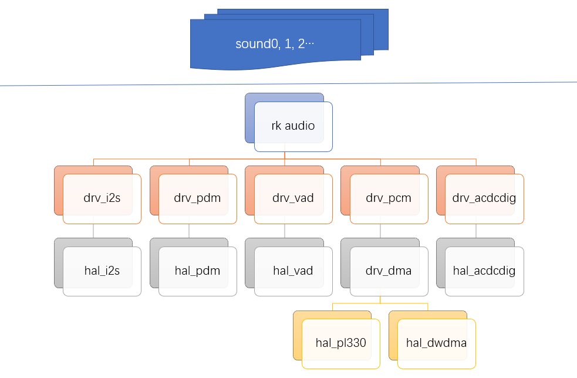

# **Rockchip AUDIO开发指南**

文件标识：RK-KF-YF-054

发布版本：V1.1.0

日期：2019-12-10

文件密级：公开资料

---
**免责声明**

本文档按“现状”提供，福州瑞芯微电子股份有限公司（“本公司”，下同）不对本文档的任何陈述、信息和内容的准确性、可靠性、完整性、适销性、特定目的性和非侵权性提供任何明示或暗示的声明或保证。本文档仅作为使用指导的参考。

由于产品版本升级或其他原因，本文档将可能在未经任何通知的情况下，不定期进行更新或修改。

**商标声明**

“Rockchip”、“瑞芯微”、“瑞芯”均为本公司的注册商标，归本公司所有。

本文档可能提及的其他所有注册商标或商标，由其各自拥有者所有。

**版权所有© 2019福州瑞芯微电子股份有限公司**

超越合理使用范畴，非经本公司书面许可，任何单位和个人不得擅自摘抄、复制本文档内容的部分或全部，并不得以任何形式传播。

福州瑞芯微电子股份有限公司

Fuzhou Rockchip Electronics Co., Ltd.

地址：     福建省福州市铜盘路软件园A区18号

网址：     [www.rock-chips.com](http://www.rock-chips.com)

客户服务电话： +86-4007-700-590

客户服务传真： +86-591-83951833

客户服务邮箱： [fae@rock-chips.com]

---

**前言**

**概述**

**产品版本**
| **芯片名称**            | **内核版本** |
| ----------------------- | :---------------- |
| RK2206 | FreeRTOS V10.0.1 |

**读者对象**

本文档（本指南）主要适用于以下工程师：
技术支持工程师
软件开发工程师

**修订记录**

| **版本** | **作者** | **日期**   | **修改说明**     |
| -------- | -------- | :--------- | ---------------- |
| V1.0.0   | 张学广   | 2019-10-10 | 初始发布         |
| V1.1.0   | 许剑群   | 2019-12-10 | 增加FreeRTOS版本 |

---
[TOC]
---

## 1 概述

Rockchip RKOS 音频驱动基于 FreeRTOS IO 设备驱动模型向 OS 注册音频声卡驱动，本文档主要描述音频框架，音频通路，代码配置以及应用场景。

## 2 软件框架



### 2.1 Driver 层驱动文件

音频驱动位于`src/driver/audio`目录中

| **Driver** | **File**       | **description**                                              |
| ---------- | -------------- | ------------------------------------------------------------ |
| core       | rk_audio.c     | rk 音频框架核心：向上基于IO设备模型向OS层注册声卡驱动；向下管理数字音频接口驱动，codec驱动，dmabuffer等。 |
| acdcdigv2  | drv_acdcdig.c  | 内部ADC，外界模拟麦， 支持立体声录音。                       |
| audpwm     | drv_audiopwm.c | audio pwm驱动，无需DAC，直驱功放放音，中等音质。             |
| i2stdm     | drv_i2stdm.c   | i2stdm数字音频接口驱动，支持i2s, pcm，tdm传输协议。          |
| pcm        | drv_pcm.c      | dma buffer驱动，管理音频dma buffer。                         |
| pdm        | drv_pdm.c      | pdm数字音频接口驱动。                                        |
| vad        | drv_vad.c      | 语音检测模块驱动，系统休眠时，vad实时检测音频，达到阈值，唤醒系统，配合DSP用于语音识别。 |

### 2.2 HAL 层驱动文件

音频驱动位于`src/bsp/hal`目录中，hal层驱动负责对控制器硬件配置的抽象封装，封装出的API一般给硬件无关层驱动调用。

| **Driver** | **File**                                                     | **Description**            |
| ---------- | :----------------------------------------------------------- | -------------------------- |
| core      | lib/hal/inc/hal_audio.h    | 音频基础结构，宏，命令等定义。 |
| acdcdigv2 | lib/hal/src/hal_acdcdigv2.c | 内部adc控制器 API封装。 |
| audpwm | lib/hal/src/hal_audiopwm.c | audiopwm控制器API封装。 |
| i2s | lib/hal/src/hal_i2s.c | i2s控制器API封装。 |
| i2stdm  | lib/hal/src/hal_i2stdm.c | i2stdm控制器API封装。 |
| pdm     | lib/hal/src/hal_pdm.c | pdm控制器API封装。 |
| vad | lib/hal/src/hal_vad.c | vad控制器API封装。 |

### 2.3 Driver 层测试用例

测试用例和工具位于`src/subsys/shell`目录中

| Driver  | File                | Description                                       |
| ------- | ------------------- | ------------------------------------------------- |
| audio   | Shell_AudioDevice.c | 用于验证音频流程通路，适用于FPGA \ system bringup |
| tcapure | tcapure.c           | 用于录制音频， 可录制WAV音频于文件系统中。        |
| tplay   | tplay.c             | 用于播放音乐，可播放文件系统中的WAV音频。         |

## 3 常用接口说明

### 3.1 IO模型接口

音频应用开发接口调用

| **API**       | **Description**                    |
| ------------- | ---------------------------------- |
| rkdev_find    | 根据声卡名称获取声卡设备。         |
| rkdev_open    | 打开相应声卡设备。                 |
| rkdev_control | 设置声卡设备参数。                 |
| rkdev_write   | 往声卡写入数据，比如播放音乐场景。 |
| rkdev_read    | 从声卡读取数据，比如录音场景。     |
| rkdev_close   | 关闭声卡。                         |

### 3.2 控制接口

| CMD                            | Description                                                  |
| ------------------------------ | ------------------------------------------------------------ |
| RK_AUDIO_CTL_HW_PARAMS         | 配置声卡参数：采样率，声道，位宽。                           |
| RK_AUDIO_CTL_START             | 开启相应音频流。                                             |
| RK_AUDIO_CTL_STOP              | 停止相应音频流。                                             |
| RK_AUDIO_CTL_PCM_PREPARE       | 设置声卡的dma buffer，一般使用uncache buffer，使用cache buffer时，需要配合清cache操作，保证一致性。 |
| RK_AUDIO_CTL_PCM_RELEASE       | 释放声卡的dma buffer。                                       |
| RK_AUDIO_CTL_PCM_BUFFER_STATUS | 查询dma buffer的状态，指针位置，一般用于查询buffer空间余量。 |

## 4 常用数据结构说明

### 4.1 struct audio_buf

音频buffer的描述， 用于配置声卡的dma buffer，一般传入申请的uncache buffer，如果是cache buffer，那么需要做相应的clean/invalidate cache操作。

| Members     | Description                    |
| ----------- | ------------------------------ |
| buf         | buf指针，指向分配的buffer。    |
| buf_size    | 描述buffer大小，单位是uframe。 |
| period_size | 描述period大小，单位是uframe。 |

NOTE：1 frame = channels * sample bits / 8。

### 4.2 struct audio_buf_status

描述音频buffer的状态。

| Members  | Description                                                  |
| -------- | ------------------------------------------------------------ |
| hw_ptr   | 硬件指针位置，表示dma传输了多少数据，单位是uframe。          |
| appl_ptr | 应用指针位置，表示应用程序读或者写了多少数据，单位是uframe。 |

### 4.3 struct audio_params

描述音频的参数：采样率， 声道数，位宽。

| Members    | Description |
| ---------- | ----------- |
| sampleRate | 采样率。    |
| sampleBits | 位宽。      |
| channels   | 声道数。    |

### 4.4 struct audio_card_desc

描述一个声卡的构成，一般在板级文件board.c中定义相应的声卡。

| Members      | Description                                                  |
| ------------ | ------------------------------------------------------------ |
| name         | 描述声卡名，声卡初始化创建时，以此前缀 + 流类型（c/p) 创建声卡流设备。比如声卡名为“sound0"，声卡支持录音和放音，那么声卡创建时，将会创建"sound0c"， ”sound0p“两个音频流设备，分别为声卡0录音设备， 声卡0放音设备。 |
| dai          | 相应的数字音频接口实例，比如I2STDM0, PDM0等。                |
| vad          | 关联VAD语音唤醒模块， 一般配合DSP使用做语音识别。            |
| codec        | 相应的codec实例，比如内部的acdcdig codec或者外挂的第三方codec。如果无需codec时，可赋值为NULL，这种类型的声卡为寄存器无关的codec，比如数字麦声卡。 |
| codec_master | 描述codec是否做为master。                                    |
| clk_invert   | 描述clk是否反相。                                            |
| playback     | 描述是否支持播放。                                           |
| capture      | 描述是否支持录音。                                           |
| format       | 描述接口协议类型。                                           |
| trcm_mode    | 仅用于I2STDM接口，表示是否启用trcm模式。                     |
| mclkfs       | 描述mclk与lrck的分频比。一般用于根据lrck，自动计算相应的mclk。 |

## 5 开发要点

### 5.1 添加一个新的声卡

根据硬件原理图，确定相应声卡使用的数字音频接口， codec。这里以硬件使用i2s1连接es8388为例。

- 芯片自带codec，需要实现相应hal driver，做到最大程度的共用性。
- 第三方codec，可只移植driver驱动。

#### 5.1.1 添加codec驱动

```
待支持
```

#### 5.1.2 添加板级声卡描述

在`src/bsp/RK2206/board/rk2206_[evb/story]/board.c`添加声卡描述

```C
    {
        .name = "sound3",
        .dai = I2STDM1,
        .codec = ACDCDIG,
        .codec_master = true,
        .capture = true,
        .playback = true,
        .trcm_mode = TRCM_NONE,
        .mclkfs = 0,  /* The codec is master and match mclk by itself. */
        .format = AUDIO_FMT_I2S,
    },
```

在1src/driver/audio/codecs/Kconfig1添加声卡menuconfig配置

```C
menuconfig DRIVER_CODEC
    bool "Enable CODEC"
    default n

    if DRIVER_CODEC
    config DRIVER_CODEC_ACDCDIG
        bool "Enable ACDCDIG"
        select MCU_HAL_ACDCDIG
        select DRIVER_I2C2
        default n
```

#### 5.1.3 menuconfig配置

通过menuconfig配置使能相应的声卡。

```C
(top menu) → BSP Driver → Enable CODEC
[*] Enable ACDCDIG
[ ] Enable RK812 (NEW)
[ ] Enable strict capture 16kHz and playback 48kHz (NEW)
[ ] Enable PA Control (NEW)
```

#### 5.1.4 测试

通过以上步骤，一个声卡添加使能完成，可通过audio.rx /audio.tx对声卡录放音。

通过dev.list查询声卡设备

| 支持3种放音设备 | sound0p <- i2stdm0  |
| --------------- | ------------------- |
|                 | sound1p <- audiopwm |
|                 | sound3p <- i2stdm1  |
| 支持3种录音设备 | sound0c <- i2stdm0  |
|                 | sound2c <- pdm      |
|                 | sound3c <- i2stdm1  |

```C
RK2206>dev.list
---------------------------------------------------------------------------------------------------
working         0       DISABLE         0       0       0       0       2       4       vad
working         0       DISABLE         0       0       0       0       2       1       i2stdm0
working         0       DISABLE         0       0       0       0       3       0       sound0p
working         0       DISABLE         0       0       0       0       3       1       sound0c
working         0       DISABLE         0       0       0       0       2       0       audiopwm
working         0       DISABLE         0       0       0       0       3       2       sound1p
working         0       DISABLE         0       0       0       0       2       3       pdm
working         0       DISABLE         0       0       0       0       3       5       sound2c
working         0       DISABLE         0       0       0       0       2       2       i2stdm1
working         0       DISABLE         0       0       0       0       3       6       sound3p
working         0       DISABLE         0       0       0       0       3       7       sound3c
```

通过audio.rx录音，audio.tx放音

```
audio.tx -D sound3p -t 10 -f 2
```

```
audio.rx -D sound3c -r 16000 -c 2 -b 16 -p 1024 -n 2 -t 10 -f 2
```

### 5.2 VAD使用

如果需要语音唤醒，则需要配置VAD，VAD的中断可配置为由CPU响应或者由DSP响应：

- DSP：配合DSP中的算法， 实现语音唤醒以及关键词识别。
- CPU：一般仅用于调试VAD。

```C
(top menu) → BSP Driver → Enable AUDIO
[*] VAD
        VAD irq handler (handled by CPU)  --->
```

使能编译烧写固件后，系统中可执行$dev.list查看声卡设备和vad设备。

再结合DSP，即可测试语言唤醒以及关键词识别。

### 5.3 编程示例

#### 5.3.1 录音示例

1. 暂时支持8个声卡，devid如下

```C
    AUDIO_DEV0_P,
    AUDIO_DEV0_C,
    AUDIO_DEV1_P,
    AUDIO_DEV1_C,
    AUDIO_DEV2_P,
    AUDIO_DEV2_C,
    AUDIO_DEV3_P,
    AUDIO_DEV3_C,
    AUDIO_DEV4_P,
    AUDIO_DEV4_C,
    AUDIO_DEV5_P,
    AUDIO_DEV5_C,
    AUDIO_DEV6_P,
    AUDIO_DEV6_C,
    AUDIO_DEV7_P,
    AUDIO_DEV7_C,
```

2. 以同步模式打开声卡(目前不支持异步模式)

```C
HDC audio_dev = rkdev_open(DEV_CLASS_AUDIO, devid, SYNC_MODE);
```

3. 初始化音频dma循环buffer，这里分配uncache buffer。

```C
    abuf.period_size = period_size;
    abuf.buf_size = period_size * period_count;
    size = abuf.buf_size * channels * (bits >> 3); /* frames to bytes */
    abuf.buf = (uint8 *)rk_dma_malloc(size);
    buffer = rkos_memory_malloc(size);
    ret = rkdev_control(audio_dev, RK_AUDIO_CTL_PCM_PREPARE, &abuf);
    RK_ASSERT(ret == RK_SUCCESS);
```

4. 设置采样率，声道， 位宽，如下示例设置采样率16k，立体声， 16bit采样精度。

```C
    param.channels = AUDIO_CHANNELS_2;
    param.sampleRate = AUDIO_SAMPLERATE_16000;
    param.sampleBits = AUDIO_SAMPLEBITS_16;
    ret = rkdev_control(audio_dev, RK_AUDIO_CTL_HW_PARAMS, &param);
    RK_ASSERT(ret == RK_SUCCESS);
```

5. 读取音频数据，BLOCK方式读取。建议应用编程时读取数据为一线程，数据编码为另一线程，保证数据读取不间断。

```C
   while (timeout > 0)
    {
        if (rkdev_write(audio_dev, 0, buffer, abuf.period_size) != abuf.period_size)
        {
            break;
        }
    }
```

6. 停止录音。

```C
ret = rkdev_control(audio_dev, RK_AUDIO_CTL_STOP, NULL);
```

7. 释放buffer资源。

```C
ret = rkdev_control(audio_dev, RK_AUDIO_CTL_PCM_RELEASE, NULL);
free(buffer);
rk_dma_free(abuf.buf);
```

8. 关闭声卡。

```C
rkdev_close(audio_dev);
```

#### 5.3.2 放音示例

放音基本同录音示例，读数据如下

```C
while (count && (rkdev_read(audio_dev, 0, buffer, abuf.period_size) != abuf.period_size))
{
    if (!rkdev_write(audio_dev, 0, buffer, abuf.period_size))
    {
        break;
    }
    count--;
}
```

