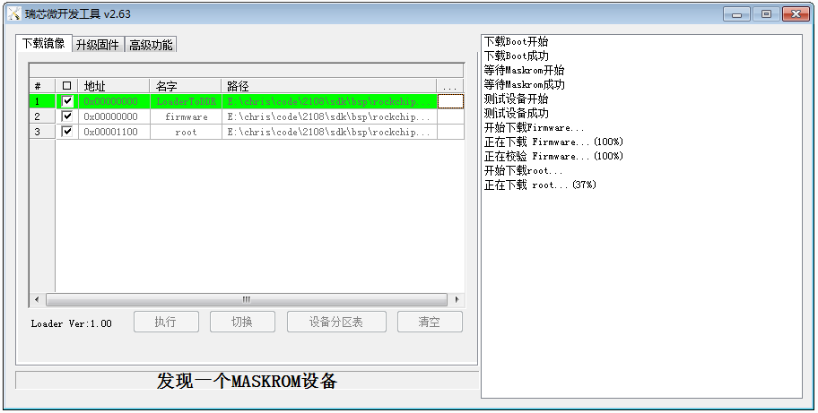

# RK2108B_EVB使用指南

发布版本：1.0

作者邮箱：zyw@rock-chips.com

日期：2019.08

文件密级：仅限RK内部使用

***

**前言**

**概述**

**产品版本**

| **芯片名称** | **内核版本** |
| ------------ | ------------ |
| RK2108   | RTthread  |

**读者对象**

本文档（本指南）主要适用于以下工程师：

技术支持工程师

软件开发工程师

**修订记录**

| **日期**   | **版本** | **作者** | **修改说明** |
| ---------- | -------- | -------- | ------------ |
| 2019-08-13 | V1.0     | 钟勇汪   |              |

***

[TOC]

***

## 1. 板子介绍

 RK2108B_EVB_V10 板正面照
   

 注意：

1） 板子需要使用 12V 电源才能开机；

2） OTG 口连接电脑完成固件升级；

3） Debug 串口自带 FT232 串口转 USB 芯片，Windows 下需要安装驱动，Ubuntu 环境下可以使用 minicom 等串口工具；

4） 在 OTG 口连接着电脑，按住 MaskRom 键的同时，短按一下 Reset 键，板子会进入到升级状态，松开MaskRom 键，即可开始下载固件。

## 2. SDK下载

```
repo init --repo-url ssh://10.10.10.29:29418/android/tools/repo -u ssh://10.10.10.29:29418/rtos/rt-thread/manifests -b master
```

需要确保您的公钥在29服务器上有开通权限。

## 3. 编译SDK

编译系统的搭建：

	sudo add-apt-repository ppa:team-gcc-arm-embedded/ppa
	sudo apt-get update
	sudo apt-get install gcc-arm-embedded scons clang-format astyle libncurses5-dev gcc
编译：

```
cd rt-thread/bsp/rockchip/rk2108
scons -j8
mkimage.sh
```

生成的固件在 Image 目录，Firmware.img 是编译新生成的固件文件。

编译默认使用的配置是 rtconfig.h ，如果想修改配置，可以运行

```
cd rt-thread/bsp/rockchip/rk2108
cp board/rk2108b_evb/defconfig .config
scons --menuconfig
```

注意：scons --menuconfig 会先以当前目录的 .config 为基础配置,修改后保存是生成新的 .config 和 rtconfig.h，所以我们在前面多做了一部把defconfig复制成 .config 的操作。而真正参与编译的是 rtconfig.h 文件。

你也可以直接使用 board/rk2108b_evb/defconfig 为配置来编译，使用方法：

```
cd rt-thread/bsp/rockchip/rk2108
scons --useconfig=board/rk2108b_evb/defconfig
scons -j8
mkimage.sh
```

注意： scons --useconfig=board/rk2108b_evb/defconfig 实际仅生成 rtconfig.h 用于编译，它不会去修改 .config。所以此时再去 scons --menuconfig，又会使用 .config 里面的配置来生成 rtconfig.h。

*更多说明请参考《Rockchip_Developer_Guide_RT-Thread_CN》*

## 4. 升级固件

### 4.1 Linux版升级工具

下载Linux板升级工具,链接：

```
smb://10.10.10.164/rtos_repository/RK2108-Pisces/03-Tools/Linux_Upgrade_Tool_v1.38.zip
```

使用方法：

```
先让板子进入Maskrom状态
cd rt-thread/bsp/rockchip/rk2108
sudo ./upgrade_tool db Image/rk2108_db_loader.bin
sudo ./upgrade_tool wl 0 Image/Firmware.img
sudo ./upgrade rd
```


### 4.2 Windows版升级工具

下载 Windows 升级工具，链接：

	smb://10.10.10.164/rtos_repository/RK2108-Pisces/03-Tools/DriverAssitant_v4.91.zip
	smb://10.10.10.164/rtos_repository/RK2108-Pisces/03-Tools/AndroidTool_Release_v2.63.rar

在升级之前,需要先安装 USB 驱动 DriverAssitant_v4.91。

打开升级工具，选择固件：

	第1项“LoaderToDDR”选择bsp/rockchip/rk2108/Image/rk2108_db_loader.bin
	第2项“Firmware”选择bsp/rockchip/rk2108/Image/Firmware.img


升级按 Reset，RK2108 EVB 的 debug 口也能看到打印：

	 \ | /
	- RT -     Thread Operating System
	 / | \     3.1.3 build Jul 26 2019
	 2006 - 2019 Copyright by rt-thread team
	mount fs[elm] on / failed.
	testing sleep 1s:
	msh />actual tick is:1000


## 5. JTAG调试

调试方法参考《Rockchip_User_Guide_J-Link_CN》

RK2108 的 JTAG 口和 UART0 口是复用的 IO 口，所以 JTAG 和 Debug 串口无法同时使用。如果需要 JTAG，需要在scons --menuconfig 中把

```
M4_JTAG_ENABLE [=y]
```

如果您需要同时使用 JTAG 和 Debug 串口，建议飞线使用 UART2(但会造成BT无法使用），飞线后别忘了修改以下配置来启用 Debug 串口：

```
RT_CONSOLE_DEVICE_NAME [=uart2]
RT_USING_UART2 [=y]
```

如果需要用 UART2 连接蓝牙，可以飞线 UART1_TX_M0 和 UART1_RX_M0 到 Debug 口，需要修改 iomux.c 代码让 GPIO0_D1，GPIO0_D2 工作在 PIN_CONFIG_MUX_FUNC2 模式。

另外，RK2108 的固件是默认编译成XIP模式的，需要烧录到 Flash 才可运行，JTAG 无法直接下载此类型固件到 SRAM。如果需要使用 JTAG 上位机（Ozone，JLinkExe）下载固件 rtthread.elf，需要关闭 XIP 开关（参考下文）。


## 6. 文件系统

RK2108 默认支持 FAT 文件系统，在 bsp/rockchip/rk2108/board/rk2108b_evb/mnt.c 可以找到分区表：

```
struct rt_flash_partition flash_parts[] =
{
    /* gpt */
    {
        .name       = PARTITION_GPT,
        .offset     = 0x0,
        .size       = 0x10000,
        .mask_flags = PART_FLAG_RDONLY,
    },

    /* loader */
    {
        .name       = PARTITION_LOADER,
        .offset     = 0x10000,
        .size       = 0x10000,
        .mask_flags = PART_FLAG_RDONLY,
    },

    /* firmware */
    {
        .name       = PARTITION_FIRMWARE,
        .offset     = 0x20000,
        .size       = 0x200000,
        .mask_flags = PART_FLAG_RDWR,
    },

    /* root */
    {
        .name       = PARTITION_ROOT,
        .offset     = 0x220000,
        .size       = 0xde0000,
        .mask_flags = PART_FLAG_RDWR,
    },

    /* end */
    {
        .name = RT_NULL,
    }
};
```

分区表里面的单位是 Byte，下面升级工具用到的偏移和 size 是扇区数。root 分区的 offset 是 0x220000，对应 block 号是：0x220000/512 = 0x1100，size 的 block 数 = 0xde0000/512 = 0x6f00。

目前的代码工程中，使用 scons && ./mkimage.sh 编译打包后得到的 Firmware.img 文件并不包含这个 root 分区。所以需要自行制作 root 分区固件，并使用下载工具自行下载 root 分区。方法如下：

制作 size 为 10MB 的 VFAT 分区：

```
dd if=/dev/zero of=./root.img bs=4096 count=2560
mkfs.msdos -S 4096 root.img
mkdir rootfs
sudo mount -t vfat ./root.img ./rootfs
cp -r /path/to/your/root/dir/* ./rootfs
sudo umount ./rootfs
# 此时root.img就是你要的根文件系统了
```

##### 烧录 root 分区：

###### Linux 下操作方式：

```
sudo upgrade_tool db rk2108_db_loader.bin
sudo upgrade_tool wl 0x1100 root.img
```

###### Windows 下操作方式：



##### 从板上读取 root 分区：

仅支持 Linux 上操作：

```
$sudo upgrade_tool db rk2108_db_loader.bin
$sudo upgrade_tool 选择1，进入操作模式

Rockusb>RL 0x1100 0x6f00 root_out.img
```


## 7.其他问题

1. #### 如何提交补丁

   git checkout -b xxx //新建本地分支,分支名为 xxx

   修改代码...

   bsp/rockchip/common/hal 目录下的补丁: **git push rk xxx:refs/for/master**

   其他目录下的补丁: **git push rk xxx:refs/for/develop**


2. #### 怎么关闭XIP

   ```
   vi rt-thread/bsp/rockchip/rk2108/rtconfig.py
   ```

   搜索 "XIP"， 默认是 = 'Y'，如需关闭 XIP ，改完 = 'N'

