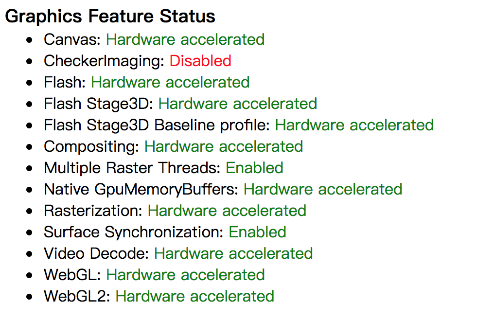
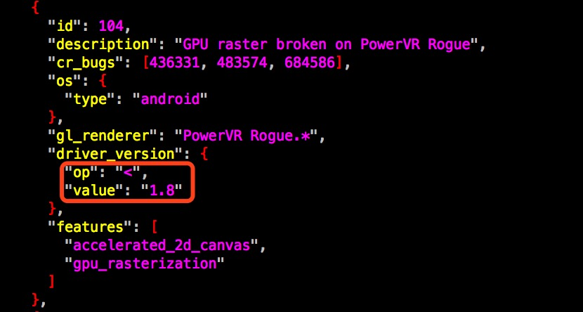

# **浏览器FAQ**

发布版本：1.0

作者邮箱：cmc@rock-chips.com

日期：2018.05

文件密级：公开资料

***

**前言**

**概述**

**产品版本**

| **芯片名称** | **内核版本** |
| ------------ | ------------ |
| 全系列       | 通用         |

**读者对象**

本文档（本指南）主要适用于以下工程师：

技术支持工程师

软件开发工程师

**修订记录**

| **日期**   | **版本** | **作者** | **修改说明** |
| ---------- | -------- | -------- | ------------ |
| 2017-05-17 | V1.0     | 陈谋春   |              |

***

[TOC]

***

## 1 Webview & Browser & Chrome

   在本文开始前，有必要明确一下这三者的差别，Webview是Android框架层的核心组件，所有应用都可以通过内嵌Webview的方式很方便的集成Web功能，而不需要自己去移植庞大复杂的Web Engine；而 Browser则是Andr-oid提供的一个全功能网页浏览器，其本质也是通过Webview来实现的；最后一个Chrome则是基于Chromium开源工程的，和桌面上最流行的Chrome浏览器是同一份代码编译的。

## 2 HTML5

   HTML5是W3C最新的Web标准，用来取代之前的 HTML、XHTML 以及 HTML DOM，增加了很多新的特性：

- 用于绘画的 canvas 元素

- 用于媒介回放的 video 和 audio 元素

- 对本地离线存储的更好的支持

- 新的特殊内容元素，比如 article、footer、header、nav、section

- 新的表单控件，比如 calendar、date、time、email、url、search

   很多人把HTML5和音视频、游戏划等号，这其实是不对，HTML5包含的新特性非常多，我上面列的也并不完整，有兴趣的可以看完整的[HTML5规范](https://www.w3.org/TR/html5/)。

## 3 Webview FAQ

### 3.1 如何升级Webview

   Web Engine本身非常庞大，外围依赖模块又多，并且又是完全开放的，所以随着系统组件或网页内容的更新，难免会有一些BUG和兼容性问题，目前最新的Webview已经是基于Chromium主线分支，版本发布和Chrome一样，也是每个月一个稳定版本。所以对于Browser，还有其他基于Webview实现的应用，如果有碰到未知问题，都可以尝试升级Webview看能否解决。Android 5.1开始大致的升级步骤如下（老版本的Android和最新版本的Web-view不兼容）：

- Step1: 选择一个稳定版本

  Android的Webview目前有很多发行版，具体如下(只讨论稳定版本)：

  Name | PackageName | 获取方式 | 自动更新[^1] | 稳定性
  - | :-: | -: |:-: |:-:
  Android WebView | com.android.webview | Android自带 | 否 | 最高
  Chrome Stable[^3] | com.android.chrome | Chrome自带 | 可 | 高
  Google WebView[^2] | com.google.android.webview | 随GMS包发布 | 可 | 高
  Custom Webview | com.android.webview | 自编译 | 否 | 中

  从上表可以看出，*Google WebView & Chrome Stable*都可以通过Google Play来升级，通过GMS认证的机器默认就是用的这两种Webview，要升级也最容易，可以直接升级GMS包，也可以单独替换Webview的APK。
  [^1]: 通过Google Play来更新
  [^2]: 这是GMS包里默认的Webview，需要过Google GMS认证才能集成
  [^3]: 只支持Android 7.0 & after

- Step2: 修改系统Webview的包名(可选)

  Android 5.1开始，Webview具体实现从框架层剥离出来，通过一个包名来控制加载真正的Webview实现，默认的包名是*com.android.webview*，如果要切换到不同的Webview实现，就要先改掉系统默认的包名，具体修改办法如下（如果只升级版本，不切换发行版可跳过这一步）：

    1. For android 6.0 & before
   老版本的Android配置文件是/path_to_android/frameworks/base/core/res/res/values/config.xml，其中相关配置如下：
<string name="config_webViewPackageName" translatable="false">com.android.webview</string>
   其中com.android.webview可以改成你要切到的发行版包名，例如com.google.android.webview。
    2. For android 7.0 & after
       新版本的Android配置文件是/path_to_android/frameworks/base/core/res/res/xml/config_webview_-packages.xml，改成如下配置：

```xml
<?xml version="1.0" encoding="utf-8"?>
    <!-- Copyright 2015 The Android Open Source Project

         Licensed under the Apache License, Version 2.0 (the "License");
         you may not use this file except in compliance with the License.
         You may obtain a copy of the License at

              http://www.apache.org/licenses/LICENSE-2.0

         Unless required by applicable law or agreed to in writing, software
         distributed under the License is distributed on an "AS IS" BASIS,
         WITHOUT WARRANTIES OR CONDITIONS OF ANY KIND, either express or implied.
         See the License for the specific language governing permissions and
         limitations under the License.
    -->

    <webviewproviders>
        <!-- The default WebView implementation -->
        <webviewprovider description="Android WebView" packageName="com.android.webview" availableByDefault="true"></webviewprovider>
        <webviewprovider description="Chrome Stable" packageName="com.android.chrome" availableByDefault="true" />
        <webviewprovider description="Google WebView" packageName="com.google.android.webview" availableByDefault="true" isFallback="true" />
</webviewproviders>
```

   系统在开机过程中会自动根据这个配置文件中的顺序来搜索设备中已安装并启用的包信息，找到以后直接返回，例如上面配置中的三个发行版如果都安装并启用了，则默认的包名是*com.android.webview*。我这里不建议修改这三个发行版的顺序，因为本身已经是按稳定性排序过的了。

- Step3: 手动安装并测试

```shell
  # Uninstall any webview updates
  adb uninstall com.google.android.webview  # 失败也没关系
  adb uninstall com.android.webview  # 失败也没关系
  # On Android 8.0 and up:
  adb disable-verity; adb reboot

  # Remove webview from system partition
  adb root
  adb remount
  adb shell stop
  adb shell rm -rf /system/app/webview /system/app/WebViewGoogle /system/app/WebViewStub
  adb shell start
  Install the built apk.
  adb install -r -d out/Release/apks/SystemWebView.apk
```

  安装完成后就可以验证问题是否得到解决，以及是否带来新的问题。

- Step4: 集成到发布固件

  验证ok以后就需要集成到固件中发布，具体如下：

    1. For android 5.1

```shell
    # webview_xxx.apk即你要替换的Webview APK
    cp webview_xxx.apk webview.zip
    mv webview_xxx.apk webview.apk

    # 解压获取libwebviewchromium.so
    unzip webview.zip

    # 预制到Android工程
    cp webview.apk vendor/rockchip/common/webkit/
    cp libwebviewchromium.so vendor/rockchip/common/webkit/
```

   修改/path_to_android/vendor/rockchip/common/webkit/webkit.mk，具体如下：

```shell
PRODUCT_COPY_FILES += \
    vendor/rockchip/common/webkit/webview.apk:system/app/webview/webview.apk \
    vendor/rockchip/common/webkit/libwebviewchromium.so:system/lib/libwebviewchromium.so
```

​    2. For android 6.0 and up

```shell
# webview_xxx.apk即你要替换的Webview APK
cp external/chromium-webview/prebuilt/$ARCH/webview.apk
```

### 3.2 视频无法播放

   这里说的视频如果没有特别说明，都是指的HTML5 Video，无法播放指的是必现的那种，不是随机或特定条件下触发的无法播放。

#### 3.2.1 手势限制

   Android上的HTML5 Video默认都要通过手势（触摸和鼠标操作都算）来触发，如果网页直接在一些非手势触发的侦听里直接调用HTML5 Video的play函数，是会被直接忽略掉的。如果不喜这个特性，可以通过如下代码来关闭：

```java
webview.getSettings().setMediaPlaybackRequiresUserGesture(false);
```

   如果要让所有调用Webview的应用都生效，则可以这样修改/path_to_android/frameworks/base/core/java/an-droid/webkit/WebView.java：

```java
public WebSettings getSettings() {
        checkThread();
    	mProvider.getSettings().setMediaPlaybackRequiresUserGesture(false);
        return mProvider.getSettings();
    }
```

#### 3.2.2 安全限制

   从某个版本的Webview开始，不再允许HTTPS和HTTP混用，即HTTPS的网页是不允许嵌入HTTP的内容的，所以就有一些客户反应，Android 6.0开始的Webview无法播放QQ视频，认真看一下logcat就会发现是视频的URL不符合这条安全规则被阻止了。如果不喜这个特性，可以通过如下代码来关闭：

```java
webview.getSettings().setMixedContentMode(WebSettings.MIXED_CONTENT_ALWAYS_ALLOW);
```

#### 3.2.3 其他问题

   还有一些比较少见的播放限制也会导致无法播放，例如视频源在本地时要保证视频的访问权限，视频在全屏播放的时候需要电源锁的权限，这些都需要APK在Manifest里正确声明，这个问题logcat会抛一个异常出来并且注明是哪个权限失败了；还有就是GPU的最大纹理会限制视频的最高分辨率，所以一些老的GPU可能会不支持4k视频，这个logcat也会有明确的提示，并且打开Chrome，在地址栏输入*chrome://gpu*，然后下拉找到*Video Acceleration Information*这个表格，里面有详细的视频限制。

### 3.3 视频卡顿

   目前最常见的视频卡顿大致分如下几类：

- 视频走的软件解码，导致受限于cpu处理能力

  解决办法：

    1. 首先要现确认soc是否支持这个视频格式的硬件解码，如果是支持的，则需要查一下Meida框架层是否哪里判断错误或者没实现，目前Webview调用Media只有两种方式：MediaPlayer和MediaCodec，后者是新版本的默认方式。
    2. 如果硬件确实不支持，则可以想办法让网站换个视频格式，目前大部分网站都会通过识别UserAgent，调用HTML5 Audio/Video的[canPlayType()](http://www.w3school.com.cn/tags/av_met_canplaytype.asp)函数等方式来识别本机支持的视频格式。所以这种情况可以先看网站的Javascript源码，即使混淆过，大部分判断逻辑还是能猜出的，如果确实有调用canPlayType则可以先把当前的视频格式从媒体框架的支持列表中去掉，即MediaCodecList[^4]中去掉，可以手写一个简单网页来验证你的修改结果，可在这个[Demo](http://www.w3school.com.cn/tiy/t.asp?f=html5_av_met_canplaytype)基础上修改。如果MediaCodecList修改以后canPlayType返回还是不对，那就要查一下整个调用路径了，因为中间代码有大量的Blacklist的修改，有兴趣可以看其中一部分[代码](https://cs.chromium.org/chromium/src/media/base/android/java/src/org/chromium/media/MediaCodecUtil.java?type=cs&q=isDecoderSupportedForDevice&sq=package:chromium&g=0&l=359)。这里就不详解了。

- 主动丢帧，有发现一些应用如爱奇艺会主动丢掉一些帧

  解决办法：

    1. 只有调用MediaCodec或OMX的方式解码，应用才有机会主动丢帧，由于第三方应用并没有源码，这时候通常无法知道应用为什么会主动丢帧，最简单的解决方式就是不让应用主动丢帧，比如丢改MediaCode-c.releaseOutputBuffer(int index, boolean render)，其中render位false就是代码应用要丢帧，不care这个参数即可。

- 内存带宽不足，整个硬件解码流程可以分三个阶段（这里只讲Webview的方式）：VPU解码、缩放裁剪、GPU贴图，只有中间这个阶段有时候是CPU做的（很多时候有RGA加速），但全程对内存带宽都有一定要求，所以大部分时候瓶颈都在内存带宽上。

  解决办法：

    1. 提高内存频率验证效果

  [^4]: /path_to_android/frameworks/base/media/java/android/media/MediaCodecList.java

### 3.4 视频无法循环或自动播放

   循环和自动播放都是网页通过属性来控制，具体可以参见这两个Demo：[loop](http://www.w3school.com.cn/tags/av_prop_loop.asp) & [autoplay](http://www.w3school.com.cn/tags/av_prop_autoplay.asp)。其他音视频接口和属性完整描述可参见[W3C](http://www.w3school.com.cn/tags/html_ref_audio_video_dom.asp)。

### 3.5 动画或游戏卡顿

   动画和游戏主要有两种实现CSS和HTML5 Canvas，这两种方式都是支持GPU硬件加速的，但是Chromium有个黑名单机制，会根据GPU和各种软件驱动版本来决定是否开启硬件加速，以解决各种兼容性BUG。所以如果碰到网页动画卡顿，并且更新到新版本也解决不了的时候，可以用Chrome打开地址*chrome://gpu*，就会看到当前系统的硬件加速情况，类似如下：



   关注这些子项即可：Canvas & Rasterization &  WebGL & WebGL2，红色即表示关闭，具体的原因可以下拉，关注Problems Detected，会给出简单的原因描述和BUG号，根据这个BUG号搜索如下目录：/path_to_chromium/gpu/config，就能找到判定条件，例如：



   上图就表示，PowerVR Rogue全系列在Android系统下，如果GPU驱动版本小于1.8则关闭Canvas & Rasterizat-ion两个加速。这时候我们就知道只要升级一下PowerVR的驱动到1.8以上的版本即可。

### 3.6 黑屏、白屏和闪烁

   碰到这种问题一般先看logcat上有没有明确的报错，比如Graphics Buffer溢出，GPU奔溃或OpenGL报错，框架层异常等，然后请这些外围模块的工程师协助。当然还有一种情况就是logcat找不到明显报错，这时候可以尝试升级Webview版本，还不行的话就升级GPU驱动版本，大部分情况下这些问题都是Webview和图形驱动的兼容问题导致。

### 3.7 如何修改UserAgent

   修改UserAgent目的是为了伪装设备端，比如伪装成Desktop或Ipad等，可以通过如下代码修改Webview的Use-rAgent：

```java
webview.getSettings().setUserAgentString("");
```

   如果要修改Chrome的UserAgent，可以通过如下方式实现：

```shell
echo 'chrome --user-agent="Mozilla/5.0 (Linux; Android 4.4; Nexus 7 Build/KRT16M) AppleWebKit/537.36 (KHTML, like Gecko) Chrome/30.0.1599.92 Safari/537.36"' > /data/local/chrome-command-line
```

   要预制到固件的话，可以修改/path_to_android/vendor/rockchip/common/webkit/webkit.mk，打开注释，类似如下：

```shell
PRODUCT_COPY_FILES += \
        vendor/rockchip/common/webkit/chrome-command-line:system/etc/chrome-command-line \
        vendor/rockchip/common/webkit/chrome.sh:system/bin/chrome.sh
```

   同时修改/path_to_android/vendor/rockchip/common/webkit/chrome-command-line，替换你想要的UserA-gent。

   ==注意==：修改UserAgent可能会导致兼容变差，例如你伪装成Ipad的Safari浏览器，结果服务器返回的页面就用了Safari才能支持的一些特性，那就会出问题了。

### 3.8 如何实现网址过滤

   Android本身不支持网址过滤功能，要实现这个功能，有三种方式：

- 直接修改/etc/hosts

  下面是一个例子，禁止访问百度：

  ```shell
  127.0.0.1       localhost
  ::1             ip6-localhost
  0.0.0.0         www.baidu.com
  ```

  这个方法很简单，并且是全局有效，但是缺点也很明显：不支持通配符；不支持白名单机制，更新也不方便；通过socket编程可以绕过。

- 修改/path_to_chromium/net/url_request/url_request.cc，Webview的所有请求都会经过这个类，可以在这里去过滤URL，通过控制Read函数是否允许返回数据即可实现管控。

  这个方法缺点很明显，只对调用Webview的浏览器有效，对于自己实现Web Engine的浏览器无效。优点是比较灵活，黑名单和白名单都可以，更新也容易。

- 用netfilter和iptable做包过滤

  这种方法可以实现最灵活也最严格的管控，很多防火墙都是这样实现的，很难绕过。具体方法可以参考这个[教程](https://blog.csdn.net/zhanglianyu00/article/details/50177873)。

### 3.9 无法打开下载文件

   这个主要是由于服务器给文件设置了错误的mime-type，例如给APK设置了*text/plain*，这就导致了浏览器报给下载管理器的类型错了，会导致直接通过消息和下载管理器打开会失败，通过文件管理器可以正确打开。要修正这个问题可以这样修改：

```shell
commit c906b4b4f9a120d28a099fece4a5820127a32201
Author: mouchun chen <cmc@rock-chips.com>
Date:   Wed Jan 7 18:09:29 2015 +0800

    fix wrong mimetype when download file

diff --git a/src/com/android/browser/DownloadHandler.java b/src/com/android/browser/DownloadHandler.java
index 7a24aa4..8c1441d 100755
--- a/src/com/android/browser/DownloadHandler.java
+++ b/src/com/android/browser/DownloadHandler.java
@@ -222,7 +222,9 @@ public class DownloadHandler {
                Log.d(LOGTAG, "referer: " + referer);
         request.setNotificationVisibility(
                 DownloadManager.Request.VISIBILITY_VISIBLE_NOTIFY_COMPLETED);
-        if (mimetype == null) {
+        if (mimetype == null
+                       || mimetype.equalsIgnoreCase("text/plain")
+                       || mimetype.equalsIgnoreCase("application/octet-stream")) {
             if (TextUtils.isEmpty(addressString)) {
                 return;
             }
```

### 3.10 是否支持Adobe Flash

   Adobe从Android 4.3版本开始停止了对Android上Flash插件的支持，我们最后可支持插件的版本是Android 5.1。目前的替代方案有两个：Adobe AIR和HTML5，新的内容可以用这两个来实现，这里更推荐后者。而原来旧的Flash内容，如果有源文件（即fla文件），可以通过新版本的Adobe Flash开发工具直接倒出成两个替代方案。

### 3.11 崩溃和ANR如何处理

   对于这两类问题，在丢到我这边来处理前，我希望能做到这几点，来尽量提高处理效率。

- 先自己简单过一遍log信息

  对于崩溃，可以先看一下logcat，到底死在哪，如果是外围模块比如框架层、Media和Graphics，可以直接转给相关模块工程师。如果是死在浏览器内部，则可以转给我，并且如果是死在Native层需要先提供一下Crash Dump的符号表，方式如下：

  ```shell
  addr2line -e out/target/product/rk3399/symbols/system/lib/libc.so 2000
  ```

  其中libc.so要替换成死掉的那个库，2000替换成死的位置，这些都能在Crash Dump里找到。

  对于ANR，要同时提供logcat和/data/anr/traces.txt，并且先过一下traces.txt看主线程是堵在哪里，如果确认是外围模块，同样可以直接转给相关工程师。

- 有条件的话，试一下其他方案有没有类似问题

- 试一下新版本的Chrome或Webview能否解决这个问题

  ==注意==：Android 6.0开始Webview也是预制APK形式发布，所以也没有符号表了，如果崩溃在libwebviewchromium.so就没法debug，而Chrome一直都是APK发布，但是其崩溃会自动给Google发错误信息，Google会有选择的抽一些来看。

### 3.12 视频有声无影

   这种问题都可以先试一下这样修改能否解决：

```shell
# setprop sys.hwc.compose_policy 0
# stop
# start
```

## 4 How to build Webview

   有兴趣可以参见Google的[说明文档](https://chromium.googlesource.com/chromium/src/+/master/docs/android_build_instructions.md)。需要注意的是，Chromium的提交非常频繁，所以最新分支稳定性不保证，甚至不一定能编译过，如果要出固件的话最好是基于稳定分支LKGR，或则基于指定的稳定版本，可以参考最新版本的Chrome，通过地址栏输入*chrome://version*可以看到版本。切换指定版本可以参考这个[说明文档](https://www.chromium.org/developers/how-tos/get-the-code/working-with-release-branches)。

## 5 How to debug

   有时候某些网页元素显示异常，需要看网页的Layout信息，在旧版本的Android(4.2 & before)，可以通过在地址栏输入*about:debug*等特殊地址来启动dump，Layout信息会以文本形式输出在/sdcard目录。新版本的Webview没有类似的调试手段，但是Chrome可以实现远程调试，具体步骤参见[Google文档](https://developers.google.com/web/tools/chrome-devtools/remote-debugging/?hl=zh-cn)。

   而还有一种情况，APK调用Webview或其他Web Engine出现显示异常，这时候在设备端没有太好的调试手段，这时候又没有网页的作者配合查的话就很麻烦。可以尝试如下办法：

- 如果有对比方案没问题

  可以从两个方面来排查， Android版本是否不一样，可以切到一样的版本对比看看，如果Android版本不好切，可以切Webview版本看看（如果有调用Webview的情况下）；UserAgent是否有差异，可以通过tcpdump来抓包对比，尝试修改UserAgent看能否解决。

- 用设备的UserAgent，通过桌面版的Chrome的开发工具（设置->更多工具-> 开发者工具），弹出的工具栏有一个类似手机的按钮，里面有设备模拟功能，模拟我们的设备端加载同一个网页，然后就能通过Elements选项卡找到显示异常的元素，至少能大幅缩小范围，最后看服务器端能否换一个写法来实现这个元素。


