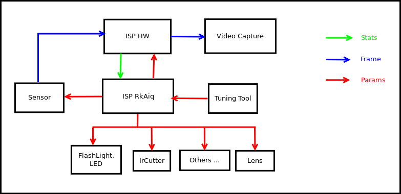
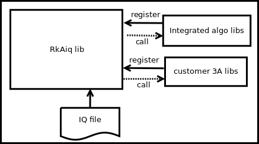
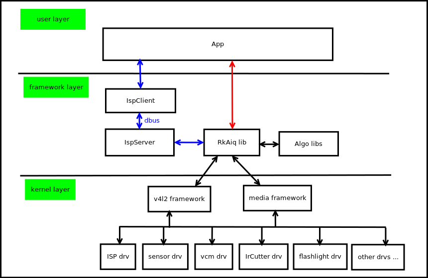
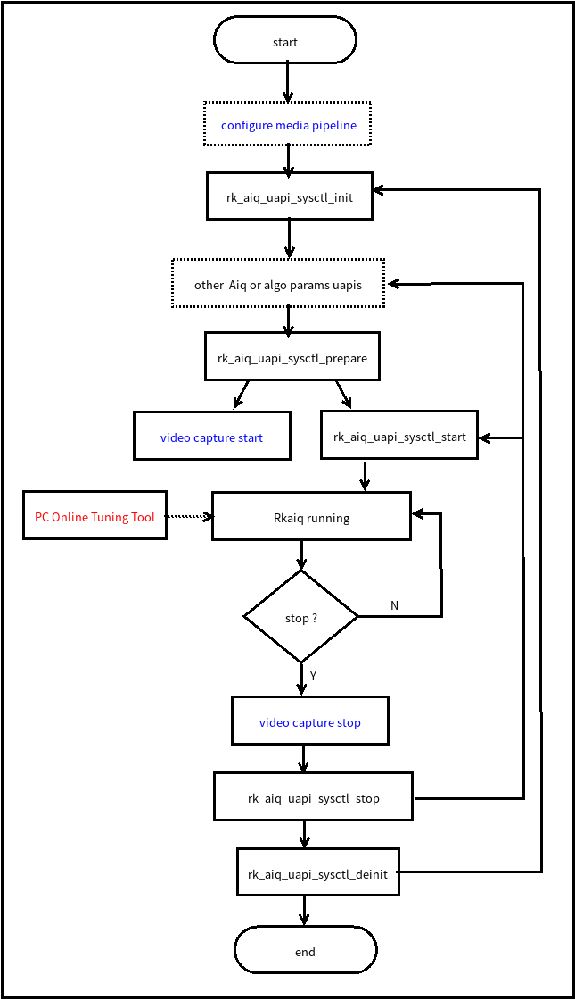

# ISP20 RkAiq 开发参考

文件标识：RK-KF-GX-nnn

发布版本：V1.0.0

日期：2020-06-09

文件密级：□绝密   □秘密   □内部资料   ■公开

**免责声明**

本文档按“现状”提供，瑞芯微电子股份有限公司（“本公司”，下同）不对本文档的任何陈述、信息和内容的准确性、可靠性、完整性、适销性、特定目的性和非侵权性提供任何明示或暗示的声明或保证。本文档仅作为使用指导的参考。

由于产品版本升级或其他原因，本文档将可能在未经任何通知的情况下，不定期进行更新或修改。

**商标声明**

“Rockchip”、“瑞芯微”、“瑞芯”均为本公司的注册商标，归本公司所有。

本文档可能提及的其他所有注册商标或商标，由其各自拥有者所有。

**版权所有 © 2020 瑞芯微电子股份有限公司**

超越合理使用范畴，非经本公司书面许可，任何单位和个人不得擅自摘抄、复制本文档内容的部分或全部，并不得以任何形式传播。

瑞芯微电子股份有限公司

Rockchip Electronics Co., Ltd.

地址：     福建省福州市铜盘路软件园A区18号

网址：     [www.rock-chips.com](http://www.rock-chips.com)

客户服务电话： +86-4007-700-590

客户服务传真： +86-591-83951833

客户服务邮箱： [fae@rock-chips.com](mailto:fae@rock-chips.com)

---

**前言**

**概述**

本文旨在描述RkAiq（Rk Auto Image Quality）模块的作用，整体工作流程，及相关的API接口。主要给
使用RkAiq模块进行ISP功能开发的工程师提供帮助。

**产品版本**

| **芯片名称** | **内核版本** |
| ------------ | ------------ |
| RV1126/RV1109 | Linux 4.19   |

**读者对象**

本文档（本指南）主要适用于以下工程师：

ISP模块软件开发工程师

系统集成软件开发工程师

**各芯片系统支持状态**

| **芯片名称** | **BuildRoot** | **Debian** | **Yocto** | **Android** |
| ------------ | ------------- | ---------- | --------- | ----------- |
| RV1126       | Y             | N          | N         | N           |
| RV1109       | Y             | N          | N         | N           |

**修订记录**

| **版本号** | **作者** | **修改日期** | **修改说明** |
| ---------- | --------| :--------- | ------------ |
| V1.0.0    | 钟以崇 张云龙 徐鸿飞| 2020-06-09 | 初始版本     |

---

**目录**

[TOC]

---

## 1 概述

### 1.1 概述

ISP20 包含了一系列的图像处理算法模块，主要包括：暗电流矫正、坏点矫正、3A、HDR、镜头阴影矫正、
镜头畸变矫正、3DLUT、去噪（包括RAW域去噪，多帧降噪，颜色去噪等）、锐化等。ISP20包括硬件算法实现
及软件逻辑控制部分，RkAiq即为软件逻辑控制部分的实现。
RkAiq软件模块主要实现的功能为：从ISP驱动获取图像统计，结合IQ Tuning参数，使用一系列算法计算出
新的ISP、Sensor等硬件参数，不断迭代该过程，最终达到最优的图像效果。

### 1.2 功能描述


<center>**图1-1 ISP20 系统框图**</center>

ISP20总体软硬件框图如图1-1所示。Sensor输出数据流给ISP HW，ISP HW再输出经过一系列图像处理算法后的图像。RkAiq不断从ISP HW获取统计数据，并经过3A等算法生成新的参数反馈给各硬件模块。Tuning tool可在线实时调试参数，调试好后可保存生成新的iq参数文件。

### 1.2.1 RkAiq架构


<center>**图1-2 RkAiq总体架构图**</center>

ISP20 RkAiq软件设计思路如图1-2所示。主要分成以下四个部分：

1. RkAiq lib 动态库。该库包含了主要的逻辑部分，负责从驱动获取统计，并传送给各个 算法库。
2. Integrated algo libs。Rk提供的静态算法库，已默认注册到RkAiq lib动态库。
3. customer 3A libs。客户可根据算法库接口定义实现自己的3A算法库，或者其他算法库。将自定义算法库注册给RkAiq lib动态库后，可根据提供的接口选择跑自定义库还是跑Rk库。
4. IQ file。iq tuning结果文件，保存的是算法相关参数以及CIS等一些系统静态参数。

### 1.2.2 软件架构


<center>**图1-3 软件架构框图**</center>

ISP20 软件框图如图1-3所示。主要分成以下三层：

1. kernel layer。该层包含所有Camera系统的硬件驱动，主要有ISP驱动、sensor驱动、vcm驱动、flashlight驱动、IrCutter驱动等等。驱动都基于V4L2及Media框架实现。
2. framework layer。该层为RkAiq lib的集成层，Rkaiq lib有两种集成方式：
  - IspServer 方式
    该方式Rkaiq lib跑在 IspServer独立进程，客户端通过dbus与之通信。此外，该方式可为v4l-ctl等现有第三方应用，在不修改源码的情况下，提供具有ISP调试效果的图像。
  - 直接集成方式
    RkAiq lib可直接集成进应用。
3. user layer。用户应用层。

### 1.2.3 软件流程


<center>**图1-4 流程图**</center>

RkAiq接口调用流程如图1-4所示。图中虚线框部分为可选部分，蓝色字体部分为应用需要配合RkAiq流程所作的配置。

- configure media pipeline。可选项，配置ISP20 pipeline，如sensor输出分辨率等等，驱动已有默认配置。

- rk_aiq_uapi_sysctl_init。初始化RkAiq，包括IQ tuning参数及各算法库初始化。

- other Aiq or algo params uapis。可选项，可通过各算法提供的API接口配置需要的参数，以及注册第三方算法库等等。

- rk_aiq_uapi_sysctl_prepare。准备各算法库及各硬件模块的初始化参数，并设置到驱动。

- video capture start。该流程为应用端ISP数据流的开启，该流程需要在rk_aiq_uapi_sysctl_prepare后调用。

- rk_aiq_uapi_sysctl_start。启动RkAiq内部流程，该接口调用成功后，sensor开始输出数据，ISP开始处理数据，并输出处理后的图像。

- Rkaiq running。RkAiq不断从ISP驱动获取统计数据，调用3A等算法计算新参数，并应用新参数到驱动。

- PC Online Tuning Tool。PC端可通过Tuning Tool在线调整参数。

- video capture stop。停止RkAiq流程前需要先停止数据流部分。

- rk_aiq_uapi_sysctl_stop。停止 RkAiq running 流程。可调整参数后再启动或者直接再启动。

- rk_aiq_uapi_sysctl_deinit。反初始化RkAiq。

---

## 2 系统控制

### 2.1 功能概述

系统控制部分包含了AIQ 公共属性配置，初始化 AIQ、运行 AIQ、退
出AIQ，设置 AIQ各模块等功能。

### 2.2 API参考

**rk_aiq_uapi_sysctl_init**

**【描述】**
初始化AIQ上下文。

**【语法】**

```c
rk_aiq_sys_ctx_t*
rk_aiq_uapi_sysctl_init (const char* sns_ent_name,
                         const char* iq_file_dir,
                         rk_aiq_error_cb err_cb,
                         rk_aiq_metas_cb metas_cb);
```

**【参数】**

| **参数名称** | **描述** | **输入/输出**  |
| ------------ | ------------ | ------------ |
| sns_ent_name | sensor entity name  | 输入 |
| iq_file_dir | 标定参数文件路径  | 输入 |
| err_cb | 出错回调函数  | 输入 |
| metas_cb | meta数据回调函数  | 输入 |

**【返回值】**

| **返回值** | **描述** |
| ------------ | ------------ |
| rk_aiq_sys_ctx_t\* | AIQ上下文指针  |

**【需求】**

- 头文件：rk_aiq_user_api_sysctl.h
- 库文件：librkaiq.so

**【注意】**

- 应先于其他函数调用。

**rk_aiq_uapi_sysctl_deinit**

**【描述】**
反初始化AIQ上下文环境。

**【语法】**

```c
void
rk_aiq_uapi_sysctl_deinit( rk_aiq_sys_ctx_t* ctx);
```

**【参数】**

| **参数名称** | **描述** | **输入/输出**  |
| ------------ | ------------ | ------------ |
| ctx | AIQ上下文指针  | 输入 |

**【返回值】**

| **返回值** | **描述** |
| ------------ | ------------ |
| 无 |   |

**【需求】**

- 头文件：rk_aiq_user_api_sysctl.h
- 库文件：librkaiq.so

**【注意】**

- 不应在AIQ处于start状态调用。

**rk_aiq_uapi_sysctl_prepare**

**【描述】**
准备AIQ运行环境。

**【语法】**

```c
XCamReturn
rk_aiq_uapi_sysctl_prepare(const rk_aiq_sys_ctx_t* ctx,
                           uint32_t  width,
                           uint32_t  height,
                           rk_aiq_working_mode_t mode);
```

**【参数】**

| **参数名称** | **描述** | **输入/输出**  |
| ------------ | ------------ | ------------ |
| ctx | AIQ上下文指针  | 输入 |
| width | sensor输出的分辨率宽度，仅用于校验  | 输入 |
| height | sensor输出的分辨率高度，仅用于校验  | 输入 |
| mode | ISP工作模式(NORMAL/HDR)  | 输入 |

**【返回值】**

| **返回值** | **描述** |
| ------------ | ------------ |
| 0 | 成功  |
| 非0 | 失败，详见错误码表  |

**【需求】**

- 头文件：rk_aiq_user_api_sysctl.h
- 库文件：librkaiq.so

**【注意】**

- 应在rk_aiq_uapi_sysctl_start函数之前调用。
- 如果在调用rk_aiq_uapi_sysctl_start函数之后需要重新准备运行环境，那么需要先调用rk_aiq_uapi_sysctl_stop函数，再调用rk_aiq_uapi_sysctl_prepare。

**rk_aiq_uapi_sysctl_start**

**【描述】**
启动AIQ，应在rk_aiq_uapi_sysctl_prepare函数之后调用。

**【语法】**

```c
XCamReturn
rk_aiq_uapi_sysctl_start(const rk_aiq_sys_ctx_t* ctx);
```

**【参数】**

| **参数名称** | **描述** | **输入/输出**  |
| ------------ | ------------ | ------------ |
| ctx | AIQ上下文指针  | 输入 |

**【返回值】**

| **返回值** | **描述** |
| ------------ | ------------ |
| 0 | 成功  |
| 非0 | 失败，详见错误码表  |

**【需求】**

- 头文件：rk_aiq_user_api_sysctl.h
- 库文件：librkaiq.so

**rk_aiq_uapi_sysctl_stop**

**【描述】**
停止AIQ。

**【语法】**

```c
XCamReturn
rk_aiq_uapi_sysctl_stop(const rk_aiq_sys_ctx_t* ctx);
```

**【参数】**

| **参数名称** | **描述** | **输入/输出**  |
| ------------ | ------------ | ------------ |
| ctx | AIQ上下文指针  | 输入 |

**【返回值】**

| **返回值** | **描述** |
| ------------ | ------------ |
| 0 | 成功  |
| 非0 | 失败，详见错误码表  |

**【需求】**

- 头文件：rk_aiq_user_api_sysctl.h
- 库文件：librkaiq.so

**rk_aiq_uapi_sysctl_getStaticMetas**

**【描述】**
AIQ静态信息查询。

**【语法】**

```c
XCamReturn
rk_aiq_uapi_sysctl_getStaticMetas(const char* sns_ent_name, rk_aiq_static_info_t* static_info);
```

**【参数】**

| **参数名称** | **描述** | **输入/输出**  |
| ------------ | ------------ | ------------ |
| sns_ent_name | sensor entity name  | 输入 |
| static_info | 静态信息结构体指针  | 输出 |

**【返回值】**

| **返回值** | **描述** |
| ------------ | ------------ |
| 0 | 成功  |
| 非0 | 失败，详见错误码表  |

**【需求】**

- 头文件：rk_aiq_user_api_sysctl.h
- 库文件：librkaiq.so

**rk_aiq_uapi_sysctl_setModuleCtl**

**【描述】**
AIQ模块状态设置。

**【语法】**

```c
XCamReturn
rk_aiq_uapi_sysctl_setModuleCtl(const rk_aiq_sys_ctx_t* ctx, rk_aiq_module_id_t mId, bool mod_en);
```

**【参数】**

| **参数名称** | **描述** | **输入/输出**  |
| ------------ | ------------ | ------------ |
| ctx | AIQ上下文指针  | 输入 |
| mId | 模块ID  | 输入 |
| mod_en | 状态设置  | 输入 |

**【返回值】**

| **返回值** | **描述** |
| ------------ | ------------ |
| 0 | 成功  |
| 非0 | 失败，详见错误码表  |

**【需求】**

- 头文件：rk_aiq_user_api_sysctl.h
- 库文件：librkaiq.so

**rk_aiq_uapi_sysctl_getModuleCtl**

**【描述】**
AIQ模块状态查询。

**【语法】**

```c
XCamReturn
rk_aiq_uapi_sysctl_getModuleCtl(const rk_aiq_sys_ctx_t* ctx, rk_aiq_module_id_t mId, bool *mod_en);
```

**【参数】**

| **参数名称** | **描述** | **输入/输出**  |
| ------------ | ------------ | ------------ |
| ctx | AIQ上下文指针  | 输入 |
| mId | 模块ID  | 输入 |
| mod_en | 当前状态  | 输出 |

**【返回值】**

| **返回值** | **描述** |
| ------------ | ------------ |
| 0 | 成功  |
| 非0 | 失败，详见错误码表  |

**【需求】**

- 头文件：rk_aiq_user_api_sysctl.h
- 库文件：librkaiq.so

**rk_aiq_uapi_sysctl_regLib**

**【描述】**
注册自定义算法库。

**【语法】**

```c
XCamReturn
rk_aiq_uapi_sysctl_regLib(const rk_aiq_sys_ctx_t* ctx,
                          RkAiqAlgoDesComm* algo_lib_des);
```

**【参数】**

| **参数名称** | **描述** | **输入/输出**  |
| ------------ | ------------ | ------------ |
| ctx | AIQ上下文指针  | 输入 |
| algo_lib_des | 算法描述结构体，字段id为AIQ生成的标识ID  | 输入&输出 |

**【返回值】**

| **返回值** | **描述** |
| ------------ | ------------ |
| 0 | 成功  |
| 非0 | 失败，详见错误码表  |

**【需求】**

- 头文件：rk_aiq_user_api_sysctl.h
- 库文件：librkaiq.so

**rk_aiq_uapi_sysctl_unRegLib**

**【描述】**
注销自定义算法库。

**【语法】**

```c
XCamReturn
rk_aiq_uapi_sysctl_unRegLib(const rk_aiq_sys_ctx_t* ctx,
                            const int algo_type,
                            const int lib_id);
```

**【参数】**

| **参数名称** | **描述** | **输入/输出**  |
| ------------ | ------------ | ------------ |
| ctx | AIQ上下文指针  | 输入 |
| algo_type | 要操作的算法模块类型 | 输入 |
| lib_id | 算法库标识ID | 输入 |

**【返回值】**

| **返回值** | **描述** |
| ------------ | ------------ |
| 0 | 成功  |
| 非0 | 失败，详见错误码表  |

**【需求】**

- 头文件：rk_aiq_user_api_sysctl.h
- 库文件：librkaiq.so

**rk_aiq_uapi_sysctl_enableAxlib**

**【描述】**
设置自定义算法库运行状态。

**【语法】**

```c
XCamReturn
rk_aiq_uapi_sysctl_enableAxlib(const rk_aiq_sys_ctx_t* ctx,
                               const int algo_type,
                               const int lib_id,
                               bool enable);
```

**【参数】**

| **参数名称** | **描述** | **输入/输出**  |
| ------------ | ------------ | ------------ |
| ctx | AIQ上下文指针  | 输入 |
| algo_type | 要操作的算法模块类型 | 输入 |
| lib_id | 算法库标识ID | 输入 |
| enable | 状态设置 | 输入 |

**【返回值】**

| **返回值** | **描述** |
| ------------ | ------------ |
| 0 | 成功  |
| 非0 | 失败，详见错误码表  |

**【需求】**

- 头文件：rk_aiq_user_api_sysctl.h
- 库文件：librkaiq.so

**【注意】**

- 如果lib_id等同于当前运行的算法库，本函数可以在除未初始化外的任何状态下调用。
- 其他情况，仅在prepared状态下调用，并且algo_type所标识的算法库将被lib_id标识的新算法库替代。

**rk_aiq_uapi_sysctl_getAxlibStatus**

**【描述】**
获取算法库状态。

**【语法】**

```c
bool
rk_aiq_uapi_sysctl_getAxlibStatus(const rk_aiq_sys_ctx_t* ctx,
                                  const int algo_type,
                                  const int lib_id);
```

**【参数】**

| **参数名称** | **描述** | **输入/输出**  |
| ------------ | ------------ | ------------ |
| ctx | AIQ上下文指针  | 输入 |
| algo_type | 要操作的算法模块类型 | 输入 |
| lib_id | 算法库标识ID | 输入 |

**【返回值】**

| **返回值** | **描述** |
| ------------ | ------------ |
| false | 关闭状态  |
| true | 使能状态  |

**【需求】**

- 头文件：rk_aiq_user_api_sysctl.h
- 库文件：librkaiq.so

**rk_aiq_uapi_sysctl_getEnabledAxlibCtx**

**【描述】**
获取使能算法库的上下文结构体。

**【语法】**

```c
const RkAiqAlgoContext*
rk_aiq_uapi_sysctl_getEnabledAxlibCtx(const rk_aiq_sys_ctx_t* ctx, const int algo_type);
```

**【参数】**

| **参数名称** | **描述** | **输入/输出**  |
| ------------ | ------------ | ------------ |
| ctx | AIQ上下文指针  | 输入 |
| algo_type | 要操作的算法模块类型 | 输入 |

**【返回值】**

| **返回值** | **描述** |
| ------------ | ------------ |
| NULL | 获取失败  |
| 非NULL | 获取成功  |

**【需求】**

- 头文件：rk_aiq_user_api_sysctl.h
- 库文件：librkaiq.so

**【注意】**

- 返回的算法上下文结构体将被内部私有函数使用。对于用户自定义的算法库，该函数应在rk_aiq_uapi_sysctl_enableAxlib之后调用，否则将返回NULL。

**rk_aiq_uapi_sysctl_get3AStats**

**【描述】**
获取AIQ的3A统计信息。该接口应根据sensor输出的实际帧率调用。

**【语法】**

```c
XCamReturn
rk_aiq_uapi_sysctl_get3AStats(const rk_aiq_sys_ctx_t* ctx,
                       rk_aiq_isp_stats_t *stats);
```

**【参数】**

| **参数名称** | **描述** | **输入/输出**  |
| ------------ | ------------ | ------------ |
| ctx | AIQ上下文指针  | 输入 |
| algo_type | 要操作的算法模块类型 | 输入 |

**【返回值】**

| **返回值** | **描述** |
| ------------ | ------------ |
| NULL | 获取失败  |
| 非NULL | 获取成功  |

**【需求】**

- 头文件：rk_aiq_user_api_sysctl.h
- 库文件：librkaiq.so

### 2.3 数据类型

**rk_aiq_working_mode_t**

**【说明】**
AIQ pipeline工作模式

**【定义】**

```c
typedef enum {
    RK_AIQ_WORKING_MODE_NORMAL,
    RK_AIQ_WORKING_MODE_ISP_HDR2    = 0x10,
    RK_AIQ_WORKING_MODE_ISP_HDR3    = 0x20,
} rk_aiq_working_mode_t;
```

**【成员】**

| **成员名称** | **描述** ||
| ------------ | ------------ |
| RK_AIQ_WORKING_MODE_NORMAL | 普通模式  |
| RK_AIQ_WORKING_MODE_ISP_HDR2 | 两帧HDR模式 |
| RK_AIQ_WORKING_MODE_ISP_HDR3 | 三帧HDR模式 |

**【注意事项】**

- 需要先查询sensor及AIQ所支持的模式，否则设置无效。

**rk_aiq_static_info_t**

**【说明】**
AIQ 静态信息

**【定义】**

```c
typedef struct {
    rk_aiq_sensor_info_t    sensor_info;
    rk_aiq_lens_info_t      lens_info;
} rk_aiq_static_info_t;
```

**【成员】**

| **成员名称** | **描述** ||
| ------------ | ------------ |
| sensor_info | sensor的名称、支持的分辨率等描述  |
| lens_info | 镜头信息 |

**rk_aiq_module_id_t**

**【说明】**
AIQ 模块ID

**【定义】**

```c
typedef enum {
    RK_MODULE_INVAL = 0,
    RK_MODULE_DPCC,
    RK_MODULE_BLS,
    RK_MODULE_LSC,
    RK_MODULE_AWB_GAIN,
    RK_MODULE_CTK,
    RK_MODULE_GOC,
    RK_MODULE_SHARP,
    RK_MODULE_AE,
    RK_MODULE_AWB,
    RK_MODULE_NR,
    RK_MODULE_GIC,
    RK_MODULE_DHAZ,
    RK_MODULE_3DLUT,
    RK_MODULE_LDCH,
    RK_MODULE_TNR,
    RK_MODULE_FEC,
    RK_MODULE_MAX
}rk_aiq_module_id_t;
```

**【成员】**

| **成员名称** | **描述** ||
| ------------ | ------------ |
| RK_MODULE_DPCC | 坏点检测与纠正  |
| RK_MODULE_BLS | 黑电平 |
| RK_MODULE_LSC | 镜头阴影校正 |
| RK_MODULE_AWB_GAIN | 白平衡GAIN |
| RK_MODULE_CTK | 颜色校正 |
| RK_MODULE_GOC | gamma |
| RK_MODULE_SHARP | 锐化 |
| RK_MODULE_AE | 曝光 |
| RK_MODULE_AWB | 白平衡 |
| RK_MODULE_NR | 去噪 |
| RK_MODULE_DHAZ | 去雾 |
| RK_MODULE_GIC | GIC |
| RK_MODULE_3DLUT | 3DLUT |
| RK_MODULE_LDCH | LDCH |
| RK_MODULE_TNR | TNR |
| RK_MODULE_FEC | 畸变校正 |

**rk_aiq_isp_stats_t**

**【说明】**
AIQ  3A统计信息

**【定义】**

```c
typedef struct {
    rk_aiq_isp_aec_stats_t aec_stats;
    rk_aiq_awb_stat_res_v200_t awb_stats_v200;
    rk_aiq_isp_af_stats_t  af_stats;
} rk_aiq_isp_stats_t;
```

**【成员】**

| **成员名称** | **描述** ||
| ------------ | ------------ |
| aec_stats | ae统计信息  |
| awb_stats_v200 | awb统计信息 |
| af_stats | af统计信息 |

## 3 AE

### 3.1 概述

### 3.2 重要概念

- 曝光时间： sensor 积累电荷的时间，是 sensor pixel 从开始曝光到电量被读出的这
- 段时间。
- 曝光增益：对 sensor 的输出电荷的总的放大系数，一般有数字增益和模拟增益，
- 模拟增益引入的噪声会稍小，所以一般优先用模拟增益。
- 光圈：光圈是镜头中可以改变中间孔大小的机械装置。
- 抗闪烁：由于电灯的电源工频与 sensor 的帧率不匹配而导致的画面闪烁，一般通
- 过限定曝光时间和修改 sensor 的帧率来达到抗闪烁的效果。

### 3.3 功能描述

### 3.4 API参考

**rk_aiq_user_api_ae_setExpSwAttr**

**【描述】**
设定 AE曝光软件属性。

**【语法】**

```c
XCamReturn
rk_aiq_user_api_ae_setExpSwAttr(const rk_aiq_sys_ctx_t* ctx,
                                const Uapi_ExpSwAttr_t expSwAttr);
```

**【参数】**

| **参数名称** | **描述** | **输入/输出**  |
| ------------ | ------------ | ------------ |
| ctx | AIQ上下文指针  | 输入 |
| expSwAttr | AE曝光软件属性结构体 | 输入 |

**【返回值】**

| **返回值** | **描述** |
| ------------ | ------------ |
| 0 | 成功  |
| 非0 | 失败，详见错误码表  |

**【需求】**

- 头文件：rk_aiq_user_api_ae.h、rk_aiq_uapi_ae_int.h
- 库文件：librkaiq.so

**rk_aiq_user_api_ae_getExpSwAttr**

**【描述】**
获取 AE 曝光软件属性。

**【语法】**

```c
XCamReturn
rk_aiq_user_api_ae_getExpSwAttr(const rk_aiq_sys_ctx_t* ctx,                                             Uapi_ExpSwAttr_t* pExpSwAttr);
```

**【参数】**

| **参数名称** | **描述** | **输入/输出**  |
| ------------ | ------------ | ------------ |
| ctx | AIQ上下文指针  | 输入 |
| pExpSwAttr | AE曝光软件属性结构体指针 | 输出 |

**【返回值】**

| **返回值** | **描述** |
| ------------ | ------------ |
| 0 | 成功  |
| 非0 | 失败，详见错误码表  |

**【需求】**

- 头文件：rk_aiq_user_api_ae.h、rk_aiq_uapi_ae_int.h
- 库文件：librkaiq.so

**rk_aiq_user_api_ae_setLinAeRouteAttr**

**【描述】**
设置线性模式下的AE曝光分配策略。

**【语法】**

```c
XCamReturn
rk_aiq_user_api_ae_setLinAeRouteAttr(const rk_aiq_sys_ctx_t* ctx, const Uapi_LinAeRouteAttr_t linAeRouteAttr);
```

**【参数】**

| **参数名称** | **描述** | **输入/输出**  |
| ------------ | ------------ | ------------ |
| ctx | AIQ上下文指针  | 输入 |
| linAeRouteAttr | AE曝光分配策略结构体 | 输入 |

**【返回值】**

| **返回值** | **描述** |
| ------------ | ------------ |
| 0 | 成功  |
| 非0 | 失败，详见错误码表  |

**【需求】**

- 头文件：rk_aiq_user_api_ae.h、rk_aiq_uapi_ae_int.h
- 库文件：librkaiq.so

**rk_aiq_user_api_ae_getLinAeRouteAttr**

**【描述】**
获取线性模式下的AE曝光分配策略。

**【语法】**

```c
XCamReturn
rk_aiq_user_api_ae_getLinAeRouteAttr(const rk_aiq_sys_ctx_t* ctx, Uapi_LinAeRouteAttr_t* pLinAeRouteAttr);
```

**【参数】**

| **参数名称** | **描述** | **输入/输出**  |
| ------------ | ------------ | ------------ |
| ctx | AIQ上下文指针  | 输入 |
| pLinAeRouteAttr | AE曝光分配策略结构体指针 | 输出 |

**【返回值】**

| **返回值** | **描述** |
| ------------ | ------------ |
| 0 | 成功  |
| 非0 | 失败，详见错误码表  |

**【需求】**

- 头文件：rk_aiq_user_api_ae.h、rk_aiq_uapi_ae_int.h
- 库文件：librkaiq.so

**rk_aiq_user_api_ae_setLinAeRouteAttr**

**【描述】**
设置HDR模式下的AE曝光分配策略。

**【语法】**

```c
XCamReturn
rk_aiq_user_api_ae_setHdrAeRouteAttr(const rk_aiq_sys_ctx_t* ctx, const Uapi_HdrAeRouteAttr_t hdrAeRouteAttr);
```

**【参数】**

| **参数名称** | **描述** | **输入/输出**  |
| ------------ | ------------ | ------------ |
| ctx | AIQ上下文指针  | 输入 |
| hdrAeRouteAttr | AE曝光分配策略结构体 | 输入 |

**【返回值】**

| **返回值** | **描述** |
| ------------ | ------------ |
| 0 | 成功  |
| 非0 | 失败，详见错误码表  |

**【需求】**

- 头文件：rk_aiq_user_api_ae.h、rk_aiq_uapi_ae_int.h
- 库文件：librkaiq.so

**rk_aiq_user_api_ae_getHdrAeRouteAttr**

**【描述】**
获取HDR模式下的AE曝光分配策略。

**【语法】**

```c
XCamReturn
rk_aiq_user_api_ae_getHdrAeRouteAttr(const rk_aiq_sys_ctx_t* ctx, Uapi_HdrAeRouteAttr_t* pHdrAeRouteAttr);
```

**【参数】**

| **参数名称** | **描述** | **输入/输出**  |
| ------------ | ------------ | ------------ |
| ctx | AIQ上下文指针  | 输入 |
| pHdrAeRouteAttr | AE曝光分配策略结构体指针 | 输出 |

**【返回值】**

| **返回值** | **描述** |
| ------------ | ------------ |
| 0 | 成功  |
| 非0 | 失败，详见错误码表  |

**【需求】**

- 头文件：rk_aiq_user_api_ae.h、rk_aiq_uapi_ae_int.h
- 库文件：librkaiq.so

**rk_aiq_user_api_ae_queryExpResInfo**

**【描述】**
获取 AE 内部状态信息。

**【语法】**

```c
XCamReturn
rk_aiq_user_api_ae_queryExpResInfo(const rk_aiq_sys_ctx_t* ctx, Uapi_ExpQueryInfo_t* pExpResInfo);
```

**【参数】**

| **参数名称** | **描述** | **输入/输出**  |
| ------------ | ------------ | ------------ |
| ctx | AIQ上下文指针  | 输入 |
| pExpResInfo | AE曝光内部状态信息结构体指针 | 输出 |

**【返回值】**

| **返回值** | **描述** |
| ------------ | ------------ |
| 0 | 成功  |
| 非0 | 失败，详见错误码表  |

**【需求】**

- 头文件：rk_aiq_user_api_ae.h、rk_aiq_uapi_ae_int.h
- 库文件：librkaiq.so

**rk_aiq_user_api_ae_setLinExpAttr**

**【描述】**
设置AE线性模式曝光参数。

**【语法】**

```c
XCamReturn
rk_aiq_user_api_ae_setLinExpAttr(const rk_aiq_sys_ctx_t* ctx, const Uapi_LinExpAttr_t linExpAttr);
```

**【参数】**

| **参数名称** | **描述** | **输入/输出**  |
| ------------ | ------------ | ------------ |
| ctx | AIQ上下文指针  | 输入 |
| linExpAttr | AE曝光参数结构体 | 输入 |

**【返回值】**

| **返回值** | **描述** |
| ------------ | ------------ |
| 0 | 成功  |
| 非0 | 失败，详见错误码表  |

**【需求】**

- 头文件：rk_aiq_user_api_ae.h、rk_aiq_uapi_ae_int.h
- 库文件：librkaiq.so

**rk_aiq_user_api_ae_getLinExpAttr**

**【描述】**
获取AE线性模式曝光参数。

**【语法】**

```c
XCamReturn
rk_aiq_user_api_ae_getLinExpAttr(const rk_aiq_sys_ctx_t* ctx, Uapi_LinExpAttr_t* pLinExpAttr);
```

**【参数】**

| **参数名称** | **描述** | **输入/输出**  |
| ------------ | ------------ | ------------ |
| ctx | AIQ上下文指针  | 输入 |
| pLinExpAttr | AE曝光参数结构体指针 | 输出 |

**【返回值】**

| **返回值** | **描述** |
| ------------ | ------------ |
| 0 | 成功  |
| 非0 | 失败，详见错误码表  |

**【需求】**

- 头文件：rk_aiq_user_api_ae.h、rk_aiq_uapi_ae_int.h
- 库文件：librkaiq.so

**rk_aiq_user_api_ae_setHdrExpAttr**

**【描述】**
设置AE HDR模式曝光参数。

**【语法】**

```c
XCamReturn
rk_aiq_user_api_ae_setHdrExpAttr(const rk_aiq_sys_ctx_t* ctx, const Uapi_HdrExpAttr_t hdrExpAttr);
```

**【参数】**

| **参数名称** | **描述** | **输入/输出**  |
| ------------ | ------------ | ------------ |
| ctx | AIQ上下文指针  | 输入 |
| hdrExpAttr | AE曝光参数结构体 | 输入 |

**【返回值】**

| **返回值** | **描述** |
| ------------ | ------------ |
| 0 | 成功  |
| 非0 | 失败，详见错误码表  |

**【需求】**

- 头文件：rk_aiq_user_api_ae.h、rk_aiq_uapi_ae_int.h
- 库文件：librkaiq.so

**rk_aiq_user_api_ae_getHdrExpAttr**

**【描述】**
获取AE HDR模式曝光参数。

**【语法】**

```c
XCamReturn
rk_aiq_user_api_ae_getHdrExpAttr(const rk_aiq_sys_ctx_t* ctx, Uapi_HdrExpAttr_t* pHdrExpAttr);
```

**【参数】**

| **参数名称** | **描述** | **输入/输出**  |
| ------------ | ------------ | ------------ |
| ctx | AIQ上下文指针  | 输入 |
| pHdrExpAttr | AE曝光参数结构体指针 | 输出 |

**【返回值】**

| **返回值** | **描述** |
| ------------ | ------------ |
| 0 | 成功  |
| 非0 | 失败，详见错误码表  |

**【需求】**

- 头文件：rk_aiq_user_api_ae.h、rk_aiq_uapi_ae_int.h
- 库文件：librkaiq.so

### 3.5 数据类型

**CalibDb_AecDayNightMode_t**

**【说明】**
定义白天、夜晚模式

**【定义】**

```c
typedef enum _CalibDb_AecDayNightMode_e {
    AEC_DNMODE_MIN = -1,
    AEC_DNMODE_DAY = 0,
    AEC_DNMODE_NIGHT = 1,
    AEC_DNMODE_MAX = 2,
} CalibDb_AecDayNightMode_t;
```

**【成员】**

| **成员名称** | **描述** |
| ------------ | ------------ |
| AEC_DNMODE_DAY | 白天模式  |
| AEC_DNMODE_NIGHT | 夜晚模式 |

**CalibDb_FlickerFreq_t**

**【说明】**
定义抗闪频率

**【定义】**

```c
typedef enum _CalibDb_FlickerFreq_e {
    AEC_FLICKER_FREQUENCY_OFF   = 0,
    AEC_FLICKER_FREQUENCY_50HZ = 1,
    AEC_FLICKER_FREQUENCY_60HZ = 2,
} CalibDb_FlickerFreq_t;
```

**【成员】**

| **成员名称** | **描述** |
| ------------ | ------------ |
| AEC_FLICKER_FREQUENCY_OFF | 不设定频率，采用自动模式  |
| AEC_FLICKER_FREQUENCY_50HZ | 50赫兹 |
| AEC_FLICKER_FREQUENCY_60HZ | 60赫兹 |

**CalibDb_AntiFlickerMode_t**

**【说明】**
定义抗闪模式

**【定义】**

```c
typedef enum _CalibDb_AntiFlickerMode_e {
    AEC_ANTIFLICKER_NORMAL_MODE = 0,
    AEC_ANTIFLICKER_AUTO_MODE = 1,
} CalibDb_AntiFlickerMode_t;
```

**【成员】**

| **成员名称** | **描述** |
| ------------ | ------------ |
| AEC_ANTIFLICKER_NORMAL_MODE | 普通抗闪模式  |
| AEC_ANTIFLICKER_AUTO_MODE | 自动抗闪模式 |

**【注意事项】**

- AEC_ANTIFLICKER_NORMAL_MODE为普通抗闪模式，曝光时间可以根据亮度
  进行调节，最小曝光时间固定为 1/120 sec（ 60Hz）或 1/100 sec(50Hz)，不受曝光
  时间最小值的限制。
− 有灯光的环境：曝光时间可与光源频率相匹配，能够防止图像闪烁。

− 高亮度的环境：亮度越高，要求曝光时间就最短。而普通抗闪模式的最小曝光
  时间不能匹配光源频率，产生过曝。
- AEC_ANTIFLICKER_AUTO_MODE为自动抗闪模式，曝光时间可以根据亮度进行
  调节，最小曝光时间可达到 sensor 的最小曝光时间。与普通抗闪模式的差别主要
  在高亮度的环境体现。
− 高亮度的环境：最小曝光时间可以达到 sensor 的最小曝光时间，能够有效抑制
  过曝，但此时抗闪失效。

**CalibDb_AntiFlickerAttr_t**

**【说明】**
定义抗闪属性

**【定义】**

```c
typedef struct CalibDb_AntiFlickerAttr_s {
    bool                           enable;
    CalibDb_FlickerFreq_t          Frequency;
    CalibDb_AntiFlickerMode_t      Mode;
} CalibDb_AntiFlickerAttr_t;
```

**【成员】**

| **成员名称** | **描述** |
| ------------ | ------------ |
| enable | 使能状态  |
| Frequency | 抗闪频率  |
| Mode | 抗闪模式 |

**CalibDb_AeSpeed_t**

**【说明】**
定义AE条件速度属性

**【定义】**

```c
typedef struct CalibDb_AeSpeed_s {
    float                   DampOverStill;
    float                   DampUnderStill;
    float                   DampDark2BrightStill;
    float                   DampBright2DarkStill;
    float                   DampOverVideo;
    float                   DampUnderVideo;
} CalibDb_AeSpeed_t;
```

**【成员】**

| **成员名称** | **描述** |
| ------------ | ------------ |
| DampOverStill |   |
| DampUnderStill |   |
| DampDark2BrightStill |  |
| DampBright2DarkStill |  |
| DampOverVideo |  |
| DampUnderVideo |  |
**【注意事项】**

**CalibDb_AeRange_t**

**【说明】**
定义AE参数范围

**【定义】**

```c
typedef struct CalibDb_AeRange_s {
    float                   Min;
    float                   Max;
} CalibDb_AeRange_t;
```

**【成员】**

| **成员名称** | **描述** |
| ------------ | ------------ |
| Min | 下限值  |
| Max | 上限值  |

**CalibDb_LinAeRange_t**

**【说明】**
定义AE线性模式的参数范围

**【定义】**

```c
typedef struct CalibDb_LinAeRange_s {
    CalibDb_AeRange_t      stExpTimeRange;
    CalibDb_AeRange_t      stGainRange;
    CalibDb_AeRange_t      stIspDGainRange;
    CalibDb_AeRange_t      stPIrisRange;
} CalibDb_LinAeRange_t;

```

**【成员】**

| **成员名称** | **描述** |
| ------------ | ------------ |
| stExpTimeRange | 曝光时间范围，设置最大值和最小值，以毫秒为单位  |
| stGainRange | Sensor 模拟增益范围，设置最大值和最小值  |
| stIspDGainRange | ISP数字增益范围，设置最大值和最小值  |
| stPIrisRange |  |

**CalibDb_HdrAeRange_t**

**【说明】**
定义AE HDR模式的参数范围

**【定义】**

```c
typedef struct CalibDb_HdrAeRange_s {
    CalibDb_AeRange_t      stExpTimeRange[3];
    CalibDb_AeRange_t      stGainRange[3];
    CalibDb_AeRange_t      stIspDGainRange[3];
    CalibDb_AeRange_t      stPIrisRange;
} CalibDb_HdrAeRange_t;
```

**【成员】**

| **成员名称** | **描述** |
| ------------ | ------------ |
| stExpTimeRange | 曝光时间范围，设置最大值和最小值，以毫秒为单位  |
| stGainRange | Sensor 模拟增益范围，设置最大值和最小值  |
| stIspDGainRange | ISP数字增益范围，设置最大值和最小值  |
| stPIrisRange |  |

**【注意事项】**

- stExpTimeRange[3] 预定义3个元素，表示最多支持3帧HDR，实际使用的元素个数以senosr的支持情况为准。

**CalibDb_AeFrmRateAttr_t**

**【说明】**
定义AE 帧率属性

**【定义】**

```c
typedef struct CalibDb_AeFrmRateAttr_s {
    bool             isFpsFix;
    uint8_t          FpsValue;
} CalibDb_AeFrmRateAttr_t;
```

**【成员】**

| **成员名称** | **描述** |
| ------------ | ------------ |
| isFpsFix | 是否固定帧率  |
| FpsValue | 设定帧率  |

**CalibDb_AeAttr_t**

**【说明】**
定义AE 属性

**【定义】**

```c
typedef struct CalibDb_AeAttr_s {
    CalibDb_AeSpeed_t        stAeSpeed;
    uint8_t                  BlackDelayFrame;
    uint8_t                  WhiteDelayFrame;
    bool                     SetAeRangeEn;
    CalibDb_LinAeRange_t     stLinAeRange;
    CalibDb_HdrAeRange_t     stHdrAeRange;
    CalibDb_AeFrmRateAttr_t  stFrmRate;
} CalibDb_AeAttr_t;
typedef CalibDb_AeAttr_t  Uapi_AeAttr_t;
```

**【成员】**

| **成员名称** | **描述** |
| ------------ | ------------ |
| stAeSpeed | 调节速度  |
| BlackDelayFrame |   |
| WhiteDelayFrame |   |
| SetAeRangeEn | 是否设置AE参数范围  |
| stLinAeRange | 线性参数范围  |
| stHdrAeRange | HDR参数范围  |
| stFrmRate | 设置帧率  |

**AecExpSeparateName_t**

**【说明】**
定义Name字符串类型

**【定义】**

```c
#define AEC_EXP_SEPARATE_NAME       ( 20U )
typedef  char  AecExpSeparateName_t[AEC_EXP_SEPARATE_NAME];
```

**CalibDb_LinAeRoute_Attr_t**

**【说明】**
定义AE线性策略属性

**【定义】**

```c
typedef struct CalibDb_LinAeRoute_Attr_s {
    AecExpSeparateName_t     name;
    float                    TimeDot[AEC_ROUTE_MAX_NODES];
    float                    GainDot[AEC_ROUTE_MAX_NODES];
    float                    IspgainDot[AEC_ROUTE_MAX_NODES];
    float                    PIrisDot[AEC_ROUTE_MAX_NODES];
    int                      array_size;
} CalibDb_LinAeRoute_Attr_t;
typedef CalibDb_LinAeRoute_Attr_t   Uapi_LinAeRouteAttr_t;
```

**【成员】**

| **成员名称** | **描述** |
| ------------ | ------------ |
| name |   |
| TimeDot |   |
| GainDot |   |
| IspgainDot |   |
| PIrisDot |   |
| array_size |   |

**【相关定义】**

- AEC_ROUTE_MAX_NODES
- AecExpSeparateName_t

**CalibDb_HdrAeRoute_Attr_t**

**【说明】**
定义AE HDR策略属性

**【定义】**

```c
typedef struct CalibDb_HdrAeRoute_Attr_s {
    AecExpSeparateName_t     name;
    float                    HdrTimeDot[3][AEC_ROUTE_MAX_NODES];
    float                    HdrGainDot[3][AEC_ROUTE_MAX_NODES];
    float                    HdrIspDGainDot[3][AEC_ROUTE_MAX_NODES];
    float                    PIrisDot[AEC_ROUTE_MAX_NODES];
    int                      array_size;
} CalibDb_HdrAeRoute_Attr_t;
typedef CalibDb_HdrAeRoute_Attr_t Uapi_HdrAeRouteAttr_t;
```

**【成员】**

| **成员名称** | **描述** |
| ------------ | ------------ |
| name |   |
| HdrTimeDot |   |
| HdrGainDot |   |
| HdrIspDGainDot |   |
| PIrisDot |   |
| array_size |   |

**【相关定义】**

- AEC_ROUTE_MAX_NODES
- AecExpSeparateName_t

**Uapi_ExpQueryInfo_t**

**【说明】**
定义AE曝光参数查询

**【定义】**

```c
typedef struct Uapi_ExpQueryInfo_s {
    bool              IsConverged;
    bool              IsExpMax;
    float             LumaDeviation;
    float             HdrLumaDeviation[3];
    float             MeanLuma;
    float             HdrMeanLuma[3];
    RKAiqAecExpInfo_t CurExpInfo;
    unsigned short    Piris;
    float             LinePeriodsPerField;
    float             PixelPeriodsPerLine;
    float             PixelClockFreqMHZ;
} Uapi_ExpQueryInfo_t;
```

**【成员】**

| **成员名称** | **描述** |
| ------------ | ------------ |
| IsConverged |   |
| IsExpMax |   |
| LumaDeviation |   |
| HdrLumaDeviation |   |
| MeanLuma |   |
| HdrMeanLuma |   |
| CurExpInfo |   |
| Piris |   |
| LinePeriodsPerField |   |
| PixelPeriodsPerLine |   |
| PixelClockFreqMHZ |   |

**CalibDb_AecDynamicSetpoint_t**

**【说明】**
定义AE动态目标值

**【定义】**

```c
typedef struct CalibDb_AecDynamicSetpoint_s {
    AecDynamicSetpointName_t      name;
    float ExpValue[AEC_SETPOINT_MAX_NODES];
    float DySetpoint[AEC_SETPOINT_MAX_NODES];
    int   array_size;
} CalibDb_AecDynamicSetpoint_t;
```

**【成员】**

| **成员名称** | **描述** |
| ------------ | ------------ |
| name |   |
| ExpValue |   |
| DySetpoint |   |
| array_size |   |

**【相关定义】**

- AecDynamicSetpointName_t
- AEC_SETPOINT_MAX_NODES

**Uapi_LinExpAttr_t**

**【说明】**

定义AE线性曝光参数

**【定义】**

```c
typedef struct Uapi_LinExpAttr_s {
    float                   SetPoint;
    float                   NightSetPoint;
    float                   EvBias;
    float                   Tolerance;
    int                     StrategyMode;
    bool                    DySetPointEn;
    Uapi_AeDySetpoint_t     DySetpoint[AEC_DNMODE_MAX];
} Uapi_LinExpAttr_t;
```

**【成员】**

| **成员名称** | **描述** |
| ------------ | ------------ |
| SetPoint |   |
| NightSetPoint |   |
| EvBias |   |
| Tolerance |   |
| StrategyMode |   |
| DySetPointEn |   |
| DySetpoint |   |

**【相关定义】**

- Uapi_AeDySetpoint_t

**Uapi_HdrExpAttr_t**

**【说明】**
定义AE HDR曝光参数

**【定义】**

```c
typedef struct Uapi_HdrExpAttr_s {
    float                   Tolerance;
    int                     StrategyMode;
    float                   Evbias;
    int                     ExpRatioType;
    Cam1x6FloatMatrix_t     RatioExpDot;
    Cam1x6FloatMatrix_t     M2SRatioFix;
    Cam1x6FloatMatrix_t     L2MRatioFix;
    Cam1x6FloatMatrix_t     M2SRatioMax;
    Cam1x6FloatMatrix_t     L2MRatioMax;
} Uapi_HdrExpAttr_t;
```

**【成员】**

| **成员名称** | **描述** |
| ------------ | ------------ |
| Tolerance |   |
| StrategyMode |   |
| Evbias |   |
| ExpRatioType |   |
| RatioExpDot |   |
| M2SRatioFix |   |
| L2MRatioFix |   |
| M2SRatioMax |   |
| L2MRatioMax |   |

**【相关定义】**

- Cam1x6FloatMatrix_t

## 4 AWB

### 4.1 概述

(todo)

### 4.2 重要概念

- 色温：色温是按绝对黑体来定义的， 光源的辐射在可见区和绝对黑体的辐射完
  全相同时，此时黑体的温度就称此光源的色温。
- 白平衡：在不同色温的光源下，白色在传感器中的响应会偏蓝或偏红。白平衡算
  法通过调整 R, G, B 三个颜色通道的强度，使白色真实呈现。

### 4.3  AWB模块工作原理

(todo)

### 4.4 API参考

**rk_aiq_user_api_awb_SetAttrib**

**【描述】**
获取白平衡属性。

**【语法】**

```c
XCamReturn
rk_aiq_user_api_awb_SetAttrib(const rk_aiq_sys_ctx_t* sys_ctx, rk_aiq_wb_attrib_t attr);
```

**【参数】**

| **参数名称** | **描述** | **输入/输出**  |
| ------------ | ------------ | ------------ |
| sys_ctx | AIQ上下文指针  | 输入 |
| attr | 白平衡的参数属性 | 输入 |

**【返回值】**

| **返回值** | **描述** |
| ------------ | ------------ |
| 0 | 成功  |
| 非0 | 失败，详见错误码表  |

**【需求】**

- 头文件：rk_aiq_user_api_awb.h、rk_aiq_uapi_awb_int.h
- 库文件：librkaiq.so

**rk_aiq_user_api_awb_GetAttrib**

**【描述】**
获取白平衡属性。

**【语法】**

```c
XCamReturn
rk_aiq_user_api_awb_GetAttrib(const rk_aiq_sys_ctx_t* sys_ctx, rk_aiq_wb_attrib_t *attr);
```

**【参数】**

| **参数名称** | **描述** | **输入/输出**  |
| ------------ | ------------ | ------------ |
| sys_ctx | AIQ上下文指针  | 输入 |
| attr | 白平衡的参数属性 | 输出 |

**【返回值】**

| **返回值** | **描述** |
| ------------ | ------------ |
| 0 | 成功  |
| 非0 | 失败，详见错误码表  |

**【需求】**

- 头文件：rk_aiq_user_api_awb.h、rk_aiq_uapi_awb_int.h
- 库文件：librkaiq.so

**rk_aiq_user_api_awb_GetCCT**

**【描述】**
获取白平衡色温参数。

**【语法】**

```c
XCamReturn
rk_aiq_user_api_awb_GetCCT(const rk_aiq_sys_ctx_t* sys_ctx, rk_aiq_wb_cct_t *cct);
```

**【参数】**

| **参数名称** | **描述** | **输入/输出**  |
| ------------ | ------------ | ------------ |
| sys_ctx | AIQ上下文指针  | 输入 |
| cct | 白平衡的色温参数 | 输出 |

**【返回值】**

| **返回值** | **描述** |
| ------------ | ------------ |
| 0 | 成功  |
| 非0 | 失败，详见错误码表  |

**【需求】**

- 头文件：rk_aiq_user_api_awb.h、rk_aiq_uapi_awb_int.h
- 库文件：librkaiq.so

**rk_aiq_user_api_awb_QueryWBInfo**

**【描述】**
获取白平衡增益系数，检测色温。

**【语法】**

```c
XCamReturn
rk_aiq_user_api_awb_QueryWBInfo(const rk_aiq_sys_ctx_t* sys_ctx, rk_aiq_wb_querry_info_t *wb_querry_info);
```

**【参数】**

| **参数名称** | **描述** | **输入/输出**  |
| ------------ | ------------ | ------------ |
| sys_ctx | AIQ上下文指针  | 输入 |
| wb_querry_info | 颜色相关状态参数 | 输出 |

**【返回值】**

| **返回值** | **描述** |
| ------------ | ------------ |
| 0 | 成功  |
| 非0 | 失败，详见错误码表  |

**【需求】**

- 头文件：rk_aiq_user_api_awb.h、rk_aiq_uapi_awb_int.h
- 库文件：librkaiq.so

### 4.5 数据类型

**rk_aiq_wb_op_mode_t**

**【说明】**
定义白平衡工作模式

**【定义】**

```c
typedef enum rk_aiq_wb_op_mode_s {
    RK_AIQ_WB_MODE_INVALID        = 0,
    RK_AIQ_WB_MODE_MANUAL         = 1,
    RK_AIQ_WB_MODE_AUTO           = 2,
    RK_AIQ_WB_MODE_MAX
} rk_aiq_wb_op_mode_t;
```

**【成员】**

| **成员名称** | **描述** |
| ------------ | ------------ |
| RK_AIQ_WB_MODE_MANUAL | 白平衡手动模式  |
| RK_AIQ_WB_MODE_AUTO | 白平衡自动模式  |

**rk_aiq_wb_mwb_mode_t**

**【说明】**
定义手动白平衡模式类型

**【定义】**

```c
typedef enum rk_aiq_wb_mwb_mode_e {
    RK_AIQ_MWB_MODE_INVAILD              = 0,
    RK_AIQ_MWB_MODE_CCT                  = 1,
    RK_AIQ_MWB_MODE_WBGAIN               = 2,
    RK_AIQ_MWB_MODE_SCENE                = 3,
} rk_aiq_wb_mwb_mode_t;
```

**【成员】**

| **成员名称** | **描述** |
| ------------ | ------------ |
| RK_AIQ_MWB_MODE_CCT | 色温  |
| RK_AIQ_MWB_MODE_WBGAIN | 增益系数  |
| RK_AIQ_MWB_MODE_SCENE | 场景  |

**rk_aiq_wb_gain_t**

**【说明】**
定义白平衡增益参数

**【定义】**

```c
typedef struct rk_aiq_wb_gain_s {
    float rgain;
    float grgain;
    float gbgain;
    float bgain;
} rk_aiq_wb_gain_t;
```

**【成员】**

| **成员名称** | **描述** |
| ------------ | ------------ |
| rgain |   |
| grgain |   |
| gbgain |   |
| bgain |   |

**rk_aiq_wb_scene_t**

**【说明】**
定义白平衡增益参数

**【定义】**

```c
typedef enum rk_aiq_wb_scene_e {
    RK_AIQ_WBCT_INCANDESCENT = 0,
    RK_AIQ_WBCT_FLUORESCENT,
    RK_AIQ_WBCT_WARM_FLUORESCENT,
    RK_AIQ_WBCT_DAYLIGHT,
    RK_AIQ_WBCT_CLOUDY_DAYLIGHT,
    RK_AIQ_WBCT_TWILIGHT,
    RK_AIQ_WBCT_SHADE
} rk_aiq_wb_scene_t;
```

**【成员】**

| **成员名称** | **描述** |
| ------------ | ------------ |
| RK_AIQ_WBCT_INCANDESCENT |   |
| RK_AIQ_WBCT_FLUORESCENT |   |
| RK_AIQ_WBCT_WARM_FLUORESCENT |   |
| RK_AIQ_WBCT_DAYLIGHT |   |
| RK_AIQ_WBCT_CLOUDY_DAYLIGHT |   |
| RK_AIQ_WBCT_TWILIGHT |   |
| RK_AIQ_WBCT_SHADE |   |

**rk_aiq_wb_cct_t**

**【说明】**
定义白平衡增益参数

**【定义】**

```c
typedef struct rk_aiq_wb_cct_s {
    float CCT;
    float CCRI;
} rk_aiq_wb_cct_t;
```

**【成员】**

| **成员名称** | **描述** |
| ------------ | ------------ |
| CCT |   |
| CCRI |   |

**rk_aiq_wb_mwb_attrib_t**

**【说明】**
定义手动白平衡属性

**【定义】**

```c
typedef struct rk_aiq_wb_mwb_attrib_s {
    rk_aiq_wb_mwb_mode_t mode;
    union MWBPara_u {
        rk_aiq_wb_gain_t gain;
        rk_aiq_wb_scene_t scene;
        rk_aiq_wb_cct_t cct;
    } para;
} rk_aiq_wb_mwb_attrib_t;
```

**【成员】**

| **成员名称** | **描述** |
| ------------ | ------------ |
| mode |   |
| para |   |

**rk_aiq_wb_awb_attrib_t**

**【说明】**
定义自动白平衡属性

**【定义】**

```c
typedef struct rk_aiq_wb_awb_attrib_s {
    rk_aiq_wb_awb_alg_method_t algMethod;
    float tolerance;
    unsigned int runInterval;
    bool sceneAdjustEn;
    bool colorBalanceEn;
    bool cagaEn;
    bool wbGainAdjustEn;
    bool wbGainDaylightClipEn;
    bool wbGainClipEn;
    bool extraLightEn;
    bool autoSatDecrEn;
    bool autoHdrFrameSelcEn;
} rk_aiq_wb_awb_attrib_t;
```

**【成员】**

| **成员名称** | **描述** |
| ------------ | ------------ |
| algMethod |   |
| tolerance |   |
| runInterval |   |
| sceneAdjustEn |   |
| colorBalanceEn |   |
| cagaEn |   |
| wbGainAdjustEn |   |
| wbGainDaylightClipEn |   |
| wbGainClipEn |   |
| extraLightEn |   |
| autoSatDecrEn |   |
| autoHdrFrameSelcEn |   |

**rk_aiq_wb_attrib_t**

**【说明】**
定义白平衡属性

**【定义】**

```c
typedef struct rk_aiq_wb_attrib_s {
    bool byPass;
    rk_aiq_wb_op_mode_t mode;
    rk_aiq_wb_mwb_attrib_t stManual;
    rk_aiq_wb_awb_attrib_t stAuto;
} rk_aiq_wb_attrib_t;
```

**【成员】**

| **成员名称** | **描述** |
| ------------ | ------------ |
| byPass |   |
| mode |   |
| stManual |   |
| stAuto |   |

**rk_aiq_wb_querry_info_t**

**【说明】**
定义白平衡查询信息

**【定义】**

```c
typedef struct rk_aiq_wb_querry_info_s {
    rk_aiq_wb_gain_t gain;
    rk_aiq_wb_cct_t cctGloabl;
    bool awbConverged;
} rk_aiq_wb_querry_info_t;
```

**【成员】**

| **成员名称** | **描述** |
| ------------ | ------------ |
| gain |   |
| cctGloabl |   |
| awbConverged |   |

## 5 FEC

### 5.1 概述

（todo）

### 5.2 重要概念

- 畸变实际上指的是你拍出来的物体相对于物体本身而言的失真。

### 5.3 API参考

**rk_aiq_user_api_afec_enable**

**【描述】**
开启畸变校正。

**【语法】**

```c
XCamReturn rk_aiq_user_api_afec_enable(const rk_aiq_sys_ctx_t* sys_ctx);
```

**【参数】**

| **参数名称** | **描述** | **输入/输出**  |
| ------------ | ------------ | ------------ |
| sys_ctx | AIQ上下文指针  | 输入 |

**【返回值】**

| **返回值** | **描述** |
| ------------ | ------------ |
| 0 | 成功  |
| 非0 | 失败，详见错误码表  |

**【需求】**

- 头文件：rk_aiq_user_api_afec.h、rk_aiq_uapi_afec_int.h
- 库文件：librkaiq.so

**rk_aiq_user_api_afec_disable**

**【描述】**
关闭畸变校正。

**【语法】**

```c
XCamReturn rk_aiq_user_api_afec_disable(const rk_aiq_sys_ctx_t* sys_ctx);
```

**【参数】**

| **参数名称** | **描述** | **输入/输出**  |
| ------------ | ------------ | ------------ |
| sys_ctx | AIQ上下文指针  | 输入 |

**【返回值】**

| **返回值** | **描述** |
| ------------ | ------------ |
| 0 | 成功  |
| 非0 | 失败，详见错误码表  |

**【需求】**

- 头文件：rk_aiq_user_api_afec.h、rk_aiq_uapi_afec_int.h
- 库文件：librkaiq.so

## 6 IMGPROC

### 6.1 概述

imgproc API是AIQ提供的相对简单、宏观的设置接口。如曝光时间、增益的设置，白平衡场景的设置等。

### 6.2 AE

#### 6.2.1 API参考

**rk_aiq_uapi_setExpMode**

**【描述】**
设置曝光模式。

**【语法】**

```c
XCamReturn rk_aiq_uapi_setExpMode(const rk_aiq_sys_ctx_t* ctx, opMode_t mode);
```

**【参数】**

| **参数名称** | **描述** | **输入/输出**  |
| ------------ | ------------ | ------------ |
| sys_ctx | AIQ上下文指针  | 输入 |
| mode | 曝光模式  | 输入 |

**【返回值】**

| **返回值** | **描述** |
| ------------ | ------------ |
| 0 | 成功  |
| 非0 | 失败，详见错误码表  |

**【需求】**

- 头文件：rk_aiq_user_api_imgproc.h
- 库文件：librkaiq.so

**rk_aiq_uapi_getExpMode**

**【描述】**
获取曝光模式。

**【语法】**

```c
XCamReturn rk_aiq_uapi_getExpMode(const rk_aiq_sys_ctx_t* ctx, opMode_t *mode);
```

**【参数】**

| **参数名称** | **描述** | **输入/输出**  |
| ------------ | ------------ | ------------ |
| sys_ctx | AIQ上下文指针  | 输入 |
| mode | 曝光模式  | 输出 |

**【返回值】**

| **返回值** | **描述** |
| ------------ | ------------ |
| 0 | 成功  |
| 非0 | 失败，详见错误码表  |

**【需求】**

- 头文件：rk_aiq_user_api_imgproc.h
- 库文件：librkaiq.so

**rk_aiq_uapi_setAeMode**

**【描述】**
设置AE工作模式。

**【语法】**

```c
XCamReturn rk_aiq_uapi_setAeMode(const rk_aiq_sys_ctx_t* ctx, aeMode_t mode);
```

**【参数】**

| **参数名称** | **描述** | **输入/输出**  |
| ------------ | ------------ | ------------ |
| sys_ctx | AIQ上下文指针  | 输入 |
| mode | 工作模式  | 输入 |

**【返回值】**

| **返回值** | **描述** |
| ------------ | ------------ |
| 0 | 成功  |
| 非0 | 失败，详见错误码表  |

**【需求】**

- 头文件：rk_aiq_user_api_imgproc.h
- 库文件：librkaiq.so

**rk_aiq_uapi_getAeMode**

**【描述】**
获取AE工作模式。

**【语法】**

```c
XCamReturn rk_aiq_uapi_getAeMode(const rk_aiq_sys_ctx_t* ctx, aeMode_t *mode);
```

**【参数】**

| **参数名称** | **描述** | **输入/输出**  |
| ------------ | ------------ | ------------ |
| sys_ctx | AIQ上下文指针  | 输入 |
| mode | 工作模式  | 输出 |

**【返回值】**

| **返回值** | **描述** |
| ------------ | ------------ |
| 0 | 成功  |
| 非0 | 失败，详见错误码表  |

**【需求】**

- 头文件：rk_aiq_user_api_imgproc.h
- 库文件：librkaiq.so

**rk_aiq_uapi_setExpGainRange**

**【描述】**
设置增益范围。

**【语法】**

```c
XCamReturn rk_aiq_uapi_setExpGainRange(const rk_aiq_sys_ctx_t* ctx, paRange_t *gain);
```

**【参数】**

| **参数名称** | **描述** | **输入/输出**  |
| ------------ | ------------ | ------------ |
| sys_ctx | AIQ上下文指针  | 输入 |
| gain | 曝光增益范围  | 输入 |

**【返回值】**

| **返回值** | **描述** |
| ------------ | ------------ |
| 0 | 成功  |
| 非0 | 失败，详见错误码表  |

**【需求】**

- 头文件：rk_aiq_user_api_imgproc.h
- 库文件：librkaiq.so

**rk_aiq_uapi_getExpGainRange**

**【描述】**
获取增益范围。

**【语法】**

```c
XCamReturn rk_aiq_uapi_getExpGainRange(const rk_aiq_sys_ctx_t* ctx, paRange_t *gain);
```

**【参数】**

| **参数名称** | **描述** | **输入/输出**  |
| ------------ | ------------ | ------------ |
| sys_ctx | AIQ上下文指针  | 输入 |
| gain | 曝光增益范围  | 输出 |

**【返回值】**

| **返回值** | **描述** |
| ------------ | ------------ |
| 0 | 成功  |
| 非0 | 失败，详见错误码表  |

**【需求】**

- 头文件：rk_aiq_user_api_imgproc.h
- 库文件：librkaiq.so

**rk_aiq_uapi_setExpTimeRange**

**【描述】**
设置曝光时间范围。

**【语法】**

```c
XCamReturn rk_aiq_uapi_setExpTimeRange(const rk_aiq_sys_ctx_t* ctx, paRange_t *time);
```

**【参数】**

| **参数名称** | **描述** | **输入/输出**  |
| ------------ | ------------ | ------------ |
| sys_ctx | AIQ上下文指针  | 输入 |
| time | 曝光时间范围  | 输入 |

**【返回值】**

| **返回值** | **描述** |
| ------------ | ------------ |
| 0 | 成功  |
| 非0 | 失败，详见错误码表  |

**【需求】**

- 头文件：rk_aiq_user_api_imgproc.h
- 库文件：librkaiq.so

**rk_aiq_uapi_getExpTimeRange**

**【描述】**
获取曝光时间范围。

**【语法】**

```c
XCamReturn rk_aiq_uapi_getExpTimeRange(const rk_aiq_sys_ctx_t* ctx, paRange_t *time);
```

**【参数】**

| **参数名称** | **描述** | **输入/输出**  |
| ------------ | ------------ | ------------ |
| sys_ctx | AIQ上下文指针  | 输入 |
| time | 曝光时间范围   | 输出 |

**【返回值】**

| **返回值** | **描述** |
| ------------ | ------------ |
| 0 | 成功  |
| 非0 | 失败，详见错误码表  |

**【需求】**

- 头文件：rk_aiq_user_api_imgproc.h
- 库文件：librkaiq.so

**rk_aiq_uapi_setAntiFlickerMode**

**【描述】**
设置抗闪模式。

**【语法】**

```c
XCamReturn rk_aiq_uapi_setAntiFlickerMode(const rk_aiq_sys_ctx_t* ctx, antiFlickerMode_t mode);
```

**【参数】**

| **参数名称** | **描述** | **输入/输出**  |
| ------------ | ------------ | ------------ |
| sys_ctx | AIQ上下文指针  | 输入 |
| mode | 抗闪模式   | 输入 |

**【返回值】**

| **返回值** | **描述** |
| ------------ | ------------ |
| 0 | 成功  |
| 非0 | 失败，详见错误码表  |

**【需求】**

- 头文件：rk_aiq_user_api_imgproc.h
- 库文件：librkaiq.so

**rk_aiq_uapi_getAntiFlickerMode**

**【描述】**
获取抗闪模式。

**【语法】**

```c
XCamReturn rk_aiq_uapi_getAntiFlickerMode(const rk_aiq_sys_ctx_t* ctx, antiFlickerMode_t *mode);
```

**【参数】**

| **参数名称** | **描述** | **输入/输出**  |
| ------------ | ------------ | ------------ |
| sys_ctx | AIQ上下文指针  | 输入 |
| mode | 抗闪模式   | 输出 |

**【返回值】**

| **返回值** | **描述** |
| ------------ | ------------ |
| 0 | 成功  |
| 非0 | 失败，详见错误码表  |

**【需求】**

- 头文件：rk_aiq_user_api_imgproc.h
- 库文件：librkaiq.so

**rk_aiq_uapi_setExpPwrLineFreqMode**

**【描述】**
设置抗闪频率。

**【语法】**

```c
XCamReturn rk_aiq_uapi_setExpPwrLineFreqMode(const rk_aiq_sys_ctx_t* ctx, expPwrLineFreq_t freq);
```

**【参数】**

| **参数名称** | **描述** | **输入/输出**  |
| ------------ | ------------ | ------------ |
| sys_ctx | AIQ上下文指针  | 输入 |
| freq | 抗闪频率   | 输入 |

**【返回值】**

| **返回值** | **描述** |
| ------------ | ------------ |
| 0 | 成功  |
| 非0 | 失败，详见错误码表  |

**【需求】**

- 头文件：rk_aiq_user_api_imgproc.h
- 库文件：librkaiq.so

**rk_aiq_uapi_getExpPwrLineFreqMode**

**【描述】**
获取抗闪频率。

**【语法】**

```c
XCamReturn rk_aiq_uapi_getExpPwrLineFreqMode(const rk_aiq_sys_ctx_t* ctx, expPwrLineFreq_t *freq);
```

**【参数】**

| **参数名称** | **描述** | **输入/输出**  |
| ------------ | ------------ | ------------ |
| sys_ctx | AIQ上下文指针  | 输入 |
| freq | 抗闪频率   | 输出 |

**【返回值】**

| **返回值** | **描述** |
| ------------ | ------------ |
| 0 | 成功  |
| 非0 | 失败，详见错误码表  |

**【需求】**

- 头文件：rk_aiq_user_api_imgproc.h
- 库文件：librkaiq.so

#### 6.2.2 数据类型

**opMode_t**

**【说明】**
定义自动手动模式

**【定义】**

```c
typedef enum opMode_e {
    OP_AUTO = 0,
    OP_MANUALl = 1,
    OP_SEMI_AUTO = 2,
    OP_INVAL
} opMode_t;
```

**【成员】**

| **成员名称** | **描述** |
| ------------ | ------------ |
| OP_AUTO | 自动模式  |
| OP_MANUALl | 手动模式  |
| OP_SEMI_AUTO | 半自动模式  |
| OP_INVAL | 无效值  |

**aeMode_t**

**【说明】**
定义AE工作模式

**【定义】**

```c
typedef enum aeMode_e {
    AE_AUTO = 0,
    AE_IRIS_PRIOR = 1,
    AE_SHUTTER_PRIOR = 2
} aeMode_t;
```

**【成员】**

| **成员名称** | **描述** |
| ------------ | ------------ |
| OP_AUTO | 自动选择  |
| AE_IRIS_PRIOR | 光圈优先  |
| AE_SHUTTER_PRIOR | 快门优先  |

**paRange_t**

**【说明】**
定义参数范围

**【定义】**

```c
typedef struct paRange_s {
    float max;
    float min;
} paRange_t;
```

**【成员】**

| **成员名称** | **描述** |
| ------------ | ------------ |
| max | 上限值  |
| min | 下限值  |

**expPwrLineFreq_t**

**【说明】**
定义抗闪频率

**【定义】**

```c
typedef enum expPwrLineFreq_e {
       EXP_PWR_LINE_FREQ_DIS   = 0,
       EXP_PWR_LINE_FREQ_50HZ  = 1,
       EXP_PWR_LINE_FREQ_60HZ  = 2,
} expPwrLineFreq_t;
```

**【成员】**

| **成员名称** | **描述** |
| ------------ | ------------ |
| EXP_PWR_LINE_FREQ_DIS |   |
| EXP_PWR_LINE_FREQ_50HZ | 50赫兹  |
| EXP_PWR_LINE_FREQ_60HZ | 60赫兹  |

**antiFlickerMode_t**

**【说明】**
定义抗闪模式

**【定义】**

```c
typedef enum antiFlickerMode_e {
    ANTIFLICKER_NORMAL_MODE = 0,
    ANTIFLICKER_AUTO_MODE = 1,
} antiFlickerMode_t;
```

**【成员】**

| **成员名称** | **描述** |
| ------------ | ------------ |
| ANTIFLICKER_NORMAL_MODE | 普通模式  |
| ANTIFLICKER_AUTO_MODE | 自动选择模式  |

### 6.3 AWB

#### 6.3.1 API参考

**rk_aiq_uapi_setWBMode**

**【描述】**
设置白平衡模式。

**【语法】**

```c
XCamReturn rk_aiq_uapi_setWBMode(const rk_aiq_sys_ctx_t* ctx, opMode_t mode);
```

**【参数】**

| **参数名称** | **描述** | **输入/输出**  |
| ------------ | ------------ | ------------ |
| sys_ctx | AIQ上下文指针  | 输入 |
| mode | 白平衡模式   | 输入 |

**【返回值】**

| **返回值** | **描述** |
| ------------ | ------------ |
| 0 | 成功  |
| 非0 | 失败，详见错误码表  |

**【需求】**

- 头文件：rk_aiq_user_api_imgproc.h
- 库文件：librkaiq.so

**rk_aiq_uapi_getWBMode**

**【描述】**
获取白平衡模式。

**【语法】**

```c
XCamReturn rk_aiq_uapi_getWBMode(const rk_aiq_sys_ctx_t* ctx, opMode_t *mode);
```

**【参数】**

| **参数名称** | **描述** | **输入/输出**  |
| ------------ | ------------ | ------------ |
| sys_ctx | AIQ上下文指针  | 输入 |
| mode | 白平衡模式   | 输出 |

**【返回值】**

| **返回值** | **描述** |
| ------------ | ------------ |
| 0 | 成功  |
| 非0 | 失败，详见错误码表  |

**【需求】**

- 头文件：rk_aiq_user_api_imgproc.h
- 库文件：librkaiq.so

**rk_aiq_uapi_lockAWB**

**【描述】**
锁定当前白平衡参数。

**【语法】**

```c
XCamReturn rk_aiq_uapi_lockAWB(const rk_aiq_sys_ctx_t* ctx);
```

**【参数】**

| **参数名称** | **描述** | **输入/输出**  |
| ------------ | ------------ | ------------ |
| sys_ctx | AIQ上下文指针  | 输入 |

**【返回值】**

| **返回值** | **描述** |
| ------------ | ------------ |
| 0 | 成功  |
| 非0 | 失败，详见错误码表  |

**【需求】**

- 头文件：rk_aiq_user_api_imgproc.h
- 库文件：librkaiq.so

**rk_aiq_uapi_unlockAWB**

**【描述】**
解锁已被锁定的白平衡参数。

**【语法】**

```c
XCamReturn rk_aiq_uapi_unlockAWB(const rk_aiq_sys_ctx_t* ctx);
```

**【参数】**

| **参数名称** | **描述** | **输入/输出**  |
| ------------ | ------------ | ------------ |
| sys_ctx | AIQ上下文指针  | 输入 |

**【返回值】**

| **返回值** | **描述** |
| ------------ | ------------ |
| 0 | 成功  |
| 非0 | 失败，详见错误码表  |

**【需求】**

- 头文件：rk_aiq_user_api_imgproc.h
- 库文件：librkaiq.so

**rk_aiq_uapi_setMWBScene**

**【描述】**
设置白平衡场景。

**【语法】**

```c
XCamReturn rk_aiq_uapi_setMWBScene(const rk_aiq_sys_ctx_t* ctx, rk_aiq_wb_scene_t scene);
```

**【参数】**

| **参数名称** | **描述** | **输入/输出**  |
| ------------ | ------------ | ------------ |
| sys_ctx | AIQ上下文指针  | 输入 |
| scene | 白平衡场景  | 输入 |

**【返回值】**

| **返回值** | **描述** |
| ------------ | ------------ |
| 0 | 成功  |
| 非0 | 失败，详见错误码表  |

**【需求】**

- 头文件：rk_aiq_user_api_imgproc.h
- 库文件：librkaiq.so

**rk_aiq_uapi_getMWBScene**

**【描述】**
获取白平衡场景。

**【语法】**

```c
XCamReturn rk_aiq_uapi_getMWBScene(const rk_aiq_sys_ctx_t* ctx, rk_aiq_wb_scene_t *scene);
```

**【参数】**

| **参数名称** | **描述** | **输入/输出**  |
| ------------ | ------------ | ------------ |
| sys_ctx | AIQ上下文指针  | 输入 |
| scene | 白平衡场景  | 输出 |

**【返回值】**

| **返回值** | **描述** |
| ------------ | ------------ |
| 0 | 成功  |
| 非0 | 失败，详见错误码表  |

**【需求】**

- 头文件：rk_aiq_user_api_imgproc.h
- 库文件：librkaiq.so

**rk_aiq_uapi_setMWBGain**

**【描述】**
设置白平衡增益系数。

**【语法】**

```c
XCamReturn rk_aiq_uapi_setMWBGain(const rk_aiq_sys_ctx_t* ctx, rk_aiq_wb_gain_t *gain);
```

**【参数】**

| **参数名称** | **描述** | **输入/输出**  |
| ------------ | ------------ | ------------ |
| sys_ctx | AIQ上下文指针  | 输入 |
| gain | 白平衡增益系数  | 输入 |

**【返回值】**

| **返回值** | **描述** |
| ------------ | ------------ |
| 0 | 成功  |
| 非0 | 失败，详见错误码表  |

**【需求】**

- 头文件：rk_aiq_user_api_imgproc.h
- 库文件：librkaiq.so

**rk_aiq_uapi_getMWBGain**

**【描述】**
获取白平衡增益系数。

**【语法】**

```c
XCamReturn rk_aiq_uapi_getMWBGain(const rk_aiq_sys_ctx_t* ctx, rk_aiq_wb_gain_t *gain);
```

**【参数】**

| **参数名称** | **描述** | **输入/输出**  |
| ------------ | ------------ | ------------ |
| sys_ctx | AIQ上下文指针  | 输入 |
| gain | 白平衡增益系数  | 输出 |

**【返回值】**

| **返回值** | **描述** |
| ------------ | ------------ |
| 0 | 成功  |
| 非0 | 失败，详见错误码表  |

**【需求】**

- 头文件：rk_aiq_user_api_imgproc.h
- 库文件：librkaiq.so

**rk_aiq_uapi_setMWBCT**

**【描述】**
设置白平衡色温参数。

**【语法】**

```c
XCamReturn rk_aiq_uapi_setMWBCT(const rk_aiq_sys_ctx_t* ctx, rk_aiq_wb_cct_t ct);
```

**【参数】**

| **参数名称** | **描述** | **输入/输出**  |
| ------------ | ------------ | ------------ |
| sys_ctx | AIQ上下文指针  | 输入 |
| ct | 白平衡色温参数  | 输入 |

**【返回值】**

| **返回值** | **描述** |
| ------------ | ------------ |
| 0 | 成功  |
| 非0 | 失败，详见错误码表  |

**【需求】**

- 头文件：rk_aiq_user_api_imgproc.h
- 库文件：librkaiq.so

**rk_aiq_uapi_getMWBCT**

**【描述】**
获取白平衡增益系数。

**【语法】**

```c
XCamReturn rk_aiq_uapi_getMWBCT(const rk_aiq_sys_ctx_t* ctx, rk_aiq_wb_cct_t *ct);
```

**【参数】**

| **参数名称** | **描述** | **输入/输出**  |
| ------------ | ------------ | ------------ |
| sys_ctx | AIQ上下文指针  | 输入 |
| ct | 白平衡色温  | 输出 |

**【返回值】**

| **返回值** | **描述** |
| ------------ | ------------ |
| 0 | 成功  |
| 非0 | 失败，详见错误码表  |

**【需求】**

- 头文件：rk_aiq_user_api_imgproc.h
- 库文件：librkaiq.so

#### 6.3.2 数据类型

**rk_aiq_wb_op_mode_t**

**【说明】**
定义白平衡工作模式

**【定义】**

```c
typedef enum rk_aiq_wb_op_mode_s {
    RK_AIQ_WB_MODE_INVALID                     = 0,
    RK_AIQ_WB_MODE_MANUAL                      = 1,
    RK_AIQ_WB_MODE_AUTO                        = 2,
    RK_AIQ_WB_MODE_MAX
} rk_aiq_wb_op_mode_t;
```

**【成员】**

| **成员名称** | **描述** |
| ------------ | ------------ |
| RK_AIQ_WB_MODE_MANUAL | 手动模式  |
| RK_AIQ_WB_MODE_AUTO | 自动模式  |

**rk_aiq_wb_scene_t**
参见前述。

**rk_aiq_wb_gain_t**
参见前述。

**rk_aiq_wb_cct_t**
参见前述。

---

## 7 debug信息

### 7.1 版本获取

1. aiq提供了版本发布日期、aiq版本、iq解析器版本及isp各个算法模块的版本信息；

2. 默认打印级别下，加载运行aiq库不会打印，可以设置xcore模块的log级别，以打印aiq版本信息：

```shell
   export persist_camera_engine_log=0x1000000ff2
```

3. 打印版本信息如下所示：

```
    ************************** VERSION INFOS **************************
    version release date: 2020-06-05
					 AIQ: v0.1.6
               IQ PARSER: v1.0.0
    RK INTEGRATED ALGO MODULES:
                     AWB: v0.0.9
                     AEC: v0.1.1
                      AF: v0.0.9
                    AHDR: v0.0.9
                     ANR: v0.0.9
                  ASHARP: v0.0.9
                 ADEHAZE: v0.0.9
                  AGAMMA: v0.0.9
                  A3DLUT: v0.0.9
                    ABLC: v0.0.9
                    ACCM: v0.0.9
                    ACGC: v0.0.9
                     ACP: v0.0.9
                ADEBAYER: v0.0.1
                   ADPCC: v0.0.9
                    AGIC: v0.0.9
                     AIE: v0.0.1
                   ALDCH: v0.0.9
                    ALSC: v0.0.9
                    AORB: v0.0.9
                    AR2Y: v0.0.9
                     ASD: v0.0.9
                    AWDR: v0.0.9
    ************************ VERSION INFOS END ************************
```

### 7.2 log开关

1. aiq采用64bits表示所有模块的log级别，表示各个模块的位图及说明如下：

```
    bit:        11-4			   3-0
    mean:   [sub modules]       [level]

    bit:      	  21         20       19     18      17      16        15       14    13       12
    mean:    [ADEBAYER]   [AGIC]   [ALSC]  [ANR]  [AHDR]  [ADPCC]  [ABLC]    [AF]   [AWB]    [AEC]

    bit:      	  31         30      29       28     27      26        25       24    23       22
    mean:    [ASHARP]     [AIE]    [ACP]   [AR2Y] [ALDCH] [A3DLUT] [ADEHAZE] [AWDR] [AGAMMA] [ACCM]

    bit:     [63-39]						  38     37      36        35       34    33       32
    mean:    [U]                           [CAMHW][ANALYZER][XCORE]  [ASD]   [AFEC] [ACGC]   [AORB]

    [U] means unused now.
    [level] : use 4 bits to define log levels.
    each module log has following ascending levels:
    0: error
    1: warning
    2: info
    3: debug
    4: verbose
    5: low1
    6-7: unused, now the same as debug
    [sub modules] : use bits 4-11 to define the sub modules of each module, the
    specific meaning of each bit is decided by the module itself. These bits
    is designed to implement the sub module's log switch.
    [modules] : AEC, AWB, AF ...

    set debug level example:
    eg. set module af log level to debug, and enable all sub modules of af:
    Android:
    setprop persist.vendor.rkisp.log 0x4ff4
    Linux:
    export persist_camera_engine_log=0x4ff4

    And if only want enable the sub module 1 log of af:
    Android:
    setprop persist.vendor.rkisp.log 0x4014
    Linux:
    export persist_camera_engine_log=0x4014
```

2. 模块log级别配置：

   如上说明，linux环境下通过设置环境变量persist_camera_engine_log来控制各个模块的开关级别。

   例如开启af模块的log开关，并且级别为verbose，则bit[14] = 1, bit[3-0] = 4， 所以在应用程序执行前执行：

```shell
   export persist_camera_engine_log=0x4014
```

   查看当前log级别可通过如下命令：

```
   [root@RV1126_RV1109:/]# echo $persist_camera_engine_log
   0x4014
```

### 7.3 动态抓取raw/yuv图像

#### 7.3.1 抓取raw图原理说明

   目前软件isp的数据流粗略流程为： sensor(raw) -> csi-tx -> isp-rx -> ... -> isp-> ... ->ispp -> ... -> out-yuv, 其中csi-tx -> isp-rx的raw图数据可以在aiq的hwi层获取到。aiq根据/tmp/capture_cnt中间文件获取用户想保存raw文件的帧数，aiq将对应帧数的raw图写入/tmp目录下。

#### 7.3.2  抓raw图步骤

1. 运行应用程序，如运行rkisp_demo，其他应用程序也支持

```shell
       rkisp_demo --device /dev/video14 --width 1280--height 720 --vop --rkaiq --hdr
```

2. echo要抓取的raw图帧数, 例如抓取3帧

```shell
       echo 3 > /tmp/capture_cnt
```

3. 在/tmp目录下会生成抓取的raw图及对应的meta信息

```
       [root@RV1126_RV1109:/]# ls -l /tmp/raw_2017-08-15_20-40-58/
       total 35932
       -rw-r--r-- 1 root root 6128640 Aug 15 20:40 frame476_2688x1520_long.raw
       -rw-r--r-- 1 root root 6128640 Aug 15 20:40 frame476_2688x1520_short.raw
       -rw-r--r-- 1 root root 6128640 Aug 15 20:40 frame477_2688x1520_long.raw
       -rw-r--r-- 1 root root 6128640 Aug 15 20:40 frame477_2688x1520_short.raw
       -rw-r--r-- 1 root root 6128640 Aug 15 20:40 frame478_2688x1520_long.raw
       -rw-r--r-- 1 root root 6128640 Aug 15 20:40 frame478_2688x1520_short.raw
       -rw-r--r-- 1 root root     381 Aug 15 20:40 meta_data
```

#### 7.3.3  运行rkisp_demo,抓raw及对应的yuv图像步骤

1. 加--sync-to-raw参数，运行rkisp_demo，只有rkisp_demo支持

```shell
       rkisp_demo --device /dev/video14 --width 1280--height 720 --vop --rkaiq --hdr **--sync-to-raw**
```

2. echo要抓取的raw/yuv图帧数, 例如抓取3帧

```shell
       echo 3 > /tmp/capture_cnt
```

3. 在/tmp目录下会生成抓取的raw图/meta信息/yuv图像

  ```
       [root@RV1126_RV1109:/]# ls -l /tmp/raw_2017-08-15_20-40-58/
       total 35932
       -rw-r--r-- 1 root root 6128640 Aug 15 20:40 frame476_2688x1520_long.raw
       -rw-r--r-- 1 root root 6128640 Aug 15 20:40 frame476_2688x1520_short.raw
       -rw-r--r-- 1 root root 6128640 Aug 15 20:40 frame477_2688x1520_long.raw
       -rw-r--r-- 1 root root 6128640 Aug 15 20:40 frame477_2688x1520_short.raw
       -rw-r--r-- 1 root root 6128640 Aug 15 20:40 frame478_2688x1520_long.raw
       -rw-r--r-- 1 root root 6128640 Aug 15 20:40 frame478_2688x1520_short.raw
       -rw-r--r-- 1 root root     381 Aug 15 20:40 meta_data

       [root@RV1126_RV1109:/]# ls -l /tmp/yuv_2017-08-15_20-40-58/
       total 17964
       -rw-r--r-- 1 root root 6128640 Aug 15 20:40 frame476.yuv
       -rw-r--r-- 1 root root 6128640 Aug 15 20:40 frame477.yuv
       -rw-r--r-- 1 root root 6128640 Aug 15 20:41 frame478.yuv
       [root@RV1126_RV1109:/]#
  ```

4. 如上所示，raw图/meta信息/yuv图像是一一对应

---

## 错误码

| **错误代码** | **描述** |
| ------------ | ------------ |
| 0 | 成功  |
| -1 | 失败  |
| -2 | 参数无效  |
| -3 | 内存不足  |
| -4 | 文件操作失败  |
| -5 | ANALYZER模块出错  |
| -6 | ISP模块出错  |
| -7 | sensor驱动出错  |
| -8 | 线程操作出错  |
| -9 | IOCTL操作出错  |
| -10 | 时序出错  |
| -20 | 超时  |
| -21 | 超出范围  |
| -255 | 未知错误  |

---

## A 缩略语

| **缩写** | **全称** |
| ------------ | ------------ |
| CIS | Camera Image Sensor |
| RkAiq | Rockchip Automatical Image Quality |
| ISP   | Image Signal Process |
| IQ Tuning | Image Quality Tuning |
