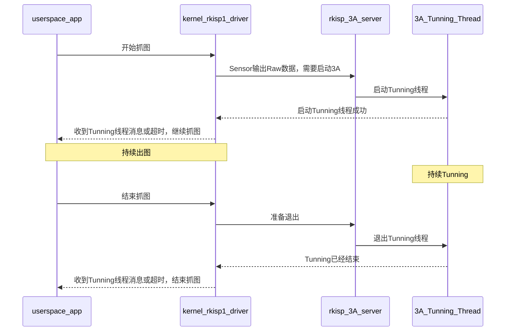
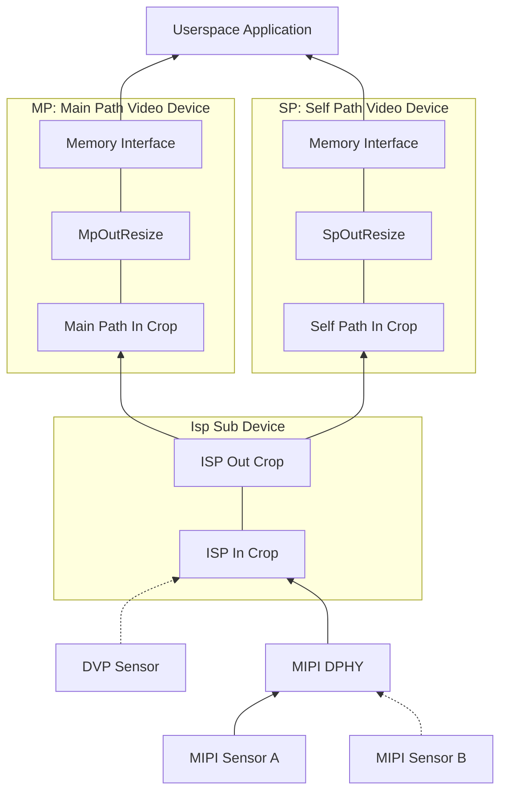

# Rockchip Linux 4.4 Camera 开发指南

文件标识：RK-KF-YF-347

发布版本：V2.0.0

日期：2020-03-18

文件密级：□绝密   □秘密   □内部资料   ■公开

**免责声明**

本文档按“现状”提供，瑞芯微电子股份有限公司（“本公司”，下同）不对本文档的任何陈述、信息和内容的准确性、可靠性、完整性、适销性、特定目的性和非侵权性提供任何明示或暗示的声明或保证。本文档仅作为使用指导的参考。

由于产品版本升级或其他原因，本文档将可能在未经任何通知的情况下，不定期进行更新或修改。

**商标声明**

“Rockchip”、“瑞芯微”、“瑞芯”均为本公司的注册商标，归本公司所有。

本文档可能提及的其他所有注册商标或商标，由其各自拥有者所有。

**版权所有** **© 2020 **瑞芯微电子股份有限公司**

超越合理使用范畴，非经本公司书面许可，任何单位和个人不得擅自摘抄、复制本文档内容的部分或全部，并不得以任何形式传播。

福州瑞芯微电子股份有限公司

Rockchip Electronics Co., Ltd.

地址：     福建省福州市铜盘路软件园A区18号

网址：     [www.rock-chips.com](http://www.rock-chips.com)

客户服务电话： +86-4007-700-590

客户服务传真： +86-591-83951833

客户服务邮箱： [fae@rock-chips.com](mailto:fae@rock-chips.com)

---

**前言**

**概述**

本文档主要介绍Rockchip系列芯片的ISP、CIF的驱动结构，以及在此基础上如何编写/移植Sensor驱动、上层调试方法、应用程序开发接口、3A集成等。
本文所描述的ISP、CIF及Sensor驱动都尽可能满足V4L2标准，提供兼容适配的接口。同时尽量简化编写、移植Sensor驱动的难度。不过用户仍然需要了解V4L2一系列工具的使用，相关的概念等。

**产品版本**

| **芯片名称** | **内核版本** | **是否支持ISP** | **是否支持CIF** |
| :----------- | :----------- | :-------------- | :-------------- |
| RK3399       | 4.4          | 有，两个        | 无              |
| RK3326/PX30  | 4.4          | 有，一个        | 有，一个        |
| RK3288       | 4.4          | 有，一个        | 有，一个        |
| RK312x/PX3SE | 4.4          | 无              | 有，一个        |
| RK180x       | 4.4          | 有，一个        | 有，一个        |

**读者对象**

本文档（本指南）主要适用于以下工程师：

技术支持工程师

软件开发工程师

**修订记录**

| **版本号** | **作者** | **修改日期** | **修改说明** |
| ---------- | -------- | :----------- | ------------ |
| V1.0.0     | ZhengSQ  | 2018-07-10   | 初始版本     |
| V2.0.0     | ZhengSQ  | 2020-03-18   | 添加应用接口、更新3A应用方法、调整章节顺序、修订错误|

---

**目录**

[TOC]

---

## 历史版本介绍及名词约定

### 名词约定

- 3A，指自动聚焦(AF)，自动曝光(AE)和自动白平衡(AWB)算法，或者由RK提供的3A算法动态链接库
- Async Sub Device，指在Media Controller结构下的异步注册的V4L2子设备，如Sensor、MIPI DPHY
- Bayer Raw，也写成Raw Bayer，指设备(Sensor或ISP)输出的如RGGB、BGGR、GBRG、GRBG等帧格式
- Buildroot，指Rockchip基于Buildroot发布的一系列Linux SDK
- Camera，本文泛指由Rockchip芯片中的VIP或ISP及其连接的Sensor，以及他们驱动共同组成的完整系统
- CIF，指RK芯片中的VIP模块，用以接收Sensor数据并保存到Memory中，仅转存数据，无ISP功能
- DVP，一种并行数据传输接口，即Digital Video Port
- Entity，指Media Controller框架下的各节点
- FCC、FourCC，指Four Character(FCC) codes，是Linux Kernel中用4个字符表示的图像格式，详见FourCC章节
- HSYNC，指DVP接口的行同步信号
- ISP，Image Signal Processing，用以接收并处理图像。本文中既指硬件本身，也泛指ISP驱动
- IOMMU，Input-Output Memory Management Unit，指Rockchip系列芯片中的IOMMU模块，用于将物理上分散的内存页映射成CIF、ISP可见的连续内存。本文中既指硬件本身，也泛指IOMMU驱动
- IQ，Image Quality，指为Bayer Raw Camera调试的IQ xml，用于 3A tunning
- Media Controller，Linux kernel的一种媒体框架，主要用于拓扑结构的管理
- MIPI，本文指MIPI协议
- MIPI-DPHY，指MIPI-DPHY协议，或Rockchip芯片中符合MIPI-DPHY协议的控制器
- MP，即Main Path，指Rockchip ISP驱动的一个输出节点，可输出高分辨率图像，一般用来拍照，抓取Raw图
- PCLK，指Sensor输出Pixel Clock
- Pipeline，本文指Media Controller的各个Entity相互连接形成的链路
- RKCIF，指CIF的驱动名称
- RKISP1，指ISP驱动的名称
- SP，即Self Path，指Rockchip ISP驱动的一个输出节点，最高只能输出1080p分辨率
- Userspace，即Linux 用户空间(相对于Linux内核空间)
- V4L2，即Video4Linux2，Linux kernel的视频处理模块
- VIP，在Rockchip芯片中，即Video Input Processor，曾作为CIF的别名
- VSYNC，指DVP接口的场同步信号

### ISP及CIF驱动的历史版本

本文描述的RKISP1及RKCIF驱动基于Media Controller、V4L2 Framework、VB2，Sensor是作为Async Sub Device异步注册的。它们的代码分别位于`drivers/media/platform/rockchip/isp1/`及`drivers/media/platform/rockchip/cif/`目录；Sensor代码位于`drivers/media/i2c`目录。

其它的旧版本已经不再持续更新，或不再继续支持。具体如下表：

| **驱动名称** | **类型** | **Kernel** | **是否在本文范畴** | **代码位置** |
| :----------- | :------- | :--------- | :----------------- | :----------- |
| RKISP1       | ISP      | 4.4        | 是  | drivers/media/platform/rockchip/isp1 |
| RKCIF        | CIF      | 4.4        | 是  | drivers/media/platform/rockchip/cif  |
| RK-ISP10     | ISP      | 4.4        | 否  | drivers/media/platform/rk-isp10/     |
| RK-CAMSYS    | CIF      | 4.4        | 否  | drivers/media/video|

### FAQ文档

为方便客户快速调试Sensor，本文对应有一份FAQ文档，名称为《Rockchip_Trouble_Shooting_Linux4.4_Camera_CN》。它一般位于本文档的相同目录下。

## Sensor驱动开发移植

Sensor 驱动位于 drivers/media/i2c 目录下，注意到本章节所描述的是具有 Media Controller 属性的 Sensor 驱动，故 drivers/media/i2c/soc_camera 目录下的驱动并不适用。
Sensor 驱动与 RKCIF 或者 RKISP1 驱动最大程度上独立，二者异步注册，在dts中由 remote-endpoint 声明连接关系。因此本章所描述的 Sensor 驱动同时适用于 RKCIF 和 RKISP1。
在 Media Controller 结构下，Sensor 一般作为 Sub Device 并通过 Pad 与 Rkcif、Rkisp1 或者 Mipi Dphy 驱动链接在一起。本章主要介绍 Sensor 驱动的代码，dts 配置，及如何调试 Sensor 驱动。

本章将 Sensor 驱动的开发移植概括为 5 个部分，

- 按照 datasheet 编写上电时序，主要包括 vdd、reset、powerdown、clk 等
- 配置 sensor 的寄存器以输出所需的分辨率、格式
- 编写 struct v4l2_subdev_ops 所需要的回调函数，一般包括 set_fmt、get_fmt、s_stream、s_power
- 增加 v4l2 controller 用来设置如fps、exposure、gain、test pattern
- 编写 probe()函数，并添加 Media Control 及 Sub Device 初始化代码

作为良好的习惯，完成驱动编码后，也需要增加相应的 Documentation。可以参考 Documentation/devicetree/bindings/media/i2c/。这样板级 dts 可以根据该文档快速配置。

在板级 dts 中，引用 Sensor 驱动，一般需要，

- 配置正确的 clk及io mux
- 根据原理图设置上电时序所需要的 regulator 及 gpio
- 增加 port 子节点，与 cif 或者 isp 建立连接

本章以 ov5695 及 ov2685 为例，分析 Sensor 驱动。

### 上电时序

不同 Sensor 对上电时序要求不同，例如可能很大部分的 OV Sensor 对时序要求不严格，只要 mclk、vdd、reset 和 powerdown 状态是对的、就能正确进行 I2C 通讯并输出图片，而不用关心上电的先后顺序及延时。但还是有小部分 Sensor 对上电要求非常严格，例如 OV2685 必须严格按时序上电。

在 Sensor 厂家提供的 DataSheet 中，一般会有上电时序图，只需要按顺序配置即可。以drivers/media/i2c/ov5695.c为例，其中`__ov5695_power_on()`即是用来给 Sensor 上电。代码如下(有删减)。

```c
static int __ov5695_power_on(struct ov5695 *ov5695)
{
	int ret;
	u32 delay_us;
	struct device *dev = &ov5695->client->dev;

	ret = clk_set_rate(ov5695->xvclk, OV5695_XVCLK_FREQ);

	if (clk_get_rate(ov5695->xvclk) != OV5695_XVCLK_FREQ)
		dev_warn(dev, "xvclk mismatched, modes are based on 24MHz\n");
	ret = clk_prepare_enable(ov5695->xvclk);

	if (!IS_ERR(ov5695->reset_gpio))
		gpiod_set_value_cansleep(ov5695->reset_gpio, 1);

	ret = regulator_bulk_enable(OV5695_NUM_SUPPLIES, ov5695->supplies);

	if (!IS_ERR(ov5695->reset_gpio))
		gpiod_set_value_cansleep(ov5695->reset_gpio, 0);

	if (!IS_ERR(ov5695->pwdn_gpio))
		gpiod_set_value_cansleep(ov5695->pwdn_gpio, 1);

	/* 8192 cycles prior to first SCCB transaction */
	delay_us = ov5695_cal_delay(8192);
	usleep_range(delay_us, delay_us * 2);

	return 0;
}

```

OV5695 的上电时序简要说明如下,

- 首先提供 xvclk(即 mclk)
- 紧接着 reset pin 使能
- 各路的 vdd 上电。这里使用了 `regulator_bulk`，因为 vdd，vodd，avdd 三者无严格顺序。如果 vdd 之间有严格的要求，需要分开处理，可参考 OV2685 驱动代码
- 设置Sensor Reset，powerdown pin 为工作状态。Reset，powerdown 可能只需要一个。根据Sensor 封装及硬件原理图的实际需要配置
- 最后按ov5695的时序要求，需要delay 8192 个 clk cycle 之后，上电才算完成

注意，虽然不按 datasheet 要求上电许多 Sensor 也能正常工作，但按原厂建议的时序操作，无疑是最可靠的。

同样，datasheet 中还会有下电时序(Power Down Sequence)，也需要按要求实现。

#### 判断上电时序是否正确

在.probe()阶段会去尝试读取 chip id，如 ov5695 的 `ov5695_check_sensor_id()`，如果能够正确读取到 chip id，一般就认为上电时序正确，Sensor 能够正常进行 i2c 通信。

### Sensor 初始化寄存器列表

在 OV5695 及 OV2685 中，各定义了 `struct ov5695_mode` 及 `struct ov2685_mode`，用来表示 Sensor 不同的初始化 mode，即Sensor可以输出不同分辨率的图像、不同的fps等。Mode 可以包括如分辨率，Mbus Code，fps，寄存器初始化列表等。
寄存器初始化列表，请按厂家提供的直接填入即可。需要注意的是，列表最后用了`REG_NULL`表示结束。**注意REG_NULL不要和寄存器地址冲突**。

### v4l2_subdev_ops 回调函数

v4l2_subdev_ops 回调函数是 Sensor 驱动中逻辑控制的核心。回调函数包括丰富的接口，具体可以查看 kernel 代码 `include/media/v4l2-subdev.h`。建议 Sensor 驱动至少包括如下回调函数。

- .open()，Userspace通过在打开/dev/v4l-subdev?节点时，会调用到该.open()函数。在上层需要单独对 sensor 设置 control 时.open()是必须实现的
- .s_power()，包括power on和power off。在这里上电或者下电
- .s_stream()，即 set stream。包括 stream on 和 stream off。一般在这里配置寄存器，使其输出图像
- .enum_mbus_code()，枚举驱动支持的 mbus_code
- .enum_frame_size()，枚举驱动支持的分辨率
- .get_fmt()，返回当前 Sensor 选中的 format/size。如果.get_fmt() 缺失，media-ctl 工具无法查看 sensor entity 当前配置的format
- .set_fmt()，设置 Sensor 的 format/size

以上回调中，.s_power()和.s_stream()会比较复杂些。在 ov5695 驱动代码中，使用了pm_runtime来管理电源。在.s_stream()中通过`v4l2_ctrl_handler_setup()`实际配置control 信息(v4l2 control 可能会在 sensor 下电时更新)并写入寄存器。

### V4l2 controller

对于需要动态更新exposure、gain、blanking 的场景，v4l2 controller 部分是必要的。一般Raw Bayer Sensor都需要。

OV5695 驱动代码中，

- ov5695_initialize_controls()，用来声明支持哪些 control 并设置最大最小值等信息
- struct v4l2_ctrl_ops，指定了`ov5695_set_ctrl()`回调函数，用以响应上层的设置

### Probe 函数及注册 media entity，v4l2 subdev

Probe 函数中，首先对 dts 进行解析，获取 regulator、gpio、clk 等信息用以对 sensor 上下电。其次注册 media entity、v4l2 subdev、v4l2 controller 信息。注意到 v4l2 subdev 的注册是异步。如下几个关键的函数调用。

- v4l2_i2c_subdev_init()，注册为一个 v4l2 subdev，参数中提供回调函数
- ov5695_initialize_controls()，初始化 v4l2 controls
- media_entity_init()，注册成为一个 media entity，OV5695 仅有一个输出，即Source Pad
- v4l2_async_register_subdev()，声明 Sensor 需要异步注册。因为 RKISP1 及 RKCIF 都采用异步注册 Sub Device，所以这个调用是必须的

### dts 示例: MIPI Sensor

根据硬件的设计，主要是配置 pinctl(iomux)、clk、gpio、remote port
以下示例是 rk3326-evb-lp3-v10-linux.dts 中 OV5695 dts 节点。

```
	ov5695: ov5695@36 {
		compatible = "ovti,ov5695";
		reg = <0x36>;

		clocks = <&cru SCLK_CIF_OUT>;
		clock-names = "xvclk";

		avdd-supply = <&vcc2v8_dvp>;
		dovdd-supply = <&vcc1v8_dvp>;
		dvdd-supply = <&vdd1v5_dvp>;

		/*reset-gpios = <&gpio2 14 GPIO_ACTIVE_HIGH>;*/
		pwdn-gpios = <&gpio2 14 GPIO_ACTIVE_HIGH>;

		rockchip,camera-module-index = <0>;
		rockchip,camera-module-facing = "back";
		rockchip,camera-module-name = "TongJu";
		rockchip,camera-module-lens-name = "CHT842-MD";

		port {
			ucam_out: endpoint {
				remote-endpoint = <&mipi_in_ucam>;
				data-lanes = <1 2>;
			};
		};
	};

```

注意:

- pinctrl，初始化必要的pin iomux，该例子中包括了 reset pin 初始化和 clk iomux
- clock，指定名称为xvclk(驱动会讯取名为 xvclk 的 clock)，即 24M 时钟
- vdd supply，OV5695 需要的三路供电
- port 子节点，定义了一个 endpoint，声明需要与 mipi_in_wcam 建立连接。同样地 mipi dphy 会引用 wcam_out
- data-lanes 指定了 OV5695 使用两个 lane。**wcam_out节点中，data-lanes需要与之相匹配**

### dts 示例: DVP Sensor

与Mipi Sensor相比，DVP Sensor的dts不用配置data-lanes，endpoint链接到cif，其它的部分没有差别。

可以以`arch/arm64/boot/dts/rockchip/rk3326-evb-lp3-v10-linux.dts`中的gc2155为例，

- gc2155的dts节点中，remote-endpoint指向cif_in
- 不用配置data-lanes参数

### Sensor调试

完成Sensor驱动移植后，需要检查是否正常工作。

**调试过程中遇到问题，请首先根据FAQ文档排查。**

#### Sensor是否注册成功

Sensor 调试的第一个关键节点是 i2c 能否通讯成功，chip id 检查是否正确。如果是，说明上电时序没有问题。驱动中，一般也会打印出相关的 log，不同 Sensor 的 log 都不太一样不再举例。
使用`media-ctl` 获取拓扑结构，查看 Sensor 是否已经注册成一个 entity。如果是，说明 Sensor 已经注册成功。

#### 抓图是否有输出

通过抓图工具如`v4l2-ctl`、`gstreamer`、camera app等获取图像。

#### 检查control是否生效

利用 v4l2-ctl 设置相关的参数，如 gain、exposure、blanking 并生成图片，查看 sensor 的 controls 是否有生效。例如增加 gain 或 exposure图片亮度是否增加；加大 blanking帧率是否下降。

## 调试工具及常用命令

本章节主要介绍常用的抓图工具。
**因为大部分命令都比较长，为了方便阅读，使用转义字符'\' 将一行命令拆成多行，用户在使用时可以直接复制粘贴，但如果用户是将命令放在一行中，请去掉转义字符 '\'。**

### v4l-utils

在 Rockchip 发布的 Linux SDK 中，默认已集成了 v4l-utils 包。用户可以通过 buildroot 的编译开关开启或关闭 v4l-utils 包。比如：

```shell
# grep -rn LIBV4L_UTILS -- buildroot/configs/rockchip/camera.config
BR2_PACKAGE_LIBV4L_UTILS=y
```

用户也可以在 www.linuxtv.org 的官网获取源码编译。

v4l-utils 包在 Ubuntu 系统下，可通过 apt 工具直接安装，如下，

```shell
# sudo apt-get install v4l-utils
```

### 使用media-ctl查看拓扑结构

media-ctl 是 v4l-utils 包中的一个工具，主要用来查看、配置 Media Framework 的各Entity的信息，如格式、裁剪、链接使能等。应用该工具可以更灵活地拓展Camera功能。

**对于普通的应用场景，用户不必去配置具体的Entity信息，直接使用默认的就可以。**

#### 显示拓扑结构

使用以下命令可以显示拓扑结构。注意，**当cif，isp都enabled时，或有多个isp enalbed，或插入usb camera时，media设备可能有多个，如/dev/media0，/dev/media1，/dev/media2。**

```shell
# media-ctl -p -d /dev/media0
```

对开发者来说，主要关注的是有没有找到Sensor 的 Entity。**如果没有找到Sensor的Entity，说明Sensor注册有问题，请按FAQ文档排查。**

例如，RK3326 SDK板接上ov5695摄像头后可以看到如下的输出（有删减）。

```shell
# media-ctl -p -d /dev/media1
- entity 9: m00_b_ov5695 2-0036 (1 pad, 1 link)
            type V4L2 subdev subtype Sensor flags 0
            device node name /dev/v4l-subdev2
        pad0: Source
                [fmt:SBGGR10_1X10/2592x1944@10000/300000 field:none]
                -> "rockchip-mipi-dphy-rx":0 [ENABLED,DYNAMIC]
```

从ov5695 entity信息中可以看到：

- 该Entity完整的名称是：`m00_b_ov5695 2-0036`
- 它是一个`V4L2 subdev`(Sub-Device) `Sensor`
- 它对应的节点是`/dev/v4l-subdev2`，应用程序（如v4l2-ctl）可以打开它，并进行配置
- 它仅有一个输出（`Source`）节点，记为`pad0`
- 它的输出格式是`[fmt:SBGGR10_1X10/2592x1944@10000/300000 field:none]`，其中SBGGR10_1X10是一种mbus-code的简写，下一小节会列出常见的mbus-code
- 它的Source pad0链接到（`->`）`"rockchip-mipi-dphy-rx"`的`pad0`，并且当前的状态是`ENABLED`。`DYNAMIC`表示可以将状态修改为DISABLED

如果同一个ISP或CIF接同时接两个Sensor，他们仅有一个是ENABLED的，如下这个例子（有删减）。

```
[root@rk3326_64:/]# media-ctl -p -d /dev/media1
- entity 9: irs16x5c 1-003d (1 pad, 1 link)
            type V4L2 subdev subtype Sensor flags 0
            device node name /dev/v4l-subdev2
        pad0: Source
                [fmt:SBGGR12_1X12/224x1557@10000/300000 field:none]
                -> "rockchip-mipi-dphy-rx":0 [ENABLED,DYNAMIC]

- entity 10: irs16x5c 2-003d (1 pad, 1 link)
             type V4L2 subdev subtype Sensor flags 0
             device node name /dev/v4l-subdev3
        pad0: Source
                [fmt:SBGGR12_1X12/224x1557@10000/300000 field:none]
                -> "rockchip-mipi-dphy-rx":0 [DYNAMIC]

```

上例中：

- 两个Sensor irs16x5c都接到了"rockchip-mipi-dphy-rx":0，但只有entity 9是ENABLED的
- 如果需要切换Sensor，需要在整个链路停止工作的状态下操作，即：不能在抓图过程中改变pipeline中各Entity的配置

#### 切换Sensor

如果接了多个的Sensor，那么可以通过如下命令切换Sensor。

```shell
# media-ctl -d /dev/media0 \
    -l '"ov5695 7-0036":0->"rockchip-sy-mipi-dphy":0[0]'
# media-ctl -d /dev/media0 \
    -l '"ov2685 7-003c":0->"rockchip-sy-mipi-dphy":0[1]'
```

- 命令格式为media-ctl -l '"entity name":pad->"entity name":pad[Status]'
- 整个 link 需要用单引号，因为有特殊字符： > [ ]
- Entity name 需要用双引号，因为中间有空格
- Status 用 0 或 1 表示 Active 或 In-Active

#### 修改Entity的format、size

举例一，OV5695支持多个分辨率的输出，默认为2592x1944。现将输出分辨率改为1920x1080。

```shell
# media-ctl -d /dev/media1 \
    --set-v4l2 '"m00_b_ov5695 2-0036":0[fmt:SBGGR10_1X10/1920x1080]'
```

修改OV5695输出后，rkisp1-isp-subdev的大小及video device crop也相应要修改。因为后级的大小不能大于前级的大小。

```shell
# media-ctl -d /dev/media1 \
    --set-v4l2 '"rkisp1-isp-subdev":0[fmt:SBGGR10_1X10/1920x1080]'
# media-ctl -d /dev/media1 \
    --set-v4l2 '"rkisp1-isp-subdev":0[crop:(0,0)/1920x1080]'
# media-ctl -d /dev/media1 \
    --set-v4l2 '"rkisp1-isp-subdev":2[crop:(0,0)/1920x1080]'
# v4l2-ctl -d /dev/video1 \
    --set-selection=target=crop,top=0,left=0,width=1920,height=1080
```

举例二，对于raw bayer sensor，rkisp1默认输出yuv格式，将rkisp1-isp-subdev的fmt修改为Sensor的fmt，可以让MP节点输raw图。

```
# media-ctl -d /dev/media1 \
    --set-v4l2 '"rkisp1-isp-subdev":2[fmt:SBGGR10/2592x1944]'
```

以上的示例中，有一些注意点：

- 注意特殊字符,需要使用单引号或双引号
- 注意引号中不要少掉空格，也不要多出空格
- 请使用`media-ctl --help`查看更详细的使用帮助

#### 常用的mbus-code格式

Mbus-code，全称是 Media Bus Pixel Codes，它描述的是用于在物理总线上传输的格式，比如 sensor 通过 mipi dphy 向 isp 传输的图像格式，或者在 ISP 内部各子模块间传输的格式。特别需要将 Mbus-code与的 FourCC 区分，后者是指存储在 Memory 中的图像格式。

Mbus-code定义在kernel的`include/uapi/linux/media-bus-format.h`中。

下表列出本文中常用到的几种 Mbus-code。

| **Kernel中定义的宏**       | **Mubs-code简称** | **类型**  | **Bpp** | **Bus width** | **Samples** |
| :------------------------- | :-------          | :-------  | :------ | :------------ | :---------- |
| MEDIA_BUS_FMT_SBGGR8_1X8   | SBGGR8_1X8        | Bayer Raw | 8       | 8             | 1           |
| MEDIA_BUS_FMT_SRGGB8_1X8   | SRGGB8_1X8        | Bayer Raw | 8       | 8             | 1           |
| MEDIA_BUS_FMT_SBGGR10_1X10 | SBGGR10_1X10      | Bayer Raw | 10      | 10            | 1           |
| MEDIA_BUS_FMT_SRGGB10_1X10 | SRGGB10_1X10      | Bayer Raw | 10      | 10            | 1           |
| MEDIA_BUS_FMT_SBGGR12_1X12 | SBGGR12_1X12      | Bayer Raw | 12      | 12            | 1           |
| MEDIA_BUS_FMT_SRGGB12_1X12 | SRGGB12_1X12      | Bayer Raw | 12      | 12            | 1           |
| MEDIA_BUS_FMT_YUYV8_2X8    | YVYU8_2X8         | YUV 422   | 16      | 8             | 2           |
| MEDIA_BUS_FMT_UYUV8_2X8    | UYUV8_2X8         | YUV 422   | 16      | 8             | 2           |
| MEDIA_BUS_FMT_Y8_1X8       | Y8_1X8            | YUV GREY  | 8       | 8             | 1           |
| MEDIA_BUS_FMT_RGB888_1X24  | RGB888_1X24       | RGB 888   | 24      | 24            | 1           |

media-ctl 可以列举出所支持的 mbus code。

```shell
# media-ctl --known-mbus-fmts
```

#### 找到video设备

拓扑结构中有多个的Entity，一些是sub device，一些是video device。前者对应的设备节点是/dev/v4l-subdev，后者对应的是/dev/video。多个的video device中，用户最常关注的是哪个设备可以输出图像。

```shell
# media-ctl -d /dev/media1 -e "rkisp1_selfpath"
/dev/video2
# media-ctl -d /dev/media1 -e "rkisp1_mainpath"
/dev/video1
```

上面两个命令分别显示出/dev/media1这个链路中，RKISP1的SP及MP节点的设备路径。RKISP1有两个视频输出设备，它们都能输出图像。

如果使用的是RKCIF，类似地：

```shell
# media-ctl -d /dev/media0 -e "stream_cif"
/dev/video0
```

上述命令显示出/dev/media0这个链路中，RKCIF的video device设备路径。RKCIF只有一个视频输出节点。

```shell
# v4l2-ctl -d /dev/video1 --all
```

上述命令显示出了/dev/video1的一些主要参数，比如crop、fmt、v4l2 controls等。

### 使用v4l2-ctl抓图

Media-ctl 工具的操作是通过/dev/medio0 等 media 设备，它所管理是 Media 的拓扑结构中 各个节点的 format，大小，链接。V4l2-ctl 工具则是针对/dev/video0，/dev/video1 等 video 设备，它在 video 设备上进行 set_fmt，reqbuf，qbuf，dqbuf，stream_on，stream_off 等一系列操作。本文主要用 v4l2-ctl 进行采集帧数据，设置曝光、gain、VTS 等 v4l2_control。

建议先查看 v4l2-ctl 的帮助文档。帮助文档内容比较多，分成很多个部分，我们比较关心的是其中的 streaming，vidcap。

查看帮助文档梗概如下。

```shell
# v4l2-ctl --help
```

查看完整的帮助文档如下，内容相对较多。

```shell
# v4l2-ctl --help-all
```

查看与 streaming 相关的参数如下。

```shell
# v4l2-ctl --help-streaming
```

查看与 vidcap 相关的参数如下。它主要包括 get-fmt、set-fmt 等。

```shell
# v4l2-ctl --help-vidcap
```

#### 使用v4l2-ctl抓帧

示例一，抓取RKCIF输出的 1 帧 NV12 数据保存到/tmp/nv12.bin，分辨率为 640x480。在保存数据前，先丢弃前面 3 帧(即前面 3 帧虽然返回给 userspace，但不保存到文件)。

```shell
# v4l2-ctl -d /dev/video0 \
    --set-fmt-video=width=640,height=480,pixelformat=NV12 \
    --stream-mmap=3 \
    --stream-skip=3 \
    --stream-to=/tmp/nv12.bin \
    --stream-count=1 \
    --stream-poll
```

示例二，抓取RKISP输出的 10 帧 NV12 数据保存到/tmp/nv12.bin，分辨率为1920x1080。

```shell
# v4l2-ctl -d /dev/video1 \
    --set-selection=target=crop,top=0,left=0,width=1920,height=1080
    --set-fmt-video=width=1920,height=1080,pixelformat=NV12 \
    --stream-mmap=3 \
    --stream-to=/tmp/nv12.bin \
    --stream-count=10 \
    --stream-poll
```

参数的说明:

- -d，指定操作对象为/dev/video0设备。
- --set-selection，指定对输入图像进行裁剪。特别是当RKISP1的前级大小发生变化时要保证selection不大于前级输出大小。RKCIF的裁剪则是通过--set-crop参数设置的
- --set-fmt-video，指定了宽高及pxielformat(用FourCC表示)。 NV12即用 FourCC 表示的 pixelformat。
- --stream-mmap，指定 buffer 的类型为 mmap，即由 kernel 分配的物理连续的或经过iommu 映射的 buffer。
- --stream-skip，指定丢弃(不保存到文件)前 3 帧
- --stream-to，指定帧数据保存的文件路径
- --stream-count，指定抓取的帧数，不包括--stream-skip 丢弃的数量
- --stream-poll，该选项指示 v4l2-ctl 采用异步 IO，即在 dqbuf 前先用 select 等等帧数据完成，从而保证 dqbuf 不阻塞。否则 dqbuf 将会阻塞直到有数据帧到来

#### 设置曝光、gain 等 control

如果 Sensor 驱动有实现 v4l2 control，在采集图像前，可以通过 v4l2-ctl 设置如曝光、gain 等。
RKCIF 或 RKISP 会继承 sub device 的 control，因此这里通过/dev/video3 可以看到 Sensor 的 v4l2 control。

如下是 RK3326 SDK 机子上查看到的 OV5695 的相关设置，包括 exposure，gain，blanking，test_pattern等。

```shell
# v4l2-ctl -d /dev/video1 -l

User Controls

          exposure 0x00980911 (int) : min=4 max=2228 step=1 default=1104 value=1104
              gain 0x00980913 (int) : min=0 max=16383 step=1 default=1024 value=1024

Image Source Controls

 vertical_blanking 0x009e0901 (int) : min=1152 max=31687 step=1 default=1152 value=1152
     analogue_gain 0x009e0903 (int) : min=16 max=248 step=1 default=248 value=248

Image Processing Controls

      test_pattern 0x009f0903 (menu): min=0 max=4 default=0 value=0

```

用 v4l2-ctl 可以修改这些 control。如修改 exposure 及 analogue_gain 如下。

```shell
# v4l2-ctl -d /dev/video3 --set-ctrl 'exposure=1216,analogue_gain=10'
```

#### 抓取Raw图

RKISP1的MP节点可以抓取Raw图，此时ISP是by-pass状态，不对数据做调制。

示例，抓取 Sensor OV5695 输出的 Raw Bayer 原始数据。格式为 SBGGR10_1X10 大小为 2592x1944。

```shell
# media-ctl -d /dev/media0 \
    --set-v4l2 '"ov5695 7-0036":0[fmt:SBGGR10_1X10/2592x1944]'
# media-ctl -d /dev/media0 \
    --set-v4l2 '"rkisp1-isp-subdev":0[fmt:SBGGR10_1X10/2592x1944]'
# media-ctl -d /dev/media0 \
    --set-v4l2 '"rkisp1-isp-subdev":0[crop:(0,0)/2592x1944]'
# media-ctl -d /dev/media0 \
    --set-v4l2 '"rkisp1-isp-subdev":2[fmt:SBGGR10_1X10/2592x1944]'
# media-ctl -d /dev/media0 \
    --set-v4l2 '"rkisp1-isp-subdev":2[crop:(0,0)/2592x1944]'
# v4l2-ctl -d /dev/video4 \
    --set-ctrl 'exposure=1216,analogue_gain=10' \
    --set-selection=target=crop,top=0,left=0,width=2592,height=1944 \
    --set-fmt-video=width=2592,height=1944,pixelformat=BG10 \
    --stream-mmap=3 \
    --stream-to=/tmp/mp.raw.out \
    --stream-count=1 \
    --stream-poll
```

说明：

- 第 4 行 media-ctl 设置了 isp-subdev 输出格式与 sensor 一致
- 第 3、5 行设置了 crop 与 Sensor 大小一致, 即不裁剪
- 第 6 行，如果图片太暗，可以调节expo、gain 以增加亮度，可选。且 Sersor 驱动需要有实现该 v4l2 control
- 第 7、8 行，v4l2-ctl 设置了 selection 不裁剪，且输出 pixelformat FourCC 为 BG10
- 特别要注意的是, ISP 虽然不对 Raw 图处理，但它仍然会将 10bit 的数据低位补 0 成16bit。不管 Sensor 输入的是 10bit，12bit，最终上层拿的都是 16bit 每像素

在 Bayer Raw 文件头部加上 PGM 标识，即可其转成 Ubuntu 可直接打开查看的 pgm 图片。添加三行 PGM 头即可。

示例，将raw图转为pgm格式，以便打开。

```shell
# cat > /tmp/raw.pgm << EOF
P5
2592 1944
65535
EOF

# cat /tmp/mp.raw.out >> /tmp/raw.pgm
```

说明：

- 行 2，P5 为固定标识符
- 行 3，表示 Raw 图的分辨率，即长宽，中间用一个空格符分隔
- 行 4，表示深度，65535 即 16bit。如果是 8bit，相应地改成 255
- 行 7，将原始数据加在pgm文件头后面
- 注意pgm头只有三行，不要添加多余的空白行

#### 常用的FourCC格式

FourCC，全称 Four Character Codes，它用 4 个字符(即 32bit)来命名图像格式。在 Linux Kernel 中，宏定义如下:

```c
#define v4l2_fourcc(a,b,c,d) \
	(((__u32)(a)<<0)|((__u32)(b)<<8)|((__u32)(c)<<16)|((__u32)(d)<<24))
```

FourCC 所定义的格式，是图像视频在内存中存储的格式。这点要注意和 mbus-code 区分。

以下列出本文中常用到的几个格式。更详细的定义请参阅 kernel 代码之 `videodev2.h`。

| **Kernel定义的宏**       | **FourCC** |
| :-----------             | :--------: |
| V4L2_PIX_FMT_NV12        | NV12       |
| V4L2_PIX_FMT_NV21        | NV21       |
| V4L2_PIX_FMT_NV16        | NV16       |
| V4L2_PIX_FMT_NV61        | NV61       |
| V4L2_PIX_FMT_NV12M       | NM12       |
| V4L2_PIX_FMT_YUYV        | YUYV       |
| V4L2_PIX_FMT_YUV420      | YU12       |
| V4L2_PIX_FMT_SBGGR10     | BG10       |
| V4L2_PIX_FMT_SGBRG10     | GB10       |
| V4L2_PIX_FMT_SGRBG10     | BA10       |
| V4L2_PIX_FMT_SRGGB10     | RG10       |
| V4L2_PIX_FMT_GREY        | GREY       |

### Ubuntu下使用mplayer显示YUV图像

前面小节中一些命令抓取了帧数据并保存成文件，在Ubuntu环境下可以用mplayer解析出来。

mplayer可通过apt安装，如下。

```shell
# sudo apt-get install mplayer
```

播放640x480大小的NV12图片，如下。

```shell
# W=640; H=480; mplayer /tmp/nv12.bin -loop 0 -demuxer rawvideo -fps 30 \
    -rawvideo w=${W}:h=${H}:size=$((${W}*${H}*3/2)):format=NV12
```

播放640x480大小的YUYV图片，如下。

```shell
# W=640; H=480; mplayer /tmp/yuyv.bin -loop 0 -demuxer rawvideo -fps 30 \
    -rawvideo w=${W}:h=${H}:size=$((${W}*${H}*2)):format=YUY2
```

以上示例中：

- W及H是变量，指定宽高方便后续引用
- fps指定了播放的速率，如果fps为1，那么1秒播放一帧
- size指每帧大小
- format指定了格式，`mplayer -rawvideo format=help` 可显示所有支持的格式

**Windows下可以使用如7yuv工具解析图像**

### 使用GStreamer

在 Rockchip 发布的 Linux SDK 下，可以使用GStreamer预览 Camera 的图像、编码。

使用v4l2src plugin即可从video device中获取图像。默认地，`rkisp_3A_server`也会随之启动调制(Tunning)，从而能够得到亮度、色彩正常的图像。

#### 用GStreamer显示图像

以下命令可以将Camera图像显示在屏幕上。

```shell
# export LD_LIBRARY_PATH=$LD_LIBRARY_PATH:/usr/lib/gstreamer-1.0
# export XDG_RUNTIME_DIR=/tmp/.xdg
# gst-launch-1.0 v4l2src device=/dev/video1 ! \
    video/x-raw,format=NV12,width=2592,height=1944,framerate=30/1 ! kmssink
```

#### GStreamer视频、图片编码

Linux SDK同时还带有硬件编码，如下命令可以将Camera数据流编码并保存成文件。

```shell
# gst-launch-1.0 v4l2src device=/dev/video1 num-buffers=100 ! \
    video/x-raw,format=NV12,width=1920,height=1088,framerate=30/1 ! \
    videoconvert ! mpph264enc ! h264parse ! mp4mux ! \
    filesink location=/tmp/h264.mp4
```

```shell
# gst-launch-1.0 -v v4l2src device=/dev/video1 num-buffers=10 ! \
    video/x-raw,format=NV12,width=1920,height=1080 ! mppjpegenc ! \
    multifilesink location=/tmp/test%05d.jpg
```

说明：

- mppjpegenc及mpph264enc encoder是rockchipmpp plugin提供的硬件编码
- mpp encoder需要height 16 对齐，因此需要kernel包含有该补丁：`fea937b015e7 media: rockchip: isp1/cif: set height alignment to 16 in queue_setup`

### 无屏板子调试

Rockchip Linux SDK提供了librkuvc.so，利用该接口可以将板子当作一个uvc camera使用，通过usb otg与PC端相连接。

应用开发这一章节给出了示例代码，供参考。

### 打开调试开关

RKISP1或RKCIF驱动中都包含一些v4l2_dbg() log，通过命令可以打开 log 开关,如下。

```shell
# echo 1 > /sys/module/video_rkcif/parameters/debug
```

或

```shell
# echo 1 > /sys/module/video_rkisp1/parameters/debug
```

除此之外，VB2和V4L2 也有相应的调试开关。

打开VB2 相关的 log如下。

```shell
# echo 7 > /sys/module/videobuf2_core/parameters/debug
```

VB2 log 主要包括 buffer 的轮转，如 reqbuf、qbuf、dqbuf 及 buffer状态变化等。需要注意 vb2 模块开关是通用的开关，其它使用了vb2(如 VPU/ISP 等)的相关 log 也会使能输出。

打开 v4l2 相关的 log，比如 ioctl 调用。如下命令将 v4l2 相关 log 全部打开。

```shell
# echo 0x1f > /sys/class/video4linux/video0/dev_debug
```

也可以分别只开一小部分的 log。如下Kernel宏定义了各个 bit 会 enable 哪些 log。将所需要的 log对应的 bit 打开即可。这些宏定义在 kernel 头文件 `include/media/v4l2-ioctl.h` 中。

```c
/* Just log the ioctl name + error code */
#define V4L2_DEV_DEBUG_IOCTL            0x01
/* Log the ioctl name arguments + error code */
#define V4L2_DEV_DEBUG_IOCTL_ARG        0x02
/* Log the file operations open, release, mmap and get_unmapped_area */
#define V4L2_DEV_DEBUG_FOP              0x04
/* Log the read and write file operations and the VIDIOC_(D)QBUF ioctls */
#define V4L2_DEV_DEBUG_STREAMING        0x08
/* Log poll() */
#define V4L2_DEV_DEBUG_POLL             0x10
```

## 3A集成方法

该小节内容仅适用于RKISP1。RKCIF没有ISP功能，也不需要3A。

为了支持3A，过去的版本中增加了许多方式来支持，比如

- 提供librkisp.so库供应用程序链接
- 编写了rkisp、rkv4l2src gstreamer 插件来支持GStreamer。

但上述方式对应用来说显得麻烦且不好有效地适配已有程序，如VLC，Chrome浏览器。

在RKISP1 v0.1.5驱动及camera_engine_rkisp v2.2.0版本之后，新增了`rkisp_3A_server`进程，它会自动触发并且完成3A Tunning。如此一来，

- 应用程序不再需要3A库librkisp.so，而只负责数据流
- GStreamer 的v4l2src插件可直接使用，vlc等开源工具也可以直接使用，并且能得到3A正常的图像

### 布署rkisp_3A_server

包括Kernel的RKISP1驱动，camera_engine_rkisp，及相关启动脚本。如果已经更新到最新的Rockchip Linux SDK，那么3A默认已经集成好了。它的三个主要部分如下：

- RKISP1的驱动版本在v0.1.5或更新。版本号定义在`kernel/drivers/media/platform/rockchip/isp1/version.h`
- camera_engine_rkisp包更新到v2.2.0以上。路径在`external/camera_engine_rkisp`
- camera_engine_rkisp的编译脚本及自启动脚本。路径在`buildroot/package/rockchip/camera_engine_rkisp`

由camera_engine_rkisp编译出来得到的文件如下所示：

```
/usr/bin/rkisp_3A_server
/usr/lib/librkisp.so
/usr/lib/librkisp_api.so
/usr/lib/rkisp/
              ├── ae
              │   └── librkisp_aec.so
              ├── af
              │   └── librkisp_af.so
              └── awb
                  └── librkisp_awb.so
/etc/iqfiles/
/etc/init.d/S40rkisp_3A
```

其中，

- rkisp_3A_server，是一个可执行文件，负责监听并按需要启动3A调制
- librkisp.so，实现了3A的主要接口，并分别调用aec、af、awb链接库。后者没有开放源码
- iqfiles目录，存放Sensor的iq参数，xml文件
- S40rkisp_3A，是rkisp_3A_server的启动脚本，以便随开机启动

Rockchip提供Debian系统，除开机启动方式不一样外，其它逻辑是与Linux SDK相同的。

### 开启rkisp_3A_server log

通过声明环境变量，使能log，例如以下打开AEC log：

```shell
# export persist_camera_engine_log=0x40
```

将以上这一行加入到/etc/init.d/S40rkisp_3A中，log会保存到/var/log/messages。如log较多，messages文件会拆成多个文件，如/var/log/messages.0、/var/log/messages.1。**用户在打包log时，记得将所有log打包。比如：**

```shell
# tar zcvf /tmp/camera-log.tar.gz /var/log/messages*
```

可按模块开启log，说明如下，

```
      bits:   31-28  27-24   23-20   19-16 15-12  11-8  7-4   3-0
      module: [u]    [u]    [xcore]  [ISP] [AF]   [AWB] [AEC] [NO]
             *[u] means unused now.
      each module log has following ascending levels:
             0: error
             1: warning
             2: info
             3: verbose
             4: debug
             5: low1
             6-7: unused, now the same as debug

```

**特别需要注意：如果用户需要在终端启动rkisp_3A_server并开启log，因为log较多不能直接打印到慢速设备（如串口，shell默认输出）。建议将log重定向到文件中。如下所示。**

```shell
# /etc/init.d/S40rkisp_3A stop
# export persist_camera_engine_log=0x40
# /usr/bin/rkisp_3A_server --mmedia=/dev/media0 > /tmp/log 2>&1
```

如上所示，先停止服务，设置环境变量，再手动执行命令开启rkisp_3A_server，并将log重定向到/tmp/log文件中。

### xml加载加速功能

对于一些需要开机快速显示图像的产品，我们提供xml加载加速功能。通过开启宏定义

```shell
# make menuconfig

 │ │ --- Rockchip BSP packages                                              │ │
 │ │ [*]  Rockchip Camera Engine for linux                                  │ │
 │ │ [*]   Rockchip Camera Engine 3A service run in booting                 │ │
 │ │        Specify a directory to store xml speed up bin (disabled)  --->  │ │
 │ │ ()    Rockchip Camera Engine IQ xml file                               │ │
```

根据rootfs是否可写，选择`Specify a directory to store xml speed up bin`选项。

```
             │ │                 (X) disabled                              │ │
             │ │                 ( ) /etc/iqfiles-db                       │ │
             │ │                 ( ) /userdata/iqfiles-db                  │ │
```

如果rootfs是只读的，那么只能选择`/userdata/iqfiles-db`。该选项指定了一个用以存放xml bin的目录，所在的文件系统需要可写入。

### rkisp_3A_server的执行时序

以下显示rkisp_3A_server的时序图。



## 应用开发

除了直接通过v4l2-ctl、GStreamer、VLC等获取、预览图像外，用户也可以基于V4L2接口编写程序获取图像进而处理。

**应用程序还可以自行链接librkisp.so库，从而获得更丰富的图片信息，比如：**

- 手动控制曝光的时间(time)和增益(gain)
- 设置曝光权重，对某一区域进行点测光
- 获取亮度统计信息，如各区域的平均亮度、整个图片的直方图
- 控制最大的fps、gain以改善图像质量

以上这些功能，都需要应用程序链接librkisp.so后，才能获取到。因此需要先停止rkisp_3A_server进程，由应用程序自行完成3A的初始化、启动等。

```shell
# /etc/init.d/S40rkisp_3A stop
```

或者直接将S40rkisp_3A删除。

```shell
# rm /etc/init.d/S40rkisp_3A
```

### 使用librkisp_api.so接口

为了快速使用，camera_engine_rkisp提供了rkisp_api接口，编译成librkisp_api.so，可直接调用。同时也可作为一份参考。它的主要API声明在rkisp_api.h头文件。

举例一，打开并获取1920x1080大小的图像。

```c
int test_capture_mmap_quick()
{
    const struct rkisp_api_ctx *ctx;
    const struct rkisp_api_buf *buf;
    int count = 10;

    ctx = rkisp_open_device("/dev/video1", 0);
    if (ctx == NULL)
        return -1;

    rkisp_set_fmt(ctx, 1920, 1080, ctx->fcc);

    if (rkisp_start_capture(ctx))
        return -1;

    do {
        buf = rkisp_get_frame(ctx, 0);

        /* Deal with the buffer */

        rkisp_put_frame(ctx, buf);
    } while (count--);

    rkisp_stop_capture(ctx);
    rkisp_close_device(ctx);

    return 0;
}
```

上述代码中，仍然需要使用rkisp_3A_server对3A调制。如果应用程序要获取更多3A相关信息，只需要在open时修改参数：

```c
    ctx = rkisp_open_device("/dev/video1", 1);
```

获取的buf中会包含更多统计的信息。

举例二，修改Sensor的分辨率，比如将ov5695的默认输出分辨率修改为1920x1080。

```c
    const struct rkisp_api_ctx *ctx;

    ctx = rkisp_open_device("/dev/video1", 0);
    if (ctx == NULL)
        return -1;
    rkisp_set_sensor_fmt(ctx, 1920, 1080, MEDIA_BUS_FMT_SBGGR10_1X10);
```

### 使用DMA Buffer共享存储

在多个模块之间共享Buffer可以减少内存的拷贝，提高效率。DMA Buffer是一种具体的方法。DMA Buffer能够在Camera、RGA(图像处理模块)、DRM(显示)、MPP(编码)之间共享存储。

默认地，rkisp_api使用mmap从kernel分配内存，它可以将内存export到userspace，作为DMA Buffer供其它模块使用。相反地，它也可以接受其它模块的DMA Buffer，并在Kernel采集数据帧时直接写到目标Buffer中，从而避免一次拷贝。

举例一，使用MMAP，导出DMA Buffer给其它模块使用。

```c
    const struct rkisp_api_ctx *ctx;
    const struct rkisp_api_buf *buf;

    ctx = rkisp_open_device("/dev/video1", 0);
    if (ctx == NULL || rkisp_start_capture(ctx))
        return -1;

    rkisp_get_frame(ctx, 0);
    printf("size: %d, dmabuf fd: %d\n", buf->size, buf->fd);
```

上例中，`buf->fd`即是DMA Buffer的描述符，可直接给其它模块使用。但需要注意：

- 在该buffer使用完毕前，不能够调用rkisp_put_frame()
- 在该buffer使用完毕后，也不能忘了要调用rkisp_put_frame()

举例二，使用其它模块的DMA Buffer，Kernel采集到Camera数据直接填充到目标Buffer中。

```c
int test_capture_ext_dmabuf()
{
    ctx = rkisp_open_device("/dev/video1", 0);
    if (ctx == NULL)
        return -1;

    for (i = 0, ret = 0; i < buf_count; i++) {
        if (drmGetBuffer(dev.drm_fd, width, height, FORMAT, &buf[i]))
            goto out;
        dmabuf_fd[i] = buf[i].dmabuf_fd;
    }
    rkisp_set_fmt(ctx, width, height, ctx->fcc);
    rkisp_set_buf(ctx, buf_count, dmabuf_fd, buf[0].size);

    if (rkisp_start_capture(ctx))
        goto out;

    buf = rkisp_get_frame(ctx, 0);
    printf("The ext buf fd is: %d\n", buf->fd);
    rkisp_put_frame(ctx, buf);

    rkisp_stop_capture(ctx);

out:
    while (--i >= 0)
        drmPutBuffer(dev.drm_fd, &buf[i]);

    rkisp_close_device(ctx);
}
```

上例中，`rkisp_set_buf()`将DRM的DMA Buffer直接给Camera使用，Buffer通过drm接口分配出来。这里主要介绍rkisp_api接口的用法，其中的`drmGetBuffer()`、`drmPutBuffer()`等函数不再详细把代码贴出来。

### 设置区域曝光权重

在一些特殊的场景中，默认的全局曝光方式得不到最好的效果，用户可以改变测光的重点区域，提升这个区域的权重值，从而得到该区域的最佳亮度。当然此时其它区域可能过曝或偏暗。例如以下两个场景，

- 逆光下的人脸识别。在没有HDR时逆光使得人脸区域偏暗不利于识别；此时可以在检测到人脸区域后，提升该区域的权重使得人脸更加清晰
- 扫地机识别地面物体。此时图片的下半部分是应用关心的，且因物体反射差异，上下部分的亮度往往有明显的差异；此时可提升下半部分图像的测光权重

举例一，调用设置权重接口。

```c
    unsigned char weights[] = {
         1,  1,  5,  9, 15, 31, 15,  5,  1,
         1,  1,  5,  9, 15, 31, 15,  5,  1,
         1,  1,  5,  9, 15, 31, 15,  5,  1,
         1,  1,  5,  9, 15, 31, 15,  5,  1,
         1,  1,  5,  9, 15, 31, 15,  5,  1,
         1,  1,  5,  9, 15, 31, 15,  5,  1,
         1,  1,  5,  9, 15, 31, 15,  5,  1,
         1,  1,  5,  9, 15, 31, 15,  5,  1,
         1,  1,  5,  9, 15, 31, 15,  5,  1,
    };
    rkisp_set_expo_weights(ctx, weights, 81);
```

上例中，定义了9x9的数组，每个元素的取值范围是[1, 31]分别对应图像的81个区域，数值越大说明该区域的权重越大。

### 利用librkuvc.so模拟成uvc camera

Rockchip Linux SDK集成了librkuvc.so库，其源码位于`external/uvc_app`。在获取到Camera图像后，可以经librkuvc.so压缩传输给PC。

举例一，调用librkuvc.so

```c
#include "uvc_control.h"
#include "uvc_video.h"

int test_uvc_mmap()
{
    const struct rkisp_api_ctx *ctx;
    const struct rkisp_api_buf *buf;
    uint32_t flags = 0;
    int extra_cnt = 0;

    ctx = rkisp_open_device("/dev/video1", 0);

    if (ctx == NULL)
        return -1;

    if (rkisp_set_fmt(ctx, 640, 480, V4L2_PIX_FMT_NV12))
        return -1;

    if (rkisp_start_capture(ctx))
        return -1;

    flags = UVC_CONTROL_LOOP_ONCE;
    uvc_control_run(flags);

    do {
        buf = rkisp_get_frame(ctx, 0);
        extra_cnt++;
        uvc_read_camera_buffer(buf->buf, buf->fd, buf->size, &extra_cnt, sizeof(extra_cnt));

        rkisp_put_frame(ctx, buf);
    } while (1);

    uvc_control_join(flags);

    rkisp_stop_capture(ctx);
    rkisp_close_device(ctx);

    return 0;
}
```

上例中，内存由Camera驱动分配，并将DMA Buffer交给UVC编码。

```shell
# GCC=buildroot/output/rockchip_rk3326_64/host/bin/aarch64-buildroot-linux-gnu-gcc
# SYSROOT=buildroot/output/rockchip_rk3326_64/staging
# ENGINE=external/camera_engine_rkisp
# $GCC --sysroot=$SYSROOT camera_uvc.c \
        -L$ENGINE/build/lib/ -lrkisp -lrkisp_api \
        -L $SYSROOT/usr/lib/ -lrkuvc \
        -I $SYSROOT/usr/include/uvc/ \
        -I./ \
        -o camera_uvc
```

编译并将camera_uvc拷贝到/usr/bin目录下，在开发板上按以下方式调用：

```shell
# /usr/bin/uvc_MJPEG.sh
# /usr/bin/camera_uvc
```

几个注意点：

- uvc_MJPEG.sh开机后只需要初始化一次即可
- 支持分辨率640x480、1280x720、1920x1080、2560x1440，如有变更，请查看/usr/bin/uvc_MJPEG.sh

**硬件要求: mpp编码需要buffer的height需要16对齐，否则会内存访问越界。**

## RKISP1驱动介绍

RKISP1的驱动代码位于`drivers/media/platform/rockchip/isp1`目录。它主要是依据 v4l2 / media framework 实现硬件的配置,中断处理,控制 buffer 轮转,控制subdevice(如 mipi dphy 及 sensor)的上下电等功能。

简单介绍驱动中各个文件的内容如下。

```shell
# tree drivers/media/platform/rockchip/isp1/
drivers/media/platform/rockchip/isp1/
├── capture.c    #包含 mp/sp 的配置及 vb2,帧中断处理
├── dev.c        #包含 probe、Sensor注册、clock、pipeline、iommu
├── isp_params.c #3A 相关参数设置
├── isp_stats.c  #3A 相关统计
├── regs.c       #寄存器相关的读写操作
├── rkisp1.c     #对应 rkisp-isp-sd entity，包含从mipi/dvp接收数据及crop功能
```

Mipi Dphy的代码则位于`drivers/phy/rockchip/phy-rockchip-mipi-rx.c`。它也是一个v4l2 sub-device。

下图的各个节点是用户在开发、使用过程中比较常遇到的，从Sensor到ISP输出的连接关系图。



如上图，RKISP1有以下一些特点，

- 可以适配MIPI或DVP接口，连接MIPI Sensor时需要有 MIPI DPHY
- 可以接多个Sensor，但同时只能一个是Active
- 图像输入到 ISP 后，可以分成两路 MP 和 SP 输出。MP和SP基于同一张原图像处理后，两路可以同时输出
- MP即 Main Path。可以输出全分辨率的图像,最大到 4416x3312。MP可以输出 yuv 或 raw 图，且仅 MP 可以输出 raw 图
- SP即 Self Path。最高支持 1920x1080 分辨率。SP 可以输出 yuv 或 rgb 图像，但不能输出 raw 图
- MP 和 SP 都有 crop 和 resize 功能，相互不影响

MP 与 SP 输出功能比较如下表：

| **输出设备** | **最大分辨率** | **支持格式** | **Crop/Resize** |
| :----------- | :------------- | :----------- | :-------------- |
| SP           | 1920x1080      | YUV、RGB     | 支持            |
| MP           | 4416x3312      | YUV、RAW     | 支持            |

RKISP1还有其它一些节点如rkisp1-input-params、rkisp1-statistics是专门给3A调制使用的；rkisp1_rawpath和rkisp1_dmapath是特殊场景下使用，一般情况下App开发过程中使用不到。

### Rkisp1 dts 的板级配置

在 RK Linux SDK 发布时，若芯片支持ISP，其dtsi中已经有定义好 rkisp1节点，如rk3288-rkisp1.dtsi 中的 isp 节点，rk3399.dtsi 中的rkisp1_0、rkisp1_1 节点。下表描述各芯片 ISP 的信息。

| **芯片名称** | **dts节点名称** | **对应的mipi dphy**             | **对应的iommu** |
| :----------- | :-------------- | :------------------             | :-------------- |
| RK3399       | rkisp1_0        | mipi_dphy_rx0                   | isp0_mmu        |
| RK3399       | rkisp1_1        | mipi_dphy_tx1rx1                | isp1_mmu        |
| RK3288       | rkisp1          | mipi_phy_rx0 或 mipi_phy_tx1rx1 | isp_mmu         |
| PX30/RK3326  | rkisp1          | mipi_dphy_rx0                   | isp_mmu         |
| RK1808       | rkisp1          | mipi_dphy_rx                    | isp_mmu         |

上表中，

- RK3399有两个isp分别对应不同的dphy和mmu
- RK3288只有一个isp，但硬件上dphy可以选择rx0或tx1rx1

在板级配置时，只需要将对应的节点分别使能，并且建立remote-endpoint链接关系即可。可参考kernel现有的配置，如`arch/arm64/boot/dts/rockchip/rk3326-evb-lp3-v10-linux.dts`，将Sensor、mipi_dphy_rx0、rkisp1、isp_mmu分别使能，且设置remote-endpoint关联节点。

**特别需要注意的是，对于MIPI Sensor，data-lane参数Sensor和mipi_dphy_rx0都需要正确配置同样的值。**

## RKCIF驱动介绍

TODO
