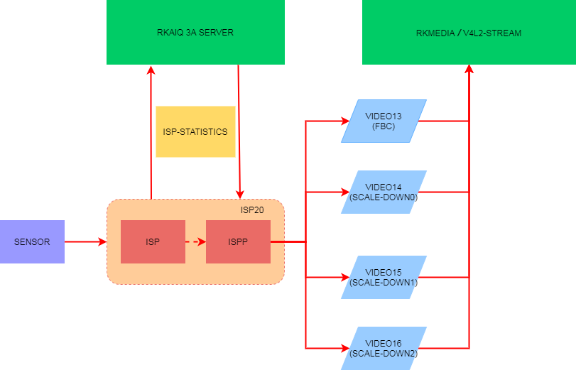

# ISP20应用开发参考

文件标识：RK-SM-YF-366

发布版本：V1.1.0

日期：2020-10-02

文件密级：□绝密   □秘密   □内部资料   ■公开

**免责声明**

本文档按“现状”提供，瑞芯微电子股份有限公司（“本公司”，下同）不对本文档的任何陈述、信息和内容的准确性、可靠性、完整性、适销性、特定目的性和非侵权性提供任何明示或暗示的声明或保证。本文档仅作为使用指导的参考。

由于产品版本升级或其他原因，本文档将可能在未经任何通知的情况下，不定期进行更新或修改。

**商标声明**

“Rockchip”、“瑞芯微”、“瑞芯”均为本公司的注册商标，归本公司所有。

本文档可能提及的其他所有注册商标或商标，由其各自拥有者所有。

**版权所有 © 2020 瑞芯微电子股份有限公司**

超越合理使用范畴，非经本公司书面许可，任何单位和个人不得擅自摘抄、复制本文档内容的部分或全部，并不得以任何形式传播。

瑞芯微电子股份有限公司

Rockchip Electronics Co., Ltd.

地址：     福建省福州市铜盘路软件园A区18号

网址：     [www.rock-chips.com](http://www.rock-chips.com)

客户服务电话： +86-4007-700-590

客户服务传真： +86-591-83951833

客户服务邮箱： [fae@rock-chips.com](mailto:fae@rock-chips.com)

---

**前言**

**概述**

本文旨在介绍应用如何获取**Camera**数据流以及**RkAiq 3A Server**独立进程。

**产品版本**

| **芯片名称** | **内核版本** |
| ------------ | ------------ |
| RV1109/RV1126       | Linux-4.19   |

**读者对象**

本文档（本指南）主要适用于以下工程师：

技术支持工程师

软件开发工程师

**修订记录**

| **版本号** | **作者** | **修改日期** | **修改说明** |
| ---------- | --------| :--------- | ------------ |
| V1.0.0    | 曾益清 | 2020-06-10 | 初始版本     |
| V1.1.0    | CWW | 2020-10-02 | 修正文档路径 |

---

**目录**

[TOC]

---

## 概述

### 功能概述



<center>图1 数据流框图</center>

Camera数据流通路如图1所示，Camera数据经过ISP20采集，ISP20再输出经过一系列图像处理算法后的数据，RkAiq不断从ISP20获取统计数据，并经过3A等算法生成新的参数反馈给ISP20，

RkAiq具体实现可以参考**docs/RV1126_RV1109/Camera**目录中的文档《Rockchip_Development_Guide_ISP2x_CN_v1.2.0.pdf》。

本文着重介绍应用层如何获取经过ISP20处理后的数据流。

### 数据流概述

| **entity name** | **video id** | **max width**                        | **support output fmt** |
| :-------------- | :----------- | :----------------------------------- | :--------------------- |
| rkispp_m_bypass | /dev/video13 | **不支持设置分辨率，不支持缩放**     | NV12/NV16/YUYV/**FBC0**/**FBC2**/ |
| rkispp_scale0   | /dev/video14 | **max width: 3264, 最大支持8倍缩放** | NV12/NV16/YUYV |
| rkispp_scale1   | /dev/video15 | **max width: 1280, 最大支持8倍缩放** | NV12/NV16/YUYV |
| rkispp_scale2   | /dev/video16 | **max width: 1280, 最大支持8倍缩放** | NV12/NV16/YUYV |

[^注]：**video id** 节点不是固定的，可以使用media-ctl查看对应的节点。

<center>表1 四路数据流</center>

ISP20可以输出四路数据流，如表1所示，entity name及对应的设备节点id可以通过命令：media-ctl -p -d /dev/media1（如有多个media设备，也尝试下/dev/media2）查看media设备的拓扑结构，如下截取部分输出：

```shell
# media-ctl -p -d /dev/media1
...
- entity 5: rkispp_m_bypass (1 pad, 1 link) //表示该entity是bypass
            type Node subtype V4L flags 0
            device node name /dev/video13   //对应的设备节点id为/dev/video13
        pad0: Sink
                <- "rkispp-subdev":2 [ENABLED]

- entity 9: rkispp_scale0 (1 pad, 1 link)  //表示该entity是scale0
            type Node subtype V4L flags 0
            device node name /dev/video14  //对应的设备节点id为/dev/video14
        pad0: Sink
                <- "rkispp-subdev":2 [ENABLED]

- entity 13: rkispp_scale1 (1 pad, 1 link) //表示该entity是scale1
             type Node subtype V4L flags 0
             device node name /dev/video15 //对应的设备节点id为/dev/video15
        pad0: Sink
                <- "rkispp-subdev":2 [ENABLED]

- entity 17: rkispp_scale2 (1 pad, 1 link) //表示该entity是scale2
             type Node subtype V4L flags 0
             device node name /dev/video16 //对应的设备节点id为/dev/video16
        pad0: Sink
                <- "rkispp-subdev":2 [ENABLED]
...
```

少数情况下如果没有media-ctl命令，可以通过/sys/节点查找，如：

```shell
# grep '' /sys/class/video4linux/video*/name
/sys/class/video4linux/video0/name:rkisp_mainpath
/sys/class/video4linux/video1/name:rkisp_selfpath
/sys/class/video4linux/video10/name:rkisp-input-params
/sys/class/video4linux/video11/name:rkisp-mipi-luma
/sys/class/video4linux/video12/name:rkispp_input_image
/sys/class/video4linux/video13/name:rkispp_m_bypass //bypass节点对应/dev/video13
/sys/class/video4linux/video14/name:rkispp_scale0   //scale0节点对应/dev/video14
/sys/class/video4linux/video15/name:rkispp_scale1   //scale1节点对应/dev/video15
/sys/class/video4linux/video16/name:rkispp_scale2   //scale2节点对应/dev/video16
/sys/class/video4linux/video17/name:rkispp_input_params
/sys/class/video4linux/video18/name:rkispp-stats
/sys/class/video4linux/video2/name:rkisp_rawwr0
/sys/class/video4linux/video3/name:rkisp_rawwr1
/sys/class/video4linux/video4/name:rkisp_rawwr2
/sys/class/video4linux/video5/name:rkisp_rawwr3
/sys/class/video4linux/video6/name:rkisp_rawrd0_m
/sys/class/video4linux/video7/name:rkisp_rawrd1_l
/sys/class/video4linux/video8/name:rkisp_rawrd2_s
/sys/class/video4linux/video9/name:rkisp-statistics
```

## 数据流获取

### 基于RKMEDIA获取数据流

RKMEDIA是RockChip Linux平台的多媒体库，详情请阅读**docs/RV1126_RV1109/Multimedia**目录中的文档《Rockchip_Instructions_Linux_Rkmedia_CN.pdf》，本文着重介绍摄像头采集接口部分。

摄像头采集接口仅支持V4L2，源码参考**范例：external/rkmedia/examples/uintTest/stream/camera_capture_test.cc** （可能默认生成的固件里没有此可执行bin，需要到PC上生成的路径手动push到板端），使用命令查看使用方法：

```shell
# ./camera_cap_test -h
```

#### bypass节点数据流获取

bypass这路数据流比较特殊，**其不支持设置分辨率**，其输出分辨率由ISP输入的分辨率决定，可以通过media-ctl查看拓扑结构确定ISP输入的分辨率。

```shell
# media-ctl -p -d /dev/media1
...
- entity 29: rkispp-subdev (4 pads, 7 links)
             type V4L2 subdev subtype Unknown flags 0
             device node name /dev/v4l-subdev0
        pad0: Sink
                [fmt:YUYV8_2X8/2688x1520 field:none
                 crop.bounds:(0,0)/2688x1520
                 crop:(0,0)/2688x1520]
                <- "rkispp_input_image":0 []
        pad1: Sink
                <- "rkispp_input_params":0 [ENABLED]
        pad2: Source
                [fmt:YUYV8_2X8/2688x1520 field:none]
                -> "rkispp_m_bypass":0 [ENABLED]
                -> "rkispp_scale0":0 [ENABLED]
                -> "rkispp_scale1":0 [ENABLED]
                -> "rkispp_scale2":0 [ENABLED]
        pad3: Source
                -> "rkispp-stats":0 [ENABLED]
...
```

如上所示，bypass这路输出的分辨率为2688x1520。因此您可以运行如下命令来获取bypass节点的数据流：

```shell
camera_cap_test -i /dev/video13 -o output.yuv -w 2688 -h 1520 -f image:nv12
```

**此外不同版本的SDK其对应的video设备id可能会不一样，但是entity name是唯一的**，因此也支持用entity name代替video设备id获取数据流，命令如下：

```shell
camera_cap_test -i rkispp_m_bypass -o output.yuv -w 2688 -h 1520 -f image:nv12
```

#### 三路scale down节点数据流获取

三路scale down节点支持缩放，每一路支持的最大分辨率如[1.2 数据流概述](## 1.2 数据流概述)中的表1所示，同时也支持entity name和/dev/videoX来抓取数据流，以scale0为例：

```shell
camera_cap_test -i /dev/video14 -o output.yuv -w 2688 -h 1520 -f image:nv12

camera_cap_test -i rkispp_scale0 -o output.yuv -w 2688 -h 1520 -f image:nv12
```

**建议三路scale输出的分辨率相加后未超过主码流的分辨率**

#### FBC格式数据获取

ISP20支持输出FBC格式数据，**仅rkispp_m_bypass（/dev/video13）支持输出FBC格式数据**，FBC格式数据有两种，FBC0与FBC2。其区别如下：

以sensor os04a10为例：

```shell
# v4l2-ctl -d /dev/video13  --set-fmt-video=width=2688,height=1520,pixelformat='FBC0' --verbose
Format Video Capture Multiplanar:
        Width/Height      : 2688/1520
        Pixel Format      : 'FBC0' (Rockchip yuv420sp fbc encoder)
        Field             : None
        Number of planes  : 1
        Flags             :
        Colorspace        : Default
        Transfer Function : Default
        YCbCr/HSV Encoding: Default
        Quantization      : Full Range
        Plane 0           :
           Bytes per Line : 2688
           Size Image     : 6386688
```

```shell
# v4l2-ctl -d /dev/video13  --set-fmt-video=width=2688,height=1520,pixelformat='FBC2' --verbose
Format Video Capture Multiplanar:
        Width/Height      : 2688/1520
        Pixel Format      : 'FBC2' (Rockchip yuv422sp fbc encoder)
        Field             : None
        Number of planes  : 1
        Flags             :
        Colorspace        : Default
        Transfer Function : Default
        YCbCr/HSV Encoding: Default
        Quantization      : Full Range
        Plane 0           :
           Bytes per Line : 2688
           Size Image     : 8429568
```

其获取方法与其他格式相似，只是将格式改为FBC0/FBC2即可，如下所示：

```shell
camera_cap_test -i rkispp_m_bypass -o output.yuv -w 2688 -h 1520 -f image:fbc0
camera_cap_test -i rkispp_m_bypass -o output.yuv -w 2688 -h 1520 -f image:fbc2
```

或者

```shell
camera_cap_test -i /dev/video13 -o output.yuv -w 2688 -h 1520 -f image:fbc0
camera_cap_test -i /dev/video13 -o output.yuv -w 2688 -h 1520 -f image:fbc2
```

**注意：此分辨率也不支持设置，建议主码流采用FBC格式数据（对带宽占用比较友好）。**

### 基于v4l2-utils获取数据流

ISP20驱动支持V4L2接口，因此获取数据流可以用v4l-utils包中的v4l2-ctl工具，**在调试过程中，建议先使用该工具检验能否成功出图。**

v4l2-ctl抓图保存成文件，它不能解析图像并显示出来。如需要解析，Ubuntu/Debian环境下可以使用mplayer，Windows下可以使用如7yuv等。

对v4l2-ctl, mplayer工具的详细说明，请参考docs/Linux/Multimedia/camera/目录中的文档《Rockchip_Developer_Guide_Linux_Camera_CN.pdf》。v4l2-ctl也自带有详细的`v4l2-ctl --help`文档。

下面是一个简单的抓图命令：

```shell
v4l2-ctl -d /dev/video13 --set-ctrl="exposure=234,analogue_gain=76"  \
--set-selection=target=crop,top=0,left=0,width=2688,height=1520  --set-fmt-video=width=2688,height=1520,pixelformat=NV12 \
--stream-mmap=4 --stream-to=/tmp/output.nv12 --stream-count=1 --stream-poll
```

## RkAiq 3A Server独立进程

当Sensor输出RAW BAYER RGB格式时，如RGGB,BGGR,GBRG,GRBG等，需要ISP20提供一系列图像处理算法来优化图像效果，此时需要RkAiq模块介入。

SDK提供了一种3A独立进程的方式（ispserver）集成了RkAiq库librkaiq.so，旨在用[2 数据流获取](## 2 数据流获取)中的方法获取数据流时，能够得到具有ISP调试效果的图像。

Ispserver具体实现可以阅读**docs/RV1126_RV1109/camera**目录中的文档《Rockchip_RV1109_RV1126_Developer_Guide_Linux_Ispserver_CN.pdf》，文档有具体介绍。

**请首先确认该模组是否在支持列表中，**

- 已经在支持列表中的，在external/camera_engine_rkaiq/iqfiles/目录下会有一份对应的xml文件
- 否则**请向业务窗口发起模组调试申请**

### 如何确认RkAiq版本

- 从源码中查看

  ```shell
  # grep RK_AIQ_VERSION RkAiqVersion.h
  #define RK_AIQ_VERSION "v0.1.6"           # 输出的v0.1.6是librkaiq.so的版本号
  ```

#### 如何确认RkAiq所匹配的ISP20驱动版本号

- 从kernel源码中查看ISP以及ISPP驱动版本

  ```shell
  # grep RKISP_DRIVER_VERSION drivers/media/platform/rockchip/isp/version.h
  #define RKISP_DRIVER_VERSION KERNEL_VERSION(0, 1, 0x5) # 输出的v0.1.5是rkisp驱动的版本号

  # grep RKISPP_DRIVER_VERSION drivers/media/platform/rockchip/ispp/version.h
  #define RKISPP_DRIVER_VERSION KERNEL_VERSION(0, 1, 0x0) # 输出的v0.1.0是rkispp驱动的版本号
  ```

- 从kernel log中查看ISP以及ISPP驱动版本

  ```shell
  # dmesg  | grep "rkisp driver version"
  [    0.332831] rkisp ffb50000.rkisp: rkisp driver version: v00.01.05

  # dmesg  | grep "rkispp driver version"
  [    0.340370] rkispp ffb60000.rkispp: rkispp driver version: v00.01.00
  ```

### 如何确认3A是否正常工作

如果产品带屏幕，可以直接预览，如果是IPC类产品，可以打开网页预览，针对没有屏幕也不是IPC类产品，可以通过[2 数据流获取](## 2 数据流获取)中的方法获取数据流，来确认AE, AWB等是否正常。

同时，通过查看后台是否有ispserver进程在执行，如下：

```shell
# ps -ef | grep ispserver
  705 root      299m S    ispserver
  746 root      2408 S    grep ispserver
# pidof ispserver
705
```

可以看到进程号705即是ispserver。

#### 没有看到ispserver进程

- 查看/var/log/syslog中是否有rkaiq相关的错误，如有看具体错误是什么，是否Sensor模组对应的xml没有找到，或不匹配。
- 在shell中执行`ispserver`，从另一个shell中抓图。获取ispserver对应的错误信息。

#### 如何确定Sensor IQ配置文件(xml)文件名及路径

Sensor iq文件由三部分组成，

- Sensor Type, 比如os04a10,imx347
- Module Name, 在dts中定义，比如RV1126/RV1109 evb板上，该名称为"CMK-OT1607-FV1"
  `rockchip,camera-module-name = "CMK-OT1607-FV1";`
- Module Lens Name, 在dts中定义，比如以下的"M12-4IR-4MP-F16":
  `rockchip,camera-module-lens-name = "M12-4IR-4MP-F16";`

那么上例中的iq文件名为：os04a10_CMK-OT1607-FV1_M12-4IR-4MP-F16.xml, 如果有定义oem分区，则默认存放在/oem/etc/iqfiles/目录下，如果没有定义oem分区，则存放在/etc/iqfiles/,注意大小写有区分。

## A 缩略语

| **缩写** | **全称** |
| ------------ | ------------ |
| 3A    | AWB, AE, AF |
| AE    | Auto Exposure |
| AF    | Auto Focus |
| AWB   | Auto White Balance |
| FBC   | Frame Buffer Compressed |
| FBC0  | Rockchip yuv420sp fbc encoder |
| FBC2  | Rockchip yuv422sp fbc encoder |
| RkAiq | Rockchip Automatical Image Quality |
| IQ    | Image Quality |
| ISP   | Image Signal Process |
| ISPP  | Image Signal Post Process |


