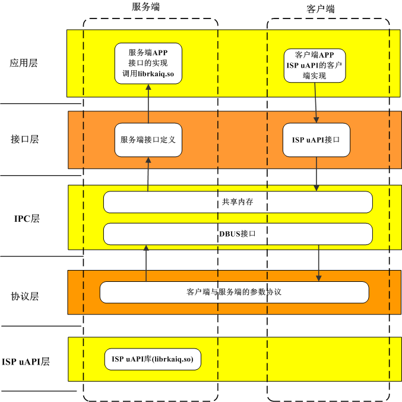

# ISP IPC模块框架说明及接口规范

文件标识：RK-KF-YF-519

发布版本：V1.0.0

日期：2020-06-19

文件密级：□绝密   □秘密   □内部资料   ■公开

**免责声明**

本文档按“现状”提供，瑞芯微电子股份有限公司（“本公司”，下同）不对本文档的任何陈述、信息和内容的准确性、可靠性、完整性、适销性、特定目的性和非侵权性提供任何明示或暗示的声明或保证。本文档仅作为使用指导的参考。

由于产品版本升级或其他原因，本文档将可能在未经任何通知的情况下，不定期进行更新或修改。

**商标声明**

“Rockchip”、“瑞芯微”、“瑞芯”均为本公司的注册商标，归本公司所有。

本文档可能提及的其他所有注册商标或商标，由其各自拥有者所有。

**版权所有 © 2020 瑞芯微电子股份有限公司**

超越合理使用范畴，非经本公司书面许可，任何单位和个人不得擅自摘抄、复制本文档内容的部分或全部，并不得以任何形式传播。

瑞芯微电子股份有限公司

Rockchip Electronics Co., Ltd.

地址：     福建省福州市铜盘路软件园A区18号

网址：     [www.rock-chips.com](http://www.rock-chips.com)

客户服务电话： +86-4007-700-590

客户服务传真： +86-591-83951833

客户服务邮箱： [fae@rock-chips.com](mailto:fae@rock-chips.com)

---

**前言**

**概述**

本文旨在描述RkAiq（Rk Auto Image Quality）模块的作用，整体工作流程，及相关的API接口。主要给
使用RkAiq模块进行ISP功能开发的工程师提供帮助。

**产品版本**

| **芯片名称**  | **内核版本** |
| ------------- | ------------ |
| RV1126/RV1109 | Linux 4.19   |

**读者对象**

本文档（本指南）主要适用于以下工程师：

ISP模块软件开发工程师

系统集成软件开发工程师

**各芯片系统支持状态**

| **芯片名称** | **BuildRoot** | **Debian** | **Yocto** | **Android** |
| ------------ | ------------- | ---------- | --------- | ----------- |
| RV1126       | Y             | N          | N         | N           |
| RV1109       | Y             | N          | N         | N           |

**修订记录**

| **版本号** | **作者** | **修改日期** | **修改说明** |
| ---------- | -------- | :----------- | ------------ |
| V1.0.0     | 邱恩     | 2020-06-19   | 初始版本     |

---

**目录**

[TOC]

---

## 框架概述

### 概述

该模块功能主要实现ispclient应用与服务端ispserver进程间通讯的协议规范，进程间通讯的接口的规范。客户通过我们提供的接口文件，实现客户端应用与ispserver进程间交互。ispserver主要依赖于rkaiq库，通过rkaiq库跟isp交互.ispclient不直接跟rkaiq库交互。

### 软件架构图



<center>图1-1 ISP20 IPC模块框架图</center>

ISP20 IPC模块框架图如图1-1所示。该模块设计按照层次模型进行设计。

- ISP uAPI层：主要是负责调用aiq库提供的接口。
- 协议层：进程间通讯的协议，采用json的协议结构。
- IPC层：主要提供进程间通讯的基础接口，主要采用dbus,共享内存。
- 接口层：给客户端提供的最终调用的接口，协议的封装对客户是透明的。
- 应用层：应用层的接口调用。

---

## 接口规范

### 接口层规范

提供给服务端和客户端的接口。

#### 服务端：

##### **【接口规范】**

```
uAPI接口名+_ipc+(void *args)
void* args:共享内存结构体指针。args是接口的参数的结构体，定义可以详见协议层部分
```

##### **【接口路径】**

`$project/isp2-ipc/interface/`

##### **【接口说明】**

由于接口的功能和rkaiq库的uAPI接口是对应关系的，因此各个接口的具体功能可以参见《Rockchip_Developer_Guide_ISP20_RkAiq_CN.md》功能描述部分。==注意： 服务端编译的时候要注意链接的库是librkaiq.so。==

#### 客户端：

uAPI的.h文件接口的实现，客户端可以不依赖rkaiq库。通过dbus接口调用到服务端接口 （`uAPI接口名+_ipc+(void *args)`）, 然后通过服务端接口调用aiq库实现 头文件的路径目录`$sysroot/usr/include/rkaiq/uApi`目录。==注意：编译客户端的时候要注意链接ispclient.so。==

### 协议层的规范

由于IPC层通讯机制基于共享内存和DBUS的机制，共享内存的主要作用是传输接口的参数数据。dbus的主要作用是同步共享内存,用于客户端通知服务端同步共享内存。

#### **【协议规范】**

```c
   typedef   struct uAPI接口名 {
     rk_aiq_sys_ctx_t* sys_ctx；
     参数2；
     ....
     参数N;
     xCamReturn returnvalue;
   }
```

- 结构体名字用接口名字，为了调用接口能够统一处理，简化代码。
- 结构体的字段代表接口的每个参数。
- 结构体的returnvalue代表每个接口的返回值。
- 结构体的数据存储在共享内存中，通过dbus进行同步。dbus协议是基于json进行传输的。
- json的结构体主要是告诉对方调用的接口名字，共享内存的id。

#### **【协议路径】**

`$project/isp2-ipc/protocol/`

一个协议文件对应头文件对应uAPI的一个头文件，每个结构体对应相应的接口的参数。

#### **【协议说明】**

客户端要通过协议跟服务端,客户端使用的时候协议包含在ispclient中了。每个协议字段的含义可以参考《Rockchip_Developer_Guide_ISP20_RkAiq_CN.md》

---

## DBSERVER的模式适配

dbserver模式主要采用数据库的方式进行进程间通讯, 客户端将isp配置的数据写入数据库，然后通过dbus广播一个消息到ispserver，ispserver收到消息后调用aiq的接口,更新配置。该功能要开启，需要在buildroot/config/xxx.config.h的BR2_PACKAGE_DBSERVER配置打开。

## 源码的构成

```
isp2-ipc
├── client*******************************客户端库的实现
│   ├── CMakeLists.txt
│   ├── dbusconfig***********************dbus配置文件
│   └── impl*****************************客户端uAPI接口的实现
├── CMakeLists.txt
├── common*******************************公共目录
├── demo*********************************客户端的测试demo
├── interface****************************服务端的接口定义
├── libs*********************************aiq库目录
│   └── librkaiq.so
├── LICENSE
├── protocol*****************************协议定义目录
└── server*******************************服务端的实现
    ├── impl*****************************服务端的接口实现，主要实现interface接口
    └── main.c***************************服务端的主程序接口
```

获取这份代码，在 buildroot/config/xxxconfig.h 中加入 `BR2_PACKAGE_ISP2_IPC=y`。服务端的代码编译后生成 ispserver 的 bin 文件。

## A 缩略语

| **缩写** | **全称**                           |
| -------- | ---------------------------------- |
| isp2-ipc | ISP2.0 Interprocess Communication  |
| RkAiq    | Rockchip Automatical Image Quality |
| ISP      | Image Signal Process               |
