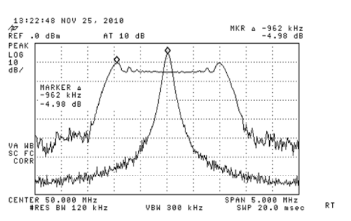
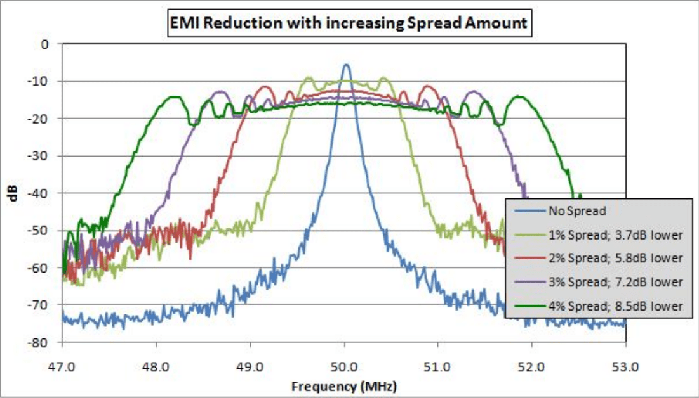

# Rockchip PLL展频功能详细说明

发布版本：V1.1.0

日期：2020-07-25

文件密级：□绝密   □秘密   □内部资料   ■公开

---

**免责声明**

本文档按“现状”提供，瑞芯微电子股份有限公司（“本公司”，下同）不对本文档的任何陈述、信息和内容的准确性、可靠性、完整性、适销性、特定目的性和非侵权性提供任何明示或暗示的声明或保证。本文档仅作为使用指导的参考。

由于产品版本升级或其他原因，本文档将可能在未经任何通知的情况下，不定期进行更新或修改。

**商标声明**

“Rockchip”、“瑞芯微”、“瑞芯”均为本公司的注册商标，归本公司所有。

本文档可能提及的其他所有注册商标或商标，由其各自拥有者所有。

**版权所有© 2020 瑞芯微电子股份有限公司**

超越合理使用范畴，非经本公司书面许可，任何单位和个人不得擅自摘抄、复制本文档内容的部分或全部，并不得以任何形式传播。

瑞芯微电子股份有限公司

Rockchip Electronics Co., Ltd.

地址：     福建省福州市铜盘路软件园A区18号

网址：     [www.rock-chips.com](http://www.rock-chips.com)

客户服务电话： +86-4007-700-590

客户服务传真： +86-591-83951833

客户服务邮箱： [fae@rock-chips.com](mailto:fae@rock-chips.com)

---

**前言**

**概述**

**产品版本**

| **芯片名称** | **内核版本** |
| ------------ | ------------ |
| RK3399       | 4.4 & 4.19   |
| RK1808       | 4.4 & 4.19   |
| RK3328       | 4.4 & 4.19   |
| RK3308       | 4.4 & 4.19   |
| RV1126       | 4.4 & 4.19   |
| PX30         | 4.4 & 4.19   |

**读者对象**

本文档（本指南）主要适用于以下工程师：

技术支持工程师

软件开发工程师

**修订记录**

| **日期**   | **版本** | **作者** | **修改说明**     |
| ---------- | -------- | -------- | ---------------- |
| 2019-03-25 | V1.0.0   | Elaine   | 第一次版本发布   |
| 2020-07-25 | V1.1.0   | Elaine   | 增加更多芯片支持 |
---

[TOC]

---

## 展频概念介绍

### 概念解释

随着技术的发展，数字信号的时钟频率越来越高，电路系统对于信号的建立、保持时间、时钟抖动等要素提出越来越高的要求。EMI，即电磁干扰，是指电路系统通过传导或者辐射的方式，对于周边电路系统产生的影响。EMI会引起电路性能的降低，严重的话，可能导致整个系统失效。在实际操作中，相关机构颁布电磁兼容的规范是为了确保上市的电子产品满足规范要求。时钟信号常常是电路系统中频率最高和边沿最陡的信号，多数EMI问题的产生和时钟信号有关。

降低EMI的方法有许多种，包括屏蔽、滤波、隔离、铁氧体磁环、信号边沿控制以及在PCB中增加电源和GND层等等。在应用中可以灵活使用以上方法，其中屏蔽是相对简单的机械学方法，成本较高，不适用于手持和便携式设备；滤波和信号边沿控制对于低频信号有效，不适合当前广泛应用的高速信号。另外，使用EMI/RFI滤波器这些被动元器件，会增加成本；通过LAYOUT技巧降低EMI显然比较费时，而且因设计的不同，手段也不尽相同。

而我们通过频率调制的手段将集中在窄频带范围内的能量分散到设定的宽频带范围（展频,后文简称SSG），通过降低时钟在基频和奇次谐波频率的幅度（能量），达到降低系统电磁辐射峰值的目的。一般数字时钟有很高的Q值，即所有能量都集中在很窄的频率范围内，表现为相对较高的能量峰值。在频谱图上容易看到在中间频率上有很高的峰值，在奇次谐波位置有较低的峰值；SSCG通过增加时钟带宽的方法降低峰值能量，减小时钟的Q值。

### 工作原理

时钟展频通过特定方式调制原始时钟信号。
应用特点：
SSG是一种Active且低成本的解决EMI问题的方案，可以在保证时钟信号完整性的基础上应对更广频率范围内EMI问题。相比传统上使用Ferrite Beads和RF Chokes抑制EMI，SSC通过时钟内部集成电路调制频率的手段来达到抑制EMI峰值的目的。SSG不仅调制时钟源，其它的同步于时钟源的数据、地址和控制信号，在时钟展频的同时也一并得以调制，整体的EMI峰值都会因此减小，所以说，时钟展频是系统级的解决方案。这是SSCG相比其它抑制EMI措施的最大优势。
SSCG功能可以由用户选择不同配置，以及不同的调制范围等。不开启展频，能量是集中的，开启展频后，把中间能量分散，降低峰值。



图1示意SSG的工作原理。

### 重要参数

时钟展频有三个主要的控制参数：调制速度（Modulation Rate）、调制深度（Modulation Depth）

1. 调制速度

调制速度是指输出时钟频率 fo 在设定的调制频率范围内的变化速度。调制速度应远小于源时钟的频率 fc 以免引起时序问题（建立/保持时间等），同时应当高于人耳可识别的声音的频率范围（20Hz~20KHz）以免产生噪音。在实际应用中，调制速度一般选择30KHz~120KHz。

2. 调制深度

调制深度是指展频后输出时钟频率 fo 以调制速度MR偏移源时钟频率 fc 的大小。调制深度以偏移（Δf）源时钟频率的百分比（%）来表示。调制深度决定降低EMI峰值的大小。通常调制深度越大，EMI峰值越低。在应用时，需要合理预计系统可接受的频率调制范围。



图2示不同调制深度下，EMI峰值的对比。

## 展频参数配置

### PLL展频参数介绍

1. PLL开启展频功能

（1）配置dsmpd为0，也就是PLL需要工作在小数模式。如果PLL没有小数模式就不支持展频功能。

（2）配置ssmod_reset为0，也就是no reset modulator。

（3）配置ssmod_disable_sscg为0，也就是no bypass SSMOD by module。

（4）配置ssmod_bp为0，也就是no Bypass SSMOD by integration.

2. 配置PLL展频幅度

配置ssmod_spread为n，其中n可取0–1f，n为表示展频幅度0.n%。

3. 配置PLL展频速率

配置ssmod_divval为n，其中的n可取0-f。

周期计算公式：
展频速率(hz)=24000000/(refdiv*12*n);

refdiv是PLL的参数之一，寄存器可查询详细查看datasheet。一般这个值是1。

4. 配置PLL向量表

只有RK3399需要配置这个参数，其他平台使用默认内部的向量表就可以。

RK3399配置向量表：
配置ssmod_sel_ext_wave为1，选择到外部表。然后配置ssmod_ext_maxaddr成ff。

备注：
上面所有参数都可以直接在TRM中查询到。

### PLL展频示例

1. RK3399，GPLL展频

```shell
io -4 0xff76008c 0x00080000 # 打开小数模式
io -4 0xff760090 0x00070000 # 打开展频功能
io -4 0xff760094 0x00010001 # 选择外部表，这样才能控制MAX_ADDR
io -4 0xff760090 0x1f000100 # 调节档位 [0, 1f]
io -4 0xff760090 0x00f000f0 # 调节周期 [0, f]
io -4 0xff760094 0xff00ff00 # 调节MAX_ADDR [0, ff]
```

2. RK3328，CPLL展频

```shell
io -4 0xff44004c 0x00080000
io -4 0xff440050 0x00070000
io -4 0xff44004c 0x1f000800 # 设置幅度，其中8可取0–1f，n为0.n%
io -4 0xff44004c 0x00f00060 # 设置速率30khz，其中的6可取0-f，n就为1/(n+1)
```

3. PX30，GPLL展频

```shell
io -4 0xff2bc004 0x10000000 # 打开小数模式
io -4 0xff2bc00c 0x00070000 # 打开展频功能
io -4 0xff2bc00c 0x1f000800 # 设置幅度，其中8可取0–1f，n为0.n%
io -4 0xff2bc00c 0x00f00060 # 设置速率30khz，其中的6可取0-f，n就为1/(n+1)
```

4. RK3308，VPLL0展频

```shell
io -4 0xff500044 0x10000000 # 打开小数模式
io -4 0xff50004c 0x00070000 # 打开展频功能
io -4 0xff50004c 0x1f000800 # 设置幅度，其中8可取0–1f，n为0.n%
io -4 0xff50004c 0x00f00060 # 设置速率30khz，其中的6可取0-f，n就为1/(n+1)
```

5. RV1126，VPLL展频

```shell
io -4 0xff490064 0x10000000 # 打开小数模式
io -4 0xff49006c 0x00070000 # 打开展频功能
io -4 0xff49006c 0x1f000800 # 设置幅度，其中8可取0–1f，n为0.n%
io -4 0xff49006c 0x00f00060 # 设置速率30khz，其中的6可取0-f，n就为1/(n+1)
```

6. RK1808，GPLL展频

```shell
io -4 0xff350064 0x10000000 # 打开小数模式
io -4 0xff35006c 0x00070000 # 打开展频功能
io -4 0xff35006c 0x1f000800 # 设置幅度，其中8可取0–1f，n为0.n%
io -4 0xff35006c 0x00f00060 # 设置速率30khz，其中的6可取0-f，n就为1/(n+1)
```

注意：
RK3036\RK312X\RK322X\RK3188\RK3288\RK3368不支持展频功能。
如果是其他的PLL类似处理，只是基地址修改成对应的PLL。
展频的速率建议使用30Khz，但是展频的幅度没有参考值，需要实验室实测以EMI认证是否通过为准。

### PLL展频代码修改

如果展频参数确定后，需要软件修改。建议展频参数配置越早越好。所以给出两个示例，一个是UBOOT中处理，一个是内核处理。

1. UBOOT（RK3399 DPLL展频）

```diff
diff --git a/drivers/clk/rockchip/clk_rk3399.c b/drivers/clk/rockchip/clk_rk3399.c
--- a/drivers/clk/rockchip/clk_rk3399.c
+++ b/drivers/clk/rockchip/clk_rk3399.c
@@ -1479,6 +1479,15 @@ static int rk3399_clk_probe(struct udevice *dev)
 {
 	struct rk3399_clk_priv *priv = dev_get_priv(dev);
+	writel(0x00080000, &priv->cru->dpll_con[3]);
+	writel(0x00070000, &priv->cru->dpll_con[4]);
+	writel(0x00010001, &priv->cru->dpll_con[5]);
+	/* 展频幅度 */
+	writel(0x1f001f00, &priv->cru->dpll_con[4]);
+	/* 展频周期 */
+	writel(0x00f00060, &priv->cru->dpll_con[4]);
+	writel(0x7f002700, &priv->cru->dpll_con[5]);
+
 #if CONFIG_IS_ENABLED(OF_PLATDATA)
 	struct rk3399_clk_plat *plat = dev_get_platdata(dev);
```

2. KERNEL（RK3399 GPLL VPLL展频）

```diff
diff --git a/drivers/clk/rockchip/clk-rk3399.c b/drivers/clk/rockchip/clk-rk3399.c
--- a/drivers/clk/rockchip/clk-rk3399.c
+++ b/drivers/clk/rockchip/clk-rk3399.c
@@ -1766,6 +1766,20 @@ static void __init rk3399_clk_init(struct device_node *np)

	rockchip_register_restart_notifier(ctx, RK3399_GLB_SRST_FST, NULL);
+	writel(0x00010001, 0xff760094);
+	writel(0x1f000100, 0xff760090);
+	writel(0x00f000f0, 0xff760090);
+	writel(0x7f002700, 0xff760094);
+	writel(0x00070000, 0xff760090);
+	writel(0x00080000, 0xff76008c);
+
+	writel(0x00010001, 0xff7600d4);
+	writel(0x1f000a00, 0xff7600d0);
+	writel(0x00f00060, 0xff7600d0);
+	writel(0x7f002700, 0xff7600d4);
+	writel(0x00070000, 0xff7600d0);
+	writel(0x00080000, 0xff7600cc);
+
 	rockchip_clk_of_add_provider(np, ctx);
 }
 CLK_OF_DECLARE(rk3399_cru, "rockchip,rk3399-cru", rk3399_clk_init);
```

注意：
如果是DDR（DPLL）展频，尽量放在LOADER处理，因为其他位置处理DDR的时钟，可能会造成系统不稳定死机等问题。

## 展频注意事项

1. 时钟抖动

时钟展频的一大弊端是不能用于对时钟精度敏感的应用，如以太网和CAN总线。在选择时钟展频和调制深度时，设计人员需要特别注意展频引入额外的Jitter，并可能由此引起的建立/保持时间问题、高误码率和PLL失锁问题。Jitter分为不同类别，对系统性能有不同程度的影响。
时钟展频只引入非常小的周期间抖动。例如30KHz~120KHz调制速度的时钟展频，源时钟的频率至少是MR的1000倍，也就是说至少经过1000个时钟周期，才完成一个调制周期，输出时钟fc相邻周期间的差别非常小。当然，设备（时钟发生器）本身也存在固有的周期间抖动。展频大约只引入低于0.05%的周期间抖动进入到系统。因此展频非常适用于需要低周期间抖动、低误码率和低EMI的系统。

2. 稳定性

因为我们平台是PLL展频，一旦PLL展频后，PLL下面的所有自时钟都工作在展频模式下。对自时钟的影响很多都是未知的，要增加功能测试和稳定性测试。

3. 共用性

因为我们平台是PLL展频，一旦PLL展频后，PLL下面的所有自时钟都工作在展频模式下。如EMMC和SDIO都在一个PLL下面，但是两个的EMI对展频参数要求不同，此时共用一个PLL就需要特别注意，尽量选择折中的展频参数，可以同时满足两个模块对EMI的要求。

备注：

- DDR、USB、SDIO、I2C、SPI、I2S、USB3.0、PCIE、eDP这些一般其规格书中有定义SSC的，按要求设置参数。规范中没有定义SSC的，且在打开SSC的幅度导致部分指标测试失败的，都需要做稳定性、兼容性测试。

- 只针对需求开SSC，原则是以EMI指标满足要求情况下SSC幅度尽可能开小。

例如：USB2.0，在开SSC之后频率测试项多半是过不了，这种情况下，要看PHY中的弹性buffer大小，buffer越大对展频幅度的适应性越强，兼容也越好，buffer越小对展频幅度的适应性就差，容易在展频到高频阶段导致buffer溢出。

- 所以展频是有风险的，每个项目不同展频后的现象也会有差异，只能特例特看了。
