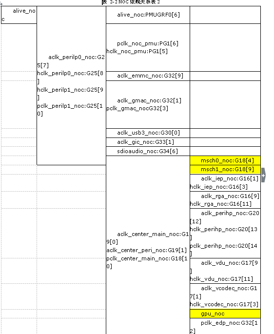

# Rockchip 时钟配置详细说明

文件标识：RK-KF-YF-030

发布版本：V1.1.1

日期：2021-04-28

文件密级：□绝密   □秘密   □内部资料   ■公开

**免责声明**

本文档按“现状”提供，瑞芯微电子股份有限公司（“本公司”，下同）不对本文档的任何陈述、信息和内容的准确性、可靠性、完整性、适销性、特定目的性和非侵权性提供任何明示或暗示的声明或保证。本文档仅作为使用指导的参考。

由于产品版本升级或其他原因，本文档将可能在未经任何通知的情况下，不定期进行更新或修改。

**商标声明**

“Rockchip”、“瑞芯微”、“瑞芯”均为本公司的注册商标，归本公司所有。

本文档可能提及的其他所有注册商标或商标，由其各自拥有者所有。

**版权所有 © 2021 瑞芯微电子股份有限公司**

超越合理使用范畴，非经本公司书面许可，任何单位和个人不得擅自摘抄、复制本文档内容的部分或全部，并不得以任何形式传播。

瑞芯微电子股份有限公司

Rockchip Electronics Co., Ltd.

地址：     福建省福州市铜盘路软件园A区18号

网址：     [www.rock-chips.com](http://www.rock-chips.com)

客户服务电话： +86-4007-700-590

客户服务传真： +86-591-83951833

客户服务邮箱： [fae@rock-chips.com](mailto:fae@rock-chips.com)

---

**前言**

**概述**

**产品版本**

| **芯片名称** | **内核版本** |
| ------------ | ------------ |
| RK3399       | 4.4          |
| RK3399       | 4.19         |

**读者对象**

本文档（本指南）主要适用于以下工程师：

技术支持工程师

软件开发工程师

**修订记录**

| **版本号** | **作者** | **修改日期** | **修改说明**       |
| ---------- | -------- | ------------ | ------------------ |
| V1.0.0     | 张 晴    | 2018-06-08   | 第一次临时版本发布 |
| V1.1.0     | 张 晴    | 2019-11-11   | 支持Linux 4.19     |
| V1.1.1     | 黄 莹    | 2021-04-28   | 修改格式           |

---

**目录**

[TOC]

---

## 时钟配置

### CRU 时钟配置

#### CRU 时钟树

时钟树太长，不做说明，详细 cat /sys/kernel/debug/clk/clk_summary

#### 配置一些时钟常开

对于调试过程中，想把某些时钟设置成常开的，可以修改 rk3399_cru_critical_clocks 这个结构体,按照现有增加时钟名字即可：

```c
drivers/clk/rockchip/clk-rk3399.c

	static const char *const rk3399_cru_critical_clocks[] __initconst = {
		"aclk_usb3_noc",
	};
```

这个结构中的 clk 在系统开机，clk 初始化的时候会默认调用 clk_set_enable 接口。

注意：如果时钟不是常开的，驱动设备也没有引用这个时钟并开启，在时钟初始化完成之后，会调用 clk_disable_unused_subtree（drivers/clk/clk.c）关闭没有用的时钟。如果没有用的时钟不想被关闭，可以在 dts 中的增加属性 clk_ignore_unused：

```c
	chosen {
　　　bootargs = "earlyprintk=uart8250-32bit,0xff690000 clk_ignore_unused";
	};
```

#### CLK ID 获取

4.4 的内核 dts 引用时钟，是根据 clk id，不像 3.10 通过 clk name 索引。
CLK ID 获取，详细见文档《Rockchip Clock 开发指南》中 2.3.2 章节。

#### PLL 时钟配置

PLL 锁相环详细介绍见文档《Rockchip Clock 开发指南》中 1.3 和 2.2.1 章节中。一般 PLL 不需要修改，尤其是下面挂了显示相关时钟的，PLL 最好不要重现设置否则会有抖动问题。PLL 的设置可以在 UBOOT 中，也可以直接在 cru 节点里面设置。

1. dts 中设置

但是只在节点初始化的时候调用一次。

```c
	cru: clock-controller@ff760000 {
		assigned-clocks =
			<&cru ARMCLKL>, <&cru ARMCLKB>,
			<&cru PLL_NPLL>, <&cru PLL_CPLL>,
			<&cru PLL_GPLL>;
		assigned-clock-rates =
			<816000000>,   <816000000>,
			<600000000>, <500000000>,
			<800000000>;
	};
```

| **ARMB PLL** | **ARML PLL** | **DDR PLL** | **GPLL** | **CPLL** | **VPLL** | **NPLL** | **USBPHYPLL** | **PMUPLL** |
| ------------ | ------------ | ----------- | -------- | -------- | -------- | -------- | ------------- | ---------- |
| 1200         | 900          | 900         | 600      | 800      | 1200     | 1000     | 480           | 700        |

2. PLL 计算公式

　　　RK 平台目前有两种类型 PLL，一种是 NR\NF\NO（RK3066、RK3188、RK3288），一种 REF\POSTDIV1\POSTDIV2（RK3036、RK312X、RK322X、RK332X、RK336X、RK3399）
　　　1)NR、NF、NO 类型，只有整数分频
　　　FREF = FIN / NR
　　　FOUTVCO = FREF  * NF
　　　FOUTPOSTDIV = FOUTVCO / NO
　　　FREF 范围： 269MHZ - 2200MHZ，VCO 范围: 440MHz – 2200MHz，输出频率范围：27.5MHz – 2200MHz。
　　　NF_MAX：4096，NR_MAX：64，NO_MAX：16（只能偶数）
　　　2)REF\POSTDIV1\POSTDIV2 类型，支持整数分频和小数分频
　　　整数分频：
　　　If DSMPD = 1 (DSM is disabled, "integer mode")
　　　FOUTVCO = FREF / REFDIV * FBDIV
　　　FOUTPOSTDIV = FOUTVCO / POSTDIV1 / POSTDIV2
　　　小数分频：
　　　If DSMPD = 0 (DSM is enabled, "fractional mode")
　　　FOUTVCO = FREF / REFDIV * (FBDIV + FRAC / 2^24)
　　　FOUTPOSTDIV = FOUTVCO / POSTDIV1 / POSTDIV2
　　　VCO 范围: 440MHz – 3200MHz，输出频率范围：27.5MHz – 2200MHz。
　　　REFDIV_MAX：63，FBDIV_MAX：4095，POSTDIV1_MAX：7，POSTDIV1_MAX：7。

备注：
	一般 PLL 是不需要做修改的，默认配置就可以，但是显示的时钟会对 Jitter 有要求，所以一般就是显示 dclk 独占的 PLL 有这种特殊的要求。可能会做一些微调。

PLL 设置原则：
	PLL 一般要求频率尽量在 600-1200M，这样 VCO 比较合适（jitter 会小）。目前的时钟频率基本都是支持自动计算的，但是自动计算只能保证 VCO 在上述范围内，不能保证 VCO 是最好的。所以如果对 VCO 有严格要求可以按照下面方式处理：
PLL 频率尽量设置大一些，然后通过后端分频。如：DCLK 50M，可以把 CPLL 设置成 1000M，然后 20 分频。（这样 Jitter 肯定比把 CPLL 设置成 50M 或者 100M 的时候要好）
这种修改方式可以放在 cru 节点或者设备节点中使用 assigned-clock-rates 的方式（本章节（1）），或者在驱动中，先设置 PLL 然后再设置 dclk 的方式。
可以在 PLL 频率表中增加所需要的频率，并且指定 VCO。

以 RK3399 4.4 内核为例：

```c
	static struct rockchip_pll_rate_table rk3399_vpll_rates[] = {
		/* _mhz, _refdiv, _fbdiv, _postdiv1, _postdiv2, _dsmpd, _frac */
		RK3036_PLL_RATE( 594000000, 1, 123, 5, 1, 0, 12582912),  /* vco = 2970000000 */
		RK3036_PLL_RATE( 593406593, 1, 123, 5, 1, 0, 10508804),  /* vco = 2967032965 */
		RK3036_PLL_RATE( 297000000, 1, 123, 5, 2, 0, 12582912),  /* vco = 2970000000 */
		RK3036_PLL_RATE( 296703297, 1, 123, 5, 2, 0, 10508807),  /* vco = 2967032970 */
		RK3036_PLL_RATE( 148500000, 1, 129, 7, 3, 0, 15728640),  /* vco = 3118500000 */
		RK3036_PLL_RATE( 148351648, 1, 123, 5, 4, 0, 10508800),  /* vco = 2967032960 */
		RK3036_PLL_RATE( 106500000, 1, 124, 7, 4, 0,  4194304),  /* vco = 2982000000 */
		RK3036_PLL_RATE(  74250000, 1, 129, 7, 6, 0, 15728640),  /* vco = 3118500000 */
		RK3036_PLL_RATE(  74175824, 1, 129, 7, 6, 0, 13550823),  /* vco = 3115384608 */
		RK3036_PLL_RATE(  65000000, 1, 113, 7, 6, 0, 12582912),  /* vco = 2730000000 */
		RK3036_PLL_RATE(  59340659, 1, 121, 7, 7, 0,  2581098),  /* vco = 2907692291 */
		RK3036_PLL_RATE(  54000000, 1, 110, 7, 7, 0,  4194304),  /* vco = 2646000000 */
		RK3036_PLL_RATE(  27000000, 1,  55, 7, 7, 0,  2097152),  /* vco = 1323000000 */
		RK3036_PLL_RATE(  26973027, 1,  55, 7, 7, 0,  1173232),  /* vco = 1321678323 */
		{ /* sentinel */ },
	};
```

可以修改表中的频率对应的_refdiv, _fbdiv, _postdiv1, _postdiv2，以达到比较合适的 VCO。
（对应 3.10 内核的处理方式请参考文档 Rockchip Clock 开发指南中 3.1 章节）

#### CLK_TIMER 时钟配置

　　　Timer 的时钟都是从 24M 直接经过 gating bypass 过来的。所以没有频率设置的概念，只有开关时钟的说法。如果想把 clk 配置成常开，请参考本文 1.1.2.
如果驱动自己控制可以如下操作：

```c
	struct clk *clk;
	clk = clk_get(NULL, "clk_timer00");
	clk_prepare_enable(clk);
```

#### 总线时钟配置

　　　总线时钟分为高速跟低速的， 高速时钟 aclk_perihp、hclk_perihp、pclk_perihp，低速时钟是 aclk_perilp0、hclk_perilp0、pclk_perilp0 和 hclk_perilp1、pclk_perilp1 是可以配置时钟频率的，但是时钟树上这些时钟其下面的子时钟都是 gating，只能开关，不能设置频率，如果希望修改频率，只能修改父时钟的频率。CCI 做核间通信的总线时钟 ACLK_CCI。DDR 总线 ACLK_CENTER。

**频率设置方法**

dts 中设置(但是只在节点初始化的时候调用一次)

```c
	cru: clock-controller@ff760000 {
		assigned-clocks =
			<&cru ACLK_PERIHP>, <&cru HCLK_PERIHP>,
			<&cru PCLK_PERIHP>,
			<&cru ACLK_PERILP0>, <&cru HCLK_PERILP0>,
			<&cru PCLK_PERILP0>,
			<&cru HCLK_PERILP1>, <&cru PCLK_PERILP1>，
			<&cru ACLK_CCI>, <&cru ACLK_CENTER>;
		assigned-clock-rates =
			<150000000>,   <75000000>,
			<37500000>,
			<100000000>,  <100000000>,
			<50000000>,
			<100000000>,   <50000000>，
			<40000000>, <40000000>;
	};
```

总线没有单独的驱动，也没有单独的节点，所以频率设置都是在 cru 节点中通过 assigned 的方式处理。

**时钟频率范围**

总线中 aclk 一般是用于数据传输，hclk 跟 pclk 用于寄存器读写等。设计的频率：

| CLK          | SIZEOFF | CLK          | SIZEOFF |
| ------------ | ------- | ------------ | ------- |
| ACLK_PERIHP  | 300M    | ACLK_PERILP0 | 300M    |
| HCLK_PERIHP  | 150M    | HCLK_PERILP0 | 150M    |
| PCLK_PERIHP  | 150M    | PCLK_PERILP0 | 150M    |
| HCLK_PERILP1 | 150M    | PCLK_PERILP1 | 150M    |
| CCI          | 600M    | ACLK_CENTER  | 300M    |

如果超频需要考虑加压（logic 路加压）

#### FCLK_CM0S 时钟配置

　　　fclk_cm0s 是在 cru 而 fclk_cm0s_src_pmu 是在 pmucru 的，两个时钟设置是有差异的。Pmucru 请看本章节中 1.2.4.fclk_cm0s 是可以配置时钟的，其下面的时钟都是 gating(hclk_m0_perilp_noc\clk_m0_perilp_dec\dclk_m0_perilp\hclk_m0_perilp\sclk_m0_perilp)，只能开关，不能设置频率，如果希望修改频率，只能修改 fclk_cm0s 的频率。而且频率只能从 GPLL 或者 CPLL 分频下来。

**频率设置方法**

dts 中设置，但是只在节点初始化的时候调用一次。

```c
	cru: clock-controller@ff760000 {
		assigned-clocks = <&cru FCLK_CM0S>;
		assigned-clock-rates = <100000000>;
	};
```

可以放在 cru 节点，也可以放在设备的节点里面。
驱动中设置频率
总线一般没有单独的驱动，所以一般是在 dts 设置，如果部分驱动内部想调整这个频率也是可以的。

```c
	struct clk *clk;
	clk = clk_get(NULL, "fclk_cm0s");
	clk_set_rate(clk, rate);/* rate单位hz */
```

**时钟频率范围**

M0 设计的频率是 100M，如果超频需要考虑加压（logic 路加压）

#### CLK_I2C 时钟配置

　　　需要注意 I2c1、2、3、5、6、7 在 cru 模块中（I2C0、4、8 在 pmucru 设置频率参考本章节 1.2.5），3399 的芯片 i2c 有两个时钟，一个控制时钟 clk_i2c1 一个配置时钟 pclk_i2c1。控制时钟的频率只能从 CPLL、GPLL 分频，配置时钟频率是从 pclk_perilp1 来，自身只是 gating 不能修改频率，如果修改频率就要修改 pclk_perilp1（见 1.1.5）。

**频率设置方法（以 i2c1 为例)**

1. dts 中设置，但是只在节点初始化的时候调用一次。

```c
	i2c1: i2c@ff110000 {
		clocks = <&cru SCLK_I2C1>, <&cru PCLK_I2C1>;
		clock-names = "i2c", "pclk";
		assigned-clocks = <&cru SCLK_I2C1>;
		assigned-clock-rates = <50000000>;
	};
```

可以放在 cru 节点，也可以放在设备的节点里面。

2. 驱动中设置频率

```c
	I2C的驱动文件drivers/i2c/busses/i2c-rk3x.c中：
	i2c->clk = devm_clk_get(&pdev->dev, "i2c");
	i2c->pclk = devm_clk_get(&pdev->dev, "pclk");
	clk_set_rate(i2c->clk, rate);/* rate单位hz */
```

**时钟频率范围**

一般使用控制时钟频率不超过 100M，配置时钟不超过 100M。如果超频需要考虑加压（logic 路加压）

#### CLK_SPI 时钟配置

　　　需要注意 spi0、1、2、4、5 在 cru 模块中（spi3 在 pmucru 设置频率参考本章节 1.2.6），3399 的芯片 spi 有两个时钟，一个控制时钟 clk_spi0 一个配置时钟 pclk_spi0。控制时钟的频率只能从 CPLL、GPLL 分频，配置时钟频率是 spi0、1、2、4 是从 pclk_perilp1，spi5 从 hclk_perilp1，自身只是 gating 不能修改频率，如果修改频率就要修改 pclk_perilp1 和 hclk_perilp1（见 1.1.5）。

**频率设置方法**

1. dts 中设置，但是只在节点初始化的时候调用一次。

```c
	spi0: spi@ff1c0000 {
		clocks = <&cru SCLK_SPI0>, <&cru PCLK_SPI0>;
		clock-names = "spiclk", "apb_pclk";
		assigned-clocks = <&cru SCLK_SPI0>;
		assigned-clock-rates = <50000000>;
	};
```

可以放在 cru 节点，也可以放在设备的节点里面。

2. 驱动中设置频率

SPI 的驱动文件 drivers/spi/spi-rockchip.c 中：

```c
	rs->apb_pclk = devm_clk_get(&pdev->dev, "apb_pclk");
	rs->spiclk = devm_clk_get(&pdev->dev, "spiclk");
	clk_set_rate(rs->spiclk, rate);/* rate单位hz */
```

**时钟频率范围**

一般使用控制时钟频率不超过 50M，配置时钟不超过 50M。如果超频需要考虑加压（logic 路加压）

#### CLK_UART 时钟配置

　　　需要注意 uart0、1、2、3 在 cru 模块中（uart4 在 pmucru 设置频率参考本章节 1.2.8），3399 的芯片 uart 有两个时钟，一个控制时钟 clk_uart0 一个配置时钟 pclk_uart0。控制时钟支持小数分频和整数分频。clk_uart0_div 由 CPLL、GPLL、USB480M 整数分频得到，clk_uart0_frac 是由 clk_uart0_div 做输入时钟然后使用小数分频器分频的（小数分频需要注意输入时钟要是输出时钟的 20 倍以上，否则时钟 Jitter 很差）。具体使用时整数分频能满足走整数分频，整数分频不能满足走小数分频。配置时钟频率是从 pclk_perilp1 来，自身只是 gating 不能修改频率，如果修改频率就要修改 pclk_perilp1（见 1.1.5）。

**频率设置方法**

1. dts 中设置，但是只在节点初始化的时候调用一次。

```c
	uart0: serial@ff180000 {
		clocks = <&cru SCLK_UART0>, <&cru PCLK_UART0>;
		clock-names = "baudclk", "apb_pclk";
		assigned-clocks = <&cru SCLK_UART0>;
		assigned-clock-rates = <24000000>;
	};
```

可以放在 cru 节点，也可以放在设备的节点里面。

2. 驱动中设置频率

UART 的驱动文件 drivers/tty/serial/8250/8250_dw.c

```c
	data->clk = devm_clk_get(&pdev->dev, "baudclk");
	data->pclk = devm_clk_get(&pdev->dev, "apb_pclk");
	clk_set_rate(data->clk, rate);/* rate单位hz */
```

**时钟频率范围**

这个主要看 uart 要求的波特率是多少，一般 uart 的频率是波特率 * 16（HZ），一般我们平台默认支持 115200、1500000 两种，其他波特率要具体看 PLL 的频率是否可以分到。

#### CLK_EMMC、CLK_SDIO、CLK_SDMMC 时钟配置

　　　这几个比较特殊，由于内部是双边沿采集数据，所以要求时钟的占空比是 50%,也就要求必须是偶数分频。Emmc 有两个时钟，clk_emmc 是控制器时钟，要求偶数分频的。Aclk_emmc 是数据传输和配置时钟。SDIO 有有两个时钟，clk_sdio 是控制器时钟，要求偶数分频的。hclk_sdio 是配置时钟。SDMMC 有有两个时钟，clk_sdmmc 是控制器时钟，要求偶数分频的。hclk_sdmmc 是配置时钟。控制时钟都是可以配置频率的，aclk_emmc、hclk_sdmmc 也是可以单独配置频率，hclk_sdio 是一个 gating 是从 hclk_perilp1 来，需要修改 Hclk_sdio 只能修改 hclk_perilp1(见 1.1.5).

**频率设置方法**

1. dts 中设置，但是只在节点初始化的时候调用一次。

```c
	sdhci: sdhci@fe330000 {
		assigned-clocks = <&cru SCLK_EMMC>;
		assigned-clock-rates = <200000000>;
		clocks = <&cru SCLK_EMMC>, <&cru ACLK_EMMC>;
		clock-names = "clk_xin", "clk_ahb";
	};
	sdio0: dwmmc@fe310000 {
		assigned-clocks = <&cru SCLK_SDIO>;
		assigned-clock-rates = <100000000>;
		clocks = <&cru HCLK_SDIO>, <&cru SCLK_SDIO>,
		 	<&cru SCLK_SDIO_DRV>, <&cru SCLK_SDIO_SAMPLE>;
		clock-names = "biu", "ciu", "ciu-drive", "ciu-sample";
	};
	sdmmc: dwmmc@fe320000 {
		assigned-clocks = <&cru SCLK_SDMMC>;
		assigned-clock-rates = <100000000>;
		clocks = <&cru HCLK_SDMMC>, <&cru SCLK_SDMMC>,
		 	<&cru SCLK_SDMMC_DRV>, <&cru SCLK_SDMMC_SAMPLE>;
		clock-names = "biu", "ciu", "ciu-drive", "ciu-sample";
	};
```

可以放在 cru 节点，也可以放在设备的节点里面。

2. 驱动中设置频率

EMMC 的驱动文件 drivers/mmc/host/Sdhci-of-arasan.c

```c
	sdhci_arasan->clk_ahb = devm_clk_get(&pdev->dev, "clk_ahb");
	clk_xin = devm_clk_get(&pdev->dev, "clk_xin");
	clk_set_rate(clk_xin, rate);/* rate单位hz */
```

**时钟频率范围**

时钟的频率范围如下，这个是输入频率，模块内部还有二分频，所以模块输出的实际频率是时钟树上看到频率的 2 分频。

| **CLK 名称** | **sizeoff 频率**     |
| ------------ | -------------------- |
| EMMC         | 200M                 |
| ACLK_EMMC    | 100M（300M/b  64Bit) |
| SDMMC/SDIO   | 300/240M（<=300M)    |

**注意**
　　　对于频率设置需要说明，EMMC、SDIO、SDMMC 的控制时钟的 parent 一般有 CPLL、GPLL、NPLL、PPLL、UPLL。一般这些 PLL 中，CPLL 被显示独占，如果 EMMC 需要 200M 频率，那么要求 PLL 频率是 400M\800M\1200M,所以控制时钟能分到的频率要看 PLL 的频率是多少？一定是偶数分频得到的频率才可以（如果 PLL 只有 600M 和 800M， 那么只能分出 150\200\300\400M,实际在控制器输出频率只能那个有 75、100、150、200M）。

#### 显示相关 VOP、HDCP、EDP 跟 ISP 时钟配置

　　　显示相关的时钟需求比较多，dclk 一般要求任意频率，因为显示的分辨率不同 dclk 频率不同。而 aclk 跟 Hclk 做为数据传输和寄存器配置时钟一般是固定在一个值上，不会变化，一旦显示情况下修改 aclk 很 hclk 可能会造成显示抖动等。

**DCLK**
　　　如果要支持任意分辨率也就是要求 DCLK 可以出任意频率，一般这种情况 DCLK 要独占一个 PLL，如果是双显也就是要两个 PLL 独立给 DCLK 使用（是否支持一般在芯片设计的时候就已经确定了，或者说支持双显后可以不需要支持其他特殊的功能）。RK3399 的平台如果打开宏 RK3399_TWO_PLL_FOR_VOP 是支持双显任意频率，dclk_vop0 独占 CPLL，dclk_vop1 独占 VPLL。并且 dclk_vop0 和 dclk_vop1 都 CLK_SET_RATE_PARENT 的属性，dclk 需要多少就会将对于的 parent 的 Pll 设置成多少。如果没有开启宏。只有 dclk_vop0 独占 CPLL 可以支持任意频率，dclk_vop1 就是在当前 parent 可以就近分频。

```c
#ifdef RK3399_TWO_PLL_FOR_VOP
	COMPOSITE(DCLK_VOP0_DIV, "dclk_vop0_div", mux_pll_src_vpll_cpll_gpll_p,
			CLK_SET_RATE_PARENT | CLK_SET_RATE_NO_REPARENT,
			RK3399_CLKSEL_CON(49), 8, 2, MFLAGS, 0, 8, DFLAGS,
			RK3399_CLKGATE_CON(10), 12, GFLAGS),
#else
	COMPOSITE(DCLK_VOP0_DIV, "dclk_vop0_div", mux_pll_src_vpll_cpll_gpll_p,
			CLK_SET_RATE_PARENT,
			RK3399_CLKSEL_CON(49), 8, 2, MFLAGS, 0, 8, DFLAGS,
			RK3399_CLKGATE_CON(10), 12, GFLAGS),
#endif

#ifdef RK3399_TWO_PLL_FOR_VOP
	COMPOSITE(DCLK_VOP1_DIV, "dclk_vop1_div", mux_pll_src_vpll_cpll_gpll_p,
			CLK_SET_RATE_PARENT | CLK_SET_RATE_NO_REPARENT,
			RK3399_CLKSEL_CON(50), 8, 2, MFLAGS, 0, 8, DFLAGS,
			RK3399_CLKGATE_CON(10), 13, GFLAGS),
#else
	COMPOSITE(DCLK_VOP1_DIV, "dclk_vop1_div", mux_pll_src_dmyvpll_cpll_gpll_p, 0,
			RK3399_CLKSEL_CON(50), 8, 2, MFLAGS, 0, 8, DFLAGS,
			RK3399_CLKGATE_CON(10), 13, GFLAGS),
#endif
```

**ACLK、HCLK**
　　　支持频率设置，但是如果有 Uboot 显示的时候，要求 Uboot 到 kernel，频率不能发生变化，否则会闪屏。也就是要求 uboot 跟 kernel 的 aclk hclk 频率一致，其 parent 一致，parent 频率一致。

**频率设置方法**

1. dts 中设置

指定 vop dclk 的 parent，因为 rk3399 硬件设计原因，要求给 hdmi 使用的那个 vop 一定要在 vpll 上（跟 hdmi 是同源的），另一个 vop 的 parent 是 cpll。在各自的 dts 中，显示的节点中增加。

```c
	&vopb_rk_fb {
		assigned-clocks = <&cru DCLK_VOP0_DIV>;
		assigned-clock-parents = <&cru PLL_VPLL>;
	};
	&vopl_rk_fb {
		assigned-clocks = <&cru DCLK_VOP1_DIV>;
		assigned-clock-parents = <&cru PLL_CPLL>;
	};
```

而 ACLK 跟 HCLK 只需要初始化一次：

```c
	&vopb {
		clocks = <&cru ACLK_VOP0>, <&cru DCLK_VOP0>, <&cru HCLK_VOP0>, <&cru
		DCLK_VOP0_DIV>;
		clock-names = "aclk_vop", "dclk_vop", "hclk_vop", "dclk_source";
		assigned-clocks = <&cru ACLK_VOP0>, <&cru HCLK_VOP0>;
		assigned-clock-rates = <400000000>, <100000000>;
	};
```

可以放在 cru 节点，也可以放在设备的节点里面。HDCP、EDP 跟 ISP 设置类似处理。

**HDCP**
　　　ACLK_HDCP 可以从 CPLL、GPLL、PPLL 分频得到、HCLK_HDCP 和 PCLK_HDCP 是从 ACLK_HDCP 分频得到。都有独立的 gating。

**EDP**
　　　只有 PCLK_EDP，可以从 CPLL、GPLL 分频得到。其他的 EDP 时钟都是挂在这个下面的独立 gating。

**ISP**
　　　ACLK_ISP0、ACLK_ISP1 用于总线数据传输的可以从 CPLL、GPLL、PPLL 分频得到、HCLK_ISP0、HCLK_ISP1 是寄存器配置时钟直接从 ACLK 分频、SCLK_ISP0、SCLK_ISP1 是控制器时钟可以从 CPLL、GPLL、NPLL 分频得到。引用时钟的时候 ACLK 引用 ACLK_ISP0_WRAPPER，HCLK 引用 HCLK_ISP0_WRAPPER,会自动打开上级的 parent 时钟保证 ACLK 跟 HCLK 时钟通路开启。

2. 驱动中设置频率

vop 的驱动文件 drivers/gpu/drm/rockchip/rockchip_drm_vop.c

```c
	vop->hclk = devm_clk_get(vop->dev, "hclk_vop");
	if (IS_ERR(vop->hclk)) {
		dev_err(vop->dev, "failed to get hclk source\n");
		return PTR_ERR(vop->hclk);
	}
	vop->aclk = devm_clk_get(vop->dev, "aclk_vop");
	if (IS_ERR(vop->aclk)) {
		dev_err(vop->dev, "failed to get aclk source\n");
		return PTR_ERR(vop->aclk);
	}
	vop->dclk = devm_clk_get(vop->dev, "dclk_vop");
	if (IS_ERR(vop->dclk)) {
		dev_err(vop->dev, "failed to get dclk source\n");
		return PTR_ERR(vop->dclk);
	}
```

**时钟频率范围**

Dclk 主要是看屏的分辨率是多少。因为 PLL 使用自动计算的，jitter 不是最优，如果需要调整，可以在 PLL 表格中自己计算合适的 VCO 填进去(VCO 的计算方式详细见 RK3399 datasheet 的 2.6.2)。

```c

Drivers/clk/rockchip/clk-rk3399.c

	static struct rockchip_pll_rate_table rk3399_vpll_rates[] = {
		/* _mhz, _refdiv, _fbdiv, _postdiv1, _postdiv2, _dsmpd, _frac */
		RK3036_PLL_RATE( 594000000, 1, 123, 5, 1, 0, 12582912),  /* vco = 2970000000 */
		RK3036_PLL_RATE( 593406593, 1, 123, 5, 1, 0, 10508804),  /* vco = 2967032965 */
		RK3036_PLL_RATE( 297000000, 1, 123, 5, 2, 0, 12582912),  /* vco = 2970000000 */
		RK3036_PLL_RATE( 296703297, 1, 123, 5, 2, 0, 10508807),  /* vco = 2967032970 */
		RK3036_PLL_RATE( 148500000, 1, 129, 7, 3, 0, 15728640),  /* vco = 3118500000 */
		RK3036_PLL_RATE( 148351648, 1, 123, 5, 4, 0, 10508800),  /* vco = 2967032960 */
		RK3036_PLL_RATE( 106500000, 1, 124, 7, 4, 0,  4194304),  /* vco = 2982000000 */
		RK3036_PLL_RATE(  74250000, 1, 129, 7, 6, 0, 15728640),  /* vco = 3118500000 */
		RK3036_PLL_RATE(  74175824, 1, 129, 7, 6, 0, 13550823),  /* vco = 3115384608 */
		RK3036_PLL_RATE(  65000000, 1, 113, 7, 6, 0, 12582912),  /* vco = 2730000000 */
		RK3036_PLL_RATE(  59340659, 1, 121, 7, 7, 0,  2581098),  /* vco = 2907692291 */
		RK3036_PLL_RATE(  54000000, 1, 110, 7, 7, 0,  4194304),  /* vco = 2646000000 */
		RK3036_PLL_RATE(  27000000, 1,  55, 7, 7, 0,  2097152),  /* vco = 1323000000 */
		RK3036_PLL_RATE(  26973027, 1,  55, 7, 7, 0,  1173232),  /* vco = 1321678323 */
		{ /* sentinel */ },
	};
```

而对于对应的频率范围（如果做 4K 显示带宽不够可以相应提高 ACLK 的频率，但是要注意电压是不是够是否需要提压）：

| CLK            | SIZEOFF | CLK         | SIZEOFF |
| :------------- | ------- | ----------- | ------- |
| ACLK_VOP0/1    | 400M    | ACLK_VIO    | 400M    |
| DCLK_VOP0      | 600M    | ACLK_ISP0/1 | 400M    |
| DCLK_VOP1      | 300M    | CLK_ISP0/1  | 500M    |
| CLK_VOP0/1_PWM | 200M    | CLK_EDP     | 200M    |
| ACLK_HDCP      | 400M    |             |         |

#### 视频编解码 VDU、RGA、CODEC、IEP 相关时钟配置

　　　主要是 VDU、RGA、CODEC、IEP 相关的时钟配置。

**VDU**
　　　ACLK_VDU 可以从 CPLL、GPLL、NPLL、PPLL 分频得到，HCLK_VDU 从 ACLK 分频得到。控制器时钟 SCLK_VDU_CORE 和 SCLK_VDU_CA 从 CPLL、GPLL、NPLL 分频得到。

**RGA**
　　　ACLK_RGA 可以从 CPLL、GPLL、NPLL、PPLL 分频得到，HCLK_RGA 从 ACLK 分频得到。

**CODEC**
　　　ACLK_VCODEC 可以从 CPLL、GPLL、NPLL、PPLL 分频得到，HCLK_VCODEC 从 ACLK 分频得到。控制器时钟 SCLK_RGA_CORE 从 CPLL、GPLL、NPLL、PPLL 分频得到。

**IEP**
　　　ACLK_IEP 可以从 CPLL、GPLL、NPLL、PPLL 分频得到，HCLK_IEP 从 ACLK 分频得到。

**频率设置方法**

1. dts 中设置，但是只在节点初始化的时候调用一次。

```c
	rkvdec: rkvdec@ff660000 {
		clocks = <&cru ACLK_VDU>, <&cru HCLK_VDU>,
		<&cru SCLK_VDU_CA>, <&cru SCLK_VDU_CORE>;
		clock-names = "aclk_vcodec", "hclk_vcodec",
		"clk_cabac", "clk_core";
		assigned-clocks = <&cru ACLK_VDU>, <&cru HCLK_VDU>,
		<&cru SCLK_VDU_CA>, <&cru SCLK_VDU_CORE>;
		assigned-clock-rates = <400000000>, <400000000>,
		<300000000>, <300000000>;
	};
```

可以放在 cru 节点，也可以放在设备的节点里面(其他模块类似处理)。

2. 驱动中设置频率

VCODEC 的驱动文件 drivers/video/rockchip/vcodec/vcodec_service.c

```c
	pservice->aclk_vcodec = devm_clk_get(dev, "aclk_vcodec");
	pservice->hclk_vcodec = devm_clk_get(dev, "hclk_vcodec");
	pservice->clk_cabac = devm_clk_get(dev, "clk_cabac");
	pservice->clk_core = devm_clk_get(dev, "clk_core");
```

**时钟频率范围**

而对于对应的频率范围（如果做 4K 视频编解码带宽不够可以相应提高 ACLK 的频率，但是要注意电压是不是够是否需要提压）：

| CLK          | SIZEOFF | CLK          | SIZEOFF |
| ------------ | ------- | ------------ | ------- |
| ACLK_VCODEC  | 400M    | ACLK_IEP     | 400M    |
| ACLK_VDU     | 400M    | ACLK_RGA     | 400M    |
| CLK_VDU_CORE | 300M    | CLK_RGA_CORE | 400M    |
| CLK_VDU_CA   | 300M    |              |         |

#### USB 相关时钟配置

　　　USB 主要包括 aclk、Host、otg 还有就是 usb 内部 phy。

**USB3**
　　　ACLK_USB3 可以从 CPLL、GPLL、NPLL 分频得到。

**HOST**
　　　HCLK_HOST0 跟 HCLK_HOST1 都是挂在 HCLK_PERI 下面，只有 GATING 属性，如果要修改频率只能修改 HCLK_PERI（详细见本文 1.1.5）。

**OTG**
　　　ACLK_USB3OTG0、ACLK_USB3OTG1 是挂在从 ACLK_USB3 下面，只有 GATING 属性，如果要修改频率只能修改 ACLK_USB3。SCLK_USB3OTG0_REF 直接从 24M 来的，只有 GATING 属性，SCLK_USB3OTG0_SUSPEND 可以从 24M 或者 32K 上获取可以设置频率。

**PHY**
　　　SCLK_USBPHY1_480M 是 USB PHY 内部 PLL 锁相环出的，一般是固定频率 480M，可以选择内部锁相环输出可以直接选择 24M 输出。

**频率设置方法**

1. dts 中设置，但是只在节点初始化的时候调用一次。

```c
	usb_host0_ohci: usb@fe3a0000 {
		clocks = <&cru HCLK_HOST0>, <&cru HCLK_HOST0_ARB>,
			 <&cru SCLK_USBPHY0_480M_SRC>;
		clock-names = "hclk_host0", "hclk_host0_arb", "usbphy0_480m";
	};

	usb_host1_ehci: usb@fe3c0000 {
		clocks = <&cru HCLK_HOST1>, <&cru HCLK_HOST1_ARB>,
			 <&cru SCLK_USBPHY1_480M_SRC>;
		clock-names = "hclk_host1", "hclk_host1_arb", "usbphy1_480m";
	};
	usbdrd3_0: usb@fe800000 {
		clocks = <&cru SCLK_USB3OTG0_REF>, <&cru SCLK_USB3OTG0_SUSPEND>,
			 <&cru ACLK_USB3OTG0>, <&cru ACLK_USB3_GRF>;
		clock-names = "ref_clk", "suspend_clk",
			      "bus_clk", "grf_clk";
	};
```

可以放在 cru 节点，也可以放在设备的节点里面(其他模块类似处理)。

2. 驱动中设置频率

VCODEC 的驱动文件 drivers/usb/dwc3/dwc3-rockchip.c

```c
	clk = of_clk_get(np, i);
	if (IS_ERR(clk)) {
		ret = PTR_ERR(clk);
		goto err0;
	}
	ret = clk_prepare_enable(clk);
	if (ret < 0) {
		clk_put(clk);
		goto err0;
	}
```

**时钟频率范围**

而对于对应的频率范围（如果 USB 有大数据拷贝等可以相应提高 ACLK 的频率，但是要注意电压是不是够是否需要提压）,ACLK_USB 的 SIZEOFF 频率 400M。

#### CIF 相关时钟配置

　　　Cif 主要是 SCLK_CIF_OUT，可能有 24M 或者 27M 这样的时钟要求。这个时钟源可以直接选择 24M 进行分频也可以选择 CPLL、GPLL、NPLL 然后再分频。

**频率设置方法**

1. dts 中设置，但是只在节点初始化的时候调用一次。

```c
	cru: clock-controller@ff760000 {
		assigned-clocks = <&cru SCLK_CIF_OUT_SRC>, <&cru SCLK_CIF_OUT>;
		assigned-clock-rates = <800000000>, <27000000>;
	};
```

可以放在 cru 节点，也可以放在设备的节点里面(其他模块类似处理)。

### PMUCRU 时钟配置

#### PMUCRU 时钟树


**注意**
　　　上述时钟控制都是在 pmucru 寄存器。

#### 配置一些时钟常开

　　　对于调试过程中，想把某些时钟设置成常开的，

可以修改 rk3399_pmucru_critical_clocks 这个结构体中，按照现有增加时钟名字即可。

```c
Drivers/clk/rockchip/clk-rk3399.c

　static const char *const rk3399_pmucru_critical_clocks[] __initconst = {
　　　"pclk_noc_pmu",
　};
```

这个结构中的 clk 在系统开机，clk 初始化的时候会默认调用 clk_set_enable 接口。

#### PCLK_PMU 总线时钟配置

　　　总线时钟只有 pclk_pmu_src 是可以配置时钟的，其下面的时钟都是 gating(pclk_wdt_m0_pmu\pclk_uart4_pmu\pclk_mailbox_pmu\pclk_timer_pmu\pclk_spi3_pmu\pclk_rkpwm_pmu\pclk_i2c8_pmu\pclk_i2c4_pmu\pclk_i2c0_pmu\pclk_noc_pmu\pclk_sgrf_pmu\pclk_gpio1_pmu\pclk_gpio0_pmu\pclk_intmem1_pmu\pclk_pmugrf_pmu\pclk_pmu)，只能开关，不能设置频率，如果希望修改频率，只能修改 pclk_pmu_src 的频率。而且频率只能从 PPLL 分频下来（676M 整除出来的频率）。

**频率设置方法**

1. dts 中设置，但是只在节点初始化的时候调用一次。

```c
	pmucru: pmu-clock-controller@ff750000 {
		assigned-clocks = <&pmucru PCLK_SRC_PMU>;
		assigned-clock-rates = <100000000>;
	};
```

可以放在 pmucru 节点，也可以放在设备的节点里面。

2. 驱动中设置频率

总线一般没有单独的驱动，所以一般是在 dts 设置，如果部分驱动内部想调整这个频率也是可以的。

```c
	struct clk *clk;
	clk = clk_get(NULL, "pclk_pmu_src");
	clk_set_rate(clk, rate);/* rate单位hz */
```

**时钟频率范围**

IC 设计的频率是 50M，如果超频需要考虑加压（logic 路加压）

#### PMU_M0 时钟配置

　　　总线时钟只有 PCLK_SRC_PMUfclk_cm0s_src_pmu 是可以配置时钟的，其下面的时钟都是 gating(hclk_noc_pmu\dclk_cm0s_pmu\hclk_cm0s_pmu\sclk_cm0s_pmu\fclk_cm0s_pmu)，只能开关，不能设置频率，如果希望修改频率，只能修改 fclk_cm0s_src_pmu 的频率。而且频率只能从 PPLL 或者 24M 分频下来。

**频率设置方法**

1. dts 中设置，但是只在节点初始化的时候调用一次。

```c
	pmucru: pmu-clock-controller@ff750000 {
		assigned-clocks = <&pmucru FCLK_CM0S_SRC_PMU>;
		assigned-clock-rates = <100000000>;
	};
```

可以放在 pmucru 节点，也可以放在设备的节点里面。

2. 驱动中设置频率

总线一般没有单独的驱动，所以一般是在 dts 设置，如果部分驱动内部想调整这个频率也是可以的。

```c
	struct clk *clk;
	clk = clk_get(NULL, "fclk_cm0s_src_pmu");
	clk_set_rate(clk, rate);/* rate单位hz */
```

**时钟频率范围**

IC 设计的频率是 100M，如果超频需要考虑加压（logic 路加压）

#### PMU 总线时钟配置

　　　总线时钟只有 PCLK_SRC_PMU 是可以配置时钟的，其下面的时钟都是 gating(详细见时钟树)，只能开关，不能设置频率，如果希望修改频率，只能修改 PCLK_SRC_PMU 的频率。而且频率只能从 PPLL 分频下来。

**频率设置方法**

1. dts 中设置，但是只在节点初始化的时候调用一次。

```c
	pmucru: pmu-clock-controller@ff750000 {
		assigned-clocks = <&pmucru PCLK_SRC_PMU>;
		assigned-clock-rates = <100000000>;
	};
```

可以放在 pmucru 节点，也可以放在设备的节点里面。

**时钟频率范围**

IC 设计的频率是 100M，如果超频需要考虑加压（logic 路加压）

#### PMU_I2C 时钟配置

　　　需要注意 I2c0\4\8 在 pmucru 模块中，3399 的芯片 i2c 有两个时钟，一个控制时钟 clk_i2c0_pmu 一个配置时钟 pclk_i2c0_pmu。控制时钟的频率只能从 PPLL（676M）分频，配置时钟频率是从 pclk_pmu_src 来，自身只是 gating 不能修改频率，如果修改频率就要修改 pclk_pmu_src（见 1.2.1）。

**频率设置方法（以 i2c0 为例）**

1.dts 中设置，但是只在节点初始化的时候调用一次。

```c
	i2c0: i2c@ff3c0000 {
		clocks =  <&pmucru SCLK_I2C0_PMU>, <&pmucru PCLK_I2C0_PMU>;
		clock-names = "i2c", "pclk";
		assigned-clocks = <&pmucru SCLK_I2C0_PMU>;
		assigned-clock-rates = <50000000>;
	}
```

可以放在 pmucru 节点，也可以放在设备的节点里面。

2. 驱动中设置频率

I2C 的驱动文件 drivers/i2c/busses/i2c-rk3x.c 中：

```c
	i2c->clk = devm_clk_get(&pdev->dev, "i2c");
	i2c->pclk = devm_clk_get(&pdev->dev, "pclk");
	clk_set_rate(i2c->clk, rate);/* rate单位hz */
```

**时钟频率范围**

一般使用控制时钟频率不超过 100M，配置时钟不超过 100M。如果超频需要考虑加压（logic 路加压）

#### PMU_SPI 时钟配置

　　　需要注意 spi3 在 pmucru 模块中，3399 的芯片 spi 有两个时钟，一个控制时钟 clk_spi3_pmu 一个配置时钟 pclk_spi3_pmu。控制时钟的频率只能从 PPLL（676M）分频，配置时钟频率是从 pclk_pmu_src 来，自身只是 gating 不能修改频率，如果修改频率就要修改 pclk_pmu_src（见 1.2.1）。

**频率设置方法**

1. dts 中设置，但是只在节点初始化的时候调用一次。

```c
	spi3: spi@ff350000 {
		clocks = <&pmucru SCLK_SPI3_PMU>, <&pmucru PCLK_SPI3_PMU>;
		clock-names = "spiclk", "apb_pclk";
		assigned-clocks = <&pmucru SCLK_SPI3_PMU>;
		assigned-clock-rates = <50000000>;
	};
```

可以放在 pmucru 节点，也可以放在设备的节点里面。

2. 驱动中设置频率

SPI 的驱动文件 drivers/spi/spi-rockchip.c 中：

```c
	rs->apb_pclk = devm_clk_get(&pdev->dev, "apb_pclk");
	rs->spiclk = devm_clk_get(&pdev->dev, "spiclk");
	clk_set_rate(rs->spiclk, rate);/* rate单位hz */
```

**时钟频率范围**

一般使用控制时钟频率不超过 50M，配置时钟不超过 50M。如果超频需要考虑加压（logic 路加压）

#### PMU_WIFI 时钟配置

　　　需要注意 WIFI 在 pmucru 模块中，3399 的芯片 wifi 支持小数分频和整数分频。clk_wifi_div 由 PPLL 整数分频得到，clk_wifi_frac 是由 clk_wifi_div 做输入时钟然后使用小数分频器分频的（小数分频需要注意输入时钟要是输出时钟的 20 倍以上，否则时钟 Jitter 很差）。具体使用时整数分频能满足走整数分频，整数分频不能满足走小数分频。

**频率设置方法**

1. dts 中设置，但是只在节点初始化的时候调用一次。

```c
	pmucru: pmu-clock-controller@ff750000 {
		compatible = "rockchip,rk3399-pmucru";
		assigned-clocks = <&pmucru SCLK_WIFI_PMU>;
		assigned-clock-rates = <26000000>;
	};
```

可以放在 pmucru 节点，也可以放在设备的节点里面。

2. 驱动中设置频率

```c
	struct clk *clk;
	clk = clk_get(NULL, "clk_wifi_pmu");
	clk_set_rate(clk, rate);/* rate单位hz */
```

**时钟频率范围**

这个主要看 wifi 模组使用是什么晶振，一般常见的 24M 26M 37.4M 40M。

#### PMU_UART4 时钟配置

　　　需要注意 uart4 在 pmucru 模块中，3399 的芯片 uarti 有两个时钟，一个控制时钟 clk_uart4_pmu 一个配置时钟 pclk_uart4_pmu。控制时钟支持小数分频和整数分频。clk_uart4_div 由 PPLL 整数分频得到，clk_uart4_frac 是由 clk_uart4_div 做输入时钟然后使用小数分频器分频的（小数分频需要注意输入时钟要是输出时钟的 20 倍以上，否则时钟 Jitter 很差）。具体使用时整数分频能满足走整数分频，整数分频不能满足走小数分频。配置时钟频率是从 pclk_uart4_pmu 来，自身只是 gating 不能修改频率，如果修改频率就要修改 pclk_pmu_src（见 1.2.1）。

**频率设置方法**

1. dts 中设置，但是只在节点初始化的时候调用一次。

```c
	uart4: serial@ff370000 {
		clocks = <&pmucru SCLK_UART4_PMU>, <&pmucru PCLK_UART4_PMU>;
		clock-names = "baudclk", "apb_pclk";
		assigned-clocks = <&pmucru SCLK_UART4_PMU>;
		assigned-clock-rates = <24000000>;
	};
```

可以放在 pmucru 节点，也可以放在设备的节点里面。

2. 驱动中设置频率

UART 的驱动文件 drivers/tty/serial/8250/8250_dw.c

```c
	data->clk = devm_clk_get(&pdev->dev, "baudclk");
	data->pclk = devm_clk_get(&pdev->dev, "apb_pclk");
	clk_set_rate(data->clk, rate);/* rate单位hz */
```

**时钟频率范围**

这个主要看 uart 要求的波特率是多少，一般 uart 的频率是波特率 * 16（HZ），一般我们平台默认支持 115200、1500000 两种，其他波特率要具体看 PLL 的频率是否可以分到。

## 时钟间依赖关系

### 普通的父子关系

时钟结构图及时钟树如下：


普通的父子关系的依赖关系就是，子时钟开启的时候需要开启父时钟，时钟结构会保证此操作，只需要开启子时钟即可，时钟结构会自动索引其父时钟并开启。只要其子时钟有在工作，父时钟就不能关闭，正常情况时钟的开关是有引用计数，如上图中的 enable_cnt，子时钟或者本身时钟被 enable 后计数加一，disable 的时候计数减一，直到计数减为零，时钟才会被关闭。

### 不同模块间 NOC 复用

　　　在设计 NOC 的时候，有一些模块之间的 Noc 是复用，这就要求任何一个模块在使用的时候，NOC 时钟都要开启，而且 NOC 的父时钟的整个时钟通路都要开启。
有这种特殊要求的有如下时钟（目前代码中都已经处理，保证 NOC 时钟常开）：




### 不同模块间 GRF 复用

　　　在设计 GRF 的时候，有一些模块之间的 GRF 时钟是复用，这就要求任何一个模块在 GRF 寄存器读写的时候，公用的 GRF 时钟都要开启，而且 GRF 的父时钟的整个时钟通路都要开启。
有这种特殊要求的有如下时钟（目前代码中都已经处理，保证 GRF 时钟常开）：

| GRF             | CON                   | GRF             | CON              |
| --------------- | --------------------- | --------------- | ---------------- |
| aclk_cci_grf    | grf_a72_perf          | pclk_grf(alive) | grf_iomux        |
| aclk_cci_grf    | grf_a53_perf          | pclk_grf(alive) | grf_soc_con[0~8] |
| aclk_cci_grf    | grf_cpu_status        | pclk_grf(alive) | grf_usb3phy      |
| aclk_cci_grf    | grf_cpu_con           | pclk_grf(alive) | grf_ddrc         |
|                 |                       | pclk_grf(alive) | grf_gpio2/3/4    |
| pclk_perihp_grf | grf_hsic              | pclk_grf(alive) | grf_io_vsel      |
| pclk_perihp_grf | grf_hsicphy           | pclk_grf(alive) | grf_saradc       |
| pclk_perihp_grf | grf_usbhost0          | pclk_grf(alive) | grf_tsadc        |
| pclk_perihp_grf | grf_usbhost1          | pclk_grf(alive) | grf_usb20_phy    |
| pclk_perihp_grf | grf_usbphy            | pclk_grf(alive) | grf_dll          |
| pclk_perihp_grf | grf_usb20_host        | pclk_grf(alive) | grf_alive_lf_ena |
| pclk_perihp_grf | grf_pcie              | pclk_grf(alive) | grf_cphy         |
|                 |                       | pclk_grf(alive) | grf_uphy         |
| pclk_vio_grf    | grf_soc_con[9, 20~26] | pclk_grf(alive) | grf_pcie         |
| pclk_vio_grf    | grf_hdcp              | pclk_grf(alive) | grf_sd           |
|                 |                       |                 |                  |
| aclk_usb3_grf   | grf_sta_usb3otg       | aclk_gpu_grf    | grf_gpu_perf     |
| aclk_usb3_grf   | grf_usb3_perf         |                 |                  |

## 时钟频率值

### 可设置的时钟频率

| 时钟名称       | 最高频率     | 可以设置频率                             |
| -------------- | ------------ | ---------------------------------------- |
| CCI            | 600M         | (cpll/gpll/npll/vpll) / (1~32)           |
| ACLK_CENTER    | 300M         | (cpll/gpll/npll) / (1~32)                |
| DDR_PCLK       | 200M         | (cpll/gpll) / (1~32)                     |
| ACLK_PERIHP    | 300M         | (cpll/gpll) / (1~32)                     |
| ACLK_PERILP0   | 300M         | (cpll/gpll) / (1~32)                     |
| AHB_PERILP1    | 150M         | (cpll/gpll) / (1~32)                     |
| ACLK_VCODEC    | 400M         | (cpll/gpll/npll/ppll) / (1~32)           |
| ACLK_VDU       | 400M         | (cpll/gpll/npll/ppll) / (1~32)           |
| CLK_VDU_CORE   | 300M         | (cpll/gpll/npll) / (1~32)                |
| CLK_VDU_CA     | 300M         | (cpll/gpll/npll) / (1~32)                |
| ACLK_IEP       | 400M         | (cpll/gpll/npll/ppll) / (1~32)           |
| ACLK_RGA       | 400M         | (cpll/gpll/npll/ppll) / (1~32)           |
| CLK_RGA_CORE   | 400M         | (cpll/gpll/npll/ppll) / (1~32)           |
| EMMC           | 200M         | (cpll/gpll/npll/ppll/upll/24M) / (1~128) |
| SDMMC/SDIO     | 400/300/240M | (cpll/gpll/npll/ppll/upll/24M) / (1~128) |
| CLK_PCIE_REF   | 24/100M      | (npll/24M) / (1~128)                     |
| CLK_PCIE_CORE  | 250M         | (cpll/gpll/npll) / (1~128)               |
| CLK_PCIE_PM    | 25M/24M      | (cpll/gpll/npll/24M) / (1~128)           |
| ACLK_GMAC      | 300M         | (cpll/gpll) / (1~32)                     |
| ACLK_EMMC      | 300M         | (cpll/gpll) / (1~32)                     |
| M0-PERILP      | 300M         | (cpll/gpll) / (1~32)                     |
| CRYPTO         | 200M         | (cpll/gpll/ppll) / (1~32)                |
| SPI            | 100M         | (cpll/gpll) / (1~128)                    |
| I2S/SPDIF      | Frac<=50M    | (cpll/gpll) / (1~128)                    |
| SARADC         | 20M          | 24M/ (1~256)                             |
| TSADC          | 10M          | 24M/ (1~1024)                            |
| ACLK_VIO       | 400M         | (cpll/gpll/ppll) / (1~32)                |
| CLK_EDP        | 200M         | (cpll/gpll) / (1~32)                     |
| ACLK_ISP0/1    | 400M         | (cpll/gpll/ppll) / (1~32)                |
| CLK_ISP0/1_JPE | 500M         | (cpll/gpll/npll) / (1~32)                |
| ACLK_HDCP      | 400M         | (cpll/gpll/ppll) / (1~32)                |
| CLK_DP_CORE    | 200/100/10M  | (cpll/gpll/npll) / (1~32)                |
| ACLK_VOP0/1    | 400M         | (cpll/gpll/npll/vpll) / (1~32)           |
| DCLK_VOP0      | 600M         | (cpll/gpll/vpll) / (1~256)               |
| DCLK_VOP1      | 300M         | (cpll/gpll/vpll) / (1~256)               |
| CLK_VOP0/1_PWM | 200M         | (cpll/gpll/vpll/24M) / (1~32)            |
| ACLK_USB3      | 300M         | (cpll/gpll/npll) / (1~32)                |
| PCLK_ALIVE     | 100M         | (gpll) / (1~32)                          |
| PCLK_PMU       | 100M         | (ppll) / (1~32)                          |
| GPU            | 500M         | (cpll/gpll/npll/upll/ppll) / (1~32)      |
| M0-EC          | 200M         | (cpll/gpll) / (1~32)                     |