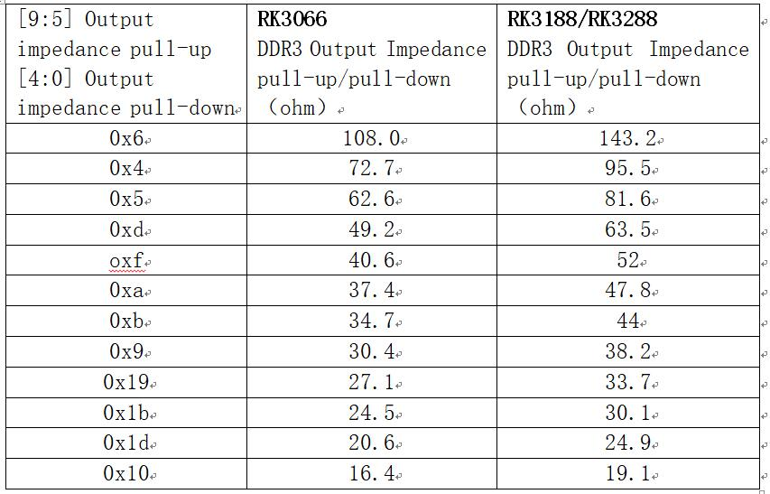

# **DDR开发指南内部文档**

发布版本：1.0

作者邮箱：hcy@rock-chips.com

日期：2017.12.21

文件密级：内部资料

---------

**前言**
适用于所有平台的开发指南

**概述**

**产品版本**

| **芯片名称** | **内核版本** |
| -------- | -------- |
| 所有芯片     | 所有内核版本   |


**读者对象**

本文档（本指南）主要适用于以下工程师：

技术支持工程师

软件开发工程师


**修订记录**

| **日期**     | **版本** | **作者** | **修改说明** |
| ---------- | ------ | ------ | -------- |
| 2017.12.21 | V1.0   | 何灿阳    |          |

--------------------
[TOC]
------

## 如何修改loader中的DDR频率

1. 将DDR bin文件更新到最新
2. 通过modify_ddr_bin.exe，查看该芯片是否支持修改DDR频率
3. 修改后，按后面的“如何将我们给的DDR bin 合成成完整可用的loader”生成新loader


我们有提供工具modify_ddr_bin.exe，用于修改DDR bin文件中的DDR频率，能支持修改频率的，只有RK322x、RK322xh、RK3328、RK3368、RK3399、RV1108，而且有的芯片，只能修改成某些频率。详细见modify_ddr_bin.exe的使用说明。

```c
./modify_ddr_bin.exe		//能查看modify_ddr_bin.exe的使用说明
./modify_ddr_bin.exe -chip 3328		//能查看3328的DDR bin文件支持的参数，其他芯片类似
```

工具modify_ddr_bin.exe在路径：

\\10.10.10.164\Common_Repository\DDR相关工具\modify_ddr_bin

## 如何修改loader中DDR打印的串口号和波特率

1. 将DDR bin文件更新到最新
2. 通过modify_ddr_bin.exe，查看该芯片是否支持修改串口号和波特率
3. 修改后，按后面的“如何将我们给的DDR bin 合成成完整可用的loader”生成新loader


我们有提供工具modify_ddr_bin.exe，可用于修改DDR bin文件中的串口号和波特率，当然，不是所有芯片都支持。详细见modify_ddr_bin.exe的使用说明。

```c
./modify_ddr_bin.exe		//能查看modify_ddr_bin.exe的使用说明
./modify_ddr_bin.exe -chip 3328		//能查看3328的DDR bin文件支持的参数，其他芯片类似
```

工具modify_ddr_bin.exe在路径：

\\10.10.10.164\Common_Repository\DDR相关工具\modify_ddr_bin

## 哪些芯片支持DDR变频功能

DDR变频有在不同的阶段实现，也有在不同的kernel分支实现，总的支持情况如下

| 芯片              | uboot | kernel 4.4  | kernel 3.10 | kernel 3.0 |
| --------------- | ----- | ----------- | ----------- | ---------- |
| RK3026          |       |             |             | 支持         |
| RK3028A         |       |             |             | 支持         |
| RK3036          |       | 不支持         | 不支持         | 不支持        |
| RK3066          |       |             |             | 支持         |
| RK3126B、RK3126C |       |             | 支持，走trust流程 |            |
| RK3126B、RK3126C |       |             | 支持，非trust流程 |            |
| RK3126          |       |             | 支持          |            |
| RK3128          |       |             | 支持          |            |
| RK3188          |       |             | 支持          |            |
| RK3288          |       | 支持，走trust流程 | 支持          |            |
| RK322x          | 支持    |             | 支持，走trust流程 |            |
| RK322xh         |       |             | 支持，走trust流程 |            |
| RK3328          |       |             | 支持，走trust流程 |            |
| RK3368          |       | 支持，走trust流程 | 支持，走trust流程 |            |
| RK3399          |       | 支持，走trust流程 |             |            |
| RV1108          |       |             | 支持          |            |

## 如何查看DDR的容量--补充

除了对外开放的文档《DDR开发指南》中对应章节讲到的内容，内部资料补充如下信息：

kernel中的DDR容量信息，只要是走trust流程的，都没有打印这些信息，也正因为如此，kernel 4.4中全部没有DDR容量信息的打印，kernel 3.10走trust流程的也没有。对照上一部分的“哪些芯片支持DDR变频功能”，就可以知道哪些芯片是kernel 3.10走trust流程的。

对DDR的通道、行、列、bank、片选、数据位宽这些基本信息都不懂的，请找人力或助理要培训文档“DRAM简单介绍.ppt”

## 如何查看DDR带宽利用率--补充

除了对外开放的文档《DDR开发指南》中对应章节讲到的内容，内部资料补充如下信息：

不管哪个版本的kernel如果要查看每个端口的详细数据量信息，就需要push一个能得到带宽的软件进去（目前是一款芯片一个软件，比较乱，正在整理成一个软件），而且要求关闭负载变频功能。

1. 关闭负载变频，见“如何关闭DDR的负载变频功能，只留场景变频”，或者“DDR如何定频”
2. push对应软件。软件使用及结果查看，请看到软件的说明文档。

## 如何调整ODT和驱动强度

- DDR控制器端的驱动强度(DS)和ODT调整

  芯片：RK3026、RK3028A

  代码位置：arch/arm/mach-rk2928/ddr.c的ddr_update_odt()函数

  芯片：RK3126、RK3128

  代码位置：arch/arm/mach-rockchip/ddr_rk3126.c的ddr_update_odt()函数

  芯片：RK3126B、RK3126C非trust流程

  代码位置：arch/arm/mach-rockchip/ddr_rk3126b.c的ddr_update_odt()函数

  修改：

  所有用到PHY_RTT_XXXohm，是DDR控制器端的ODT

  所有用到PHY_RON_XXX，是DDR控制器端的驱动强度(DS)

  这些设置的都是单端的上下拉阻值

  ​

  芯片：RK3066

  代码位置：arch/arm/mach-rk30/ddr.c的ddr_update_odt()函数

  芯片：RK3188

  代码位置：arch/arm/mach-rockchip/ddr_rk30.c的ddr_update_odt()函数

  芯片：RK3288 kernel 3.10

  代码位置：arch/arm/mach-rockchip/ddr_rk32.c的ddr_update_odt()函数

  修改：

  如下代码是负责修改DDR控制器端驱动强度和ODT的，改变传递给他的tmp值就可以

  ```c
  if(cs > 1)
  {
  	pPHY_Reg->ZQ1CR[0] = tmp;
  	dsb();
  }
  PHY_Reg->ZQ0CR[0] = tmp;
  dsb();
  ```

  tmp各个bit的定义如下：

  [19:15]bit用于配置 ODT pull-up

  [14:10]bit用于配置 ODT pull-down

  [9:5]bit用于配置 Output Impedance pull-up

  [4:0]bit用于配置 Output Impedance pull-down

  

  驱动强度(DS)和ODT的值可以分别根据下面两张配置表进行配置

  驱动强度(DS)配置表：

  ODT配置表：

  

  ​

  芯片：RK3126B、RK3126C走trust流程

  代码位置：arch/arm/boot/dts/rk312x_ddr_default_timing.dtsi

  芯片：RK322x

  代码位置：arch/arm/boot/dts/rk322x_dram_default_timing.dtsi

  芯片：RK322xh、RK3328

  代码位置：

  arch/arm64/boot/dts/rk322xh-dram-default-timing.dtsi

  arch/arm64/boot/dts/rk322xh-dram-2layer-timing.dtsi

  芯片：RK3368

  代码位置：arch/arm64/boot/dts/rk3368_dram_default_timing.dtsi

  芯片：RV1108

  代码位置：arch/arm/boot/dts/rv1108_dram_default_timing.dtsi

  芯片：RK3288走trust流程

  代码位置：arch/arm/boot/dts/rk3288-dram-default-timing.dtsi

  芯片：RK3399

  代码位置：arch/arm64/boot/dts/rockchip/rk3399-dram-default-timing.dtsi

  修改：

  phy_XXX_drv表示控制器端的驱动强度

  phy_XXX_odt表示控制器端的ODT

  ​

- DDR颗粒端的驱动强度(DS)和ODT调整

  芯片：RK3026、RK3028A

  代码位置：arch/arm/mach-rk2928/ddr.c的ddr_get_parameter()函数

  修改：

  如下代码是负责设置DDR颗粒端的驱动强度和ODT

  ```c
  /* DDR3的设置 */
  if(nMHz <= DDR3_DDR2_ODT_DISABLE_FREQ)
  {
      ddr_reg.ddrMR[1] = DDR3_DS_40 | DDR3_Rtt_Nom_DIS;
  }
  else
  {
      ddr_reg.ddrMR[1] = DDR3_DS_40 | DDR3_Rtt_Nom_120;
  }

  ......

  /* DDR2的设置 */
  if(nMHz <= DDR3_DDR2_ODT_DISABLE_FREQ)
  {
      ddr_reg.ddrMR[1] = DDR2_STR_REDUCE | DDR2_Rtt_Nom_DIS;
  }
  else
  {
      ddr_reg.ddrMR[1] = DDR2_STR_REDUCE | DDR2_Rtt_Nom_75;
  }
  ```

  DDR3\_DS\_XX、DDR2\_STR\_XXX，表示对应DDR颗粒端的驱动强度

  DDR3\_Rtt\_Nom\_XXX、DDR2\_Rtt\_Nom\_XXX，表示对应DDR颗粒端的ODT

  ​

  芯片：RK3126、RK3128

  代码位置：arch/arm/mach-rockchip/ddr_rk3126.c的ddr_get_parameter()函数

  芯片：RK3126B、RK3126C非trust流程

  代码位置：arch/arm/mach-rockchip/ddr_rk3126b.c的ddr_get_parameter()函数

  修改：

  如下代码是负责设置DDR颗粒端的驱动强度和ODT

  ```c
  /* DDR3的设置 */
  if (nMHz <= DDR3_DDR2_ODT_DISABLE_FREQ) {
      p_ddr_reg->ddrMR[1] = DDR3_DS_40 | DDR3_Rtt_Nom_DIS;
  } else {
      p_ddr_reg->ddrMR[1] = DDR3_DS_40 | DDR3_Rtt_Nom_120;
  }

  ......

  /* LPDDR2的设置 */
  p_ddr_reg->ddrMR[3] = LPDDR2_DS_34;
  ```

  DDR3\_DS\_XX、LPDDR2\_DS\_XX表示对应DDR颗粒端的驱动强度

  DDR3\_Rtt\_Nom\_XXX表示对应DDR颗粒端的ODT

  ​

  芯片：RK3066

  代码位置：arch/arm/mach-rk30/ddr.c的ddr_get_parameter()函数

  芯片：RK3188

  代码位置：arch/arm/mach-rockchip/ddr_rk30.c的ddr_get_parameter()函数

  芯片：RK3288 kernel 3.10

  代码位置：arch/arm/mach-rockchip/ddr_rk32.c的ddr_get_parameter()函数

  修改：

  如下代码是负责设置DDR颗粒端的驱动强度和ODT

  ```c
  /* DDR3的设置 */
  if(nMHz <= DDR3_DDR2_ODT_DISABLE_FREQ)
  {
  	p_publ_timing->mr[1] = DDR3_DS_40 | DDR3_Rtt_Nom_DIS;
  }
  else
  {
      p_publ_timing->mr[1] = DDR3_DS_40 | DDR3_Rtt_Nom_120;
  }

  .......

  /* LPDDR2的设置，LPDDR2颗粒端没有ODT */
  p_publ_timing->mr[3] = LPDDR2_DS_34;

  ......

  /* LPDDR3的设置 */
  p_publ_timing->mr[3] = LPDDR3_DS_34;
  if(nMHz <= DDR3_DDR2_ODT_DISABLE_FREQ)
  {
      p_publ_timing->mr11 = LPDDR3_ODT_DIS;
  }
  else
  {
      p_publ_timing->mr11 = LPDDR3_ODT_240;
  }
  ```

  DDR3\_DS\_XX、LPDDR2\_DS\_XX、LPDDR3\_DS\_XX，表示对应DDR颗粒端的驱动强度

  DDR3\_Rtt\_Nom\_XXX、LPDDR3\_ODT\_XXX，表示对应DDR颗粒端的ODT

  ​

  芯片：RK3126B、RK3126C走trust流程

  代码位置：arch/arm/boot/dts/rk312x_ddr_default_timing.dtsi

  芯片：RK322x

  代码位置：arch/arm/boot/dts/rk322x_dram_default_timing.dtsi

  芯片：RK322xh、RK3328

  代码位置：

  arch/arm64/boot/dts/rk322xh-dram-default-timing.dtsi

  arch/arm64/boot/dts/rk322xh-dram-2layer-timing.dtsi

  芯片：RK3368

  代码位置：arch/arm64/boot/dts/rk3368_dram_default_timing.dtsi

  芯片：RK1108

  代码位置：arch/arm/boot/dts/rv1108_dram_default_timing.dtsi

  芯片：RK3288走trust流程

  代码位置：arch/arm/boot/dts/rk3288-dram-default-timing.dtsi

  芯片：RK3399

  代码位置：arch/arm64/boot/dts/rockchip/rk3399-dram-default-timing.dtsi

  修改：

  ddr3_drv，表示DDR3颗粒端的驱动强度

  ddr4_drv，表示DDR4颗粒端的驱动强度

  lpddr2_drv，表示LPDDR2颗粒端的驱动强度

  lpddr3_drv，表示LPDDR3颗粒端的驱动强度

  lpddr4_drv，表示LPDDR4颗粒端的驱动强度

  ddr3_odt，表示DDR3颗粒端的ODT

  ddr4_odt，表示DDR4颗粒端的ODT

  lpddr2颗粒是没有ODT的

  lpddr3_odt，表示LPDDR3颗粒端的ODT

  lpddr4_dq_odt，表示LPDDR4颗粒端的DQ ODT

  lpddr4_ca_odt，表示LPDDR4颗粒端的CA ODT

## 如何调整DQ、DQS、CA、CLK的skew--补充

除了对外开放的文档《DDR开发指南》中对应章节讲到的内容，内部资料补充如下信息：

要调整loader中的skew，需要借助工具，目前只有RK322xh、RK3328支持。工具路径在

\\\10.10.10.164\Kitkat_Repository\rk3228h\SDK_IMAGE\loader\修改3228H DDR参数工具_V1.04.7z

机器都能开机，就不需要调整loader中的skew，直接去调整kernel中的skew

## 所有平台DDR已经实现的feature

==这里只列出TRM没有写出的feature，凡事TRM写的，我们都已经实现==

3399已实现feature：

- 单通道支持
- 最大容量4GB
- DDR3最高频率933MHz
- LPDDR3最高频率933MHz

3328、322xh已实现feature：

- DDR3最高频率933MHz
- LPDDR3最高频率
- DDR4最高频率1066MHz

1108已实现feature：

- LPDDR2支持
- DDR3支持
- DDR3最高频率800MHz
- LPDDR2最高频率533MHz
- DDR3只支持64MB、128MB、256MB、512MB这4种容量

3368已实现feature：

- 不支持LPDDR2
- DDR3最高频率800MHz
- LPDDR3最高频率666MHz

3288 已实现feature：

- 最大容量8GB，目前所有RK芯片，只有3288能支持8GB
- 3GB支持
- 1.5GB支持
- 单通道支持
- DDR3最高频率533MHz
- LPDDR2、LPDDR3最高频率533MHz

3036已实现feature：

- DDR2支持
- DDR3、DDR2最高频率533MHz

3066已实现feature：
- DDR2支持
- DDR3、LPDDR2最高频率533MHz
- DDR2最高频率目前只验证到400MHz

3128已实现feature：
- DDR2支持
- DDR3、DDR2、LPDDDR2最高频率533MHz

3126B、3126C已实现feature：

- DDR2支持


- DDR2、DDR3最高频率480MHz

322x已支持的feature：

- DDR2支持
- DDR3、LPDDR3最高频率800MHz
- DDR2、LPDDR2最高频率533MHz

3188已实现feature：

- DDR3、LPDDR2最高频率533MHz

3066已实现feature：

- DDR3、LPDDR2最高频率533MHz
