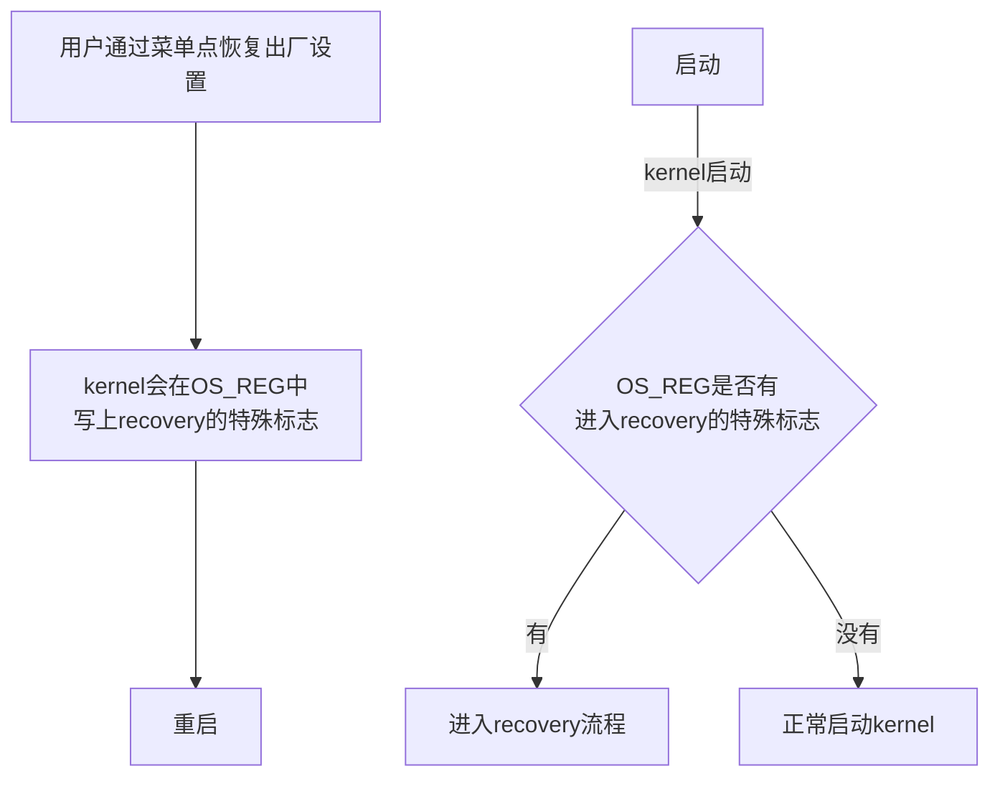
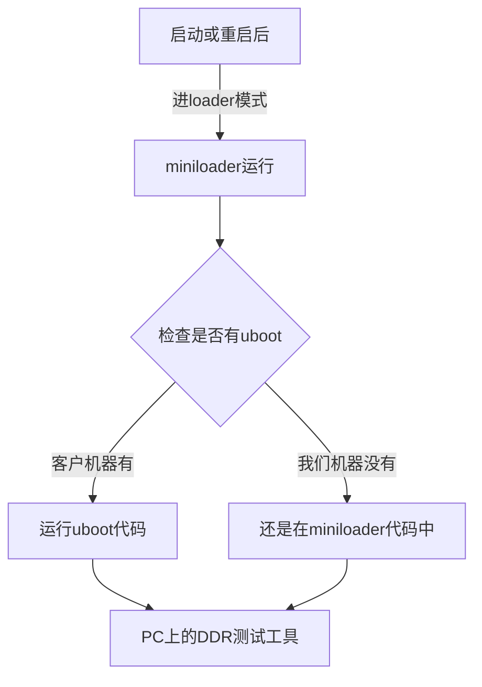
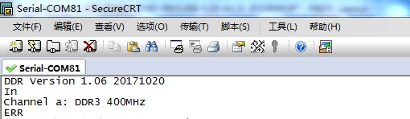
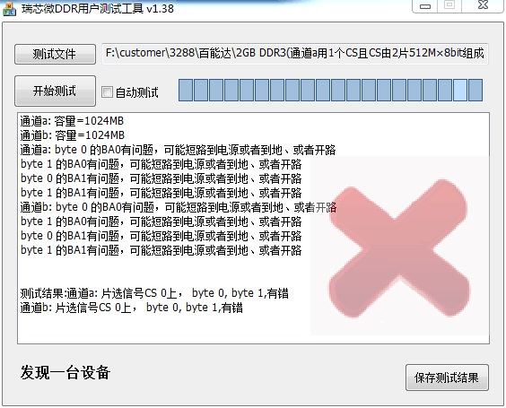
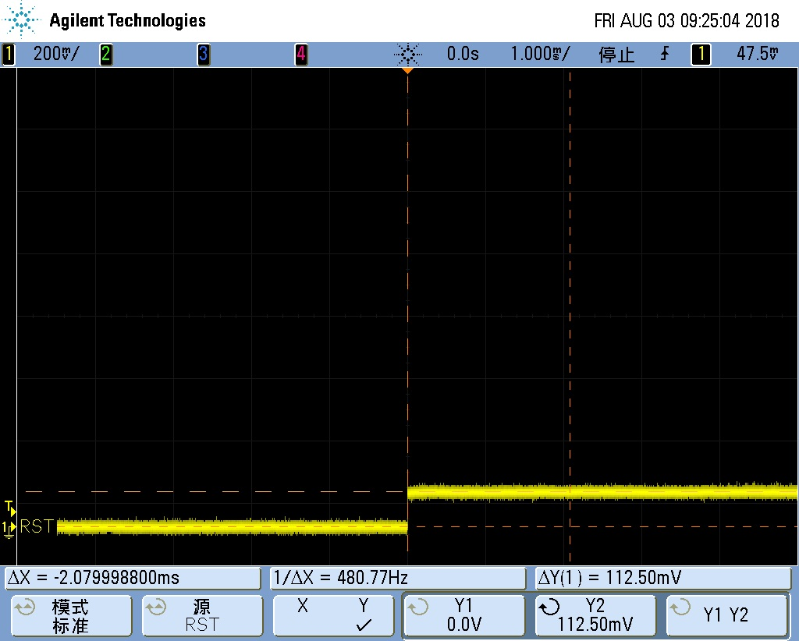
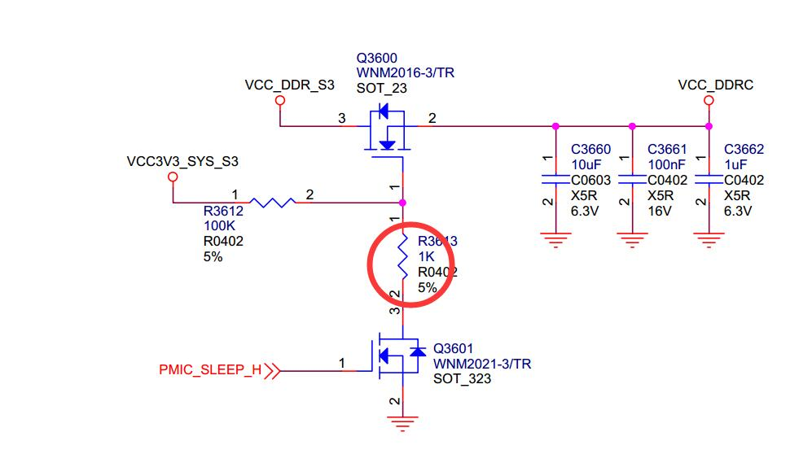
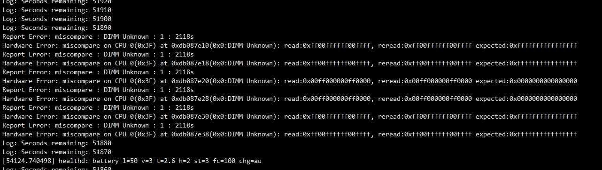
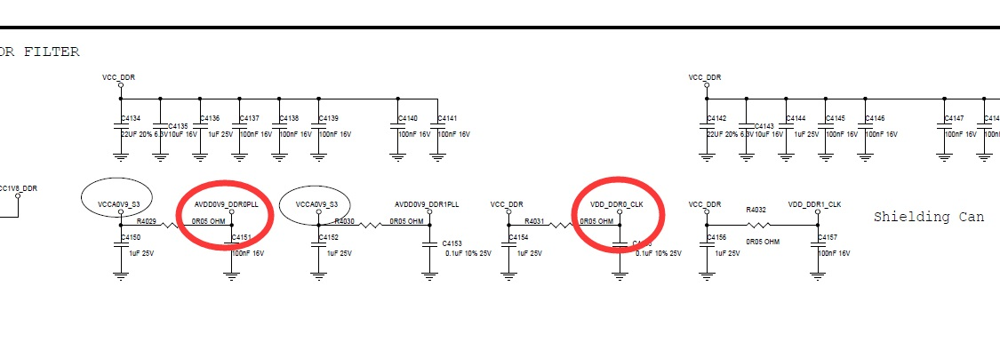

# **DDR 遇到的问题记录**

发布版本：1.2

作者邮箱：hcy@rock-chips.com

日期：2017.11.29

文件密级：内部资料

---

**前言**
记录所有 DDR 遇到的问题，不管是哪个平台，用于 Q4 期间整理成 DDR 问题排查手册

**概述**

**产品版本**

| **芯片名称** | **内核版本** |
| -------- | -------- |
| 所有芯片     | 所有内核版本   |

**读者对象**

本文档（本指南）主要适用于以下工程师：

技术支持工程师

软件开发工程师

**修订记录**

| **日期**     | **版本** | **作者** | **修改说明** |
| ---------- | :----: | :----: | :------: |
| 2017.10.26 |  V1.0  |  何灿阳   |          |
| 2017.11.29 |  V1.1  |  汤云平   |   增加描述   |
| 2018.07.30 |  V1.2  |  汤云平   |   增加描述   |

---

[TOC]

---

## RK3228B

### 问题：无法恢复出厂设置

#### 关键词：无法恢复出厂设置，OS_REG 被清，GRF_OS_REG 被清，LPDDR3 板子无法恢复出厂设置

#### 现象描述

从菜单点恢复出厂设置，机器重启后，还是正常开机，并没有进入 recovery 模式。
而且客户这款机器用得是 LPDDR3 的颗粒才有这个问题，另外一款用 DDR3 的就没有这个问题。

#### 恢复出厂设置的原理



其中的 OS_REG，不同平台使用的不同。因为有的平台是 PMU_OS_REG 在 reboot 后不会被清 0.
有的平台没有 PMU_OS_REG，有 GRF_OS_REG，也是 reboot 后不会被清 0.
而对于 3229，使用的是 GRF_OS_REG.

另一个，OS_REG 一般我们都设计有 4 个，这 4 个具体怎么使用的，都是由 kernel 负责人、loader 负责人、DDR 负责人一起协商定义好的，而且各个芯片都这样沿用下来。对于此问题，用于进入 recovery 流程的标志，记录在 GRF_OS_REG[0]上。

#### 分析过程

从无法进 recovery 模式的 kernel log 可以看到，kernel 并没有进入 recovery 流程，而是走了正常启动 kernel 的流程。所以，问题一定出在 OS_REG 的标志上。

可能原因有 2 个：

一是，reboot 前，标志没写入。

二是，reboot 后，重启过程中，标志被 kernel 前的代码改掉了，既然客户说跟 DDR 有关系，那重点要怀疑 DDR 初始化代码清掉了 OS_REG 标志。

查找过程：

1. 在 kernel reboot 前，打印出 GRF_OS_REG[0]的值

   结果：OS_REG 的标志有正常写入

2. kernel 一开始打印 GRF_OS_REG[0]的值

   结果：OS_REG 的标志已经变成 0

   所以，怀疑是在 kernel 前的流程中被清 0 了。

3. 在 uboot 一开始打印 GRF_OS_REG[0]的值

   结果：OS_REG 的标志已经变成 0

4. 检查 DDR 初始化代码

   结果：并没有对 GRF_OS_REG[0]操作，更没有根据不同 DDR 类型来做不同操作。

   所以，不可能是 DDR 代码清了 OS_REG 标志

5. 在 DDR 一开始打印 GRF_OS_REG[0]的值

   结果：OS_REG 的标志已经变成 0

   好奇怪，DDR 一开始的地方就变成 0，说明不是软件清 0，是硬件导致的清 0

   这里就可以排除是板子使用不同 DDR 导致的了。

6. 用可以正常恢复出厂设置的 DDR3 机器，重复上述过程

   结果：DDR3 机器 GRF_OS_REG[0]的值能一直保持到 kernel 检查的地方

   所以，问题已经可以确认出在 2 台机器的硬件上的差异，从上面的现象看，能把 OS_REG 清 0，要么是电源掉电了，要么是有 RESET 信号进来。

最终让硬件测电源和 reset 信号，找到了原因。

#### 问题原因

REBOOT 测试时 VCCIO 会塌陷到 2.5V,而 RESET 检测 VCCIO 的阀值为 2.63V。所以导致 RESET 信号有效，从而复位了 CPU，最终导致 OS_REG 的标志没了。再次启动后，就判断不到这个标志，从而进入不了 recovery 模式。下面是电源塌陷的波形


#### 解决办法

由于塌陷是 DC-DC 导致的，最好的解决办法是换 DC-DC。但是基于客户不换的解决办法是：

将输出端 C532 更改为 22Uf,同时将 U509 第 3PIN 加 22uF 电容,保证 VCCIO 塌陷不触发 reset,功能即正常


---

## PX3

### 问题：贴 2GB DDR3L，只识别到 1GB 容量

#### 关键词：容量识别错，容量不对，少了一个 CS，少了一个片选

#### 现象描述

客户板子贴了 2 片 512Mx16bit 的颗粒，总容量应该是 2GB，但开机 log 看，容量只识别到 1GB

#### 分析过程

查找过程：

1. 让客户提供 DDR3L 的 datasheet 和原理图
2. 看到 DDR3L 是 512Mx16bit 的，认真对比 datasheet 和开机 log 的 DDR 信息，发现 DDR3L 是 2CS 的，而开机 log 只识别到一个 CS


3. 因为 PX3 芯片设计本身有一个局限，就是当颗粒的 row 数量为 16 时，这时候 CS 信号被拿过来当 row15 信号了，因此 row 数量为 16 时，只能支持一个 CS。具体见“interconnect”章节的描述。

   而 512Mx16bit 如果不是 dual-die，就是 16 根 row 信号。

4. 认真看了 DDR3L 的 datasheet，确实是 dual-die 的，不是 16 跟 row 信号。所以，导致只识别到一个 CS 的问题，肯定不是芯片本身的这个局限导致的。
5. 查看客户的原理图，发现颗粒板子只有 CS0


#### 问题原因

DDR3L 是 2 个 CS 的颗粒，而客户原理图只连了一个 CS0 到颗粒。导致容量少了一半。

#### 解决办法

无法解决，除非客户改版

### 问题：免拆机 loader 无法进入测试模式

#### 关键词：无法进入测试模式，无法进入 maskrom，免拆机 loader，DDR 工具测试失败

#### 现象描述

客户板子进入 loader 模式，再用 DDR 测试工具测试，会测试失败。

如果直接在 maskrom 模式下，用 DDR 测试工具测试，是能成功的。

#### 分析过程

查找过程：

1. 因为免拆机的 loader 是一定版本后才支持的，不知道客户的版本是否支持。所以，先让客户把串口 log 发过来，我确认了 DDR 版本，确认这个版本是可以支持的。

2. 使用免拆机 loader 是一定版本的 DDR 测试工具才能支持的，也跟客户确定了 DDR 测试工具是最新版本

3. 让客户提供他使用的 RKPX3Loader_miniall.bin

4. 因为 DDR 测试工具只有 3188 的，PX3 使用的是 PX3 的测试项，怀疑是不是跟 PX3 特殊性有关系。找了台 PX3 机器，用客户正在使用的 loader，烧入后，通过按键进入 loader 模式，用 DDR 测试工具进行测试。

   结果：可以正常进测试模式，并测试成功

   很奇怪，为什么客户那边的机器就是不行

5. 让客户发 DDR 测试工具的 log，看到是如下

   所以，DDR 测试工具根本还没等到 maskrom，所以跟 DDR 测试代码完全没关系，而是跟 loader 有关系。

```c
15:56:35 126 瑞芯微DDR用户测试工具_20151103 v1.33 start run
15:57:20 081 等待Maskrom失败!
15:58:39 064 等待Maskrom失败!
16:00:55 023 等待Maskrom失败!
```

6. 搞不清楚到底这时候是 loader 没切换到 maskrom，还是切换到 maskrom 里面异常了

   让客户抓串口 log，因为 PX3 如果正常进入 maskrom 模式，会一直打印

   `▒RK310B▒▒RK310B▒▒RK310B`这样的字符串

   结果：串口没看到 maskrom 模式下的字符打印，由此可以断定，设备没有切到 maskrom 模式

7. 跟客户说，在 loader 下工具的状态栏看到的是，先显示“发现一台设备”，一旦 DDR 测试工具开始运行，状态栏会变成“没有发现设备”，然后再变回“发现一台设备”，接下来就开始测试了。

  结果：从客户提供的视频看到，客户机器一直停留在 loader 时的“发现一台设备”，都没有断开过。由此可以确认问题出在 loader 没有重启上。

8. 让赵仪峰来处理这个问题，已经定位到他的问题。

   结果：找到原因

#### 问题原因

用户使用的是 miniall 的 loader，RKPX3Loader_miniall.bin，这种 loader 有特殊处理：
即这种 loader，如果搭配 uboot 使用，那么当 PC 工具显示 loader 状态时，机器上的代码是运行在 uboot 中。
如果不搭配 uboot 使用，则 PC 工具显示 loader 状态时，机器上的代码是运行在 miniloader 中。
而这个版本的 miniall，其中的 miniloader 是支持 DDR 测试工具的切换测试状态，但是客户使用的 uboot 不支持。

之所以客户不能测试，而我们这边可以测试，是因为我们这边的机器是没有搭配 uboot 使用，所以看到的 loader 状态，此时是由 miniloader 负责切换到测试模式。而客户是有 uboot 的，所以客户看到的 loader 状态，是 uboot 负责切换测试模式，而这刚好是当前版本的 uboot 没有支持的。



#### 解决办法

参考 RK3128 平台，在 uboot 中增加切换测试模式的支持

---

## RK3126/RK3128

### 问题：reboot 测试失败

#### 关键词：reboot 失败，概率性

#### 现象描述

部分颗粒 reboot 测试概率性在 ddr 初始化处初始化失败，烧写固件后 reboot 在 ddr 初始化处初始化失败。

这种 ddr 初始化失败之后在 reboot 时才会出现，而正常掉电再上电开机是没问题的。

#### 分析过程

1. 通过添加打印发现 reboot 失败时停留在 read gate training 处，无法正常完成 training。
2. 通过示波器查看 training 的 DQS 信号发现 read 命令发出去后 DQS 始终没有返回信号。
3. 由于掉电再开机一定没问题，只有 reboot 存在问题上看， 应该是颗粒的状态受到上次开机过程中对 ddr 的访问影响，导致颗粒内部逻辑出现混乱，无法正确响应 read 命令。

#### 问题原因

从上面的分析过程看，引起颗粒异常的原因是 3126 由于 pin 脚紧张 将 ddr 的 reset pin 删除了，导致正常初始化的过程中并没有发送 reset 动作，从而受上一次开机的状态影响，颗粒处于正常的访问状态就再次发起初始化动作引起颗粒内部逻辑混乱。

#### 解决方法

在 reboot 前将颗粒切到 self-refresh mode 下再 reboot，这样颗粒再次初始化时是从 self-refresh mode 下接着初始化，就不会引起颗粒逻辑混乱。

所以相应的 uboot， kernel 中的 reboot 代码都需要做相应的改动，reboot 前让 dram 进入 self-refresh mode。

### 问题：x4 颗粒初始化失败

#### 关键词：x4 颗粒，初始化失败，Col error！， W FF！=R，必现， 白牌颗粒

#### 现象描述

在 ddr 初始化时出现列探测失败，而将颗粒对调位置再焊上之后大部分能够变好。

#### 分析过程

1. 由于 x4 颗粒我们的主控一个 DQS 对应颗粒 2 个 DQS，在 read 时两个颗粒同时吐出数据存在竞争关系。如果两个颗粒 DQS 输出相位相差比较大的话会破坏信号完整性。

下图为实测到 dll bypass 下 read 到的 dqs 信号，通过实际测量到的波形看，确实 dqs1 上的两个颗粒输出的 dqs 相位差比较大导致上升沿存在一个比较严重的台阶，严重影响信号质量。


2. 通过 jedec 标准可以知道，当 dll bypass 时 ddr 的 tDQSCK 是在 0.75-1.25tck 之间范围比较广，而 dll on 的情况下 tdqsck 是在±225ps，相对比较小。所以尝试将 dll enable 起来看看 dll enable 下 dqs 的信号。下图为 dll enable 下的 dqs 的输出相位就比较一致。


3. 在 dll enable 之后 3 块板子中的两块观察到 DQS 均是对齐的，但是其中一块板子出现了如下波形， 而出现这种波形的原因是其中一个颗粒的 DQS 是正常的 而其他三个颗粒的 DQS 都推后了一个 cycle 引起的。试验发现初始化时发送带 dll reset 的 MR0 会引起该现象，而发送 MR0 不带 DLL reset 或者发送带 DLL reset 的 MR0 后再发送一次不带 DLL reset 的 MR0 会恢复正常。但是 DLL reset 在 jedec 中的规定是 self-clearing 的，只能说这个颗粒比较奇怪，违反了 jedec 规定，需要手动去 clear DLL reset bit。


#### 问题原因

1. 由于我们主控并不支持 x4 颗粒， 所有主控端一个 DQS 对应两个颗粒，这样在 read 的时候就存在 2 驱 1 的情况，如果一个 DQS 上的两个颗粒存相位差的话就会引起信号质量问题。
2. 部分颗粒违反 jedec MR0 中的 DLL Reset bit 需要手动清 0 才能够正常。

#### 解决方法

1. 针对 x4 颗粒两个颗粒连接到同一个 DQS 上的情况，通过 enable DLL 来尽量减少颗粒的不一致性带来的 DQS 之间的相位差的问题。
2. 针对部分违反 jedec 需要手动清 DLL Reset bit 的颗粒手动清该 bit 解决问题。

### 问题：x4 颗粒 reboot 死机问题

#### 关键词：x4 颗粒，reboot， 必现， 白牌颗粒

#### 现象描述

reboot 后必现的在 training 处卡住，由于 3126 没有 ddr reset pin，在打上 self-refresh 补丁之后依然如此。

#### 分析过程

1. 通过测量波形发现与之前 MR0 中的 dll reset bit 需要手动清 0 的颗粒类似， 如下图，其中一个颗粒的 DQS 输出正常，而另一个颗粒的 DQS 推迟了 2 个 cycle 导致整个波形都是异常的。但是这个问题重新发送 MR0 并不能够解决问题。


2. 从现象上看其中一个颗粒的 cl 为 8， 而其他 3 个颗粒均为 6. 而 8 应该是系统中上次开机 400M 下的 cl 值。
3. 正常上电开机后系统中变频的 cl 设置是成功的。

#### 问题原因

问题原因未知。表象上看是 reboot 后其中一个颗粒 MR 没有成功写入。

#### 解决方法

在 reboot 前调用 ddr 变频命令将 ddr 频率变到与 loader 初始化相同的 300Mhz。这样初始化时的 cl 就正常了。

### 问题：概率性开机初始化出错，报 Col error

#### 关键词：初始化出错， Col error， 白牌颗粒

#### 现象描述

redmine 号 112646，开机概率性会卡在 ddr 初始化处报 Col error， 复位后概率性的能够正常开机。

#### 分析过程

1. 发现芯片热开机时基本能够开机，而芯片冷却后在常温下会概率性的出现异常。
2. 更换 nanya 颗粒正常。
3. 复现概率小的机器放入冰箱冷冻 10 分钟，问题必现。加热 DDR 颗粒，DDR 都能初始化 OK,机器可以正常运行起来。

#### 问题原因

白牌颗粒在常温下会概率性的出现异常，而加热后就能够正常开机。

#### 解决方法

出现异常的颗粒直接更换。

### 问题：系统中报错，死机

#### 关键词：panic，白牌颗粒

#### 现象描述

系统中运行容易报错死机，降频无效

#### 分析过程

1. 降低 ddr 频率到 200MHz 并未改善该问题说明是信号质量问题的概率较小。

2. 部分机器 march 报错

3. 部分机器 march 布板稳定性测试 正常， 但是系统中很容易报错，  stressapptest 和 memtester 都很容易报错。

4. 对于手头上的机器 分别编号 1#， 2#， 3#，4#

   1#   ddr 测试工具报错。

   2#，4#  ddr 测试工具 pass， 但是系统中的 memtester 都会报错。

   3# 视频烤机 24 小时正常。

   对于 1#， 这个我们很早前遇到过， ddr 测试工具中 的 march 专项 就是当时针对这种颗粒添加的。 对于这种颗粒内部缺陷的 我们是无能为力的。只能通过换颗粒解决。

   2# 做了如下实验：

   1. 测量过 ddr read 信号， read 的信号质量很好。
   2. ddr 电压增加到 1.66v  没有任何改善
   3. ddr 频率降低到 200Mhz  odt enable  memtester 仍然报错。而 memtester 的测试结果多个测试项报同一个地址出错，很明显指向了颗粒存储异常，而非信号质量异常。
   4. ddr 运行 200MHz 使用 400MHz 的 timing（所有 dram timing 放大一倍）  并无效果， memtester 依然报错。
   5. 加强减弱 驱动强度 odt 强度， memtester 仍然报错。

   4# 与 2#类似的 memtester 报错 ddr 频率降低到 200MHz ，ddr 运行 200MHz 使用 400MHz 的 timing（所有 dram timing 放大一倍）  并无效果。

#### 问题原因

ddr 测试工具 march 专项，以及系统中的 memtester 在较低频率下均能够测出问题。为白牌颗粒基本存储单元异常。

#### 解决方法

对于存储单元异常的白牌颗粒只能通过更换颗粒来解决。

### 问题：rk3126c ddr2 系统中不稳定容易 panic

#### 关键词：panic

#### 现象描述

客户 rk3126c ddr2 板子进入系统中很容易 panic

#### 分析过程

1. 降低 arm 频率有一定改善，但是还是容易 panic，能够正常进入系统的 memtester 也很容易报错
2. 降低 ddr 频率到 200Mhz，只能能比较稳定的进入系统。
3. 测量 arm 纹波偏大。改善纹波对死机没多少改善。
4. 发现客户主控下方的 GND 没有连接。补焊上之后系统正常。

#### 问题原因

客户主控下方 GND 没焊，导致芯片内部整体电源较差引起系统不稳定。

#### 解决方法

主控下方 GND 补焊。

---

## RK3229

### 问题：4bit ddr3 大于 600M 时死机

#### 关键词：屏幕绿屏，无法运行高频

#### 现象描述

当频率大于 600MHz 时会死机，死机时屏幕显示异常。

#### 分析过程

1. 通过 ddr 测试工具测试在 crosstalk 测试项中全空间写地址值后出现数据出错，每次刷新后都会出现数据异常。重新发送 MR0 后大部分数据能够恢复正常，但是有部分地址空间的数据依然是错误的。
2. 客户在 ddr_rst pin 靠近主控端上加了一个 100nf 的电容。 将电容去掉或者将电容移动到颗粒端后能够正常运行 800Mhz。
3. 通过示波器观察， reset pin 的噪声很大， 有电容时最高到 2v 最低到 600mv， 而没电容时最低到 800mv。

#### 问题原因

客户在 ddr reset pin 的近端增加了一个 100nf 的电容引起了谐振，会概率性的触发颗粒的 reset。

#### 解决方法

将电容移到颗粒端。

### 问题：DDR2 支持

#### 关键词：ddr2，ddr 控制器 1:2 mode

#### 现象描述

正常初始化起来后从 memroy 中读出来的数据都为 0，无法写入

#### 分析过程

1. 检查设置的 ddr timing 和 3126 一致 并无问题。

2. 测量信号发现 write 时 dm 会 mask 掉所有写入的数据。

3. 怀疑 DFI timing，发现 ddr 控制器 1:1 mode 和 1:2 mode 下的 DFI timing 的计算方法不同。

   1:2 mode 下 tdfirddataen = (cl-1)/2-1, tdfiphywrlat = (cwl-1)/2 -1;  而 tdfiphywrlat 必须大于 0，所有 cwl 必须大等于 5.所以实际上 cl，cwl 的最小设置是 6 和 5。

#### 问题原因

1:2 mode 下 tdfirddataen = (cl-1)/2-1, tdfiphywrlat = (cwl-1)/2 -1;  而 tdfiphywrlat 必须大于 0，所有 cwl 必须大等于 5.所以实际上 cl，cwl 的最小设置是 6 和 5。

#### 解决方法

将最小的 cl,cwl 现在在 6 和 5 解决该问题。

### 问题：压力测试报错

#### 关键词：stressapptest，memtester 报错

#### 现象描述

压力测试报错，提高 logic 电压后变好。

#### 分析过程

1. 扫描 rx  dqs de-skew 窗口发现个别 DQS 的 rx 窗口偏小。正常 DQS 的 rx 的有效窗口为 DLL=0°， de-skew=2 到 DLL=67.5°，de-skew=10。而异常的 DQS rx 有效窗口为 DLL=0°，de-skew=2 到 DLL=67.5°， de-skew=7。 而默认 600MHz 下 rx DLL/de-skew 配置是 DLL=67.5°，de-skew=7. 这导致了异常板子其中一个 DQS 没有任何 margin 引起死机。
2. 我们的 evb 上测试到同样 600M 的情况下 rx DQS 的 magin 在 DLL=0°，de-skew=4 到 DLL=67.5°，de-skew=13.
3. 以我们的 evb 为例 de-skew 每单位 20ps 算，600Mhz 下 rx DQS 实际有效窗口约为 500ps，以最优采样点再 90°计算的话窗口最左侧：90°-500ps/2 = 0°+（4-7）* 20ps+rx 固有 delay，窗口最右侧 90°+（500/2）ps=67.5°+（13-7）*20ps+rx 固有 delay。得到 phy 内部 rx 固有 delay 大概在 230ps 左右， 这比 inno 给的 140ps 典型值大了 90ps。
4. 提高 logic 电压后 phy 内部固有的 delay 会变小，增大 hold time margin，所以能改善问题。
5. 客户板子将 rx DQS 的 de-skew 提前 7 个单位后解决该问题。

#### 结论

1. 客户板子可能 pcb 等影响吃掉一定的 rx DQS margin。

2. 我们实际 rx  DQS 采样窗口按 140ps 的 phy 内部固定 delay 来设置的，会损失一定的 hold time margin。

3. 后续 trust 更新 rx DLL 设置小于 400MHz 时 DLL 设置为 67.5°，400MHz 到 680MHz 之间 DLL 设置为 45°，大于 680MHz 时 DLL 设置为 22.5°

### 问题：压力测试报错

#### 关键词：stressapptest，memtester 报错

#### 现象描述

memtester 和 stressapptest 均会报错，stressapptest 报错的概率更大。

#### 分析过程

1. 从出错的 log 上看为 DQ2 和 DQ10 报错。比较奇怪为什么出错的 bit 会再不同 DQS 的同一个 bit。

2. 分别调整 DQ2 和 DQ10 的 tx， rx de-skew 并无改善， 看情况不像是 DDR 信号问题。

3. 从出错的数据看错误总是出现在结尾 0x668 和 0xe6c 的地址上。将 CPU 定频在 816Mhz stressapptest pass。

   

#### 问题原因

该 stressapptest 为 cpu 异常引起的，将 cpu 频率降低之后 stressapptest pass。 所以 stressapptest 报错并非一定是 DDR 引起的错误。

---

## RK3128/RK322X/RK3368/RK322XH

### 问题：概率性出现颗粒类型，颗粒位宽探测出错

#### 关键词：概率性，颗粒类型出错，颗粒位宽出错，W FF != R

#### 现象描述

初始化时概率性的将 16bit 的位宽探测成 32bit 位宽， 将 LPDDR 识别成 DDR3，以及初始化时报 W FF != R 等。

#### 分析过程

1. 使用 Inno 的 ddr phy 的平台 ddr 位宽以及颗粒类型是通过 ddr 的 read gate training 来探测的， 而 3228H 上的 cs 也是通过 read gate training 来探测的。 发现异常的时候都是 read gate trainining 得到的值是比较异常的，但是实际 PHY 会报回 training 成功。 如 training 实际的值是"0x2D531A1B"  DQS2 和 DQS3 的结果封边是 0x53 0x2d, 与正常的 0x1A,0x1B 相差甚远，但是 phy 给的 result 仍然是 success。
2. 会误报 success 的条件均是对应的 DQS 实际悬空 或者 DQS 实际没有信号回来的情况下出现错误的结果。 如 a.x16 位宽的系统 DQS2,3 是悬空的当第一次设置成 32bit training 时 实际 DQS2,3 没有返回正常 read 信号。 b.如贴 lpddr3 的时候，首先会被初始化成 ddr3 来 training，这时候 dqs 并不会有正常 read 信号返回。c.在探测 cs1 的时候由于 cs1 上实际没有颗粒时这时候 read DQS 并不会去有 read 信号返回。 这些情况下由于 phy 内部对这些信号的误判，可能上报 training 成功，从而引起颗粒类型，位宽 容量的异常。

#### 问题原因

由于 training 时 DQS 上没有 read 信号回来时 DDR PHY 会概率性的误报成功，引起 ddr 的容量，类型，位宽探测异常。

#### 解决方法

在 training 时将主控端的 odt 从原来的上下拉设置为单端上拉后 PHY read gate training 的结果就会稳定可靠。

相应平台对应改动的 loader 版本如下：

| rk3128             | v2.06     |
| ------------------ | --------- |
| **rk322x**         | **v1.06** |
| **rk3368**         | **v2.02** |
| **rk322xh/rk3328** | **v1.10** |

---

## RK322xH/RK3328

### 问题：颗粒验证时，烧写失败

#### 关键词：烧写失败，不能启动

#### 现象描述

收集了一批板子，贴了各种型号的 DDR 颗粒，用于验证。结果发现有 3 块板子烧写总是失败

#### 分析过程

查找过程：

1. 查看烧写失败的串口打印 log，看到 DDR 初始化能正常完成，后面的 uboot 等代码运行异常了

2. 认真查看 DDR 初始化的 log，发现是芯片不匹配的。

3. 看过芯片是 RK3328 的，再看下载选择的 loader 等，是 RK3228H 的。

   所以导致 loader 和芯片不匹配，运行会不稳当。要么烧写失败，要么系统启动异常。

4. 选择 RK3328 的 loader 和其他相应文件。

   结果：烧写和运行都正常。

#### 问题原因

一堆板子里，有 RK3228H，也有 RK3328，下载时，没有根据芯片型号选对 loader 和其他文件。导致下载失败

#### 解决办法

根据芯片型号，选对 loader 和其他文件，就能解决

### 问题：1Gbx4  8 颗组成 4GB 下载异常

#### 关键词：下载失败，ddr 初始化报错， 4GB

#### 现象描述

烧写固件时在 ddr 初始化处出现 ERR 报错。

#### 分析过程

无

#### 问题原因

跟踪 ddr 代码发现原有的代码 cs_cap 使用 uint32 型的变量， 没考虑到一个 cs 的容量会达到 4GB。 所以原有的代码正常两个 cs 4GB 的情况下不会出现变量溢出报错。而当使用 1Gbx4 8 颗组成的 4GB 一个 cs 就达到 4GB 导致变量溢出报错。

#### 解决方法

更新 loader 到 v1.09 20171011 后解决该 4GB 下载失败问题。

### 问题：更新到 v1.08 的 loader 后出现死机

#### 关键词：hynix 2cs lpddr3，odt，rd_gap

#### 现象描述

RK3228H/RK3228 loader 更新到 V1.08 以后的版本出现开机死机的现象。

颗粒型号：H9CKNNNCPTMRPR， H9CCNNNBJTMLAR，H9CKNNNBPTMRLR，H9CCNNN8JTMLAR

#### 分析过程

1. 回退 loader 发现正常
2. 新的 loader 更新了 lpddr3， ddr4 的 diff_cs_rd_gap 和 diff_cs_wr_gap 从默认值 6 改为 1。
3. 排查后发现为 diff_cs_rd_gap 引起。
4. 发现现象和之前 3399 上遇到的 hynix lpddr3 相似。当时 3399 上是需要将颗粒端的 odt disable 掉。或者将 diff_cs_rd_gap 加大后才能够正常运行。
5. 测量该信号发现 write odt enable 之后颗粒会概率性的将 dqs dq 提前好几个 cycle 驱高。 从而影响另一个 cs 的 read 信号导致数据出错死机。

#### 问题原因

hynix 该批次的 lpddr3 odt 设计逻辑上有问题。enable 后 cs0 会误触发 DQS/DQ 驱高电平。引起 cs1 read 时报错。

该问题也得到 hynix 官方承认。

#### 解决方法

1. disable write odt。
2. 或者将主控端的 rd_gap 加大。但是这样会影响 ddr 的访问效率。

### 问题：视频加 ddr 变频，死机

#### 关键词：死机，视频，变频

#### 现象描述

RK3228H/RK3228 EVB 板老化播放视频时，同时做 DDR 变频，主要是通过脚本开关温控来实现 DDR 变频的。发现品质部的 11#、23#板子，总是出现异常，每次出现问题都是这 2 块板子。而且 log 看，异常并不是在 DDR 变频过程中，而是变频已经 deidle_port 完成了。

#### 分析过程

DDR 变频都走完了，起 CPU 多核时，不知道为什么就挂了。而且是总线或者 msch 挂了，DDR 访问不了，其他寄存器都可以访问。这现象和之前 VPU 硬件 reset 问题的现象也不同。谢修鑫说测到 cpu 这路电压有 1.3 几 V 的，这时候 CPU 应该是处于高频的，建议把 CPU1.3 几 V 对应的频率去掉，再拷机。

结果，去掉 CPU 1.3GHz 后，拷机 PASS

#### 问题原因

小 leakage 的 CPU，跑不了 1.3GHz 或者电压得再提高，导致的

#### 解决方法

注释掉 CPU 1.3GHz 这档拷机

### 问题：大唐 ddr3 2 层板 800MHz 死机

#### 关键词：跑不了高频，2 层板，panic

#### 现象描述

kingstom 颗粒 2 层板 ddr 800MHz 时容易出现死机 painc 现象

#### 分析过程

1. 降低 ddr 频率后稳定。说明与信号质量或者电源相关。
2. 逐步逼近发现能够稳定的一个边缘频率再 738Mhz。
3. 通过更改 de-skew 发现 DDR_WE 信号非常临界，离边缘只有一个 de-skew 单位，将 de-skew 从 0x7 改为 0x3 之后 800MHz 稳定。

#### 问题原因

信号质量较差，WE 信号比较临界

#### 解决方法

将 we 信号提前 4 个 de-skew 单位后运行稳定。

---

## RK3288

### 问题：ddr 变频中函数改为 no_inline 死机

#### 关键词：no inline，ddr 变频

#### 现象描述

3288 optee 中的 ddr 变频代码将 ddr_get_parameter 改为 no inline 之后变频必现的跑飞。

#### 分析过程

1. 跟踪代码发现每次异常的值都是一致的。
2. 看上去像是栈被冲了。
3. 进一步跟踪发现每次传递给 ddr_sre_2_srx 函数的参数不对。

#### 问题原因

传给 ddr_sre_2_srx 的参数在 sp 中，而编译器在切换 sp 到 sram 之后再从 sp 中取对应的参数。导致取出的参数错误。

#### 解决方法

传递给 ddr_sre_2_srx 的参数最好设置成全局变量直接引用，而不通过参数传递。

### 问题：每个通道贴 2 颗 512Mbx8bit DDR3，烧写失败

#### 关键词：烧写失败，烧写报错，2 颗 8bit，row=16

#### 现象描述

客户在 3288 上，每个通道贴 2 颗 512Mbx8bit 的 DDR3，总共贴了 2 个通道，烧写时报如下错



#### 分析过程

- 按这个报错来看，应该是硬件哪里异常，完全无法工作。让硬件确认 DDR 的相关电源和器件，都没有问题

- DDR 测试工具生成一个客户的双通道，每个通道用 2 颗 512Mbx8bit 的配置，测完报 BA0、BA1 错，如下图

  

- 硬件实测 BA0、BA1，没有发现异常

- 加 log，发现在探测容量时，调用 dram_cfg_rbc()返回错误的。

#### 问题原因

客户每个通道贴 2 颗 512Mbx8bit，相当于是配置 bus-width=16bit，col=10，bank=8，row=16，cs=1，这个配置在 ddrconfig 中找不到，所以报错。因为当 bus-width=16bit 时，最大 row 只支持到 15。如下

`10 | C CRDR RRRR RRRR RRRR RRBB BCCC CCCC C---`

所以，这个问题，只有在通道贴 2 颗 512Mbx8bit 才会有错。可能跟当初 3288 设计时，认为客户不会用 16bit 有关系，所以 ddrconfig 没支持全。

#### 解决方法

本来想，遇到这种情况，只能让客户用到 row=15 了，相当于容量减一半。

后来看到上面的 ddrconfig，在 rank 上面就是 row

`10 | C C[R]DR RRRR RRRR RRRR RRBB BCCC CCCC C---`

所以，想到的最终解决办法是：遇到这种配置，往上报 2 段不连续的地址，跳过上面 ddrconfig=10 中的 D，用再高位的 R，就可以了。

当然代码中对 row=16 的 test()，以及 CS1 的探测等都必须特殊处理。

---

## RK3188/RK3026

### 问题：系统死机花屏

#### 关键词：重影花屏

#### 现象描述

系统开机或者运行过程中系统死机，没有任何异常 log 直接卡住，同时显示异常呈现竖条纹状重影花屏。


#### 分析过程

1. 出现显示重影，说明这时候 ddr 里的 read 出来的数据已经严重出错了。 比如读地址 A，可能直接返回的是地址 B 的数据。
2. 这种现象只能是颗粒内部逻辑异常了，所以可以从电源和 ddr timing 上来跟进。
3. 从 layout 上看参考层隔断比较严重， 影响到信号完整性。
4. 提高 vcc_ddr 电源到 1.6v 解决问题。
5. 提高尝试修改 ddr 增大其他 timing 无明显改善。
6. 尝试 bypass ddr dll  解决问题。 但是对于 dram 来说 dll 和 odt 是挂钩的， 如果 dll bypass 掉的话 odt 也是无法正常工作的， 所以 bypass dll 的话 同时也要考虑该频率点下 odt 关闭是否稳定的问题。

#### 问题原因

怀疑参考层较差引起颗粒内部电源环境恶化，导致 dll 失锁引起的数据读写异常。

#### 解决方法

1. 通过提高 vcc_ddr 电压解决该问题。

2. bypass 颗粒端的 dll 解决该问题。

3. 改善 layout 上参考层的完整性。

---

## RK3188

### 问题：系统死机

#### 关键词：三星 LPDDR3 pop， RZQ，驱动强度

#### 现象描述

颗粒型号 K3PE0E000M，K3PE0E000A 开机过程中死机。

#### 分析过程

1. 查看电源纹波正常。
2. 降低 ddr 频率效果不明显。
3. 测量 ddr 信号发现 read 信号幅度非常弱。
4. 提高 ddr 驱动强度到 34ohm 并不明显。
5. 改小或者去除 RZQ 后 驱动强度有明显改善。

#### 问题原因

由于是 pop 封装，怀疑该批次颗粒是 samsung 为特殊客户定制故意减弱驱动强度的。 read 的驱动强度太弱导致读异常。

#### 解决方法

将驱动强度改为 150ohm 或者直接去除 RZQ 来增强驱动强度。

---

## RK3399

### 问题：LPDDR4 reboot 报错

#### 关键词：LPDDR4， reboot，DDR 报错

#### 现象描述

三星或使用三星晶圆的才有这个问题。在 reboot 老化中，会在 loader 的 DDR 初始化中报错，出错 log 是

`read addr 0x40008000 = 0x40000000`，出错地址不同板子不同，同一块板子多次测试也会有不同地址。而且出错时 LPDDR4 的频率才 50MHz.

#### 分析过程

- 假设报错跟“现象描述”里一样，是低 16bit 的数据错。JTAG 看到，出错地址随后的大片地址，全部都是低 16bit 数据全为 0.就算这时候再去写，再读回来，也还是低 16bit 全为 0

- 怀疑 PHY 的低 16bit 异常了。但是看到其他地址的低 16bit，又是能正常读写的。所以排除 PHY 的问题

- 经过地址核对，发现地址跟 bank 有些相关，有些 bank 就一直会出错。另外一些 bank 没问题。

- JTAG 一直读出错地址，示波器测低 16bit 的 read DQS，结果确实 read DQS 没有出来。所以感觉像是颗粒有问题，或者命令没有正确的收到

- 另外有再次写这些出错地址，测量 write DQS 和 DQ，相位和幅度都是正确的

- 测量 CA0-CA5，CS0-CS3、CKE0/1、RESET。只发现 RESET 有一段时间是中间电平，如下图。其他信号的幅度和相位都没有问题。

  

#### 问题原因

最终确认，问题原因正是由于 RESET 信号的这段中间电平导致的。而这段中间电平，是由于 366/272 ball 颗粒只有一根 RESET_n 信号，硬件上把 2 个 RK 通道的 RESET 信号连在一起，然后再连到颗粒的 RESET_n 信号，导致二驱一，所以出了中间电平。硬件连接如下图


#### 解决方法

之前我们想到的方法是，把主控 Channel 1 的 RESET 驱动都设置为高阻态。这样相当于没接 Channel 1 的 RESET，实测颗粒端的 RESET_n 信号也是正常的。

但是，由于 200ball 的颗粒，是有 2 个 RESET_n 信号的，所以接法跟 366/272 ball 不同，是 RK 主控每个通道的 RESET 连接到对应颗粒的 RESET_n，如下图：


所以，让 Channel 1 的 RESET 驱动为高阻态，是不行的，这样 200ball 的通道 1 颗粒是没有被正确复位的。

最终，我们的方案是：

- loader 中类型探测时，LPDDR4 最早探测。否则其他类型的探测，每个通道的 RESET 也是会动的，也一样会导致中间电平。

- 变频时，不再去更新 RESET 的驱动强度，因为变频代码对驱动强度的更新是一个通道一个通道的做，这样就有时间差，对于 366/272 ball 这种 RESET 二驱一的情况，还是会产生一段时间的中间电平。

  刚好，不管是哪种 DDR 类型，对 RESET 驱动强度的配置，都跟频率没关系，是个固定值，所以，我们在初始化配置后，就再也不去动它了。

- 在 loader 对 LPDDR4 初始化时，为了兼顾 366/272 ball 和 200ball 这两种 RESET 的连接方式，我们采用 pctl_start 前让 Channel 1 RESET 驱动强度为 240 欧，Channel 0 还是正常的 40 欧配置。然后保证 Channel 0 先初始化，即 Channel 0 的 RESET 先拉高，这时候由于 Channel 1 还是输出低的，但是由于驱动强度只有 240 欧，所以对于 366/272 ball 二驱一的最终电压是 0.85*VDDQ，这个电压已经大于 VIH(AC)，足够让颗粒认为这是一个有效的 RESET_n 信号了,如下图

  

  等到 Channel 1 也初始化时，它的 RESET 也会输出高电平，二驱一的最终电平就是 VDDQ 了，整个过程如下图。

  

  如果放大来看 2 个电平跳变的波形如下图

  

  而对于 200ball，Channel 0 初始化时，因为 RESET 是正常驱动强度，所以上升沿比较快，如下图

  

  但是 Channel 1 初始化时，由于 RESET 驱动强度只有 240 欧，所以只是信号上升时间被拉长，实测 18ns，最终还是可以拉到高电平，如下图

  

  不用担心 RESET 上升时间变成，会导致后续命令在其上升期间发出，因为 LPDDR4 在 RESET_n 拉高后，还需要等待 tINIT3，而 tINIT3 有 2ms 之多。

  

  这样就能完美的兼顾 366/272ball 和 200ball 的问题了。

- 一定要保证 Channel 0 先初始化，否则如果 Channel 1 先初始化，这时候 Channel 1 RESET 是用 240 欧来驱动高电平，而 Channel 0 RESET 却是用 40 欧来驱动低电平，最终二驱一的电平 0.14*VDDQ，根本不够 VIH(AC)，不会被认为是有效 RESET_n 信号的，如下图

  

- 等 pctl_start 初始化完以后，我们还是将 Channel 1 RESET 驱动强度改成正常的 40 欧，主要是为了提高防静电能力，怕 240 欧抗静电能力不足。而且 pctl_start 后，两个 Channel 的 RESET 都输出高电平了，这时候修改驱动强度，并不会导致幅度变化。

- 代码修改要不影响 DDR3，因为 DDR3 也用这个 RESET 信号。

### 问题：LP4 待机唤醒死机

#### 关键词：LP4，LPDDR4，待机死机、唤醒死机，PS019，Z91M

#### 现象描述

客户要使用 Spectek 的 272bll LPDDR4，型号 SM512M64Z91MD4BNJ(PS019)，颗粒给我们验证，我们测到待机唤醒后会系统马上 crash 了。而且发现短时间进入待机，不会有问题；只有长时间进入待机，再唤醒后就会出问题。

#### 分析过程

- 测了 tCKELCK，tCKCKEH，都没有问题
- 测到 VDDQ（即 VCC_DDRC）在待机后，有断电。
- 测了 VCC_DDRC 在待机后和唤醒前，时序是否正常。结果：待机后 VCC_DDRC 才掉的电，唤醒前 VCC_DDRC 已经上好了电。所以时序是对的
- 基于时序和 timing 都没错，而且要长时间进入待机才会有问题。推断是颗粒问题
- 换了 Samsung 颗粒的板子，同样长时间待机，没问题。基本确定是颗粒问题
- 进一步排查，到底是哪个由 VCC_DDRC 供电的不能断电。目前有 VDDQ、ODT_CA 和 RZQ。经过逐个排查后，确认只要 RZQ 不掉电，长时间待机就没问题
- 3 台同样颗粒的机器，都改成 RZQ 不掉电，长时间拷机待机唤醒。结果都 pass

#### 问题原因

只要 RZQ 不掉电，长时间待机就没问题。

发邮件去问 Spectek，他们确认是设计问题。邮件原文如下

```c
You’re right Canyang. There’s self refresh oscillator sharing on our Z91M DDP/QDP package but it’s fixed in our 100/110/120 series LPDDR4. Please keep this info as Micron proprietary and confidential.
You can work with your customer to decide which work-around option works best.
```

后面又问了 Spectek，哪些是 Z91M，哪些是 100/110/120，回复如下

```c
Z91M: EOL at 2016 Q3
100 series: Z0* - Z00M,Z00N,Z0AM,Z0AP,Z01M,etc.
110 series: Z1* - Z1AM,Z11M,etc.
120 series: Z2*
```

经过 AVL 上型号跟 Spectek 核对，确认除了 PS019，还有 366ball 的 SM512M64Z91MD4BNK(PS004)也是 Z19M 的，也会有这个问题。

#### 解决方法

只能让这个颗粒待机后 RZQ 不掉电了。

但如果要单独只有 RZQ 不掉电，还得改原理图，重新画板。

所以，让整个 VCC_DDRC 都不掉电，是最简单的。

如果说软件发一个补丁，让 VCC_DDRC 待机不掉电，也可以。但是这种方法做不到，因为 VCC_DDRC 是 PMU 自动控制掉电的。

比较简便的方法是：通过硬件去掉如下电阻来实现 VCC_DDRC 不掉电



### 问题：灵优智学 kingston LP4 颗粒 stress 报错

#### 关键词：Q5116PH1MDGPAR，Kingston，LP4 报错，LPDDR4 报错，stress 报错

#### 现象描述

灵优智学使用 Kingston 的 LP4，型号 Q5116PH1MDGPAR，结果 stress 很容易报错。1000 台出了 200 台

寄过来的机器看，出错的都是通道 0、byte2



#### 分析过程

- 更新最新 loader、trust，仍然报错

- 扫眼图、read 信号挺好。write 的 byte3 有几根不好。但又不是出错的 byte2 的信号

- cpu 定频 1GHz，并抬压，测 stressapptest。结果也是报错

- vdd_center 是 0.903V，没问题

- pdds 从 RZQ/3 改成 RZQ/1，stressapptest 跑 16H，出现 2 个错，但是变成 byte3 错

- 使用 1066MHz 的驱动强度和 ODT，依然会报错，而且变成 channel 1 报错

  现象比较乱，强烈怀疑是电源问题

#### 问题原因



上图两个电容没有放芯片背面。纹波大了点。

#### 解决方法

在芯片背面，加焊这 2 个电容。测试 pass。

原来纹波 35mV，加完电容后，纹波 20mV。所以从外面测，看不出纹波太大影响。实际效果很明显。

### 问题：RK3288 Power domain 驱动 idle port 失败

#### 关键词：RK3288, idle port 失败，单通道

#### 现象描述

开机第一次变频后 power domain 驱动会报 idle port 失败，将 ddr 变频关闭后 idle port 正常。并且在烧写固件再重启能够正常 idle port。

#### 分析过程

- 烧写后重启正常，所以尝试只下载 471，472 并不下载完整 loader 然后通过烧写工具发送重启命令能够正常 idle。或者进入 loader 设备后不做烧写动作直接通过烧写工具重启也能够正常 idle。
- 正常 idle 进入系统后通过 reboot 命令重启机器，无论如何重启均正常。但是只要硬件复位后马上又 idle port 失败。
- DDR 初始化代码中正常重启和冷开机的区别在于冷开机时有做容量探测，而热开机时没有做容量探测。
- 未做容量探测的初始化代码在初始化为空的通道时 dram type 为 DRAM_MAX，这时候如下函数在设置 DLL 用到的频率由于访问溢出 ddr_timing，刚好将 DLL 设置为 bypass 解决了该问题。ddr_set_dll_bypass(ddr_timing[g_ChInfo[ch ? 1 : 0].dramType].pctl_timing.ddrFreq);
- 在 kernel 的变频代码中对为空通道的 DLL 做 reset 动作就能够正常 idle。

#### 问题原因

3288 只使用一个通道时，为空那个通道由于 DLL 处于 normal 状态，在 DDR 变频时由于没有对为空通道的 DLL 做任何操作，导致 DLL 失锁引起 idle port 失败。

#### 解决方法

初始化时将为空通道的 DLL 设置为 bypass 或者变频时对为空通道也做 DLL reset 操作均能够解决该问题。而在变频代码中添加 DLL reset 操作会增加变频时间，所以最终通过初始化将为空通道的 DLL 设置为 bypass 解决该问题。


下面作为模版放这，免得格式不同，要新增问题，可以从这里拷贝

### 问题

#### 关键词

#### 现象描述

#### 分析过程

#### 问题原因

#### 解决方法
