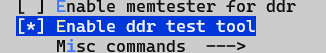
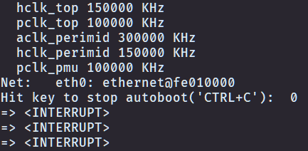
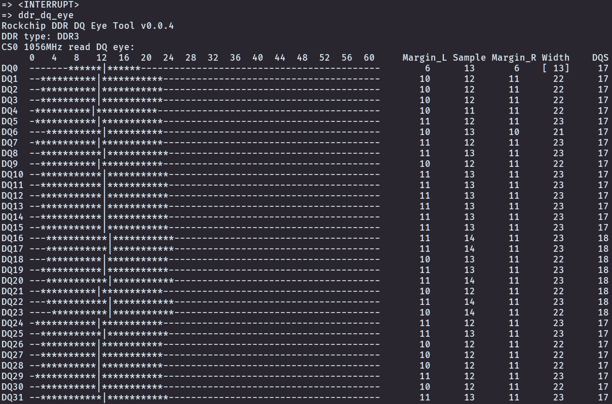
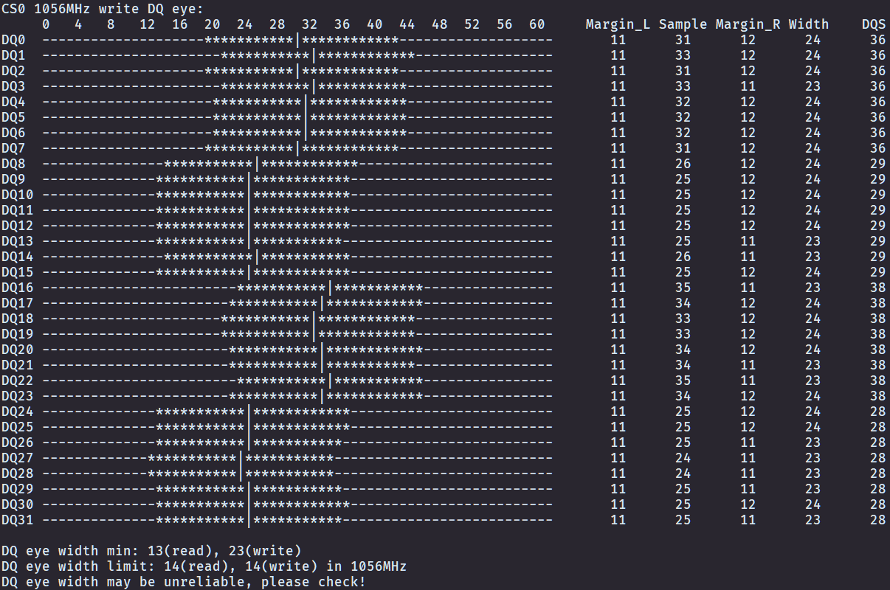

# Rockchip DDR DQ 眼图工具指南

文件标识：RK-YH-YF-167

发布版本：V1.0.0

日期：2021-03-05

文件密级：□绝密   □秘密   □内部资料   ■公开

**免责声明**

本文档按“现状”提供，瑞芯微电子股份有限公司（“本公司”，下同）不对本文档的任何陈述、信息和内容的准确性、可靠性、完整性、适销性、特定目的性和非侵权性提供任何明示或暗示的声明或保证。本文档仅作为使用指导的参考。

由于产品版本升级或其他原因，本文档将可能在未经任何通知的情况下，不定期进行更新或修改。

**商标声明**

“Rockchip”、“瑞芯微”、“瑞芯”均为本公司的注册商标，归本公司所有。

本文档可能提及的其他所有注册商标或商标，由其各自拥有者所有。

**版权所有 © 2021 瑞芯微电子股份有限公司**

超越合理使用范畴，非经本公司书面许可，任何单位和个人不得擅自摘抄、复制本文档内容的部分或全部，并不得以任何形式传播。

瑞芯微电子股份有限公司

Rockchip Electronics Co., Ltd.

地址：     福建省福州市铜盘路软件园A区18号

网址：     [www.rock-chips.com](http://www.rock-chips.com)

客户服务电话： +86-4007-700-590

客户服务传真： +86-591-83951833

客户服务邮箱： [fae@rock-chips.com](mailto:fae@rock-chips.com)

---

**前言**

**概述**

Rockchip DDR DQ 眼图工具提供了在 U-Boot 下输入命令查看各 DQ 读写眼图的功能。

**产品版本**

| **芯片名称** | **软件版本** |
| ------------ | ------------ |
| RV1126  | U-Boot 2017.09 |
| RK356x | U-Boot 2017.09 |

**读者对象**

本文档（本指南）主要适用于以下工程师：

硬件工程师

技术支持工程师

软件开发工程师

**修订记录**

| **版本号** | **作者** | **修改日期** | **修改说明** |
| ---------- | --------| :--------- | ------------ |
| V1.0.0    | 姚旭伟 | 2021-03-05 | 初始版本     |

---

**目录**

[TOC]

---

## 使用方法

### 前期准备

1. 编译 U-Boot 工程前，在工程根目录下打开 menuconfig，进入 Command line interface，配置 Enable ddr test tool 并保存编译配置（Rockchip DDR DQ 眼图工具集成在 DDR Test Tool 中）。

	

2. 编译 U-Boot 工程并烧写 Loader 和 uboot（具体请参考 UBOOT 文档中“编译烧写”相关章节）。

3. 烧写支持 DDR DQ Eye Tool 的 Loader 和 uboot（RV1126 平台可以烧写 U-Boot 工程打包的 Loader，RK356x 平台请烧写 Rockchip 提供的支持本功能的 Loader）

4. 将待测单板的串口连接至上位机，确保单板与上位机可以通过串口正常通信。单板开机时，上位机长按 Ctrl + C 让单板停留在 U-Boot（出现“\<INTERRUPT>”说明单板已停留在 U-Boot）。

	

### U-Boot 下查看 DDR DQ 读写眼图

U-Boot 下输入命令

```shell
ddr_dq_eye <DDR frequency in MHz>
```

参数 \<DDR frequency in MHz\> 指定需要查看 DQ 眼图的 DDR 时钟频率，单位为 MHz，留空时默认为最高频率。

- 例：查看 DDR 时钟频率为 1056MHz 时的 DQ 眼图，U-Boot 下输入命令

	```shell
	ddr_dq_eye 1056
	```

- 例：查看 DDR 最高时钟频率时的 DQ 眼图，U-Boot 下输入命令

	```shell
	ddr_dq_eye
	```

### 输出结果分析





- 工具首先输出工具版本、DDR 类型、频率等信息
- 工具分别输出各 CS 的读眼图与写眼图
- 输出眼图图形中，“-”标记的位置位于眼图外，“\*”标记的位置位于眼图内，“|”标记的位置为采样点
- 眼图图形右边显示了采样点距离眼图左右边界的裕量（Margin_L、Margin_R）、采样点位置（Sample）、眼宽（Width）等信息，方括号标记的为不满足最小眼宽限制的眼宽（如图中读眼图 DQ0）
- 工具最后输出了读眼图和写眼图的最小眼宽，以及最小眼宽限制值（选取相近的频率）

## DDR DQ 最小眼宽限制

根据 DEMO 测试和相关项目经验，本文档对 DDR DQ 的最小读写眼宽做出了相应的限制。如果最小读写眼宽不满足此限制值，DDR 的运行可能不稳定。

> 满足 DDR DQ 最小眼宽限制只能说明当前设计下 DDR DQ 眼宽大小较为可靠，不代表 DDR 的相关设计一定不存在其它问题，请根据实际使用需求做进一步的可靠性测试。

### RV1126 DDR DQ 最小眼宽限制值

| DDR 类型 | DDR 时钟频率 | 最小读眼宽限制值 | 最小写眼宽限制值 |
| -------- | ------------ | ---------------- | ---------------- |
| LPDDR4   | 1056MHz      | 12               | 13               |
| LPDDR4   | 924MHz       | 15               | 15               |
| DDR4     | 1056MHz      | 13               | 9                |
| DDR4     | 924MHz       | 15               | 11               |
| LPDDR3   | 1056MHz      | 15               | 13               |
| LPDDR3   | 924MHz       | 16               | 15               |
| DDR3     | 1056MHz      | 14               | 14               |
| DDR3     | 924MHz       | 17               | 17               |

### RK356x DDR DQ 最小眼宽限制值

| DDR 类型 | DDR 时钟频率 | 最小读眼宽限制值 | 最小写眼宽限制值 |
| -------- | ------------ | ---------------- | ---------------- |
| LPDDR4   | 1560MHz      | 25               | 24               |
| LPDDR4   | 1184MHz      | 30               | 29               |
| DDR4     | 1560MHz      | 30               | 22               |
| DDR4     | 1184MHz      | 32               | 26               |
| LPDDR3   | 1184MHz      | 34               | 25               |
| LPDDR3   | 1056MHz      | 39               | 28               |
| DDR3     | 1184MHz      | 32               | 31               |
| DDR3     | 1056MHz      | 39               | 34               |