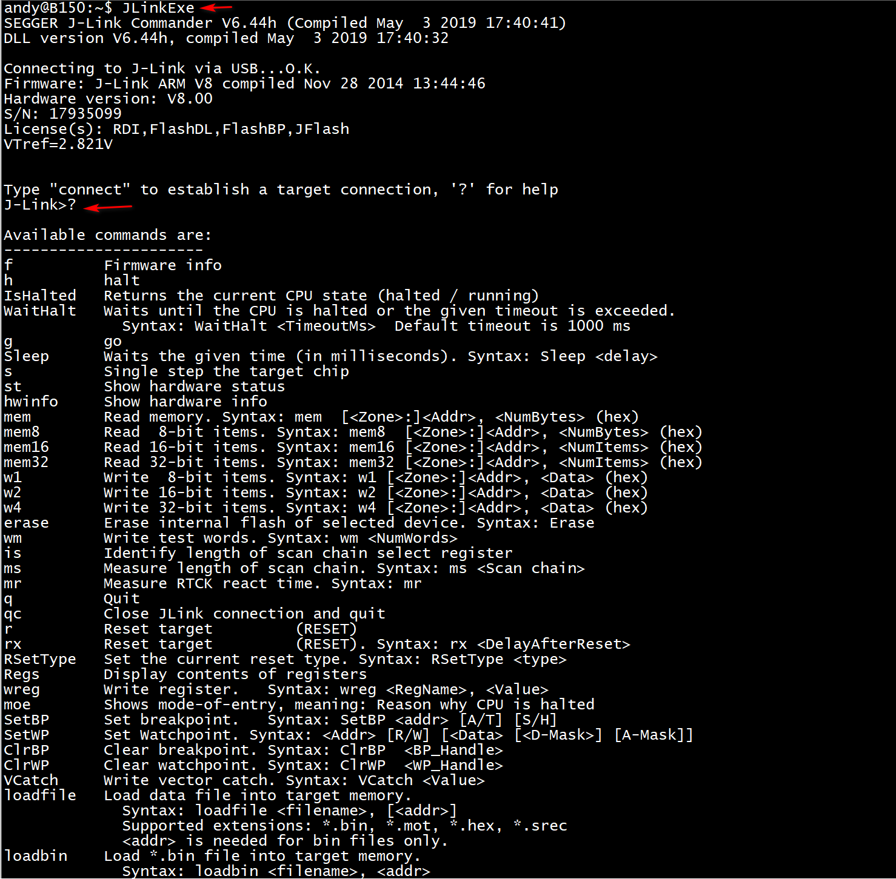
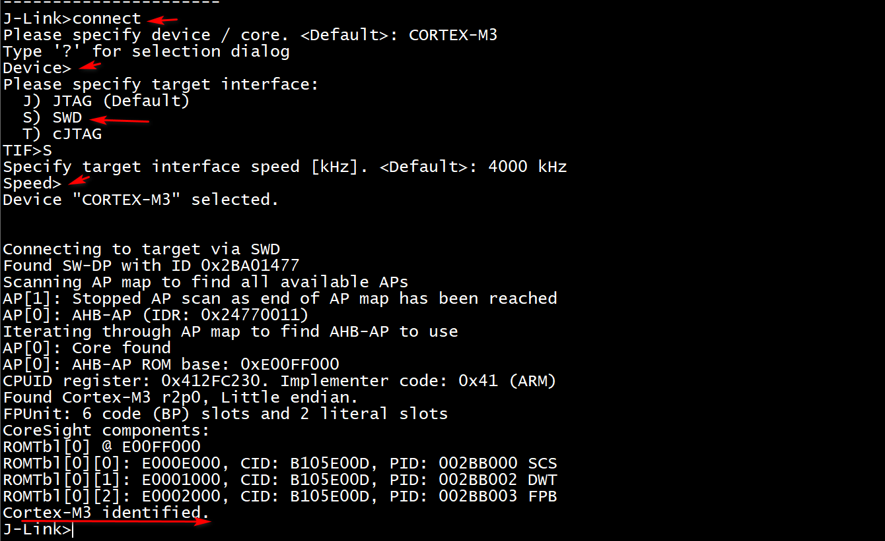
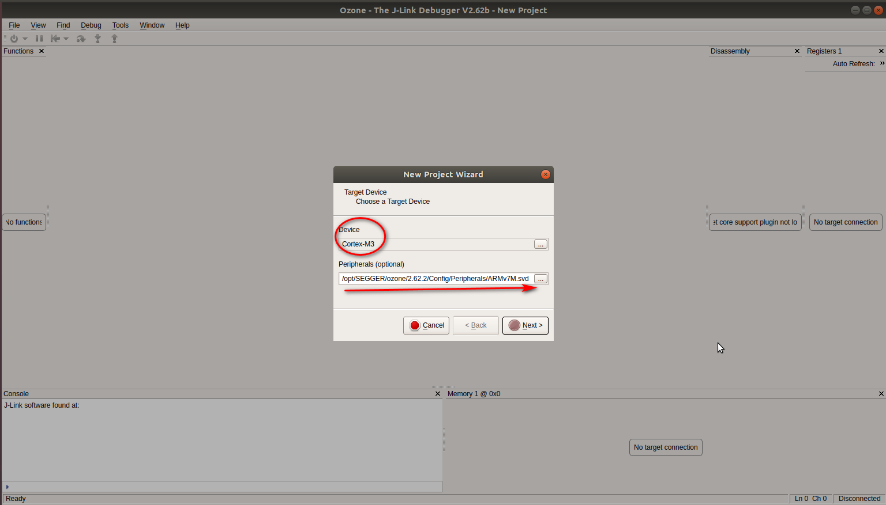
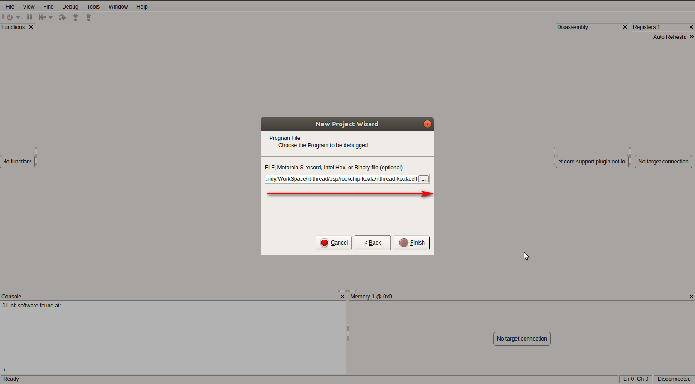
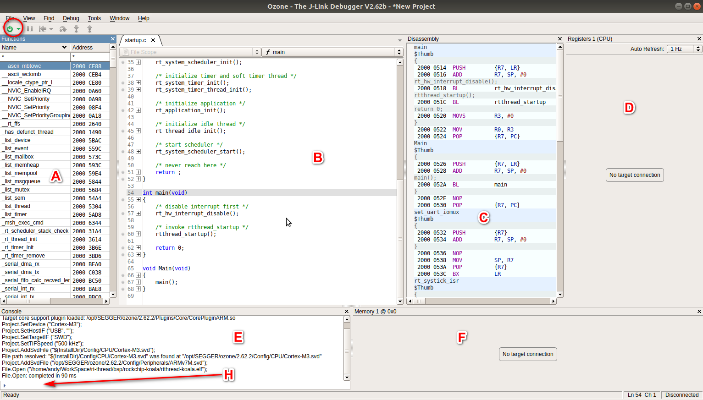
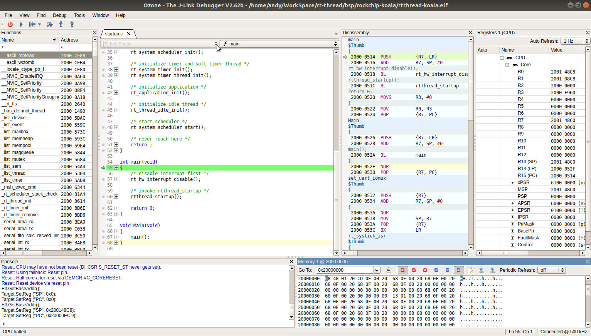
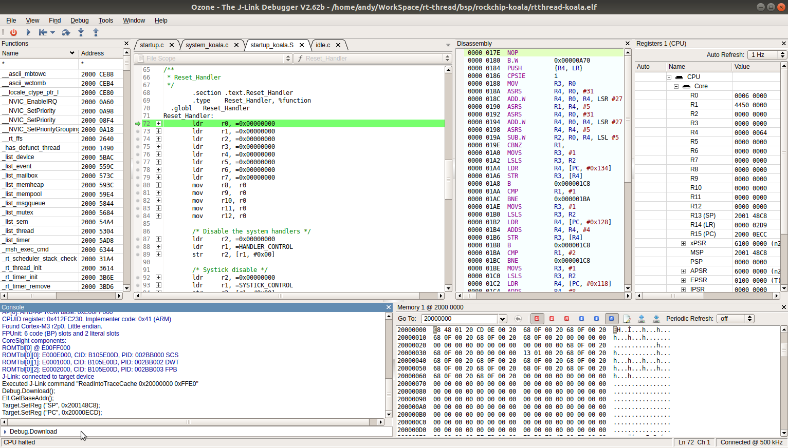

# **J-Link 使用指南**

发布版本：1.0

作者邮箱：andy.yan@rock-chips.com

日期：2019.05

文件密级：公开资料

**读者对象**

本文档（本指南）主要适用于以下工程师：

使用J-Link进行Cortex M系列芯片开发调试的工程师

**修订记录**

| **日期**   | **版本** | **作者** | **修改说明** |
| ---------- | -------- | -------- | ------------ |
| 2019-05-16 | V1.0     | Andy Yan | 初始版本     |

---

[TOC]

## **简介**

J-Link 是德国 [SEGGER](<https://www.segger.com/products/debug-probes/j-link/>) 公司出品的一款 Debug 工具，能够支持 ARM7/9/11，Cortex-M/R/A，RISC-V 等大量嵌入式目标平台，与之配合的 PC 端软件能够运行于 Window/Linux/Mac 等系统上。

J-Link主要提供两个功能：

1. 程序加载，可以把程序加载到目标平台的 RAM 中，或者下载到 flash 中（需要特定的flash烧写算法配合）。
2. 系统跟踪Debug，可以查看目标平台的运行状态，寄存器，内存数据。

## **J-Link命令行工具**

SEGGER提供了跨平台的命令行工具，只要下载安装了J-Link Software and Documentation Pack即可使用。

[下载地址](<https://www.segger.com/downloads/jlink/#J-LinkSoftwareAndDocumentationPack>)

命令行工具在Windows上叫做J-Link Commander，在Linux上为一个可执行文件JLinkExe。

* **启动**

在命令行输入 "?" 可以列出所有支持的命令。

* **连接**

  

输入connect命令进行连接，然后回车选"SWD"，再回车，可以看到芯片被识别到的信息。

* **加载程序并运行**

  

利用loadefile或者loadbin命令加载程序，注意要指定加载地址。

由于Cortex M芯片的启动代码，最前面放的是向量表，其中第一个word放的是堆栈地址，第二个word放的是复位程序(Reset_Handler)的入口地址，所以要用mem32命令把这个地址读出来，然后用SetPC命令把CPU运行地址设置到这个位置，利用go命令开始执行。

## 与Ozone配合

J-Link在使用的时候，在PC端需要有一个上位机软件与之配合。对于使用Keil，IAR等IDE进行代码开发的情况，这两个软件已经提供了从代码编写，编译到下载，调试跟踪的完整功能。但是这些IDE在Debug上有个限制，即Debug无法和代码编译独立，如果你的代码是使用其他工具编译的(比如GCC)，或者当你面对一个要进行调试分析的目标板，你的电脑上没有这个待调试平台的源码，你只是想连上J-Link然后加载符号表进行调试分析，这些IDE都无法满足。在这里我们推荐使用[Ozone](https://www.segger.com/products/development-tools/ozone-j-link-debugger/)，它可以很好的满足这些要求。

Ozone是SEGGER推出的与J-Link配合的Debug和性能分析工具，跨平台(Windows/Linux/Mac)，安装包大小只有20M左右，提供的功能却很完善，小巧而强大。

* **启动**

Device：根据目标板芯片的内核选择，Cortex-M3/Cortex-M4

Peripherals：根据目标板芯片进行选择对应的svd文件，其实这个文件是可以定制的，我们可以根据具体芯片设计，把其他片上外设而已加进去。

* **J-Link设置**

Target Interface：我们芯片的JTAG口一般都用两线模式，所以选SWD

Target Interface Speed：先选一个比较低的速度，连接成功后，会自动调整到一个较高的速度。

Host Interface： 一般J-Link和PC通过USB连接，所以选USB。

Serial No：这个是在PC连接了多个J-Link的情况下用的，一般这里不用选。

* **选择待调试的程序**

  

 这里我们一般选择ELF格式的符号表。

* **进入主界面**

  

左上角电源标识形状的那个是Debug开关按钮

A：函数列表

B：源码，如果根据符号表里面的的信息能在当前电脑上找到源码的位置就会加载

C： 汇编

D：J-Link连上后会显示寄存器信息

E：console log

F：J-Link连上后可以dump 内存

H：这个是可以输入命令的控制台，虽然空间小，但是可以定制很多功能。

* **命令行**

  

输入help可以看到支持的各种命令

* **程序下载运行**

选择Download & Reset Program，Ozone会解析elf文件中的程序运行地址并将其加载到内存中对应的位置，并跳过去开始执行，然后默认停在main函数的入口。然后可以控制单步执行或者设置断点。

* **从程序入口开始单步执行**

有时候我们需要跟踪Debug main函数之前的代码，这时候需要程序加载后停止在入口处，Ozone似乎没有提供一个按钮来实现这个功能，不过可以通过命令来实现。

以Attach & Halt Program的模式连接：

在命令行窗口执行Debug.Download命令：

这时候系统会停在代码入口处，然后可以单步运行Debug。

## **总结**

J-Link还提供了很多其他功能，比如可以配合GDB使用，Ozone也包含了丰富的功能，甚至可以定制各种脚本。请大家在使用的过程中参考他们的使用手册：

* 《J-Link Manual》
* 《Ozone User Manual》

