# DS5 JTAG连接简介

发布版本：2.0

作者邮箱：hhb@rock-chips.com

日期：2018.05

文件密级：公开资料

---

**概述**

本文档主要是简单介绍如何创建一个芯片对应的连接，帮助读者快速使用DS5软件连接设备。

**读者对象**

本文档（本指南）主要适用于以下工程师：
技术支持工程师
软件开发工程师

**修订记录**

| **日期**   | **版本** | **作者** | **修改说明** |
| ---------- | -------- | -------- | ------------ |
| 2017-12-21 | V1.0     | 洪慧斌   | 初始发布     |
| 2018-12-03 | V2.0     | 洪慧斌   | 增加更多内容 |
|            |          |          |              |


-----
[TOC]
-----


# 1 JTAG的硬件接口

## 1.1 系统调试架构，支持JTAG/SW和TRACE_DATA两种输出接口。


## 1.2 JTAG/SW 又分为两种接口，5线的JTAG接口和2线的SW接口

​	JTAG接口包括TDO、TDI、TRST_N、TMS、TCK，SW接口包括TMS和TCK两根线。如图1.2.1，Debug的脚是和SDMMC复用的，硬件设计上可以直接将这些引脚连到JTAG/SW座子上，或者采用TF卡转接板来连接。这两种接口是芯片硬件自动识别和控制的，不需要软件干预。即调试软件如DS-5，若TDO/TDI/TRST_N/TMS/TCK 全部连接，配置为JTAG或SW接口都能识别，如果只连接TMS和TCK，则只能配置为SW接口。本文主要介绍SW接口。


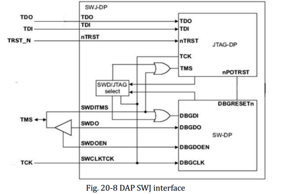

​										（图 1.2.1）

​	图1.2.2是DS-5等调试器的JTAG接口图。一般情况下，DS-5上Debug的连接都采用2线的SW（serial wire）接口。硬件准备好后，可以在Maskrom或Loader烧写模式试连，以确保硬件没问题。因为在上述模式JTAG/SW功能是使能的，但到运行至Linux内核，SDMMC驱动可能会禁止JTAG功能，这需要软件做相应修改。也就是说Debug功能和TF卡无法同时使用。如果debug的板子没有这个原理图，换句话说没有预留JTAG常规接口，那么就需要TF-TO-JTAG转接板，如图1.2.3，该转接板是本公司独有的。如果没有转接板，可以从TF卡座这里飞线，具体接法根据各自芯片的引脚定义。


​										（图1.2.2）


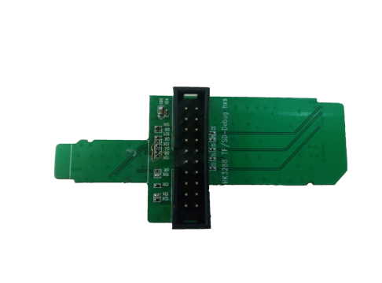

​										（图 1.2.3 TF卡转接板）


​							（图 1.2.4 DSTREAM 和 DEBUG目标板）


# 2 JTAG/SW代码软件配置

## 2.1 IOMUX引脚复用功能的切换

​	JTAG各个引脚是和其他功能模块复用的，需要切换到JTAG的各个引脚。

### 2.1.1 配置IOMUX寄存器

GRF_GPIO4B_IOMUX (0xFF77_0000 +0x0e024)


### 2.1.2 当force jtag 位为1时，硬件会自动切换，不需要配置寄存器IOMUX

GRF_SOC_CON7(0xFF77_0000+0x0e21c)


注意：这个位配为1的时候，需要SDMMC的detect脚为高才会起作用，否则还是SDMMC的IOMUX。

就是说，使用JTAG时不能插着SD卡。


## 2.2 Debug模块和CPU相关CLK

一般无需CLK开关配置。


# 3 DS-5软件工具快速上手

## 3.1 熟悉DS-5软件的主要菜单

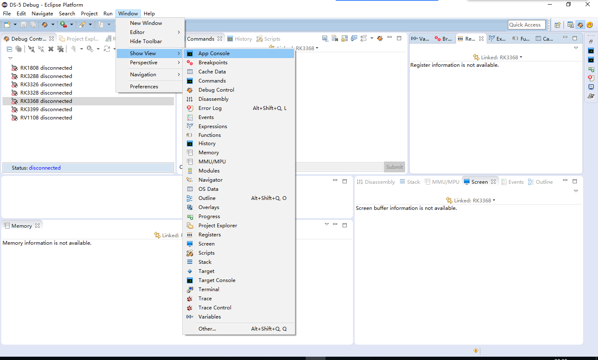


## 3.2 创建新的芯片平台配置

​	这些配置包含了DEBUG系统相关配置信息，主要是告诉DS-5该SOC包含哪些DEBUG模块，及组合方式。SD-5正是根据这些信息去访问SOC的。如果已经有SOC的配置，那么这一步可以跳过去，直接看3.3章节。

创建Configuration Database，FILE->New->Other

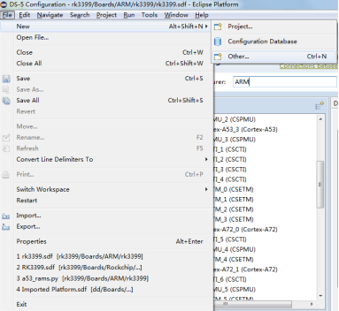


选择Configuration Database

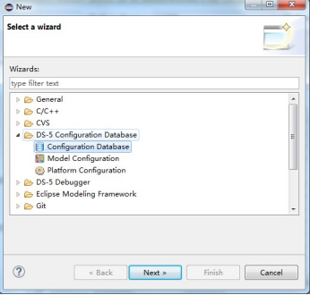


创建Platform Configuration  点击FILE->New->Other

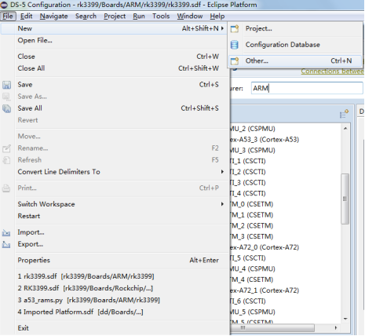


选“Platform Configuration”，点击Next

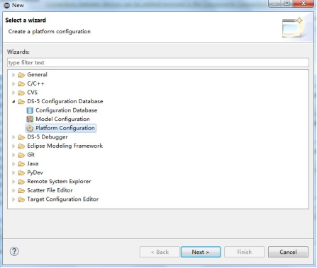


如果硬件连接的是5线的JTAG，选第一个Automatic/simple platform detection。

如果是2线的SW，需要选第二个Advanced platform detection or manual creation。

点击Next


选择之前创建的Database，然后点Next （这说明Configuration Database可以包含多个Platform Configuration）

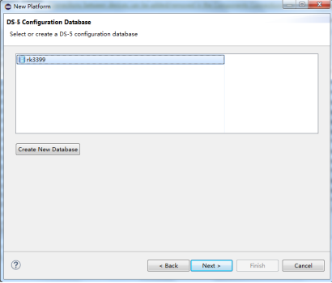


创建成功后，在Connection Address 选择JTAG DEBUG设备


如果硬件连接的是5线的JTAG，直接点击Autodetect Platform。如果是2线的SW，需要配置如下图红色矩形框的配置，然后再点击上图的Autodetect Platform。需要注意：选择Autodetect Platform 一定要在Maskrom模式下，否则很多模块可能识别不到。


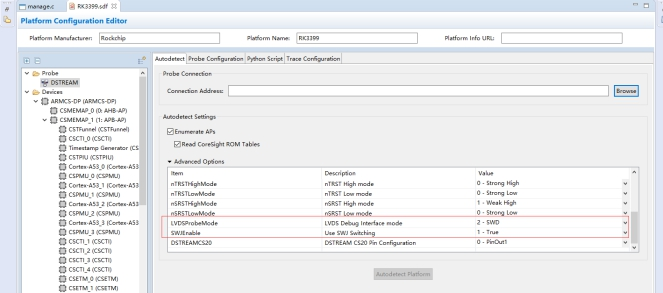


扫描检测完后在左侧窗口展开如下列表，软件提示CSETM_0-3没有连接，需要手动添加，如果没有这类报错，则跳过这几步，直接保存配置。

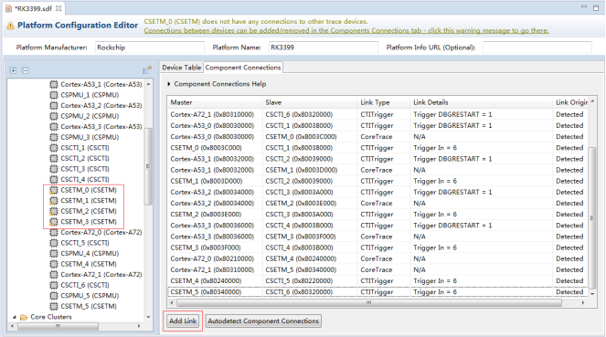


右击CSETM_0，点击Add Link From This Device

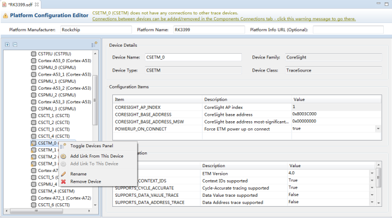


选择CSTFunnel，以此类推添加CSETM_0-3


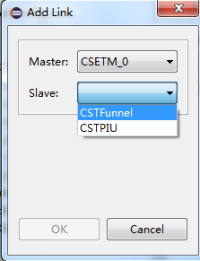


Ctrl+S保存工程，这时工程会生成如下文件，表示创建配置成功。


 上面这些自己生成配置比较繁琐，也可以使用现成的配置。菜单Windos-> Preferences


1 add 配置路径

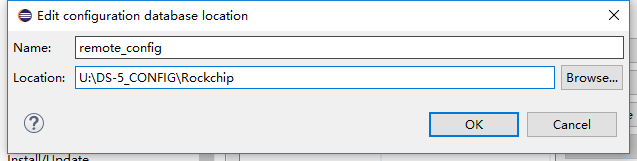


## 3.3 创建新的连接配置

打开Debug Configurations


右击DS-5 Debugger 新建一个Debugger


输入新连接名称，选择对应的SOC配置，可以在第二个红色框输入芯片型号进行搜索。Bare Metal Debug是裸系统调试，Linux Kernel Debug是linux内核调试，会更好的支持带系统调试功能。 


选择连接的CPU组合，仅连接某个核，或者4个核都连接


选择DS-5连接器


选择已经通过USB或网口连接到电脑的DS-5 调试器


在Debugger菜单栏下选择Connect only，点击右下脚的Apply 保存配置，再点击Debug开始连接设备


连接上设备，按stop按钮，执行，单步执行等调试。


## 3.4 错误排除

### 3.4.1 如果连接失败呢，应该如何排查


检查DS5上的TARGET灯是否亮着，如果没亮表示JTAG没供电，需要将SD卡的电打开。


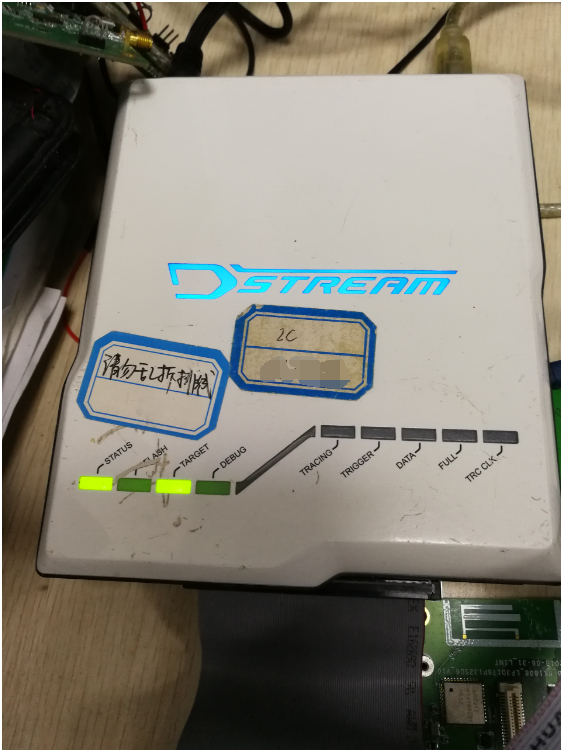


还有要检查TMS和TCK这两个脚的硬件连接是否正常。

### 3.4.2 如果某个DS-5设备用起来怪怪的，连接老是异常，那么可能是DS-5软件和DSTREAM设备固件版本不匹配，

需要升级DSTREAM固件。选择 windows-> show view -> other -> debug hardware firmware installer


1、选择DSTREAM设备，2、连接设备，软件会自动识别出版本，并提示是否需要升级，3、升级固件


## 3.5 调试的基本步骤

### 3.5.1 可查看信息

连上目标板


点击右上角的stop


在Commands窗口输入add-symbol-file  "W:\kernel\rk3399_linux4.4\vmlinux" 导入符号表


如果是其他操作系统或者符号表，使用方式请查找help文档关于add-symbol-file的使用：

```
add-symbol-file myFile.axf                    # Load symbols at entry point+0x0000
add-symbol-file myLib.so                      # Pends symbol file for shared library
add-symbol-file myModule.ko                   # Pends symbol file for OS module
add-symbol-file myFile.axf 0x2000             # Load symbols at entry point+0x2000
add-symbol-file relocate.o -s .text 0x1000 -s .data 0x2000
                                              # Load symbols from relocate.o with
                                              # section .text relocated to 0x1000 and
                                              # section .data relocated to 0x2000
add-symbol-file vmlinux N:0                   # Load symbols at the non-secure address 0x00
add-symbol-file vmlinux EL2:0x4080000000      # Load symbols for the non-secure address space EL2:0x4080000000
```


右击RK3399 connected 选择Display Threads，可以查看linux所有线程的调用栈。


如图，Active Threads 是每个核当前执行的线程，All Threads是所有的线程，点中某个线程就可以看到该线程的调用栈，右测的是CPU 相关的registers，这样各个CPU的现场就可以知道了，这可以解决一部分的问题。


查看当前PC指针的位置


查看mmu页表映射


查看局部变量和全局变量 ，可以手动添加


如果需要查看内存或者外设寄存器，可以使用memory功能。在command 窗口输入info mem会有如下打印，

这里有每个地址空间的访问方式，范围，属性，意义等。

比如SP: 0x00000000abcdef00 是指安全物理地址
APB_0：0xff550000  是直接通过APB总线访问的是外设寄存器空间，当CPU已经挂掉了，可以采用该方式来访问DDR内存或者外设寄存器。

~~~
info mem
Num Enb Low Addr                High Addr               Attributes                         Description
1:  y   SP:0x0000000000000000   SP:0xFFFFFFFFFFFFFFFF   rw, nocache, verify                Memory accessed using secure world physical addresses
2:  y   S:0x00000000            S:0xFFFFFFFF            rw, nocache, verify                Memory accessed using secure world addresses
3:  y   NP:0x0000000000000000   NP:0xFFFFFFFFFFFFFFFF   rw, nocache, verify                Memory accessed using normal world physical addresses
4:  y   N:0x00000000            N:0xFFFFFFFF            rw, nocache, verify                Memory accessed using normal world addresses
5:  y   H:0x00000000            H:0xFFFFFFFF            rw, nocache, verify                Memory accessed via hypervisor address
6:  y   EL3:0x0000000000000000  EL3:0xFFFFFFFFFFFFFFFF  rw, nocache, verify                Memory accessed using EL3 addresses
7:  y   EL2:0x0000000000000000  EL2:0xFFFFFFFFFFFFFFFF  rw, nocache, verify                Memory accessed using EL2 addresses
8:  y   EL1S:0x0000000000000000 EL1S:0xFFFFFFFFFFFFFFFF rw, nocache, verify                Memory accessed using EL1 secure world addresses
9:  y   EL1N:0x0000000000000000 EL1N:0xFFFFFFFFFFFFFFFF rw, nocache, verify                Memory accessed using EL1 normal world addresses
10: y   APB_0:0x00000000        APB_0:0xFFFFFFFF        rw, nobp, nohbp, nocache, noverify APB bus accessed via AP 1 (CSMEMAP_1)
11: y   AHB_0:0x00000000        AHB_0:0xFFFFFFFF        rw, nobp, nohbp, nocache, noverify AHB bus accessed via AP 0 (CSMEMAP_0)
~~~


### 3.5.2  常用的命令

~~~
dump binary memory "E:\mem_ok.txt" sp:0x62000000 +0x200000    保存某段内存到本地文件

restore "E:\mem_ok.txt" binary sp:0x64000000    恢复文件内存到某段内存

memory fill <verify=0>:sp:0x60000000 +0x10 4 0x55555555    在某段内存填充特定值

set *0xff690000=0x33   设置某地址的内存，可以是DDR内存，也可以是外设寄存器或者CPU寄存器

~~~

这是DS-5的命令使用帮助，当你调试过程中出现对DS-5的某种需求时，不妨先到这里来找找，看看有没有你需要的命令。

