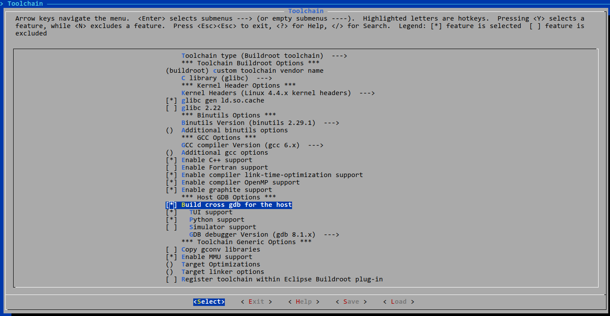
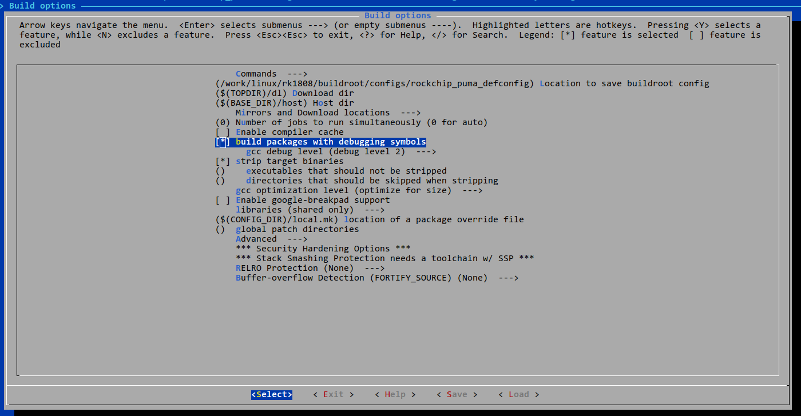

# GDB Over ADB使用指南

发布版本：1.0

作者邮箱：cody.xie@rock-chips.com

日期：2019.06

文件密级：内部资料

------

**前言**

**概述**

GDB Over ADB使用指南。

**读者对象**

本文档（本指南）主要适用于以下工程师：

技术支持工程师

软件开发工程师

**产品版本**

**修订记录**

| **日期**   | **版本** | **作者**  | **修改说明** |
| ---------- | -------- | --------- | ------------ |
| 2019-06-18 | V1.0     | Cody Xie | 初始版本     |

------

[TOC]

------

## Buildroot配置

配置使能gdb主机程序



配置gdbserver程序


这里选择gdbserver够用即可


配置编译buildroot包带调试信息，如果buildroot有配置"strip target binaries"，那么不影响最终打包到target的包，仅影响staging目录，相当于android的symbol目录和最终目录。



## 启动GDB over ADB

1. 配置ADB端口转发

   ```console
   adb forward tcp:1337 tcp:1337
   ```

2. 启动GDB Server程序

   在adb shell或者串口控制台执行

   ```console
   gdbserver :1337 --attach COM PID # COM是要执行的程序完整目录和参数，PID是进程ID
   # 或者
   gdbserver :1337 COM
   # 例如
   gdbserver :1337 /bin/busybox ls
   Process /bin/busybox created; pid = 633
   Listening on port 1337
   Remote debugging from host 127.0.0.1
   Remote side has terminated connection.  GDBserver will reopen the connection.
   Listening on port 1337
   Remote debugging from host 127.0.0.1
   bin             lib32           proc            tmp
   busybox.config  linuxrc         root            udisk
   config          lost+found      run             userdata
   data            media           sbin            usr
   dev             misc            sdcard          var
   etc             mnt             sys
   init            oem             system
   lib             opt             timestamp

   Child exited with status 0
   ```

3. GDB客户端调试

   ```
   $ ./buildroot/output/rockchip_puma/host/bin/arm-buildroot-linux-gnueabihf-gdb
   GNU gdb (GDB) 8.1.1
   Copyright (C) 2018 Free Software Foundation, Inc.
   License GPLv3+: GNU GPL version 3 or later <http://gnu.org/licenses/gpl.html>
   This is free software: you are free to change and redistribute it.
   There is NO WARRANTY, to the extent permitted by law.  Type "show copying"
   and "show warranty" for details.
   This GDB was configured as "--host=x86_64-pc-linux-gnu --target=arm-buildroot-linux-gnueabihf".
   Type "show configuration" for configuration details.
   For bug reporting instructions, please see:
   <http://www.gnu.org/software/gdb/bugs/>.
   Find the GDB manual and other documentation resources online at:
   <http://www.gnu.org/software/gdb/documentation/>.
   For help, type "help".
   Type "apropos word" to search for commands related to "word".
   (gdb) set sysroot /work/linux/rk1808/buildroot/output/rockchip_puma/staging/
   warning: .dynamic section for "/work/linux/rk1808/buildroot/output/rockchip_puma/staging/lib/ld-linux-armhf.so.3" is not at the expected address (wrong library or version mismatch?)
   Reading symbols from /work/linux/rk1808/buildroot/output/rockchip_puma/staging/lib/ld-linux-armhf.so.3...done.
   Reading symbols from /work/linux/rk1808/buildroot/output/rockchip_puma/staging/lib/libc.so.6...done.
   (gdb) target remote :1337
   Remote debugging using :1337
   Reading /bin/busybox from remote target...
   warning: File transfers from remote targets can be slow. Use "set sysroot" to access files locally instead.
   Reading /bin/busybox from remote target...
   Reading symbols from target:/bin/busybox...(no debugging symbols found)...done.
   Reading /lib/ld-linux-armhf.so.3 from remote target...
   Reading /lib/ld-linux-armhf.so.3 from remote target...
   Reading symbols from target:/lib/ld-linux-armhf.so.3...(no debugging symbols found)...done.
   0xf72fcbc0 in _start () from target:/lib/ld-linux-armhf.so.3
   ```

