# DS5 EXTERNAL DEBUG连接简介

文件标识：RK-SM-YF-044

发布版本：V2.1.0

日期：2020-02-26

文件密级：□绝密   □秘密   □内部资料   ■公开

---

**免责声明**

本文档按“现状”提供，福州瑞芯微电子股份有限公司（“本公司”，下同）不对本文档的任何陈述、信息和内容的准确性、可靠性、完整性、适销性、特定目的性和非侵权性提供任何明示或暗示的声明或保证。本文档仅作为使用指导的参考。

由于产品版本升级或其他原因，本文档将可能在未经任何通知的情况下，不定期进行更新或修改。

**商标声明**

“Rockchip”、“瑞芯微”、“瑞芯”均为本公司的注册商标，归本公司所有。

本文档可能提及的其他所有注册商标或商标，由其各自拥有者所有。

**版权所有** **© 2019** **福州瑞芯微电子股份有限公司**

超越合理使用范畴，非经本公司书面许可，任何单位和个人不得擅自摘抄、复制本文档内容的部分或全部，并不得以任何形式传播。

福州瑞芯微电子股份有限公司

Fuzhou Rockchip Electronics Co., Ltd.

地址：     福建省福州市铜盘路软件园A区18号

网址：     [www.rock-chips.com](http://www.rock-chips.com)

客户服务电话： +86-4007-700-590

客户服务传真： +86-591-83951833

客户服务邮箱： [fae@rock-chips.com](mailto:fae@rock-chips.com)

---

**前言**

**概述**

本文主要介绍DS-5 JTAG/SWD连接使用

**产品版本**

| **芯片名称** | **内核版本** |
| ------------ | ------------ |
| 所有芯片     | 无限制       |

**读者对象**

本文档（本指南）主要适用于以下工程师：

技术支持工程师
软件开发工程师

**修订记录**

| **日期**   | **版本** | **作者** | **修改说明**                 |
| ---------- | -------- | -------- | ---------------------------- |
| 2017-12-21 | V1.0.0   | 洪慧斌   | 初始发布                     |
| 2018-12-03 | V2.0.0   | 洪慧斌   | 增加更多内容                 |
| 2020-02-26 | V2.1.0   | 洪慧斌   | 补充文档头内容，一些章节内容 |

---
[TOC]
---

## 1 JTAG/SWD 的硬件接口

### 1.1 系统调试架构，支持 JTAG/SWD 和 TRACE_DATA 两种输出接口


### 1.2 JTAG/SWD 又分为两种接口，5 线的 JTAG 接口和 2 线的 SWD 接口

JTAG 接口包括 TDO、TDI、TRST_N、TMS、TCK，SWD 接口包括 TMS 和 TCK 两根线。如图 1.2.1，Debug 的脚是和 SDMMC 复用的，硬件设计上可以直接将这些引脚连到 JTAG/SWD 座子上，或者采用 TF 卡转接板来连接。这两种接口是芯片硬件自动识别和控制的，不需要软件干预。即调试软件如 DS-5，若 TDO/TDI/TRST_N/TMS/TCK 全部连接，配置为 JTAG 或 SWD 接口都能识别，如果只连接 TMS 和 TCK，则只能配置为 SWD 接口。本文主要介绍 SWD 接口。


​										（图 1.2.1）

图 1.2.2 是 DS-5 等调试器的 JTAG 接口图。一般情况下，DS-5 上 Debug 的连接都采用 2 线的 SWD（serial wire debug）接口。硬件准备好后，可以在 Maskrom 或 Loader 烧写模式试连，以确保硬件没问题。因为在上述模式 JTAG/SWD功能是使能的，但到运行至 Linux 内核，SDMMC 驱动可能会禁止 JTAG/SWD 功能，这需要软件做相应修改。也就是说 Debug 功能和 TF 卡无法同时使用。如果 debug 的板子没有这个原理图，换句话说没有预留 JTAG 常规接口，那么就需要 TF-TO-JTAG 转接板，如图 1.2.3，该转接板是本公司独有的。如果没有转接板，可以从 TF 卡座这里飞线，具体接法根据各自芯片的引脚定义。

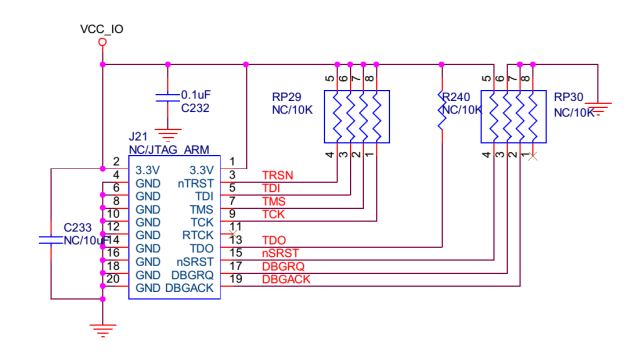

​										（图 1.2.2）


​										（图 1.2.3 TF 卡转接板）

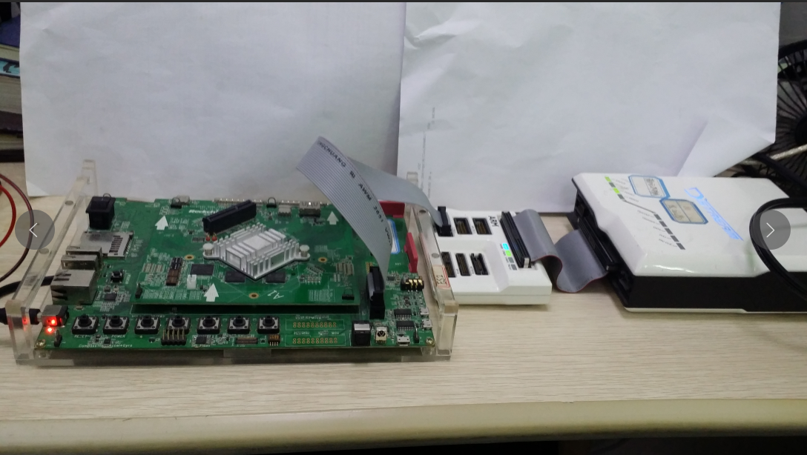

​							（图 1.2.4 DSTREAM 和 DEBUG 目标板）

## 2 JTAG/SWD代码软件配置

### 2.1 IOMUX 引脚复用功能的切换

JTAG 各个引脚是和其他功能模块复用的，需要切换到 JTAG 的各个引脚。

#### 2.1.1 配置 IOMUX 寄存器

GRF_GPIO4B_IOMUX (0xFF77_0000 +0x0e024)

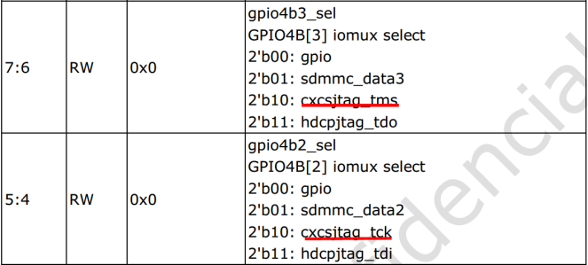

#### 2.1.2 当 force jtag 位为 1 时，硬件会自动切换，不需要配置寄存器 IOMUX

GRF_SOC_CON7(0xFF77_0000+0x0e21c)

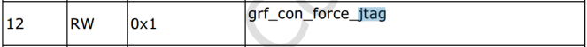

注意：这个位配为 1 的时候，需要 SDMMC 的 detect 脚为高才会起作用，否则还是 SDMMC 的 IOMUX。

就是说，使用 JTAG 时不能插着 SD 卡。

### 2.2 Debug 模块和 CPU 相关 CLK

一般无需 CLK 开关配置。

## 3 DS-5 软件工具快速上手

### 3.1 熟悉 DS-5 软件的主要菜单


### 3.2 创建新的芯片平台配置

这些配置包含了 DEBUG 系统相关配置信息，主要是告诉 DS-5 该 SOC 包含哪些 DEBUG 模块，及组合方式。SD-5 正是根据这些信息去访问 SOC 的。如果已经有 SOC 的配置，那么这一步可以跳过去，直接看 3.3 章节。

创建 Configuration Database，FILE->New->Other


选择 Configuration Database


创建 Platform Configuration  点击 FILE->New->Other


选“Platform Configuration”，点击 Next


如果硬件连接的是 5 线的 JTAG，选第一个 Automatic/simple platform detection。

如果是 2 线的 SWD，需要选第二个 Advanced platform detection or manual creation。

点击 Next

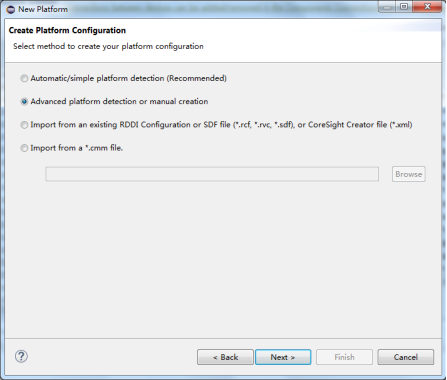

选择之前创建的 Database，然后点 Next （这说明 Configuration Database 可以包含多个 Platform Configuration）


创建成功后，在 Connection Address 选择 Dstream 设备 USB:004404

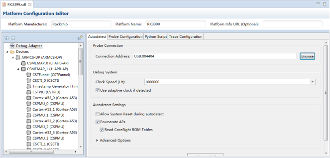

选择已经通过 USB 或网口连接到电脑的 DS-5 调试器

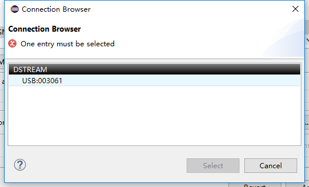

如果硬件连接的是 5 线的 JTAG，直接点击 Autodetect Platform。如果是 2 线的 SWD，需要配置如下图红色矩形框的配置，然后再点击上图的 Autodetect Platform。需要注意：选择 Autodetect Platform 一定要在 Maskrom 模式下，否则很多模块可能识别不到。


扫描检测完后在左侧窗口展开如下列表，软件提示 CSETM_0-3 没有连接，需要手动添加，如果没有这类报错，则跳过这几步，直接保存配置。


右击 CSETM_0，点击 Add Link From This Device


选择 CSTFunnel，以此类推添加 CSETM_0-3


Ctrl+S 保存工程，这时工程会生成如下文件，表示创建配置成功。

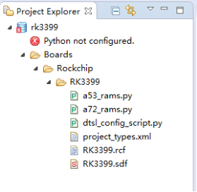

上面这些自己生成配置比较繁琐，也可以使用现成的配置。菜单 Windos-> Preferences

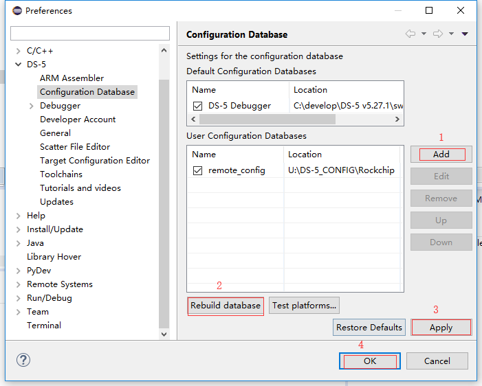

1 add 配置路径


### 3.3 创建新的连接配置

打开 Window->Show view->Debug Control

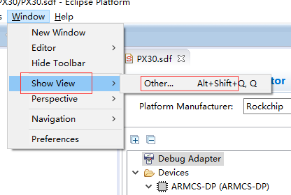

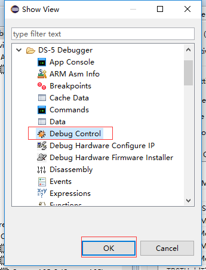

打开 Debug Configurations

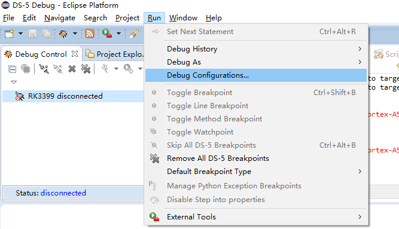

右击 DS-5 Debugger 新建一个 Debugger

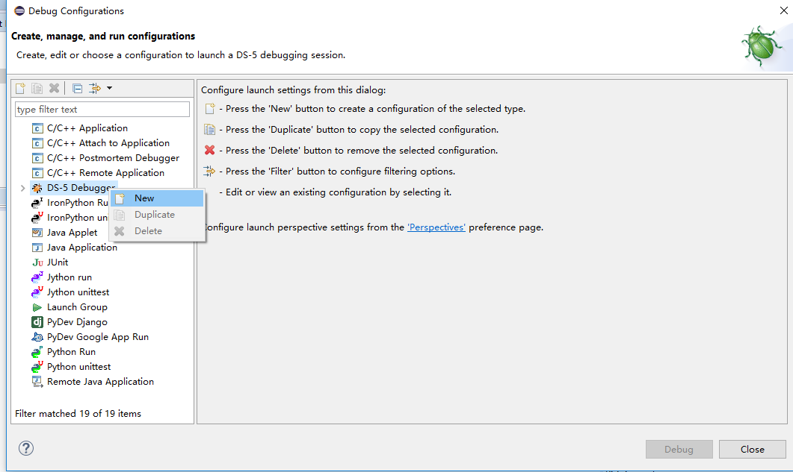

输入新连接名称，选择对应的 SOC 配置，可以在第二个红色框输入芯片型号进行搜索。Bare Metal Debug 是裸系统调试，Linux Kernel Debug 是 linux 内核调试，会更好的支持带系统调试功能。

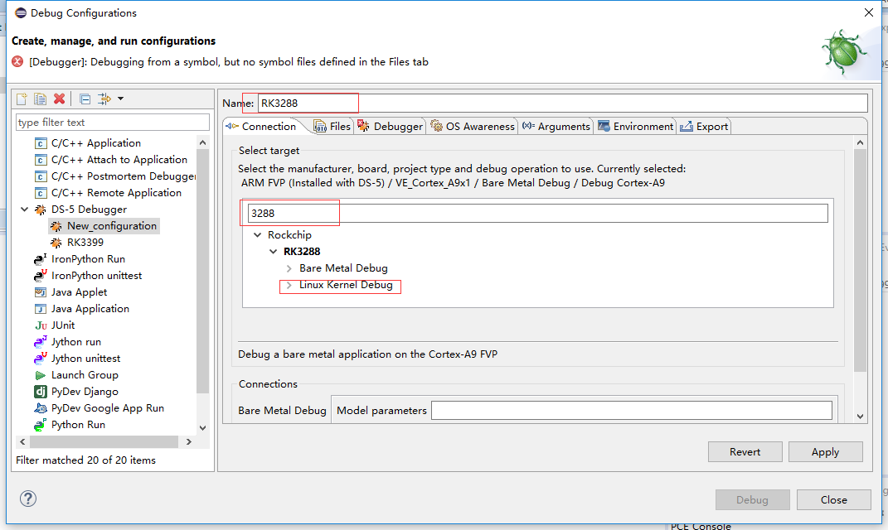

选择连接的 CPU 组合，仅连接某个核，或者 4 个核都连接

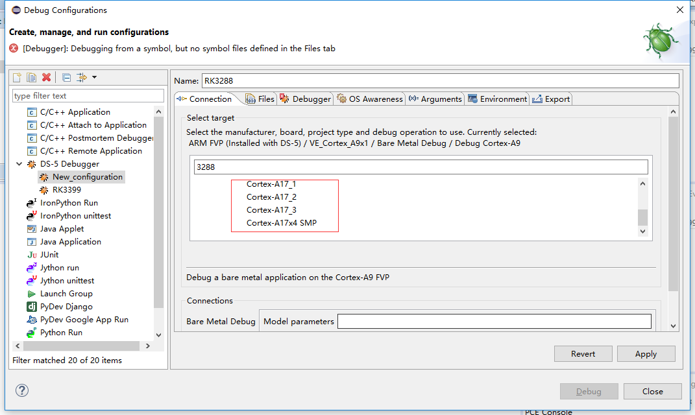

选择 DS-5 连接器

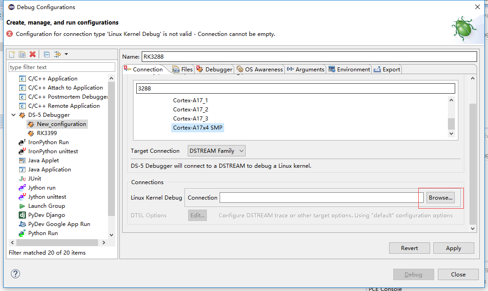

选择已经通过 USB 或网口连接到电脑的 DS-5 调试器


在 Debugger 菜单栏下选择 Connect only，点击右下脚的 Apply 保存配置，再点击 Debug 开始连接设备

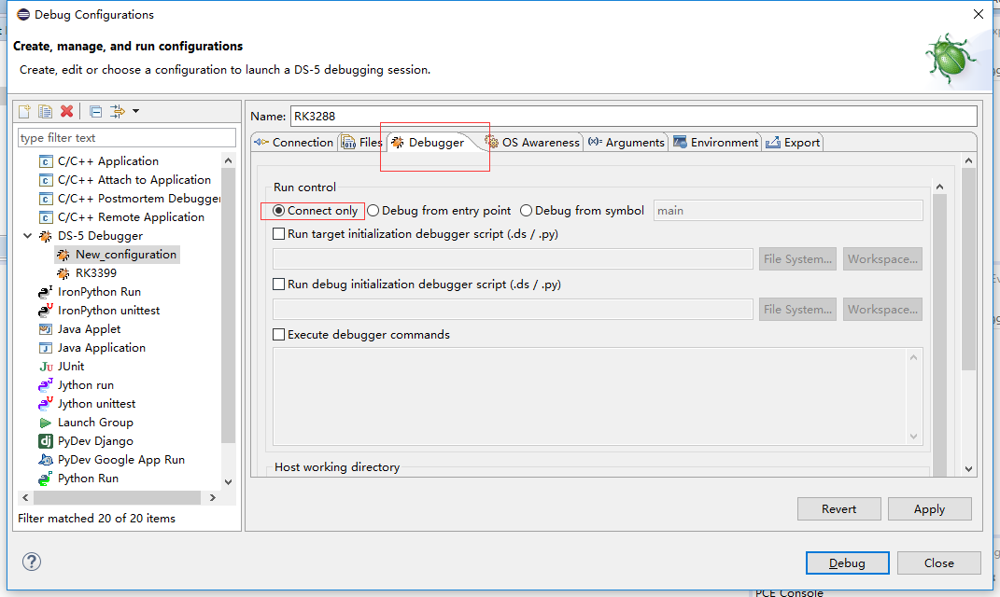

连接上设备，按 stop 按钮，执行，单步执行等调试。


### 3.4 错误排除

#### 3.4.1 如果连接失败呢，应该如何排查

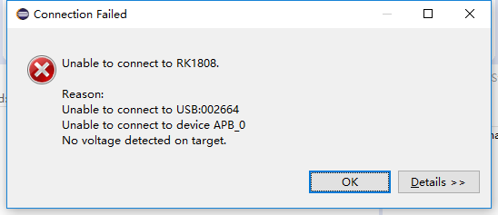

检查 DS5 上的 TARGET 灯是否亮着，如果没亮表示 JTAG 没供电，需要将 SD 卡的电打开。

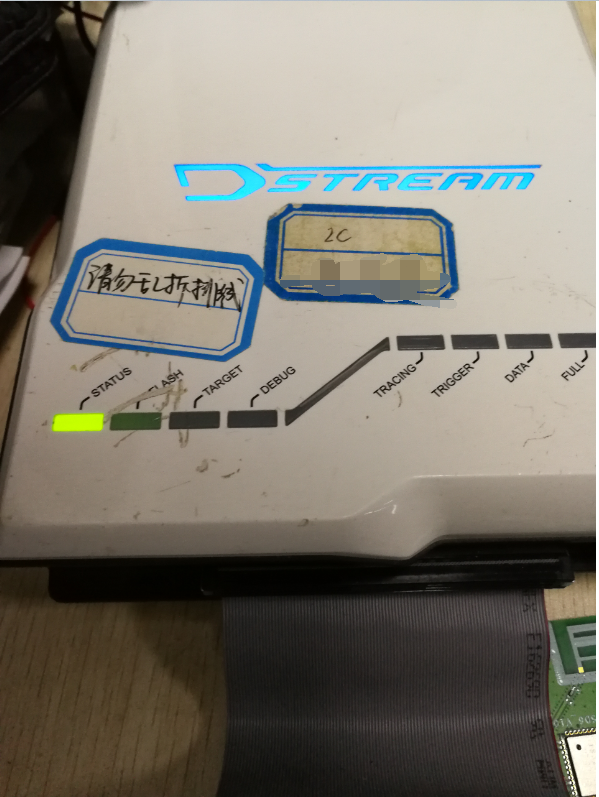


还有要检查 TMS 和 TCK 这两个脚的硬件连接是否正常。

#### 3.4.2 如果某个 DS-5 设备用起来怪怪的，连接老是异常，那么可能是 DS-5 软件和 DSTREAM 设备固件版本不匹配

需要升级 DSTREAM 固件。选择 windows-> show view -> other -> debug hardware firmware installer

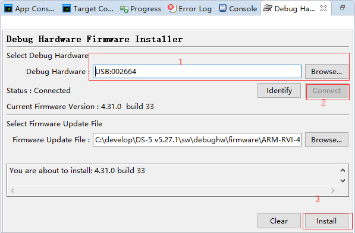

1、选择 DSTREAM 设备，2、连接设备，软件会自动识别出版本，并提示是否需要升级，3、升级固件

### 3.5 调试的基本步骤

#### 3.5.1 可查看信息

连上目标板

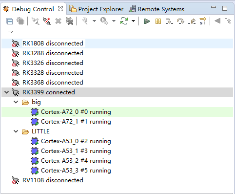

点击右上角的 stop

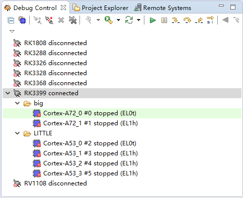

在 Commands 窗口输入 add-symbol-file  "W:\kernel\rk3399_linux4.4\vmlinux" 导入符号表

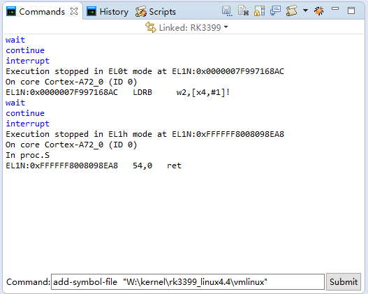

如果是其他操作系统或者符号表，使用方式请查找 help 文档关于 add-symbol-file 的使用：

```
add-symbol-file myFile.axf                    # Load symbols at entry point+0x0000
add-symbol-file myLib.so                      # Pends symbol file for shared library
add-symbol-file myModule.ko                   # Pends symbol file for OS module
add-symbol-file myFile.axf 0x2000             # Load symbols at entry point+0x2000
add-symbol-file relocate.o -s .text 0x1000 -s .data 0x2000
                                              # Load symbols from relocate.o with
                                              # section .text relocated to 0x1000 and
                                              # section .data relocated to 0x2000
add-symbol-file vmlinux N:0                   # Load symbols at the non-secure address 0x00
add-symbol-file vmlinux EL2:0x4080000000      # Load symbols for the non-secure address space EL2:0x4080000000
```

右击 RK3399 connected 选择 Display Threads，可以查看 linux 所有线程的调用栈。

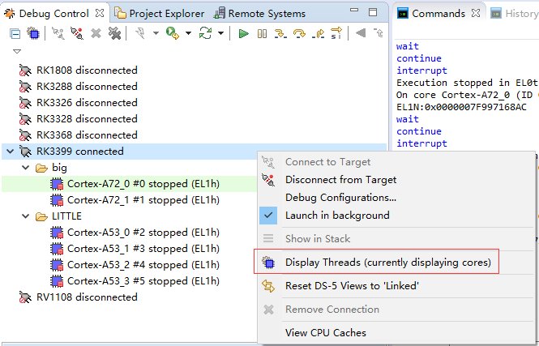

如图，Active Threads 是每个核当前执行的线程，All Threads 是所有的线程，点中某个线程就可以看到该线程的调用栈，右测的是 CPU 相关的 registers，这样各个 CPU 的现场就可以知道了，这可以解决一部分的问题。

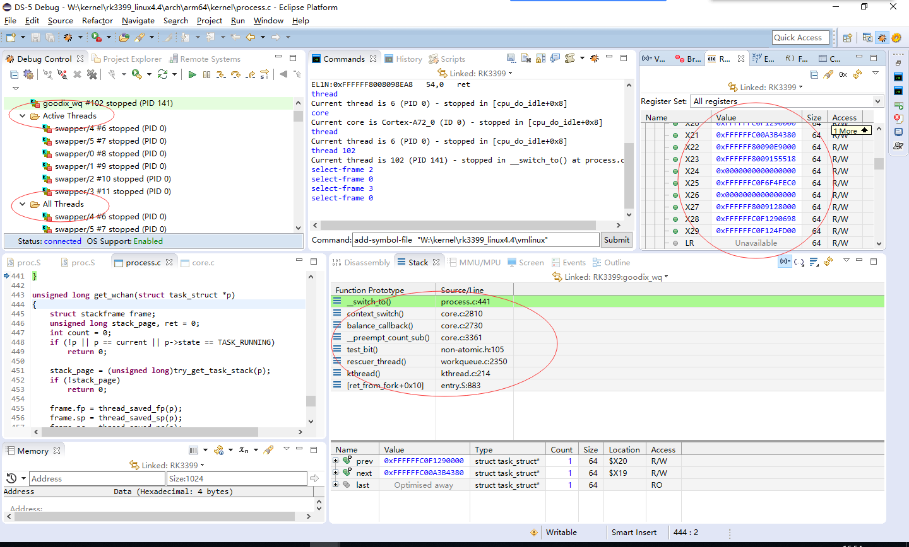

查看当前 PC 指针的位置

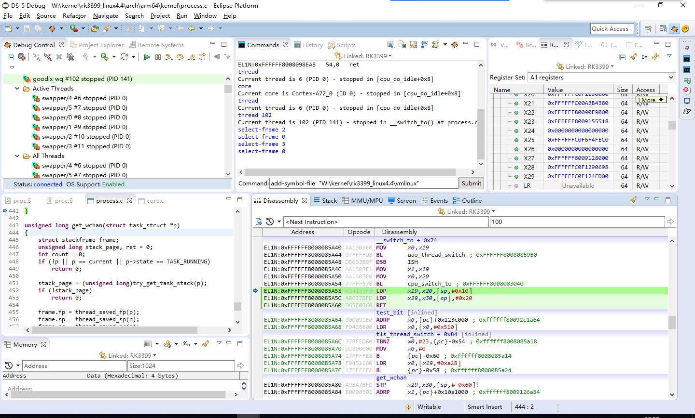

查看 mmu 页表映射

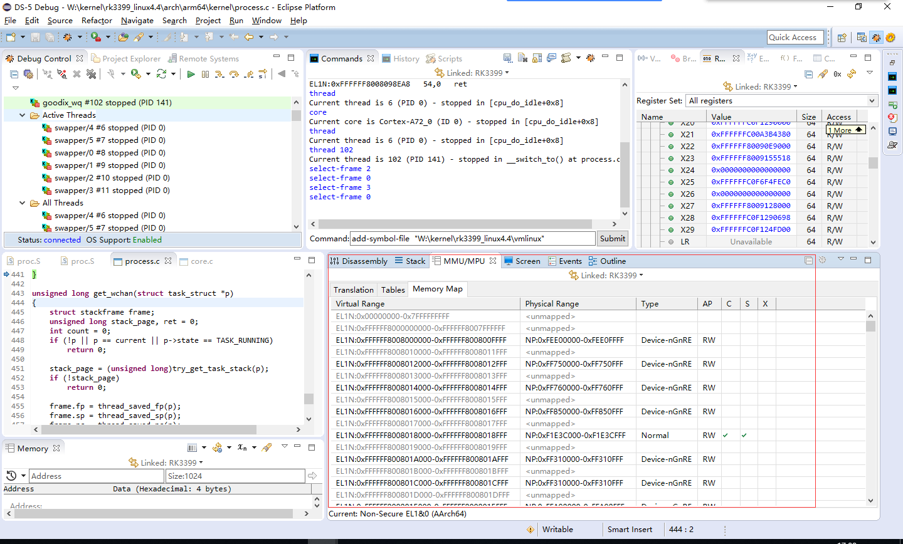

查看局部变量和全局变量 ，可以手动添加

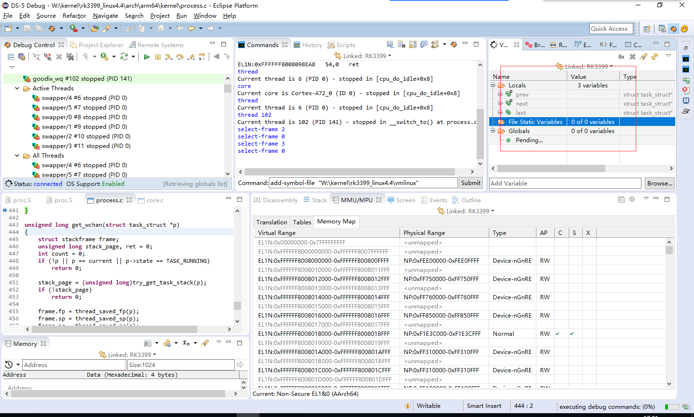

如果需要查看内存或者外设寄存器，可以使用 memory 功能。在 command 窗口输入 info mem 会有如下打印，

这里有每个地址空间的访问方式，范围，属性，意义等。

比如 SP: 0x00000000abcdef00 是指安全物理地址
APB_0：0xff550000  是直接通过 APB 总线访问的是外设寄存器空间，当 CPU 已经挂掉了，可以采用该方式来访问 DDR 内存或者外设寄存器。

```c
info mem
Num Enb Low Addr                High Addr               Attributes                         Description
1:  y   SP:0x0000000000000000   SP:0xFFFFFFFFFFFFFFFF   rw, nocache, verify                Memory accessed using secure world physical addresses
2:  y   S:0x00000000            S:0xFFFFFFFF            rw, nocache, verify                Memory accessed using secure world addresses
3:  y   NP:0x0000000000000000   NP:0xFFFFFFFFFFFFFFFF   rw, nocache, verify                Memory accessed using normal world physical addresses
4:  y   N:0x00000000            N:0xFFFFFFFF            rw, nocache, verify                Memory accessed using normal world addresses
5:  y   H:0x00000000            H:0xFFFFFFFF            rw, nocache, verify                Memory accessed via hypervisor address
6:  y   EL3:0x0000000000000000  EL3:0xFFFFFFFFFFFFFFFF  rw, nocache, verify                Memory accessed using EL3 addresses
7:  y   EL2:0x0000000000000000  EL2:0xFFFFFFFFFFFFFFFF  rw, nocache, verify                Memory accessed using EL2 addresses
8:  y   EL1S:0x0000000000000000 EL1S:0xFFFFFFFFFFFFFFFF rw, nocache, verify                Memory accessed using EL1 secure world addresses
9:  y   EL1N:0x0000000000000000 EL1N:0xFFFFFFFFFFFFFFFF rw, nocache, verify                Memory accessed using EL1 normal world addresses
10: y   APB_0:0x00000000        APB_0:0xFFFFFFFF        rw, nobp, nohbp, nocache, noverify APB bus accessed via AP 1 (CSMEMAP_1)
11: y   AHB_0:0x00000000        AHB_0:0xFFFFFFFF        rw, nobp, nohbp, nocache, noverify AHB bus accessed via AP 0 (CSMEMAP_0)
```

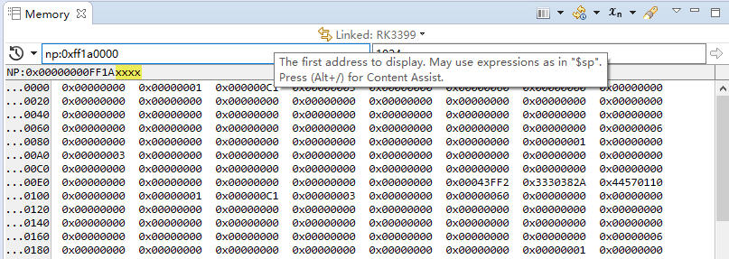

#### 3.5.2  常用的命令

```c
dump binary memory "E:\mem_ok.txt" sp:0x62000000 +0x200000    保存某段内存到本地文件

restore "E:\mem_ok.txt" binary sp:0x64000000    恢复文件内存到某段内存

memory fill <verify=0>:sp:0x60000000 +0x10 4 0x55555555    在某段内存填充特定值

set *0xff690000=0x33   设置某地址的内存，可以是DDR内存，也可以是外设寄存器或者CPU寄存器

```

这是 DS-5 的命令使用帮助，当你调试过程中出现对 DS-5 的某种需求时，不妨先到这里来找找，看看有没有你需要的命令。

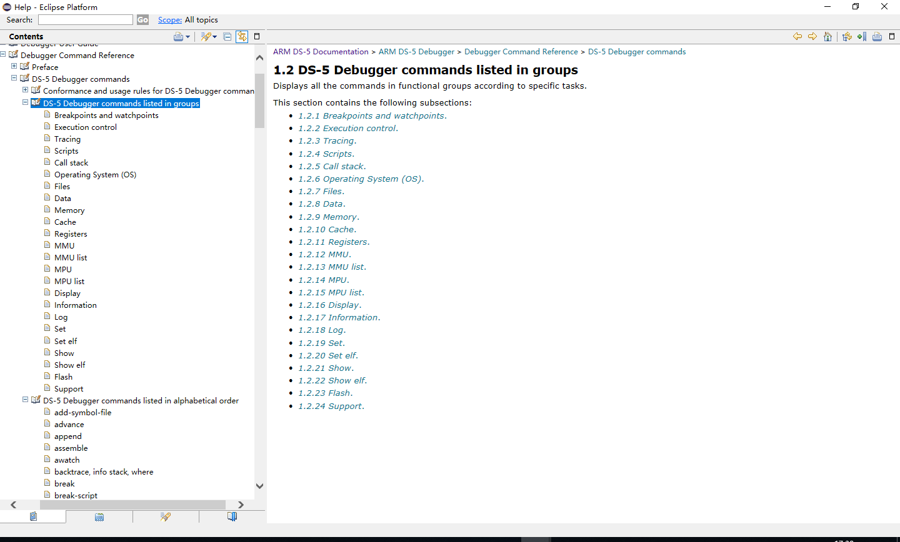