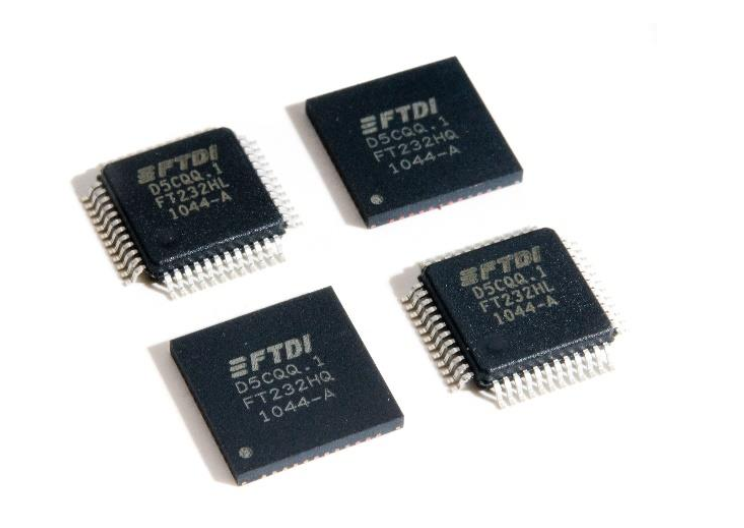
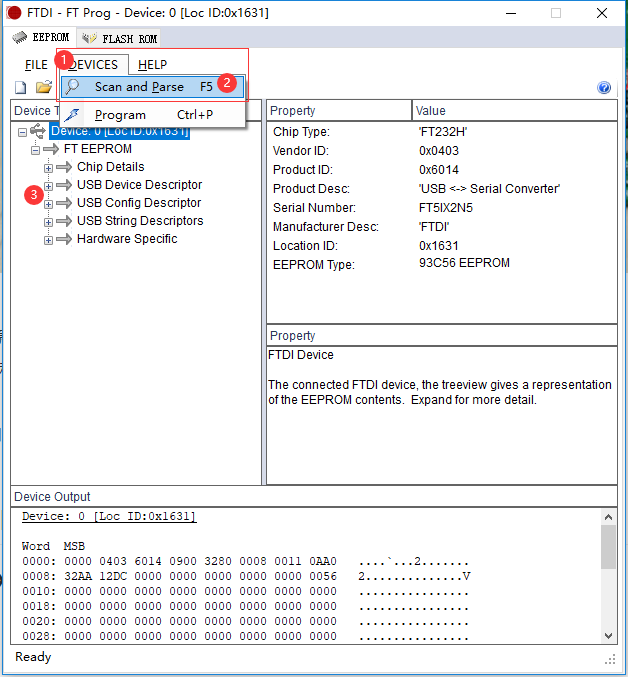
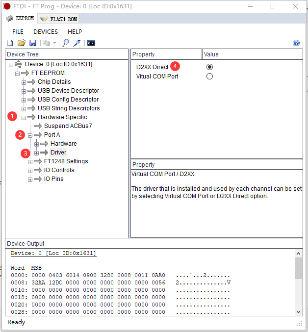
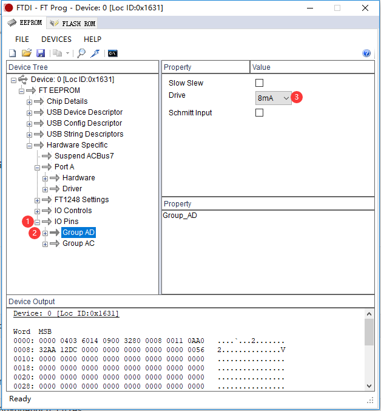
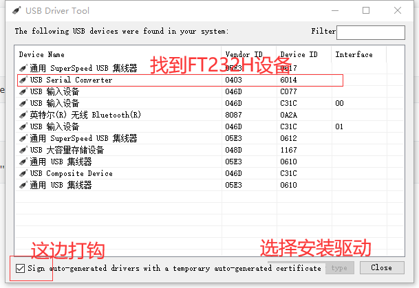
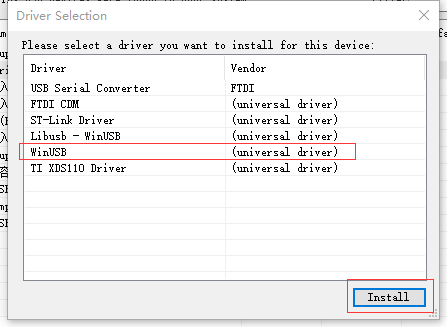

# FT232H USB2JTAG

文件标识：RK-KF-YF-118

发布版本：V1.0.0

日期：2020-06-03

文件密级：□绝密   □秘密   □内部资料   ■公开

**免责声明**

本文档按“现状”提供，瑞芯微电子股份有限公司（“本公司”，下同）不对本文档的任何陈述、信息和内容的准确性、可靠性、完整性、适销性、特定目的性和非侵权性提供任何明示或暗示的声明或保证。本文档仅作为使用指导的参考。

由于产品版本升级或其他原因，本文档将可能在未经任何通知的情况下，不定期进行更新或修改。

**商标声明**

“Rockchip”、“瑞芯微”、“瑞芯”均为本公司的注册商标，归本公司所有。

本文档可能提及的其他所有注册商标或商标，由其各自拥有者所有。

**版权所有 © 2020 瑞芯微电子股份有限公司**

超越合理使用范畴，非经本公司书面许可，任何单位和个人不得擅自摘抄、复制本文档内容的部分或全部，并不得以任何形式传播。

瑞芯微电子股份有限公司

Rockchip Electronics Co., Ltd.

地址：     福建省福州市铜盘路软件园A区18号

网址：     [www.rock-chips.com](http://www.rock-chips.com)

客户服务电话： +86-4007-700-590

客户服务传真： +86-591-83951833

客户服务邮箱： [fae@rock-chips.com](mailto:fae@rock-chips.com)

---

**前言**

**概述**

本文主要介绍 Rockchip FT232H USB 转 JTAG 小板的使用

**产品版本**

| **芯片名称** | **内核版本** |
| ------------ | ------------ |
|      all      |              |

**读者对象**

本文档（本指南）主要适用于以下工程师：

技术支持工程师

软件开发工程师

**修订记录**

| **版本号** | **作者** | **修改日期** | **修改说明** |
| ---------- | --------| :--------- | ------------ |
| V1.0.0    | 洪慧斌 | 2020-06-03 | 初始版本     |

---

**目录**

[TOC]

---

## 1 说明

FT232H 是“Future Technology Devices International Ltd”的一款芯片，USB 转各种接口，这里主要使用 USB 转 JTAG/SWD 功能。



## 2 Rockchip FT232H 小板


FT232H 小板：

* LED 指示灯，LED1：电源指示灯；LED2:  灭：未连接，闪：连接；LED3：暂时未定义；
* USB 接口：有 TYPEC 接口和 mini USB 接口两种
* ARM 20PIN JTAG 接口
* 拨码开关
    * SWD 模式， 1、3、5 off，2、4、6 on
    * JTAG 模式， 1、3、5 on，2、4、6 off
* 排针，VCC、TCS、TCK、GND，可以和板子飞线连接
* 按键，按下会拉低 TMS

## 3 Windows 环境下配置 FT232H EEPROM 信息

### 3.1 安装 EEPROM 编程工具 FT_Prog_v3.8.128.448 Installer.exe

解压 gnumcueclipse_v1.0.zip，安装 RK\FTDI\FT_Prog_v3.8.128.448 Installer.exe

或者网络下载：

```
https://www.ftdichip.com/Support/Utilities.htm#FT_PROG
```

### 3.2 运行 FT_Prog.exe



* 1 点击 DEVICES 菜单
* 2 扫描设备
* 3 扫描结果

### 3.3 配置驱动属性



* 1 点击并打开 Hardware Specific
* 2 点击并打开 Port A
* 3 选中 Driver
* 4 选择 D2XX Direct

### 3.4 配置 JTAG/SWD 驱动强度



* 1 点开 IO Pins
* 2 选中 Group AD
* 3 Drive 选择 8mA，这可以改善 TCK 30MHz 波形

## 4 驱动安装

### 4.1 Ubuntu 16.04 以上驱动配置

#### 4.1.1 安装驱动

```
sudo apt-get install libftdi-dev
```

#### 4.1.1 添加 USB 信息

打开或创建/etc/udev/rules.d/60-openocd.rules：

```
sudo gedit /etc/udev/rules.d/60-openocd.rules
```

添加以下配置：

```
# Original FT232H VID:PID
ATTRS{idVendor}=="0403", ATTRS{idProduct}=="6014", MODE="660", GROUP="plugdev", TAG+="uaccess"
```

说明：4.1.1 这步是 OpenOCD 使用 FT232H 时需要的。

### 4.2 Windows 驱动配置

不同的软件在使用 FT232H 时，驱动是不一样的，那么就需要根据需求来修改 FT232H 的 USB 驱动。

以下以 OpenOCD 使用 FT232H 为例：

#### 4.2.1 运行 RK\OpenOCD\drivers\UsbDriverTool.exe



#### 4.2.2 将 FT232H 默认驱动改为 WinUSB 驱动



#### 4.2.3 安装成功


说明：安装时，请保持设备插入状态，如果安装成功后无法使用，请重新拔插。

注意：每次使用前请先确认是否有该设备，如果没有，请重复 4.2 步骤。

换个一样的 FT232H 小板，也是得重新安装驱动。
