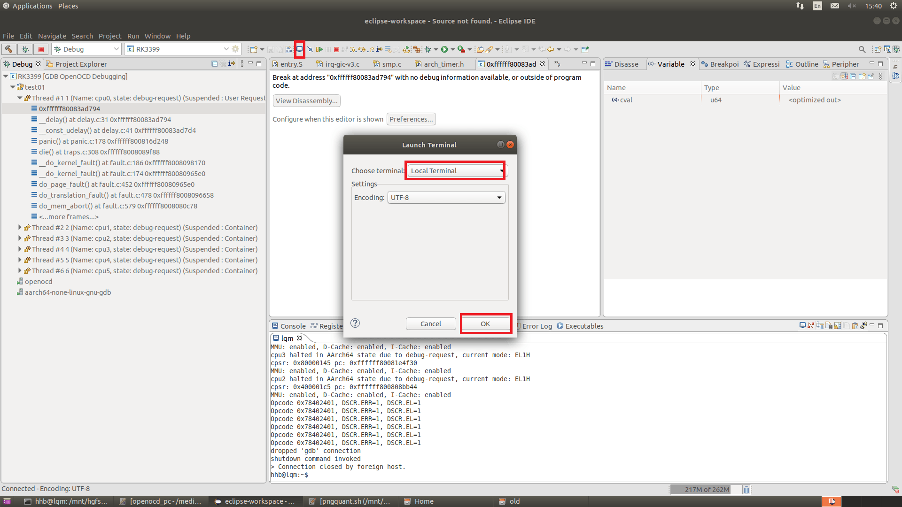
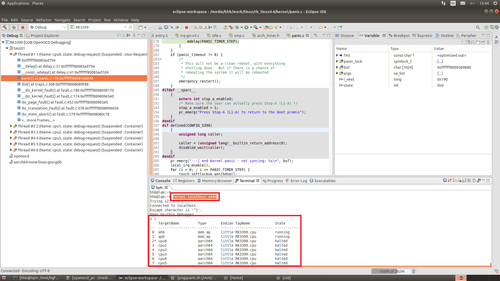

# GNU MCU Eclipse OpenOCD

文件标识：RK-KF-YF-91

发布版本：V1.0.0

日期：2020-04-21

文件密级：□绝密   □秘密   □内部资料   ■公开

**免责声明**

本文档按“现状”提供，瑞芯微电子股份有限公司（“本公司”，下同）不对本文档的任何陈述、信息和内容的准确性、可靠性、完整性、适销性、特定目的性和非侵权性提供任何明示或暗示的声明或保证。本文档仅作为使用指导的参考。

由于产品版本升级或其他原因，本文档将可能在未经任何通知的情况下，不定期进行更新或修改。

**商标声明**

“Rockchip”、“瑞芯微”、“瑞芯”均为本公司的注册商标，归本公司所有。

本文档可能提及的其他所有注册商标或商标，由其各自拥有者所有。

**版权所有 © 2020 瑞芯微电子股份有限公司**

超越合理使用范畴，非经本公司书面许可，任何单位和个人不得擅自摘抄、复制本文档内容的部分或全部，并不得以任何形式传播。

瑞芯微电子股份有限公司

Rockchip Electronics Co., Ltd.

地址：     福建省福州市铜盘路软件园A区18号

网址：     [www.rock-chips.com](http://www.rock-chips.com)

客户服务电话： +86-4007-700-590

客户服务传真： +86-591-83951833

客户服务邮箱： [fae@rock-chips.com](mailto:fae@rock-chips.com)

---

**前言**

**概述**

本文主要介绍 GNU MCU Eclipse OpenOCD调试方面的功能。

**产品版本**

| **芯片名称** | **内核版本** |
| ------------ | ------------ |
| RK3399 |  |
| RK3288 | |
| RK3368 | |
| RK3326 | |
| PX30 | |
| RK3308 | |
| RV1108 | |
| RV1126 | |
| RK2108 | |
| RK2206 | |
| RISCV | |

**读者对象**

本文档（本指南）主要适用于以下工程师：

技术支持工程师

软件开发工程师

**修订记录**

| **版本号** | **作者** | **修改日期** | **修改说明** |
| ---------- | --------| :--------- | ------------ |
| V1.0.0    | 洪慧斌 | 2020-04-21 | 初始版本     |
| V1.1.0 | 洪慧斌 | 2020-06-18 | 主要修改 章节2 操作系统环境，增加章节4，修改公司名称 |

---

**目录**

[TOC]

---

## 1 说明

调试结构：Eclipse CDT+GNU MCU Eclipse OpenOCD+Eclipse+GDB+OpenOCD+ftdi/jlink+SOC

* Eclipse CDT (C/C++ Development Tooling)  C/C++ 开发工具

* GNU MCU Eclipse OpenOCD 是一个开源插件，主要完成CDT和GDB、OpenOCD的交互

* Eclipse 是一个很强大的工具，可以集成各种插件，ARM DS-5也是基于它

* GDB  GNU调试器

* OpenOCD 是一个开源的调试软件，可以适配各种JTAG/SWD适配器，支持ARM，RISCV等架构

* ftdi  采用ft2232h，USB转JTAG/SWD芯片，可以作为JTAG/SWD适配器，速度快，稳定性高

## 2 操作系统环境

### 2.1 Ubuntu 64位

#### 2.1.1 eclipse软件包gnu_mcu_openocd_eclipse.tar.gz

解压gnu_mcu_openocd_eclipse.tar.gz：

```
tar -xzvf gnu_mcu_openocd_eclipse.tar.gz
```

进入主目录：

* eclipse   执行该文件，打开eclipse软件
* RK目录：
    * eclipse-workspace  工作目录，第一次打开eclipse需要把工作目录设到该文件夹
    * example  连接相关的例子
    * OpenOCD  openocd 芯片配置文件
    * SVD  （CMSIS System View Description format）主要用来查看芯片寄存器
    * tools   开源相关的工具，如GDB
    * doc 使用文档

#### 2.1.2 安装软件

* 运行eclipse，需要安装JRE。

```
sudo add-apt-repository ppa:openjdk-r/ppa
sudo apt-get update
sudo apt-get install openjdk-8-jre  这里不一定要8
```

* 运行openocd需要libusb。

```
sudo apt-get install libusb-1.0-0-dev
sudo apt-get install libftdi-dev
```

* 安装arm gcc编译工具，如果本地有arm gdb工具或者工具包里带有gdb，可以跳过这一步。

```
sudo add-apt-repository ppa:team-gcc-arm-embedded/ppa
sudo apt-get update
sudo apt-get install gcc-arm-embedded
```

说明：在Ubuntu 16.04和Ubuntu 18.04测试正常

### 2.2 Windows

#### 2.2.1 eclipse软件包gnu_mcu_openocd_eclipse.zip

解压，进入主目录：

* Eclipse_for_MCU_OpenOCD_v1.0.exe 执行该文件，打开eclipse软件
* RK目录：
    * eclipse-workspace  工作目录，第一次打开eclipse需要把工作目录设到该文件夹
    * example  连接相关的例子
    * OpenOCD  openocd 芯片配置文件
    * SVD  （CMSIS System View Description format）主要用来查看芯片寄存器
    * tools   开源相关的工具，如GDB，jdk
    * doc 使用文档
    * FTDI 修改FT232H配置信息的软件

#### 2.2.2 运行eclipse，需要安装JRE

RK\tools\jdk_8.0.1310.11_64.exe

#### 2.2.3 使能Windows telnet功能

不同的Windows版本，使能telnet的入口可能不一样，请自行百度。

telnet用来进入openocd的命令行模式。

## 3 调试功能

不管是Ubuntu还是Windows，UI界面基本一致，本文介绍以Ubuntu为主。

### 3.1 启动eclipse软件

```
./eclipse &
```

设置work space，要选择eclipse目录下的eclipse-workspace。


进入主界面


### 3.2 GNU MCU Eclipse OpenOCD

* 点击下图绿色瓢虫右边的三角按钮，点击Debug Configurations。


* 下图区域1是每个芯片对应debug 配置的名称，区域2是每个芯片对应功能的配置。


* Main菜单

默认。

* Debugger菜单

1的路径会随着eclipse.tar.gz的解压路径变化，但是2的路径只能用绝对路径（无法用环境变量或者相对路径），所以需要把1的路径拷贝并覆盖2的路径。3是指定gdb的路径，这里需要注意对于ARM32位，要用32位的gdb，对于ARM64，要用64位的gdb。

1配置openocd的路径，不需要修改

2是openocd的配置命令，如下:

```
-r rk3399
选择芯片，如rk3288 px30 rv1126等，请在RK/tcl/target/目录查找同名文件，确认是否支持该芯片
-c "adapter speed 15000"
设置速率，单位是KHz，如果发现不稳定，改小这个数值
-c "target smp cpu0 cpu1 cpu2 cpu3 cpu4  cpu5"
选择连接的cpu，这里注意cpu0是必选项，其他核可以增减
-c "cpu0 configure -rtos hwthread"
加该命令，配合上一条命令，支持多核调试，否则只支持连接cpu0
```

说明：对于单核的MCU芯片，上述2条多核的命令是不需要的。

3配置GDB路径，不需要修改

4GDB的一些命令，一般不需要修改


注意：只需要Debugger菜单配置好，就可以连接上设备了，以下其他菜单的介绍只是增加一些功能配置。

* Startup菜单
  Startup包含各种配置，本小节主要介绍加载符号表，如下红色框，点击File System按钮选择对应的elf，vmlinux等文件。


* Source菜单
  本小结主要介绍增加代码路径，如果本地代码路径和elf里的代码路径一致不需要配置。
  1、路径映射
请按下图，1、2、3顺序选择。


选择符号表里的代码路径，这个需要手动填写。


选择本地代码路径，对话框最右侧有个小按钮（如上图），点进去选择本地路径。


2、配置本地代码路径

请按下图，1、2、3顺序选择。


* SVD Path菜单

配置SVD文件，调试时可以查看core相关寄存器，或者外设寄存器。


* 最后一步，如上图右下角，点击Apply 保存配置，点击Debug开始调试。

注意：如果需要添加芯片，可以右击左侧配置名，点击Duplicate，复制一份芯片配置，并在此基础上修改。


### 3.3 Eclipse CDT (C/C++ Development Tooling)


以上就是CDT的debug界面：

区域1的小甲壳虫右边，单击，可以选择要调试的芯片，然后连接芯片，进入调试模式。

区域2：

* Variables  函数的局部变量。


* Breakpoints 设置断点。


注意：断点设置需要设置为Hardware类型。

* Expressions 表达式，主要看全局变量。


* Outline  会显示已打开源代码的函数名，宏定义等。


* Disassembly 反汇编。


区域3：

* Console 输出OpenOCD运行时的log，可以判断OpenOCD连接是否正常。


* Debugger Console  GDB命令行。


* Registers CPU寄存器。


* Memory Browser 查看内存。


说明：这里查看内存，对于带MMU的SOC是虚拟地址，对于不带MMU的则是物理地址。

* 串口终端

点击1按钮，会弹出2对话框。


* 命令行终端

按如下步骤，打开本地命令行终端，如下：



在命令行终端，输入telnet localhost 4444进入openocd命令行调试，如下执行'l'命令可以查看，已扫描到的目标。



说明：UI操作不支持一些功能，但这些功能可以命令行操作，比如带MMU的SOC，需要访问物理地址。

常用物理地址访问命令：

```
读：
mdw phys 物理地址 数据量（单位是4个字节）
写：
mww phys 物理地址 数值 数据量（单位是4个字节）

上述读写命令是基于某个cpu或者某个总线的。比如cpu卡死，无法通过cpu访问外设寄存器，则可以切换target，执行"l apb"，然后再执行读写命令。

```

小结：以上介绍的窗口，每个窗口顶部有很多功能按钮，细心的读者可以自行根据提示操作，这里不再详细介绍。

### 3.4 OpenOCD使用说明

请参考：OpenOCD User’s Guide：

```
 http://openocd.org/doc/html/General-Commands.html#General-Commands
```

请参考：《Rockchip_Developer_Guide_OpenOCD_CN.md》。

## 4 FPGA芯片验证

建议命令行操作。

* 开启一个终端，执行openocd -r fpga_cortex_a7  （如果找不到fpga_cortex_a7.cfg，可以用rv1108）
* 开启另一个终端，执行telnet localhost 4444
* 在telnet命令行，执行script fpga_init.cfg (主要初始化串口，配置cpu寄存器，下载固件等)

```
> script fpga_init.cfg
init cortex-a fpga
uart baudrte 115200
load image
config cpu registers
```

fpga_init.cfg可以是以下内容，用户根据自己需求修改：

```
echo "init cortex-a fpga"
#为了提高加载固件的速度，提高JTAG/SWD的速度，单位KHz
adapter speed 30000
#停住cpu
halt
#初始化串口
echo "uart baudrte 115200"
mww phys 0x20084000 0x0
mww phys 0x20084004 0x00100000
mww phys 0x20068088 0x07
mww phys 0x20068010 0x10
mww phys 0x2006800c 0x83
mww phys 0x20068000 0x0d
mww phys 0x20068004 0x0
mww phys 0x2006800c 0x3
mww phys 0x20068010 0x0
mww phys 0x20068000 0x31
mww phys 0x20068000 0x32
mww phys 0x20068000 0x33
#下载固件，固件路径需要是斜杠，而不是反斜杠
echo "load image"
load_image "D:/DS5_workspace/audis_for_HSIC/boot.img" 0x61FFFFF8 bin
load_image "D:/DS5_workspace/audis_for_HSIC/kernel.img" 0x60FFFFF8 bin
#配置cpu寄存器
echo "config cpu registers"
reg pc 0x61000000
reg r0 0x0
reg r1 0xbfa
reg r2 0x60000800
mww phys 0x60000800 0x00000000
reg cpsr 0x600001D3
#恢复cpu执行
resume
```

说明：以上命令的使用可以参考3.4章节。
