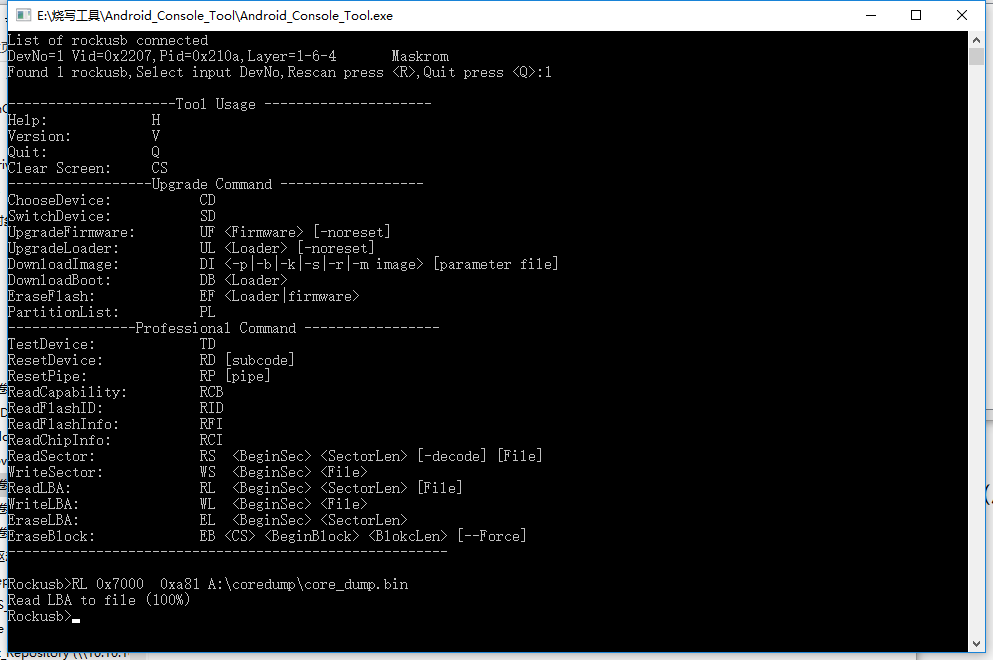
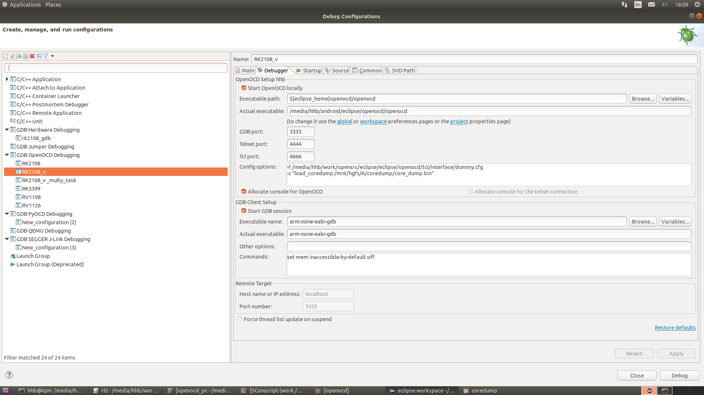
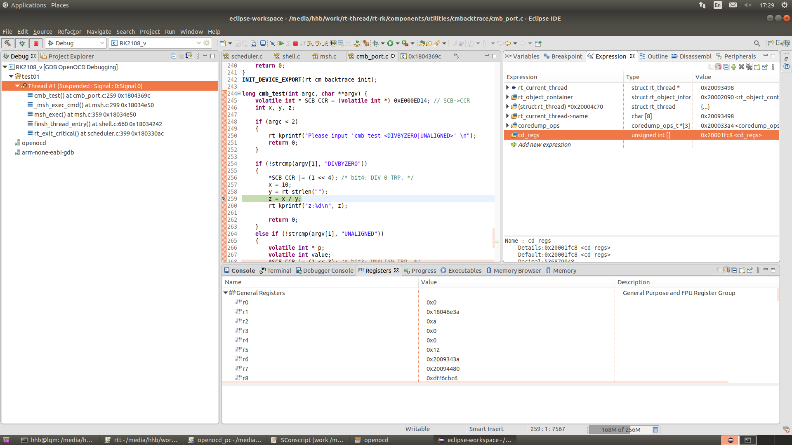

# RTT Coredump简介

文件标识：RK-KF-YF-111

发布版本：V1.1.0

日期：2020-04-15

文件密级：□绝密   □秘密   □内部资料   ■公开

**免责声明**

本文档按“现状”提供，瑞芯微电子股份有限公司（“本公司”，下同）不对本文档的任何陈述、信息和内容的准确性、可靠性、完整性、适销性、特定目的性和非侵权性提供任何明示或暗示的声明或保证。本文档仅作为使用指导的参考。

由于产品版本升级或其他原因，本文档将可能在未经任何通知的情况下，不定期进行更新或修改。

**商标声明**

“Rockchip”、“瑞芯微”、“瑞芯”均为本公司的注册商标，归本公司所有。

本文档可能提及的其他所有注册商标或商标，由其各自拥有者所有。

**版权所有 © 2020 瑞芯微电子股份有限公司**

超越合理使用范畴，非经本公司书面许可，任何单位和个人不得擅自摘抄、复制本文档内容的部分或全部，并不得以任何形式传播。

瑞芯微电子股份有限公司

Rockchip Electronics Co., Ltd.

地址：     福建省福州市铜盘路软件园A区18号

网址：     [www.rock-chips.com](http://www.rock-chips.com)

客户服务电话： +86-4007-700-590

客户服务传真： +86-591-83951833

客户服务邮箱： [fae@rock-chips.com](mailto:fae@rock-chips.com)

---

**前言**

**概述**

​	本文主要介绍coredump相关内容

**产品版本**

| **芯片名称** | **内核版本** |
| ------------ | ------------ |
| RK2108    | RTT     |

**读者对象**

本文档（本指南）主要适用于以下工程师：

技术支持工程师

软件开发工程师

**修订记录**

| **版本号** | **作者** | **修改日期** | **修改说明** |
| ---------- | --------| :--------- | ------------ |
| V1.0.0    | 洪慧斌 | 2020-04-15 | 初始版本     |
| V1.1.0 | 洪慧斌 | 2020-06-22 | 修改公司名称，简化coredump命令 |

---

**目录**

[TOC]

---

## 1 Coredump功能说明

​	针对机器测试无法连接串口等实时获取调试信息的场景。这种情况下，如果机器出现死机，只能重启，但是重启后又看不到有用信息。针对MCU类型的产品，SRAM比较小，可以把整个SRAM空间和指令空间按一定格式保存到文件或者某个分区，然后拷贝到PC上，进行分析。

## 2 代码

```
bsp/rockchip/common/drivers/coredump/drv_coredump.c
bsp/rockchip/common/drivers/coredump/drv_coredump.h
bsp/rockchip/common/drivers/coredump/drv_coredump_flash.c
bsp/rockchip/common/drivers/coredump/drv_coredump_sdcard.c
bsp/rockchip/common/drivers/coredump/drv_coredump_arm.s
bsp/rockchip/common/drivers/coredump/drv_coredump_iar.s
bsp/rockchip/common/drivers/coredump/drv_coredump_gcc.S
```

drv_coredump.c 主要提供结构体定义，coredump文件数据格式，代码框架等。

drv_coredump_flash.c 未经过文件系统，直接保存到flash的实现，比如NOR FALSH。

drv_coredump_sdcard.c 经过文件系统，保存到/sdcard/目录，比如SD卡或者EMMC等存储设备。

## 3 编译配置

```
RT-Thread rockchip common drivers  --->
	RT-Thread rockchip coredump driver  --->
		[*] Enable coredump
		[*] Enable coredump by Sdcard
		[*] Enable coredump by flash
```

如果开发板支持SD卡，可以使能coredump by Sdcard，保存到sd卡，这样比较方便把coredump数据拷出来，如下：

```
core_dump_Thu_Jan_22_05_07_55_2015.bin
```

如果开发板不支持SD卡，只能coredump到flash 某个分区，然后进入loader模式，用工具导出来，如下：

```
RL 0x7000 0xa81 core_dump.bin
```

注意：coredump的条件目前有2种，exception和assert，相对来说assert时系统还算比较正常，所以可以选择coredump到sd卡（基于文件系统）。exception可能问题就比较严重了，一般是直接写flash。

* coredump to sd卡和flash时，assert会coredump到sd卡，exception会coredump到flash。
* coredump to flash only时，exception和assert 都会coredump到flash。

## 4 测试

### 4.1 Windows环境

* 在串口命令行执行coredump命令，触发assert，死机

* 重启设备进入maskrom模式，单独烧写loader，进入loader模式（有些芯片，工具可能还是提示是maskrom，但实际是进入loader模式了）

* 执行Android_Console_Tool.exe

* 根据提示输入1

* 然后输入RL 0x7000 0xa81 A:\coredump\core_dump.bin

  关于RL命令可以参考以下内容：

  以rk2108为例，找到以下文件的breakpad分区配置：

  ```
  bsp/rockchip/rk2108/board/recording_pen/setting.ini

  [UserPart5]
  Name=breakpad
  Type=
  PartOffset=0x7000
  PartSize=
  Flag=0x305
  File=

  RL 起始扇区 扇区数 文件名 (扇区的大小是512字节)
  RL 0x7000 0xa81 core_dump.bin
  ```



* 简单判断core_dump.bin是否有效，开头必须是78 56 34 012


### 4.2 Linux环境

主要介绍如何导出core_dump.bin，其他步骤请参考4.1章节。

```
sudo upgrade_tool db Image/rk2108_db_Loader.bin
sudo upgrade_tool rl 0x7000 0x305 core_dump.bin
```

## 5 解析

ARM MCU ECLIPSE + GDB + OPENOCD + 虚拟适配器 + 虚拟cortex-m设备。

OPENOCD可以支持多种JTAG适配器，如JLINK, FT2232H等，主要负责跟调试板子通讯，但这里的虚拟适配器主要是充数用，因为读取内存数据，cpu寄存器等，可以直接从core_dump.bin获取。虚拟cortex-m设备主要修改了获取内存数据，cpu寄存器值的方式，正常是通过JTAG适配器，现在改为从core_dump.bin获取。



具体配置请参考另一份文档《Rockchip_Developer_Guide_GNU_MCU_Eclipse_OpenOCD.md》，这里需要注意：

```
-r rk_cortex_m4_virt   采用dummy适配器和虚拟设备
-c "load_coredump /mnt/hgfs/A/coredump/core_dump.bin"   指定coredump文件路径，这里依然采用斜杠/
```

配置完成后，连接调试：



