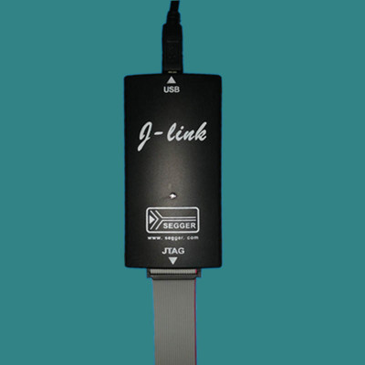
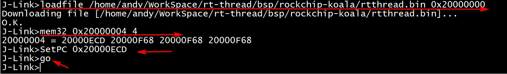
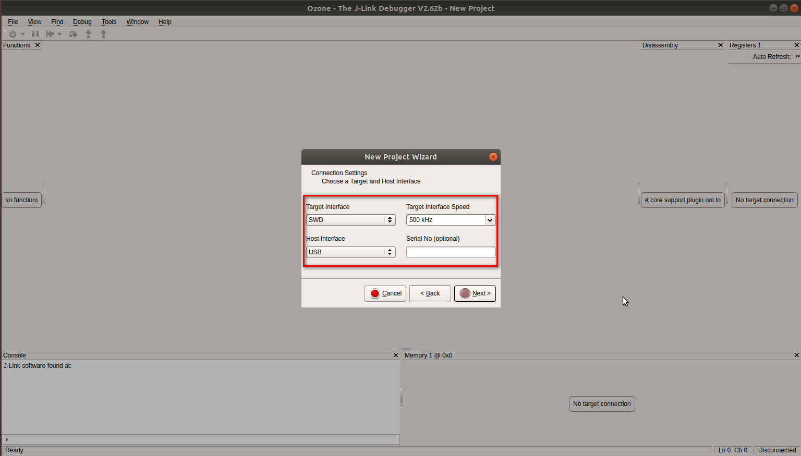
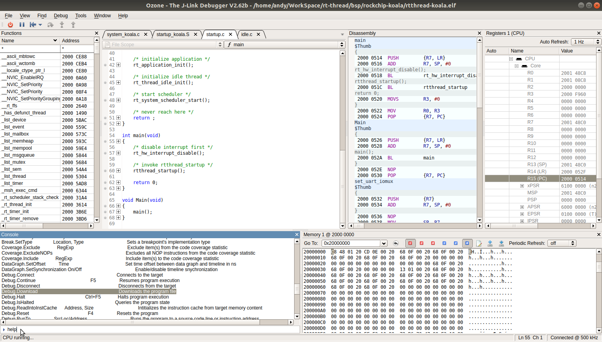
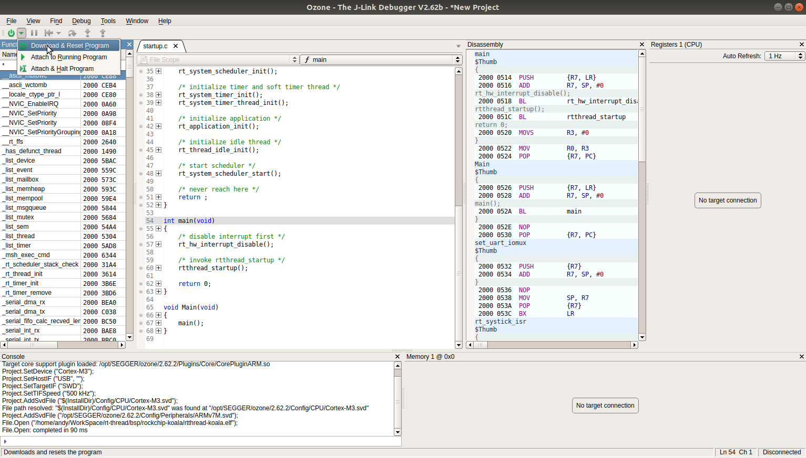
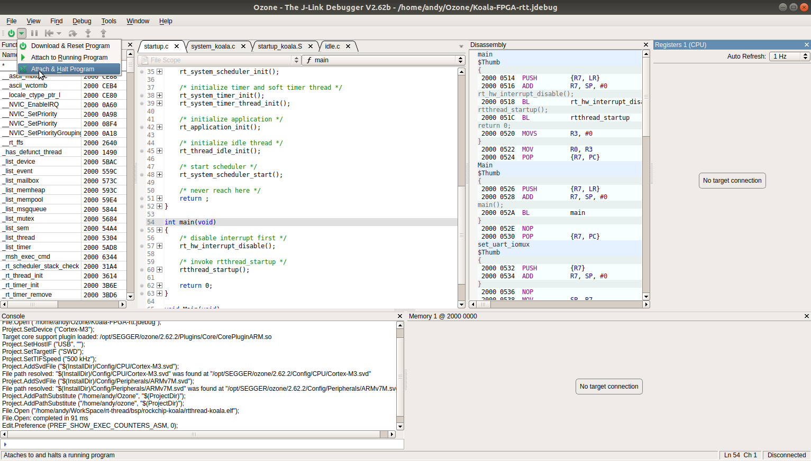

# **J-Link 使用指南**

发布版本：1.0

作者邮箱：andy.yan@rock-chips.com

日期：2019.05

文件密级：公开资料

**读者对象**

本文档（本指南）主要适用于以下工程师：

使用 J-Link 进行 Cortex M 系列芯片开发调试的工程师

**修订记录**

| **日期**   | **版本** | **作者** | **修改说明** |
| ---------- | -------- | -------- | ------------ |
| 2019-05-16 | V1.0     | Andy Yan | 初始版本     |

---
[TOC]
---

## **简介**

J-Link 是德国 [SEGGER](<https://www.segger.com/products/debug-probes/j-link/>) 公司出品的一款 Debug 工具，能够支持 ARM7/9/11，Cortex-M/R/A，RISC-V 等大量嵌入式目标平台，与之配合的 PC 端软件能够运行于 Window/Linux/Mac 等系统上。

J-Link 主要提供两个功能：

1. 程序加载，可以把程序加载到目标平台的 RAM 中，或者下载到 flash 中（需要特定的 flash 烧写算法配合）。
2. 系统跟踪 Debug，可以查看目标平台的运行状态，寄存器，内存数据。

## **J-Link 命令行工具**

SEGGER 提供了跨平台的命令行工具，只要下载安装了 J-Link Software and Documentation Pack 即可使用。

[下载地址](<https://www.segger.com/downloads/jlink/#J-LinkSoftwareAndDocumentationPack>)

命令行工具在 Windows 上叫做 J-Link Commander，在 Linux 上为一个可执行文件 JLinkExe。

* **启动**

在命令行输入 "?" 可以列出所有支持的命令。

* **连接**

  

输入 connect 命令进行连接，然后回车选"SWD"，再回车，可以看到芯片被识别到的信息。

* **加载程序并运行**

  

利用 loadefile 或者 loadbin 命令加载程序，注意要指定加载地址。

由于 Cortex M 芯片的启动代码，最前面放的是向量表，其中第一个 word 放的是堆栈地址，第二个 word 放的是复位程序(Reset_Handler)的入口地址，所以要用 mem32 命令把这个地址读出来，然后用 SetPC 命令把 CPU 运行地址设置到这个位置，利用 go 命令开始执行。

## 与 Ozone 配合

J-Link 在使用的时候，在 PC 端需要有一个上位机软件与之配合。对于使用 Keil，IAR 等 IDE 进行代码开发的情况，这两个软件已经提供了从代码编写，编译到下载，调试跟踪的完整功能。但是这些 IDE 在 Debug 上有个限制，即 Debug 无法和代码编译独立，如果你的代码是使用其他工具编译的(比如 GCC)，或者当你面对一个要进行调试分析的目标板，你的电脑上没有这个待调试平台的源码，你只是想连上 J-Link 然后加载符号表进行调试分析，这些 IDE 都无法满足。在这里我们推荐使用[Ozone](https://www.segger.com/products/development-tools/ozone-j-link-debugger/)，它可以很好的满足这些要求。

Ozone 是 SEGGER 推出的与 J-Link 配合的 Debug 和性能分析工具，跨平台(Windows/Linux/Mac)，安装包大小只有 20M 左右，提供的功能却很完善，小巧而强大。

* **启动**

Device：根据目标板芯片的内核选择，Cortex-M3/Cortex-M4

Peripherals：根据目标板芯片进行选择对应的 svd 文件，其实这个文件是可以定制的，我们可以根据具体芯片设计，把其他片上外设而已加进去。

* **J-Link 设置**

Target Interface：我们芯片的 JTAG 口一般都用两线模式，所以选 SWD

Target Interface Speed：先选一个比较低的速度，连接成功后，会自动调整到一个较高的速度。

Host Interface： 一般 J-Link 和 PC 通过 USB 连接，所以选 USB。

Serial No：这个是在 PC 连接了多个 J-Link 的情况下用的，一般这里不用选。

* **选择待调试的程序**

  

 这里我们一般选择 ELF 格式的符号表。

* **进入主界面**

  

左上角电源标识形状的那个是 Debug 开关按钮

A：函数列表

B：源码，如果根据符号表里面的的信息能在当前电脑上找到源码的位置就会加载

C： 汇编

D：J-Link 连上后会显示寄存器信息

E：console log

F：J-Link 连上后可以 dump 内存

H：这个是可以输入命令的控制台，虽然空间小，但是可以定制很多功能。

* **命令行**

输入 help 可以看到支持的各种命令

* **程序下载运行**

选择 Download & Reset Program，Ozone 会解析 elf 文件中的程序运行地址并将其加载到内存中对应的位置，并跳过去开始执行，然后默认停在 main 函数的入口。然后可以控制单步执行或者设置断点。

* **从程序入口开始单步执行**

有时候我们需要跟踪 Debug main 函数之前的代码，这时候需要程序加载后停止在入口处，Ozone 似乎没有提供一个按钮来实现这个功能，不过可以通过命令来实现。

以 Attach & Halt Program 的模式连接：

在命令行窗口执行 Debug.Download 命令：

这时候系统会停在代码入口处，然后可以单步运行 Debug。

* 指定源码文件路径

很多开发者习惯在 Linux 环境下编译代码，然后在 Windows 环境下调试，或者调试运行的 ELF 文件是另外一个开发者编译的，这时候 Ozone 根据 ELF 文件中获取的路径信息就无法找到代码对应的源码文件。

如图所示，该 ELF 文件是在 Linux 系统 /home/tzb/inner_projects/rt-thread 目录下编译的，但是这时候 Ozone 运行于 Windows 系统上，自然就无法找到对应的源文件。Ozone 提供了 Project.AddPathSubstitute 命令来解决这个问题。假如现在通过 Samba 服务把 Linux 系统下的 rt-thread 源码目录映射到 Windows 下的 Z:\rt-thread，则可以通过如下命令设置源码路径：`Project.AddPathSubstitute  /home/tzb/inner_projects/ Z:/` 。

如果替换的路径固定，也可以考虑把这个路径写到脚本里面，避免每次都要输入命令。

## **总结**

J-Link 还提供了很多其他功能，比如可以配合 GDB 使用，Ozone 也包含了丰富的功能，甚至可以定制各种脚本。请大家在使用的过程中参考他们的使用手册：

* 《J-Link Manual》
* 《Ozone User Manual》

