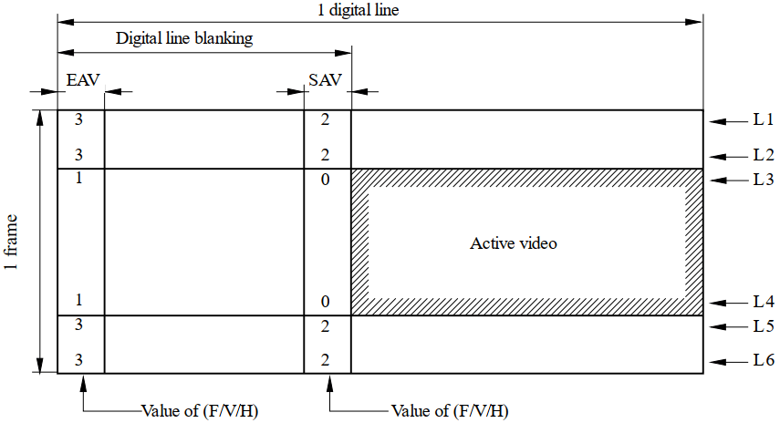
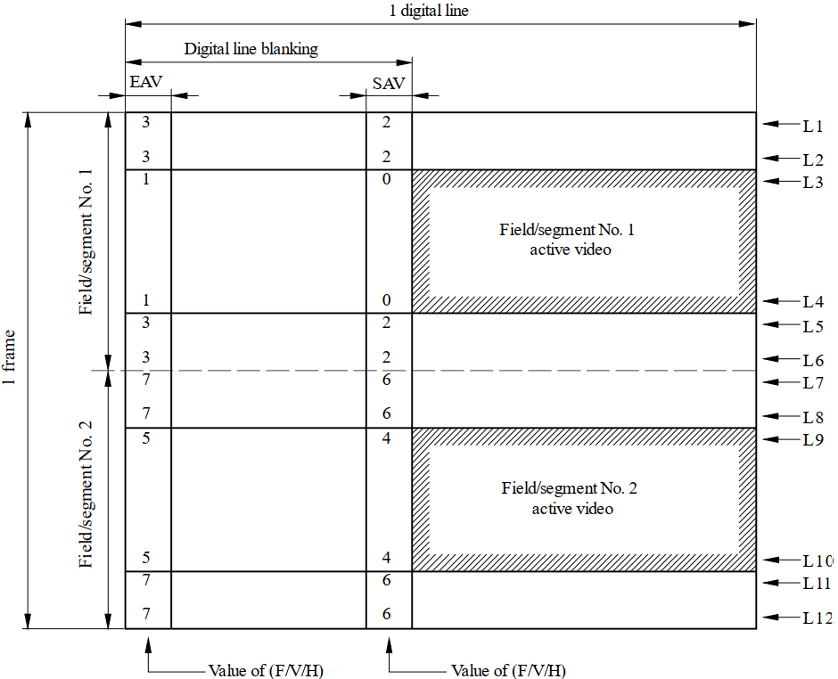
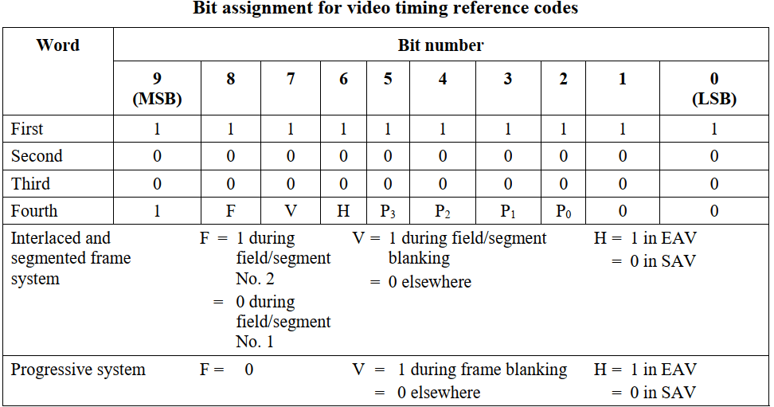
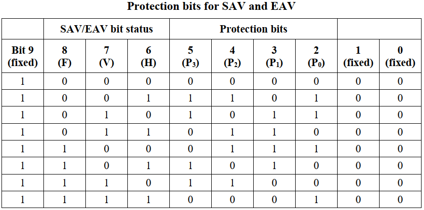
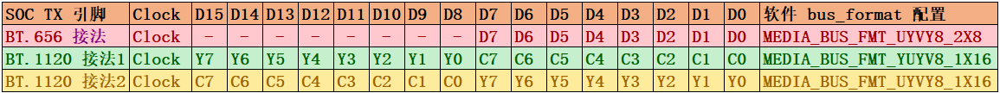

# Rockchip BT.656 TX 和 BT.1120 TX 开发指南

文件标识：RK-YH-YF-178

发布版本：V1.0.0

日期：2021-4-30

文件密级：□绝密   □秘密   □内部资料   ■公开

**免责声明**

本文档按“现状”提供，瑞芯微电子股份有限公司（“本公司”，下同）不对本文档的任何陈述、信息和内容的准确性、可靠性、完整性、适销性、特定目的性和非侵权性提供任何明示或暗示的声明或保证。本文档仅作为使用指导的参考。

由于产品版本升级或其他原因，本文档将可能在未经任何通知的情况下，不定期进行更新或修改。

**商标声明**

“Rockchip”、“瑞芯微”、“瑞芯”均为本公司的注册商标，归本公司所有。

本文档可能提及的其他所有注册商标或商标，由其各自拥有者所有。

**版权所有 © 2021 瑞芯微电子股份有限公司**

超越合理使用范畴，非经本公司书面许可，任何单位和个人不得擅自摘抄、复制本文档内容的部分或全部，并不得以任何形式传播。

瑞芯微电子股份有限公司

Rockchip Electronics Co., Ltd.

地址：     福建省福州市铜盘路软件园A区18号

网址：     [www.rock-chips.com](http://www.rock-chips.com)

客户服务电话： +86-4007-700-590

客户服务传真： +86-591-83951833

客户服务邮箱： [fae@rock-chips.com](mailto:fae@rock-chips.com)

---

**前言**

文本主要介绍 ROCKCHIP 平台 BT.656 BT.1120 接口调试指南

**产品版本**

| **芯片名称**         | **内核版本**      |
| -------------------- | ----------------- |
| RV1109/RV1126/RK356X | Linux kernel 4.19 |

**读者对象**

本文档（本指南）主要适用于以下工程师：

技术支持工程师

软件开发工程师

硬件开发工程师

**修订记录**

| **版本号** | **作者** | **修改日期** | **修改说明**             |
| ---------- | -------- | ------------ | ------------------------ |
| V1.0.0     | 黄家钗   | 2021-04-30 | 初始版本               |

---

**目录**

[TOC]

---

## 基础概念

BT.656 和 BT.1120 分别定义了 SDTV 和 HDTV 的接口协议，通过在消隐期传输 EAV、SAV 的定位基准码作为嵌入式同步信号，传输的数据格式为 YCbCr 4 : 2 : 2。BT.656 和 BT.1120 在一些文档和手册上也会被称为视频信号或者 YUV 信号，目前 RK 平台输出的 BT.656/BT.1120 图像数据和定位基准码的位深均为 8bit。

下面介绍一些 BT.656 和 BT.1120 的基础概念和协议，详细的信息可以参考文档《Rec. ITU-R BT.1120》和《Rec. ITU-R BT.656》。

### P 制扫描时序



### I 制扫描时序



### 定位基准码



地位基准码前三个 word 固定为：0xFF, 0x00, 0x00，第四个 word 由不同的扫描位置决定：

- Bit9: 固定为1

- Bit8(F)：F=0 表示为偶场，F=1 表示为奇场

- Bit7(V)：V=0 表示该行包含有效视频数据，V=1 表示该行没有有效视频数据

- Bit6(H)：H=0 表示为 SAV，H=1 表示为 EAV

- Bit[5, 2] (P3,P2,P1,P0)：由 Bit8～Bit6 计算得来，其中：

  Bit5 = V XOR H

  Bit4 = F XOR H

  Bit3 = F XOR V

  Bit2 = F XOR V XOR H

- Bit[1, 0]: 固定为0，对于 RK 平台，位深为 8 BIT，可以认为没有这 2 个 Bit;

下面的表格根据不同的 EAV/SAV (F,V,H) 算好了对应的保护位的值(P3,P2,P1,P0):



结合以上信息，可以得到各个消隐期对应的定位基准码为：

| EAV  | CODE                | SAV  | CODE                |
| ---- | ------------------- | ---- | ------------------- |
| 1    | 0XFF 0X00 0X00 0X9D | 0    | 0XFF 0X00 0X00 0X80 |
| 3    | 0XFF 0X00 0X00 0XB2 | 2    | 0XFF 0X00 0X00 0XAB |
| 5    | 0XFF 0X00 0X00 0XDA | 4    | 0XFF 0X00 0X00 0XC7 |
| 7    | 0XFF 0X00 0X00 0XF1 | 6    | 0XFF 0X00 0X00 0XEC |

## RK 平台支持的情况

| **SOC 平台** | **是否支持 BT.656** | **是否支持 BT.1120** | **隔行或者逐行**     |
| ---------- | -------- | ------------ | ------------------------ |
| RV1109/RV1126 | N | Y | 只支持**逐行**扫描  |
| RK3566/RK3568 | Y | Y | 支持**逐行**和**隔行**扫描 |

## 硬件连接

BT.656 和 BT.1120 支持以下三种硬件连接，根据不同的连接方式软件在 DTS 文件或者对应的转换芯片驱动中要对 bus_format 做对应的适配。



## 软件配置

### 打开 BT.656/BT.1120

1. 对接的设备在发送端不需要软件驱动(即不需要注册 DRM connector 的)，这种可以在 dts 文件中的 panel 节点配置:

```c
panel {
	……
	bus-format = MEDIA_BUS_FMT_YUYV8_1X16; //or MEDIA_BUS_FMT_YUYV8_1X16/MEDIA_BUS_FMT_UYVY8_1X16
	……
}
```

2. 对接的设备在发送端需要软件驱动(即需要注册 DRM connector 的)，这种除了可以参考第一点在 dts 中适配，也可以考虑在对应 connector 驱动的 drm_connector_helper_funcs -> get_modes  函数中设定，可以参考 drivers/gpu/drm/bridge/sii902x.c 中的实现：

```c
static int sii902x_get_modes(struct drm_connector *connector)
{
	u32 bus_format = MEDIA_BUS_FMT_YUYV8_1X16;//depend on hardware
	……
	drm_display_info_set_bus_formats(&connector->display_info, &bus_format, 1);
	……
}
```

通过第1/2 点对 bus_format 的配置， VOP 驱动会使能 BT.656/BT.1120，同时配置对应的引脚映射关系。

### 时序配置

时序的配置有以下三种方法：

1. DTS 中配置

对于支持固定的分辨率的产品，可以在 DTS panel中配置好对应的时序：

- P 制时序

```c
timing_1080p: timing-1080p {
	clock-frequency = <148500000>;
	hactive = <1920>;
	vactive = <1080>;
	hback-porch = <100>;
	hfront-porch = <200>;
	vback-porch = <10>;
	vfront-porch = <10>;
	hsync-len = <20>;
	vsync-len = <20>;
	hsync-active = <0>;
	vsync-active = <0>;
	de-active = <0>;
	pixelclk-active = <0>;
};
```

- I 制时序

```c
timing_ntsc: timing-ntsc {
	clock-frequency = <13500000>;
	hactive = <720>;
	vactive = <480>;
	hback-porch = <43>;
	hfront-porch = <33>;
	vback-porch = <36>;
	vfront-porch = <3>;
	hsync-len = <62>;
	vsync-len = <6>;
	hsync-active = <0>;
	vsync-active = <0>;
	de-active = <0>;
	pixelclk-active = <0>;
	interlaced;
	doubleclk; //only NTSC(480i60) mode and PAL(576i50) mode need this property
};
```

2. 读 EDID

对于显示设备支持多个分辨率输入同时有 EDID 信息的，可以参考 sii902x 的驱动，通过 DDC/I2C 读取 EDID 信息获取显示设备支持的分辨率：

```c
//dts
&i2c3 {
	clock-frequency = <400000>;
	status = "okay";
	sii9022: sii9022@39 {
		compatible = "sil,sii9022";
		reg = <0x39>;
		pinctrl-names = "default";
		……
		ports {
			#address-cells = <1>;
			#size-cells = <0>;
			port@0 {
				reg = <0>;
				sii9022_in_rgb: endpoint {
					remote-endpoint = <&rgb_out_sii9022>;
				};
			};
		};
	};
};

&rgb {
	status = "okay";
	……
	ports {
		port@1 {
			reg = <1>;
			#address-cells = <1>;
			#size-cells = <0>;

			rgb_out_sii9022: endpoint@0 {
				reg = <0>;
				remote-endpoint = <&sii9022_in_rgb>;
			};
		};
	};
};

//drivers/gpu/drm/bridge/sii902x.c
static int sii902x_probe(struct i2c_client *client, const struct i2c_device_id *id)
{
	……
	i2c_set_clientdata(client, sii902x);
	sii902x->i2cmux =
	i2c_mux_alloc(client->adapter, dev, 1, 0, I2C_MUX_GATE, sii902x_i2c_bypass_select, sii902x_i2c_bypass_deselect);
	if (!sii902x->i2cmux)
		return -ENOMEM;
	sii902x->i2cmux->priv = sii902x;
	return i2c_mux_add_adapter(sii902x->i2cmux, 0, 0, 0);
	……
}

static int sii902x_get_modes(struct drm_connector *connector)
{
	struct sii902x *sii902x = connector_to_sii902x(connector);

	edid = drm_get_edid(connector, sii902x->i2cmux->adapter[0]);
	drm_connector_update_edid_property(connector, edid);
	if (edid) {
		if (drm_detect_hdmi_monitor(edid))
			output_mode = SII902X_SYS_CTRL_OUTPUT_HDMI;
		num = drm_add_edid_modes(connector, edid);
		kfree(edid);
	}
}
```

3. connector 驱动中写好

这种一般是在调试过程中为了方便或者没有I2C/DDC 通道读取EDID信息但是又需要支持多个分辨率的，可以直接在 connector 驱动中写好对应的分辨率，可以参考 sii902x.c 驱动中的实现：

```c
static int sii902x_get_modes(struct drm_connector *connector)
{
	struct sii902x *sii902x = connector_to_sii902x(connector);

	……
	for (i = 0; i < ARRAY_SIZE(sii902x_default_modes); i++) {
		const struct drm_display_mode *ptr = &sii902x_default_modes[i];

		mode = drm_mode_duplicate(connector->dev, ptr);
		if (mode) {
			if (!i)
				mode->type = DRM_MODE_TYPE_PREFERRED;
			drm_mode_probed_add(connector, mode);
			ret++;
		}
	}
	……
}
```

## 常见问题

1. BT.656 和 BT.1120 输出的是 Full range 还是 Limite range

   **答**：Limit range，即有效图像数据范围是 [16，235]， 只有定位基准码才可能出现 0xFF, 0x00 的数据。

2. 怎么确认此时主控已经被配置为 BT.656 和 BT.1120 输出

   **答**：通过  cat /sys/kernel/debug/dri/0/summary  可以看到对应 VOP/VP 节点下的 bus_format 值，和本文第3点中的表格对应；

```shell
cat /sys/kernel/debug/dri/0/summary
	Video Port0: ACTIVE
	……
	bus_format[2025]: YUV8_1X24
	……
```

3. RK 平台输出的 BT.656 和 BT.1120 信号是标准的吗？

   **答**：是的，基于《Rec. ITU-R BT.656》和《Rec. ITU-R BT.1120》标准设计。

4. 单沿触发还是双沿触发

   **答**：单沿触发，默认配置 clock 的上升沿在数据中间，如果接收端希望下降沿在数据中间，可以将 dts 中的 pixelclk-active 设定为1。

5. dts 配置可以参考哪些文件

   **答**：可以参考下面这两个配置文件：

   BT.656： arch/arm64/boot/dts/rockchip/rk3568-evb6-ddr3-v10-rk630-bt656-to-cvbs.dts

   BT.1120: arch/arm64/boot/dts/rockchip/rk3568-evb2-lp4x-v10-bt1120-to-hdmi.dts

6. 第三方转换芯片如何驱动

   **答**：分以下两种情况：

- 如果第三方转换芯片不需要单独配置寄存器，只需要上电就能正常使用的，这种只要在 dts  文件的 panel 节点中配置要对应的 GPIO、电源，确保转换芯片有正常供电，不需要编写额外的驱动，rockchip_rgb.c  文件会完成向 DRM 驱动框架注册 encoder 和 connector。
- 如果第三方转换芯片需要单独配置寄存器，这种除了要在 dts 中正确配置 GPIO、电源，确保转换芯片有正常供电外，还需要编写转换芯片对应的驱动，此时 rockchip_rgb.c 会完成向 DRM 驱动框架注册 encoder，转换芯片的驱动完成向 DRM 驱动框架注册 connector，并通过 DRM bridge 桥接起来，具体可以参考内核代码：drivers/gpu/drm/bridge/sii902x.c  中的实现。

7. RK628 中 BT.1120 如何使用

   **答**：RK628 BT.1120 的使用方法请参考文档《Rockchip_DRM_RK628_Porting_Guide_CN》中的说明。

8. 和 Camera 的 BT.656/BT.1120 是什么关系

   **答**：这边介绍的是 BT.656 TX 和 BT.1120 TX，是一种并行输出接口，而 Camera 对应的是 BT.656 RX 和 BT.1120 RX，是一种并行输入接口，两则在协议上是一致的，有关 BT.656 RX 和 BT.1120 RX 的开发文档，请从我司 FAE 窗口/ ISP 部门获取。

9. BT.656/BT.1120 和 VOP 什么关系

   **答**：BT.656 和 BT.1120 是一种嵌入式同步信号的并行输出接口，VOP 将多个图层[多块 buffer] 合成好的数据通过 BT.656/BT.1120 输出。

10. BT.656/BT.1120 和 RGB 什么关系

    **答**：BT.656 和 BT.1120 是嵌入式同步信号的并行输出接口，RGB 是有独立同步信号 [HSYNC/VSYNC/DEN] 的并行输出接口，他们都是独立的显示接口，在显示通路上没有直接关系，可能在 IO 上有复用关系。