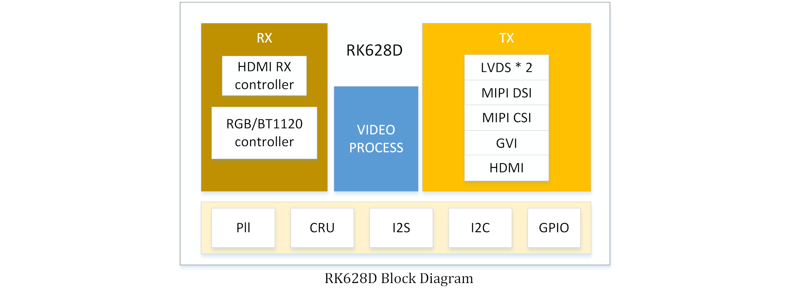
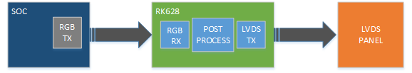
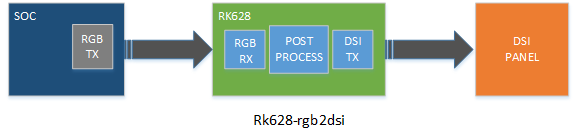
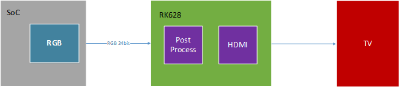
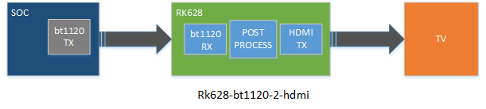
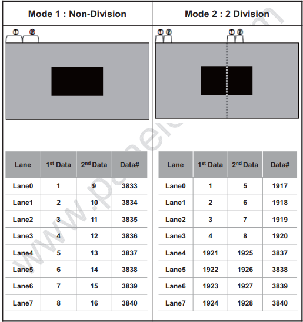
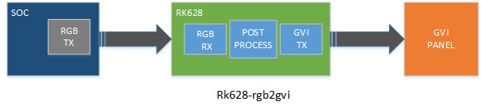

# Rockchip DRM RK628 Porting Guide

文件标识：RK-YH-YF-276

发布版本：V1.5.0

日期：2020-12-09

文件密级：□绝密   □秘密   □内部资料   ■公开

**免责声明**

本文档按“现状”提供，瑞芯微电子股份有限公司（“本公司”，下同）不对本文档的任何陈述、信息和内容的准确性、可靠性、完整性、适销性、特定目的性和非侵权性提供任何明示或暗示的声明或保证。本文档仅作为使用指导的参考。

由于产品版本升级或其他原因，本文档将可能在未经任何通知的情况下，不定期进行更新或修改。

**商标声明**

“Rockchip”、“瑞芯微”、“瑞芯”均为本公司的注册商标，归本公司所有。

本文档可能提及的其他所有注册商标或商标，由其各自拥有者所有。

**版权所有 © 2020 瑞芯微电子股份有限公司**

超越合理使用范畴，非经本公司书面许可，任何单位和个人不得擅自摘抄、复制本文档内容的部分或全部，并不得以任何形式传播。

瑞芯微电子股份有限公司

Rockchip Electronics Co., Ltd.

地址：     福建省福州市铜盘路软件园A区18号

网址：     [www.rock-chips.com](http://www.rock-chips.com)

客户服务电话： +86-4007-700-590

客户服务传真： +86-591-83951833

客户服务邮箱： [fae@rock-chips.com](mailto:fae@rock-chips.com)

---

**前言**

文本主要介绍 RK628 的使用与调试方法。

**读者对象**

本文档（本指南）主要适用于以下工程师：

技术支持工程师

软件开发工程师

**修订记录**

| **版本号** | **作者** | **修改日期** | **修改说明**             |
| ---------- | -------- | ------------ | ------------------------ |
| V1.0.0     | 闭伟勇   | 2020-12-01   | 初始发布                 |
| V1.1.0     | 陈顺庆   | 2020-12-02   | 补充Post-Process和HDMITX |
| V1.2.0     | 黄国椿   | 2020-12-02   | 补充rk628_bt1120_rx      |
| V1.3.0     | 操瑞杰   | 2020-12-02   | 补充 HDMIRX              |
| V1.4.0     | 黄家钗   | 2020-12-04   | 补充 GVI                 |
| V1.5.0     | 温定贤   | 2020-12-09   | 补充 HDMI to MIPI CSI应用场景说明 |

---

**目录**

[TOC]

---

## Introduction

本文档主要描述多功能转换芯片RK628的软件配置方法以及调试手段，具体功能描述参考datasheet。



配置项：

```
CONFIG_MFD_RK628=y
CONFIG_DRM_ROCKCHIP_RK628=y
CONFIG_VIDEO_RK628CSI=y
```

驱动：

```
drivers/mfd/rk628.c
drivers/clk/rockchip/regmap/clk-rk628.c
drivers/pinctrl/pinctrl-rk628.c
drivers/gpu/drm/rockchip/rk628/*
drivers/media/i2c/rk628_csi.c
```

设备树：

```
arch/arm/boot/dts/rk3288-evb-rk628.dtsi
arch/arm/boot/dts/rk3288-evb-rk628-hdmi2gvi-avb.dtb
arch/arm/boot/dts/rk3288-evb-rk628-hdmi2gvi-avb.dts
arch/arm/boot/dts/rk3288-evb-rk628-rgb2dsi-avb.dtb
arch/arm/boot/dts/rk3288-evb-rk628-rgb2dsi-avb.dts
arch/arm/boot/dts/rk3288-evb-rk628-rgb2gvi-avb.dts
arch/arm/boot/dts/rk3288-evb-rk628-rgb2hdmi-avb.dtb
arch/arm/boot/dts/rk3288-evb-rk628-rgb2hdmi-avb.dts
arch/arm/boot/dts/rk3288-evb-rk628-rgb2lvds-avb.dts
arch/arm/boot/dts/rk3288-evb-rk628-rgb2lvds-dual-avb.dts
arch/arm/boot/dts/rk3288-evb-rk628-hdmi2csi-avb.dts
```

## Core

1. arch/arm/boot/dts/rk628.dtsi 包含 RK628 相关模块的基础配置，一般不需要更改，只需要在板级 dts 中包含该 dtsi。

2. arch/arm/boot/dts/rk3288-evb-rk628.dtsi 包含特定板级配置，需要根据硬件设计配置 RK628 相关控制 IO，并且包含 rk628.dtsi。

   ```
   &i2c1 {
           clock-frequency = <400000>;
           status = "okay";

           rk628: rk628@50 {
                   reg = <0x50>;
                   interrupt-parent = <&gpio7>;
                   interrupts = <15 IRQ_TYPE_LEVEL_HIGH>;
                   enable-gpios = <&gpio5 RK_PC2 GPIO_ACTIVE_HIGH>;
                   reset-gpios = <&gpio7 RK_PB6 GPIO_ACTIVE_LOW>;
                   status = "okay";
           };
   };
   ```

## Input

### RGB

注意：rk3288-android7.1 和 rk3288-android8.1 对应的内核基线 RGB 功能在 dts 中是以 lvds 的节点来描述，
在这两个 SDK kernel 中没有关于 rk628 应用方案的配置 dts，可以参考如下相关 dts 配置：
RKDocs/PATCHES/patch_rk628_dts_for_rk3288_android8.0.tar.gz

```
&rgb {
        status = "okay";

        ports {
                port@1 {
                        reg = <1>;

                        rgb_out_post_process: endpoint {
                                remote-endpoint = <&post_process_in_rgb>;
                        };
                };
        };
};

&video_phy {
        status = "okay";
};

&rgb_in_vopb {
        status = "disabled";
};

&rgb_in_vopl {
        status = "okay";
};
```

### BT1120

arch/arm64/boot/dts/rockchip/rk3568-evb6-ddr3-v10-rk628-bt1120-to-hdmi.dts

```
&rgb {
	status = "okay";
	pinctrl-names = "default";
	pinctrl-0 = <&bt1120_pins>;

	ports {
		port@1 {
			reg = <1>;

			rgb_out_bt1120: endpoint {
				remote-endpoint = <&bt1120_in_rgb>;
			};
		};
	};
};

&rk628_bt1120_rx {
	status = "okay";

	ports {
		#address-cells = <1>;
		#size-cells = <0>;

		port@0 {
			reg = <0>;

			bt1120_in_rgb: endpoint {
				remote-endpoint = <&rgb_out_bt1120>;
			};
		};

		port@1 {
			reg = <1>;

			bt1120_out_post_process: endpoint {
				remote-endpoint = <&post_process_in_bt1120>;
			};
		};
	};
};

&rgb_in_vp2 {
	status = "okay";
};
```

### HDMIRX

HDMIRX 目前支持以下输入源格式：

- 3840X2160-60Hz(YUV420-8BIT）
- 3840X2160-30Hz(RGB-8BIT)
- 1920X1080-60Hz(RGB-8BIT)
- 1280X720-60Hz(RGB-8BIT)
- 720X576-60Hz(RGB-8BIT)
- 720X480-60Hz(RGB-8BIT)

#### HDMIRX 板级直连模式

DTS 配置如下，以 HDMI2GVI 为例：

```
&hdmi {
	status = "okay";

	ports {
		#address-cells = <1>;
		#size-cells = <0>;
		port@1 {
			reg = <1>;

			hdmi_out_hdmirx: endpoint {
				remote-endpoint = <&hdmirx_in_hdmi>;
			};
		};
	};
};

&panel {
	compatible = "simple-panel";
	……
	status = "okay";

	display-timings {
		native-mode = <&timing>;

		timing: timing {
		……
		};
	};

	port {
		panel_in_gvi: endpoint {
			remote-endpoint = <&gvi_out_panel>;
		};
	};
};

&rk628_gvi {
	pinctrl-names = "default";
	pinctrl-0 = <&gvi_hpd_pins>, <&gvi_lock_pins>;
	status = "okay";
	rockchip,lane-num = <8>;
	/* rockchip,division-mode; */

	ports {
		#address-cells = <1>;
		#size-cells = <0>;

		port@0 {
			reg = <0>;

			gvi_in_post_process: endpoint {
				remote-endpoint = <&post_process_out_gvi>;
			};
		};

		port@1 {
			reg = <1>;

			gvi_out_panel: endpoint {
				remote-endpoint = <&panel_in_gvi>;
			};
		};
	};
};

&rk628_combtxphy {
	status = "okay";
};

&rk628_post_process {
	status = "okay";

	ports {
		#address-cells = <1>;
		#size-cells = <0>;

		port@0 {
			reg = <0>;

			post_process_in_hdmirx: endpoint {
				remote-endpoint = <&hdmirx_out_post_process>;
			};
		};


		port@1 {
			reg = <1>;

			post_process_out_gvi: endpoint {
				remote-endpoint = <&gvi_in_post_process>;
			};
		};
	};
};

&rk628_combrxphy {
	status = "okay";
};

&rk628_hdmirx {
	status = "okay";

	ports {
		#address-cells = <1>;
		#size-cells = <0>;

		port@0 {
			reg = <0>;

			hdmirx_in_hdmi: endpoint {
				remote-endpoint = <&hdmi_out_hdmirx>;
			};
		};
		port@1 {
			reg = <1>;

			hdmirx_out_post_process: endpoint {
				remote-endpoint = <&post_process_in_hdmirx>;
			};
		};
	};
};

&hdmi_in_vopl {
	status = "disabled";
};

&hdmi_in_vopb {
	status = "okay";
};
```

**注意事项**

由于 HDMIRX 最大值支持 4K-60Hz-YUV420，所以当需要输出 4K-60Hz 分辨率时，需要强制限制输入源为 YUV420 颜色格式。必须在输出端限制输入源最大的 TMDS CLK 以及允许 YUV420 格式输出。

以 HDMI2GVI 为例，需要以下修改：

```diff
--- a/drivers/gpu/drm/rockchip/rk628/rk628_gvi.c
+++ b/drivers/gpu/drm/rockchip/rk628/rk628_gvi.c
@@ -312,7 +312,8 @@ static int rk628_gvi_connector_get_modes(struct drm_connector *connector)
        info->edid_hdmi_dc_modes = 0;
        info->hdmi.y420_dc_modes = 0;
        info->color_formats = 0;
-       info->max_tmds_clock = 600000;
+       info->max_tmds_clock = 300000;
+       connector->ycbcr_420_allowed = true;
```

#### HDMIRX线缆连接模式

HDMIRX线缆连接模式用于HDMIRX to MIPI CSI接口转换，适用于HDMI IN应用场景，支持热拔插、动态分辨率切换等功能。

目前支持以下分辨率，可根据具体项目需求在驱动中继续增加：

- 3840X2160-30Hz(RGB-8BIT/YUV422-8BIT)

- 1920X1080-60Hz(RGB-8BIT/YUV422-8BIT)

- 1280X720-60Hz(RGB-8BIT/YUV422-8BIT)

- 720X576-50Hz(RGB-8BIT/YUV422-8BIT)

- 720X480-60Hz(RGB-8BIT/YUV422-8BIT)

## Output

### Post-Process

如图 1-1所示，输入数据需要经过 Post Process 做缩放或是bypass，然后送到各显示接口，所以 dts 必须要配置 rk628_post_process 桥接 RGB 或是 HDMIRX。

以 RGB 为例：

```
&rgb {
        status = "okay";

        ports {
                port@1 {
                        reg = <1>;

                        rgb_out_post_process: endpoint {
                                remote-endpoint = <&post_process_in_rgb>;
                        };
                };
        };
};

&rk628_post_process {
        pinctrl-names = "default";
        pinctrl-0 = <&vop_pins>;
        status = "okay";

        ports {
                #address-cells = <1>;
                #size-cells = <0>;

                port@0 {
                        reg = <0>;

                        post_process_in_rgb: endpoint {
                                remote-endpoint = <&rgb_out_post_process>;
                        };
                };
        };
};
```

#### Scaler

以 RGB(1080p)-> GVI(4K) 为例，因为 RGB 无法输出4K，所以只能经过 Scaler 做缩放。

因为 GVI 只添加了 4K 的分辨率，在上层 modes 列表中会有 4K 分辨率，但是希望上层设置 1080P(源分辨率) 下来，在 Post Process 再放大到 4K(目标分辨率)，所以需要在 Post Process 添加一个源分辨率，配置如下：

```diff
&rk628_post_process {
	pinctrl-names = "default";
	pinctrl-0 = <&vop_pins>;
	status = "okay";

	ports {
		#address-cells = <1>;
		#size-cells = <0>;

		port@0 {
			reg = <0>;

			post_process_in_rgb: endpoint {
				remote-endpoint = <&rgb_out_post_process>;
			};
		};

		port@1 {
			reg = <1>;

			post_process_out_hdmi: endpoint {
				remote-endpoint = <&hdmi_in_post_process>;
			};
		};
	};
+
+	display-timings {
+		native-mode = <&timing0>;
+
+		timing0: timing0 {
+			clock-frequency = <148500000>;
+			hactive = <1920>;
+			vactive = <1080>;
+			hback-porch = <148>;
+			hfront-porch = <88>;
+			vback-porch = <36>;
+			vfront-porch = <4>;
+			hsync-len = <44>;
+			vsync-len = <5>;
+			hsync-active = <0>;
+			vsync-active = <0>;
+			de-active = <0>;
+			pixelclk-active = <0>;
+		};
+	};
};
```

#### 极性配置

```diff
&rk628_post_process {
        pinctrl-names = "default";
        pinctrl-0 = <&vop_pins>;
        status = "okay";

+		mode-sync-pol = <0>;
        ports {
                #address-cells = <1>;
                #size-cells = <0>;

                port@0 {
                        reg = <0>;

                        post_process_in_rgb: endpoint {
                                remote-endpoint = <&rgb_out_post_process>;
                        };
                };

                port@1 {
                        reg = <1>;

                        post_process_out_hdmi: endpoint {
                                remote-endpoint = <&hdmi_in_post_process>;
                        };
                };
        };
};
```

mode-sync-pol 做为一种规避方法而添加的属性，一般情况不需要配置，只有像 RK3568 RGB 和 LVDS 同时输出的时候，极性没有办法配置，只能输出 DRM_MODE_FLAG_NHSYNC/DRM_MODE_FLAG_NVSYNC 的情况下，通过配置 Post Process 的 mode-sync-pol 为 0，来适配前级的极性。

### LVDS

#### RGB2LVDS



##### Single LVDS

arch/arm/boot/dts/rk3288-evb-rk628-rgb2lvds-avb.dts

```
&rk628_post_process {
        pinctrl-names = "default";
        pinctrl-0 = <&vop_pins>;
        status = "okay";

        ports {
                #address-cells = <1>;
                #size-cells = <0>;

                port@0 {
                        reg = <0>;

                        post_process_in_rgb: endpoint {
                                remote-endpoint = <&rgb_out_post_process>;
                        };
                };

                port@1 {
                        reg = <1>;

                        post_process_out_lvds: endpoint {
                                remote-endpoint = <&lvds_in_post_process>;
                        };
                };
        };
};
```

```
&rk628_lvds {
        status = "okay";

        ports {
                #address-cells = <1>;
                #size-cells = <0>;

                port@0 {
                        reg = <0>;

                        lvds_in_post_process: endpoint {
                                remote-endpoint = <&post_process_out_lvds>;
                        };
                };

                port@1 {
                        reg = <1>;

                        lvds_out_panel: endpoint {
                                remote-endpoint = <&panel_in_lvds>;
                        };
                };
        };
};

&rk628_combtxphy {
        status = "okay";
};
```

```
/ {
        panel {
                compatible = "simple-panel";
                backlight = <&backlight>;
                enable-gpios = <&gpio7 RK_PA2 GPIO_ACTIVE_HIGH>;
                prepare-delay-ms = <20>;
                enable-delay-ms = <20>;
                disable-delay-ms = <20>;
                unprepare-delay-ms = <20>;
                bus-format = <MEDIA_BUS_FMT_RGB888_1X7X4_SPWG>;

                display-timings {
                        native-mode = <&timing0>;

                        timing0: timing0 {
                                clock-frequency = <48000000>;
                                hactive = <1024>;
                                vactive = <600>;
                                hback-porch = <90>;
                                hfront-porch = <90>;
                                vback-porch = <10>;
                                vfront-porch = <10>;
                                hsync-len = <90>;
                                vsync-len = <10>;
                                hsync-active = <0>;
                                vsync-active = <0>;
                                de-active = <0>;
                                pixelclk-active = <0>;
                        };
                };

                port {
                        panel_in_lvds: endpoint {
                                remote-endpoint = <&lvds_out_panel>;
                        };
                };
        };
};
```

##### Dual LVDS

```
&rk628_post_process {
        pinctrl-names = "default";
        pinctrl-0 = <&vop_pins>;
        status = "okay";

        ports {
                #address-cells = <1>;
                #size-cells = <0>;

                port@0 {
                        reg = <0>;

                        post_process_in_rgb: endpoint {
                                remote-endpoint = <&rgb_out_post_process>;
                        };
                };

                port@1 {
                        reg = <1>;

                        post_process_out_lvds: endpoint {
                                remote-endpoint = <&lvds_in_post_process>;
                        };
                };
        };
};
```

```
&rk628_lvds {
        rockchip,link-type = "dual-link-even-odd-pixels";
        status = "okay";

        ports {
                #address-cells = <1>;
                #size-cells = <0>;

                port@0 {
                        reg = <0>;

                        lvds_in_post_process: endpoint {
                                remote-endpoint = <&post_process_out_lvds>;
                        };
                };

                port@1 {
                        reg = <1>;

                        lvds_out_panel: endpoint {
                                remote-endpoint = <&panel_in_lvds>;
                        };
                };
        };
};

&rk628_combtxphy {
        status = "okay";
};
```

| Property           | Value                                                        | Comment                                                      |
| ------------------ | ------------------------------------------------------------ | ------------------------------------------------------------ |
| rockchip,link-type | dual-link-odd-even-pixels<br />dual-link-even-odd-pixels<br />dual-link-left-right-pixels<br />dual-link-right-left-pixels | 双通道 LVDS 需要配置该属性，支持奇偶像<br />素模式和左右像素模式，并且支持数据通道<br />互换。对于左右像素模式，需要在CH0和CH1<br />上分别接上相同的屏，在配置 timing 时，只需<br />要在单屏 timing 的基础上，将 clock-frequency,<br />hactive, hback-porch, hfront-porch, hsync-len<br />的值分别x2。 |

```

/ {
        panel {
                compatible = "simple-panel";
                backlight = <&backlight>;
                power-supply = <&vcc33_lcd>;
                enable-gpios = <&gpio5 RK_PC1 GPIO_ACTIVE_HIGH>;
                prepare-delay-ms = <20>;
                enable-delay-ms = <20>;
                disable-delay-ms = <20>;
                unprepare-delay-ms = <20>;
                bus-format = <MEDIA_BUS_FMT_RGB888_1X7X4_SPWG>;

                display-timings {
                        native-mode = <&timing0>;

                        timing0: timing0 {
                                clock-frequency = <149000000>;
                                hactive = <1920>;
                                vactive = <1080>;
                                hback-porch = <96>;
                                hfront-porch = <120>;
                                vback-porch = <8>;
                                vfront-porch = <33>;
                                hsync-len = <64>;
                                vsync-len = <4>;
                                hsync-active = <0>;
                                vsync-active = <0>;
                                de-active = <0>;
                                pixelclk-active = <0>;
                        };
                };

                port {
                        panel_in_lvds: endpoint {
                                remote-endpoint = <&lvds_out_panel>;
                        };
                };
        };
};
```

### DSI

#### RGB2DSI



##### Single DSI

arch/arm/boot/dts/rk3288-evb-rk628-rgb2dsi-avb.dts

```
&rk628_post_process {
        pinctrl-names = "default";
        pinctrl-0 = <&vop_pins>;
        status = "okay";

        ports {
                #address-cells = <1>;
                #size-cells = <0>;

                port@0 {
                        reg = <0>;

                        post_process_in_rgb: endpoint {
                                remote-endpoint = <&rgb_out_post_process>;
                        };
                };

                port@1 {
                        reg = <1>;

                        post_process_out_dsi0: endpoint {
                                remote-endpoint = <&dsi0_in_post_process>;
                        };
                };
        };
};
```

```
&rk628_dsi0 {
        status = "okay";

        ports {
                #address-cells = <1>;
                #size-cells = <0>;

                port@0 {
                        reg = <0>;

                        dsi0_in_post_process: endpoint {
                                remote-endpoint = <&post_process_out_dsi0>;
                        };
                };
        };

        panel@0 {
                compatible = "simple-panel-dsi";
                reg = <0>;
                backlight = <&backlight>;
                enable-gpios = <&gpio7 RK_PA2 GPIO_ACTIVE_HIGH>;
                prepare-delay-ms = <120>;
                enable-delay-ms = <120>;
                disable-delay-ms = <120>;
                unprepare-delay-ms = <120>;
                init-delay-ms = <120>;

                dsi,flags = <(MIPI_DSI_MODE_VIDEO |
                              MIPI_DSI_MODE_VIDEO_BURST |
                              MIPI_DSI_MODE_LPM |
                              MIPI_DSI_MODE_EOT_PACKET)>;
                dsi,format = <MIPI_DSI_FMT_RGB888>;
                dsi,lanes = <4>;

                panel-init-sequence = [
                        05 fa 01 11
                        05 14 01 10
                ];

                panel-exit-sequence = [
                        05 00 01 28
                        05 00 01 10
                ];

                display-timings {
                        native-mode = <&timing0>;

                        timing0: timing0 {
                                clock-frequency = <64000000>;
                                hactive = <720>;
                                vactive = <1280>;
                                hfront-porch = <40>;
                                hsync-len = <10>;
                                hback-porch = <40>;
                                vfront-porch = <22>;
                                vsync-len = <4>;
                                vback-porch = <11>;
                                hsync-active = <0>;
                                vsync-active = <0>;
                                de-active = <0>;
                                pixelclk-active = <0>;
                        };
                };
        };
};

&rk628_combtxphy {
        status = "okay";
};
```

##### Dual DSI

```
&rk628_post_process {
        pinctrl-names = "default";
        pinctrl-0 = <&vop_pins>;
        status = "okay";

        ports {
                #address-cells = <1>;
                #size-cells = <0>;

                port@0 {
                        reg = <0>;

                        post_process_in_rgb: endpoint {
                                remote-endpoint = <&rgb_out_post_process>;
                        };
                };

                port@1 {
                        reg = <1>;

                        post_process_out_dsi0: endpoint {
                                remote-endpoint = <&dsi0_in_post_process>;
                        };
                };
        };
};
```

```
&rk628_dsi0 {
        status = "okay";

        ports {
                #address-cells = <1>;
                #size-cells = <0>;

                port@0 {
                        reg = <0>;

                        dsi0_in_post_process: endpoint {
                                remote-endpoint = <&post_process_out_dsi0>;
                        };
                };
        };

        panel@0 {
                compatible = "simple-panel-dsi";
                reg = <0>;
                backlight = <&backlight>;
                enable-gpios = <&gpio7 RK_PA2 GPIO_ACTIVE_HIGH>;
                prepare-delay-ms = <120>;
                enable-delay-ms = <120>;
                disable-delay-ms = <120>;
                unprepare-delay-ms = <120>;
                init-delay-ms = <120>;

                dsi,flags = <(MIPI_DSI_MODE_VIDEO |
                              MIPI_DSI_MODE_VIDEO_BURST |
                              MIPI_DSI_MODE_LPM |
                              MIPI_DSI_MODE_EOT_PACKET |
                              MIPI_DSI_MODE_VIDEO_HBP)>;
                dsi,format = <MIPI_DSI_FMT_RGB888>;
                dsi,lanes = <8>;

                panel-init-sequence = [
                        05 78 01 11
                        05 32 01 29
                ];

                panel-exit-sequence = [
                        05 00 01 28
                        05 00 01 10
                ];

                display-timings {
                        native-mode = <&timing0>;

                        timing0: timing0 {
                                clock-frequency = <260000000>;
                                hactive = <1440>;
                                vactive = <2560>;
                                hfront-porch = <150>;
                                hsync-len = <30>;
                                hback-porch = <60>;
                                vfront-porch = <8>;
                                vsync-len = <4>;
                                vback-porch = <4>;
                                hsync-active = <0>;
                                vsync-active = <0>;
                                de-active = <0>;
                                pixelclk-active = <0>;
                        };
                };
        };
};

&rk628_dsi1 {
	status = "okay";
};

&rk628_combtxphy {
        status = "okay";
};
```

### HDMITX

#### RGB2HDMI



arch/arm/boot/dts/rk3288-evb-rk628-rgb2hdmi-avb.dts

```
&rk628_hdmi {
        status = "okay";

        ports {
                #address-cells = <1>;
                #size-cells = <0>;

                port@0 {
                        reg = <0>;

                        hdmi_in_post_process: endpoint {
                                remote-endpoint = <&post_process_out_hdmi>;
                        };
                };
        };
};

&rk628_post_process {
        pinctrl-names = "default";
        pinctrl-0 = <&vop_pins>;
        status = "okay";

        ports {
                #address-cells = <1>;
                #size-cells = <0>;

                port@0 {
                        reg = <0>;

                        post_process_in_rgb: endpoint {
                                remote-endpoint = <&rgb_out_post_process>;
                        };
                };

                port@1 {
                        reg = <1>;

                        post_process_out_hdmi: endpoint {
                                remote-endpoint = <&hdmi_in_post_process>;
                        };
                };
        };
};

&rgb {
        status = "okay";

        ports {
                port@1 {
                        reg = <1>;

                        rgb_out_post_process: endpoint {
                                remote-endpoint = <&post_process_in_rgb>;
                        };
                };
        };
};


&video_phy {
        status = "okay";
};

&rgb_in_vopb {
        status = "disabled";
};

&rgb_in_vopl {
        status = "okay";
};

&route_rgb {
        connect = <&vopl_out_rgb>;
        status = "disabled";
};
```

#### BT1120->HDMI



rk3568 平台：arch/arm64/boot/dts/rockchip/rk3568-evb6-ddr3-v10-rk628-bt1120-to-hdmi.dts

```
#include <arm/rk628.dtsi>

&rk628_hdmi {
	status = "okay";

	ports {
		#address-cells = <1>;
		#size-cells = <0>;

		port@0 {
			reg = <0>;

			hdmi_in_post_process: endpoint {
				remote-endpoint = <&post_process_out_hdmi>;
			};
		};
	};
};

&rk628_post_process {
	pinctrl-names = "default";
	pinctrl-0 = <&vop_pins>;
	status = "okay";

	mode-sync-pol = <0>;
	ports {
		#address-cells = <1>;
		#size-cells = <0>;

		port@0 {
			reg = <0>;

			post_process_in_bt1120: endpoint {
				remote-endpoint = <&bt1120_out_post_process>;
			};
		};

		port@1 {
			reg = <1>;

			post_process_out_hdmi: endpoint {
				remote-endpoint = <&hdmi_in_post_process>;
			};
		};
	};
};

&rk628_bt1120_rx {
	status = "okay";

	ports {
		#address-cells = <1>;
		#size-cells = <0>;

		port@0 {
			reg = <0>;

			bt1120_in_rgb: endpoint {
				remote-endpoint = <&rgb_out_bt1120>;
			};
		};

		port@1 {
			reg = <1>;

			bt1120_out_post_process: endpoint {
				remote-endpoint = <&post_process_in_bt1120>;
			};
		};
	};
};

&rgb {
	status = "okay";
	pinctrl-names = "default";
	pinctrl-0 = <&bt1120_pins>;

	ports {
		port@1 {
			reg = <1>;

			rgb_out_bt1120: endpoint {
				remote-endpoint = <&bt1120_in_rgb>;
			};
		};
	};
};

&rgb_in_vp2 {
	status = "okay";
};
```

**注意事项**

1. HDMITX 最大分辨率支持 1080P60。

2. HDMITX 需要测试时钟同源的问题，即需要与主控的 RGB 同时钟源，不然会有相位差，导致兼容性问题，比如黑屏/显示黑边等。以 RK3288+RK628 为例，硬件上 RK628 的 24M 时钟需要由 RK3288 的 PIN-M23 sclk_testout 提供，软件补丁如下：

   ```diff
   diff --git a/drivers/clk/rockchip/clk-rk3288.c b/drivers/clk/rockchip/clk-rk3288.c
   index 2784a7ed05db..68761389b6cf 100644
   --- a/drivers/clk/rockchip/clk-rk3288.c
   +++ b/drivers/clk/rockchip/clk-rk3288.c
   @@ -204,6 +204,11 @@ PNAME(mux_hsadcout_p)      = { "hsadc_src", "ext_hsadc" };
    PNAME(mux_edp_24m_p)   = { "ext_edp_24m", "xin24m" };
    PNAME(mux_tspout_p)    = { "cpll", "gpll", "npll", "xin27m" };

   +PNAME(mux_testout_src_p) = { "aclk_peri", "clk_core", "aclk_vio0", "ddrphy",
   +                            "aclk_vcodec", "aclk_gpu", "rga_core", "aclk_cpu",
   +                            "xin24m", "xin27m", "xin32k", "clk_wifi",
   +                            "dclk_vop0", "dclk_vop1", "sclk_isp_jpe", "sclk_isp" };
   +
    PNAME(mux_usbphy480m_p)                = { "sclk_otgphy1_480m", "sclk_otgphy2_480m",
                                       "sclk_otgphy0_480m" };
    PNAME(mux_hsicphy480m_p)       = { "cpll", "gpll", "usbphy480m_src" };
   @@ -560,6 +565,12 @@ static struct rockchip_clk_branch rk3288_clk_branches[] __initdata = {
                           RK3288_CLKSEL_CON(2), 0, 6, DFLAGS,
                           RK3288_CLKGATE_CON(2), 7, GFLAGS),

   +       MUX(SCLK_TESTOUT_SRC, "sclk_testout_src", mux_testout_src_p, 0,
   +           RK3288_MISC_CON, 8, 4, MFLAGS),
   +       COMPOSITE_NOMUX(SCLK_TESTOUT, "sclk_testout", "sclk_testout_src", 0,
   +                       RK3288_CLKSEL_CON(2), 8, 5, DFLAGS,
   +                       RK3288_CLKGATE_CON(4), 15, GFLAGS),
   +
           COMPOSITE_NOMUX(SCLK_SARADC, "sclk_saradc", "xin24m", 0,
                           RK3288_CLKSEL_CON(24), 8, 8, DFLAGS,
                           RK3288_CLKGATE_CON(2), 8, GFLAGS),
   diff --git a/include/dt-bindings/clock/rk3288-cru.h b/include/dt-bindings/clock/rk3288-cru.h
   index 1f9c62f07389..61ae793438b4 100644
   --- a/include/dt-bindings/clock/rk3288-cru.h
   +++ b/include/dt-bindings/clock/rk3288-cru.h
   @@ -100,6 +100,8 @@
    #define SCLK_MAC_PLL           150
    #define SCLK_MAC               151
    #define SCLK_MACREF_OUT                152
   +#define SCLK_TESTOUT_SRC       153
   +#define SCLK_TESTOUT           154

    #define DCLK_VOP0              190
    #define DCLK_VOP1              191
   ```

   ```diff
   diff --git a/arch/arm/boot/dts/rk3288-evb-rk628-rgb2hdmi-avb.dts b/arch/arm/boot/dts/rk3288-evb-rk628-rgb2hdmi-avb.dts
   index 181ebfdef0ab..0bea70f67a4f 100644
   --- a/arch/arm/boot/dts/rk3288-evb-rk628-rgb2hdmi-avb.dts
   +++ b/arch/arm/boot/dts/rk3288-evb-rk628-rgb2hdmi-avb.dts
   @@ -39,6 +39,20 @@
           status = "okay";
    };

   +&xin_osc0_func {
   +       compatible = "fixed-factor-clock";
   +       clocks = <&cru SCLK_TESTOUT>;
   +       clock-mult = <1>;
   +       clock-div = <1>;
   +};
   +
   +&rk628 {
   +       pinctrl-names = "default";
   +       pinctrl-0 = <&test_clkout>;
   +       assigned-clocks = <&cru SCLK_TESTOUT_SRC>;
   +       assigned-clock-parents = <&xin24m>;
   +};

    &rk628_hdmi {
           status = "okay";

   @@ -114,3 +128,11 @@
           connect = <&vopl_out_rgb>;
           status = "disabled";
    };
   +
   +&pinctrl {
   +       test {
   +               test_clkout: test-clkout {
   +                       rockchip,pins = <0 17 RK_FUNC_1 &pcfg_pull_none>;
   +               };
   +       };
   +};
   ```

如果是 RK3399+RK628 平台，硬件上 RK628 的 24M 时钟需要由 RK3399 的 PIN-U28 clk_testout2 提供，软件补丁参考 HDMI2GVI 章节。

### GVI

#### GVI 说明

GVI (General Video Interface) 是一种用于视频信号高速传输的通用接口，采用 8B/10B 编码技术和 CDR 架构，支持 one-setcion/non-division、two-secion/2 division 模式，传输带宽为 3.75Gbps/lane，最大可以支持 8lane 3840x2160P60 输出。

#### 配置说明

1. divison 模式配置

- GVI 默认为 one section 模式，对于 two section 模式的屏可以通过在 dts 中加入如下属性打开

```c
&rk628_gvi {

    rockchip,division-mode;

}
```

- 不同模式数据传输方式



2. DTS 通路配置demo

- RGB2GVI

  

  可以参考 dts demo：arch/arm/boot/dts/rk3288-evb-rk628-rgb2gvi-avb.dts

- HDMI2GVI

  

  可以参考 dts demo：arch/arm/boot/dts/rk3288-evb-rk628-hdmi2gvi-avb.dts

  如下是 rk3399 平台 HDMI2GVI 软件修改补丁：

```diff
/ {
+       panel_gvi {
+               compatible = "simple-panel";
+               //backlight = <&backlight>;
+               power-supply = <&vcc_lcd>;
+               prepare-delay-ms = <20>;
+               //enable-gpios = <&gpio7 21 GPIO_ACTIVE_HIGH>;
+               enable-delay-ms = <200>;
+               disable-delay-ms = <20>;
+               unprepare-delay-ms = <20>;
+               bus-format = <MEDIA_BUS_FMT_RGB888_1X24>;
+               width-mm = <136>;
+               height-mm = <217>;
+               status = "okay";
+
+               display-timings {
+                       native-mode = <&timing>;
+
+                       timing: timing {
+                               clock-frequency = <594000000>;
+                               hactive = <3840>;
+                               vactive = <2160>;
+                               hback-porch = <296>;
+                               hfront-porch = <176>;
+                               vback-porch = <72>;
+                               vfront-porch = <8>;
+                               hsync-len = <88>;
+                               vsync-len = <10>;
+                               hsync-active = <1>;
+                               vsync-active = <1>;
+                               de-active = <0>;
+                               pixelclk-active = <0>;
+                       };
+               };
+
+               port {
+                       panel_in_gvi: endpoint {
+                               remote-endpoint = <&gvi_out_panel>;
+                       };
+               };
+       };
};

+&i2c7 {
+	clock-frequency = <400000>;
+	status = "okay";
+
+	rk628: rk628@50 {
+		reg = <0x50>;
+		interrupt-parent = <&gpio2>;
+		interrupts = <RK_PA0 IRQ_TYPE_LEVEL_HIGH>;
+		//enable-gpios = <&gpio0 RK_PC5 GPIO_ACTIVE_HIGH>;
+		reset-gpios = <&gpio3 RK_PC0 GPIO_ACTIVE_LOW>;
+		pinctrl-0 = <&rk628_rst>;
+		pinctrl-names = "default";
+		status = "okay";
+	};
+};
+
+#include <arm/rk628.dtsi>
+

+&hdmi {
+	status = "okay";
+
+	ports {
+		#address-cells = <1>;
+		#size-cells = <0>;
+		port@1 {
+			reg = <1>;
+
+			hdmi_out_hdmirx: endpoint {
+				remote-endpoint = <&hdmirx_in_hdmi>;
+			};
+		};
+	};
+};
+
+&rk628_gvi {
+	pinctrl-names = "default";
+	pinctrl-0 = <&gvi_hpd_pins>, <&gvi_lock_pins>;
+	status = "okay";
+	rockchip,lane-num = <8>;
+	/* rockchip,division-mode; */
+
+	ports {
+		#address-cells = <1>;
+		#size-cells = <0>;
+
+		port@0 {
+			reg = <0>;
+
+			gvi_in_post_process: endpoint {
+				remote-endpoint = <&post_process_out_gvi>;
+			};
+		};
+
+		port@1 {
+			reg = <1>;
+
+			gvi_out_panel: endpoint {
+				remote-endpoint = <&panel_in_gvi>;
+			};
+		};
+	};
+};
+
+&rk628_combtxphy {
+	status = "okay";
+};
+
+&rk628_post_process {
+	status = "okay";
+
+	ports {
+		#address-cells = <1>;
+		#size-cells = <0>;
+
+		port@0 {
+			reg = <0>;
+
+			post_process_in_hdmirx: endpoint {
+				remote-endpoint = <&hdmirx_out_post_process>;
+			};
+		};
+
+
+		port@1 {
+			reg = <1>;
+
+			post_process_out_gvi: endpoint {
+				remote-endpoint = <&gvi_in_post_process>;
+			};
+		};
+	};
+};
+
+&rk628_combrxphy {
+	status = "okay";
+};
+
+&rk628_hdmirx {
+	status = "okay";
+
+	ports {
+		#address-cells = <1>;
+		#size-cells = <0>;
+
+		port@0 {
+			reg = <0>;
+
+			hdmirx_in_hdmi: endpoint {
+				remote-endpoint = <&hdmi_out_hdmirx>;
+			};
+		};
+		port@1 {
+			reg = <1>;
+
+			hdmirx_out_post_process: endpoint {
+				remote-endpoint = <&post_process_in_hdmirx>;
+			};
+		};
+	};
+};

&pinctrl {
+	rk628_gpio {
+		rk628_rst: rk628_rst {
+			rockchip,pins = <3 16 RK_FUNC_GPIO &pcfg_pull_none>;
+		};
+	};
+
+	test {
+		clk_testout2: clk_testout2 {
+			rockchip,pins = <0 8 RK_FUNC_3 &pcfg_pull_none>;
+		};
+	};
};

/* rk3399 控制器提供的 24MHz 同源修改如下 */
+&xin_osc0_func {
+       compatible = "fixed-factor-clock";
+       clocks = <&cru SCLK_TESTCLKOUT2>;
+       clock-mult = <1>;
+       clock-div = <1>;
+};
+

+&rk628: rk628@50 {
+	pinctrl-0 = <&rk628_rst>, <&clk_testout2>;
+	pinctrl-names = "default";
+	assigned-clocks = <&cru SCLK_TESTCLKOUT2>;
+	assigned-clock-rates = <24000000>;
+};
+
```

### MIPI CSI

MIPI CSI用于HDMIRX to MIPI CSI接口转换，适用于HDMI IN应用场景。

#### dts配置

dts配置参考如下，涉及到相关硬件连接，请根据项目实际修改：

1. plugin-det-gpios 用于检测5V状态，即检测HDMI线缆是否插入。

2. power-gpios 用于RK AP端（如RK3288/RK3399）的MIPI CSI接口电源域供电控制。

```
&rk628_combrxphy {
	status = "okay";
};

&rk628_combtxphy {
	status = "okay";
};

&rk628_csi {
	status = "okay";
	plugin-det-gpios = <&gpio0 13 GPIO_ACTIVE_HIGH>;
	power-gpios = <&gpio0 17 GPIO_ACTIVE_HIGH>;
	rockchip,camera-module-index = <0>;
	rockchip,camera-module-facing = "back";
	rockchip,camera-module-name = "RK628-CSI";
	rockchip,camera-module-lens-name = "NC";

	port {
		hdmiin_out0: endpoint {
			remote-endpoint = <&mipi_in>;
			data-lanes = <1 2 3 4>;
		};
	};
};

&mipi_phy_rx0 {
	status = "okay";

	ports {
		#address-cells = <1>;
		#size-cells = <0>;

		port@0 {
			reg = <0>;
			#address-cells = <1>;
			#size-cells = <0>;

			mipi_in: endpoint@1 {
				reg = <1>;
				remote-endpoint = <&hdmiin_out0>;
				data-lanes = <1 2 3 4>;
			};
		};

		port@1 {
			reg = <1>;
			#address-cells = <1>;
			#size-cells = <0>;

			dphy_rx_out: endpoint@0 {
				reg = <0>;
				remote-endpoint = <&isp_mipi_in>;
			};
		};
	};
};

&rkisp1 {
	status = "okay";
	port {
		#address-cells = <1>;
		#size-cells = <0>;

		isp_mipi_in: endpoint@0 {
			reg = <0>;
			remote-endpoint = <&dphy_rx_out>;
		};
	};
};
```

#### 注意事项

1. RK AP端对MIPI CSI数据接收部分，类似于camera sensor v4l2驱动，可使用media-ctl、v4l2-ctl工具来调试。
2. HDMI IN应用场景，接收3840X2160-30Hz时，MIPI速率较高，ISP频率需要达到625MHz或以上，部分芯片平台（如RK3399）需要修改时钟树配置，使ISP能够获取到需要的频点，同时ISP驱动中需要增加配置对应的频点。以RK3288/RK3399为例，ISP驱动相关代码在：

```
drivers/media/platform/rockchip/isp1/dev.c
```

3. 当HDMI IN为3840X2160-30Hz时，根据实际系统负载，可能会存在带宽不足导致丢帧或MIPI接收异常等问题，此时需要提高DDR频率，若仍无改善，可给ISP预留使用CMA内存，以解决此问题。

- 在rockchip_defconfig配置预留CMA内存128MB

```
CONFIG_CMA=y
CONFIG_CMA_SIZE_MBYTES=128
```

- 在dts配置ISP关闭IOMMU，使用CMA内存

```
&isp_mmu {
        status = "disabled";
};
```

## DEBUG

### I2C通信异常

如下log表示RK628的I2C通信异常导致RK628的各个模块注册不上，需要检查RK628的时序以及24MHz的基准时钟，以及相关pin的iomux。

```
...
[    0.960609] rk628 1-0050: failed to access register: -6
...
[    1.137516] [drm] Rockchip DRM driver version: v1.0.1
[    1.137982] rockchip-drm display-subsystem: devfreq is not set
[    1.139225] rockchip-drm display-subsystem: bound ff930000.vop (ops vop_component_ops)
[    1.140167] rockchip-drm display-subsystem: bound ff940000.vop (ops vop_component_ops)
[    1.140707] dwhdmi-rockchip ff980000.hdmi: registered DesignWare HDMI I2C bus driver
[    1.140838] dwhdmi-rockchip ff980000.hdmi: Detected HDMI TX controller v2.01a with HDCP (DWC HDMI
2.0 TX PHY)
[    1.141198] dwhdmi-rockchip ff980000.hdmi: can't find next bridge
[    1.141563] rockchip-drm display-subsystem: failed to bind ff980000.hdmi (ops
dw_hdmi_rockchip_ops): -517
[    1.141942] rockchip-drm display-subsystem: master bind failed: -517
[    1.142933] rockchip-dmc dmc: Get drm_device fail

```

### 寄存器读写

寄存器调试节点：

```
console:/ # ls /d/regmap/
0-001b           1-0050-dsi0          2-001a             rk628-dsi0-phy
1-0050-combtxphy 1-0050-grf           ff890000.i2s
1-0050-cru       1-0050-rk628-pinctrl ff96c000.video-phy

```

寄存器节点默认只读，如果需要寄存器可写，需要添加如下修改：

```diff
diff --git a/drivers/base/regmap/regmap-debugfs.c b/drivers/base/regmap/regmap-debugfs.c
index 3f0a7e262d69..b819645edd84 100644
--- a/drivers/base/regmap/regmap-debugfs.c
+++ b/drivers/base/regmap/regmap-debugfs.c
@@ -259,7 +259,7 @@ static ssize_t regmap_map_read_file(struct file *file, char __user *user_buf,
                                   count, ppos);
 }

-#undef REGMAP_ALLOW_WRITE_DEBUGFS
+#define  REGMAP_ALLOW_WRITE_DEBUGFS
 #ifdef REGMAP_ALLOW_WRITE_DEBUGFS
 /*
  * This can be dangerous especially when we have clients such as
```

1. 读寄存器

   ```
   console:/ # cat /d/regmap/1-0050-grf/registers
   000: 0600062b
   004: ffffffff
   008: 00000000
   00c: 00000000
   010: 00000001
   014: 00000000
   018: 00050000
   01c: 000a032a
   020: 00320302
   …
   ```

2. 写寄存器

   ```
   console:/ # echo 0x000 0xffffffff > /d/regmap/1-0050-grf/registers
   ```

### 输入输出信息

```
console:/ # cat /d/dri/0/summary
VOP [ff930000.vop]: DISABLED
VOP [ff940000.vop]: ACTIVE
    Connector: DPI
        overlay_mode[0] bus_format[100a] output_mode[0] color_space[0]
    Display mode: 720x1280p60
        clk[64000] real_clk[64000] type[8] flag[5]
        H: 720 760 770 810
        V: 1280 1302 1306 1317
    win0-0: ACTIVE
        format: AB24 little-endian (0x34324241) SDR[0] color_space[0]
        csc: y2r[0] r2r[0] r2y[0] csc mode[0]
        zpos: 0
        src: pos[0x0] rect[720x1280]
        dst: pos[0x0] rect[720x1280]
        buf[0]: addr: 0x00384000 pitch: 2880 offset: 0
    win1-0: DISABLED
    win2-0: DISABLED
    win2-1: DISABLED
    win2-2: DISABLED
    win2-3: DISABLED
    win3-0: DISABLED
    win3-1: DISABLED
    win3-2: DISABLED
    win3-3: DISABLED
    post: sdr2hdr[0] hdr2sdr[0]
    pre : sdr2hdr[0]
post CSC: r2y[0] y2r[0] CSC mode[1]
```

### 主副屏属性配置

以 RGB2DSI 为例，DPI 表示输入为 RGB，DSI 表示输出为 DSI。当需要配置主副屏属性时，应根据输出的对应类型进行配置。

```
console:/ # ls /sys/class/drm/
card0 card0-DSI-1 controlD64 renderD128 version
```

属性配置如下：

```
sys.hwc.device.primary=DSI
```

Android9.0 以上：

```
vendor.hwc.device.primary=DSI
```

### 自测模式

在调试过程中，可以通过以下命令测试输出模块的控制器、对应的 phy、屏端这条链路是否正常工作，如果 color bar 能正常显示，请检查主控输出、RK628 input、RK628 Process 的配置，反之请检查对应输出接口和屏端的配置：

#### HDMITX color bar

```
echo 0x70324 0x00 > /d/regmap/1-0050-hdmi/registers
echo 0x70324 0x40 > /d/regmap/1-0050-hdmi/registers
```

#### DSI color bar

```
echo 0x50038 0x13f02 > /d/regmap/1-0050-dsi0/registers
```

#### GVI color bar

```
echo  0x80060 0x1 > /d/regmap/1-0050-gvi/registers
```

### 行场解析

#### rk628_bt1120_rx

通过如下命令可以判断 rk628_bt1120_rx 解析到行场是否正确：

```
cat /d/regmap/1-0051-grf/registers | grep 12c
[28:16]:Decoder 1120 last line_number of Y
[12:0]:Decoder 1120 last line_number of CbCr

cat /d/regmap/1-0051-grf/registers | grep 130
[24:13]:Decoder 1120 last pixel number of Y
[12:0]:Decoder 1120 last pixel number of CbCr
```
