# Rockchip HDMI-CEC软件说明

文档标识：RK-SM-YF-119

发布版本：V1.1.0

日期：2020-08-11

文件密级：□绝密   □秘密   □内部资料   ■公开

**免责声明**

本文档按“现状”提供，瑞芯微电子股份有限公司（“本公司”，下同）不对本文档的任何陈述、信息和内容的准确性、可靠性、完整性、适销性、特定目的性和非侵权性提供任何明示或暗示的声明或保证。本文档仅作为使用指导的参考。

由于产品版本升级或其他原因，本文档将可能在未经任何通知的情况下，不定期进行更新或修改。

**商标声明**

“Rockchip”、“瑞芯微”、“瑞芯”均为本公司的注册商标，归本公司所有。

本文档可能提及的其他所有注册商标或商标，由其各自拥有者所有。

**版权所有© 2020 瑞芯微电子股份有限公司**

超越合理使用范畴，非经本公司书面许可，任何单位和个人不得擅自摘抄、复制本文档内容的部分或全部，并不得以任何形式传播。

瑞芯微电子股份有限公司

Rockchip Electronics Co., Ltd.

地址： 福建省福州市铜盘路软件园A区18号

网址： www.rock-chips.com

客户服务电话： +86-4007-700-590

客户服务传真： +86-591-83951833

客户服务邮箱： [fae@rock-chips.com](mailto:fae@rock-chips.com)

---

**前言**

文本主要介绍 CEC 相关基本概念，基于 Android 5.X 以上以及LINUX kernel 4.4/4.19 的 CEC 相关软件流程以及常用的 DEBUG 方法。

**概述**

**产品版本**

| **芯片名称**                       | **内核版本**          |
| ---------------------------------- | --------------------- |
| RK322X/RK3328/RK3368/RK3399/RK3288 | LINUX kernel 4.4/4.19 |

**读者对象**

本文档（本指南）主要适用于以下工程师：

技术支持工程师

软件开发工程师

**修订记录**

| **日期**   | **版本** | **作者**   | **修改说明**               |
| ---------- | -------- | ---------- | -------------------------- |
| 2020-06-24 | V1.0.0   | 操瑞杰     | 初始发布                   |
| 2020-08-11 | V1.1.0   | Ruby Zhang | 新增2.2节 linux 用户层介绍 |

---

[TOC]

---

## CEC简介

### CEC的定义

CEC 全称是 Consumer Electronics Control，消费类电子控制。为用户环境中所有通过 HDMI 线连接的家庭视听设备提供高级控制功能的一种协议，用户通过一个遥控器即可对这些连接的设备进行控制。

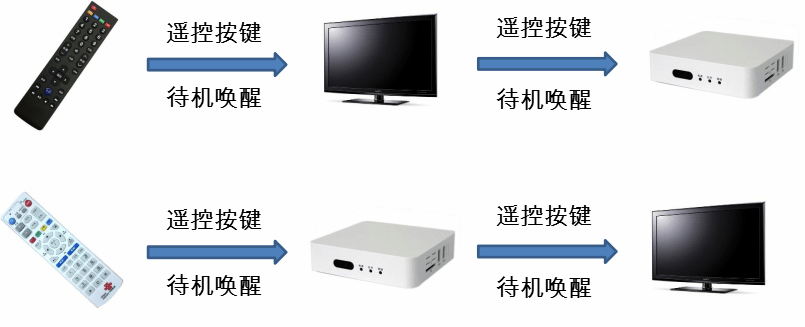

如图所示，可以只用电视遥控器同时控制电视和盒子，或是只用盒子遥控器同时控制电视和盒子。

### CEC协议简介

CEC 假定一个系统内的所有音视频信号源产品都直接或间接的连接到一个“根”显示设备，通过 HDMI 线连接成一个自上而下的树，显示设备作为“根”，信号开关设备作为“枝”，不同的信号源产品作为“叶”节点。
为了使 CEC 能够寻址及控制拥有特定物理地址的设备，所有系统内的设备必须拥有物理地址。软件通过 EDID 为 CEC 网络中的所有设备分配物理地址。每个设备有且只能有一个物理地址。

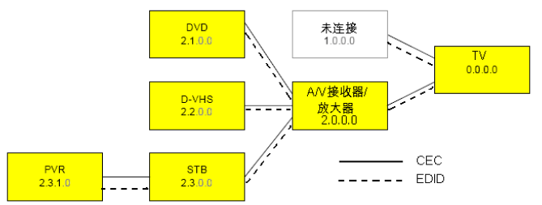

每一个连接到 CEC 控制总线上的设备都必须绑定逻辑地址，定义该设备的类型。每一个逻辑地址都只能绑定唯一一个设备（15除外）。大多数设备都只绑定一个逻辑地址，少数设备最多可以绑定两个逻辑地址。

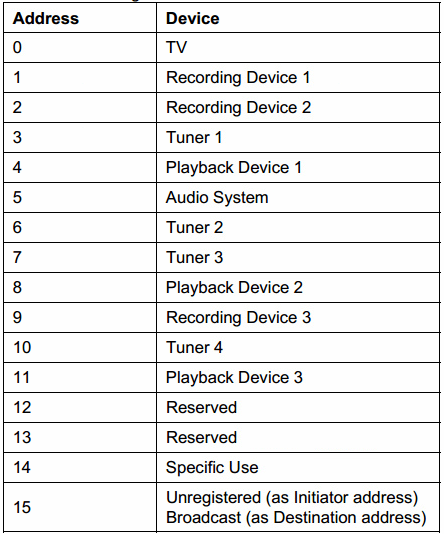

绑定逻辑地址的流程如图所示，通过发送 SRC 和 DST 地址相同的 POLL MSG 来确认地址是否已经被其他设备占用。

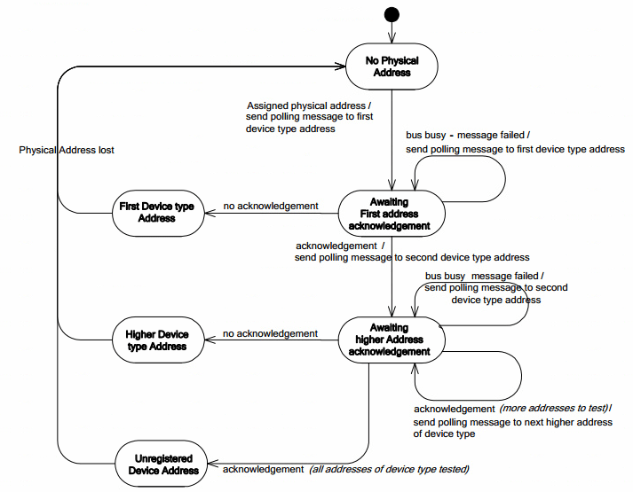

CEC 设备之间的通信通过发送 CEC MSG 来实现。

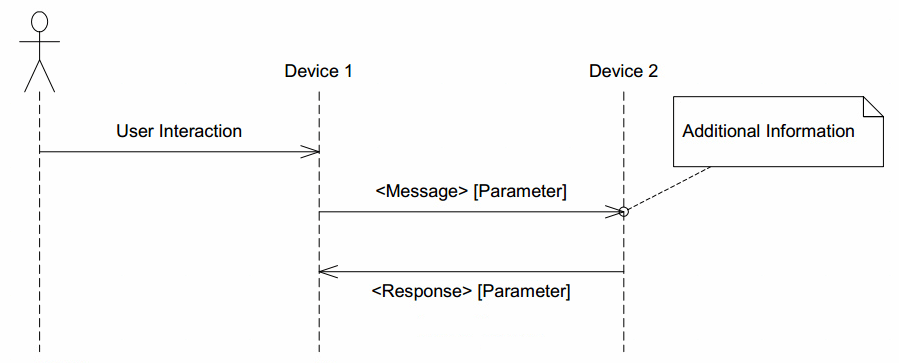

CEC MSG 由多个或单个Block组成，Block 的格式如下，由 8 bit 的 Header/Data 和 1 bit 的 EOM 位和 ACK 位组成。其中 EOM 表示后续是否还有数据，为 1 时表示本条 CEC MSG 已经结束后续没有数据了。ACK 为响应位，发送方将其置为 1，接收方若成功收到该MSG，则将其置为 0，表示已经收到数据。

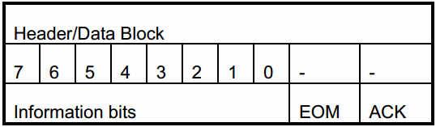

Header Block 为 CEC MSG 的第一个 Block，Information bits 高 4 位为发送方的 Logical address，低 4 位为接收方的 Logical address。Data Block 的 Information bits 则是 OPCODE 或参数。

## CEC代码介绍

### Android CEC框架介绍

#### Android CEC框架概述

由于很多厂商使用了 HDMI-CEC 标准，这使得不同厂商生产的设备连接在一起工作成为可能。但是，由于每个厂商实现 HDMI-CEC 的方法不尽相同，而且这些设备在支持的功能上也有差异，因而他们并不能完全兼容。所以消费者不能简单的认为两个声称支持 CEC 的产品互相之间能够兼容。
随着 Android TIF(TV Input Framework) 的引入，HDMI-CEC 让相互连接的设备能够沟通起来，并且能够最大限度的降低兼容性问题。Android 创建了一个系统服务 HdmiControlService 来解决这个痛点。
提供 HdmiControlService 作为 Android 生态的一部分， Android 希望实现以下目标：
为所有厂商提供 HDMI-CEC 的标准实现，这将会减少设备之间的不兼容。在以前，厂商必须开发他们自己的 HDMI-CEC，或者使用三方的解决方案。
HdmiControlService 是一个针对目前市场上大量使用的 HDMI-CEC 设备经过良好测试的 Android 服务。Android 在兼容性问题上已经做过慎重的研究，并且从业界有经验的合作伙伴那儿收集了很多有用的建议。这个 CEC 服务在标准和修改之间做了很好的平衡，以便它可以用于用户已经在使用的产品。

##### HdmiControlService

HdmiControlService 是和系统的其他部分（例如 TIF、Audio 服务、电源管理服务等）一起来实现 CEC 标准。图中描述了怎样从以前自定义的 CEC 控制器转换到目前更简单的 HDMI-CEC 的硬件抽象层。以及详细描述了 HDMI control service 的实现。
下面是对于 Android HDMI-CEC 实现的关键的组成部分：

- 一个管理类 HdmiControlManager 向有权限的应用提供 API。系统服务例如 TV Input Manager 服务和 Audio 服务可以直接使用这个类。

- 代码位于：

```
  frameworks/base/core/java/android/hardware/hdmi
```

- 这个服务设计成可用来支持多种类型的逻辑设备。

- 代码位于：

```
  frameworks/base/services/core/java/com/android/server/hdmi
```

- HDMI-CEC 通过硬件抽象层来操作硬件，这可以简化设备间在协议和信号机制之间的不同。厂商可以利用已有的硬件抽象层的定义来实现自己的硬件抽象层。

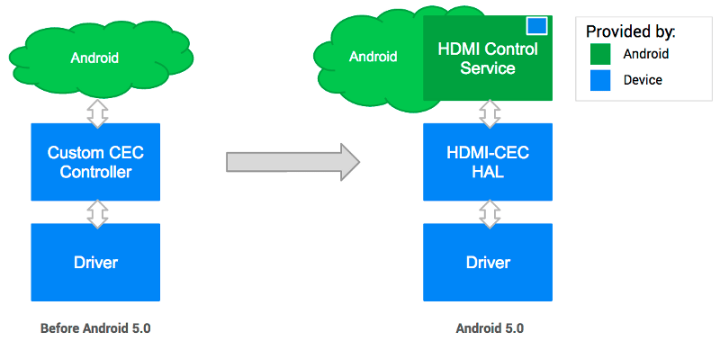


##### HDMI-CEC HAL

为使 CEC 服务发挥作用，必须按照 Android 提供的定义来实现 HDMI-CEC HAL。HDMI-CEC HAL 会抽象化硬件级别的差异，并通过 API 将原始操作（分配/读取/写入等）提供给上层。
设备制造商必须支持的 API 调用如下：
TX/RX/事件：

- send_message
- register_event_callback

信息：

- get_physical_address
- get_version
- get_vendor_id
- get_port_info

逻辑地址：

- add_logical_address
- clear_logical_address

状态：

- is_connected set_option
- set_audio_return_channel

以下是关于 API 的 HDMI-CEC HAL 定义的摘录：

```c++
#ifndef ANDROID_INCLUDE_HARDWARE_HDMI_CEC_H
#define ANDROID_INCLUDE_HARDWARE_HDMI_CEC_H

...

/*
 * HDMI-CEC HAL interface definition.
 */
typedef struct hdmi_cec_device {
    /**
     * Common methods of the HDMI-CEC device.  This *must* be the first member of
     * hdmi_cec_device as users of this structure will cast a hw_device_t to hdmi_cec_device
     * pointer in contexts where it's known the hw_device_t references a hdmi_cec_device.
     */
    struct hw_device_t common;

    /*
     * (*add_logical_address) passes the logical address that will be used
     * in this system.
     *
     * HAL may use it to configure the hardware so that the CEC commands addressed
     * the given logical address can be filtered in. This method can be called
     * as many times as necessary in order to support multiple logical devices.
     * addr should be in the range of valid logical addresses for the call
     * to succeed.
     *
     * Returns 0 on success or -errno on error.
     */
    int (*add_logical_address)(const struct hdmi_cec_device* dev, cec_logical_address_t addr);

    /*
     * (*clear_logical_address) tells HAL to reset all the logical addresses.
     *
     * It is used when the system doesn't need to process CEC command any more,
     * hence to tell HAL to stop receiving commands from the CEC bus, and change
     * the state back to the beginning.
     */
    void (*clear_logical_address)(const struct hdmi_cec_device* dev);

    /*
     * (*get_physical_address) returns the CEC physical address. The
     * address is written to addr.
     *
     * The physical address depends on the topology of the network formed
     * by connected HDMI devices. It is therefore likely to change if the cable
     * is plugged off and on again. It is advised to call get_physical_address
     * to get the updated address when hot plug event takes place.
     *
     * Returns 0 on success or -errno on error.
     */
    int (*get_physical_address)(const struct hdmi_cec_device* dev, uint16_t* addr);

    /*
     * (*send_message) transmits HDMI-CEC message to other HDMI device.
     *
     * The method should be designed to return in a certain amount of time not
     * hanging forever, which can happen if CEC signal line is pulled low for
     * some reason. HAL implementation should take the situation into account
     * so as not to wait forever for the message to get sent out.
     *
     * It should try retransmission at least once as specified in the standard.
     *
     * Returns error code. See HDMI_RESULT_SUCCESS, HDMI_RESULT_NACK, and
     * HDMI_RESULT_BUSY.
     */
    int (*send_message)(const struct hdmi_cec_device* dev, const cec_message_t*);

    /*
     * (*register_event_callback) registers a callback that HDMI-CEC HAL
     * can later use for incoming CEC messages or internal HDMI events.
     * When calling from C++, use the argument arg to pass the calling object.
     * It will be passed back when the callback is invoked so that the context
     * can be retrieved.
     */
    void (*register_event_callback)(const struct hdmi_cec_device* dev,
            event_callback_t callback, void* arg);

    /*
     * (*get_version) returns the CEC version supported by underlying hardware.
     */
    void (*get_version)(const struct hdmi_cec_device* dev, int* version);

    /*
     * (*get_vendor_id) returns the identifier of the vendor. It is
     * the 24-bit unique company ID obtained from the IEEE Registration
     * Authority Committee (RAC).
     */
    void (*get_vendor_id)(const struct hdmi_cec_device* dev, uint32_t* vendor_id);

    /*
     * (*get_port_info) returns the hdmi port information of underlying hardware.
     * info is the list of HDMI port information, and 'total' is the number of
     * HDMI ports in the system.
     */
    void (*get_port_info)(const struct hdmi_cec_device* dev,
            struct hdmi_port_info* list[], int* total);

    /*
     * (*set_option) passes flags controlling the way HDMI-CEC service works down
     * to HAL implementation. Those flags will be used in case the feature needs
     * update in HAL itself, firmware or microcontroller.
     */
    void (*set_option)(const struct hdmi_cec_device* dev, int flag, int value);

    /*
     * (*set_audio_return_channel) configures ARC circuit in the hardware logic
     * to start or stop the feature. Flag can be either 1 to start the feature
     * or 0 to stop it.
     *
     * Returns 0 on success or -errno on error.
     */
    void (*set_audio_return_channel)(const struct hdmi_cec_device* dev, int flag);

    /*
     * (*is_connected) returns the connection status of the specified port.
     * Returns HDMI_CONNECTED if a device is connected, otherwise HDMI_NOT_CONNECTED.
     * The HAL should watch for +5V power signal to determine the status.
     */
    int (*is_connected)(const struct hdmi_cec_device* dev, int port);

    /* Reserved for future use to maximum 16 functions. Must be NULL. */
    void* reserved[16 - 11];
} hdmi_cec_device_t;

#endif /* ANDROID_INCLUDE_HARDWARE_HDMI_CEC_H */

```

借助 API，CEC 服务可以利用硬件资源来发送/接收 HDMI-CEC 命令、配置必要的设置，并（可选）与底层平台（将在 Android 系统处于待机模式时负责 CEC 控制）上的微处理器进行通信。

#### 相关代码路径

CEC 功能相关的代码路径与说明如下：

| 路径                                                 | 说明                                                         |
| :--------------------------------------------------- | ------------------------------------------------------------ |
| kernel/drivers/media/cec/cec-adap.c                  | CEC 驱动的核心部分，承担 CEC  Physical address 和 Logical address 的绑定， CEC EVENT 和 MSG 收发的管理等功能。 |
| kernel/drivers/media/cec/cec-api.c                   | 提供 IOCTL 供 USER SPACE 调用。                              |
| kernel/drivers/media/cec/cec-core.c                  | CEC 设备的注册。                                             |
| kernel/drivers/media/cec/cec-notifier.c              | 通知 CEC 驱动Physical address的变动。                        |
| kernel/drivers/media/cec/cec-edid.c                  | CEC EDID 辅助功能。主要为从 EDID 中获取 Physical address。   |
| kernel/drivers/gpu/drm/bridge/synopsys/dw-hdmi-cec.c | DW-HDMI CEC驱动。主要实现对DW-HDMI CEC 寄存器的操作。        |

Android 代码路径如下：

| 路径                                                         | 说明                                                         |
| ------------------------------------------------------------ | ------------------------------------------------------------ |
| hardware/rockchip/hdmicec/hdmi_cec.cpp                       | 实现了标准CEC HAL的接口。                                    |
| hardware/rockchip/hdmicec/hdmicec_event.cpp                  | 主要通过一个线程实现对 kernel 的 CEC MSG 和 EVENT 的监听，并上报。 |
| frameworks/base/services/core/java/com/android/server/hdmi/HdmiControlService.java | 提供发送和处理 HDMI 控制消息和 CEC 控制命令的服务。          |
| frameworks/base/services/core/java/com/android/server/hdmi/HdmiCecController.java | 管理 CEC 的命令和操作。转化用户命令为 CEC 命令并下发给 HAL。收到 CEC 消息后进行解析并分派给特定的模块。 |
| frameworks/base/services/core/java/com/android/server/hdmi/HdmiCecLocalDevice.java | 在系统中建模一个逻辑上的 CEC 设备的类，处理初始化以及收到针对特定设备的 CEC MSG 后调用特定设备的处理接口。 |
| frameworks/base/services/core/java/com/android/server/hdmi/HdmiCecLocalDevicePlayback.java | 抽象出了 PLAYBACK 设备，提供相关接口。                       |

### Linux HDMI CEC 应用说明

Linux 上可以使用v4l-utils提供的cec-ctl工具，来通过命令行控制CEC设备。

#### v4l-utils的安装

- 在debian上，用户可以通过以下命令安装v4l-utils：

```shell
sudo apt-get install v4l-utils
```

- 在buildroot上，用户可以通过配置以下编译选项来安装v4l-utils：

```shell
BR2_PACKAGE_LIBV4L=y
BR2_PACKAGE_LIBV4L_UTILS=y
```

#### 相关命令

- Playback命令：

```shell
[root@rk3288:/]#cec-ctl --playback -o Rockchip -V 0xaabbcc -M -T
```

部分输出log：

```
CEC_ADAP_G_CAPS returned 0 (Success)
CEC_ADAP_G_PHYS_ADDR returned 0 (Success)
CEC_ADAP_S_LOG_ADDRS returned 0 (Success)
CEC_ADAP_S_LOG_ADDRS returned 0 (Success)
CEC_ADAP_G_LOG_ADDRS returned 0 (Success)
Driver Info:
Driver Name : dwhdmi-rockchip
Adapter Name : dw_hdmi
Capabilities : 0x0000000e
Logical Addresses
Transmit
Passthrough
Driver version : 4.4.167
Available Logical Addresses: 4
Physical Address : 1.0.0.0
Logical Address Mask : 0x0010
CEC Version : 2.0
Vendor ID : 0xaabbcc
Logical Address : 4 (Playback Device 1)
Primary Device Type : Playback
Logical Address Type : Playback
All Device Types : Playback
RC TV Profile : None
Device Features : None
Monitor All mode is not supported, falling back to regular monitoring
CEC_S_MODE returned 0 (Success)
CEC_DQEVENT returned 0 (Success)
```

CEC初始化会进行基本信息的交互，比如vendor id、osd name、CEC版本：

```
Received from TV to Playback Device 1 (0 to 4): CEC_MSG_GIVE_DEVICE_VENDOR_ID (0x8c)
CEC_RECEIVE returned 0 (Success)
Transmitted by Playback Device 1 to all (4 to 15): CEC_MSG_DEVICE_VENDOR_ID (0x87):
vendor-id: 11189196 (0x00aabbcc)
CEC_RECEIVE returned 0 (Success)

Received from TV to Playback Device 1 (0 to 4): CEC_MSG_GIVE_OSD_NAME (0x46)
CEC_RECEIVE returned 0 (Success)
Transmitted by Playback Device 1 to TV (4 to 0): CEC_MSG_SET_OSD_NAME (0x47):
name: Rockchip
CEC_RECEIVE returned 0 (Success)
```

当电视待机，电视会向芯片发送standby 信息：

```
Received from TV to all (0 to 15): CEC_MSG_STANDBY (0x36)
CEC_RECEIVE returned 0 (Success)
```

当电视切换显示源，电视会向芯片发送的相关信息：

```
Received from TV to all (0 to 15): CEC_MSG_SET_STREAM_PATH (0x86):
phys-addr: 2.0.0.0
CEC_RECEIVE returned 0 (Success)
Received from TV to all (0 to 15): CEC_MSG_ROUTING_CHANGE (0x80):
orig-phys-addr: 0.0.0.0
new-phys-addr: 2.0.0.0
CEC_RECEIVE returned 0 (Success)
```

- One-touch-play命令：

```shell
[root@rk3288:/]# cec-ctl --help-one-touch-play
One Touch Play Feature:
--active-source=phys-addr=<val> Send ACTIVE_SOURCE message (0x82)
--image-view-on Send IMAGE_VIEW_ON message (0x04)
--text-view-on Send TEXT_VIEW_ON message (0x0d)
```

唤醒TV：

```shell
[root@rk3288:/]#cec-ctl --image-view-on -to 0
```

- Standby命令：

```shell
[root@rk3288:/]# cec-ctl --standby --to 0
```

CEC用户层更多命令的使用，可通过cec-ctl --help 获得。

**注意事项**

- 目前还未支持通过TV端的待机唤醒来对芯片进行待机唤醒的操作

待机可参考2.2.2 Playback命令，在收到CEC_MSG_STANDBY，通过系统调用
`echo  mem > /sys/power/state` 就可以实现芯片端的同步待机。
唤醒由于涉及到trust以及待机时 cec-clk，hdmi phy等的操作，当前还没很好的支持。

- 并非所有HDMI设备都支持 CEC 功能，请先确认TV端或者HDMI显示设备是否支持 CEC 以及是否支持特定的CEC 指令。

### CEC软件流程介绍

#### CEC初始化流程

##### CEC驱动注册流程简介

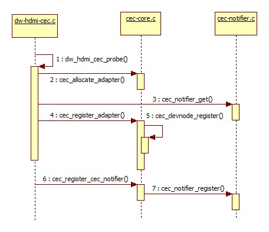

CEC 驱动注册流程如图上所示。

- dw_hdmi_cec_probe：

完成 CEC 驱动初始化工作，将系统抽象的 CEC 设备与实际的 CEC 硬件联系起来。还包括对 CEC 相关寄存器的初始化配置，完成 CEC MSG 收发时的中断注册（cec->irq）等。

- cec_allocate_adapter：

（1）完成了adapter的创建与适配。

adapter 结构体如下：

```c
struct cec_adapter {
        struct module *owner;
        char name[32];
        struct cec_devnode devnode;
        struct mutex lock;
        struct rc_dev *rc;

        struct list_head transmit_queue;
        unsigned int transmit_queue_sz;
        struct list_head wait_queue;
        struct cec_data *transmitting;

        struct task_struct *kthread_config;
        struct completion config_completion;

        struct task_struct *kthread;
        wait_queue_head_t kthread_waitq;
        wait_queue_head_t waitq;

        const struct cec_adap_ops *ops;
        void *priv;
        u32 capabilities;
        u8 available_log_addrs;
       u32 monitor_all_cnt;
        u32 monitor_pin_cnt;
        u32 follower_cnt;
        struct cec_fh *cec_follower;
        struct cec_fh *cec_initiator;
        bool passthrough;
        struct cec_log_addrs log_addrs;

        u32 tx_timeouts;

#ifdef CONFIG_CEC_NOTIFIER
        struct cec_notifier *notifier;
#endif
#ifdef CONFIG_CEC_PIN
        struct cec_pin *pin;
#endif

        struct dentry *cec_dir;
        struct dentry *status_file;

        u16 phys_addrs[15];
        u32 sequence;

        char input_name[32];
        char input_phys[32];
        char input_drv[32];
};

```

针对其中较为重要的几项结构体成员说明见下表：

| 名称                | 说明                                                         |
| :------------------ | :----------------------------------------------------------- |
| transmit_queue      | CEC MSG 待发送消息的队列。                                   |
| transmit_queue_sz   | CEC MSG待发送消息的队列长度。                                |
| wait_queue          | 选择对发出的 CEC MSG 的响应 MSG 进行等待时，进行等待的 MSG 将被储存进该队列，当前版本没有使用该功能。 |
| transmitting        | 当前正在发送的 CEC MSG                                       |
| kthread_config      | 配置 CEC 初始化时运行的线程。                                |
| config_completion   | 等待 CEC 初始化配置完成的信号量。                            |
| kthread             | 用于 CEC MSG 发送队列管理的线程 cec_thread_func 的描述符。   |
| kthread_waitq       | cec_thread_func 的等待队列。                                 |
| ops                 | adapter的 callbacks，详见 kernel/drivers/gpu/drm/bridge/synopsys/dw-hdmi-cec.c |
| capabilities        | adapter设定的功能。                                          |
| available_log_addrs | 最大可获取 Logical address 数量。                            |
| phys_addr           | 当前 Physical address。                                      |
| is_configuring      | 当前正在进行初始化配置。                                     |
| is_configured       | 初始化配置完成。                                             |
| follower_cnt        | follower 的数量，当前方案为 1。                              |
| cec_follower        | 当前的 cec_follower，当前版本为 fh。                         |
| cec_initiator       | 当前的 cec_initiator，当前版本为 fh。                        |
| passthrough         | 当前 cec_follower 是否为 passthrough 模式。                  |
| log_addrs           | 当前已经绑定的 Logical address，一个或多个。                 |
| tx_timeouts         | 发送 CEC MSG 超时次数，一般极少发生该情况。                  |
| notifier            | cec notifier                                                 |
| phys_addrs          | Physical address，针对多个 Logic address 时的情况。          |
| sequence            | adapter 发送 CEC MSG 的序号，用于追溯等待 reply 的 MSG。     |

（2）运行管理 CEC MSG 传输队列的线程 cec_thread_func。

（3）配置cec adapter的功能，详细说明见下表：

| capabilities        | 说明                                                         |
| :------------------ | :----------------------------------------------------------- |
| CEC_CAP_PHYS_ADDR   | 用户层必须设定 Physical address。                            |
| CEC_CAP_LOG_ADDRS   | 用户层必须设定 Logical address。                             |
| CEC_CAP_TRANSMIT    | 允许用户层传递 CEC MSG。                                     |
| CEC_CAP_PASSTHROUGH | CEC 驱动不处理收到的 CEC MSG，直接上报用户空间。             |
| CEC_CAP_RC          | 支持遥控驱动控制 CEC。                                       |
| CEC_CAP_MONITOR_ALL | CEC 驱动接收所有 CEC MSG，包括不是发送给自己的，通常用作 DEBUG 用途。 |
| CEC_CAP_NEEDS_HPD   | 只在 HDMI HPD pin为高时才启用 CEC。                          |
| CEC_CAP_MONITOR_PIN | CEC 驱动监视 CEC pin的变化。                                 |

- cec_register_adapter：

（1）完成 CEC 设备节点的注册。

（2）完成 CEC DEBUG 节点的注册。

- cec_register_cec_notifier：

注册cec notifier，并使之与adapter绑定。

##### CEC初始化设置流程简介

CEC 功能要正常使用，需要进行正确的初始化配置。需要进行 CEC 功能相关开关的使能； Logic address的绑定与保存； CEC 驱动configure 的完成等工作。其中 FRAMEWORK、 JNI、HAL 的相关流程如图所示：

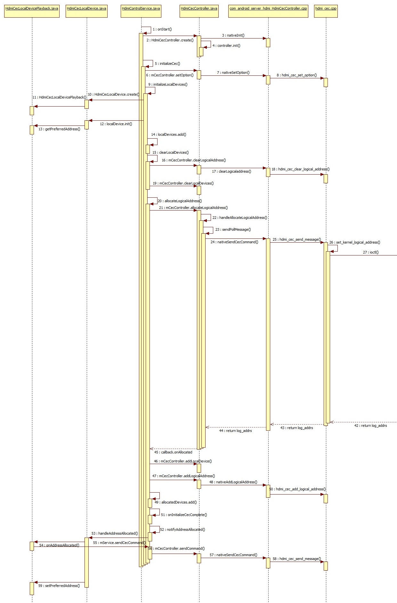

其中较为重要的环节：

- initializeCec：

initializeCec 为初始化过程最主要的环节，不单是开机初始化过程，系统待机后唤醒，设置菜单里使能 CEC 功能都会执行 initializeCec 进行初始化配置。主要完成了 localdevice 的初始化（目前安卓只支持 TV 和 PLAYBACK 两种设备，RK 方案基本为 PLAYBACK 设备）， Logical address的绑定以及 CEC 开关的使能。

- initializeLocalDevices：

（1）将创建并初始化 CEC localdevice，也即创建 HdmiCecLocalDevicePlayback。
（2）localDevice.init 将会通过调用 getPreferredAddress 将获取保存在属性的 "persist.sys.hdmi.addr.playback"。若之前本设备已经绑定过某个 Logical address，则会优先选择该地址开始。若无的话则会从该设备的第一个地址开始（PLAYBACK 设备第一个地址为0x4）。
（3）localDevices.add 将初始化完成的 localDevice 添加到列表 localDevices 当中。

- hdmi_cec_set_option：

初始化过程中将会调用到 HAL 层使能 CEC 的相关开关，如下表所示：

| 开关                           | 说明                                                         |
| :----------------------------- | :----------------------------------------------------------- |
| HDMI_OPTION_WAKEUP             | 当设置为 false 时，收到\<Image View On>或 \<Text View On>这类 CEC 协议中规定会唤醒系统的CEC MSG，也不会把系统从待机中唤醒。由于当前版本没有实现 CEC 唤醒系统的功能，所以实际上该开关没有实际作用。 |
| HDMI_OPTION_ENABLE_CEC         | 可认为是 CEC 功能的总开关，当设置为 false 时。HAL 不再发送和接收任何 CEC MSG，CEC 功能被关闭。通过设置菜单中的 CEC 功能总开关来进行开关。 |
| HDMI_OPTION_SYSTEM_CEC_CONTROL | 系统时进入待机时被设置为 false，唤醒被设置为 true。当设置为 false 时，表示安卓系统不再处理上报的CEC MSG，转由底层接手处理。目前该开关也无实际作用，后续版本实现 CEC 唤醒系统功能时可能会添加相关功能。 |

- allocateLogicalAddress：

主要完成了绑定Logical address的工作。

（1）调用 HAL 的 hdmi_cec_send_message ,发送 POLL MSG，当发送一定次数的 POLL MSG 后响应都为 NACK 的话（次数由HdmiConfig.ADDRESS_ALLOCATION_RETRY 决定）则选定使用该地址。

（2）调用 HAL 的 hdmi_cec_add_logical_address，将选定的 Logical address 下发给底层驱动。

（3）绑定成功后，在 onAddressAllocated 中调用发送 CEC MSG 接口发送若干条 CEC MSG（ReportPhysicalAddress等）。

这个过程中存在一个问题：根据 CEC 协议 Logical address 的绑定需要 CEC 设备发出 POLL MSG，当某个地址对 POLL MSG 无响应（NACK）时，则说明改地址无设备占用，选定该地址为本设备的 Logical address。

安卓 FRAMEWORK 在绑定 Logical address时，采用的方案是调用 HAL 的 hdmi_cec_send_message 直接发出若干次 POLL MSG，都为无响应时则选定该地址绑定。此后才下发绑定的地址给驱动。而kernel CEC 驱动则需要通过先完成初始化的 configure，通过IOCTL CEC_ADAP_S_PHYS_ADDR 来完成整个绑定过程，再将绑定的地址上报。在这之前，不允许上层直接调用 send_message 的接口来直接发送 POLL MSG。

两者流程的不同，只能通过在 HAL 进行适配处理才能完成。当 FRAMEWORK  调用 hdmi_cec_send_message 发送 POLL MSG 时，通过 IOCTL CEC_ADAP_G_LOG_ADDRS来获取 kernel 驱动此时绑定的 Logical address。若驱动尚未绑定 Logical  address （CEC_LOG_ADDR_INVALID）则调用IOCTL CEC_ADAP_S_LOG_ADDRS 来进行绑定。若驱动已经绑定 Logical address，且地址与上层下发的 POLL MSG 中的地址相同，则返回 NACK 给上层，若绑定的地址不同，则返回 success，这样 FRAMEWORK 就会选择下一个地址进行 POLLING，直到上层与 kernel 选取的地址相同。

kernel cec驱动的初始化设置流程如图所示:

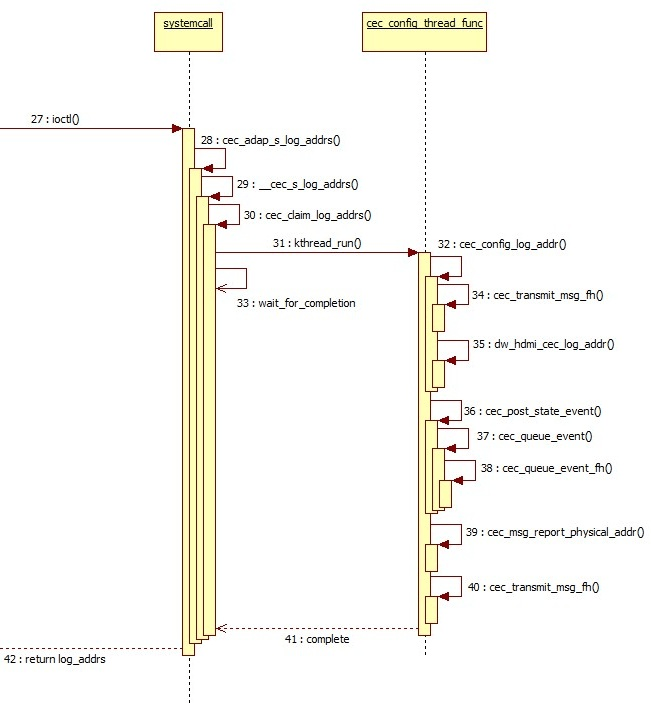

- HAL 层通过 IOCTL CEC_ADAP_S_LOG_ADDRS 调用 cec_adap_s_log_addrs 进行设置。
- 在 cec_claim_log_addrs 运行初始化配置的线程 cec_config_thread_func，并等待配置的完成(wait_for_completion(&adap->config_completion))。

```c
static void cec_claim_log_addrs(struct cec_adapter *adap, bool block)
{
	if (WARN_ON(adap->is_configuring || adap->is_configured))
		return;

	init_completion(&adap->config_completion);

	/* Ready to kick off the thread */
	adap->is_configuring = true;
	adap->kthread_config = kthread_run(cec_config_thread_func, adap,
					   "ceccfg-%s", adap->name);
	if (IS_ERR(adap->kthread_config)) {
		adap->kthread_config = NULL;
	} else if (block) {
		mutex_unlock(&adap->lock);
		wait_for_completion(&adap->config_completion);
		mutex_lock(&adap->lock);
	}
}
```

- cec_config_thread_func 中，通过 cec_transmit_msg_fh 将 POLL MSG 添加进发送队列并进行发送，若未得到相应则绑定该地址。
- 通过回调 adap->ops->adap_log_addr，调用 dw_hdmi_cec_log_addr，将绑定的地址写入相关的 CEC 寄存器中。
- 至此 CEC 驱动初始化设置完成（adap->is_configured = true），通过 cec_post_state_event 向上层上报 CEC 驱动状态改变的事件。
- cec_msg_report_physical_addr 创建OPCODE为 report physical addr 的 CEC MSG 再添加进发送队列并发送。
- 唤醒原本在等待配置完成的线程（complete(&adap->config_completion)）。

#### CEC消息发送流程简介

如图所示，上层 CEC MSG 发送流程较为简单，只需调用 sendCecCommand 发送即可。

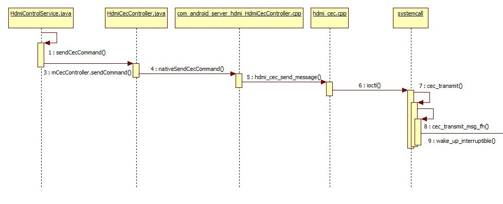

sendCecCommand 的参数 HdmiCecMessage 可以参考:

```
frameworks/base/services/core/java/com/android/server/hdmi/HdmiCecMessageBuilder.java
```

内核流程如图所示：

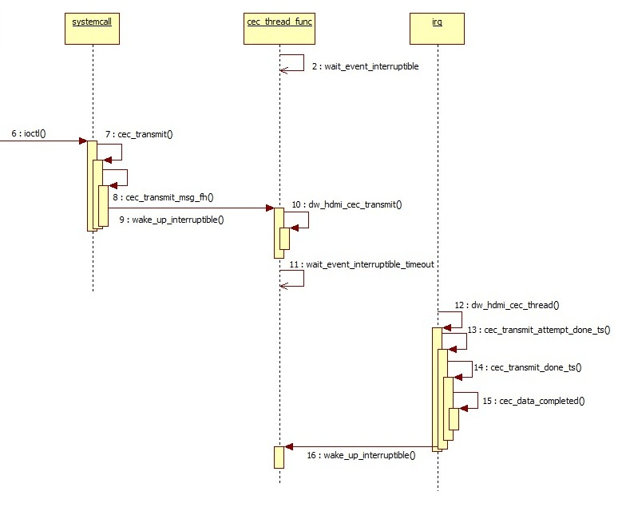

最终 HAL 层通过 IOCTL CEC_TRANSMIT 调用 CEC 驱动中的 cec_transmit 进行消息发送。

```c
static long cec_transmit(struct cec_adapter *adap, struct cec_fh *fh,
			 bool block, struct cec_msg __user *parg)
{
	struct cec_msg msg = {};
	long err = 0;

	if (!(adap->capabilities & CEC_CAP_TRANSMIT))
		return -ENOTTY;
	if (copy_from_user(&msg, parg, sizeof(msg)))
		return -EFAULT;

	/* A CDC-Only device can only send CDC messages */
	if ((adap->log_addrs.flags & CEC_LOG_ADDRS_FL_CDC_ONLY) &&
	    (msg.len == 1 || msg.msg[1] != CEC_MSG_CDC_MESSAGE))
		return -EINVAL;

	mutex_lock(&adap->lock);
	if (adap->log_addrs.num_log_addrs == 0)
		err = -EPERM;
	else if (adap->is_configuring)
		err = -ENONET;
	else if (!adap->is_configured &&
		 (adap->needs_hpd || msg.msg[0] != 0xf0))
		err = -ENONET;
	else if (cec_is_busy(adap, fh))
		err = -EBUSY;
	else
		err = cec_transmit_msg_fh(adap, &msg, fh, block);
	mutex_unlock(&adap->lock);
	if (err)
		return err;
	if (copy_to_user(parg, &msg, sizeof(msg)))
		return -EFAULT;
	return 0;
}
```

首先通过一系列判断条件，判断此时 CEC 驱动是否能够正常发送 MSG，此后通过 cec_transmit_msg_fh 将要发送的 CEC 消息 MSG加入待发送的队列当中。其中 MSG 的结构体为：

```c
struct cec_msg {
        __u64 tx_ts;
        __u64 rx_ts;
        __u32 len;
        __u32 timeout;
        __u32 sequence;
        __u32 flags;
        __u8 msg[CEC_MAX_MSG_SIZE];
        __u8 reply;
        __u8 rx_status;
        __u8 tx_status;
        __u8 tx_arb_lost_cnt;
        __u8 tx_nack_cnt;
        __u8 tx_low_drive_cnt;
        __u8 tx_error_cnt;
};
```

结构体成员说明如下表：

| 结构体成员       | 说明                                                         |
| :--------------- | :----------------------------------------------------------- |
| tx_ts            | 纳秒级的时间戳，当 CEC 驱动完成发送 MSG 后会被设置。         |
| rx_ts            | 纳秒级的时间戳，当 CEC 驱动完成接收 MSG 后会被设置。         |
| len              | MSG 的长度。                                                 |
| sequence         | CEC 驱动框架为发送的消息分配一个序号。这可以用来踪对以前发送的消息的回复。 |
| msg              | 实际保存 CEC MSG 的payload。                                 |
| reply            | 仅供发送 CEC MSG 时使用，若其非 0 则 CEC 驱动会在发出该 CEC MSG 后，等待对该消息的回复（如发出\<give device power status>后，按照 CEC 协议，将会得到\<report  power status>的回复）。目前都将其设置为 0，不会专门在 CEC 驱动中对 MSG 响应进行等待。 |
| rx_status        | CEC 驱动完成接收 MSG 后将会对其设置，标记接收的状态 :<br\> CEC_RX_STATUS_OK<br/>CEC_RX_STATUS_TIMEOUT<br/>CEC_RX_STATUS_FEATURE_ABORT |
| tx_status        | CEC 驱动完成发送 MSG 后将会对其设置，标记发送的状态:<br/>CEC_TX_STATUS_OK<br/>CEC_TX_STATUS_ARB_LOST<br/>CEC_TX_STATUS_NACK<br/>CEC_TX_STATUS_LOW_DRIVE<br/>CEC_TX_STATUS_ERROR<br/>CEC_TX_STATUS_MAX_RETRIES |
| tx_arb_lost_cnt  | CEC MSG 发送完成后，统计 Arbitration Lost 错误的次数。       |
| tx_nack_cnt      | CEC MSG 发送完成后，统计 Not Acknowledged 错误的次数。       |
| tx_low_drive_cnt | CEC MSG 发送完成后，统计 Low Drive Detected 错误的次数。     |
| tx_error_cnt     | CEC MSG 发送完成后，统计 Error 错误的次数。                  |

- cec_thread_func 为管理 CEC MSG 发送队列的线程。当此时无 MSG 正在发送时，线程等待新的 MSG 加入队列。

```c
			wait_event_interruptible(adap->kthread_waitq,
				kthread_should_stop ||
				(!adap->transmitting &&
				 !list_empty(&adap->transmit_queue)));
```

- cec_transmit_msg_fh 将待发送的消息加入队列后，若此时无 MSG 正在发送，则会唤醒 cec_thread_func 进行发送,若此时有 MSG 正在发送，则将 MSG 加入等待发送的队列，并等待发送完毕。

```c
	if (fh)
		list_add_tail(&data->xfer_list, &fh->xfer_list);

	list_add_tail(&data->list, &adap->transmit_queue);
	adap->transmit_queue_sz++;
	if (!adap->transmitting)
		wake_up_interruptible(&adap->kthread_waitq);

	/* All done if we don't need to block waiting for completion */
	if (!block)
		return 0;

	/*
	 * If we don't get a completion before this time something is really
	 * wrong and we time out.
	 */
	timeout = CEC_XFER_TIMEOUT_MS;
	/* Add the requested timeout if we have to wait for a reply as well */
	if (msg->timeout)
		timeout += msg->timeout;

	/*
	 * Release the lock and wait, retake the lock afterwards.
	 */
	mutex_unlock(&adap->lock);
	res = wait_for_completion_killable_timeout(&data->c,
						   msecs_to_jiffies(timeout));
	mutex_lock(&adap->lock);

	if (data->completed) {
		/* The transmit completed (possibly with an error) */
		*msg = data->msg;
		kfree(data);
		return 0;
	}
```

- 此后通过回调 adap->ops->adap_transmit 调用 dw_hdmi_cec_transmit 配置 CEC 寄存器开始发送 CEC MSG。
- 发送结束后 CEC 中断产生，dw_hdmi_cec_hardirq 中读取寄存器，记录本次发送的状态如发送成功或是产生了某种错误并记录在tx_status 中。
- cec_transmit_done_ts 中会统计出本次发送的错误，如果错误则根据 retry 次数 attempts 来进行重新发送。若本次发送无错误则调用 cec_data_completed 完成本次发送，并唤醒 cec_thread_func 进行下一条 CEC MSG 的发送。

#### CEC消息接收流程简介

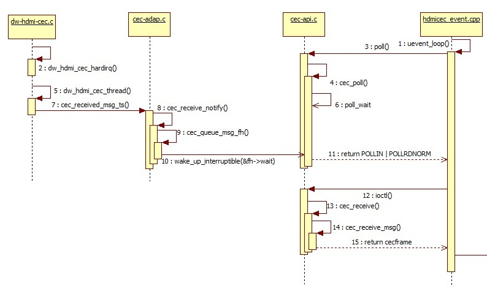

- 当收到 CEC MSG 时，CEC 中断产生，dw_hdmi_cec_hardirq 中读取CEC RX DATA 寄存器，获取收到的 CEC MSG。
- cec_received_msg_ts 中将会判断本次收到的 CEC MSG 是否可用。
- cec_receive_notify 中，当不是设置 CEC 驱动为 passthrough 模式时，会根据 CEC 协议自动回复收到的 CEC MSG。由于我们的方案始终是工作在 passthrough 模式下，所以会调用 cec_queue_msg_fh 将收到的 CEC MSG 储存在队列当中，并唤醒 poll_wait，通知上层已经收到 CEC MSG。

```c
 */
static void cec_queue_msg_fh(struct cec_fh *fh, const struct cec_msg *msg)
{
	static const struct cec_event ev_lost_msgs = {
		.event = CEC_EVENT_LOST_MSGS,
		.lost_msgs.lost_msgs = 1,
	};
	struct cec_msg_entry *entry;

	mutex_lock(&fh->lock);
	entry = kmalloc(sizeof(*entry), GFP_KERNEL);
	if (entry) {
		entry->msg = *msg;
		/* Add new msg at the end of the queue */
		list_add_tail(&entry->list, &fh->msgs);

		if (fh->queued_msgs < CEC_MAX_MSG_RX_QUEUE_SZ) {
			/* All is fine if there is enough room */
			fh->queued_msgs++;
			mutex_unlock(&fh->lock);
			wake_up_interruptible(&fh->wait);
			return;
		}

		/*
		 * if the message queue is full, then drop the oldest one and
		 * send a lost message event.
		 */
		entry = list_first_entry(&fh->msgs, struct cec_msg_entry, list);
		list_del(&entry->list);
		kfree(entry);
	}
	mutex_unlock(&fh->lock);

	/*
	 * We lost a message, either because kmalloc failed or the queue
	 * was full.
	 */
	cec_queue_event_fh(fh, &ev_lost_msgs, ktime_get_ns);
}
```

HAL 层对底层事件监听的线程 uevent_loop 收到上报的收到 CEC MSG 的事件后则通过 IOCTL CEC_RECEIVE 来获取 MSG 队列中储存的CEC MSG。

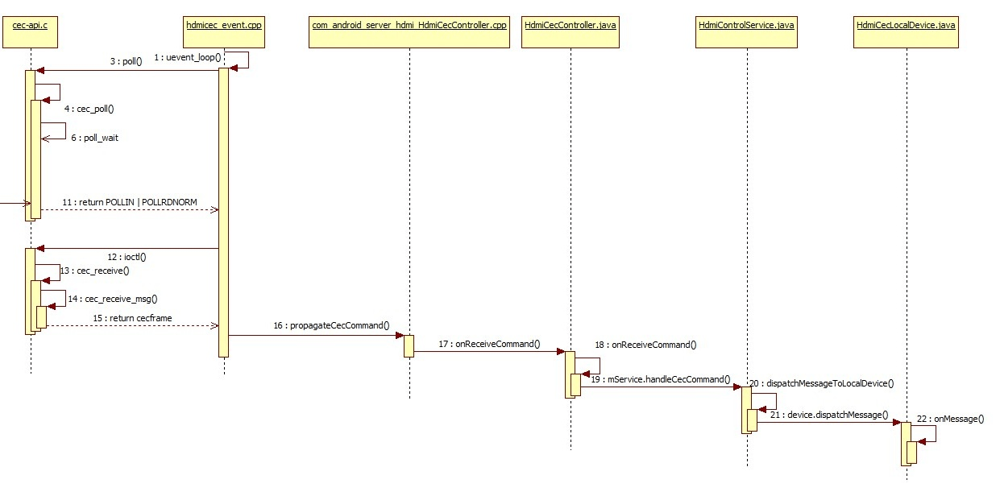

如图所示，FRAMEWORK 对收到的 CEC 消息处理也较为简单，将收到的 CEC MSG 逐层上报后，最后在 onMessage 根据 CEC MSG 的OPCODE 分发给对应 handle 函数进行处理。

#### CEC事件处理流程

CEC 驱动通过上报事件通知上层当前状态的变化，目前事件种类如表所示：

| 名称                   | 已实现                                                       |
| :--------------------- | :----------------------------------------------------------- |
| CEC_EVENT_STATE_CHANGE | adapter 的状态发生了改变，如：从 configured 的状态变为 unconfigured。 |
| CEC_EVENT_LOST_MSGS    | CEC 接收 MSG 队列里的 MSG 没有及时被读取，导致 MSG 丢失。    |
| CEC_EVENT_PIN_CEC_LOW  | CEC 引脚变为低电平，该事件暂时没被使用。                     |
| CEC_EVENT_PIN_CEC_HIGH | CEC 引脚变为高电平，该事件暂时没被使用。                     |
| CEC_EVENT_PIN_HPD_LOW  | HDMI 的 HPD 引脚变为高电平，通常情况是 HDMI 被插入。         |
| CEC_EVENT_PIN_HPD_HIGH | HDMI 的 HPD 引脚变为低电平，通常情况是 HDMI被拔出。          |

以 HDMI 热插拔事件为例，如图所示：

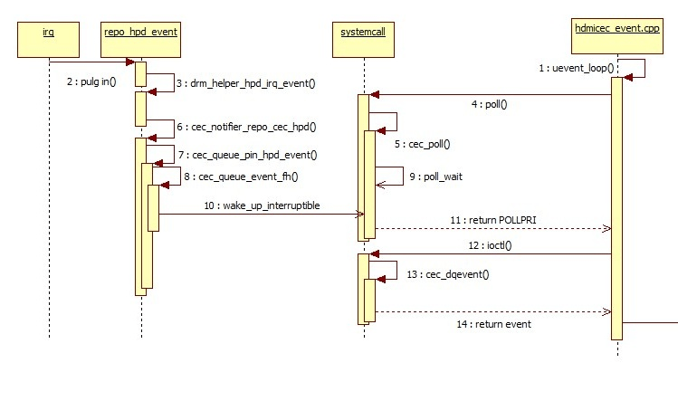

- 当插拔 HDMI 时， HDMI 中断产生，调用到 cec_queue_pin_hpd_event 新建 HPD 的CEC EVENT。
- cec_queue_event_fh 将该事件加入 CEC 的 EVENT 列表，并唤醒 poll_wait，将事件上报。
- HAL 层通过 IOCTL CEC_DQEVENT 调用 cec_dqevent 从 EVENT 列表中获取当前事件。完成事件上报流程。

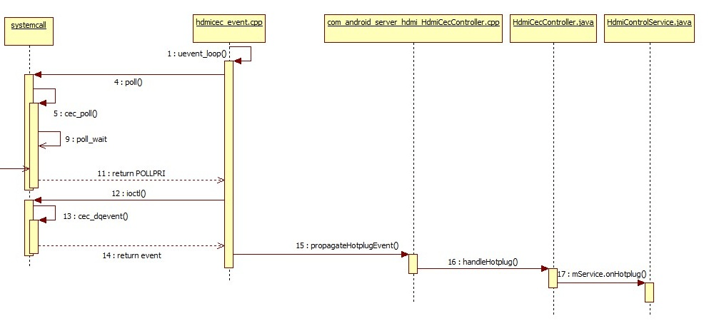

- HAL 层获取事件后，将针对不同的事件进行处理，而 HPD 事件将继续上报。
- 最终将在 onHotplug 中进行处理，如果此时为 plug in 事件，将会调用 allocateLogicalAddress 重新绑定 Logical address，其流程与 2.2.1.2 中的基本相同。

### 新增CEC FEATURE常用接口

Android 原生代码已经支持了 CEC 协议中的多项 FEATURE。若想新增尚未支持的 FEATURE，可以使用以下接口：

- 主动发送CEC MSG：

```
frameworks/base/services/core/java/com/android/server/hdmi/HdmiControlService.java
```

```c
    /**
     * Transmit a CEC command to CEC bus.
     *
     * @param command CEC command to send out
     * @param callback interface used to the result of send command
     */
    @ServiceThreadOnly
    void sendCecCommand(HdmiCecMessage command, @Nullable SendMessageCallback callback) {
        assertRunOnServiceThread;
        if (mMessageValidator.isValid(command) == HdmiCecMessageValidator.OK) {
            mCecController.sendCommand(command, callback);
        } else {
            HdmiLogger.error("Invalid message type:" + command);
            if (callback != null) {
                callback.onSendCompleted(SendMessageResult.FAIL);
            }
        }
    }

    @ServiceThreadOnly
    void sendCecCommand(HdmiCecMessage command) {
        assertRunOnServiceThread;
        sendCecCommand(command, null);
}
```

其中参数 HdmiCecMessage command 可以调用以下路径中的相对应接口直接创建：

```
frameworks/base/services/core/java/com/android/server/hdmi/HdmiCecMessageBuilder.java
```

```c
   @Override
    @ServiceThreadOnly
    protected void onStandby(boolean initiatedByCec, int standbyAction) {
        assertRunOnServiceThread;
        if (!mService.isControlEnabled || initiatedByCec || !mAutoTvOff) {
            return;
        }
        switch (standbyAction) {
            case HdmiControlService.STANDBY_SCREEN_OFF:
                Slog.e(TAG, "send standby eee");
                /* cec cts specification requires that standby message must be broadcast */
                mService.sendCecCommand(
                        HdmiCecMessageBuilder.buildStandby(mAddress, 			 Constants.ADDR_BROADCAST));
                break;
            case HdmiControlService.STANDBY_SHUTDOWN:
                // ACTION_SHUTDOWN is taken as a signal to power off all the devices.
                mService.sendCecCommand(
                        HdmiCecMessageBuilder.buildStandby(mAddress, Constants.ADDR_BROADCAST));
                break;
        }
}
```

以上代码中，为了实现盒子让电视进入待机的功能，按照 CEC 协议，需要发出 standby 的CEC MSG。于是调用了sendCecCommand 接口进行发送，其参数 standby 的CEC MSG，则是调用 HdmiCecMessageBuilder 的 buildStandby 接口直接新建完成。

- 新增对CEC MSG的处理：

由于系统会自动接收 CEC MSG 并上报，所以当接收到的 CEC MSG，系统却不支持进行相应的处理时，需要新增相应的处理办法。
如下代码所示，收到 CEC MSG 后，最终会在 onMessage 中进行处理，其中 handlexxxxx 即是对相应 MSG 的处理，message.getOpcode 为获取该 CEC MSG 的 OPCODE。根据 OPCODE 选择相应的处理。

```
frameworks/base/services/core/java/com/android/server/hdmi/HdmiCecLocalDevice.java
```

```c
   @ServiceThreadOnly
    protected final boolean onMessage(HdmiCecMessage message) {
        assertRunOnServiceThread;
        if (dispatchMessageToAction(message)) {
            return true;
        }
        switch (message.getOpcode) {
            case Constants.MESSAGE_ACTIVE_SOURCE:
                return handleActiveSource(message);
            case Constants.MESSAGE_INACTIVE_SOURCE:
                return handleInactiveSource(message);
            case Constants.MESSAGE_REQUEST_ACTIVE_SOURCE:
                return handleRequestActiveSource(message);
            case Constants.MESSAGE_GET_MENU_LANGUAGE:
                return handleGetMenuLanguage(message);
            case Constants.MESSAGE_SET_MENU_LANGUAGE:
                return handleSetMenuLanguage(message);
            case Constants.MESSAGE_GIVE_PHYSICAL_ADDRESS:
                return handleGivePhysicalAddress;
            case Constants.MESSAGE_GIVE_OSD_NAME:
                return handleGiveOsdName(message);
            case Constants.MESSAGE_GIVE_DEVICE_VENDOR_ID:
                return handleGiveDeviceVendorId;
            case Constants.MESSAGE_GET_CEC_VERSION:
                return handleGetCecVersion(message);
            case Constants.MESSAGE_REPORT_PHYSICAL_ADDRESS:
                return handleReportPhysicalAddress(message);
            case Constants.MESSAGE_ROUTING_CHANGE:
                return handleRoutingChange(message);
            case Constants.MESSAGE_ROUTING_INFORMATION:
                return handleRoutingInformation(message);
            case Constants.MESSAGE_INITIATE_ARC:
                return handleInitiateArc(message);
            case Constants.MESSAGE_TERMINATE_ARC:
                return handleTerminateArc(message);
            case Constants.MESSAGE_SET_SYSTEM_AUDIO_MODE:
                return handleSetSystemAudioMode(message);
            case Constants.MESSAGE_SYSTEM_AUDIO_MODE_STATUS:
                return handleSystemAudioModeStatus(message);
            case Constants.MESSAGE_REPORT_AUDIO_STATUS:
                return handleReportAudioStatus(message);
            case Constants.MESSAGE_STANDBY:
                return handleStandby(message);
            case Constants.MESSAGE_TEXT_VIEW_ON:
                return handleTextViewOn(message);
            case Constants.MESSAGE_IMAGE_VIEW_ON:
                return handleImageViewOn(message);
            case Constants.MESSAGE_USER_CONTROL_PRESSED:
                return handleUserControlPressed(message);
            case Constants.MESSAGE_USER_CONTROL_RELEASED:
                return handleUserControlReleased;
            case Constants.MESSAGE_SET_STREAM_PATH:
                return handleSetStreamPath(message);
            case Constants.MESSAGE_GIVE_DEVICE_POWER_STATUS:
                return handleGiveDevicePowerStatus(message);
            case Constants.MESSAGE_MENU_REQUEST:
                return handleMenuRequest(message);
            case Constants.MESSAGE_MENU_STATUS:
                return handleMenuStatus(message);
            case Constants.MESSAGE_VENDOR_COMMAND:
                return handleVendorCommand(message);
            case Constants.MESSAGE_VENDOR_COMMAND_WITH_ID:
                return handleVendorCommandWithId(message);
            case Constants.MESSAGE_SET_OSD_NAME:
                return handleSetOsdName(message);
            case Constants.MESSAGE_RECORD_TV_SCREEN:
                return handleRecordTvScreen(message);
            case Constants.MESSAGE_TIMER_CLEARED_STATUS:
                return handleTimerClearedStatus(message);
            case Constants.MESSAGE_REPORT_POWER_STATUS:
                return handleReportPowerStatus(message);
            case Constants.MESSAGE_TIMER_STATUS:
                return handleTimerStatus(message);
            case Constants.MESSAGE_RECORD_STATUS:
                return handleRecordStatus(message);
            default:
                return false;
        }
    }
```

所以若要支持新的 CEC MSG，则只需在 switch 中新增对应的 handle 即可。

## 常用DEBUG方法

当 CEC 功能无法正常工作时，开发者可以按照以下思路进行 DEBUG：

- 执行 DEBUG 脚本，抓取 DEBUG 节点状态和 LOG。
- 通过 DEBUG 节点状态查看当前 CEC 是否被正确初始化，并处于正常工作状态。
- 通过查看 kernel log 确认 CEC MSG 是否确实收发成功。
- 通过查看 Android log 确认 CEC 各项 FEATURE 是否被正确处理。

### DEBUG脚本

以下为 CEC 的 DEBUG 脚本，脚本代码如下：

```shell
#!/system/bin/sh

log ************start cec debug script**************
echo 2 > sys/module/cec/parameters/debug

if [ -f "/data/cec_status.txt" ]
then
rm /data/cec_status.log
fi

if [ -f "/data/cec_log.txt" ]
then
rm /data/cec_log.txt
fi

cat /sys/kernel/debug/cec/cec0/status >> /data/cec_status.txt
cat /sys/kernel/debug/dw-hdmi/ctrl >> /data/cec_status.txt

logcat -b all -f /data/cec_log.txt

```

使用时：

- 将 cec_debug.sh push至 /system/bin 下。
- 必须在复现异常状况之前执行 ./system/bin/cec_debug.sh。
- log  “************start cec debug script**************” 为脚本开始运行的时刻。
- 执行出现异常的相关操作。
- 相关 cec debug 节点的状态将生成在 /data/cec_status.txt。
- 同步的 kernel log 和 logcat 将生成在 /data/cec_log.txt。

#### log内容说明

脚本抓取内容包含各个 DEBUG 节点的状态和 log 两个部分。其中节点的内容详细说明见3.1.2。
log 的主要需要关注三部分：

包含以下cec-dw_hdmi关键字的为kernel log：

```
04-11 11:44:50.969     0     0 I cec-dw_hdmi: cec_transmit_msg_fh: 44
```

也可以手动输入以下命令抓取：

```
dmesg | grep cec-dw_hdmi
```

包含以下hdmicec关键字的为hal层的log：

```
04-11 12:39:59.015   281   281 I hdmicec : hdmi_cec_set_option: system_control: value: 0
```

也可以手动输入以下命令抓取：

```
logcat | grep hdmicec
```

包含以下Hdmi关键字的为framework层的log：

```
04-11 11:44:50.565   391   494 W HdmiCecController: Failed to send <Give Device Power Status> src: 4, dst: 0 with errorCode=-1
```

也可以手动输入以下命令抓取：

```
logcat | grep Hdmi
```

详细对 log 的常见分析方法见 3.2。

#### CEC DEBUG节点说明

CEC 工作状态 DEBUG 节点路径为：

```
/sys/kernel/debug/cec/cec0/status
```

执行cat之后显示：


各项参数说明如下表：

| 名称                                       | 说明                                                         |
| :----------------------------------------- | :----------------------------------------------------------- |
| configured                                 | 1：CEC 已经被正确配置。<br>0：CEC 尚未被正确配置。           |
| configuring                                | 1：正在配置 CEC<br>0：尚未开始配置 CEC 或已经配置完成        |
| phys_addr                                  | 物理地址，从电视 EDID 中读取。为 f.f.f.f 时表示 CEC 为初始化或获取物理地址失败。 |
| LA mask                                    | 逻辑地址mask，CEC 未初始化时为 0x0000，正常情况下其值右移几位成为 0x1，则逻辑地址就为多少。如：  0x0010 >> 4 = 0x1，则此时的逻辑地址为 0x4. |
| has CEC follower   （in passthrough mode） | 表示 CEC 驱动不直接处理。                                    |
| pending transmits                          | 正等待发送的 CEC MSG 数量。                                  |

HDMI 控制器寄存器查看节点:

```
/d/dw-hdmi/ctrl
```

cat 该节点能够查看 HDMI 控制器寄存器，可以关注其中 CEC 相关寄存器，相关寄存器说明请参考 HDMI 控制器的 datasheet。

#### CEC kernel log开启方法

```
echo 2 > /sys/module/cec/parameters/debug
```

打开CEC MSG 收发相关的 log。

```
echo 1 > /sys/module/cec/parameters/debug
```

打开cec 其他的log。

### 常见异常排查方法

#### 所有CEC功能都失效的场景

以下各项也属于当部分功能无法使用时该确认的项目，当有部分 CEC 功能无法使用时，也需要确认以下各项。

- 确认 setting 下 input 中的 CEC开关是否打开。
- 确认 log 中是否有 ”hdmi_cec_device_open open error!” 出现，并执行 ls -l /dev/cec0。

```
130|rk3328_box:/ # ls -l /dev/cec0

crw-rw---- 1 system system 250,  0 2016-01-21 08:50 /dev/cec0
```

确认 cec0 的权限是否如上方所示或比上方的高。
若权限过低麻烦确认是否有以下修改：

```
diff --git a/ueventd.rockchip.rc b/ueventd.rockchip.rc
index a7d1356..9eb824d 100755
--- a/ueventd.rockchip.rc
+++ b/ueventd.rockchip.rc
@@ -96,6 +96,7 @@

 #for hdmi cec
 /dev/cec	0666	system	system
+/dev/cec0	0660	system	system
 #sofia
 /dev/dcc    0666    system  system
 /dev/pmem_gfx   0666    system  system
```

- 确认 /sys/kernel/debug/cec/cec0/statu s状态是正常（详见 3.1.1）。通常可能是如下异常导致的：

（1）phys_addr 为 f.f.f.f：请确认 HDMI 的 EDID 是否正常读取，或该电视是否支持 CEC。
（2）LA mask 为 0x0000：绑定 Logical address 失败。
这种情况下首先确认是否有以下log：

```
04-11 08:56:51.764   296   296 E hdmicec : can't make kernel addr done
```

若有该 log，则需要确认 EDID 是否正确被读取。
若无上述 log，则需要确认以下 log：

```
04-11 08:56:51.764   296   296 D hdmicec : kernel logic addr:ff, preferred logic addr:04
04-11 08:56:51.764   296   296 I hdmicec : kernel logaddr is not existing
04-11 08:56:51.764   296   296 D hdmicec : set_kernel_logical_address, logic addr:04
```

其中，logic addr 未必是 04，但必须是 04, 08, 0b 中的一种。若无上述 log，则必须跟踪以下文件的代码进行进一步分析：

```
Hardware/rockchip/hdmicec/hdmi_cec.cpp
```

在上述 log 存在的基础上确认是否存在以下 log：

```
04-11 08:35:37.297     0     0 I cec-dw_hdmi: new physical address 3.0.0.0
04-11 08:35:37.297     0     0 I cec-dw_hdmi: physical address: 3.0.0.0, claim 1 logical addresses
```

若无，则需要跟踪以下路径中的 cec_adap_s_log_addrs 流程进行分析：

```
Kernel/drivers/media/cec/cec-api.c
```

再确认是否有以下 log，第一条 log 中的 44 为 POLL MSG 的地址。不一定为 44，也可能为 88， bb，有可能出现三个地址的 log 都出现的情况，需要确认该电视上一共连接着多少 CEC 设备，且数量是否与地址的数量相匹配。详细流程请参考 HDMI 协议 CEC 章节。
需要关注的是第二条 log 中的 status，若确认该地址并未被其他 CEC 设备占用，而 status 不为 04（nack），则需要结合 HDMI ctrl 寄存器以及 CEC 波形进行分析。

```
04-11 08:35:37.297     0     0 I cec-dw_hdmi: cec_transmit_msg_fh: 44
04-11 08:35:37.326     0     0 I cec-dw_hdmi: cec_transmit_done_ts: status 04
```

#### 电视待机，盒子未进入待机

- 由于 Android默认关闭盒子通过 CEC 进入待机的功能，所以开发者可以通过将属性`persist.sys.hdmi.keep_awake`设置成 false。或是进行以下修改，将该属性默认值设置为false：

```
diff --git
--- a/services/core/java/com/android/server/hdmi/HdmiCecLocalDevicePlayback.java
+++ b/services/core/java/com/android/server/hdmi/HdmiCecLocalDevicePlayback.java
@@ -210,7 +210,7 @@
     private ActiveWakeLock getWakeLock {
         assertRunOnServiceThread;
         if (mWakeLock == null) {
-            if (SystemProperties.getBoolean(Constants.PROPERTY_KEEP_AWAKE, true)) {
+            if (SystemProperties.getBoolean(Constants.PROPERTY_KEEP_AWAKE, false)) {
                 mWakeLock = new SystemWakeLock;
             } else {
                 // Create a dummy lock object that doesn't do anything about wake lock,

```

- 查看抓取的 log 中是否有以下 ，查看是否盒子接收到了 standby 的 MSG（0x36）：

```
[ 3465.670484] cec-dw_hdmi: cec_received_msg_ts: 0f 36
[ 3465.670617] cec-dw_hdmi: cec_receive_notify: 0f 36
01-21 09:47:47.675     0     0 I cec-dw_hdmi: cec_received_msg_ts: 0f 36
04-11 09:16:32.963   299   342 D hdmicec : poll revent:41
01-21 09:47:47.675     0     0 I cec-dw_hdmi: cec_receive_notify: 0f 36
04-11 09:16:32.963   299   342 D hdmicec : poll receive msg
04-11 09:16:32.963   299   342 D hdmicec : poll receive msg[0]:0f
04-11 09:16:32.963   299   342 D hdmicec : poll receive msg[1]:36
```

若无，则需要使用示波器查看CEC 总线波形，是否电视确实发送了 standby的 MSG。

#### 盒子待机，电视未进入待机

- 如果是在电视刚开机的情况下让盒子待机，而电视不待机，请先等电视开机 15s 后再尝试待机盒子。因为部分电视在刚开机的一段时间内不会对盒子发出的 standby MSG 进行响应。
- 认是否有如下 log，判断 CEC 待机流程是否正常：

```
04-11 08:37:13.823   394   394 V HdmiControlService: On standby-action cleared:4
04-11 08:37:13.823   394   394 V HdmiControlService: onStandbyCompleted
04-11 08:37:13.927   296   296 I hdmicec : send msg LEN:2,opcode:36,addr:4f
```

如果没有以上或只有前2条log，需要到以下路径文件中跟踪代码并且进一步分析：

```
frameworks/base/services/core/java/com/android/server/hdmi/HdmiControlService.java
```

- 在上一步的基础上，确认是否有以下log判断待机消息是否发送成功：

```
04-11 08:37:13.928     0     0 I cec-dw_hdmi: cec_transmit_msg_fh: 4f 36
04-11 08:37:13.991     0     0 I cec-dw_hdmi: cec_transmit_done_ts: status 01
```

如果没有以上 log，则需要确认以下路径中的 hdmi_cec_send_message 是否正确被调用，以及它是否成功调用 IOCTL CEC_TRANSMIT：

```
Hardware/rockchip/hdmicec/hdmi_cec.cpp
```

若上述两条 log 都存在，而 cec_transmit_done_ts: status 的值不为 01，则说明发送时，CEC 总线出现异常，需要结合 HDMI ctrl 寄存器和 CEC 信号进行进一步分析。

#### 盒子唤醒，电视未被唤醒

- 确认盒子是否正常唤醒，参考 3.2.1 确认 CEC 初始化是否无异常。
- 确认是否有以下 log，判断 CEC 唤醒消息是否被发送并发送成功：

```
04-11 09:27:37.540     0     0 I cec-dw_hdmi: cec_transmit_msg_fh: 40 0d
04-11 09:27:37.593     0     0 I cec-dw_hdmi: cec_transmit_done_ts: status 01
04-11 09:27:37.594     0     0 I cec-dw_hdmi: cec_transmit_msg_fh: 4f 82 30 00
04-11 09:27:37.707     0     0 I cec-dw_hdmi: cec_transmit_done_ts: status 01
```

若有这两条 log，但发送失败（status不为01），则需要结合 HDMI ctrl寄存器和 CEC 信号进行进一步分析。
若没有这两条 log，则需要从以下路径的 onAddressAllocated 开始跟踪 ActiveSource 和 TextViewOn 这两条CEC MSG 的发送流程是否出错。

```
Frameworks/base/services/core/java/com/android/server/hdmi/HdmiCecLocalDevicePlayback.java
```

#### 电视遥控器无法控制盒子的ui

该问题，由于不同品牌和不同型号的电视差异较大，没有比较通用的解决办法，这里只提供一些经验，并不一定适用所有电视。

- 观察电视是否有专门的 CEC 输入源通道，如部分三星电视需要切换到 anynet 的输入通道，才能使用该功能。
- 在电视开机后进入稳定状态，再向电视发送 ActiveSource MSG,可以调用系统 onetouchplay 的接口。

```
Frameworks/base/services/core/java/com/android/server/hdmi/OneTouchPlayAction.java
```

## 参考文档

《HDMISpecification1_4b.pdf》

《RockchipAndroid5.x_HDMI_CEC_软件说明.doc》

[HDMI-CEC 控制服务](https://source.android.google.cn/devices/tv/hdmi-cec)