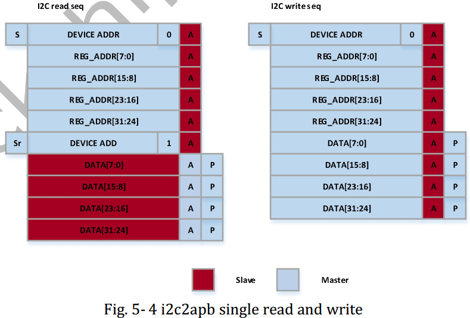

# Rockchip MCU + RK628 Porting Guide

文件标识：RK-YH-YF-287

发布版本：V1.1.0

日期：2021-05-28

文件密级：□绝密   □秘密   □内部资料   ■公开

**免责声明**

本文档按“现状”提供，瑞芯微电子股份有限公司（“本公司”，下同）不对本文档的任何陈述、信息和内容的准确性、可靠性、完整性、适销性、特定目的性和非侵权性提供任何明示或暗示的声明或保证。本文档仅作为使用指导的参考。

由于产品版本升级或其他原因，本文档将可能在未经任何通知的情况下，不定期进行更新或修改。

**商标声明**

“Rockchip”、“瑞芯微”、“瑞芯”均为本公司的注册商标，归本公司所有。

本文档可能提及的其他所有注册商标或商标，由其各自拥有者所有。

**版权所有 © 2021 瑞芯微电子股份有限公司**

超越合理使用范畴，非经本公司书面许可，任何单位和个人不得擅自摘抄、复制本文档内容的部分或全部，并不得以任何形式传播。

瑞芯微电子股份有限公司

Rockchip Electronics Co., Ltd.

地址：     福建省福州市铜盘路软件园A区18号

网址：     [www.rock-chips.com](http://www.rock-chips.com)

客户服务电话： +86-4007-700-590

客户服务传真： +86-591-83951833

客户服务邮箱： [fae@rock-chips.com](mailto:fae@rock-chips.com)

---

**前言**

文本主要介绍 RK628 的使用与调试方法。

**读者对象**

本文档（本指南）主要适用于以下工程师：

技术支持工程师

软件开发工程师

**修订记录**

| **版本号** | **作者** | **修改日期** | **修改说明** |
| ---------- | -------- | ------------ | ------------ |
| V1.0.0     | 黄国椿   | 2021-04-06   | 初始发布     |
| V1.1.0     | 陈顺庆   | 2021-05-28   | 增加HDMI输入 |

---

**目录**

[TOC]

---

## Introduction

本文档主要描述 MCU + RK628 的软件配置、移植方法以及调试手段，具体功能描述参考datasheet。


驱动：

```

├── Include
│   ├── panel.h
│   ├── rk628_combtxphy.h
│   ├── rk628_config.h
│   ├── rk628_cru.h
│   ├── rk628_dsi.h
│   ├── rk628.h
│   ├── rk628_lvds.h
│   ├── rk628_post_process.h
│   ├── rk628_registers_dump.h
│   └── rk628_rgb.h
└── Source
	├── panel.c
	├── rk628.c
	├── rk628_combtxphy.c
	├── rk628_config.c
	├── rk628_cru.c
	├── rk628_dsi.c
	├── rk628_lvds.c
	├── rk628_post_process.c
	├── rk628_registers_dump.c
	└── rk628_rgb.c
```

## 平台移植

以下介绍的是基于 GD 的 MCU 环境，所有需要移植或者配置的尽量在 rk628_config.c或者rk628_config.h 中修改。

### 移植平台基础头文件

将第三方的 MCU 平台头文件在 rk628_config.h 中引用：

```c
...

#include <stdio.h>
#include <stdlib.h>
#include <string.h>
#include "gd32f1x0_eval.h"	 //跟平台相关的基础头文件
#include "gd32f1x0.h"		 //跟平台相关的基础头文件
#include "systick.h"		 //跟延时相关实现依赖的头文件
...
```

### 封装 I2C 读写访问接口

RK628D 的地址和数据都是32bit，根据下图 RK628D I2C操作流程封装出访问接口：



注：更多 RK628D i2c 读写流程，请参考对应 TRM 手册。

```c
...
void rk628_i2c_write(uint32_t reg, uint32_t val)
{
	i2c_write(reg, val);	//需要在 MCU 上实现的 i2c 写接口
}

uint32_t rk628_i2c_read(uint32_t reg)
{
	return i2c_read(reg);  //需要在 MCU 上实现的 i2c 读接口
}

void rk628_i2c_update_bits(uint32_t reg, uint32_t mask, uint32_t val)
{
	uint32_t orig, tmp;

	orig = i2c_read(reg);
	tmp = orig & ~mask;
	tmp |= val & mask;
	i2c_write(reg, tmp);
}
...

```

测试 I2C 读写功能可以用 rk628_registers_dump.c 中的接口 dump 出 RK628D 各个寄存器域的当前配置。

### 封装延时相关的接口

```c
...
void mdelay(unsigned long msec)
{
	delay_1ms(1);	//MCU 平台实现
}

/* 可以依据 MCU 平台实现更多精度的延时接口  */
...

```

### main函数

```c
int main(void)
{
	...
	while (1)
	{
		if (!init) {
			//set reset
			gpio_bit_reset(GPIOA, GPIO_PIN_9);
			delay_1ms(6);
			gpio_bit_set(GPIOA, GPIO_PIN_9);

			delay_1ms(1000);
			fwdgt_counter_reload();
			init = 1;
		}

		rk628_init();

		delay_1ms(1000);
	}
}
```

1、reset脚只需要拉一次就可以，所以在初始化之后不需要再拉reset脚。

2、rk628_init()需要循环调用，因为如果是HDMIIN的话，需要检测HDMI的状态和分辨率等的变化。

### 输入输出配置

```c
#define RK628_HDMI_IN
#undef  RK628_RGB_IN

#undef  RK628_RGB_OUT
#define RK628_LVDS_OUT
#undef  RK628_DSI_OUT
```

目前输入有HDMI IN和RGB IN, 输出有RGB,  LVDS,  DSI, CSI, 所以需要配置对应的输入输出，如上配置的是HDMI IN+LVDS OUT.

```c
void rk628_init(void)
{
	static int init = 0;

	if (!init) {
		rk628_grf_init();
		rk628_cru_init();
		rk628_display_enable();

#ifdef RK628_REG_DUMP
		rk628_registers_dump();
#endif
		init = 1;
	}

	rk628_display_work();
}
```

如上代码，如果是RGB IN的话只需要初始调用一次，因为RGB输入源是固定的，在rk628_display_enable()会打显示通路，rk628_display_work()对于除了HDMI IN之外的输入是个空函数。

如果是HDMI IN的话，需要循环调用，因为需要检测状态与分辨率等的变化，所以rk628_display_work()会轮询变化HDMI IN状态的变化。

## Panel 端配置

### Timing 配置

在 rk628_config.c修改配置

```c
static struct drm_display_mode src_mode = {
/* .clock = */ 27000,
/* .hdisplay = */ 480,
/* .hsync_start = */ 479 + 30,
/* .hsync_end = */ 480 + 30 + 6,
/* .htotal = */ 480 + 30 + 6 + 20,
/* .vdisplay = */ 800,
/* .vsync_start = */ 800 + 18,
/* .vsync_end = */ 800 + 18 + 6,
/* .vtotal = */ 800 + 18 + 6 + 12,
/* .flags = */	DRM_MODE_FLAG_PHSYNC | DRM_MODE_FLAG_PVSYNC,
};

static struct drm_display_mode dst_mode = {
/* .clock = */ 27000,
/* .hdisplay = */ 480,
/* .hsync_start = */ 480 + 30,
/* .hsync_end = */ 480 + 30 + 6,
/* .htotal = */ 480 + 30 + 6 + 20,
/* .vdisplay = */ 800,
/* .vsync_start = */ 800 + 18,
/* .vsync_end = */ 800 + 18 + 6,
/* .vtotal = */ 800 + 18 + 6 + 12,
/* .flags = */	DRM_MODE_FLAG_PHSYNC | DRM_MODE_FLAG_PVSYNC,
};

```

如果有用到 scaler，将 scaler source timing 配置到 src_mode，将 scaler out timing 配置到
dst_mode。如果没有用到 scaler，则 src_mode 和 dst_mode 配置相同的目标 timing。

如果用到双 DSI 或 双 LVDS，需要对 src_mode 和 dst_mode 中的
clock、hdisplay、hsync_start、hsync_end 和 htotal 在原有单屏配置基础上乘以2。

### Panel 时序实现

在 panel.c修改实现

```c
/* operation panel rst/enable/power-supply or send cmd for dsi panel */
void panel_pre_enable(void)

/* operation panel backlight */
void panel_enable(void)

/* reverse operation panel_pre_enable/panel_enable */
void panel_disable(void)
```

### DSI panel 初始化序列配置

根据 panel vendor 提供的初始化序列按如下格式配置：

```c
static const uint8_t panel_init_sequence[][7] = {
	{ 0x23, 0x00, 0x02, 0xd1, 0x2e },
	{ 0x23, 0x00, 0x02, 0xd2, 0x32 },
	{ 0x23, 0x00, 0x02, 0xd3, 0x00 },
	{ 0x29, 0x00, 0x04, 0xff, 0x98, 0x81, 0x00 },
};

struct panel_cmd_seq panel_cmd_init_seq = {
	/* .cmd_cnt */ 4,
};

```

panel_init_sequence 是定义的二维数组，第一列表示 data type，第二列表示 mdelays,
第三列表示发送每条命令的 payload_lenth，后面几列都是表示每条命令的 payload。

**常见数据类型**

| **data type** |          **description**            | **packet size** |
| ------------- | ----------------------------------- | --------------- |
|     0x03      | Generic Short WRITE, no parameters  |       short     |
|     0x13      | Generic Short WRITE,  1 parameters  |       short     |
|     0x23      | Generic Short WRITE,  2 parameters  |       short     |
|     0x29      |         Generic long  WRITE,        |       long      |
|     0x05      |   DCS Short WRITE, no parameters    |       short     |
|     0x15      |   DCS Short WRITE,  1 parameters    |       short     |

## 场景应用

### RGB 输入

#### DSI 输出

1、在 rk628.c 中配置 RGB2DSI 显示通路：

```c
void rk628_init(void)
{
	rk628_grf_init();
	rk628_cru_init();
	rk628_rgb_rx_enable();		//使能 rk628D RGB_RX
	rk628_post_process_init();
	rk628_post_process_enable();
	rk628_dsi_enable();		//使能 RK628D DSI_TX
	rk628_registers_dump();
}
```

注：rk628_grf/cru/post_process 这些接口一般不需要修改。

2、在 panel.c 中配置 dsi panel 的初始化序列(参考 DSI panel 初始化序列配置)，并在屏上电阶段发送：

```c
void panel_pre_enable(void)
{
	/* operation panel rst/enable/power-supply */

	/* option call panel_simple_xfer_dsi_cmd_seq()
	 * only if encoder is dsi.
	 */
	panel_simple_xfer_dsi_cmd_seq();
}
```

3、在 rk628_config.c 中配置dsi host如下信息选择配置单 DSI 或者 双 DSI：

**属性说明**

| **Property** |     **Description**     | **Option Value** |
| ------------- | ------------------------ | ------------------ |
|      bpp      |     bits for a pixel     |       16/18/24     |
|   bus_format  |     color mapping        |MIPI_DSI_FMT_RGB888/RGB666/RGB666_PACKED/RGB565|
|    lanes      |   select dsi host lanes  |       1/2/4        |
|    slave      |     dual channel dsi     |    TRUE/FALSE      |
|    master     |     dual channel dsi     |    TRUE/FALSE      |
|    flags      |  hsync/vsync polarity    |0/DRM_MODE_FLAG_NHSYNC |

注：除了表格中描述的属性可以根据 option value 做修改外，其他属性不建议修改。

##### 单 DSI 输出

```c
/* config dsi0 */
static struct rk628_dsi rk628_dsi0 = {
	/* .bpp = */ 24,
	/* .bus_format */ MIPI_DSI_FMT_RGB888,
	/* .slave = */ FALSE,
	/* .master = */ FALSE,
	/* .channel = */ 0,
	/* .reg_base */ 0x50000,
	/* .lanes */ 4,
	/* .id */ 0,
	/* .flags = */ DRM_MODE_FLAG_NHSYNC | DRM_MODE_FLAG_NVSYNC,
	/* .mode_flags */ MIPI_DSI_MODE_VIDEO | MIPI_DSI_MODE_VIDEO_BURST | MIPI_DSI_MODE_LPM | MIPI_DSI_MODE_EOT_PACKET,
};

/* config dsi1 for dual channel dsi */
static struct rk628_dsi rk628_dsi1 = {
	/* .bpp = */ 24,
	/* .bus_format */ MIPI_DSI_FMT_RGB888,
	/* .slave = */ FALSE,
	/* .master = */ FALSE,
	/* .channel = */ 0,
	/* .reg_base */ 0x60000,
	/* .lanes */ 4,
	/* .id */ 0,
	/* .flags = */ DRM_MODE_FLAG_NHSYNC | DRM_MODE_FLAG_NVSYNC,
	/* .mode_flags */ MIPI_DSI_MODE_VIDEO | MIPI_DSI_MODE_VIDEO_BURST | MIPI_DSI_MODE_LPM | MIPI_DSI_MODE_EOT_PACKET,
};

```

##### 双 DSI 输出

修改 rk628_dsi0 slave 为 TRUE，rk628_dsi1 master 为 TRUE：

```c
/* config dsi0 */
static struct rk628_dsi rk628_dsi0 = {
	/* .bpp = */ 24,
	/* .bus_format */ MIPI_DSI_FMT_RGB888,
	/* .slave = */ TRUE,
	/* .master = */ FALSE,
	/* .channel = */ 0,
	/* .reg_base */ 0x50000,
	/* .lanes */ 4,
	/* .id */ 0,
	/* .flags = */ DRM_MODE_FLAG_NHSYNC | DRM_MODE_FLAG_NVSYNC,
	/* .mode_flags */ MIPI_DSI_MODE_VIDEO | MIPI_DSI_MODE_VIDEO_BURST | MIPI_DSI_MODE_LPM | MIPI_DSI_MODE_EOT_PACKET,
};

/* config dsi1 for dual channel dsi */
static struct rk628_dsi rk628_dsi1 = {
	/* .bpp = */ 24,
	/* .bus_format */ MIPI_DSI_FMT_RGB888,
	/* .slave = */ FALSE,
	/* .master = */ TRUE,
	/* .channel = */ 0,
	/* .reg_base */ 0x60000,
	/* .lanes */ 4,
	/* .id */ 0,
	/* .flags = */ DRM_MODE_FLAG_NHSYNC | DRM_MODE_FLAG_NVSYNC,
	/* .mode_flags */ MIPI_DSI_MODE_VIDEO | MIPI_DSI_MODE_VIDEO_BURST | MIPI_DSI_MODE_LPM | MIPI_DSI_MODE_EOT_PACKET,
};
```

#### LVDS 输出

1、在 rk628.c 中配置 RGB2LVDS 显示通路：

```c
void rk628_init(void)
{
	rk628_grf_init();
	rk628_cru_init();
	rk628_rgb_rx_enable();		//使能 rk628D RGB_RX
	rk628_post_process_init();
	rk628_post_process_enable();
	rk628_lvds_enable();		//使能 RK628D LVDS_TX
	rk628_registers_dump();
}
```

2、在 rk628_config.c 中配置 LVDS 输出类型：

**属性说明**

|	    **property**	  |		**description**         |
| ------------------------------- | ----------------------------------- |
|LVDS_SINGLE_LINK		  |     单通道LVDS                      |
|LVDS_DUAL_LINK_ODD_EVEN_PIXELS   |    双通道LVDS，左右通道为奇偶通道   |
|LVDS_DUAL_LINK_EVEN_ODD_PIXELS   |    双通道LVDS，左右通道为偶奇通道   |
|LVDS_DUAL_LINK_LEFT_RIGHT_PIXELS |     双通道LVDS，左右通道为左右屏     |
|LVDS_DUAL_LINK_RIGHT_LEFT_PIXELS |     双通道LVDS，左右通道为右左屏     |

##### 单 LVDS 输出

```c
uint32_t rk628_lvds_get_link_type(void)
{
	return LVDS_SINGLE_LINK;
}
```

##### 双 LVDS 输出

```c
uint32_t rk628_lvds_get_link_type(void)
{
	return LVDS_DUAL_LINK_ODD_EVEN_PIXELS;
}
```

注：根据屏规格可以选择配置双通道 LVDS 的奇偶特性。

##### 双 LVDS 左右屏

```c
uint32_t rk628_lvds_get_link_type(void)
{
	return LVDS_DUAL_LINK_LEFT_RIGHT_PIXELS;
}
```

注：根据硬件设计可以选择配置双通道 LVDS 的左右输出。

### HDMI输入

#### 配置HDMI输入

```c
#define RK628_HDMI_IN
```

#### HDMI检测脚配置

```c
#define HDMIRX_DET_PORT			GPIOA
#define HDMIRX_DET_PIN			GPIO_PIN_8
```

#### HPD输出配置

因为硬件的设计问题，有些硬件HDP需要低有效，所以如果是低有效的话，需要定义下面的宏：

```c
#define HDMIRX_HPD_INVERTED
```

#### 注意事项

1. HDMIRX对时钟率点有要求，目前只支持下面这些率点：

   ```c
   27M, 64M, 74.25M, 148.5M, 297M, 594M
   ```

2. 因为HDMI输入的分辨率、颜色格式等是可能被切换的，因为率点参数计数比较耗时，所以切分辨率过程时间可能会比较长，大概需要几秒钟。