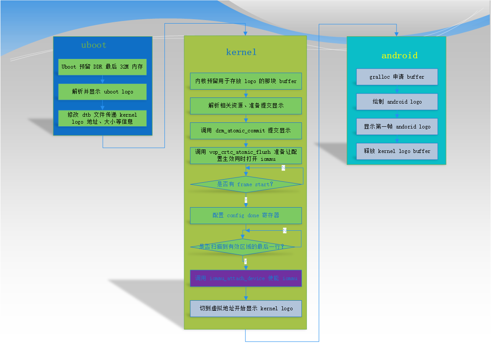
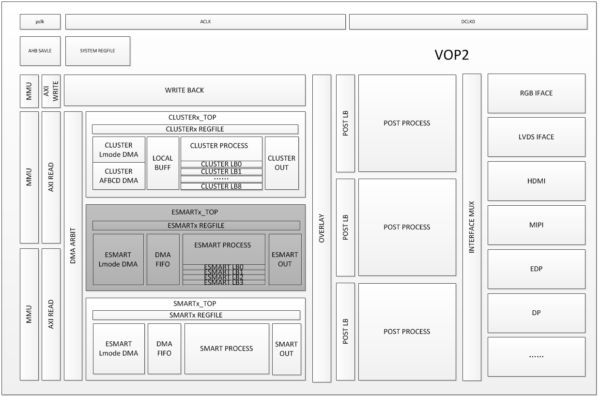
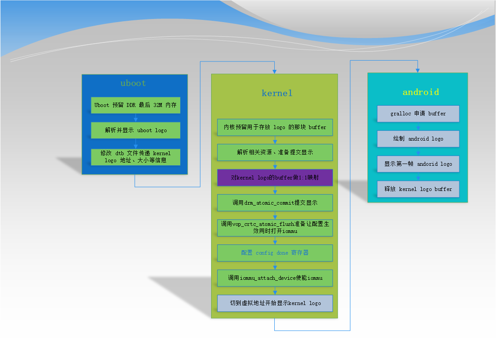

# Uboot Logo 切换到 Kernel Logo 优化方案

文件标识：RK-KF-YF-116

发布版本：V1.0.0

日期：2020-06-01

文件密级：□绝密   □秘密   ■内部资料   □公开

---

**免责声明**

本文档按“现状”提供，瑞芯微电子股份有限公司（“本公司”，下同）不对本文档的任何陈述、信息和内容的准确性、可靠性、完整性、适销性、特定目的性和非侵权性提供任何明示或暗示的声明或保证。本文档仅作为使用指导的参考。

由于产品版本升级或其他原因，本文档将可能在未经任何通知的情况下，不定期进行更新或修改。

**商标声明**

“Rockchip”、“瑞芯微”、“瑞芯”均为本公司的注册商标，归本公司所有。

本文档可能提及的其他所有注册商标或商标，由其各自拥有者所有。

**版权所有© 2020瑞芯微电子股份有限公司**

超越合理使用范畴，非经本公司书面许可，任何单位和个人不得擅自摘抄、复制本文档内容的部分或全部，并不得以任何形式传播。

瑞芯微电子股份有限公司

Rockchip Electronics Co., Ltd.

地址：     福建省福州市铜盘路软件园A区18号

网址：     [www.rock-chips.com](http://www.rock-chips.com)

客户服务电话： +86-4007-700-590

客户服务传真： +86-591-83951833

客户服务邮箱： [fae@rock-chips.com](mailto:fae@rock-chips.com)

---

**前言**

**概述**

**读者对象**

本文档（本指南）主要适用于以下工程师：

Rockchip 图形/显示模块开发工程师

**修订记录**

| **版本** | **作者** | **日期**   | **修改说明** |
| --------- | --------- | ---------- | -------------- |
|  V1.0.0   | 黄家钗 | 2020-06-01 | 初始版本     |
|  |  |  |  |

---

[TOC]

---

## 现有设计的问题及目前使用的方案

### 现有设计问题

目前 Rockchip 部分平台的 VOP IOMMU 模块使能为实时生效，而 VOP 图层大小、地址等信息的配置需要帧生效，这样在 uboot logo 切到 kernel logo 的过程中就容易出现 iommu 使能了但是内核 logo 的虚拟地址还未生效，导致 iommu pagefault 问题。

针对这个设计问题，现在软件上通过在等到场消隐期的时候去使能 iommu 来规避此问题，代价是开 iommu 前需要关闭所有中断让 CPU 轮训 VOP 的状态寄存器，最长可能需要轮询一个 vysnc 周期。

### 目前方案流程图



## VOP 2.0 可能引入的新问题及优化后的新方案说明

### VOP 2.0 可能引入的新问题

VOP 2.0 支持3个 output port，但是只有2个 iommu 硬件模块，也就是说其中2个 output port 需要共享一个 iommu 硬件模块，这在 uboot logo 切到 kernel logo 阶段就存在到底以哪个 output port 的 vsync 作为使能 iommu 时间点的问题， 两个 output port 的帧率和扫描时序肯定无法做到完全同步，这样之前的软件方案就无法解决这种设计问题。

VOP 2.0 设计框图：



### 优化后的新方案

针对以上问题，建议 IC 加入一个新的控制位用来决定每一个 output port 是否真正使能 iommu 模块，如果这样现有的软件方案即可解决物理地址切换到虚拟地址过度问题，同时为了防止 IC 新加的控制位可能存在问题导致无法正常使用以及为了对当前软件流程的优化，我们实现以下新的软件方案：

即我们在内核拿到预留的物理地址的时候对这块 buffer 做1：1映射，这样 VOP 在访问这块 buffer 的时候不管 iommu 是否打开，都可以正常访问物理地址，以下是新方案的流程图：



## 新方案的好处以及一些疑虑

### 好处

- 不需要轮询等 vsync，可以在任意时间点使能 iommu 模块，可以节省 CPU 资源和减少开机时间；
- 兼容旧的 VOP 设计以及 VOP 2.0设计；
- 精简了很多等 vsync 的软件流程；

### 疑虑

kernel logo 预留 buffer 做1：1 映射的时候占用的虚拟地址是否会和系统起来后申请的 buffer map 冲突，即系统起来后申请的 buffer 在map 虚拟地址的时候是否会刚好需要映射到 kernel logo buffer 的物理/虚拟地址空间？

按我们现有设计方案是不会的，原因是：

1. kernel logo 预留的 buffer 是 uboot 根据 DDR 容量自动选取 DDR 最后面的 32M ，所以此时物理地址和1：1 映射后的虚拟地址都在 DDR 最尾部的32M；

2. kernel drm 驱动在 drm_mm_init 配置虚拟地址是从0地址开始，也就是说应用申请内存做 map 的时候也是从0地址开始；

3. kernel logo 预留的 buffer 在 android 刷第一帧的时候就释放；

4. 通过 drm 申请的内存只是 DDR 容量的一部分；

## 代码提交信息

```c
commit a2b890ee27360ba23c3097ad25e087b1feae9628
Author: Sandy Huang <hjc@rock-chips.com>
Date:   Tue Jun 2 17:11:46 2020 +0800

    drm/rockchip: vop: after create 1:1 mapping no need to wait vblank

    after create 1:1 mapping, we can enable iommu at any time, because
    whether the iommu is enable or not, the VOP can access the correct
    phy addr.

    dma_addr----->iommu module---->phy addr
            |                       |
            |---------bypass--------|

    Change-Id: I50f6a897d90c33e5bd0fba099654ce788d3d647d
    Signed-off-by: Sandy Huang <hjc@rock-chips.com>

commit adb1aa5ebea1a77c6d4d8676045694b8a45a697e
Author: Sandy Huang <hjc@rock-chips.com>
Date:   Tue Jun 2 17:05:13 2020 +0800

    drm/rockchip: add support drm logo buffer 1:1 mapping

    we reserved the DDR last 32M as uboot logo and kernel logo, here we
    create 1:1 mapping for this buffer, this is prepare for uboot logo phy
    addr switch to kernel logo vir addr and iommu enable.

    Change-Id: I090665f29f7f4f7cf5456b9edbddea60485376cf
    Signed-off-by: Sandy Huang <hjc@rock-chips.com>
```

