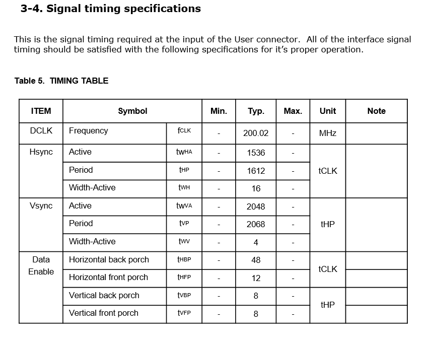
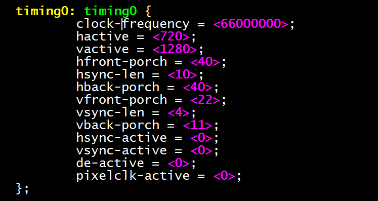

# Rockchip VOP DCLK 调整实验

文件标识：RK-GL-YF-001

发布版本：V1.0.0

日期：2019-12-26

文件密级：内部资料

---

**免责声明**

本文档按“现状”提供，福州瑞芯微电子股份有限公司（“本公司”，下同）不对本文档的任何陈述、信息和内容的准确性、可靠性、完整性、适销性、特定目的性和非侵权性提供任何明示或暗示的声明或保证。本文档仅作为使用指导的参考。

由于产品版本升级或其他原因，本文档将可能在未经任何通知的情况下，不定期进行更新或修改。

**商标声明**

“Rockchip”、“瑞芯微”、“瑞芯”均为本公司的注册商标，归本公司所有。

本文档可能提及的其他所有注册商标或商标，由其各自拥有者所有。

**版权所有© 2019福州瑞芯微电子股份有限公司**

超越合理使用范畴，非经本公司书面许可，任何单位和个人不得擅自摘抄、复制本文档内容的部分或全部，并不得以任何形式传播。

福州瑞芯微电子股份有限公司

Fuzhou Rockchip Electronics Co., Ltd.

地址：     福建省福州市铜盘路软件园A区18号

网址：     [www.rock-chips.com](http://www.rock-chips.com)

客户服务电话： +86-4007-700-590

客户服务传真： +86-591-83951833

客户服务邮箱： [fae@rock-chips.com](mailto:fae@rock-chips.com)

**读者对象**

本文档（本指南）主要适用于以下工程师：

Rockchip 内部显示模块相关开发工程师

---

**修订记录**

| **版本号** | **作者** | **修改日期** | **修改说明** |  |  |
| ---------- | --------| :--------- | ------------ | ---------- | ---------- |
| V1.0.0    | 闫孝军 | 2019-11-27 | 初始版本     |  |  |

**目录**

---
[TOC]
---

## 概述

在 Rockchip DSS 系统中，从 VOP 到屏幕大多采用 VOP——》Connector——》Panel 的数据传输通路，比如：

MIPI：VOP——》MIPI DSI——》 MIPI Panle

eDP：VOP——》eDP TX ——》 eDP Panel

LVDS：VOP——》LVDS TX——》 LVDS Panle

HDMI：VOP——》HDMI TX——》 HDMI Panel

这这个连接通路中，VOP 在 DCLK 的驱动下以固定的频率把显示数据送到 connector，connector 以特定方式打包编码后再发送到屏幕端。

从 MIPI 和 eDP 的协议 SPEC 中，我们有如下猜想：

1. DCLK 只影响 VOP 和 connector 之间的数据传送速率，connector 和 panel 之间的数据传输速率是和 DCLK 独立的，因为 MIPI DSI 和 eDP TX 的 PHY 内部都另外有一路 24M 的时钟源来自建 clk。
2. MIPI 和 eDP 的 HBLANK(hfront/back-porch hsync-len) 参数可以任意调整，对屏幕无影响。

如果这个推测成立，则在实际应用中，我们就不需要严格按照屏幕 spec 分配准确的 DCLK 给 VOP，只需要选一个 CRU 容易给出的和屏幕 spec 比较接近的 DCLK 频率，然后再配合调整屏幕的 HBLANK 参数让帧率接近屏幕 spec 典型值，这样就能做到即不给系统时钟分配方案增加过多限制又能让屏幕匹配 SPEC 典型帧率。

LVDS、HDMI 则无法做这种调整，LVDS 总线上数据传输速率 和 DCLK 保持 7 倍关系。所以改变了 DCLK 相当于修改了刷新率。HDMI 总线上传输的数据和 DCLK 也有特定的关系。

## 实验

### eDP 屏幕

| 硬件平台                  | 内核版本     | commit       | 实验人 |
| ------------------------- | ------------ | ------------ | ------ |
| RK3399-EXCAVATOR-MAIN_V13 | develop-4.19 | a406dddaf921 | 闫孝军 |

该 EVB上搭配的屏幕为 eDP接口，分辨率为 1536x2048，DCLK  典型值 200MHZ。

1. 在不改变行场参数的情况下，DCLK 可以上调至 210MHZ(+5%), 显示正常。

2. 在不改变行场参数的情况下，DCLK 上调至 220MHZ(+10%), 水平方向显示异常。
3. DCLK 上调至 220MHZ(+10%), HBLANK 增加 117，这样刷一行的时间保持不变，屏幕刷新率仍然为 60HZ，屏幕显示正常。
4. DCLK 上调至 230MHZ(+15%), HBLANK 增加 195， 刷一行的时间保持不变，屏幕刷新率任为 60HZ，水平方向屏幕显示异常。
5. 下调 DCLK 到 180MHZ(-10%), 同时减少 HBLANK，发现 HBLANK 如果减少过多(HBP=HFP=5)，水平方向屏幕显示会异常。

针对现象 1~4 和 IC 同事讨论：在 eDP 控制器内部，line buffer 很小，远远不够一行，即 eDP 控制器接收 VOP 送出来的数据到 line buffer 中，line buffer 满后，立刻发送到屏幕，在屏幕上显示一行，要经过几次这样的接收、发送的循环，如果 VOP 送数据的速度过快，超过了 eDP 发送的速率(eDP 发送数据的速率是固定的，1.62Gbps、2.7Gbps、5.4Gbps)，line buffer 里面旧的数据旧会被覆盖掉，水平方向上就会看到显示的数据异常。

实验 1~4 提高 DCLK 的频率，实际上等效于提高了 VOP 的数据发送速率，然后我们增加了 HBLANK，只是增加了 HBLANK 的时间，来弥补发送有效数据时间的减少，来保持 VOP 刷一整行的总时间不变，但是 eDP 发送  linebuffer 中数据的时间窗口还是变小了，所以 DCLK 提高过多，显示仍然会异常。

实验3~5 说明，HBLANK 的长短也会影响到屏幕显示，从 eDP 协议 SPEC 看，H/V Blank 期间，eDP 都会传递一些打包的信息，比如 V Blank 期间会传递  frame info。具体传递的详细内容后面需要继续研究。

### MIPI 屏幕

| 硬件平台              | 内核版本     | commit       | 实验人 |
| --------------------- | ------------ | ------------ | ------ |
| RK_EVB_RK3326_LP3_V10 | develop-4.19 | a406dddaf921 | 闫孝军 |

该 EVB 板上配套的屏幕为 MIPI 接口，分辨率为 720x1280，DCLK 典型值为 66MHZ。

1. 在不改变行场参数的情况下，DCLK 上调至 72MHZ(+10%)， 显示正常。
2. 在不改变行场参数的情况下，DCLK 上调至 78MHZ(+20%)，进 Android 主界面，发现显示有水波纹。
3. 在 2 的基础上，HBLANK 增加 276，使刷一行的总时间保持为典型值不变，屏幕显示正常。
4. DCLK 上调至 132MHZ(+100%), HBLANK 增加 1575，使刷一行的总时间保持不变，屏幕显示正常。
5. DCLK 下调至 60MHZ，同时下调 HBLANK(HSYNC=HFB=HBP=10), 屏幕显示正常。
6. DCLK 下调至 60MHZ，同时下调 HBLANK(HSYNC=10, HFB=HBP=1), 屏幕显示变色

针对上述实验现象和 IC 同事讨论确认：MIPI 控制器里面的 line buffer 比较大，一次可以接收 VOP 发送过来一行的数据，接受完了再发送给 MIPI 屏幕。提高 VOP DCLK 虽然提高了 VOP 的发送频率，但是通过增加 HBLANK ，可以增加 HBLANK 时间，从而使 VOP 发送两行显示数据的间隔保持和典型值一致，不会影响 line buffer的数据发送。

HBLANK 调小显示异常的原因暂时还解释不清楚。

从实验看， MIPI 在 VOP 能保证发送数据帧率不超标的情况下，比较能容忍 VOP DCLK 频率的提高。
