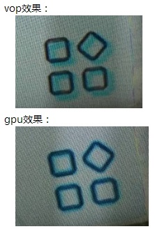
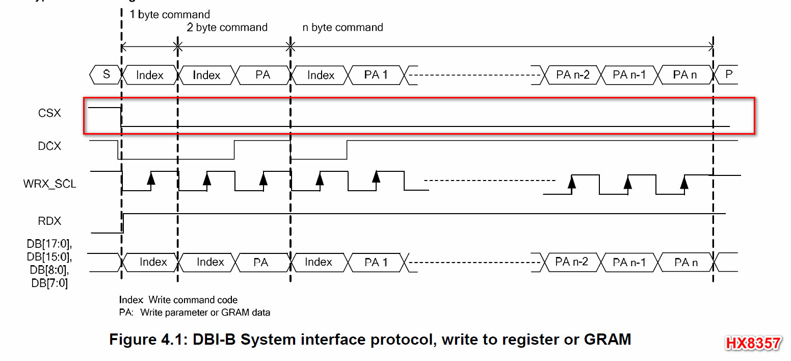
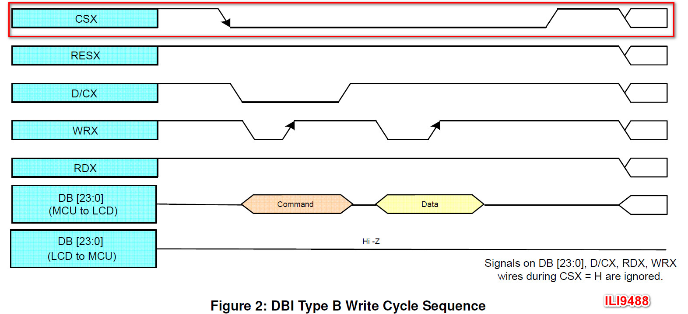
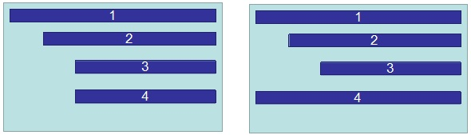
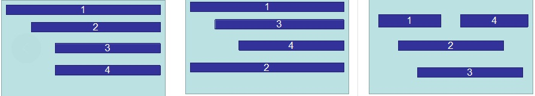

# Rockchip VOP Notes

文件标识：RK-KF-YF-086

发布版本：V1.2.0

日期：2020-06-17

文件密级：□绝密   □秘密   ■内部资料   □公开

---

**免责声明**

本文档按“现状”提供，福州瑞芯微电子股份有限公司（“本公司”，下同）不对本文档的任何陈述、信息和内容的准确性、可靠性、完整性、适销性、特定目的性和非侵权性提供任何明示或暗示的声明或保证。本文档仅作为使用指导的参考。

由于产品版本升级或其他原因，本文档将可能在未经任何通知的情况下，不定期进行更新或修改。

**商标声明**

“Rockchip”、“瑞芯微”、“瑞芯”均为本公司的注册商标，归本公司所有。

本文档可能提及的其他所有注册商标或商标，由其各自拥有者所有。

**版权所有© 2020福州瑞芯微电子股份有限公司**

超越合理使用范畴，非经本公司书面许可，任何单位和个人不得擅自摘抄、复制本文档内容的部分或全部，并不得以任何形式传播。

福州瑞芯微电子股份有限公司

Fuzhou Rockchip Electronics Co., Ltd.

地址：     福建省福州市铜盘路软件园A区18号

网址：     [www.rock-chips.com](http://www.rock-chips.com)

客户服务电话： +86-4007-700-590

客户服务传真： +86-591-83951833

客户服务邮箱： [fae@rock-chips.com](mailto:fae@rock-chips.com)

---

**前言**

本文主要对 Rockchip 各平台 VOP 模块的一些特殊 feature 或者已知 bug 做下备忘录，这样可以对这些 bug 有更好的追踪，同时也方便其他图形、显示模块开发工程师对 VOP 模块使用上的限制有清楚的了解。

**概述**

**读者对象**

本文档（本指南）主要适用于以下工程师：

Rockchip 图形/显示模块开发工程师

**修订记录**

| **版本** | **作者** | **日期**   | **修改说明** |
| --------- | --------- | ---------- | -------------- |
|  V1.0.0   | 黄家钗 | 2020-05-20 | 初始版本     |
| V1.1.0 | 闫孝军 | 2020-05-25 | 加入 MCU 接口描述 |
| V1.2.0 | 黄家钗 | 2020-06-17 | 加入VOP full RGB88格式问题 |

---

[TOC]

---

## VOP 架构版本

目前 Rockchip 平台 VOP 模块主要区分 full 架构和 lite 架构，lite架构是 Rockchip 平台第一代视频输出处理模块，最大可以支持到 2k 分辨率；full 架构基于 lite 架构做了全新设计和升级，最大可以支持到 4k 分辨率。

以下是各个平台 VOP 的版本信息：

| VOP 架构 | SOC                                                          |
| -------- | ------------------------------------------------------------ |
| VOP lite | RK3066/PX2/RK3188/PX3/RK3036/RK312X/PX3se/Sofia 3G-R/RV1108/RK3326/PX30/<br/>RK3308/RK1808/RK2108/RV1109/RV1126 |
| VOP full | RK322X/RK332X/RK322XH/RK3368/PX5/RK3399                      |

## VOP lite 版本共性问题

1. 鼠标层不支持虚宽；
2. 更新 lut 寄存器需要先 disable lut，无法动态更新；
3. 不支持像素小于等于 2x2 的缩放，和 IC 确认现有平台图层的最小尺寸规格统一为 4x4；
4. 不支持 alpha+scale 模式；
5. 不支持 global alplha * pixel alpha 模式；

## VOP full 版本共性问题

1. 鼠标层不支持虚宽；

2. 更新 lut 寄存器需要先 disable lut，无法动态更新；

3. 不支持像素小于等于 2x2 的缩放，和IC确认现有平台图层的最小尺寸规格统一为 4x4；

4. AFBDC/IFBDC 不支持 4K 输入；

5. 4K 分辨率情况下不支持缩放，导致 HDMI 3840 和 4096 分辨率之间切换时无法做到点对点显示；

6. YUV420 数据显示出现 uv 错位问题，和 IC 确认是由于 VOP 做 YUV420 上采样到 YUV444 导致 uv 数据偏移，通过 SCL_OFFSET 调整 uv offset 稍有改善但是和走 GPU 合成对比效果差距明显，以下是具体效果：

   

7. 处理 RGB888 格式时 Red、Blue 两种颜色反掉问题：

   RGB888 格式的数据内存中从高位到低位分别是 R[7,0], G[7,0], B[7,0]，而 VOP full 版本在处理这种格式时把高 8bit 当作蓝色分量，低 8bit 当作红色分量，导致 R、B 两种颜色颠倒；

   VOP full 处理 ARGB8888/RGB565 以及 VOP lite 处理 ARGB8888/RGB888/RGB565 时高位按 Red 分量处理，低位按 Blue 分量处理，显示正常。

   uboot 提交信息：

   ```c
   commit f4e3a1733233bf759ab0c517e4e222273bda333e
   Author: Sandy Huang <hjc@rock-chips.com>
   Date:   Wed Jun 17 15:32:11 2020 +0800

       drm/rockchip: change 8bit bmp decoder result from BGR565 to RGB565

       Signed-off-by: Sandy Huang <hjc@rock-chips.com>
       Change-Id: I0ca715bd69bc9ff1a61c98f766ecab2458737b27

   commit 59cf3802954fce437255445eea1333f3dc8407a9
   Author: Sandy Huang <hjc@rock-chips.com>
   Date:   Tue Jun 16 18:21:31 2020 +0800

       drm/rockchip: fix rgb888 format color incorrect

       vop full need to do rb swap when deal with rgb888/bgr888;

       Signed-off-by: Sandy Huang <hjc@rock-chips.com>
       Change-Id: I60fac72b21720fcf4f406c56fe7d9dc21ebf7635
   ```

   kernel 提交信息：

   ```c
   commit afa25c0117e86a95ae5f7edfe063f7c7ef63530c
   Author: Sandy Huang <hjc@rock-chips.com>
   Date:   Fri May 15 14:40:00 2020 +0800

       drm/rockchip: vop: fix rb swap error when deal with rgb888 format

       1. VOP full need to do rb swap to show rgb888 format color correctly
       2. uboot change bmp decoder result from BGR565 to RGB565 format;

       so this commit depend on uboot commit:
           59cf3802954 ("drm/rockchip: fix rgb888 format color incorrect")
           f4e3a173323 ("drm/rockchip: change 8bit bmp decoder result")

       Change-Id: I2e0329b8c3f35d4ec1e224f0570575934c889dca
       Signed-off-by: Sandy Huang <hjc@rock-chips.com>
   ```

## MCU(i8080) 接口问题

1. **MCU 接口没有区分命令和显示数据**

   MCU 接口上传输的不仅有送屏幕显示的数据，还有对屏幕的控制命令，但是目前 RK VOP 并没有对命令和显示数据做区分，这导致如果开启了 dither 模式，发送给屏幕的命令也会被当作显示数据进行 dither 处理，导致最终发送到屏幕的命令发生变化，无法被屏幕正确接收。

   按照 VOP 的设计逻辑，只要屏幕是非 24 bit 的，即使没有开启 dither up/down 控制位，VOP 也会对命令按照丢弃低位的模式做 24—>18/16 的转换，导致最终发送出去的命令被改变。

   Dither 是为了优化非 24 位屏幕显示效果的一种非常有用的功能，关闭该功能会导致很多场景下显示过度不自然，呈现色阶现象。

   针对这个问题，目前我们有两种 workaround 方式：

   1. 把命令字按 RGB 三原色拆分，然后再向高位移位的方式扩展成 24 位(因为 dither 只会对每个颜色的低位进行处理)，来规避 dither 处理带来的改变。

      ```c
      RGB565->RGB888:
      B = cmd & 0x1f; G = (cmd & 0xe0) >> 5; R = 0
      B + (G << (8 + (8 - 6))) + R
      RGB666->RGB888:
      B = cmd & 0x3f; G = (cmd & 0xc0) >> 6; R = 0
      B + (G << (8 + (8 - 6))) + R
      ```

      补丁如下：

      ```c
      commit e0d873e8159d2b1941b9d9441b561d6e9545b7ba
      Author: Andy Yan <andy.yan@rock-chips.com>
      Date:   Wed May 13 15:45:34 2020 +0800

          drm/rockchip: Convert MCU cmd from rgb565/rgb666 to rgb888

          VOP wrongly treated MCU cmd as normal rgb data and pass it
          to dither module when output mode is rgb565/rgb666, then
          the cmd output from vop io is changed.

          Here we convert the MCU cmd data from rgb565/rgb666 to rgb88,
          so that we can get the original cmd data after dither module.

          Signed-off-by: Andy Yan <andy.yan@rock-chips.com>
          Change-Id: I7919dfb9d4f6279b82636d68cd7b211047bf1b46
      ```

      这种方案的缺点是：每次发命令的时候(init、suspend、resume)移位拼接操作需要消耗一定的 CPU 时间。

      从目前 upstream 的趋势看，屏幕会作为一个跨平台的驱动独立存在，所以并不好去单独修改屏幕的驱动来适配 RK 这一个特殊的平台，只能把这个移位扩展的操作放在 VOP 驱动中。

      而且，VOP 开关的初期，有可能存在一个无 dither 的中间态(比如 mcu hold 功能开启导致后面 output mode 跟新不生效)，导致扩展成 24 位后反而出错。

   2. 利用 VOP 的 MCU_HOLD

      MCU 发送命令的时候，需要打开 MCU_HOLD，MCU_HOLD 打开后，后续对 output mode、dither 的设置不会立刻生效，需要等待 MCU 屏幕发送命令的过程完成，释放 MCU_HOLD 后，output mode 和  dither 相关设置才会生效。所以可以利用这一特性，如果使用的是 MCU 接口的屏幕，初始化的时候先打开 MCU_HOLD、再设置 outpu mode、dither 等功能，这时候由于 MCU_HOLD 的作用，output mode 和 dither 的设置不会生效，可以正确的把 MCU 初始化命令发送出去。

      补丁如下：

      ```
      commit cb6bdbb8745276f58a150d0255869e1b0ece3702
      Author: Andy Yan <andy.yan@rock-chips.com>
      Date:   Fri May 15 10:55:42 2020 +0800

          drm/rockchip: vop: Set mcu mode before setting output mode and dither

          When drive vop into mcu mode with mcu_hold enabled,
          the following setting of output mode and dither will
          not take effect until mcu_hold released.

          So we can send mcu cmd at the default output P888 mode,
          this give us a changce to avoid the cmd data to be changed
          by dither module.

          Change-Id: I6b0a23d2cfdacd9b81d0956bea6cedd2dcdde4f6
          Signed-off-by: Andy Yan <andy.yan@rock-chips.com>

      drivers/gpu/drm/rockchip/rockchip_drm_vop.c
      ```

      这个方案也有其局限性：屏幕初始化的时候可以正常工作，但是如果系统要进入 suspend ，需要对屏幕发命令让屏幕进入 standby 模式的话，由于系统正常工作模式下 output mode 和 dither 功能都已经生效，这时候 MCU_HOLD  就无法消除 dither对 MCU 命令的改变。所以目前系统休眠的时候，直接对屏幕下电复位，忽略对 standby 命令的处理。

      相比之下，第二种方案的代价最小，所以我们暂时使用第二种方案。

2. **MCU 模式下 dither 处理错误**

   MCU 模式下会对  CRU 送给 VOP 的 dclk 再进行 mcu_pix_total 级分频，即每 mcu_pix_total 个 dclk cycle 传输一个像素。

   但是 VOP 在进行 dither 处理的时候，却误认为传输了 mcu_pix_total 个像素，导致整个 dither 逻辑出错。最终 dither 后在屏幕上显示的数据有噪点(qt **sub-attaq**)。甚至遇到某些显示的场景，屏幕无法显示正确的动态画面，处于卡死状态(qt 的 **deform** )，需要对屏幕进行复位才能退出这种状态。

   该问题目前没有可以规避的方案，只能关闭 dither 功能，代价是在很多场景下，屏幕上会出现过渡不自然的色阶。

3. **CS、RD 时序不规范**

   RD 为读使能信号，在写操作的时候，RD 应该保持为高电平，但是在 RK 平台上却表现为方波。而且 RK VOP 并不支持 MCU 读功能。

   CS 是 MCU 屏幕的 chip select 信号，在目前能看到的几款屏幕 spec 上，要求选中屏幕时，该信号为稳定的低电平，但是 RK VOP 输出的却是方波信号。

   

   

按照 IC 的解释，这三个 MCU 相关的问题，在 RK 所有的 VOP(RK3308 除外) 上都存在。

## 各平台特殊问题

### RK3288

1. auto gating 功能和 bcsh 功能无法同时使用，否则帧中断无法产生，该问题在  RK3288W 上已修正；

2. yuv 切到 rgb 需要软件对图层缩放相关寄存器做复位处理,修改方法：

   ```c
	static void vop_win_disable(struct vop *vop, struct vop_win *win)
	{
	    ……
   	/*
   	 * FIXUP: some of the vop scale would be abnormal after windows power
   	 * on/off so deinit scale to scale_none mode.
   	 */
   	if (win->phy->scl && win->phy->scl->ext) {
	        VOP_SCL_SET_EXT(vop, win, yrgb_hor_scl_mode, SCALE_NONE);
	        VOP_SCL_SET_EXT(vop, win, yrgb_ver_scl_mode, SCALE_NONE);
	        VOP_SCL_SET_EXT(vop, win, cbcr_hor_scl_mode, SCALE_NONE);
	        VOP_SCL_SET_EXT(vop, win, cbcr_ver_scl_mode, SCALE_NONE);
	}
		……
	}
   ```

3. 部分版本的芯片 aclk 和 dclk 有同源的要求，在 pll 驱动中有做版本判断；

4. 不支持 interlace 的时序；

5. 多区域在带宽不够的情况下会出现 pagefault 问题；

6. 多区域限制：

   (1) 同一扫描线 上只能有一个区域；

   (2) 多区域不能重叠；

   (3) 多区域需要从上到下排列；

   (4) 多区域只能为相同的格式；

   (5) 按区域1-2-3-4顺序使用；

   (6) 可以支持的使用范例：

    

### RK3036

1. win1 支持缩放但不支持 yuv 格式，最大只能支持 720p 输入，win0 最大可以支持 yuv/rgb 1080p 输入；

### RK3128/PX3SE

1. mmu 的寄存器可以写但是不能读，dts 按如下配置，mmu 驱动不去读 iommu 寄存器：

	```c
	&vop_mmu {
		rockchip,skip-mmu-read;
	};
	```

### RK322X

1. 图层 RGB 和 YUV 数据切换有问题，rk fb 框架的处理方法是在切换过程通过 win_dbg 寄存器插入一帧黑色的效果来规避，但 drm 框架下目前还未复现到该问题， rk fb 显示框架的修改记录 :

   ```c
   commit 59aa2f2b327032eb78aa3b125737faba32f3e173
   Author: Mark Yao <mark.yao@rock-chips.com>
   Date:   Thu Jan 7 14:57:01 2016 +0800

       video: rk322x: fix video flash green lines

       rk322x have a bug on windows 0 and 1:

       When switch win format from RGB to YUV, would flash some green
       lines on the top of the windows.

       Use bg_en show one blank frame to skip the error frame.

       Change-Id: I546e2971103002bcd754bd50bf1f5224410200c4
       Signed-off-by: Mark Yao <mark.yao@rock-chips.com>
   ```

### RK322XH/RK332X

1. layer2 和 layer1 无法同时打开 global alpha 和 per-pixelalpha；

2. layer2 需要包含于 layer1；

3. HDR 视频只能在最顶层；

4. level2_overlay_en、alpha_hard_calc 寄存器为立即生效，会出现配置这2个寄存器的时候显示异常，目前是将这2个寄存器的配置挪到帧中断处理函数中，修改如下：

   ```c
   static irqreturn_t vop_isr(int irq, void *data)
   {
   ……
   	/* This is IC design not reasonable, this two register bit need
   	 * frame effective, but actually it's effective immediately, so
   	 * we config this register at frame start.
   	 */
   	spin_lock_irqsave(&vop->irq_lock, flags);
   	VOP_CTRL_SET(vop, level2_overlay_en, vop->pre_overlay);
   	VOP_CTRL_SET(vop, alpha_hard_calc, vop->pre_overlay);
   	spin_unlock_irqrestore(&vop->irq_lock, flags);
   ……
   }
   ```

### RK3368/PX5

1. 后级 bcsh 的 csc 转换精度太低 [6bit]，打开 bcsh 后出现色阶问题；

2. 1080i 模式下时序不对；

3. 多区域限制：

   (1) 多区域不能重叠；

   (2) 按区域1-2-3-4顺序使用；

   (3) 多区域需要从左到右排列；

   (4) 可以支持的使用范例：

   

4. ifbdc 限制

   (1) 图层源数据不支持 xoffset、yoffset；

   (2) 图层源数据的大小需要按 16x8 对齐；

   (3) 地址需要 64 byte 对齐；

### RK3399

1. 多区域限制

   (1) 多区域不能重叠；

   (2) 按区域1-2-3-4顺序使用；

   (3) 多区域需要从左到右排列；

   (4) 可以支持的使用范例：

   

2. afbdc限制

   (1) 图层源数据不支持 xoffset、yoffset；

   (2) 图层源数据的大小需要按 16x8 对齐；

### RK3326/PX30

1. 打开 win2 多区域，在带宽不够的时候出现 iommu pagefault 异常问题，从 log 看有两种异常：

   (1) 访问不该访问的地址

   ​	IC 分析，由于该版 vop 多区域复用一个 dma，在带宽不够的时候可能会出现继续访问上一帧的情况，所以软件上在关闭图层的同时将图层对应的地址配置到0地址，该问题 fix，修改记录：

   ```c
   static void vop_plane_atomic_disable(struct drm_plane *plane, struct drm_plane_state *old_state)
   {
   ……
   /*
    * IC design bug: in the bandwidth tension environment when close win2,
    * vop will access the freed memory lead to iommu pagefault.
    * so we add this reset to workaround.
    */
   if (VOP_MAJOR(vop->version) == 2 && VOP_MINOR(vop->version) == 5 && win->win_id == 2)
   	VOP_WIN_SET(vop, win, yrgb_mst, 0);
   ……
   }
   ```

(2) 越界访问
​	处理方法： 没有找到根本原因， 产品上尽量不要出现带宽不够的情况，IC 需要继续分析，目前还没结论。

2. 单屏显示最大可以支持 1200x1920，双屏显示最大支持 720p，否则会出现系统带宽不够问题；

3. afbdc 显示

   (1) 支持图层源数据的 xoffset、yoffset，源数据大小需要按 16x8 对齐；

   (2) afbdc 数据只能送到 win1；

4. mcu + dither 场景在一个 wr cycle 中会出现 mcu_total个dither 数据，可能会出现显示横条纹的现象；

5. 多区域限制：

   (1) 同一扫描线 上只能有一个区域；

   (2) 多区域不能重叠；

   (3) 多区域需要从上到下排列；

   (4) 多区域只能为相同的格式；

   (5) 按区域1-2-3-4顺序使用；

   (6) 可以支持的使用范例：

    

### RK1808

1. vop lite 只有 win1 图层，且不支持缩放，在产品中限制较多；

### RV1109/RV1126

1. BT656 输出只有 EAV 没有 SAV，可能导致在一些 BT656 输入模块无法识别。
