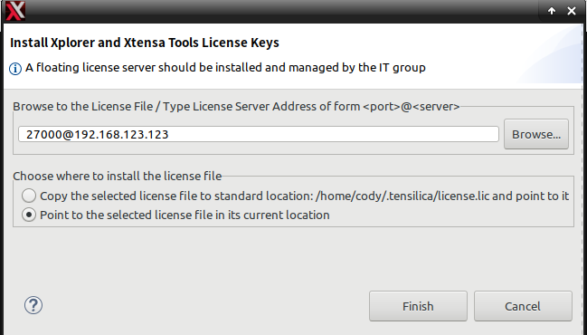
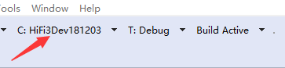
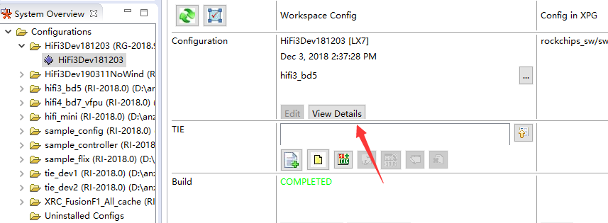

# DSP 开发指南

发布版本：1.0

作者邮箱：huaping.liao@rock-chips.com

日期：2019.6

文件密级：公开资料

------

**前言**

**概述**

本文档主要介绍 Rockchip DSP 开发的基本方法。

**产品版本**

| **芯片名称** | **RT Thread 版本** |
| :----------- | ----------------- |
| RK2108       |                   |
| X1           |                   |
| RK2206       |                   |

**读者对象**

本文档（本指南）主要适用于以下工程师：

技术支持工程师

软件开发工程师

**修订记录**

| **日期**   | **版本** | **作者** | **修改说明** |
| ---------- | -------- | -------- | ------------ |
| 2019-06-24 | V1.0     | 廖华平   | 初始版本     |
| 2019-08-02 | V1.1     | 谢科迪   | 增加Floating License 服务器安装说明 |

------

[TOC]

------

## 1 Rockchip DSP 简介

DSP 即数字信号处理技术。DSP 作为数字信号处理器将模拟信号转换成数字信号，用于专用处理器的高速实时处理。 它具有高速，灵活，可编程，低功耗的界面功能，在图形图像处理，语音处理，信号处理等通信领域起到越来越重要的作用。如下为 Cadence® Tensilica® HiFi3 DSP 的简介。

- HiFi3 DSP 是一种 ISA，支持 2-way SIMD 处理 。
- HiFi3 DSP 支持同时处理两个 32x32 或 24x32 bit 数据，4 个 24x24、16x32 或 16x16 bit 数据。
- HiFi3 DSP 支持同时处理两个 IEEE-754 浮点数据。

目前，Rockchip SoC 上集成的 DSP 说明如下：

- RK2108、RK2206 和 X1 集成 HIFI3 DSP。

------

## 2 HIFI3 软件环境搭建

### 2.1 Floating License Server 搭建

- 将相关文件放置到服务器

```txt
/usr/local/flexlm
├── licenses
│   ├── license.dat
│   └── license.data
├── lmgrd
├── lmutil
├── logs
│   └── lmgrd.log
├── softwareserver_2018-12-13.lic # license文件
├── xtensad
└── xtensa_lic_test.linux
```

- 安装依赖文件

依赖lsb-core, CentOS/RedHat发行版默认自带，Ubuntu 18.04 安装方法如下：

```console
sudo apt install lsb-core
```

其他发行版或Ubuntu <= 16.04 的安装包名、方法不同，自行Google.

- license 文件修改

license 文件格式如下，根据服务器 MAC 生成，将 host 改为服务器的主机名，MAC 改为服务器的网卡 MAC 地址，格式为“AABBCCDDEEFF”，将端口改为需要开放的端口号，如 27000 。

```txt
SERVER <host> <mac> <port>
VENDOR xtensad <path_to_xtensad>
USE_SERVER

PACKAGE
...
```

- 配置 flexlm 服务

在 /etc/init.d/ 目录下，新增 flexlm 文件，内容如下：

```sh
#!/bin/sh

### BEGIN INIT INFO
# Provides:          flexlm
# Required-Start:    $local_fs $syslog
# Required-Stop:     $local_fs $syslog
# Should-Start:      autofs $network $named 
# Should-Stop:       autofs $network $named
# Default-Start:     2 3 4 5
# Default-Stop:      0 1 6
# Short-Description: lmgrd init script
# Description:       Cadence Flexlm license manager daemon
### END INIT INFO

# Author: Cody Xie <cody.xie@rock-chips.com>

. /lib/lsb/init-functions

PATH=/usr/local/flexlm:/bin:/usr/bin:/sbin:/usr/sbin
NAME=flexlm
DESC="The Cadence flexlm license daemon lmgrd"
DAEMON=/usr/local/flexlm/lmgrd
LIC=/usr/local/flexlm/softwareserver_2018-12-13.lic
LOG=/usr/local/flexlm/logs/lmgrd.log
LMGRD_OPTS="-c $LIC -l $LOG"
PIDFILE=/run/$NAME.pid

[ -x "$DAEMON" ] || exit 0

lmgrd_start () {
    log_daemon_msg "Starting $DESC" "$NAME"
    start-stop-daemon --start --quiet --oknodo --pidfile "$PIDFILE" \
        --exec "$DAEMON" -- $LMGRD_OPTS
    log_end_msg $?
}

lmgrd_stop () {
    log_daemon_msg "Stopping $DESC" "$NAME"
    start-stop-daemon --stop --quiet --oknodo --retry 5 --pidfile "$PIDFILE" \
        --exec $DAEMON
    log_end_msg $?
}

case "$1" in
    start)
        lmgrd_start
        ;;
    stop)
        lmgrd_stop
        ;;
    status)
    	status_of_proc -p $PIDFILE $DAEMON $NAME
	;;
    restart|force-reload)
        lmgrd_stop
        lmgrd_start
        ;;
    force-start)
        lmgrd_start
        ;;
    force-restart)
        lmgrd_stop
        lmgrd_start
        ;;
    force-reload)
	lmgrd_stop
	lmgrd_start
	;;
    *)
        echo "Usage: $0 {start|stop|restart|force-reload}"
        exit 2
        ;;
esac
```

安装 flexlm 服务并开机自动启动

```console
sudo cd /etc/init.d
sudo chmod +x flexlm
sudo update-rc.d flexlm defaults
sudo update-rc.d flexlm enable
```

- 确认 license 服务器工作正常

打开 Xplorer 工具，打开 <help> --> <Xplorer License Keys> ，点击 <Install License Keys>，输入 “27000@host”，其中 host 为 服务器主机名或IP地址，完成后，点击 <License Options> 或 <Check Xtensa Tools Keys> 确认 license 状态。





### 2.2 Xplorer 工具安装

Cadence 开发工具全称为“RUN Xplorer 8.0.8”，下载工具需要到 Cadence 官网，LICENSE 需要联系 Cadence 获取。

工具安装好后，需要安装先安装数据包“HiFi3Dev181203_win32.tgz”，数据包基于 RG-2018.9 的基础工具安装包“XtensaTools_RG_2018_9_win32.tgz”。相关安装包都需要找开发人员获取。

安装方法是在 Xplorer 中，"File->New->Xtensa Configuration",找到下图的配置页面并点击 Install 选项：


点击 Next 并且选择文件“HiFi3Dev181203_win32.tgz”后，会提示安装 RG-2018.9，这时候点击“Manage Xtensa Tools”安装“XtensaTools_RG_2018_9_win32.tgz”，安装完成后，就可以进行数据包的安装操作。

数据包安装完成后，会在工具栏看到"C:(Active configuration)"栏目中看到 HiFi3Dev181304，点击并选中：



这时候软件左下角的 System Overivew 就会看到相关 HiFi3Dev181304 的配置文件，点击相关文件，会看到当前 Core 的配置信息。可以看到对应的 ITCM、DTCM、中断号等。连接外部 INTC 的中断为 INterrupt0.



### 2.3 DSP 代码下载及编译

Git 仓库路径：

- ssh://git@10.10.10.29:29418/rk/dsp/hifi3

工程目录在根目录的 projects 下，存放不同工程的配置文件和工程文件。

通过"File->Import->Genaral->Existing Projects into Workspace"导入工程代码，不同项目对应不同的工程名称，RK2108 对应工程名是 PISCES，RK2206 对应工程名是 CANARY。

在工具栏选择编译的优化等级，分为 Debug、Release 和 ReleaseSize。不同优化等级对代码有不同程度的优化，具体的优化内容可以进入配置选项查看。点击工具栏的“Build Active”即可正常进行编译，编译结果存放在工程目录的 bin 目录下。

### 2.4 DSP 固件生成

工具生成的执行文件只能用于工具仿真，不能直接跑在设备上。运行 cmd 控制台，找到工程根目录，运行固件生成脚本“generate_dsp_fw.bat 项目名“，如果是 PISCES 项目，项目名对应的就是 PISCES，脚本会将对应工程目录的 FwConfig.xml 和执行程序拷贝到 tool 目录下，运行 HifiFirmwareGenerator.exe 进行固件打包，最终固件存放于 tools/HifiFirmwareGenerator/output/rkdsp.bin。HifiFirmwareGenerator.exe 的源码存于：

- ssh://git@10.10.10.29:29418/rk/dsp/DspFirmwareGenerator
- <https://github.com/LiaoHuaping/DspFirmwareGenerator>

### 2.5 固件打包配置文件

在每个工程目录下，均有一个 FwConfig.xml 文件，该文件采用 xml 定义一些固件配置。当运行 HifiFirmwareGenerator.exe 时，会解析当前目录的 FwConfig.xml，这里列出几个关键字段的含义：

- CoreName：编译的 Core 的名称，当前使用的是 HiFi3Dev181203。
- ToolsPath：安装 Xplorer 的工具目录，进行固件打包时，会使用到安装的工具包。
- ExecutableFile：输入固件名。
- ExternalFile：除 DSP 固件外，额外需要打包的文件名。如没有，置空即可。
- ExternalAddr：额外需要打包的文件需要加载的地址。
- SourceCodeMemStart：DSP 端代码内存空间的起始地址。
- SourceCodeMemEnd: DSP 端代码内存空间的结束地址。
- DestinationCodeMemStart：MCU 端对应的代码内存空间的地址，因为可能存在内存空间映射情况不同的情况。比如同一块物理内存地址 TCM，DSP 的访问的地址是 0x30000000，MCU 访问的地址是 0x20400000，它们分别对应 SourceCodeMemStart 和 DetinationCodeMemStart。如果地址映射相同，那么填入对应即可。

### 2.6 Map 配置信息修改

Xplorer 在链接阶段需要根据 Map 配置信息进行各个数据段的空间分配。在"T:(active build target)->Modify"，选择 Linker。可以看到 Standard 选项，可以选择默认的 Map 配置，Xplorer 为开发者提供了 min-rt、sim 等配置，这些配置文件目录存放在“<工具安装目录>\explor8\XtDevTools\install\builds\RG-2018.9-win32\HiFi3Dev181203\xtensa-elf\lib”目录下。配置相关信息可以查看文档“<工具安装目录>\XtDevTools\downloads\RI-2018.0\docs\lsp_rm.pdf”。

段配置文件为“memmap.xmm”。text、data 等会存放在 sram0 中，这是 Share Memory 的地址空间，需要将这些段存放在 TCM 中。可以参考“<工程目录>\rkdsp\projects\PISCES\map\min-rt\memmap.xmm”中的相关修改。修改完后，需要使用命令“<工具安装目录>\XtDevTools\install\tools\RG-2018.9-win32\XtensaTools\bin\xt-genldscripts.exe -b <map 目录> --xtensa-core=HiFi3Dev181203”。这时候可以在 Linker 中指定 map 目录，重新编译即可。如果选中“Generate linker map file”，那么就会在编译完成后生成“.map”文件，里面记录了具体函数分配到的地址空间，以验证上述修改是否生效。

## 3 MCU 端软件

### 3.1 代码路径

DSP 框架：

```
bsp/rockchip-common/drivers/dsp.c
bsp/rockchip-common/drivers/dsp.h
```

DSP 驱动适配层：

```
bsp/rockchip-common/drivers/drv_dsp.c
bsp/rockchip-common/drivers/drv_dsp.h
```

DSP 驱动调用流程可以参考以下测试用例：

```
bsp/rockchip-common/tests/dsp_test.c
```

### 3.2 配置

打开 DSP driver 配置如下：

```
RT-Thread bsp drivers  --->
    RT-Thread rockchip common drivers  --->
        [*] Enable DSP
        [ ]   Enable firmware loader to dsp
        [ ]   Enable dsp send trace to cm4
```

选中”Enable firmware loader to dsp“表示 dsp 驱动启动的时候，会下载 dsp 固件；“Enable dsp send trace to cm4”表示使能 trace 功能，使得部分 dsp 中的打印 log 可以在 mcu 中打印出来，那么打印 log 就不需要依赖于单独的串口。

打开 dsp test case 配置如下：

```
RT-Thread bsp test case  --->
   RT-Thread Common Test case  --->
        [*] Enable BSP Common DSP TEST
```

执行命令可以看下已经生成的测试命令

```
msh >help
RT-Thread shell commands:
shutdown         - Shutdown System
reboot           - Reboot System
dsp_test        -dsp_test test. e.g: dsp_test()
```

执行“dsp_test”命令即可进行 DSP 驱动代码测试。

## 4 MCU 驱动分析

### 4.1 驱动调用

驱动调用方式可以参考“bsp/rockchip-common/tests/dsp_test.c”。

```
struct rt_device *dsp_dev = rt_device_find("dsp0");
rt_device_open(dsp_dev, RT_DEVICE_OFLAG_RDWR);
rt_device_control(dsp_dev, RKDSP_CTL_QUEUE_WORK, work);
rt_device_control(dsp_dev, RKDSP_CTL_DEQUEUE_WORK, work);
rt_device_close(dsp_dev);
```

调用 rt_device_open 时候，会调用到驱动的“rk_dsp_open”函数，会执行启动 DSPcore 以及下载固件，并且将 DSP 代码运行起来。

调用“rt_device_control(dsp_dev, RKDSP_CTL_QUEUE_WORK, work)”的时候，传入 work 指针，驱动会通过 mailbox 将 work 发送给 dsp，dsp 解析 work，并进行相应的算法操作，将 work 处理结果传回来。调用“rt_device_control(dsp_dev, RKDSP_CTL_DEQUEUE_WORK, work)”可以取回 DSP 的算法处理结果，如果 DSP 仍在处理中，那么该函数会阻塞，直到 dsp 处理完成。

### 4.2 通信协议

MCU 和 DSP 通过 Mailbox 进行通信，Mailbox 包含 4 个通道，一个通道传输 32bit 的 cmd 和 data 数据。每次发送消息，cmd 通道传输命令码，表示这次消息进行哪些操作；data 通道传输数据，一般为 work 或者 config 的 buffer 指针。命令码存于在 drv_dsp.h 中，DSP_CMD_WORK、DSP_CMD_READY、DSP_CMD_CONFIG 等。

当 DSP 启动后，DSP 会进行自身的初始化等操作。初始化完成后，DSP 会发送 DSP_CMD_READY 命令，MCU 端接收到后，会调用“rk_dsp_config”函数对 dsp 进行 trace 等相关信息的配置。DSP 接收到 DSP_CMD_CONFIG 并且配置完成后，会发送 DSP_CMD_CONFIG_DONE，表示配置已经完成，可以进行算法工作。这三次消息发送相当于一个握手过程，握手完成后就可以进行算法调用。
