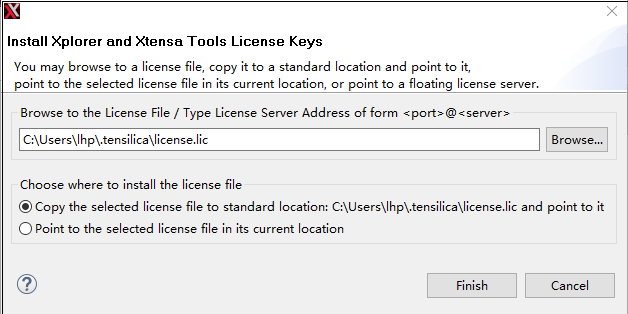
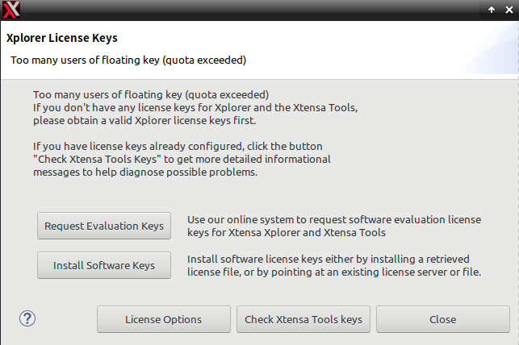
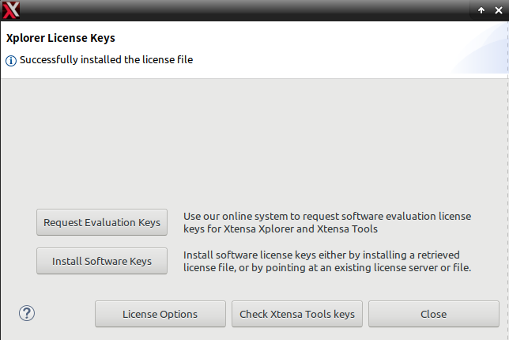
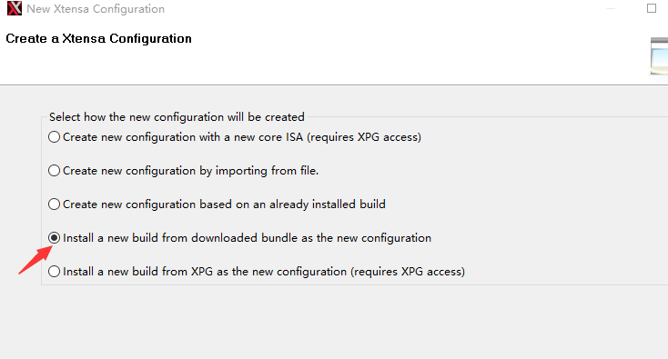
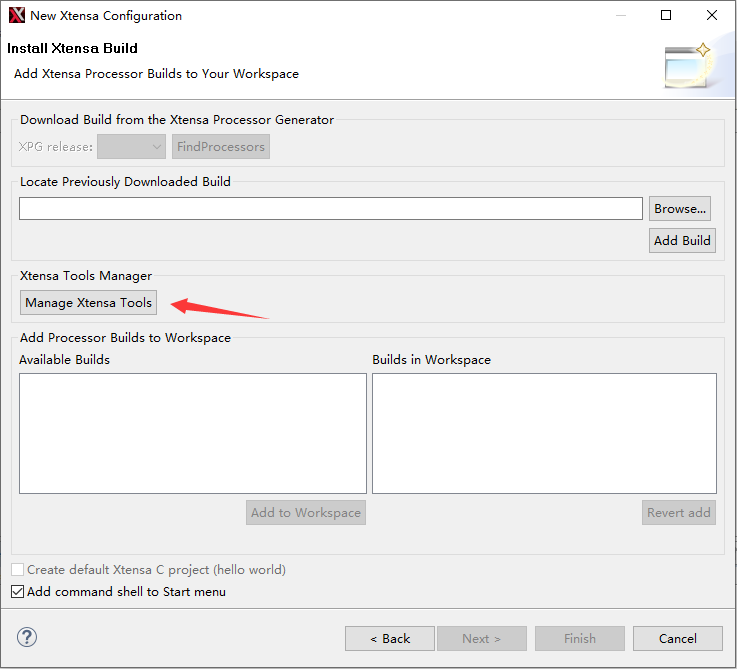
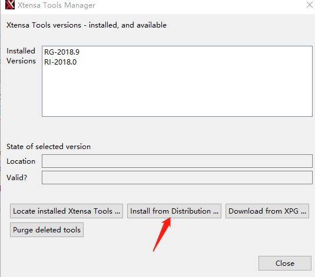
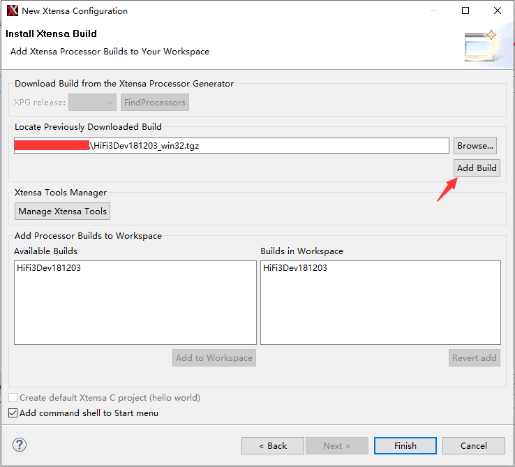
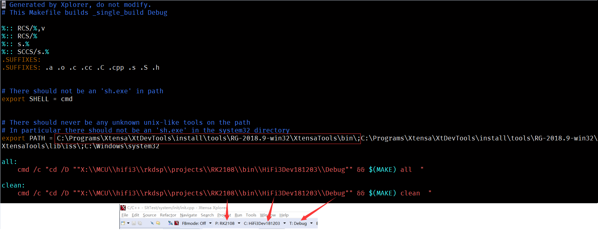

# Rockchip DSP 开发指南

文件标识：RK-KF-YF-302

发布版本：V1.8.0

日期：2020-08-06

文件密级：□绝密   □秘密   □内部资料   ■公开

**免责声明**

本文档按“现状”提供，瑞芯微电子股份有限公司（“本公司”，下同）不对本文档的任何陈述、信息和内容的准确性、可靠性、完整性、适销性、特定目的性和非侵权性提供任何明示或暗示的声明或保证。本文档仅作为使用指导的参考。

由于产品版本升级或其他原因，本文档将可能在未经任何通知的情况下，不定期进行更新或修改。

**商标声明**

“Rockchip”、“瑞芯微”、“瑞芯”均为本公司的注册商标，归本公司所有。

本文档可能提及的其他所有注册商标或商标，由其各自拥有者所有。

**版权所有** **© 2020** **瑞芯微电子股份有限公司**

超越合理使用范畴，非经本公司书面许可，任何单位和个人不得擅自摘抄、复制本文档内容的部分或全部，并不得以任何形式传播。

瑞芯微电子股份有限公司

Rockchip Electronics Co., Ltd.

地址：     福建省福州市铜盘路软件园A区18号

网址：     www.rock-chips.com

客户服务电话： +86-4007-700-590

客户服务传真： +86-591-83951833

客户服务邮箱： fae@rock-chips.com

---

**前言**

**概述**

本文档主要介绍 Rockchip DSP 开发的基本方法。

**产品版本**

| **芯片名称** | **版本** |
| :----------- | ----------------- |
| RK2108       | RT-THREAD |
| PISCES     | RT-THREAD |
| RK2206       | RKOS |

**读者对象**

本文档（本指南）主要适用于以下工程师：

技术支持工程师

软件开发工程师

**修订记录**

| **日期**   | **版本** | **作者** | **修改说明** |
| ---------- | -------- | -------- | ------------ |
| 2019-06-24 | V1.0.0   | 廖华平   | 初始版本     |
| 2019-08-02 | V1.1.0   | 谢科迪   | 增加 Floating License 服务器安装说明 |
| 2019-09-03 | V1.2.0 | 廖华平 | 增加固件打包说明 |
| 2019-10-10 | V1.3.0 | 廖华平 | 增加rkos说明 |
| 2019-10-16 | V1.4.0 | 廖华平 | 增加ubuntu安装说明 |
| 2020-03-10 | V1.5.0 | 廖华平 | 增加配置文件安装描述图 |
| 2020-05-22 | V1.6.0 | 钟勇汪 | 修改编译工具源码路径 |
| 2020-06-18 | V1.7.0 | 吴佳健 | 更新打包工具说明 |
| 2020-08-06 | V1.8.0 | 吴佳健 | 新增Vendor Key校验说明 |

---

**目录**

[TOC]

---

## Rockchip DSP 简介

DSP 即数字信号处理技术。DSP 作为数字信号处理器将模拟信号转换成数字信号，用于专用处理器的高速实时处理。 它具有高速，灵活，可编程，低功耗的界面功能，在图形图像处理，语音处理，信号处理等通信领域起到越来越重要的作用。如下为 Cadence® Tensilica® HiFi3 DSP 的简介。

- HiFi3 DSP 是一种 ISA，支持 2-way SIMD 处理 。
- HiFi3 DSP 支持同时处理两个 32x32 或 24x32 bit 数据，4 个 24x24、16x32 或 16x16 bit 数据。
- HiFi3 DSP 支持同时处理两个 IEEE-754 浮点数据。

目前，Rockchip SoC 上集成的 DSP 说明如下：

- RK2108、RK2206 和 PISCES集成 HIFI3 DSP。

## HIFI3 软件环境搭建

### License 安装

License是和MAC地址绑定的。如果需要多台机器使用，那么需要搭建License服务器，但是同时只能一台机器访问License服务器。服务器搭建步骤参考2.2章的内容。

如果是单台机器使用，那么直接使用本地目录的License文件，不需要搭建服务器。打开 Xplorer 工具，打开 “help” --  “Xplorer License Keys” ，点击 ”Install License Keys”，输入文件路径名。完成后，点击 ”License Options” 或 ”Check Xtensa Tools Keys” 确认 License 状态。需要注意mac地址要和liscense中的host id一致。



### Floating License Server 搭建

- 将相关文件放置到服务器

```txt
/usr/local/flexlm
├── licenses
│   ├── license.dat
│   └── license.data
├── lmgrd
├── lmutil
├── logs
│   └── lmgrd.log
├── softwareserver_2018-12-13.lic # license文件
├── xtensad
└── xtensa_lic_test.linux
```

- 安装依赖文件

依赖 lsb-core, CentOS/RedHat 发行版默认自带，Ubuntu 18.04 安装方法如下：

```console
sudo apt install lsb-core
```

其他发行版或 Ubuntu <= 16.04 的安装包名、方法不同，自行 Google.

- License 文件修改

License 文件格式如下，根据服务器 MAC 生成，将 Host 改为服务器的主机名，MAC 改为服务器的网卡 MAC 地址，格式为“AABBCCDDEEFF”，将端口改为需要开放的端口号，如 27000 。

```txt
SERVER <host> <mac> <port>
VENDOR xtensad <path_to_xtensad>
USE_SERVER

PACKAGE
...
```

- 配置 flexlm 服务

在 /etc/init.d/ 目录下，新增 flexlm 文件，内容如下：

```sh
#!/bin/sh

### BEGIN INIT INFO
# Provides:          flexlm
# Required-Start:    $local_fs $syslog
# Required-Stop:     $local_fs $syslog
# Should-Start:      autofs $network $named
# Should-Stop:       autofs $network $named
# Default-Start:     2 3 4 5
# Default-Stop:      0 1 6
# Short-Description: lmgrd init script
# Description:       Cadence Flexlm license manager daemon
### END INIT INFO

# Author: Cody Xie <cody.xie@rock-chips.com>

. /lib/lsb/init-functions

PATH=/usr/local/flexlm:/bin:/usr/bin:/sbin:/usr/sbin
NAME=flexlm
DESC="The Cadence flexlm license daemon lmgrd"
DAEMON=/usr/local/flexlm/lmgrd
LIC=/usr/local/flexlm/softwareserver_2018-12-13.lic
LOG=/usr/local/flexlm/logs/lmgrd.log
LMGRD_OPTS="-c $LIC -l $LOG"
PIDFILE=/run/$NAME.pid

[ -x "$DAEMON" ] || exit 0

lmgrd_start () {
    log_daemon_msg "Starting $DESC" "$NAME"
    start-stop-daemon --start --quiet --oknodo --pidfile "$PIDFILE" \
        --exec "$DAEMON" -- $LMGRD_OPTS
    log_end_msg $?
}

lmgrd_stop () {
    log_daemon_msg "Stopping $DESC" "$NAME"
    start-stop-daemon --stop --quiet --oknodo --retry 5 --pidfile "$PIDFILE" \
        --exec $DAEMON
    log_end_msg $?
}

case "$1" in
    start)
        lmgrd_start
        ;;
    stop)
        lmgrd_stop
        ;;
    status)
    	status_of_proc -p $PIDFILE $DAEMON $NAME
	;;
    restart|force-reload)
        lmgrd_stop
        lmgrd_start
        ;;
    force-start)
        lmgrd_start
        ;;
    force-restart)
        lmgrd_stop
        lmgrd_start
        ;;
    force-reload)
	lmgrd_stop
	lmgrd_start
	;;
    *)
        echo "Usage: $0 {start|stop|restart|force-reload}"
        exit 2
        ;;
esac
```

安装 flexlm 服务并开机自动启动

```console
sudo cd /etc/init.d
sudo chmod +x flexlm
sudo update-rc.d flexlm defaults
sudo update-rc.d flexlm enable
```

- 确认 License 服务器工作正常

打开 Xplorer 工具，打开 “help” --> “Xplorer License Keys” ，点击”Install License Keys” ，输入 “27000@host”，其中 host 为 服务器主机名或 IP 地址，完成后，点击 ” License Options”  或 ”Check Xtensa Tools Keys”  确认 License 状态。






### Xplorer 工具安装

#### Windows环境

Cadence 开发工具全称为“RUN Xplorer 8.0.8”，下载工具需要到  [Cadence 官方网站申请](https://ip.cadence.com/support/sdk-evaluation-request)，License 需要联系 Cadence 获取，我们当前使用的工具安装包为”Xplorer-8.0.8-windows-installer.exe“。

工具安装好后，需要先安装数据包“HiFi3Dev181203_win32.tgz”，数据包基于 RG-2018.9 的基础工具安装包“XtensaTools_RG_2018_9_win32.tgz”。相关安装包都需要找开发人员获取。

安装方法是在 Xplorer 中，”File” --> ”New” --> ”Xtensa Configuration”，找到下图的配置页面并点击 Install 选项：









点击 Next 并且选择文件“HiFi3Dev181203_win32.tgz”后，会提示安装 RG-2018.9，这时候点击“Manage Xtensa Tools”安装“XtensaTools_RG_2018_9_win32.tgz”，安装完成后，点击“Add Build”，就可以进行数据包的安装操作。

数据包安装完成后，会在工具栏看到"C:(Active configuration)"栏目中看到 HiFi3Dev181203，点击并选中：


这时候软件左下角的 System Overivew 就会看到相关 HiFi3Dev181304 的配置文件，点击相关文件，会看到当前 Core 的配置信息。可以看到对应的 ITCM、DTCM、中断号等。连接外部 INTC 的中断为 INterrupt0.


#### Ubuntu环境

由于开发工具在Ubuntu环境下有未知的UI适配问题和使用问题，所以我们建议尽量在windows下开发。

Ubuntu 64bit 版本系统，我们推荐的工具安装包为“Xplorer-8.0.8-linux-x64-installer.bin”，如果是Ubuntu 32bit 版本系统，推荐工具安装包“Xplorer-7.0.9-linux-installer”。配置包为“HiFi3Dev181203_linux.tgz”和“XtensaTools_RG_2018_9_linux.tgz”。安装过程和Windows一致。

因为配置包为32bit，为了兼容64bit系统，需要执行以下命令：

```
sudo apt-get install libgtk2.0-0:i386 gtk2-engines:i386 libc6:i386 libcanberra-gtk3-0:i386 libxtst6:i386 libncurses5:i386
sudo dpkg --add-architecture i386
sudo apt-get update
sudo apt-get install libc6:i386 libstdc++6:i386
sudo apt-get update -y
sudo apt-get update kernel* -y
sudo apt-get update  kernel-headers kernel-devel -y
sudo apt-get install kernel-headers kernel-devel -y
sudo apt-get install compat-libstdc++-33.i686 -y
sudo apt-get install libstdc++.i686 -y
sudo apt-get install gtk2.i686 -y
sudo apt-get install libcanberra-gtk2.i686 -y
sudo apt-get install PackageKit-gtk3-module.i686 -y
sudo apt-get install libXtst.i686 -y
sudo apt-get install ncurses-libs.i686 -y
sudo apt-get install redhat-lsb.i686 -y
```

### DSP 代码下载及编译

工程目录在根目录的 Projects 下，存放不同工程的配置文件和工程文件。

通过 ”File” -->  ”Import” -->  ”Genaral” -->  ”Existing Projects into Workspace”导入工程代码，不同项目对应不同的工程名称，RK2108 对应工程名是 RK2108 ，RK2206 对应工程名是 RK2206。

在工具栏选择编译的优化等级，分为 Debug、Release 和 ReleaseSize。不同优化等级对代码有不同程度的优化，具体的优化内容可以进入配置选项查看。点击工具栏的“Build Active”即可正常进行编译，编译结果存放在工程目录的 bin 目录下。

### DSP 固件生成

工具生成的执行文件只能用于工具仿真，不能直接跑在设备上。运行 CMD 控制台，找到固件生成脚本 generate_dsp_fw.bat 文件，进入到该文件所在目录执行该脚本，使用方式如下：

```shell
generate_dsp_fw.bat <project name> [config file]
其中<project name>为必选项，用于指定工程名，如RK2108
[config file]为可选项，用于指定打包配置文件，如FwConfig.xml（不指定则默认为FwConfig.xml）
```

注意：若出现“无法找到指定文件”的错误，请确认当前Xplorer中Project是否正确选择，generate_dsp_fw.bat基于工程目录下Makefile自动查找工具路径、Target、Configuration等，如果当前选择的工程不正确，则对应的Makefile不会生成，正确生成的Makefile如下图所示：



generate_dsp_fw.bat 脚本会将对应工程目录的 FwConfig.xml 、Bin2Array.xml、固件等拷贝至 tool 目录下，并调用 HifiFirmwareGenerator.exe 打包固件，最终固件存放于 tools/HifiFirmwareGenerator/output/rkdsp.bin。HifiFirmwareGenerator.exe 的源码存于：

<SDK>/components/hifi3/rkdsp/tools/source_code/HifiFirmwareGenerator

同时脚本会执行程序“FirmwareArrayGenerator.exe”根据Bin2Array.xml配置将rkdsp.bin转换为相应的C数组文件。FirmwareArrayGenerator.exe 的源码存于：

<SDK>/components/hifi3/rkdsp/tools/source_code/FirmwareArrayGenerator

不同文件的加载方式请参考3.2节的说明。

### 固件打包配置文件

在每个工程目录下，均有一个 FwConfig.xml 文件，该文件采用 Xml 定义一些固件配置。当运行 HifiFirmwareGenerator.exe 时，会解析当前目录的 FwConfig.xml，这里列出几个关键字段的含义：

- CoreName：编译的 Core 的名称，脚本会根据Makefile自动替换`tag_corename`字段，开发人员也可手动更改。
- **ToolsPath：安装 Xplorer 的工具目录，脚本会根据Makefile自动替换`tag_toolspath`字段，开发人员也可手动更改。**
- ExecutableFile：输入固件名。
- SourceCodeMemStart：DSP 端代码内存空间的起始地址。
- SourceCodeMemEnd：DSP 端代码内存空间的结束地址。
- DestinationCodeMemStart：MCU 端对应的代码内存空间的地址，因为可能存在内存空间映射情况不同的情况。比如同一块物理内存地址 TCM，DSP 的访问的地址是 0x30000000，MCU 访问的地址是 0x20400000，它们分别对应 SourceCodeMemStart 和 DetinationCodeMemStart。如果地址映射相同，那么填入对应即可。
- Image：输出固件。用于支持可拆分DSP固件。
- Image/Name：固件名，用以区分固件类型。MAIN为主要固件，生成固件名为rkdsp.bin，生成的固件中包含各Section头信息（地址，大小等），用于CPU解析加载DSP固件使用；EXT为额外固件，生成固件名为ext_rkdsp.bin，无Section头信息，按Section地址顺序排列，使用时打包至CPU固件，烧录至Flash指定位置，DSP运行时直接读取对应数据，无需CPU加载。
- Image/AddrRange：指定属于该固件的Section地址范围。以XIP为例，地址范围为0x60000000~0x60800000，则该范围内的Section将打包至指定固件中（一般为EXT固件）。需要额外注意，生成固件过程中，会将所有代码段解析至Section数组中，按FwConfig.xml中Image的排列顺序分发代码段，如某一代码段在该Image的范围内，则打包至Image并从Section数组中移除，如果当前Image未指定AddrRange，则默认当前Section数组中所有Section都打包至当前Image，因此有指定AddrRange的Image一定要写在未指定AddrRange的Image之前，如下：

```xml
<Image>
    <Id>2056</Id>
    <Name>EXT</Name>
    <Type>Permanent</Type>
    <AddrRange>0x60000000:0x60800000</AddrRange>
</Image>
<Image>
    <Id>2046</Id>
    <Name>MAIN</Name>
    <Type>Permanent</Type>
</Image>
```

若MAIN写在EXT之前，打包MAIN时，Section数组内所有Section都将打包至MAIN，则打包EXT时，已无有效Section。或在MAIN内也添加AddrRange字段限制，则可以无视排序顺序。AddrRange可分段多次指定，如下：

```xml
<Image>
    <Id>2056</Id>
    <Name>EXT</Name>
    <Type>Permanent</Type>
    <AddrRange>0x60000000:0x60800000</AddrRange>
</Image>
<Image>
    <Id>2046</Id>
    <Name>MAIN</Name>
    <Type>Permanent</Type>
    <AddrRange>0x30000000:0x30010000</AddrRange>
    <AddrRange>0x30200000:0x30280000</AddrRange>
</Image>
```

### 固件转换配置文件

在工程目录下存在Bin2Array.xml文件，用以指定转换模板。文件中字段说明如下：

- Type：生成的C数组类型。
- Name：生成的C数组名称。
- Input：待转换的.bin文件。
- Output：转换输出文件。

### Map 配置信息修改

Xplorer 在链接阶段需要根据 Map 配置信息进行各个数据段的空间分配。在 ”T:(active build target) ” -->  ”Modify”，选择 Linker。可以看到 Standard 选项，可以选择默认的 Map 配置，Xplorer 为开发者提供了 min-rt、sim 等配置，这些配置文件目录存放在“<工具安装目录>\explor8\XtDevTools\install\builds\RG-2018.9-win32\HiFi3Dev181203\xtensa-elf\lib”目录下。配置相关信息可以查看文档“ <工具安装目录> \XtDevTools\downloads\RI-2018.0\docs\lsp_rm.pdf”。

段配置文件为“memmap.xmm”，text、data 等会存放在 sram0 中，这是 Share Memory 的地址空间，需要将这些段存放在 TCM 中。可以参考“<工程目录>\rkdsp\projects\PISCES\map\min-rt\memmap.xmm”中的相关修改。修改完后，需要使用命令”<工具安装目录>\XtDevTools\install\tools\RG-2018.9-win32\XtensaTools\bin\xt-genldscripts.exe -b  <map目录> --xtensa-core=HiFi3Dev181203”。这时候可以在 Linker 中指定 map 目录，重新编译即可。如果选中“Generate linker map file”，那么就会在编译完成后生成“.map”文件，里面记录了具体函数分配到的地址空间，以验证上述修改是否生效。

## RT-THREAD 代码解析

### 代码路径

DSP 框架：

```
bsp/rockchip/common/drivers/dsp.c
bsp/rockchip/common/drivers/dsp.h
```

DSP 驱动适配层：

```
bsp/rockchip/common/drivers/drv_dsp.c
bsp/rockchip/common/drivers/drv_dsp.h
```

DSP 驱动调用流程可以参考以下测试用例：

```
bsp/rockchip/common/tests/dsp_test.c
```

### 配置

打开 DSP driver 配置如下，下面以RK2108工程为例：

```
RT-Thread bsp drivers  --->
    RT-Thread rockchip rk2108 drivers  --->
         Enable DSP  --->
            [*] Enable DSP
            [*]   Enable firmware loader to dsp
                    Dsp firmware path (Store firmware data in file)  --->
            (/rkdsp.bin) Dsp firmware path
            [ ]   Enable dsp send trace to cm4
            (-1)  Config dsp debug uart port
```

”Enable firmware loader to dsp“表示 DSP 驱动启动的时候，会下载 DSP 固件；

“Dsp firmware path”有两个选项有以下两个选项：

- 一个选项是”Store firmware data in file“，固件使用flash中的rkdsp.bin，固件地址在“Dsp firmware path”中指定。“/rkdsp.bin”可以是文件系统中的路径，也可以是一个固件节点（在setting.ini中加入dsp固件分区）。
- 另一个选项是“Store firmware data in builtin ”，表示将DSP固件编入到m4的固件中，编译的时候会将工程目录dsp_fw目录下的rkdsp_fw.c[^1]编译，rkdsp_fw.c参考[2.5节 DSP 固件生成](#2.5 DSP 固件生成)中的操作生成。因为工程默认支持XIP，DSP固件会被编译到XIP中。使用这种方式的好处是简单方便，不需要走文件系统操作。但是尽量在支持XIP的时候使用，否则DSP固件会被加载到M4的内存中，浪费内存空间。

“Enable dsp send trace to cm4”表示使能 trace 功能，使得部分 DSP 中的打印 log 可以在 ARM 中打印出来，那么打印 log 就不需要依赖于单独的串口。

“Config dsp debug uart port”表示设置DSP打印的 UART 端口。如果值是-1那么将不会设置。DSP代码中默认使用UART0。

注[^1]:实际目标文件由menuconfig中RT_DSPFW_FILE_NAME指定。

### 驱动调用

驱动调用方式可以参考“bsp/rockchip-common/tests/dsp_test.c”。

```c
struct rt_device *dsp_dev = rt_device_find("dsp0");
rt_device_open(dsp_dev, RT_DEVICE_OFLAG_RDWR);
rt_device_control(dsp_dev, RKDSP_CTL_QUEUE_WORK, work);
rt_device_control(dsp_dev, RKDSP_CTL_DEQUEUE_WORK, work);
rt_device_close(dsp_dev);
```

调用 rt_device_open 时候，会调用到驱动的“rk_dsp_open”函数，会执行启动 DSPcore 以及下载固件，并且将 DSP 代码运行起来。

调用“rt_device_control(dsp_dev, RKDSP_CTL_QUEUE_WORK, work)”的时候，传入 work 指针，驱动会通过 mailbox 将 work 发送给 DSP，DSP 解析 work，并进行相应的算法操作，将 work 处理结果传回来。调用“rt_device_control(dsp_dev, RKDSP_CTL_DEQUEUE_WORK, work)”可以取回 DSP 的算法处理结果，如果 DSP 仍在处理中，那么该函数会阻塞，直到 DSP 处理完成。

### 测试case

打开 DSP TEST 和 AUDIO TEST 配置如下：

```
RT-Thread bsp test case  --->
   RT-Thread Common Test case  --->
        [*] Enable BSP Common TEST
        [*]   Enable BSP Common AUDIO TEST
        [*]   Enable BSP Common DSP TEST
        [*]     Enable Dsp wakeup function
```

编译固件烧录后，在控制台输入dsp_vad_test，可以看到如下log：

```
msh />dsp_vad_test
dsp wakeup_test
Hmsh />ifi3: Hifi3 config done
Hifi3: kwsSetConfig ok
Hifi3: init uv_asr ok
ringbuf_addr:0x30260000, period_size:0x00000280
```

输入audio_capture后，对着麦喊，”xiaoduxiaodu“，可以检测到唤醒词：

```
msh />audio_capture
audio_capture
vad buf: 0x30260000, size: 0x20000 bytes
vad periodsize: 0x280 kbytes
msh />Hifi3: xiaodu_wakeup--------xiaoduxiaodu-------
Hifi3: process return value = 1
work result:0x00000001
```

### Vendor Key校验测试

以flash uuid为例，校验测试基本流程如下：

1. 使用FlashKeyTool读取flash uuid
2. 使用上一步得到的flash uuid计算出校验时使用的key
3. 使用FlashKeyTool工具将key写入到flash的vendor分区
4. CPU测试时从vendor分区读取key，发送至DSP
5. DSP读取flash uuid，经过算法计算后和CPU发送的key进行比对
6. DSP将比对结果发送回CPU
7. CPU和DSP根据校验结果做相应处理

注：步骤1~3为烧录时步骤，也可使用相关源码定制工具，在一个工具内完成读取-计算-烧录工作。

**CPU端**

测试代码路径为bsp/rockchip/common/tests/dsp_test.c。

控制台输入测试命令dsp_vendor_test，即可开始测试，测试需DSP固件内开启校验支持。

**DSP端**

代码路径为rkdsp/application/RK2108/key_verify.cpp。

编译前需在Target内定义`DSP_VENDOR_VERIFY = 1`，并将校验算法接口对接至rkdsp/application/RK2108/key_verify.cpp文件内的snor_key_verify函数。该函数将传入CPU发送的key，并将校验函数的返回值返回给CPU。

## RKOS 代码解析

### 代码路径

DSP 驱动层：

```
src/driver/dsp/DspDevice.c
include/driver/DspDevice.h
```

DSP 驱动调用流程可以参考以下测试用例：

```
src/subsys/shell/Shell_DspDevice.c
```

### 配置

打开 DSP Driver 配置如下：

```
BSP Driver  --->
    Enable DSP  --->
        [*] Enable DSP
        [*]   Enable firmware loader to dsp
                Dsp firmware path (Store firmware data in file)  --->
        (/rkdsp.bin) Dsp firmware path
        [ ]   Enable dsp send trace to cm4
        (-1)  Config dsp debug uart port
        [ ]   Enable dsp jtag
```

menuconfig选项和3.2基本一致，这里说下两个不同的地方：

1. rkdsp_fw.h的存放目录改为了"src/driver/dsp/dsp_fw"。

2. 添加了“Enable dsp jtag”选项，表示使能DSP JTAG。

### 驱动调用

驱动调用方式可以参考“src/subsys/shell/Shell_DspDevice.c”。

```c
rkdev_create(DEV_CLASS_DSP, 0, NULL);
HDC dsp_dev = rkdev_open(DEV_CLASS_DSP, 0, NOT_CARE);
rk_dsp_open(dsp_dev, 0);
rk_dsp_control(dsp_dev, RKDSP_CTL_QUEUE_WORK, work);
rk_dsp_control(dsp_dev, RKDSP_CTL_DEQUEUE_WORK, work);
rk_dsp_close (dsp_dev);
rkdev_close(dsp_dev);
rkdev_delete(DEV_CLASS_DSP, 0, NULL);
```

调用说明可以参考3.3节中的介绍，只是函数名有些不同，执行方式是一样的。

### 测试case

打开 DSP Test配置如下：

```
Components Config  --->
   Command shell  --->
       [*]  Enable DSP shell command
```

编译固件烧录后，在控制台输入dsp_test，可以看到如下LOG：

```
dsp_test
Hifi3: Hifi3 config done
Hifi3: kwsSetConfig ok
Hifi3: init uv_asr ok
config end
[A.DspTe][000024.61]workresult:0x00000000
[A.DspTe][000024.61]work result:0x00000000
[A.DspTe][000024.61]work result:0x00000000
```

## 通信协议

### 通信协议分析

MCU 和 DSP 通过 Mailbox 进行通信，Mailbox 包含 4 个通道，一个通道传输 32bit 的 CMD 和 Data 数据。每次发送消息，CMD 通道传输命令码，表示这次消息进行哪些操作；Data 通道传输数据，一般为 work 或者 config 的 buffer 指针。命令码存于在 drv_dsp.h 中，DSP_CMD_WORK、DSP_CMD_READY、DSP_CMD_CONFIG 等。

当 DSP 启动后，DSP 会进行自身的初始化等操作。初始化完成后，DSP 会发送 DSP_CMD_READY 命令，MCU 端接收到后，会调用“rk_dsp_config”函数对 DSP 进行 trace 等相关信息的配置。DSP 接收到 DSP_CMD_CONFIG 并且配置完成后，会发送 DSP_CMD_CONFIG_DONE，表示配置已经完成，可以进行算法工作。这三次消息发送相当于一个握手过程，握手完成后就可以进行算法调用。
