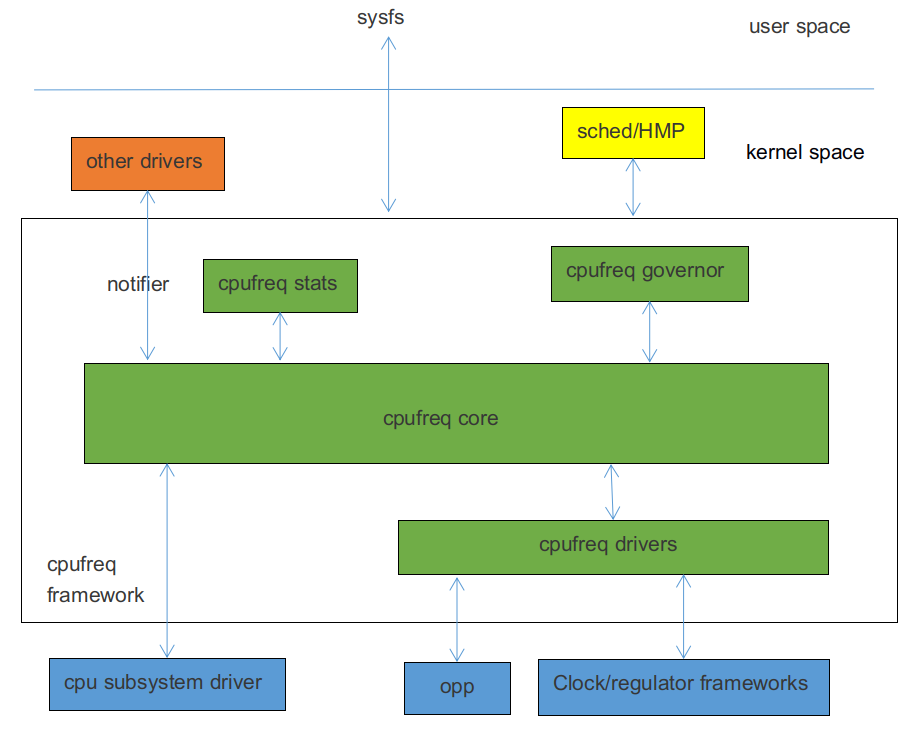

# **CPUFreq 内部开发指南**

发布版本：1.0

作者邮箱：finley.xiao@rock-chips.com

日期：2018.12.04

文档密级：内部资料

-----

**前言**

**概述**

主要描述 CPUFreq 的相关概念、配置方法和用户态接口。

**产品版本**

| 芯片名称 | 内核版本     |
| ---- | -------- |
| 所有芯片 | Linux4.4 |

**读者对象**

软件开发工程师

**修订记录**

| 日期       | 版本 | 作者 | 修订说明 |
| ---------- | ---- | ---- | -------- |
| 2018-12-04 | V1.0 | 肖锋 | 初始版本 |

-----

[TOC]

-----

## 1 概述

CPUFreq 是内核开发者定义的一套支持根据指定的 governor 动态调整 CPU 频率和电压的框架模型，它能有效地降低 CPU 的功耗，同时兼顾 CPU 的性能。CPUFreq framework 由 governor、core、driver、stats 组成，软件架构如下：



CPUFreq governor：用于 CPU 升降频检测，根据系统负载，决定 CPU 频率。目前 Linux4.4 内核中包含了如下几种 governor：

- conservative：根据 CPU 负载动态调频，按一定的比例平滑的升高或降低频率。

- ondemand：根据 CPU 负载动态调频，调频幅度比较大，可直接调到最高频或最低频。

- interactive：根据 CPU 负载动态调频，相比 ondemand，响应时间更快，可配置参数更多，更灵活。

- userspace：提供相应接口供用户态应用程序调整频率。

- powersave：功耗优先，始终将频率设置在最低值。

- performance：性能优先，始终将频率设置为最高值。

- schedutil：EAS 使用 governor。EAS（Energy Aware Scheduling）是新一代的任务调度策略， 结合CPUFreq和 CPUIdle 的策略， 在为某个任务选择运行 CPU 时， 同时考虑了性能和功耗， 保证了系统能耗最低，并且不会对性能造成影响。Schedutil 调度策略就是专门给 EAS 使用的 CPU 调频策略。

CPUFreq core： 对 cpufreq governors 和 cpufreq driver 进行了封装和抽象，并定义了清晰的接口。

CPUFreq driver：用于初始化 CPU 的频率电压表，设置具体 CPU 的频率。

CPUFreq stats：提供 cpufreq 有关的统计信息。

-----

## 2 代码路径

Governor 相关代码：

```c
drivers/cpufreq/cpufreq_conservative.c        /* conservative调频策略 */
drivers/cpufreq/cpufreq_ondemand.c            /* ondemand调频策略 */
drivers/cpufreq/cpufreq_interactive.c         /* interactive调频策略 */
drivers/cpufreq/cpufreq_userspace.c           /* userspace调频策略 */
drivers/cpufreq/cpufreq_performance.c         /* performance调频策略 */
kernel/sched/cpufreq_schedutil.c              /* schedutil调频策略 */
```

Stats 相关代码：

```c
drivers/cpufreq/cpufreq_stats.c
```

Core 相关代码：

```c
drivers/cpufreq/cpufreq.c
```

Driver 相关代码：

```c
drivers/cpufreq/cpufreq-dt.c                  /* platform driver */
drivers/cpufreq/rockchip-cpufreq.c            /* platform device */
drivers/soc/rockchip/rockchip_opp_select.c    /* 修改电压表相关接口 */
```

-----

## 3 配置方法

### 3.1 Menuconfig 配置

```c
CPU Power Management  --->
	CPU Frequency scaling  --->
		[*] CPU Frequency scaling
		<*>   CPU frequency translation statistics       /* cpufreq stats */
		[ ]     CPU frequency translation statistics details
		[*]   CPU frequency time-in-state statistics
			Default CPUFreq governor (interactive)  ---> /* cpufreq governor */
		<*>   'performance' governor
		<*>   'powersave' governor
		<*>   'userspace' governor for userspace frequency scaling
		<*>   'ondemand' cpufreq policy governor
		-*-   'interactive' cpufreq policy governor
		<*>   'conservative' cpufreq governor
		[ ]   'schedutil' cpufreq policy governor
			*** CPU frequency scaling drivers ***
		<*>   Generic DT based cpufreq driver           /* platform driver */
		< >   Generic ARM big LITTLE CPUfreq driver
		<*>   Rockchip CPUfreq driver                   /* platform device */
```

通过“Default CPUFreq governor”配置项，可以选择变频策略，开发者可以根据实际产品需求进行修改。

### 3.2 Clock 配置

根据平台的实际情况，在 CPU 节点下增加“clock”属性，一般在 DTSI 文件中。Clock 的详细配置说明，请参考clock 相关的开发文档。

对于非大小核的平台，比如 RK3326、RK3328 等，在 CPU0 节点下增加“clocks = <&cru ARMCLK>;”，以RK3328 为例：

```c
cpu0: cpu@0 {
	device_type = "cpu";
	compatible = "arm,cortex-a53", "arm,armv8";
	...
	clocks = <&cru ARMCLK>;
};
```

对于大小核的平台，如 RK3368、RK3399 等，在每个大核的 CPU 节点下增加“clocks = <&cru ARMCLKB>;”，在每个小核的 CPU 节点下增加“clocks = <&cru ARMCLKL>;”，以 RK3399 为例：

```c
cpu_l0: cpu@0 {
	device_type = "cpu";
	compatible = "arm,cortex-a53", "arm,armv8";
	...
	clocks = <&cru ARMCLKL>;
};

cpu_l1: cpu@1 {
	device_type = "cpu";
	compatible = "arm,cortex-a53", "arm,armv8";
	...
	clocks = <&cru ARMCLKL>;
};

cpu_l2: cpu@2 {
	device_type = "cpu";
	compatible = "arm,cortex-a53", "arm,armv8";
	...
	clocks = <&cru ARMCLKL>;
};

cpu_l3: cpu@3 {
	device_type = "cpu";
	compatible = "arm,cortex-a53", "arm,armv8";
	...
	clocks = <&cru ARMCLKL>;
};

cpu_b0: cpu@100 {
	device_type = "cpu";
	compatible = "arm,cortex-a72", "arm,armv8";
	...
	clocks = <&cru ARMCLKB>;
};

cpu_b1: cpu@101 {
	device_type = "cpu";
	compatible = "arm,cortex-a72", "arm,armv8";
	...
	clocks = <&cru ARMCLKB>;
};
```

注意：如果 clock 没有配置，CPUFreq 驱动加载失败，提示如下错误：

```c
cpu cpu0: failed to get clock: -2
cpufreq-dt: probe of cpufreq-dt failed with error -2
```

### 3.3 Regulator 配置

根据实际产品硬件使用的电源方案，在 CPU 节点下增加“cpu-supply”属性，一般在板级 DTS 文件中。Regulator 的详细配置说明，请参考 Regulator 和 PMIC 相关的开发文档。

对于非大小核的平台，在 CPU0 节点下增加“cpu-supply”属性，以 RK3328 为例：

```c
&i2c1 {
	status = "okay";
	rk805: rk805@18 {
		compatible = "rockchip,rk805";
		status = "okay";
		...
		regulators {
			compatible = "rk805-regulator";
			status = "okay";
			...
			vdd_arm: RK805_DCDC2 {
				regulator-compatible = "RK805_DCDC2";
				regulator-name = "vdd_arm";
				regulator-init-microvolt = <1225000>;
				regulator-min-microvolt = <712500>;
				regulator-max-microvolt = <1450000>;
				regulator-initial-mode = <0x1>;
				regulator-ramp-delay = <12500>;
				regulator-boot-on;
				regulator-always-on;
				regulator-state-mem {
					regulator-mode = <0x2>;
					regulator-on-in-suspend;
					regulator-suspend-microvolt = <950000>;
				};
			};
			...
		};
	};
};

&cpu0 {
	cpu-supply = <&vdd_arm>;
};
```

对于大小核的平台，在每个 CPU 节点下增加“cpu-supply”属性，以 rk3399 为例：

```c
&cpu_l0 {
	cpu-supply = <&vdd_cpu_l>;
};

&cpu_l1 {
	cpu-supply = <&vdd_cpu_l>;
};

&cpu_l2 {
	cpu-supply = <&vdd_cpu_l>;
};

&cpu_l3 {
	cpu-supply = <&vdd_cpu_l>;
};

&cpu_b0 {
	cpu-supply = <&vdd_cpu_b>;
};

&cpu_b1 {
	cpu-supply = <&vdd_cpu_b>;
};
```

注意：如果 regulator 没有配置，cpufreq 驱动仍然可以加载成功，认为只调频不调压，频率比较高时，可能会因为电压偏低而出现死机的现象。

### 3.4 OPP Table 配置

Linux4.4 内核将频率、电压相关的配置放在了 devicetree 中，我们将这些配置信息组成的节点，称之为OPP Table。OPP Table 节点包含描述频率和电压的 OPP 节点、leaakge 相关配置属性、PVTM 相关配置属性等。OPP 的详细配置说明，可以参考如下文档：

```c
Documentation/devicetree/bindings/opp/opp.txt
Documentation/power/opp.txt
```

#### 3.4.1 增加 OPP Table

根据平台的实际情况，增加一个 OPP Table 节点，并在每个 CPU 节点下增加“operating-points-v2”属性，一般在 DTSI 文件中。以 RK3328 为例：

```c
cpu0: cpu@0 {
	device_type = "cpu";
	compatible = "arm,cortex-a53", "arm,armv8";
	...
	operating-points-v2 = <&cpu0_opp_table>;
};
cpu1: cpu@1 {
	device_type = "cpu";
	compatible = "arm,cortex-a53", "arm,armv8";
	...
	operating-points-v2 = <&cpu0_opp_table>;
};
cpu2: cpu@2 {
	device_type = "cpu";
	compatible = "arm,cortex-a53", "arm,armv8";
	...
	operating-points-v2 = <&cpu0_opp_table>;
};
cpu3: cpu@3 {
	device_type = "cpu";
	compatible = "arm,cortex-a53", "arm,armv8";
	...
	operating-points-v2 = <&cpu0_opp_table>;
};

cpu0_opp_table: opp_table0 {
	compatible = "operating-points-v2";
	opp-shared;                                 /* 表示该OPP Table是多个CPU共用的 */

	/*
	 * 频转换因子，通过一定的算法转换成频率，表示该平台支持的最高频率，超过该频率的频点，会被删除。
	 * 比如13转换成频率后是1296MHz，那么OPP Table中超过1296MHz的频点都会被删除。
	 * 用于防止误填了该平台不支持的且较高的频率，一般不需要增加。
	 */
	rockchip,avs-scale = <13>;

	opp-408000000 {
		opp-hz = /bits/ 64 <408000000>;         /* 单位Hz */
		opp-microvolt = <950000 950000 1350000>;/* 单位uV，格式<target min max> */
		clock-latency-ns = <40000>;             /* 完成变频需要的时间，单位ns */
		/*
		 * 休眠，关闭整个大核的CPU或者关闭整个小核的CPU的时候，会将CPU频率设置为包含该属性的
		 * OPP所指定的频率。一个OPP Table中，只有一个OPP节点包含该属性。
		 */
		opp-suspend;
	};
	...
	opp-1296000000 {
		opp-hz = /bits/ 64 <1296000000>;
		opp-microvolt = <1350000 1350000 1350000>;
		clock-latency-ns = <40000>;
	};
}
```

注意：如果 operating-points-v2 没有配置，cpufreq 初始化失败，系统启动后无法进行调频调压，提示类似如下的错误：

```c
cpu cpu0: OPP-v2 not supported
cpu cpu0: couldn't find opp table for cpu:0, -19
```

#### 3.4.2 删除 OPP

如果开发者需要删除某些频点，可以使用如下方法。

方法一：直接在对应 OPP 节点下增加“status = "disabeld";”，比如：

```c
cpu0_opp_table: opp_table0 {
	compatible = "operating-points-v2";
	opp-shared;

	opp-408000000 {
		opp-hz = /bits/ 64 <408000000>;
		opp-microvolt = <950000 950000 1350000>;
		clock-latency-ns = <40000>;
	};
	...
	opp-1296000000 {
		opp-hz = /bits/ 64 <1296000000>;
		opp-microvolt = <1350000 1350000 1350000>;
		clock-latency-ns = <40000>;
		status = "disabled";
	};
}
```

方法二：在板级 DTS 中重新引用 OPP Table 节点，并在对应 OPP 节点下增加“status = "disabeld";”，比如：

```c
&cpu0_opp_table {
	opp-1296000000 {
		status = "disabled";
	}；
};
```

### 3.5 根据 leakage 调整 OPP Table

IDDQ(Integrated Circuit Quiescent Current)集成电路静止电流，指 CMOS 电路静态时从电源获取的电流，我们也称之为 leakage。CPU 的 leakage 指给 CPU 提供特定的电压，测得的静态电流值。在芯片生产过程中，会将 leakage 写到 eFuse 或者 OTP 中。

#### 3.5.1 根据 leakage 调整电压

背景：通过测试芯片的 Vmin，发现相同频率下，小 leakage 的芯片 Vmin 比较大，大 leakage 的芯片 Vmin 比较小，通过这一特性可以根据 leakage 值降低大 leakage 芯片的电压，以降低功耗和提高性能。

功能说明：从 eFuse 或 OTP 中获取该芯片的 CPU leakage 值，通过查表得到对应的档位，然后在每个 OPP 中选择对应档位的电压，作为该频点的电压。

配置方法：首先需要增加 eFuse 或者 OTP 的支持，具体方法请参考 eFuse 和 OTP 的相关文档。然后在 OPP Table 节点增加“rockchip,leakage-voltage-sel”、“nvmem-cells”和“nvmem-cell-names”三个属性，同时 OPP 节点根据实际情况增加“opp-microvolt-\<name\>”属性，这些配置一般都在 DTSI 文件中。以 RK3328 为例：

```c
cpu0_opp_table: cpu0-opp-table {
	compatible = "operating-points-v2";
	opp-shared;

	/*
	 * 从eFuse或OTP中获取CPU leakage值
	 */
	nvmem-cells = <&cpu_leakage>;
	nvmem-cell-names = "cpu_leakage";

	/*
	 * leakage值为1mA-10mA的芯片，使用opp-microvolt-L0指定的电压
	 * leakage值为11mA-254mA的芯片，使用opp-microvolt-L1指定的电压
	 *
	 * 如果删除rockchip,leakage-voltage-sell属性或者leakage值不在该属性指定的范围内，
	 * 则使用opp-microvolt指定的电压。
	 */
	rockchip,leakage-voltage-sel = <
		1   10    0
		11  254   1
	>;

	opp-408000000 {
		opp-hz = /bits/ 64 <408000000>;
		opp-microvolt = <950000 950000 1350000>;
		opp-microvolt-L0 = <950000 950000 1350000>;
		opp-microvolt-L1 = <950000 950000 1350000>;
		clock-latency-ns = <40000>;
		opp-suspend;
	};
	...
    opp-1296000000 {
		opp-hz = /bits/ 64 <1296000000>;
		opp-microvolt = <1350000 1350000 1350000>;
		opp-microvolt-L0 = <1350000 1350000 1350000>;
		opp-microvolt-L1 = <1300000 1300000 1350000>;
		clock-latency-ns = <40000>;
	};
};
```

如需关闭该项功能，可以删除“rockchip,leakage-voltage-sel”属性，这时使用 opp-microvolt 指定的电压。

#### 3.5.2 根据 leakage 调整最高频

背景：通过测试芯片的 Vmin，发现相同频率下，小 leakage 的芯片 Vmin 比较大，大 leakage 的芯片 Vmin 比较小，并且小 leakage 的 Vmin 超出了芯片允许的最高电压，这种情况需要根据 leakage 限制最高频，以防止电压过高，影响芯片寿命。

功能说明：从 eFuse 或 OTP 中获取该芯片的 CPU leakage 值，通过查表得到最高频转换因子并转换成频率，最后通过删除频点，cpufreq 框架层限制频率或者 clock 驱动层限制频率等方式限制最高频。

配置方法：首先需要增加 eFuse 或者 OTP 的支持，具体方法请参考 eFuse 和 OTP 的相关文档。然后在 OPP Table 节点增加"rockchip,avs"、“clocks”、“rockchip,leakage-scaling-sel”、“nvmem-cells“和”nvmem-cell-names“属性，这些配置一般都在 DTSI 文件中。

```c
cpu0_opp_table: opp_table0 {
	compatible = "operating-points-v2";
	opp-shared;

	/*
	 * 从eFuse或OTP中获取CPU leakage值
	 */
	nvmem-cells = <&cpu_leakage>;
	nvmem-cell-names = "cpu_leakage";

	/*
	 * 0：表示通过删除频点，限制最高频，最终电压表不显示删除的频点；
	 * 1：表示在clock驱动层限制最高频，最终电压表仍显示所有频点；
	 * 2：表示在cpufreq框架层限制最高频，最终电压表仍显示所有频点；
	 * 如果不包含rockchip,avs属性，也认为通过删除频点，调整最高。
	 */
	rockchip,avs = <0>;
	/*
	 * 给CPU提供时钟的PLL对应的clock，rockchip,avs为1时才需要该属性。
	 */
	clocks = <&cru PLL_APLL>;

	/*
	 * leakage值为1mA-10mA的芯片，最高频转换因子为17，通过一定算法转换成频率
	 * leakage值为11mA-254mA的芯片，最高频转换因子为25，通过一定算法转换成频率
	 */
	rockchip,leakage-scaling-sel = <
		1   10    17
		11  254   25
	>;
	...
}
```

如需关闭该项功能，可以删除“rockchip,leakage-scaling-sel”属性。

### 3.6 根据 PVTM 调整 OPP Table

CPU PVTM(Process-Voltage-Temperature Monitor)是一个位于 CPU 附近，能反应出不同芯片之间性能差异的模块，它受工艺、电压、温度的影响。

#### 3.6.1 根据 PVTM 调整电压

背景：通过测试芯片的 Vmin，发现相同频率和电压下，PVTM 值小的芯片 Vmin 比较大，PVTM 值大的芯片Vmin 比较小，通过这一特性可以根据 PVTM 值降低大 PVTM 芯片的电压，以降低功耗和提高性能。

功能说明：在指定的电压和频率下获取 PVTM 值，并转换成参考温度下的 PVTM 值，然后查表得到对应的档位，最后在每个 OPP 中选择对应档位的电压，作为该频点的电压。

配置方法：首先需要先增加 PVTM 的支持，具体方法请参考 PVTM 的相关文档。然后在 OPP Table 节点增加“rockchip,pvtm-voltage-sel”、“rockchip,thermal-zone”和“rockchip,pvtm-\<name\>”属性，多种工艺的情况还需要增加“nvmem-cells”和“nvmem-cell-names”属性，OPP 节点根据实际情况增加“opp-microvolt-\<name\>”属性。这些配置一般都在 DTSI 文件中。以 RK3288 为例：

```c
cpu0_opp_table: opp_table0 {
	compatible = "operating-points-v2";
	opp-shared;

	...
	/*
	 * 从eFuse或OTP中获取CPU工艺信息。
	 * 只有一种工艺的情况，可以不加;
	 * 包含多种工艺的情况，需要增加。
	 */
	nvmem-cells = <&process_version>;
	nvmem-cell-names = "process";

	/*
	 * 只有一种工艺需要支持PVTM，需要增加rockchip,pvtm-voltage-sel属性，OPP节点也需要增加
	 * opp-microvolt-L0、opp-microvolt-L1等属性来区分电压；
	 *
	 * 多种工艺需要支持pvtm，比如有工艺0和工艺1，如果2种工艺配置不同，则需要增加
	 * rockchip,p0-pvtm-voltage-sel和rockchip,p1-pvtm-voltage-sel两个属性，
	 * 同时OPP节点也需要增加opp-microvolt-P0-L0、opp-microvolt-P1-L0等属性来区分电压；
	 * 如果2钟工艺配置相同，也可以只增加rockchip,pvtm-voltage-sel属性。
	 *
	 * PVTM值为0-14300的芯片，使用opp-microvolt-L0指定的电压；
	 * PVTM值为14301-15000的芯片，使用opp-microvolt-L1指定的电压；
	 * PVTM值为15001-16000的芯片，使用opp-microvolt-L2指定的电压；
	 * PVTM值为16001-99999的芯片，使用opp-microvolt-L3指定的电压；
	 *
	 * 如果删除rockchip,pvtm-voltage-sel属性或者PVTM值不在该属性指定的范围内，
	 * 则使用opp-microvolt指定的电压。
	 */
	rockchip,pvtm-voltage-sel = <
		0        14300   0
		14301    15000   1
		15001    16000   2
		16001    99999   3
	>;
	rockchip,pvtm-freq = <408000>;          /* 获取PVTM值前，需要先设置CPU频率，单位Khz */
	rockchip,pvtm-volt = <1000000>;         /* 获取PVTM值前，需要先设置CPU电压，单位uV */
	rockchip,pvtm-ch = <0 0>;               /* PVTM通道，格式<通道序号 sel的序号> */
	rockchip,pvtm-sample-time = <1000>;     /* PVTM采样时间，单位us */
	rockchip,pvtm-number = <10>;            /* PVTM采样个数 */
	rockchip,pvtm-error = <1000>;           /* 允许采样数据之间的误差 */
	rockchip,pvtm-ref-temp = <35>;          /* 参考温度 */
	/* PVTM随温度变化的比例系数，格式 <小于参考温度的比例系数 大于参考温度的比例系数> */
	rockchip,pvtm-temp-prop = <(-18) (-18)>;
	rockchip,thermal-zone = "soc-thermal";  /* 通过哪个thermal-zone获取温度 */

	opp-126000000 {
		opp-hz = /bits/ 64 <126000000>;
		opp-microvolt = <950000 950000 1350000>;
		opp-microvolt-L0 = <950000 950000 1350000>;
		opp-microvolt-L1 = <950000 950000 1350000>;
		opp-microvolt-L2 = <950000 950000 1350000>;
		opp-microvolt-L3 = <950000 950000 1350000>;
		clock-latency-ns = <40000>;
	};
	...
	opp-1608000000 {
		opp-hz = /bits/ 64 <1608000000>;
		opp-microvolt = <1350000 1350000 1350000>;
		opp-microvolt-L0 = <1350000 1350000 1350000>;
		opp-microvolt-L1 = <1350000 1350000 1350000>;
		opp-microvolt-L2 = <1300000 1300000 1350000>;
		opp-microvolt-L3 = <1250000 1250000 1350000>;
		clock-latency-ns = <40000>;
	};
};
```

如需关闭该项功能，可以删除“rockchip,pvtm-voltage-sel”属性，这时使用 opp-microvolt 指定的电压。

#### 3.6.2 根据 PVTM 调整最高频

背景：通过测试芯片的 Vmin，发现相同频率和电压下，PVTM 值小的芯片 Vmin 比较大，PVTM 值大的芯片Vmin 比较小，并且 PVTM 值小的芯片 Vmin 超出了芯片允许的最高电压，这种情况需要根据 PVTM 限制最高频，以防止电压过高，影响芯片寿命。

功能说明：在指定的电压和频率下获取 PVTM 值，并转换成参考温度下的 PVTM 值，然后查表得到对应的频率转换因子并转换成频率，最后通过删除频点，cpufreq 框架层限制频率或者 clock 驱动层限制频率的方式限制最高频。

配置方法：首先需要先增加 PVTM 的支持，具体方法请参考 PVTM 的相关文档。然后在 OPP Table 节点增加“rockchip,avs“、“clocks”、“rockchip,pvtm-scaling-sel”、“rockchip,thermal-zone”和“rockchip,pvtm-\<name\>”属性，这些配置一般都在 DTSI 文件中。

```c
cpu0_opp_table: opp_table0 {
	compatible = "operating-points-v2";
	opp-shared;

	/*
	 * 0：表示通过删除频点，调整最高频，最终电压表不显示删除的频点；
	 * 1：表示在clock驱动层限制最高频，最终电压表显示所有频点；
	 * 2：表示在cpufreq框架层限制最高频，最终电压表显示所有频点；
	 * 如果不包含rockchip,avs属性，也认为通过删除频点，调整最高。
	 */
	rockchip,avs = <0>;
	/*
	 * 给CPU提供时钟的PLL对应的clock，rockchip,avs为1时才需要该属性。
	 */
	clocks = <&cru PLL_APLL>;

	/*
	 * PVTM值为0-14300的芯片，最高频转换因子为17，通过一定算法转换成频率
	 * PVTM值为14301-15000的芯片，最高频转换因子为25，通过一定算法转换成频率
	 *
	 * 多种工艺的配置和4.6.1中的相同
	 */
	rockchip,pvtm-scaling-sel = <
		0        14300   17
		14301    15000   25
	>;
	rockchip,pvtm-freq = <408000>;          /* 获取PVTM值前，需要先设置CPU频率，单位Khz */
	rockchip,pvtm-volt = <1000000>;         /* 获取PVTM值前，需要先设置CPU电压，单位uV */
	rockchip,pvtm-ch = <0 0>;               /* PVTM通道，格式<通道序号 sel的序号> */
	rockchip,pvtm-sample-time = <1000>;     /* PVTM采样时间，单位us */
	rockchip,pvtm-number = <10>;            /* PVTM采样个数 */
	rockchip,pvtm-error = <1000>;           /* 允许采样数据之间的误差 */
	rockchip,pvtm-ref-temp = <35>;          /* 参考温度 */
	/* PVTM随温度变化的比例系数，格式 <小于参考温度的比例系数 大于参考温度的比例系数> */
	rockchip,pvtm-temp-prop = <(-18) (-18)>;
	rockchip,thermal-zone = "soc-thermal";  /* 通过哪个thermal-zone获取温度 */
	...
}
```

如需关闭该项功能，可以删除“rockchip,pvtm-scaling-sel”属性。

### 3.7 根据 IR-Drop 调整 OPP Table

IR-Drop 是指出现在集成电路中电源和地网络上电压下降或升高的一种现象。在这里我们理解为由于电源纹、电路板布线等因素导致的压降。

背景：实测发现有些客户的板子电源纹波比较差，使用和 EVB 相同的电压表，某些频点的电压偏低，导致系统运行不稳定，这种情况需要根据 IR-Drop 调整调整 OPP Table。

功能说明：将样机板每个频点的纹波减去 EVB 板的纹波，得到的差值就是该频点所需要增加的电压，如果最终电压超过了允许设置的最高电压，则会最后通过删除频点，cpufreq 框架层限制频率或者 clock 驱动层限制频率的方式限制最高频。

配置方法：需要在 OPP Table 节点增加“rockchip,max-volt ”、“rockchip,evb-irdrop”和“rockchip,board-irdrop”属性，其中“rockchip,board-irdrop”一般在板级 DTS 文件中配置，其他在 DTSI 文件中配置。以 RK3326 为例，DTSI 中配置如下：

```c
cpu0_opp_table: cpu0-opp-table {
	compatible = "operating-points-v2";
	opp-shared;

    /* 允许设置的最高电压，单位uV */
	rockchip,max-volt = <1350000>;
	rockchip,evb-irdrop = <25000>;/* EVB板或者SDK板的电源纹波 */

	/*
	 * 0：表示通过删除频点，调整最高频，最终电压表不显示删除的频点；
	 * 1：表示在clock驱动层限制最高频，最终电压表显示所有频点；
	 * 2：表示在cpufreq框架层限制最高频，最终电压表显示所有频点；
	 * 如果不包含rockchip,avs属性，也认为通过删除频点，调整最高。
	 */
	rockchip,avs = <0>;
	/*
	 * 给CPU提供时钟的PLL对应的clock，rockchip,avs为1时才需要该属性。
	 */
	clocks = <&cru PLL_APLL>;
	...
}
```

板级 DTS 文件中配置如下：

```c
&cpu0_opp_table {
	/*
	 * max IR-drop values on different freq condition for this board!
	 */
	/*
	 * 实际产品硬件，不同频率下的电源纹波情况:
	 * 0Mhz-815MHz，电源纹波为37500uV，最终电压会增加12500uV（37500-25000（evb板纹波））
	 * 816Mhz-1119MHz，电源纹波为50000uV，最终电压会增加25000uV（50000-25000（evb板纹波））
	 * 1200Mhz-1512MHz，电源纹波为75000uV，最终电压会增加50000uV（75000-25000（evb板纹波））
	 */
	rockchip,board-irdrop = <
	/*MHz	MHz		uV */
		0		815		37500
		816		1119	50000
		1200	1512	75000
	>;
};
```

如需关闭该项功能，可以删除“rockchip,board-irdrop”属性。

### 3.8 根据 bin 调整最高频

背景：在 CP(Chip Probe)测试阶段，会将芯片的特殊功能区分、最高频区分、bin 区分等信息写人到 eFuse 或者 OTP 中，用于区分芯片的性能。

功能说明：从 eFuse 或 OTP 中获取该芯片性能相关信息，通过一定的算法转换成 bin 值，然后通过查表得到最高频转换因子并转换成频率，最后通过删除频点，cpufreq 框架层限制频率、clock 驱动层限制频率等方式限制最高频。

配置方法：需要在 OPP Table 节点增加“rockchip,bin-scaling-sel”、“nvmem-cells“和”nvmem-cell-names“属性，这些配置一般都在 DTSI 文件中。以 RK3288 为例，DTSI 中配置如下：

```c
cpu0_opp_table: opp_table0 {
	compatible = "operating-points-v2";
	opp-shared;

	 /*
	 * 0：表示通过删除频点，调整最高频，最终电压表不显示删除的频点；
	 * 1：表示在clock驱动层限制最高频，最终电压表显示所有频点；
	 * 2：表示在cpufreq框架层限制最高频，最终电压表显示所有频点；
	 * 如果不包含rockchip,avs属性，也认为通过删除频点，调整最高。
	 */
	rockchip,avs = <0>;
	rockchip,avs-scale = <4>;/* 频率转换因子，该平台支持的最高频 */
	/*
	 * 给CPU提供时钟的PLL对应的clock，rockchip,avs为1时才需要该属性。
	 */
	clocks = <&cru PLL_APLL>;
	/*
	 * 从eFuse或OTP中获取cpu的special_function和performance信息，转换成bin值
	 */
	nvmem-cells = <&special_function>, <&performance>;
	nvmem-cell-names = "special", "performance";
	/*
	 * bin值为0的芯片，最高频的转换因子为17
	 * bin值为1的芯片，最高频的转换因子为25
	 * bin值为2的芯片，最高频的转换因子为27
	 * bin值为3的芯片，最高频的转换因子为31
	 */
	rockchip,bin-scaling-sel = <
		0               17
		1               25
		2               27
		3               31
	>;
	...
}
```

如需关闭该项功能，可以删除“rockchip,bin-scaling-sel”属性。

### 3.9 宽温配置

宽温通常指环境温度为-40~85℃。

背景：实测发现某些平台在低温环境下，运行不稳定，对某些频点抬压后可以稳定运行，这种情况需要根据温度调整电压表。实测也发现高温高压下芯片的寿命会缩短，也需要根据温度限制频率和电压。

功能说明：当系统检测到温度低于一定程度后，对各个频点进行抬压，如果某些频点的电压超过了系统允许设置的最高电压，这些频点将被限制，即运行过程中不会跑到这些频点。当温度恢复常温，电压表恢复成默认的状态。当系统检测到温度大于一定程度后，电压超过一定值的频点，将被限制。当温度恢复常温，解除频率限制。

配置方法：低温情况在 OPP Table 节点增加“rockchip,temp-hysteresis”、“rockchip,low-temp“、”rockchip,low-temp-min-volt“、“rockchip,low-temp-adjust-volt”、“rockchip,max-volt”属性。高温情况在 OPPTable 节点增加“rockchip,temp-hysteresis”、“rockchip,high-temp”和“rockchip,high-temp-max-volt”属性。这些配置一般都在 DTSI 文件中。

```c
cpu0_opp_table: opp_table0 {
	compatible = "operating-points-v2";
	opp-shared;

	/*
	 * 迟滞参数，单位millicelsius，防止频繁进入低温或者高温
	 * 比如小于0度进入低温，大于0+5度恢复常温，大于85度进入高温，低于85-5度恢复常温
	 */
	rockchip,temp-hysteresis = <5000>;
	rockchip,low-temp = <0>;                /* 低温阀值，单位millicelsius*/
	rockchip,low-temp-min-volt = <900000>;  /* 低温下最低电压，单位uV */
	rockchip,low-temp-adjust-volt = <
		/* MHz    MHz    uV */
		   0      1800   25000              /* 低温下，0-1800MHz内的频点，电压增加25mV */
	>;
	/* 允许设置的最高电压，单位uV，超过该电压的频点，会在cpufreq框架层被限制 */
	rockchip,max-volt = <1250000>;

	rockchip,high-temp = <85000>;           /* 高温阀值，单位millicelsius */
	/* 高温下，允许设置的最高电压，单位uV，超过该电压的频点，会在cpufreq框架层被限制 */
	rockchip,high-temp-max-volt = <1200000>;
	...
}
```

-----

## 4 用户态接口介绍

非大小核的平台，如 RK3288、RK3326、RK3328 等，所有 CPU 共用一个 clock，用户态接口也是相同的，在/sys/devices/system/cpu/cpufreq/policy0/目录下。

大小核的平台，如 RK3368、RK3399 等，包含两个 cluster，每个 cluster 都有独立的 clock 和用户态接口，比如cluster0 是小核，对应接口在/sys/devices/system/cpu/cpufreq/policy0/目录下，cluster1 是大核，对应的接口在/sys/devices/system/cpu/cpufreq/policy4/目录下。

通过用户态接口可以切换 governor，查看当前频率，修改频率等，具体如下：

```c
related_cpus                  /* 同个cluster下的所有CPU */
affected_cpus                 /* 同个cluster下未关的CPU */
cpuinfo_transition_latency    /* 两个不同频率之间切换时所需要的时间，单位ns */
cpuinfo_max_freq              /* CPU所支持的最高运行频率 */
cpuinfo_min_freq              /* CPU所支持的最低运行频率 */
cpuinfo_cur_freq              /* 硬件寄存器中读取CPU当前所处的运行频率 */
scaling_available_frequencies /* 系统支持的频率 */
scaling_available_governors   /* 系统支持的变频策略 */
scaling_governor              /* 当前使用的变频策略 */
scaling_cur_freq              /* 软件上最后一次设置的频率 */
scaling_max_freq              /* 软件上限制的最高频率 */
scaling_min_freq              /* 软件上限制的最低频率 */
scaling_setspeed              /* 将governor切换为userspace才会出现，可以通过该节点修改频率 */
stats/time_in_state           /* 记录CPU在各个频率下的运行时间，单位：10ms */
stats/total_trans             /* 记录CPU的变频次数 */
stats/trans_table             /* 记录CPU在每个频率上的变频次数 */
```

-----

## 5 常见问题

### 5.1 各平台 CPU 的最高

| **产品名称** | **ARM 核**         | **最高主频**                   |
| ------------ | ----------------- | ------------------------------ |
| RK312x       | 4 * A7            | 1200MHz                        |
| RK322x       | 4 * A7            | 1464MHz                        |
| RK3288       | 4 * A17           | 1608MHz                        |
| RK3328       | 4 * A53           | 1296MHz                        |
| RK3368       | 4 * A53 + 4 * A53 | 1512MHz(big) + 1200MHz(little) |
| RK3399       | 2 * A72 + 4 * A53 | 1800MHz(big) + 1416MHz(little) |

### 5.2 如何查看频率电压表

执行如下命令：

```c
cat /sys/kernel/debug/opp/opp_summary
```

以 PX30 为例：

```c
 device                rate(Hz)    target(uV)    min(uV)    max(uV)
-------------------------------------------------------------------
 cpu0
                      408000000       950000      950000     1350000
                      600000000       950000      950000     1350000
                      816000000      1000000     1000000     1350000
                     1008000000      1125000     1125000     1350000
                     1200000000      1275000     1275000     1350000
                     1248000000      1300000     1300000     1350000
                     1296000000      1350000     1350000     1350000
                     1416000000      1350000     1350000     1350000
                     1512000000      1350000     1350000     1350000
```

### 5.3 如何修改电压

方法一：直接修改 OPP 节点中每个档位的电压。以 CPU 816MHz 抬压 25000uV 为例：

假设默认值如下：

```c
opp-816000000 {
	opp-hz = /bits/ 64 <816000000>;
	opp-microvolt = <1075000 1075000 1350000>;
	opp-microvolt-L0 = <1075000 1075000 1350000>;
	opp-microvolt-L1 = <1050000 1050000 1350000>;
	opp-microvolt-L2 = <1000000 1000000 1350000>;
	opp-microvolt-L3 = <950000 950000 1350000>;
	clock-latency-ns = <40000>;
	opp-suspend;
};
```

修改后如下：

```c
opp-816000000 {
	opp-hz = /bits/ 64 <816000000>;
    /* 单位uV，格式<target min max>，只需修改target和min，max为最高电压，不需要修改 */
	opp-microvolt = <1100000 1100000 1350000>;
	opp-microvolt-L0 = <1100000 1100000 1350000>;
	opp-microvolt-L1 = <107500 1075000 1350000>;
	opp-microvolt-L2 = <1025000 1025000 1350000>;
	opp-microvolt-L3 = <975000 975000 1350000>;
	clock-latency-ns = <40000>;
	opp-suspend;
};
```

方法二：通过修改 IR-Drop 的配置调整电压，具体参考 3.7 章节的介绍。以 CPU 408MHz 以下的频率全部抬压25000uV 为例。

假设 IR-Drop 默认配置如下

```c
&cpu0_opp_table {
	/*
	 * max IR-drop values on different freq condition for this board!
	 */
	/*
	 * 实际产品硬件，不同频率下的电源纹波情况:
	 * 0Mhz-815MHz，电源纹波为37500uV，最终电压会增加12500uV（37500-25000（evb板纹波））
	 * 816Mhz-1119MHz，电源纹波为50000uV，最终电压会增加25000uV（50000-25000（evb板纹波））
	 * 1200Mhz-1512MHz，电源纹波为75000uV，最终电压会增加50000uV（75000-25000（evb板纹波））
	 */
	rockchip,board-irdrop = <
	/*MHz	MHz		uV */
		0		815		37500
		816		1119	50000
		1200	1512	75000
	>;
};
```

修改后如下：

```c
&cpu0_opp_table {
	/*
	 * max IR-drop values on different freq condition for this board!
	 */
	/*
	 * 实际产品硬件，不同频率下的电源纹波情况:
	 * 0Mhz-408MHz，电源纹波为62500uV，最终电压会增加37500uV（62500-25000（evb板纹波））
	 * 409Mhz-815MHz，电源纹波为37500uV，最终电压会增加12500uV（37500-25000（evb板纹波））
	 * 816Mhz-1119MHz，电源纹波为50000uV，最终电压会增加25000uV（50000-25000（evb板纹波））
	 * 1200Mhz-1512MHz，电源纹波为75000uV，最终电压会增加50000uV（75000-25000（evb板纹波））
	 */
	rockchip,board-irdrop = <
	/*MHz	MHz		uV */
        0		408		62500 /* 408MHz以下的频率，由原来的37500变为63500 */
		409		815		37500
		816		1119	50000
		1200	1512	75000
	>;
};
```

### 5.4 如何定频

方法一：在 menuconfig 中将 governor 设置为 userspace。开机后 CPU 频率为 CRU 节点中设置频率。

方法二：将 OPP Table 中不想要的频率全部 disable 掉，只留一个想要的频率。以 RK3308 为例，CPU 定频1008MHz 的配置如下：

```c
cpu0_opp_table: cpu0-opp-table {
		compatible = "operating-points-v2";
		opp-shared;

		opp-408000000 {
			opp-hz = /bits/ 64 <408000000>;
			opp-microvolt = <950000 950000 1340000>;
			clock-latency-ns = <40000>;
			opp-suspend;
			status = "disabled";
		};
		opp-600000000 {
			opp-hz = /bits/ 64 <600000000>;
			opp-microvolt = <950000 950000 1340000>;
			clock-latency-ns = <40000>;
			status = "disabled";
		};
		opp-816000000 {
			opp-hz = /bits/ 64 <816000000>;
			opp-microvolt = <1025000 1025000 1340000>;
			clock-latency-ns = <40000>;
			status = "disabled";
		};
		opp-1008000000 {
			opp-hz = /bits/ 64 <1008000000>;
			opp-microvolt = <1125000 1125000 1340000>;
			clock-latency-ns = <40000>;
		};
		opp-1200000000 {
			opp-hz = /bits/ 64 <1200000000>;
			opp-microvolt = <1250000 1250000 1340000>;
			clock-latency-ns = <40000>;
			status = "disabled";
		};
		opp-1296000000 {
			opp-hz = /bits/ 64 <1296000000>;
			opp-microvolt = <1300000 1300000 1340000>;
			clock-latency-ns = <40000>;
			status = "disabled";
		};
	};
```

方法三：开机后通过命令定频。

非大小核平台，比如 RK3288，执行如下命令：

```c
/* 切换governor到userspace */
echo userspace > /sys/devices/system/cpu/cpufreq/policy0/scaling_governor
/* 设置216MHz */
echo 216000 > /sys/devices/system/cpu/cpufreq/policy0/scaling_setspeed
```

大小核平台，比如 RK3399，执行如下命令：

```c
/* 切换小核governor到userspace */
echo userspace > /sys/devices/system/cpu/cpufreq/policy0/scaling_governor
/* 设置小核216MHz */
echo 216000 > /sys/devices/system/cpu/cpufreq/policy0/scaling_setspeed

/* 切换大核governor到userspace */
echo userspace > /sys/devices/system/cpu/cpufreq/policy4/scaling_governor
/* 设置大核408MHz */
echo 408000 > /sys/devices/system/cpu/cpufreq/policy4/scaling_setspeed
```

注意：通过 cpufreq 节点设置 CPU 频率时，通常电压也会被改变，除非两个频点的电压相同。

### 5.5 如何查看当前频率

可以通过 cpufreq 的用户接口和 clock 的 debug 接口两种方法查看频率。

非大小核平台，执行如下命令：

```c
/* 方法一：cpufreq的用户态接口 */
cat /sys/devices/system/cpu/cpufreq/policy0/scaling_cur_freq

/* 方法二：clock debug接口 */
cat /sys/kernel/debug/clk/armclk/clk_rate
```

大小核平台，执行如下命令：

```c
/* 方法一：cpufreq的用户态接口 */
cat /sys/devices/system/cpu/cpufreq/policy0/scaling_cur_freq /* 小核频率 */
cat /sys/devices/system/cpu/cpufreq/policy4/scaling_cur_freq /* 大核频率 */

/* 方法二：clock debug接口 */
cat /sys/kernel/debug/clk/armclkl/clk_rate /* 小核频率 */
cat /sys/kernel/debug/clk/armclkb/clk_rate /* 大核频率 */
```

### 5.6 如何查看当前电压

非大小核平台，执行如下命令：

```c
/* 不一定是vdd_core，根据实际的regulator配置修改 */
cat /sys/kernel/debug/regulator/vdd_core/voltage
```

大小核平台，执行如下命令：

```c
/* 不一定是vdd_core_l和vdd_core_b，根据实际的regulator配置修改 */
cat /sys/kernel/debug/regulator/vdd_core_l/voltage /* 小核电压 */
cat /sys/kernel/debug/regulator/vdd_core_b/voltage /* 小核电压 */
```

### 5.7 如何单独调频调压

关闭 CPU 自动变频，参考 5.3 中的方法三。

调频，通过 clock 的 debug 接口设置频率，举例如下：

```c
/* 非大小核平台，比如RK3288，设置216MHz */：
echo 216000000 > /sys/kernel/debug/clk/armclk/clk_rate  /* 设置频率 */
cat /sys/kernel/debug/clk/armclkl/clk_rate              /* 查看频率 */

/* 大小核平台，比如RK3399，小核设置216MHz，大核设置408Mhz */
echo 216000000 > /sys/kernel/debug/clk/armclkl/clk_rate /* 设置小核频率 */
cat /sys/kernel/debug/clk/armclkl/clk_rate              /* 查看小核频率 */
echo 408000000 > /sys/kernel/debug/clk/armclkb/clk_rate /* 设置大核频率 */
cat /sys/kernel/debug/clk/armclkb/clk_rate              /* 查看大核频率 */
```

调压，通过 regulator 的 debug 接口设置电压，举例如下：

```c
/*
 * 非大小核平台，比如RK3288，设置950mV，
 * 不一定是vdd_core，根据实际的regulator配置修改
 */
echo 950000 > /sys/kernel/debug/regulator/vdd_core/voltage  /* 设置电压 */
cat /sys/kernel/debug/regulator/vdd_core/voltage            /* 查看电压 */

/*
 * 大小核平台，比如RK3399，小核设置950mV，大核设置1000mV,
 * 不一定是vdd_core_l和vdd_core_b，根据实际的regulator配置修改
 */
echo 950000 > /sys/kernel/debug/regulator/vdd_core_l/voltage  /* 设置小核电压 */
cat /sys/kernel/debug/regulator/vdd_core_l/voltage            /* 查看小核电压 */
echo 950000 > /sys/kernel/debug/regulator/vdd_core_b/voltage  /* 设置大核电压 */
cat /sys/kernel/debug/regulator/vdd_core_b/voltage            /* 查看小核电压 */
```

注意：升频时，先升压再升频，降频时，先降频再降压。

### 5.8 如何查看当前电压的档位

如果是通过 PVTM 调压，执行如下命令

```c
dmesg | grep pvtm
```

以 RK3399 CPU 为例，会打印出如下信息：

```c
[    0.669456] cpu cpu0: temp=22222, pvtm=138792 (140977 + -2185)
/* pvtm-volt-sel=0，说明当前芯片小核用的是opp-microvolt-L0对应的电压 */
[    0.670601] cpu cpu0: pvtm-volt-sel=0
[    0.683008] cpu cpu4: temp=22222, pvtm=148761 (150110 + -1349)
/* pvtm-volt-sel=1，说明当前芯片大核用的是opp-microvolt-L1对应的电压 */
[    0.683109] cpu cpu4: pvtm-volt-sel=1
[    1.495247] rockchip-dmc dmc: Failed to get pvtm
[    3.366028] mali ff9a0000.gpu: temp=22777, pvtm=120824 (121698 + -874)
[    3.366915] mali ff9a0000.gpu: pvtm-volt-sel=0
```

同理如果是通过 leakage 调压，则执行如下命令，也有类似打印输出。

```c
dmesg | grep leakage
```

### 5.9 如何查看 leakage

执行如下命令

```c
dmesg | grep leakage
```

以 RK3399 CPU 为例，会有如下打印：

```c
[    0.656175] cpu cpu0: leakage=10 /* leakage=10，说明当前芯片小核的leakage是10mA */
[    0.671092] cpu cpu4: leakage=20 /* leakage=20，说明当前芯片大核的leakage是20mA */
[    1.492769] rockchip-dmc dmc: Failed to get leakage
[    3.341084] mali ff9a0000.gpu: leakage=15
```