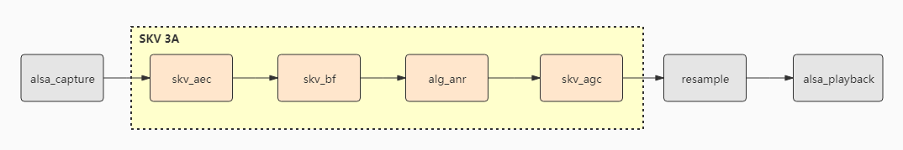

# Rockchip Linux UACApp开发指南

文件标识：RK-KF-YF-527

发布版本：V1.0.0

日期：2020-08-24

文件密级：□绝密   □秘密   □内部资料   ■公开

**免责声明**

本文档按“现状”提供，瑞芯微电子股份有限公司（“本公司”，下同）不对本文档的任何陈述、信息和内容的准确性、可靠性、完整性、适销性、特定目的性和非侵权性提供任何明示或暗示的声明或保证。本文档仅作为使用指导的参考。

由于产品版本升级或其他原因，本文档将可能在未经任何通知的情况下，不定期进行更新或修改。

**商标声明**

“Rockchip”、“瑞芯微”、“瑞芯”均为本公司的注册商标，归本公司所有。

本文档可能提及的其他所有注册商标或商标，由其各自拥有者所有。

**版权所有** **© 2020** **瑞芯微电子股份有限公司**

超越合理使用范畴，非经本公司书面许可，任何单位和个人不得擅自摘抄、复制本文档内容的部分或全部，并不得以任何形式传播。

瑞芯微电子股份有限公司

Rockchip Electronics Co., Ltd.

地址：     福建省福州市铜盘路软件园A区18号

网址：     www.rock-chips.com

客户服务电话： +86-4007-700-590

客户服务传真： +86-591-83951833

客户服务邮箱： fae@rock-chips.com

---

**前言**

**概述**

本文主要描述了UVCApp应用各个模块的使用说明。

**产品版本**

| **芯片名称**  | **内核版本** |
| ------------- | ------------ |
| RV1126/RV1109 | Linux 4.19   |

**读者对象**

本文档（本指南）主要适用于以下工程师：

技术支持工程师

软件开发工程师

**修订记录**

| **版本号** | **作者** | **修改日期** | **修改说明** |
| ---------- | -------- | :----------- | ------------ |
| V1.0.0     | 周弟东 | 2020-08-24 | 初始版本     |

---

**目录**

[TOC]

---

## 简介

uac_app 是基于RK自主研发多媒体播放器rockit，实现UAC功能，其主要作用是：

1. 实现uac驱动相关event事件监听，创建播放器，开启uac功能。

2. 调用rockit完成uac功能。

## 源码说明

```shell
├── CMakeLists.txt
├── configs
│   ├── file_read_usb_playback.json
│   ├── mic_recode_usb_playback.json
│   └── usb_recode_speaker_playback.json
├── doc
│   └── zh-cn
│       ├── resources
│       │   ├── kernel_config.png
│       │   ├── ubuntu_uac_capture.png
│       │   └── ubuntu_uac_playback.png
│       └── Rockchip_Quick_Start_Linux_UAC_CN.md
├── src
│   ├── main.cpp
│   ├── uac_control.cpp
│   ├── uac_control.h
│   ├── uevent.cpp
│   └── uevent.h
└── uac.sh
```

- 编译相关：/external/uac_app/CMakeLists.txt、/buildroot/package/rockchip/uac_app/Config.in  uac_app.mk
- 入口：main.c
- uac脚本配置相关：uac.sh
- uac_app代码实现：uac初始化、uac uevent事件监听、rockit播放器开启和控制、音量事件监听和处理、采样率事件监听和处理、反初始化等处理：
    1. uac_control.cpp：播放器开启和控制和uac事件处理实现
    2. event.cpp：uac事件监听线程实现

## UAC框架流程

UAC的具体描述和说明可以参考[Rockchip_Quick_Start_Linux_UAC_CN.md](../Rockchip_Quick_Start_Linux_UAC/Rockchip_Quick_Start_Linux_UAC_CN.md)的UAC_APP章节，这里做一个流程梳理和总结。

### usb_record_speak_playback框架


 usb_record_speak_playback框架图如上，流程描述如下：

1. uac_app(应用层)调用rockit播放器（媒体框架层）接口，创建媒体播放器，开启uac处理。

2. rockit创建alsa_capture，从usb声卡通过uac驱动读取数据PC端数据。

3. 各种filter数据处理：resample、3A、volume等。

4. 创建alsa_playback，把最终处理数据送SPK声卡输出播放。

### mic_recode_usb_playback框架


 mic_recode_usb_playback框架图如上，流程描述如下：

1. uac_app(应用层)调用rockit播放器（媒体框架层）接口，创建媒体播放器，开启uac处理。

2. rockit创建alsa_capture，从声卡读取MIC录音数据。

3. 各种filter数据处理：resample、3A、volume等。

4. 创建alsa_playback，把最终处理数据从usb声卡通过uac驱动送到PC播放。

## PIPELINE扩展开发

rockit媒体框架是RK自研播放器，借鉴开源的MediaPipe的通用PIPELINE概念和面向TaskGraph框架的先进理念，能够将多种类型的插件，链接在一个处理网络(TaskGraph)中，构建通用的数据处理PIPELINE，进而协同完成特定的数据处理任务。uac就是在rockit媒体框架上完成开发，需要如下步骤：

1. 按照rockit的插件接口标准，完成代码编写和插件注册，比如音频的旧3A算法插件、音量处理插件、重采样插件、新3A算法（包括skv_aec、skv_bf、skv_anr、skv_agc）插件。

2. uac_app中按照标准格式添加json文件的配置。

下面就如何按照标准格式添加json配置做介绍，rockit插件的添加和注册不在本文中介绍。以下以mic_recode_usb_playback.json添加节点作例，usb_recode_usb_playback.json同理。

### mic_recode_usb_playback配置PIPELINE流程

如果mic_recode_usb_playback.son配置支持alsa_capture，skv_aec，skv_bf，alg_anr，skv_agc，resample，alsa_playback：

```json
{
    "pipe_0": {
        "node_0": {
            "node_opts": {
                "node_name"       : "alsa_capture"
            },
            "node_opts_extra": {
                "node_source_uri" : "hw:0,0",
                "node_buff_type"  : 0,
                "node_buff_count" : 2,
                "node_buff_size"  : 4096,
                "node_buff_alloc_type" : "malloc"
            },
            "stream_opts_extra": {
                "opt_samaple_rate": 16000,
                "opt_format"      : "audio:pcm_16",
                "opt_channel"     : 8,
                "opt_channel_layout"  : "int64:255",
                "opt_peroid_size" : 256,
                "opt_peroid_count": 4
            },
            "stream_opts": {
                "stream_fmt_in"   : "audio:pcm_16",
                "stream_fmt_out"  : "audio:pcm_16",
                "stream_output"   : "audio:pcm_0"
            }
        },
        "node_1": {
            "node_opts": {
                "node_name"       : "skv_aec"
            },
            "node_opts_extra": {
                "node_buff_type"  : 0,
                "node_buff_count" : 2,
                "node_buff_size"  : 2048,
                "node_buff_alloc_type" : "malloc"
            },
            "stream_opts_extra": {
                "opt_samaple_rate": 16000,
                "opt_format"      : "audio:pcm_16",
                "opt_channel"     : 8,
                "opt_ref_channel_layout" : "int64:63",
                "opt_rec_channel_layout" : "int64:192",
                "opt_channel_layout"  : "int64:255"
            },
            "stream_opts": {
                "stream_fmt_in"   : "audio:pcm_16",
                "stream_fmt_out"  : "audio:pcm_16",
                "stream_input"    : "audio:pcm_0",
                "stream_output"   : "audio:pcm_1"
            }
        },
        "node_2": {
            "node_opts": {
                "node_name"       : "skv_bf"
            },
            "node_opts_extra": {
                "node_buff_type"  : 0,
                "node_buff_count" : 2,
                "node_buff_size"  : 2048,
                "node_buff_alloc_type" : "malloc"
            },
            "stream_opts_extra": {
                "opt_samaple_rate": 16000,
                "opt_format"      : "audio:pcm_16",
                "opt_channel"     : 2,
                "opt_channel_layout"  : "int64:3"
            },
            "stream_opts": {
                "stream_fmt_in"   : "audio:pcm_16",
                "stream_fmt_out"  : "audio:pcm_16",
                "stream_input"    : "audio:pcm_1",
                "stream_output"   : "audio:pcm_2"
            }
        },
        "node_3": {
            "node_opts": {
                "node_name"       : "alg_anr"
            },
            "node_opts_extra": {
                "node_buff_type"  : 0,
                "node_buff_count" : 2,
                "node_buff_size"  : 1024,
                "node_buff_alloc_type" : "malloc"
            },
            "stream_opts": {
                "stream_fmt_in"   : "audio:pcm_16",
                "stream_fmt_out"  : "audio:pcm_16",
                "stream_input"    : "audio:pcm_2",
                "stream_output"   : "audio:pcm_3"
            },
            "stream_opts_extra": {
                "opt_samaple_rate": 16000,
                "opt_format"      : "audio:pcm_16",
                "opt_channel"     : 1,
                "opt_channel_layout"  : "int64:1"
            }
        },
        "node_4": {
            "node_opts": {
                "node_name"       : "skv_agc"
            },
            "node_opts_extra": {
                "node_buff_type"  : 0,
                "node_buff_count" : 2,
                "node_buff_size"  : 2048,
                "node_buff_alloc_type" : "malloc"
            },
            "stream_opts_extra": {
                "opt_agc_level"   : "float:3000.0",
                "opt_samaple_rate": 16000,
                "opt_format"      : "audio:pcm_16",
                "opt_channel"     : 1,
                "opt_channel_layout"  : "int64:1"
            },
            "stream_opts": {
                "stream_fmt_in"   : "audio:pcm_16",
                "stream_fmt_out"  : "audio:pcm_16",
                "stream_input"    : "audio:pcm_3",
                "stream_output"   : "audio:pcm_4"
            }
        },
        "node_5": {
            "node_opts": {
                "node_name"       : "resample"
            },
            "node_opts_extra": {
                "node_buff_type"  : 0,
                "node_buff_count" : 2,
                "node_buff_size"  : 2048,
                "node_buff_alloc_type" : "malloc"
            },
            "stream_opts_extra": {
                "opt_samaple_rate": 48000,
                "opt_format"      : "audio:pcm_16",
                "opt_channel"     : 2,
                "opt_channel_layout"  : "int64:3"
            },
            "stream_opts": {
                "stream_fmt_in"   : "audio:pcm_16",
                "stream_fmt_out"  : "audio:pcm_16",
                "stream_input"    : "audio:pcm_4",
                "stream_output"   : "audio:pcm_5"
            }
        },
        "node_6": {
            "node_opts": {
                "node_name"       : "alsa_playback"
            },
            "node_opts_extra": {
                "node_source_uri" : "hw:1,0"
            },
            "stream_opts": {
                "stream_fmt_in"   : "audio:pcm_16",
                "stream_fmt_out"  : "audio:pcm_16",
                "stream_input"    : "audio:pcm_5"
            },
            "stream_opts_extra": {
                "opt_alsa_mode"   : "nonblock",
                "opt_samaple_rate": 48000,
                "opt_format"      : "audio:pcm_16",
                "opt_channel"     : 2,
                "opt_channel_layout"  : "int64:3",
                "opt_peroid_size" : 256,
                "opt_peroid_count" : 4
            }
        }
    }
}
```

处理流程如下：



### mic_recode_usb_playback配置参数

json配置每个node必须填写四个参数列表node_opts、node_opts_extra、stream_opts、stream_opts_extra。

以node_4为例对文本进行说明，其他node类似。

| **选择配置**       | **配置参数**          | **参数描述** |
| ------------------| ---------------------|-------------|
| node_opts         | node_name            | 节点名称，根据节点名称查找插件 |
| node_opts_extra   | node_buff_type       | 节点输出buffer分配方法：0表示节点外部分配好buffer，1表示节点内部自己实现分配，音频一般选择外部分配，即选择0 |
|                   | node_buff_count      | 分配节点输出buffer的个数 |
|                   | node_buff_size       | 分配节点输出buffer的大小 |
|                   | node_buff_alloc_type | 分配节点输出buffer的方式，音频使用malloc方式分配内存 |
| stream_opts_extra | opt_agc_level        | agc增益等级，私有参数 |
|                   | opt_samaple_rate     | 采样率 |
|                   | opt_format           | 数据格式，如16bit（audio:pcm_16）；32bit （audio:pcm_32）等 |
|                   | opt_channel          | 声道数 |
|                   | opt_channel_layout   | 声道格式，前缀int64表明该数据为int64类型 |
| stream_opts       | stream_fmt_in        | 流输入的数据格式，如16bit，即audio:pcm_16 |
|                   | stream_fmt_out       | 流输出的数据格式，如16bit，即audio:pcm_16 |
|                   | stream_input         | 流连接，当前node的是流输入是上一个node的流输出，比如上一个node的stream_output是audio:pcm_3。那当前node的stream_input就是audio:pcm_3，如果当前节点是初始节点，那么不用配置 |
|                   | stream_output        | 流连接，当前节点的流输出为audio:pcm_4，如果还有下一个节点，那么下一个节点的流输入就是audio:pcm_4，如果当前节点是末节点，那么不用配置 |

上述表中opt_agc_level是当前节点特有的私有参数，其他是必须配置的共有参数配置。

这里特别说明下stream_input和stream_output，主要用于节点之间传输数据作连接，比如node_3连接到node_4，node_3的输出stream_output是audio:pcm_3，那么node_4的输入stream_input就是audio:pcm_3，输出stream_output是audio:pcm_4，其他节点连接同理，初始节点不需要stream_input，末节点不需要stream_output。

mic_recode_usb_playback的PIPELINE流程如下：


## FAQ

### UAC_APP如何设置外部参数

rockit有外部参数设置invoke接口可供调用接口，使用关键字GRAPH_CMD_TASK_NODE_PRIVATE_CMD即可，通过rockit实现的元数据RtMetaData传输参数，简单方便，下面以uac_app实时设置音量做例子。

```c++
int set_uac_parameter(RTUACGraph* uac, int type, UACAudioConfig config, UACConfigCmd cmd){
    if (uac == RT_NULL)
        return -1;
    int sampleRate = config.samplerate;
    int channels   = 0;
    bool mute      = config.mute;
    float volume   = config.volume;
    if (sampleRate == 0 && channels == 0)
        return -1;
    RtMetaData     *meta = new RtMetaData();
    switch (cmd) {
      case UAC_CONFIG_SAMPLERAET:
        if (sampleRate != 0) {
            meta->setInt32(OPT_SAMPLE_RATE, sampleRate);
            printf("%s: sampleRate = %d\n", __FUNCTION__, sampleRate);
        }
        if (type == UAC_STREAM_RECORD) {
            // the usb record always the first node
            meta->setInt32(kKeyTaskNodeId, 0);
            meta->setCString(kKeyPipeInvokeCmd, OPT_SET_ALSA_CAPTURE);
        } else {
            // find the resample before usb playback, see mic_recode_usb_playback.json
            meta->setInt32(kKeyTaskNodeId, 1);
            meta->setCString(kKeyPipeInvokeCmd, OPT_SET_RESAMPLE);
        }
        break;
      case UAC_CONFIG_VOLUME:
        if (type == UAC_STREAM_RECORD) {
            meta->setInt32(kKeyTaskNodeId, 2);
            meta->setFloat(OPT_VOLUME, volume);
            meta->setInt32(OPT_MUTE, mute);
            meta->setCString(kKeyPipeInvokeCmd, OPT_SET_VOLUME);
        } else {
            meta->setInt32(kKeyTaskNodeId, 2);
            meta->setFloat(OPT_VOLUME, volume);
            meta->setInt32(OPT_MUTE, mute);
            meta->setCString(kKeyPipeInvokeCmd, OPT_SET_VOLUME);
        }
        printf("%s: mute = %d, volume = %f\n", __FUNCTION__, mute, volume);
        break;
      default:
        printf("cannot find UACConfigCmd = %d.\n", cmd);
        break;
    }
    uac->invoke(GRAPH_CMD_TASK_NODE_PRIVATE_CMD, meta);
    delete meta;
    return 0;
}
```

set_uac_parameter函数主要用于实时设置参数的功能，比如函数switch语句中UAC_CONFIG_VOLUME case主要用于音量的处理：

1. 音量事件监听读取uac驱动抛出的音量和静音值，按照元数据设置语法，使用关键字OPT_VOLUME和OPT_MUTE把值分别设置到元数据中。

2. 关键字kKeyTaskNodeId和kKeyPipeInvokeCmd是必须设置的，主要用于找到设置节点和设置参数。比如上述音量设置kKeyTaskNodeId为2，表示当前json配置音量处理插件的节点为2，即node_2（可以修改，这里只是举例子）。kKeyPipeInvokeCmd设置为OPT_SET_VOLUME，那么音量插件就可以根据此关键字解析判断当前meta里面存储的是音量和静音值，读取后做处理。

3. 最后通过RTUACGraph::invoke接口把元数据传输到rockit中。