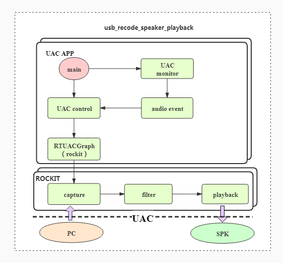
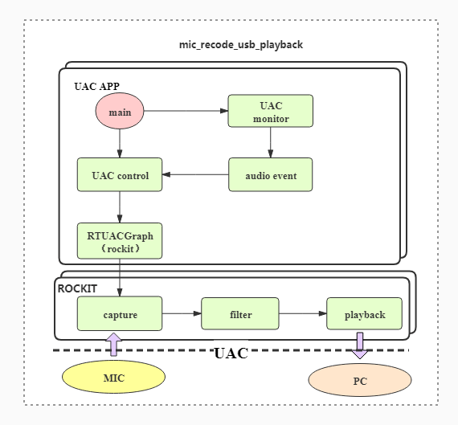

# Rockchip Linux UAC App开发指南

文件标识：RK-KF-YF-527

发布版本：V1.1.0

日期：2020-09-03

文件密级：□绝密   □秘密   □内部资料   ■公开

**免责声明**

本文档按“现状”提供，瑞芯微电子股份有限公司（“本公司”，下同）不对本文档的任何陈述、信息和内容的准确性、可靠性、完整性、适销性、特定目的性和非侵权性提供任何明示或暗示的声明或保证。本文档仅作为使用指导的参考。

由于产品版本升级或其他原因，本文档将可能在未经任何通知的情况下，不定期进行更新或修改。

**商标声明**

“Rockchip”、“瑞芯微”、“瑞芯”均为本公司的注册商标，归本公司所有。

本文档可能提及的其他所有注册商标或商标，由其各自拥有者所有。

**版权所有** **© 2020** **瑞芯微电子股份有限公司**

超越合理使用范畴，非经本公司书面许可，任何单位和个人不得擅自摘抄、复制本文档内容的部分或全部，并不得以任何形式传播。

瑞芯微电子股份有限公司

Rockchip Electronics Co., Ltd.

地址：     福建省福州市铜盘路软件园A区18号

网址：     www.rock-chips.com

客户服务电话： +86-4007-700-590

客户服务传真： +86-591-83951833

客户服务邮箱： fae@rock-chips.com

---

**前言**

**概述**

本文主要描述了UVCApp应用各个模块的使用说明。

**产品版本**

| **芯片名称**  | **内核版本** |
| ------------- | ------------ |
| RV1126/RV1109 | Linux 4.19   |

**读者对象**

本文档（本指南）主要适用于以下工程师：

技术支持工程师

软件开发工程师

**修订记录**

| **版本号** | **作者** | **修改日期** | **修改说明** |
| ---------- | -------- | :----------- | ------------ |
| V1.0.0     | 周弟东 | 2020-08-24 | 初始版本     |
| V1.1.0    | 何华 | 2020-09-03 | 添加uevent说明;修改UAC配置描述 |

---

**目录**

[TOC]

---

## 简介

uac_app 是基于RK自主研发多媒体播放器rockit，实现UAC功能，其主要作用是：

1. 实现uac驱动相关event事件监听，创建播放器，开启uac功能。

2. 调用rockit完成uac功能。

## 源码说明

```shell
├── CMakeLists.txt
├── configs
│   ├── file_read_usb_playback.json
│   ├── mic_recode_usb_playback.json
│   └── usb_recode_speaker_playback.json
├── doc
│   └── zh-cn
│       ├── resources
│       │   ├── kernel_config.png
│       │   ├── ubuntu_uac_capture.png
│       │   └── ubuntu_uac_playback.png
│       └── Rockchip_Quick_Start_Linux_UAC_CN.md
├── src
│   ├── main.cpp
│   ├── uac_control.cpp
│   ├── uac_control.h
│   ├── uevent.cpp
│   └── uevent.h
└── uac.sh
```

- 编译相关：/external/uac_app/CMakeLists.txt、/buildroot/package/rockchip/uac_app/Config.in  uac_app.mk
- 入口：main.c
- uac脚本配置相关：uac.sh
- uac_app代码实现：uac初始化、uac uevent事件监听、rockit播放器开启和控制、音量事件监听和处理、采样率事件监听和处理、反初始化等处理：
    1. uac_control.cpp：播放器开启和控制和uac事件处理实现
    2. event.cpp：uac事件监听线程实现

## UAC框架流程

UAC的具体描述和说明可以参考[Rockchip_Quick_Start_Linux_UAC_CN.md](../Rockchip_Quick_Start_Linux_UAC/Rockchip_Quick_Start_Linux_UAC_CN.md)的UAC_APP章节，这里做一个流程梳理和总结。

UAC动作/命令的发起和停止，均是由一个设备发起，这个发起的设备，在本文中称为Master(主)设备，被动执行的设备，在本文中称为Slave(从)设备。以PC和RV1126为例，将RV1126连入PC。PC为Master设备，RV1126为Slave设备，任何的录音和放音动作，都是从PC端开启，RV1126遵照PC端的指令执行相应动作，其数据流如下：

Master端放音：Master设备(PC)写USB 声卡-->UAC驱动-->Slave设备(RV1126)读USB 声卡

Master端放音：Slave设备(RV1126)写USB 声卡-->UAC驱动-->Master设备(PC)读USB 声卡

### Slave(从)设备端的uevent事件

由于Slave(从)设备永远都是被动执行Master(主)设备的命令，因此Slave(从)设备必现能够正确获取Master设备的命令和动作，这个是通过uevent事件来完成的。Rockchip的UAC驱动，会将Master端的命令/动作，转换成不同的uevent事件来通知Slave设备做出相应的响应。目前UAC驱动中完成的几种uevent事件：

- 录音/放音的开启和关闭uevent事件
- 录音/放音采样率设置uevent事件
- 录音/放音音量大小和静音的uevent事件

#### Master(主)设备开启/关闭放音(播放)，Slave(从)设备收到的uevent事件

Master(主)设备端打开USB声卡，并开始往USB声卡写数据。以Master(主)设备为Ubuntu PC为例，在PC端输入如下命令：

```shell
aplay -Dhw:1,0 -r 48000 -c 2 -f s16_le test.wav
```

其中，-Dhw:1,0表示Ubuntu PC端看到的uac设备的声卡card为1，device为0。

上述命令，PC会打开声卡hw:1,0， 并以采样率48K，声道2播放test.wav文件。

Slave(从)设备端的uac_app会从uac驱动收到如下的uevent事件：

```txt
strs[0] = ACTION=change
strs[1] = DEVPATH=/devices/virtual/u_audio/UAC1_Gadget 0
strs[2] = SUBSYSTEM=u_audio
strs[3] = USB_STATE=SET_INTERFACE
strs[4] = STREAM_DIRECTION=OUT
strs[5] = STREAM_STATE=ON
```

说明：

strs[0] =  ACTION=change 无特殊意义

strs[1] = DEVPATH=/devices/virtual/u_audio/UAC1_Gadget   UAC1_Gadget表明当前使用的uac1协议，如果使用是的uac2协议，那么该处为UAC2_Gadget.

strs[3] = USB_STATE=SET_INTERFACE 表明当前的动作

strs[4] = STREAM_DIRECTION=OUT  OUT表明数据流的方向(对Master设备来说)，OUT表明数据从Master通过UAC驱动发送到Slave设备，因此对于Slave(从)设备来说，需要从USB声卡录音/读取数据。

strs[5] = STREAM_STATE=ON   ON表明当前动作为打开，即打开声卡

当uac_app收到如上uevent时，表明Master设备已开启了从usb声卡放音，此时，Slave端应建立对应的数据通路，从usb声卡读取音频数据。

当Master(主)设备关闭写USB声卡时，uac_app会从UAC驱动中获取如下的uevent事件：

```txt
strs[0] = ACTION=change
strs[1] = DEVPATH=/devices/virtual/u_audio/UAC1_Gadget 0
strs[2] = SUBSYSTEM=u_audio
strs[3] = USB_STATE=SET_INTERFACE
strs[4] = STREAM_DIRECTION=OUT
strs[5] = STREAM_STATE=OFF
```

说明：

strs[0]~strs[4]：同3.11的说明。

strs[5] = STREAM_STATE=OFF OFF表示当前动作为关闭，即关闭声卡。

当uac_app收到如上uevent时，表明Master设备已关闭了从usb声卡放音，此时，Slave端销毁对应的数据通路。

#### Master(主)设备开启/关闭录音，Slave(从)设备收到的uevent事件

Master(主)设备端打开USB声卡，并开始从USB声卡录制数据。以Master(主)设备为Ubuntu PC为例，在PC端输入如下命令：

```shell
arecord -Dhw:1,0 -f s16_le -r 48000 -c 2
```

其中，-Dhw:1,0表示Ubuntu PC端看到的uac设备的声卡card为1，device为0。

上述命令，PC会打开声卡hw:1,0， 并以采样率48K，声道2播放test.wav文件。

```txt
strs[0] = ACTION=change
strs[1] = DEVPATH=/devices/virtual/u_audio/UAC1_Gadget 0
strs[2] = SUBSYSTEM=u_audio
strs[3] = USB_STATE=SET_INTERFACE
strs[4] = STREAM_DIRECTION=IN
strs[5] = STREAM_STATE=ON
```

strs[0]~strs[3]：同3.11的说明。

strs[4] = STREAM_DIRECTION=IN  IN表明数据流的方向(相对于Master设备来说)，数据从Slave(从)设备通过USB声卡发往Master(主)设备。

strs[5] = STREAM_STATE=ON  ON表示当前动作为打开声卡

当uac_app收到如上uevent时，表明Master设备已开启了从usb声卡录音，此时，Slave端需要建立对应的数据通路，将音频数据写往usb声卡。

当Master设备关闭从USB声卡录音时，uac_app收到的uevent事件如下：

```txt
strs[0] = ACTION=change
strs[1] = DEVPATH=/devices/virtual/u_audio/UAC1_Gadget 0
strs[2] = SUBSYSTEM=u_audio
strs[3] = USB_STATE=SET_INTERFACE
strs[4] = STREAM_DIRECTION=IN
strs[5] = STREAM_STATE=OFF
```

strs[0]~strs[4]：同3.13的说明。

strs[5] = STREAM_STATE=OFF  OFF表示当前动作为关闭声卡。

当uac_app收到如上uevent时，表明Master设备已关闭了从usb声卡录音，此时，Slave端销毁对应的数据通路。

#### 放音/录音设置采样率的uevent事件

当设置UAC设备支持多个采样率时(多采样率的配置在uac脚本中，见uac.sh)，需要获取Master设备端录音和放音时的音频数据的采样率，UAC驱动通过如下uevent事件来完成采样率的设置：

```txt
strs[0] = ACTION=change
strs[1] = DEVPATH=/devices/virtual/u_audio/UAC1_Gadget 0
strs[2] = SUBSYSTEM=u_audio
strs[3] = USB_STATE=SET_SAMPLE_RATE
strs[4] = STREAM_DIRECTION=IN
strs[5] = SAMPLE_RATE=48000
```

strs[0]~strs[2] 同3.1.1

strs[3] = USB_STATE=SET_SAMPLE_RATE 表明当前为设置采样率的uevent事件

strs[4] = STREAM_DIRECTION=IN IN表明数据流的方向(对于Master设备)，IN表明数据要从Slave设备发往Master设备，即Master端从usb录音，Slave端从usb放音。

strs[5] = SAMPLE_RATE=48000  48000表明数据的采样率为48K，该数值为Master端需要的音频数据的采样率，该值为Master端打开USB声卡时实际设置的采样率。

收到该uevent事件，说明Master设备已经开启了从usb录音，且所需音频数据的采样率为uevent上报的采样率，因此Slave设备端必须按照对应的采样率准备音频数据，并写往USB声卡。

同理，Master设备放音时，uac_app会收到如下的uevent事件：

```txt
strs[0] = ACTION=change
strs[1] = DEVPATH=/devices/virtual/u_audio/UAC1_Gadget 0
strs[2] = SUBSYSTEM=u_audio
strs[3] = USB_STATE=SET_SAMPLE_RATE
strs[4] = STREAM_DIRECTION=OUT
strs[5] = SAMPLE_RATE=48000
```

strs[0]~strs[3]，strs[5]同上。

strs[4] = STREAM_DIRECTION=OUT OUT表明数据从Master设备写往Slave设备。

需要注意的是：相同的流程，只有当采样率发生变化时，UAC驱动才会上报对应的采样率。

比如：Master进行了2次播放，数据流从Master-->Slave设备。第一次播放音频的采样率为假设为48K，第二次播放音频的采样率如果也为48K，因为2次的采样率相同，那么UAC驱动不会向uac_app上报第二次设置采样率的uevent事件。假如第二次播放设置的采样率为44.1K，因为2次的采样率不相同，uac_app会收到UAC上报2次设置采样率的uevent事件，将第一次的采样率设置为48K，第二次的设置为44.1K。同理Master设备的录音流程。因此，在应用(uac_app)中需要保存最后一次通报的采样率。

#### 放音/录音设置音量大小和静音的uevent事件

当在Master端，调节UAC设备的音量大小或者设置uac设备静音时，UAC驱动会向Slave端会通过发送如下的uevent事件：

设置音量大小的uevent事件：

```txt
strs[0] = ACTION=change
strs[1] = DEVPATH=/devicges/virtual/u_audio/UAC1_Gadgeta 0
strs[2] = SUBSYSTEM=u_audio
strs[3] = USB_STATE=SET_VOLUME
strs[4] = STREAM_DIRECTION=OUT
strs[5] = VOLUME=72%
```

strs[0]~strs[2] 同3.1.1
strs[3] = USB_STATE=SET_VOLUME 表明当前动作为设置音量大小
strs[4] = STREAM_DIRECTION=OUT OUT表明设置当前数据流方向为Master发往Slave端。如果是Master从Slave设备录音，则该值为IN。
strs[5] = VOLUME=72%  该数值表示设置的音量大小百分比，合理的值为0~100%， demo中72%表明调整当当前音量的72%。

设置/取消静音的uevent事件：

```txt
strs[0] = ACTION=change
strs[1] = DEVPATH=/devices/virtual/u_audio/UAC1_Gadget 0
strs[2] = SUBSYSTEM=u_audio
strs[3] = USB_STATE=SET_MUTE
strs[4] = STREAM_DIRECTION=OUT
strs[5] = MUTE=1
```

strs[0]~strs[2] 同上
strs[3] = USB_STATE=SET_MUTE 表明当前动作为设置静音
strs[4] = STREAM_DIRECTION=OUT OUT表明设置当前数据流方向为Master发往Slave端。如果是Master从Slave设备录音，则该值为IN。
strs[5] = MUTE=1  MUTE=1表示Master设置了uac设备的静音，MUTE=0表明Master端取消了uac设备的静音。

由于Master设备端驱动的原因，需要注意如下：

- 只有uac1支持Master设置uac设备静音和音量大小， uac2不支持。
- 只有mac os，window系统才支持Master设置uac设备静音和音量大小，Linux和Android不支持。

### UAC数据流

UAC根据数据流向，可分为相互独立，互不影响的2个流程：

1. Master放音(写usb声卡)-->UAC驱动-->Slave设备(读usb声卡)
2. Slave设备(写usb声卡)-->UAC驱动-->Master设备((读usb声卡)

目前uac_app完成了以上2个流程的实现。其中，流程1在 uac_app实现为Master写数据到usb声卡，Slave从usb声卡读取数据，并从speaker输出，记为Master放音Slave录音并播放；流程2在uac_app上实现为Slave设备mic录音，然后写usb声卡，Master端从usb声卡读取数据的流程，记为Slave mic录音，数据发往Master流程。

#### Master放音，Slave录音并播放



 其框架图如上，描述如下：

1. Master端打开usb声卡准备放音。
2. UAC驱动发送对应的uevent到Slave端的uac_app。
3. Slave端uac_app收到对应uevent事件，配置usb_recode_speaker_playback.json给rockit， rockit按照usb_recode_speaker_playback.json的描述建立数据通路：usb声卡读取音频数据->各种音频算法处理-->speaker。
4. Master端向usb声卡发送数据(写usb声卡)，UAC驱动将Master端数据传送Slave端，Slave端从usb声卡读取数据。
5. 当Master退出当前放音流程时，UAC驱动发送对应的uevent到Slave端的uac_app，uac_app退出当前流程。

#### Slave mic录音，数据发往Master流程



其框架图如上，描述如下：

1. Master设备打开usb声卡准备录音。
2. UAC驱动发送对应的uevent到Slave端的uac_app。
3. uac_app收到对应uevent后，配置mic_recode_usb_playback.json文件给rockit， rockit按照mic_recode_usb_playback.json的描述，创建数据通路：Slave mic-->各种音频算法处理-->usb 声卡
4. Slave端完成数据的录制和处理，写usb声卡。UAC驱动完成Slave端数据到Master端的传送。Master设备从usb声卡读取音频数据。
5. 当Master退出当前录音流程时，UAC驱动发送对应的uevent到Slave端的uac_app，uac_app退出当前流程。

rockit是Rockchip借鉴MediaPipe的思想，实现的一套支持UAC，UVC，AI和多媒体播放的多媒体库，支持跨Linux，Anroid等平台，这里不做过多描述。

### UAC json文件配置

uac_app中2个数据流程，由rockit媒体库解析json配置文件的配置，完成对应音频组件的创建和处理。json文件的主要作用是定义整个数据通路的结构、各个音频组件的参数等。客户可按照自己硬件配置和要求，修改json文件中对应的设置，以满足其需求。

将以如下例子，对json文件的配置进行说明：

```json
{
    "pipe_0": {
        "node_0": {
            "node_opts": {
                "node_name"       : "alsa_capture"
            },
            "node_opts_extra": {
                "node_source_uri" : "hw:0,0",
                "node_buff_type"  : 0,
                "node_buff_count" : 2,
                "node_buff_size"  : 4096,
                "node_buff_alloc_type" : "malloc"
            },
            "stream_opts_extra": {
                "opt_samaple_rate": 16000,
                "opt_format"      : "audio:pcm_16",
                "opt_channel"     : 8,
                "opt_channel_layout"  : "int64:255",
                "opt_peroid_size" : 256,
                "opt_peroid_count": 4
            },
            "stream_opts": {
                "stream_fmt_in"   : "audio:pcm_16",
                "stream_fmt_out"  : "audio:pcm_16",
                "stream_output"   : "audio:pcm_0"
            }
        },
        "node_1": {
            "node_opts": {
                "node_name"       : "skv_aec"
            },
            "node_opts_extra": {
                "node_buff_type"  : 0,
                "node_buff_count" : 2,
                "node_buff_size"  : 2048,
                "node_buff_alloc_type" : "malloc"
            },
            "stream_opts_extra": {
                "opt_samaple_rate": 16000,
                "opt_format"      : "audio:pcm_16",
                "opt_channel"     : 8,
                "opt_ref_channel_layout" : "int64:63",
                "opt_rec_channel_layout" : "int64:192",
                "opt_channel_layout"  : "int64:255"
            },
            "stream_opts": {
                "stream_fmt_in"   : "audio:pcm_16",
                "stream_fmt_out"  : "audio:pcm_16",
                "stream_input"    : "audio:pcm_0",
                "stream_output"   : "audio:pcm_1"
            }
        },
        "node_2": {
            "node_opts": {
                "node_name"       : "skv_bf"
            },
            "node_opts_extra": {
                "node_buff_type"  : 0,
                "node_buff_count" : 2,
                "node_buff_size"  : 2048,
                "node_buff_alloc_type" : "malloc"
            },
            "stream_opts_extra": {
                "opt_samaple_rate": 16000,
                "opt_format"      : "audio:pcm_16",
                "opt_channel"     : 2,
                "opt_channel_layout"  : "int64:3"
            },
            "stream_opts": {
                "stream_fmt_in"   : "audio:pcm_16",
                "stream_fmt_out"  : "audio:pcm_16",
                "stream_input"    : "audio:pcm_1",
                "stream_output"   : "audio:pcm_2"
            }
        },
        "node_3": {
            "node_opts": {
                "node_name"       : "alg_anr"
            },
            "node_opts_extra": {
                "node_buff_type"  : 0,
                "node_buff_count" : 2,
                "node_buff_size"  : 1024,
                "node_buff_alloc_type" : "malloc"
            },
            "stream_opts": {
                "stream_fmt_in"   : "audio:pcm_16",
                "stream_fmt_out"  : "audio:pcm_16",
                "stream_input"    : "audio:pcm_2",
                "stream_output"   : "audio:pcm_3"
            },
            "stream_opts_extra": {
                "opt_samaple_rate": 16000,
                "opt_format"      : "audio:pcm_16",
                "opt_channel"     : 1,
                "opt_channel_layout"  : "int64:1"
            }
        },
        "node_4": {
            "node_opts": {
                "node_name"       : "skv_agc"
            },
            "node_opts_extra": {
                "node_buff_type"  : 0,
                "node_buff_count" : 2,
                "node_buff_size"  : 2048,
                "node_buff_alloc_type" : "malloc"
            },
            "stream_opts_extra": {
                "opt_agc_level"   : "float:30000.0",
                "opt_samaple_rate": 16000,
                "opt_format"      : "audio:pcm_16",
                "opt_channel"     : 1,
                "opt_channel_layout"  : "int64:1"
            },
            "stream_opts": {
                "stream_fmt_in"   : "audio:pcm_16",
                "stream_fmt_out"  : "audio:pcm_16",
                "stream_input"    : "audio:pcm_3",
                "stream_output"   : "audio:pcm_4"
            }
        },
        "node_5": {
            "node_opts": {
                "node_name"       : "resample"
            },
            "node_opts_extra": {
                "node_buff_type"  : 0,
                "node_buff_count" : 2,
                "node_buff_size"  : 2048,
                "node_buff_alloc_type" : "malloc"
            },
            "stream_opts_extra": {
                "opt_samaple_rate": 48000,
                "opt_format"      : "audio:pcm_16",
                "opt_channel"     : 2,
                "opt_channel_layout"  : "int64:3"
            },
            "stream_opts": {
                "stream_fmt_in"   : "audio:pcm_16",
                "stream_fmt_out"  : "audio:pcm_16",
                "stream_input"    : "audio:pcm_4",
                "stream_output"   : "audio:pcm_5"
            }
        },
        "node_6": {
            "node_opts": {
                "node_name"       : "alsa_playback"
            },
            "node_opts_extra": {
                "node_source_uri" : "hw:1,0"
            },
            "stream_opts": {
                "stream_fmt_in"   : "audio:pcm_16",
                "stream_fmt_out"  : "audio:pcm_16",
                "stream_input"    : "audio:pcm_5"
            },
            "stream_opts_extra": {
                "opt_alsa_mode"   : "nonblock",
                "opt_samaple_rate": 48000,
                "opt_format"      : "audio:pcm_16",
                "opt_channel"     : 2,
                "opt_channel_layout"  : "int64:3",
                "opt_peroid_size" : 256,
                "opt_peroid_count" : 4
            }
        }
    }
}
```

| **选择配置**       | **配置参数**          | **参数描述** |
| ------------------| ---------------------|-------------|
| node_opts         | node_name            | 节点/插件名称，rockit会根据节点名称查找并创建插件，目前rockit内部实现的音频插件见下个表格 |
| node_opts_extra | node_source_uri | 对于alsa_capture/alsa_playback节点， 定义录音和播放的声卡名称。对于fread/fwrite节点，定义读文件和写文件的url。 |
|    | node_buff_type       | 节点输出buffer来源：0表示插件内部自己管理buffer，1表示插件所需的buffer，由外部分配并提供给插件。音频一般选择内部分配即设置0即可。 |
|                   | node_buff_count      | 插件分配输出buffer的个数。rockit内部是使用mem pool方式管理内存，插件在创建时，会创建对应数量buffer到mem pool。 |
|                   | node_buff_size       | 单个输出buffer的大小。该值为buffer大小的默认值，插件内部会根据其他参数的设置，分配实际所需的buffer大小。 |
|                   | node_buff_alloc_type | 分配输出buffer的方式，"malloc"表示使用malloc方式分配内存，即从堆中分配内存。某些需求中，可能需要分配硬件能访问的DRM buffer，此时可修改该值。 |
| stream_opts_extra | opt_agc_level        | agc私有参数，agc增益等级，其值越高，agc增益越大 |
|                   | opt_samaple_rate     | 音频数据采样率 |
|                   | opt_format           | 数据格式，对于音频数据，可选的数据格式如下：如audio:pcm_16，audio:pcm_32，audio:pcm_float，audio:pcm_db等 |
|                   | opt_channel          | 声道数 |
|                   | opt_channel_layout   | 声道layout，前缀int64表明该数据为int64类型。该值的每一个bit位表示一个声道，比如对于8声道的数据，其layout的二进制为: 0b' 11111111，对应的十进制为255，因此可将其设置为"int64:255"。注意，其值必须和opt_channel的声道数量相对应 |
| | opt_ref_channel_layout | 回采数据的layout，前缀int64表明该数据为int64类型。该值为音频aec算法的私有参数，用于标示出回采数据所在的channel。示例中，其值为"int64:63"， 63的二进制可写成0b'111111， 标示8channel的音频数据中，channel0~channel5为回采数据。 |
| | opt_rec_channel_layout | 录音数据的layout，前缀int64表明该数据为int64类型。该值为音频aec算法的私有参数，用于标示出录音数据所在的channel。示例中，其值为"int64:192"， 192的二进制可写成0b'11000000， 标示8channel的音频数据中，channel6，channel7为录音数据。 |
| | opt_peroid_size | alsa_capture/alsa_playback节点的私有参数，用的定义打开声卡时的peroid_size。如没有该设置项，默认的peroid_size=512帧 |
| | opt_peroid_count | alsa_capture/alsa_playback节点的私有参数，用的定义打开声卡时的peroid_count。如没有该设置项，默认的peroid_count=4 |
| | opt_alsa_mode | alsa_capture/alsa_playback节点的私有参数，用于定义打开声卡的模式，可选的模式为：nonblock(非阻塞方式，如设为nonblock则会按照轮休的方式查询声卡数据)，mmap，noninterleaved(不同channel的数据交替存放)。如没有该设置项，rockit中默认采用block，unmmap，interleaved方式录取/播放数据。 |
| stream_opts       | stream_fmt_in        | 输入流数据格式，如audio:pcm_16 |
|                   | stream_fmt_out       | 输出流数据格式，如audio:pcm_16 |
|                   | stream_input         | 输入流标识。如某节点需要用到前级节点的数据，其stream_input的值必须和前级节点的stream_ouput的值相同。比如"alsa_capture"节点，它是第一个节点，因此它无输入流；"skv_aec"节点作为"alsa_capture"的后级节点，其输入流的标识必须和"alsa_capture"输出流的标识相同，表示"alsa_capture"录取到的数据，会直接发送给"skv_aec"作为输入。 |
|                   | stream_output | 输出流标识。如某节点需要用到前级节点的数据，其stream_input的值必须和前级节点的stream_ouput的值相同。比如"alsa_playback"节点，它是最后节点，因此它无输出流；"resample"作为"alsa_playback"的前级节点，其输出流的标识和"alsa_playback"输入流的标识相同，表示"resample"处理的数据，会发送给"alsa_playback"作为输入。 |

特别说明下stream_input和stream_output，主要用于节点之间传输数据作连接，比如node_3连接到node_4，node_3的输出stream_output是audio:pcm_3，那么node_4的输入stream_input就是audio:pcm_3，输出stream_output是audio:pcm_4，其他节点连接同理，初始节点不需要stream_input，末节点不需要stream_output。

示例中pipeline如下：


目前，rockit内部已实现的音频处理节点如下表所示：

| node_name     | 说明                                                         |
| ------------- | ------------------------------------------------------------ |
| fread         | 读文件节点。用于使用文件测试作为输入的场景，从node_source_uri定义的文件中读取数据 |
| fwrite        | 写文件节点。用于查看输出数据的场景，将数据写到node_source_uri定义的文件中 |
| alsa_capture  | slave端音频录音节点。从node_source_uri定义的声卡出录音       |
| alsa_playback | slave端音频放音节点，从node_source_uri定义的声卡出放音       |
| skv_aec       | rockchip音频回声消除算法(AEC)节点， 只支持16K，audio:pcm_16的音频，输出去除回采的音频 |
| skv_bf        | rockchip波束算法(BF)节点， 只支持16K，audio:pcm_16的音频，输出单channel |
| skv_agc       | rockchip自动增益算法(AGC)节点， 只支持16K，audio:pcm_16的音频 |
| alg_anr       | rockchip噪音消除算法(ANR)节点，只支持8K/16K，audio:pcm_16的音频 |
| resample      | 音频重采样节点                                               |
| filter_volume | 软件调节音量/静音节点                                        |

### UAC外部参数设置

json文件，配置了uac流程各个节点的默认参数，但是如果默认的参数不能满足要求时，就需要动态的修改某些节点的参数。比如json文件中，默认配置usb声卡的采样率为48000，但是Master设备可能以44100的采样率向usb声卡发送数据，因而Slave端必须以44100的采样率打开声卡，而不是json文件默认配置的48000采样率。

rockit定义的数据结构(类)RtMetaData，其实现思想是将参数按照key：value的方式保存到起来。RtMetaData提供了设置/获取int，float，string，point等类型的接口，如下：

```C++
virtual RT_BOOL setCString(const char* key, const char *value);
virtual RT_BOOL setInt32(const char* key, INT32 value);
virtual RT_BOOL setInt64(const char* key, INT64 value);
virtual RT_BOOL setFloat(const char* key, float value);
virtual RT_BOOL setPointer(const char* key, RT_PTR value, RTMetaValueFree freeFunc = RT_NULL);
virtual RT_BOOL findCString(const char* key, const char **value) const;
virtual RT_BOOL findInt32(const char* key, INT32 *value) const;
virtual RT_BOOL findInt64(const char* key, INT64 *value) const;
virtual RT_BOOL findFloat(const char* key, float *value) const;
virtual RT_BOOL findPointer(const char* key, RT_PTR *value) const;
```

其中，key为写入参数的名称，value为实际的值。通过以上接口，RtMetaData可以传输任意类型的数据。

uac_app默认实现了对音频采样率，音量大小和静音的外部参数设置。uac_app中将需要修改的参数，写入到RtMetaData内部，然后调用rockit的invoke接口，将RtMetaData传入到对应的音频处理节点，rockit内部的音频处理节点通过find接口，将对应的参数取出，修改节点的参数配置。如下图set_uac_parameter为uac_app中实时设置参数的接口。

```c++
int set_uac_parameter(RTUACGraph* uac, int type, UACAudioConfig config, UACConfigCmd cmd){
    if (uac == RT_NULL)
        return -1;
    int sampleRate = config.samplerate;
    int channels   = 0;
    bool mute      = config.mute;
    float volume   = config.volume;
    if (sampleRate == 0 && channels == 0)
        return -1;
    RtMetaData     *meta = new RtMetaData();
    switch (cmd) {
      case UAC_CONFIG_SAMPLERAET:
        if (sampleRate != 0) {
            meta->setInt32(OPT_SAMPLE_RATE, sampleRate);
            printf("%s: sampleRate = %d\n", __FUNCTION__, sampleRate);
        }
        if (type == UAC_STREAM_RECORD) {
            // the usb record always the first node
            meta->setInt32(kKeyTaskNodeId, 0);
            meta->setCString(kKeyPipeInvokeCmd, OPT_SET_ALSA_CAPTURE);
        } else {
            // find the resample before usb playback, see mic_recode_usb_playback.json
            meta->setInt32(kKeyTaskNodeId, 1);
            meta->setCString(kKeyPipeInvokeCmd, OPT_SET_RESAMPLE);
        }
        break;
      case UAC_CONFIG_VOLUME:
        if (type == UAC_STREAM_RECORD) {
            meta->setInt32(kKeyTaskNodeId, 2);
            meta->setFloat(OPT_VOLUME, volume);
            meta->setInt32(OPT_MUTE, mute);
            meta->setCString(kKeyPipeInvokeCmd, OPT_SET_VOLUME);
        } else {
            meta->setInt32(kKeyTaskNodeId, 2);
            meta->setFloat(OPT_VOLUME, volume);
            meta->setInt32(OPT_MUTE, mute);
            meta->setCString(kKeyPipeInvokeCmd, OPT_SET_VOLUME);
        }
        printf("%s: mute = %d, volume = %f\n", __FUNCTION__, mute, volume);
        break;
      default:
        printf("cannot find UACConfigCmd = %d.\n", cmd);
        break;
    }
    uac->invoke(GRAPH_CMD_TASK_NODE_PRIVATE_CMD, meta);
    delete meta;
    return 0;
}
```

以设置音量大小为例，进行说明。

1. Master设备调节UAC的音量

2. UAC驱动发送设置音量大小的uevent事件到Slave端

3. Slave端uac_app捕获事件，并解析出当前音量百分比，以及解析出是Master放音还是Master录音。

4. uac_app调用set_uac_parameter进行音量设置，见UAC_CONFIG_VOLUME的处理：如果是Master放音，对于Slave来说，即从usb录音，此时type = UAC_STREAM_RECORD。

   ```C++
   meta->setInt32(kKeyTaskNodeId, 2);
   ```

   表明该meta是向node_2发送，其中kKeyTaskNodeId在rockit定义的宏，2表示节点2。不同的json配置文件，节点2表示的处理可能不一样，示例的json如后图所示，节点2表示filter_volume节点。

   ```C++
   meta->setFloat(OPT_VOLUME, volume);
   meta->setInt32(OPT_MUTE, mute);
   ```

    设置当前音量和是否静音标记设置到meta。

   ```C++
   meta->setCString(kKeyPipeInvokeCmd, OPT_SET_VOLUME);
   ```

   节点filter_volume的代码中可能有多个invoke的处理，设置kKeyPipeInvokeCmd为OPT_SET_VOLUME，则要求节点filter_volume设置音量大小，其中kKeyPipeInvokeCmd是定义在rokcit中的宏。

   ```C++
   uac->invoke(GRAPH_CMD_TASK_NODE_PRIVATE_CMD, meta);
   ```

   该代码，将meta数据传递给uac，其中GRAPH_CMD_TASK_NODE_PRIVATE_CMD是定义在rokcit中的宏。rockit代码，会将meta数据传递给kKeyTaskNodeId定义的节点2(即filter_volume)，节点2(即filter_volume)会从kKeyPipeInvokeCmd取出当前请求的操作，并读取出音量大小或者是否静音标记，对音频数据做软件的音量或者静音处理。

5. 以下为当前代码对应的的json文件，符号"......."表示示例中将参数省略，从如下可知，node2为filter_volume，即音量和静音处理的节点。

    ```json
    {
          "pipe_0": {
              "node_0": {
                  "node_opts": {
                      "node_name"       : "alsa_capture"
                  },
                  ......
              },
              "node_1": {
                  "node_opts": {
                      "node_name"       : "resample"
                  },
                  ......
              },
              "node_2": {
                  "node_opts": {
                      "node_name"       : "filter_volume"
                  },
                  ......
              },
              "node_3": {
                  "node_opts": {
                      "node_name"       : "alsa_playback"
                  },
                  ......
              }
          }
    }
    ```

   同理，可以按照以上方式设置Slave打开声卡的采样率。需要注意的，如果json文件的配置发生了改变，那么记得修改set_uac_parameter中对应节点的序号。
