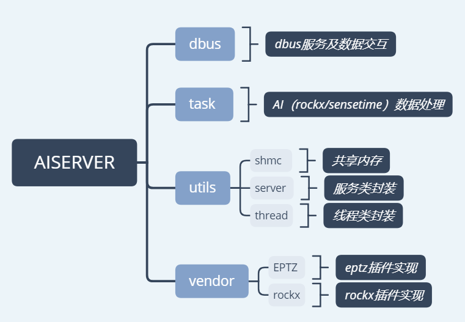

# Rockchip AiServer介绍

文件标识：RK-KF-YF-537

发布版本：V1.0.0

日期：2021-01-25

文件密级：□绝密   □秘密   □内部资料   ■公开

---

**免责声明**

本文档按“现状”提供，瑞芯微电子股份有限公司（“本公司”，下同）不对本文档的任何陈述、信息和内容的准确性、可靠性、完整性、适销性、特定目的性和非侵权性提供任何明示或暗示的声明或保证。本文档仅作为使用指导的参考。

由于产品版本升级或其他原因，本文档将可能在未经任何通知的情况下，不定期进行更新或修改。

**商标声明**

“Rockchip”、“瑞芯微”、“瑞芯”均为本公司的注册商标，归本公司所有。

本文档可能提及的其他所有注册商标或商标，由其各自拥有者所有。

**版权所有** **© 2021 **瑞芯微电子股份有限公司**

超越合理使用范畴，非经本公司书面许可，任何单位和个人不得擅自摘抄、复制本文档内容的部分或全部，并不得以任何形式传播。

瑞芯微电子股份有限公司

Rockchip Electronics Co., Ltd.

地址：     福建省福州市铜盘路软件园A区18号

网址：     [www.rock-chips.com](http://www.rock-chips.com)

客户服务电话： +86-4007-700-590

客户服务传真： +86-591-83951833

客户服务邮箱： [fae@rock-chips.com](mailto:fae@rock-chips.com)

---

**读者对象**

本文档主要适用于以下工程师：

- 技术支持工程师
- 软件开发工程师

**修订记录**

| **日期**   | **版本** | **作者** | **修改说明** |
| ---------- | -------- | -------- | ------------ |
| 2021/01/25 | 1.0.0    | 林其浩   | 初始版本     |
|            |          |          |              |
|            |          |          |              |

**目 录**

[TOC]

## 概述

aiserver通过rockit模块建立pipe的概念，可对单个或者多个通路的media stream进行配置重组，实现下面这些功能的排列组合：

1. 摄像头设备采集。
2. 视频编码。
3. 支持rockx、rga、eptz等filter插件。

## 代码模块说明

### 目录结构

### 配置说明

SDK默认使用external\rockit\sdk\conf\aicamera_rockx.json配置文件，编译后将默认安装在/oem/usr/share/aiserver/aicamera.json。

Json文件中的具体节点含义，请参考external\rockit\doc下《Rockchip_Developer_Guide_Linux_Rockit_CN.pdf》自动构建rockit应用章节。开发注意事项：

1. 对于已有的node_x，请保持原有编号。
2. 替换第三方算法模块，请使用node_11节点进行开发。
3. json文件下发的link_mode为内置连接通路，可根据需求进行修改。暂不支持新增自定义link_mode通路。
