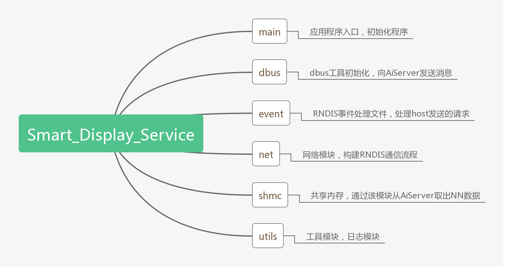

# Rockchip Smart_Display_Service介绍

文件标识：RK-KF-YF-538

发布版本：V1.0.0

日期：2021-01-26

文件密级：□绝密   □秘密   □内部资料   ■公开

**免责声明**

本文档按“现状”提供，瑞芯微电子股份有限公司（“本公司”，下同）不对本文档的任何陈述、信息和内容的准确性、可靠性、完整性、适销性、特定目的性和非侵权性提供任何明示或暗示的声明或保证。本文档仅作为使用指导的参考。

由于产品版本升级或其他原因，本文档将可能在未经任何通知的情况下，不定期进行更新或修改。

**商标声明**

“Rockchip”、“瑞芯微”、“瑞芯”均为本公司的注册商标，归本公司所有。

本文档可能提及的其他所有注册商标或商标，由其各自拥有者所有。

**版权所有 © 2021 瑞芯微电子股份有限公司**

超越合理使用范畴，非经本公司书面许可，任何单位和个人不得擅自摘抄、复制本文档内容的部分或全部，并不得以任何形式传播。

瑞芯微电子股份有限公司

Rockchip Electronics Co., Ltd.

地址：     福建省福州市铜盘路软件园A区18号

网址：     [www.rock-chips.com](http://www.rock-chips.com)

客户服务电话： +86-4007-700-590

客户服务传真： +86-591-83951833

客户服务邮箱： [fae@rock-chips.com](mailto:fae@rock-chips.com)

---

**读者对象**

本文档主要适用于以下工程师：

技术支持工程师

软件开发工程师

**修订记录**

| **版本号** | **作者** | **修改日期** | **修改说明**                                 |
| ---------- | -------- | :----------- | -------------------------------------------- |
| V1.0.0     | 翁韬     | 2021-01-26   | 初始版本                                     |
|            |          |              |                                              |
|            |          |              |                                              |
|            |          |              |                                              |

---

**目录**

[TOC]

---

## 概述

Smart_Display_Service是一个负责与Host进行RNDIS通信的应用程序，分别完成了以下几个功能：

1. 通过RNDIS接收及发送控制指令和数据信息。
2. 通过SHM模块和Aiserver交互，获取NN的数据信息。

## 代码模块说明

### 目录结构

### 使用说明

目前已完成了AiServer取数据以及RNDIS通信的相关流程，AiServer取数据的代码在文件net/shm_control.cpp中，通过共享内存取出NN数据，随后调用方法response_send发送数据至host端。Host端命令的响应代码在event/event_handle.cpp中，通过handle_callback方法返回指令处理结果。

若客户有定制化需求，仅需要修改这两部分代码即可，其余部分如RNDIS的构建、SHMC的构建等，已经完成，如有疑问，请提交Redmine处理。
