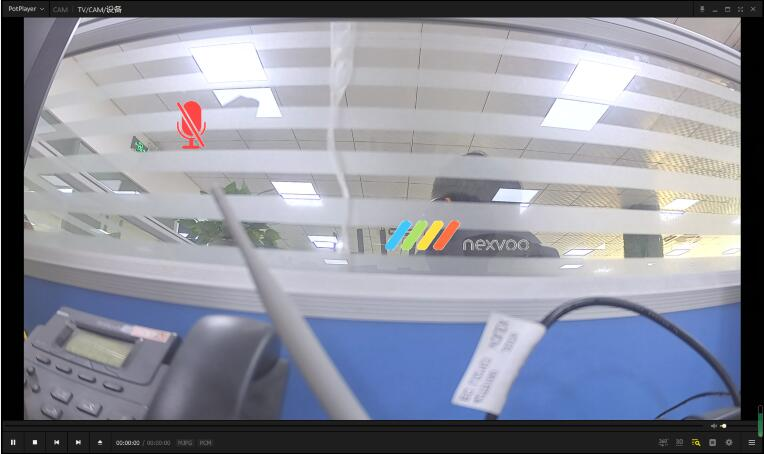

# Rockchip UVCApp介绍

文件标识：RK-SM-YF-520

发布版本：V1.5.0

日期：2020-12-30

文件密级：□绝密   □秘密   □内部资料   ■公开

**免责声明**

本文档按“现状”提供，瑞芯微电子股份有限公司（“本公司”，下同）不对本文档的任何陈述、信息和内容的准确性、可靠性、完整性、适销性、特定目的性和非侵权性提供任何明示或暗示的声明或保证。本文档仅作为使用指导的参考。

由于产品版本升级或其他原因，本文档将可能在未经任何通知的情况下，不定期进行更新或修改。

**商标声明**

“Rockchip”、“瑞芯微”、“瑞芯”均为本公司的注册商标，归本公司所有。

本文档可能提及的其他所有注册商标或商标，由其各自拥有者所有。

**版权所有** **© 2020** **瑞芯微电子股份有限公司**

超越合理使用范畴，非经本公司书面许可，任何单位和个人不得擅自摘抄、复制本文档内容的部分或全部，并不得以任何形式传播。

瑞芯微电子股份有限公司

Rockchip Electronics Co., Ltd.

地址：     福建省福州市铜盘路软件园A区18号

网址：     www.rock-chips.com

客户服务电话： +86-4007-700-590

客户服务传真： +86-591-83951833

客户服务邮箱： fae@rock-chips.com

---

**前言**

**概述**

本文主要描述了UVCApp应用各个模块的使用说明。

**产品版本**

| **芯片名称** | **内核版本** |
| ------------ | ------------ |
| RV1109       | Linux 4.19   |
| RV1126       | Linux 4.19   |
|              |              |
|              |              |

**读者对象**

本文档（本指南）主要适用于以下工程师：

技术支持工程师

软件开发工程师

**修订记录**

| **版本号** | **作者** | **修改日期** | **修改说明** |
| ---------- | -------- | :----------- | ------------ |
| V1.0.0     | 黄建财   | 2020-04-15   | 初始版本     |
| V1.1.0     | 黄建财   | 2020-06-23   | 更新格式     |
| V1.2.0     | 林其浩/黄建财 | 2020-07-13   | 添加扩展功能和h265支持章节 |
| V1.3.0     | 黄建财   | 2020-10-01   | 添加UVC PTZ/H265等接口说明 |
| V1.4.0 | 黄建财 | 2020-11-04 | FAQ添加MAC OS低版本兼容性处理 |
| V1.5.0 | 黄建财、李鑫煌 | 2020-12-30 | 1.添加OSD功能说明 <br />2.修改部分描述 <br />3.FAQ添加RK工具识别支持方法 <br />4.添加新的调试方法 |
| | | | |

---

**目录**

[TOC]

---

## 简介

uvc_app实现了完整的UVC device的功能，包括配置、预览、切换、事件及指令响应等，通过采集摄像头的数据，经YUV2转换或MJPG编码或者H264编码后通过USB UVC 的ISOC模式传输到主机端预览。

## 使用方法

- 使能uvc_app：make menuconfig，选择enable uvc_app或在buildroot对应产品defconfig中添加BR2_PACKAGE_UVC_APP=y

- 确认uvc_config.sh:确认usb设备配置，目前支持uvc和rndis复合,更多usb复合设备配置可参考

  device/rockchip/oem/oem_uvcc/usb_config.sh

- 执行uvc_config.sh，若需要使用复合设备如rndis，执行uvc_config.sh rndis

- 执行uvc_app默认将摄像头数据通过uvc传输

  若sensor等uvc camera相关模块还未ready，可使用测试模式测试uvc 通路，方法如下：

  ```shell
  [root@RV1126_RV1109:/]# uvc_config.sh
  [root@RV1126_RV1109:/]# uvc_app 1280 720
  ```

  host端使用uvc camera 软件如linux上guvcview、window上amcap等选择对应mjpeg 1280x720数据流格式即可预览，正常连接情况下host端识别到uvc设备能够预览看到测试彩条界面。

## 源码说明

```shell
├── camera_uvc.c
├── cJSON
│   ├── cJSON.c
│   └── cJSON.h
├── CMakeLists.txt
├── conf
│   └── uvc.json
├── doc
│   └── zh-cn
│       └── Rockchip_Introduction_Linux_UVCApp_CN.pdf
├── libs
│   └── libuvcAlgorithm.so
├── main.c
├── mFeature
├── mpp_enc_cfg.conf
├── process
│   ├── camera_control.cpp
│   ├── camera_control.h
│   ├── camera_pu_control.cpp
│   ├── camera_pu_control.h
│   ├── eptz_control.cpp
│   ├── eptz_control.h
│   └── zoom_control.cpp
├── readme.md
├── uvc
│   ├── drm.c
│   ├── drm.h
│   ├── mpi_enc.c
│   ├── mpi_enc.h
│   ├── mpp_common.h
│   ├── rk_type.h
│   ├── uevent.c
│   ├── uevent.h
│   ├── uvc_control.c
│   ├── uvc_control.h
│   ├── uvc_data.proto
│   ├── uvc_encode.cpp
│   ├── uvc_encode.h
│   ├── uvc-gadget.c
│   ├── uvc-gadget.h
│   ├── uvc_ipc.cpp
│   ├── uvc_ipc_ext.h
│   ├── uvc_ipc.h
│   ├── uvc_log.h
│   ├── uvc_video.cpp
│   ├── uvc_video.h
│   ├── yuv.c
│   └── yuv.h
└── uvc_config.sh
```

- 编译相关：/external/uvc_app/CMakeLists.txt、/buildroot/package/rockchip/uvc_app/Config.in  uvc_app.mk

- 入口：main.c

- usb脚本配置相关：uvc_config.sh

- process：camera初始化、配置、Zoom处理、EPTZ处理、PU处理、反初始化等处理

    - camera_control.cpp：camera线程处理实现，提供EPTZ各接口供 uvc gadget线程调用

    - camera_pu_control.cpp：camera PU处理实现

    - eptz_control.cpp：camera EPTZ 算法实现参考

    - zoom_control.cpp：camera 软件缩放处理实现参考

- 热拔插事件：uevent.c， uevent.h

- uvc: uvc处理代码

    - 控制uvc，camera，编码线程的打开关闭：uvc_control.c，uvc_control.h

    - uvc编码传输处理：uvc_encode.cpp，uvc_encode.h

    - uvc主流程：uvc-gadget.c，uvc-gadget.h

    - uvc多节点操作，buffer管理：uvc_video.cpp，uvc_video.h

    - MJPG/H264/h265编码：mpi_enc.c，mpi_enc.h

    - YUV格式转化：yuv.c，yuv.h

- drm内存操作：drm.c，drm.h

## 流程框图


## 扩展功能

### RV1126/RV1109 UVC XU扩展协议

rv1126/1109 camera实现了UVC标准扩展单元请求控制，可进行host端与camera端的自定义XU命令控制。目前已预置的控制请求包括以下类型，其中CMD_TOOLS_CTRL_1、CMD_GET_CAMERA_VERSION、CMD_SET_CAMERA_IP、CMD_SET_EPTZ有进行相关处理，其余指令预留，客户可根据需求进行开发。

```
enum XuCmd {
    CMD_TOOLS_CTRL_1 = 0x01,  //RK工具通信指令，如loader切换功能
    CMD_GET_CAMERA_VERSION ,  //获取摄像头版本
    CMD_SET_CAMERA_IP,              //获取网络IP
    //CMD_START_CAMERA,               //启动摄像头
    CMD_SHUTDOWN_CAMERA,            //关闭摄像头
    CMD_RESET_CAMERA,               //重启摄像头
    CMD_SET_MOTOR_RATE = 0x06,      //摄像头舵机/电机控制预留接口
    CMD_SET_MOTOR_BY_STEPS = 0x07,  //摄像头舵机/电机控制预留接口
    CMD_SET_MOTOR_BY_USER = 0x08,   //摄像头舵机/电机控制预留接口
    CMD_STOP_MOTOR_BY_USER = 0x09,  //摄像头舵机/电机控制预留接口
    CMD_SET_EPTZ = 0x0a,            //EPTZ功能使能控制
    CMD_SET_H265 = 0x0b,            //H265切换
    CMD_MAX_NUM = CMD_SET_H265,
};
```

为实现上述控制，rv1126/1109 camera Device端，需在kernel配置了UVC XU相关描述符，在uvc_app中对host端发送的XU指令进行解析处理。Host端可以参考Device端kernel描述符配置，以及具体指令定义，在CameraHal层封装相应接口，提供上层应用进行自定义协议的相关功能调用。

- kernel相关文件：drivers/usb/gadget/function/f_uvc.c、drivers/usb/gadget/function/u_uvc.h。

- uvc_app相关文件：uvc-gadget.c、uvc-gadget.h。

在f_uvc.c文件的uvc_alloc_inst函数下，可以对UVC设备的描述符进行配置，如bUnitID、guidExtensionCode、bmControls等，这些信息将作为UVC设备EU控制单元的标识，host端的XU请求将通过标识信息与UVC设备进行匹配，从而进行扩展协议控制。UVC设备描述符可以通过usbtreeview工具进行获取，以下为截取的部分XU描述符信息。

```
        --------- Video Control Extension Unit Descriptor -----
bLength                  : 0x1A (26 bytes)
bDescriptorType          : 0x24 (Video Control Interface)
bDescriptorSubtype       : 0x06 (Extension Unit)
bUnitID                  : 0x06
guidExtensionCode        : {41769EA2-04DE-E347-8B2B-F4341AFF003B}
bNumControls             : 0x03
bNrInPins                : 0x01 (1 pins)
baSourceID[1]            : 0x02
bControlSize             : 0x01
bmControls               : 0x07
 D0                      : 1  yes -  Vendor-Specific (Optional)
 D1                      : 1  yes -  Vendor-Specific (Optional)
 D2                      : 1  yes -  Vendor-Specific (Optional)
 D3                      : 0   no -  Vendor-Specific (Optional)
 D4                      : 0   no -  Vendor-Specific (Optional)
 D5                      : 0   no -  Vendor-Specific (Optional)
 D6                      : 0   no -  Vendor-Specific (Optional)
 D7                      : 0   no -  Vendor-Specific (Optional)
 ···
 ···
```

其中bUnitID、guidExtensionCode等信息即为kernel中配置信息，host端通过指定bUnitID以及对应的XuCmd命令即可实现对camera device端的控制。如对EPTZ进行开关，host端需要bUnitID为0x06的XU单元发送对应的EPTZ控制指令0x0a以及数据1或0，uvc_app记录当前状态后，在下次打开预览时则使能或关闭EPTZ功能。（**若使用SDK中默认的指令控制，需参考7.6节修改kernel相关文件**）。

### AUTO EPTZ功能介绍

AUTO EPTZ是指通过软件手段，结合智能识别技术实现预览界面的“数字平移 - 倾斜 - 缩放/变焦”功能。RV1126/RV1109 UVC Camera方案，该功能默认已支持，其实现流程框图大致如下：


其最终的显示效果，遵循以下策略：

- 单人：在camera可视范围内，尽可能将人脸保持在画面中间。

- 多人：在camera可视范围内，尽可能的显示人多画面，且将其保持在画面中间。

### AUTO EPTZ功能验证

RV1126/RV1109使用AUTO EPTZ功能，需将dts中的otp节点使能，evb默认配置中已将其使能：

```diff
&otp {
       status = "okay";
};
```

在RV1126/RV1109中，提供三种方案进行AUTO EPTZ功能验证及使用。

- 环境变量：在启动脚本（例如：RkLunch.sh）中添加环境变量export ENABLE_EPTZ=1，默认开启EPTZ功能，在所有预览条件下都将启用人脸跟随效果。

- XU控制：通过UVC扩展协议，参考5.1中描述进行实现。当uvc_app接收到XU的CMD_SET_EPTZ(0x0a)指令时，将根据指令中所带的int参数1或0，进行EPTZ功能的开关，以确认下次预览时是否开启人脸跟随效果。

- dbus指令：最新版本已支持通过dbus指令通知aiserver进程跨进程动态启动 AUTO EPTZ能力：

```diff
#开启命令
dbus-send --system --print-reply --type=method_call --dest=rockchip.aiserver.control /rockchip/aiserver/control/graph rockchip.aiserver.control.graph.EnableEPTZ int32:1

#关闭命令
dbus-send --system --print-reply --type=method_call --dest=rockchip.aiserver.control /rockchip/aiserver/control/graph rockchip.aiserver.control.graph.EnableEPTZ int32:0
```

通过RV1126/RV1109套件串口的输出日志进行判断EPTZ功能是否生效，若EPTZ功能生效，串口输出如下：

```shell
uvc_camera :uvc width:xxx,height:xxx, needEPTZ 1, needRGA x \n
uvc_camera :needEPTZ uvc width: xxx,height:xxx.
```

若EPTZ功能未生效，串口输出如下：

```shell
uvc_camera :uvc width:xxx,height:xxx, needEPTZ 0, needRGA x \n
uvc_camera :needEPTZ, match fail
uvc_camera :needEPTZ, not support this width(>1920) and height(>1080).
```

### UVC PTZ/EPTZ接口说明

RV1126/RV1109已实现USB UVC 协议中关于缩放、平移、倾斜（上下移）等云台PTZ功能，对应CT指令为：CT_ZOOM_ABSOLUTE_CONTROL和CT_PANTILT_ABSOLUTE_CONTROL。其中CT_PANTILT_ABSOLUTE_CONTROL包含pan（左右平移）和tilt（一般为上下移）控制，参考章节7.7 打开对应CT指令描述符即可：

```diff
rv1109/kernel$ git diff
diff --git a/drivers/usb/gadget/function/f_uvc.c b/drivers/usb/gadget/function/f_uvc.c
index 4888af0..32f8ae4 100644
--- a/drivers/usb/gadget/function/f_uvc.c
+++ b/drivers/usb/gadget/function/f_uvc.c
@@ -1026,7 +1026,7 @@ static struct usb_function_instance *uvc_alloc_inst(void)
        cd->wOcularFocalLength          = cpu_to_le16(0);
        cd->bControlSize                = 3;
        cd->bmControls[0]               = 2;
-       cd->bmControls[1]               = 0;
+       cd->bmControls[1]               = 0x2a;
        cd->bmControls[2]               = 0;

        pd = &opts->uvc_processing;
```

PTZ接口定义在process/camera_control.h中,客户对应云台控制操作可以在对应接口中实现：

```c
 void camera_control_set_zoom(int val);//zoom 缩放接口，默认1-5.0缩放
 void camera_control_set_pan(int val); //左右平移接口
 void camera_control_set_tilt(int val);//上下移接口
```

EPTZ是在上述PTZ接口中通过软件来处理，达到类似电机控制画面位置的效果。
简单来讲如HOST端设置480p分辨率，开启EPTZ功能时，程序会先读取720p或1080p等sensor支持的大分辨率画面crop或scale成需要的480p画面。其具体实现目前在外部aiserver进程中调用rockit库处理，uvc app仅处理调用流程。

其中对应CT指令默认值定义在uvc/uvc-gadget.c中，如zoom：

```c
//ZOOM
#define CT_ZOOM_ABSOLUTE_CONTROL_MIN_VAL         10
#define CT_ZOOM_ABSOLUTE_CONTROL_MAX_VAL         50
#define CT_ZOOM_ABSOLUTE_CONTROL_STEP_SIZE       1
#define CT_ZOOM_ABSOLUTE_CONTROL_DEFAULT_VAL     10

//PANTILT
#define CT_PANTILT_ABSOLUTE_CONTROL_MIN_VAL         -36000
#define CT_PANTILT_ABSOLUTE_CONTROL_MAX_VAL          36000
#define CT_PANTILT_ABSOLUTE_CONTROL_STEP_SIZE        3600
#define CT_PANTILT_ABSOLUTE_CONTROL_DEFAULT_VAL      0
```

windows pc上amcap软件中调试窗口显示如图


### UVC OSD接口说明

V1.28版本以上已实现预览OSD功能，目前支持水印功能，暂只支持32bit ARGB bmp图片水印：



目前支持MJPEG/H264/H265格式下水印功能，其中MJPEG使用RGA接口处理叠加，其它两种格式直接调用编码库接口实现，另外YUV格式默认不支持，客户有需要自行参考MJPEG中实现移植添加支持。

1.打开OSD方法：需要将代码跟conf使能都打开。

```c
代码使能：uvc/mpp_osd.h中使能MPP_ENC_OSD_ENABLE
        #define MPP_ENC_OSD_ENABLE 1
conf使能:mpp_enc_cfg.conf中以下内容，enable的off改为on即可。
        "osd" : {
            "enable": "off",
            ...
        }
```

2.水印conf说明:

```json
"osd" : {
            "enable": "off", //水印使能
            "count": 2, //水印个数,最多支持8个
            "plt_user": 1,//是否使用用户自定义画板，代码中可以增加画板定义
            "osd_0": { //水印1参数
                "type" :"picture",//水印1类型
                "enable" : "on",//水印1默认是否打开
                "1280*720": {//水印1 预览分辨率1280*720时参数
                    "path" : "/data/osd_0.bmp",//水印1 1280*720时图片路径,长度不要超过32字节，图片宽高需要16位对齐
                    "start_x": 0.65,//水印1 1280*720时起始位置x（0-1），1280*x，会自动16位对齐
                    "start_y": 0.85//水印1 1280*720时起始位置y（0-1），720*y，会自动16位对齐
                },
                "1920*1080": {//水印1 预览分辨率1920*1080时参数
                    "path" : "/data/osd_0.bmp",
                    "start_x": 0.75,
                    "start_y": 0.9
                },
                "3840*2160": {//水印1 预览分辨率3840*2160时参数
                    "path" : "/data/osd_0.bmp",
                    "start_x": 0.8,
                    "start_y": 0.8
                },
                //可以随意增加其他分辨率如“640*480” “320*240”
                "common": {//水印1预览分辨率其他分辨率时参数
                    "path" : "/data/osd_0.bmp",
                    "start_x": 0.8,
                    "start_y": 0.8
                }
            },
            "osd_1": {//水印2参数，具体同水印1。
                "type" :"picture",
                "enable" : "on",
                "1280*720": {
                    "path" : "/data/osd_1.bmp",
                    "start_x": 0.0,
                    "start_y": 0.0
                },
                "1920*1080": {
                    "path" : "/data/osd_1.bmp",
                    "start_x": 0.0,
                    "start_y": 0.0
                },
                "3840*2160": {
                    "path" : "/data/osd_1.bmp",
                    "start_x": 0.0,
                    "start_y": 0.0
                },
                "common": {
                    "path" : "/data/osd_1.bmp",
                    "start_x": 0.0,
                    "start_y": 0.0
                }
            }
```

**注意：**osd图片目前仅支持32bit透明背景bmp图片，需要客户自行转换好bmp素材，配置好conf

3.mpp osd接口使能控制伪代码 ，具体使用代码见mpp_osd.c

```c
获取水印总使能状态x：
x=mpp_osd_enable_get(p);
设置水印总使能状态x：
mpp_osd_enable_set(p, x);
获取水印x(0-7)使能状态y：
y=mpp_osd_region_id_enable_get(p, x);
设置水印x(0-7)使能状态y：
mpp_osd_region_id_enable_set(p, x, y);
```

4.mpp osd接口画板使用

```wiki
1、plt_user为0时为默认画板，使用mpp_osd.c中u32DftARGB8888ColorTbl，无需修改
2、plt_user为1时为用户自定义画板，使用mpp_osd.c中u32DftARGB8888ColorTblUser。
修改方式：
从argb图像中获取水印的各颜色分量数值，如透明色a:0x00 r:0xff g:0xff b:0xff
则可以将u32DftARGB8888ColorTblUser数组的一个数值修改为0x00ffffff；其他颜色同这个方式进行修改即可。比如水印只有3个颜色，只需要修改前面三个数值。
```

## 调试方法介绍

### camera原始数据流录制命令

录制打开命令：

```shell
touch /tmp/uvc_enc_in
```

录制关闭命令：

```shell
rm /tmp/uvc_enc_in
```

录制的数据会保存在data/uvc_enc_in.bin,可pull出来用yuv数据查看软件查看数据。

### 编码后数据流录制命令

录制打开命令：

```shell
touch /tmp/uvc_enc_out
```

录制关闭命令：

```shell
rm /tmp/uvc_enc_out
```

录制的数据会保存在data/uvc_enc_out.bin,可pull出来用对应解码软件查看数据。

### full/limit range调试

下面debug方法可用来测试host端通路是full range还是limit range，对于isp效果调试比较重要：

前提：准备测试yuv数据到固件如：/oem/full_range.yuv

1.打开camera前device端串口输入echo /oem/full_range.yuv > tmp/uvc_range_in

2.打开camera 1080p分辨率可以看到host端显示特殊的灰阶图；

3.观察0和1如果颜色一致则是limit，颜色有区别则为full。

### uvc+aiserver帧率

打开查看命令：

```shell
touch /tmp/uvc_ipc_fps
```

关闭查看命令 :

```shell
rm /tmp/uvc_ipc_fps
```

### uvc+aiserver通信状态查看

打开查看命令：

```shell
touch /tmp/uvc_ipc_state
```

如下log：
 send state:4, recv state:4
如果两者一直都是状态4，说明aiserver没有送图给uvc。
关闭查看命令 :

```shell
rm /tmp/uvc_ipc_state
```

### uvc日志打印等级调整

修改环境变量：

```shell
export uvc_app_log_level=x

x=0 mean err
x=1 mean warn
x=2 mean info
x=3 mean debug
recommended setting x=2
```

## FAQ

### 如何修改uvc支持分辨率

应用补丁

```diff
    external/uvc_app$ git diff .
    diff --git a/uvc/uvc-gadget.c b/uvc/uvc-gadget.c
    index 6f71a0c..3eecf12 100755
    --- a/uvc/uvc-gadget.c
    +++ b/uvc/uvc-gadget.c
    @@ -172,6 +172,7 @@ static const struct uvc_frame_info uvc_frames_h264[] = {
         {  640, 480, { 333333, 400000, 500000, 666666, 1000000, 2000000, 0 }, },
     //    { 1280, 720, { 333333, 400000, 500000, 666666, 1000000, 2000000, 0 }, },
         { 1920, 1080, { 333333, 400000, 500000, 666666, 1000000, 2000000, 0 }, },
    +    { 3840, 2160, { 333333, 400000, 500000, 666666, 1000000, 2000000, 0 }, },
         { 0, 0, { 0, }, },
     };
    diff --git a/uvc_config.sh b/uvc_config.sh
    index 05dea30..6c21738 100755
    --- a/uvc_config.sh
    +++ b/uvc_config.sh
    @@ -95,6 +95,7 @@ mkdir /sys/kernel/config/usb_gadget/rockchip/functions/uvc.gs6/streaming/frameba
     configure_uvc_resolution_h264 640 480
     ##configure_uvc_resolution_h264 1280 720
     configure_uvc_resolution_h264 1920 1080
    +configure_uvc_resolution_h264 3840 2160
     mkdir /sys/kernel/config/usb_gadget/rockchip/functions/uvc.gs6/streaming/header/h
```

**注意：**

默认RV1126/RV1109 SDK的USB Camera产品配置中，uvc脚本配置源码位置在下面目录中，要将上述补丁中uvc_config.sh对应修改挪到usb_config.sh才会生效：

```
~/rv1109$ device/rockchip/oem/oem_uvcc/usb_config.sh
```

### 如何修改 PC 端 Amcap 工具显示的名字

修改kernel/drivers/usb/gadget/function/f_uvc.c

```diff
    kernel$ git diff drivers/usb/gadget/function/f_uvc.c
    diff --git a/drivers/usb/gadget/function/f_uvc.c b/drivers/usb/gadget/function/f_uvc.c
    index 75e0000..fd0387f 100644
    --- a/drivers/usb/gadget/function/f_uvc.c
    +++ b/drivers/usb/gadget/function/f_uvc.c
    @@ -44,7 +44,7 @@ MODULE_PARM_DESC(trace, "Trace level bitmask");
     #define UVC_STRING_STREAMING_IDX               1
     static struct usb_string uvc_en_us_strings[] = {
    -       [UVC_STRING_CONTROL_IDX].s = "UVC Camera",
    +       [UVC_STRING_CONTROL_IDX].s = "UVC AICamera",
            [UVC_STRING_STREAMING_IDX].s = "Video Streaming",
            {  }
     };
```

### 如何修改 PU指令支持描述符

修改kernel/drivers/usb/gadget/function/f_uvc.c，具体可视化可使用PC工具UsbTreeView.exe查看对应设备所有描述符信息，SDK默认PU指令只打开了亮度控制。

```diff
  kernel$ git diff drivers/usb/gadget/function/f_uvc.c
  diff --git a/drivers/usb/gadget/function/f_uvc.c b/drivers/usb/gadget/function/f_uvc.c
  index 75e0000..fd0387f 100644
  --- a/drivers/usb/gadget/function/f_uvc.c
  +++ b/drivers/usb/gadget/function/f_uvc.c
  @@ -1037,8 +1037,8 @@ static struct usb_function_instance *uvc_alloc_inst(void)
          pd->bSourceID                   = 1;
          pd->wMaxMultiplier              = cpu_to_le16(16*1024);
          pd->bControlSize                = 2;
  -       pd->bmControls[0]               = 1;
  -       pd->bmControls[1]               = 0;
  +       pd->bmControls[0]               = 0x5b;
  +       pd->bmControls[1]               = 0x17;
          pd->iProcessing                 = 0;

          od = &opts->uvc_output_terminal;
```

修改后对应bmControls配置：

```shell
     -------- Video Control Processing Unit Descriptor -----

bLength                  : 0x0B (11 bytes)
bDescriptorType          : 0x24 (Video Control Interface)
bDescriptorSubtype       : 0x05 (Processing Unit)
bUnitID                  : 0x02
bSourceID                : 0x01
wMaxMultiplier           : 0x4000 (163.84x Zoom)
bControlSize             : 0x02
bmControls               : 0x5B, 0x17
D00                     : 1  yes -  Brightness
D01                     : 1  yes -  Contrast
D02                     : 0   no -  Hue
D03                     : 1  yes -  Saturation
D04                     : 1  yes -  Sharpness
D05                     : 0   no -  Gamma
D06                     : 1  yes -  White Balance Temperature
D07                     : 0   no -  White Balance Component
D08                     : 1  yes -  Backlight Compensation
D09                     : 1  yes -  Gain
D10                     : 1  yes -  Power Line Frequency
D11                     : 0   no -  Hue, Auto
D12                     : 1  yes -  White Balance Temperature, Auto
D13                     : 0   no -  White Balance Component, Auto
D14                     : 0   no -  Digital Multiplier
D15                     : 0   no -  Digital Multiplier Limit
iProcessing              : 0x00
Data (HexDump)           : 0B 24 05 02 01 00 40 02 5B 17 00                  .$....@.[..
```

### 如何修改 device序列号

```diff
external/uvc_app$ git diff .
diff --git a/uvc_config.sh b/uvc_config.sh
index 05dea30..12207ce 100755
--- a/uvc_config.sh
+++ b/uvc_config.sh
@@ -58,7 +58,7 @@ echo 0x2207 > /sys/kernel/config/usb_gadget/rockchip/idVendor
 echo 0x0310 > /sys/kernel/config/usb_gadget/rockchip/bcdDevice
 echo 0x0200 > /sys/kernel/config/usb_gadget/rockchip/bcdUSB
-echo "2020" > /sys/kernel/config/usb_gadget/rockchip/strings/0x409/serialnumber
+echo "20201111" > /sys/kernel/config/usb_gadget/rockchip/strings/0x409/serialnumber
 echo "rockchip" > /sys/kernel/config/usb_gadget/rockchip/strings/0x409/manufacturer
 echo "UVC" > /sys/kernel/config/usb_gadget/rockchip/strings/0x409/product
```

### 如何关闭H264支持

```diff
external/uvc_app$ git diff .
diff --git a/uvc/uvc-gadget.c b/uvc/uvc-gadget.c
index 6f71a0c..29a1130 100755
--- a/uvc/uvc-gadget.c
+++ b/uvc/uvc-gadget.c
@@ -178,7 +178,7 @@ static const struct uvc_frame_info uvc_frames_h264[] = {
 static const struct uvc_format_info uvc_formats[] = {
 //    { V4L2_PIX_FMT_YUYV, uvc_frames_yuyv },
     { V4L2_PIX_FMT_MJPEG, uvc_frames_mjpeg },
-    { V4L2_PIX_FMT_H264, uvc_frames_h264 },
+//    { V4L2_PIX_FMT_H264, uvc_frames_h264 },
 };

 /* ---------------------------------------------------------------------------
diff --git a/uvc_config.sh b/uvc_config.sh
index 05dea30..4cc783c 100755
--- a/uvc_config.sh
+++ b/uvc_config.sh
@@ -91,16 +91,11 @@ configure_uvc_resolution_mjpeg 2560 1440
 configure_uvc_resolution_mjpeg 2592 1944

 ## h.264 support config
-mkdir /sys/kernel/config/usb_gadget/rockchip/functions/uvc.gs6/streaming/framebased/f
-configure_uvc_resolution_h264 640 480
-##configure_uvc_resolution_h264 1280 720
-configure_uvc_resolution_h264 1920 1080

 mkdir /sys/kernel/config/usb_gadget/rockchip/functions/uvc.gs6/streaming/header/h
 #ln -s /sys/kernel/config/usb_gadget/rockchip/functions/uvc.gs6/streaming/uncompressed/u /sys/kernel/config/usb_gadget/rockchip/functions/uvc.gs6/streaming/header/h/u
 ln -s /sys/kernel/config/usb_gadget/rockchip/functions/uvc.gs6/streaming/mjpeg/m /sys/kernel/config/usb_gadget/rockchip/functions/uvc.gs6/streaming/header/h/m
-ln -s /sys/kernel/config/usb_gadget/rockchip/functions/uvc.gs6/streaming/framebased/f /sys/kernel/config/usb_gadget/rockchip/functions/uvc.gs6/streaming/header/h/f
 ln -s /sys/kernel/config/usb_gadget/rockchip/functions/uvc.gs6/streaming/header/h /sys/kernel/config/usb_gadget/rockchip/functions/uvc.gs6/streaming/class/fs/h
 ln -s /sys/kernel/config/usb_gadget/rockchip/functions/uvc.gs6/streaming/header/h /sys/kernel/config/usb_gadget/rockchip/functions/uvc.gs6/streaming/class/hs/h
 ln -s /sys/kernel/config/usb_gadget/rockchip/functions/uvc.gs6/streaming/header/h /sys/kernel/config/usb_gadget/rockchip/functions/uvc.gs6/streaming/class/ss/h
```

### 如何修改 XU指令支持16个

SDK默认XU扩展指令只开启3条，支持8个扩展指令，若产品要求支持更多指令如16个，可以参考下面补丁修改kernel进行适配。

```diff
--- a/drivers/usb/gadget/function/f_uvc.c
+++ b/drivers/usb/gadget/function/f_uvc.c
@@ -1002,7 +1002,7 @@ static struct usb_function_instance *uvc_alloc_inst(void)
        struct uvc_camera_terminal_descriptor *cd;
        struct uvc_processing_unit_descriptor *pd;
        struct uvc_output_terminal_descriptor *od;
-       struct UVC_EXTENSION_UNIT_DESCRIPTOR(1, 1) *ed;
+       struct UVC_EXTENSION_UNIT_DESCRIPTOR(1, 2) *ed;
        struct uvc_color_matching_descriptor *md;
        struct uvc_descriptor_header **ctl_cls;
        int ret;
@@ -1052,31 +1052,32 @@ static struct usb_function_instance *uvc_alloc_inst(void)
        od->iTerminal                   = 0;

        ed = &opts->uvc_extension;
-       ed->bLength = UVC_DT_EXTENSION_UNIT_SIZE(1, 1);
+       ed->bLength = UVC_DT_EXTENSION_UNIT_SIZE(1, 2);
        ed->bDescriptorType = USB_DT_CS_INTERFACE;
        ed->bDescriptorSubType = UVC_VC_EXTENSION_UNIT;
        ed->bUnitID = 6;                     //UnitID和guidExtensionCode似情况修改
        ed->guidExtensionCode[0] = 0xa2;
        ed->guidExtensionCode[1] = 0x9e;
        ed->guidExtensionCode[2] = 0x76;
        ed->guidExtensionCode[3] = 0x41;
        ed->guidExtensionCode[4] = 0xde;
        ed->guidExtensionCode[5] = 0x04;
        ed->guidExtensionCode[6] = 0x47;
        ed->guidExtensionCode[7] = 0xe3;
        ed->guidExtensionCode[8] = 0x8b;
        ed->guidExtensionCode[9] = 0x2b;
        ed->guidExtensionCode[10] = 0xf4;
        ed->guidExtensionCode[11] = 0x34;
        ed->guidExtensionCode[12] = 0x1a;
        ed->guidExtensionCode[13] = 0xff;
        ed->guidExtensionCode[14] = 0x00;
        ed->guidExtensionCode[15] = 0x3b;
-       ed->bNumControls = 3;
+       ed->bNumControls = 0x10;      //和下面bmControls数组匹配，开启16个指令功能，uvc app中有实现几个指令功能就开启几个，没实现的指令位置建议关闭，避免兼容问题
        ed->bNrInPins = 1;
        ed->baSourceID[0] = 2;
-       ed->bControlSize = 1;
-       ed->bmControls[0] = 7;
+       ed->bControlSize = 2;         //支持2个字节，16条指令
+       ed->bmControls[0] = 0xff;     //使能前8条指令
+       ed->bmControls[1] = 0xff;     //使能后8条指令
        ed->iExtension = 0;
```

```diff
--- a/drivers/usb/gadget/function/u_uvc.h
+++ b/drivers/usb/gadget/function/u_uvc.h
@@ -18,7 +18,7 @@
 #include <linux/usb/video.h>

 #define fi_to_f_uvc_opts(f)    container_of(f, struct f_uvc_opts, func_inst)
-DECLARE_UVC_EXTENSION_UNIT_DESCRIPTOR(1, 1);
+DECLARE_UVC_EXTENSION_UNIT_DESCRIPTOR(1, 2);

 struct f_uvc_opts {
        struct usb_function_instance                    func_inst;
@@ -54,7 +54,7 @@ struct f_uvc_opts {
        struct uvc_camera_terminal_descriptor           uvc_camera_terminal;
        struct uvc_processing_unit_descriptor           uvc_processing;
        struct uvc_output_terminal_descriptor           uvc_output_terminal;
-       struct UVC_EXTENSION_UNIT_DESCRIPTOR(1, 1)      uvc_extension;
+       struct UVC_EXTENSION_UNIT_DESCRIPTOR(1, 2)      uvc_extension;
        struct uvc_color_matching_descriptor            uvc_color_matching;

        /*
```

### 如何修改 CT指令描述符

SDK默认CT指令只打开了Auto-Exposure Mode，若需要打开更多CT指令功能，需修改kernel进行适配。
如打开Zoom和Focus Auto控制：

```diff
--- a/drivers/usb/gadget/function/f_uvc.c
+++ b/drivers/usb/gadget/function/f_uvc.c
@@ -1026,8 +1026,8 @@ static struct usb_function_instance *uvc_alloc_inst(void)
        cd->wOcularFocalLength          = cpu_to_le16(0);
        cd->bControlSize                = 3;
        cd->bmControls[0]               = 2;
-       cd->bmControls[1]               = 0;
-       cd->bmControls[2]               = 0;
+       cd->bmControls[1]               = 0x06;
+       cd->bmControls[2]               = 2;

        pd = &opts->uvc_processing;
        pd->bLength                     = UVC_DT_PROCESSING_UNIT_SIZE(2);
```

使用PC工具UsbTreeView.exe查看对应设备对应CT描述符信息：

```shell
 -------- Video Control Input Terminal Descriptor ------
bLength                  : 0x12 (18 bytes)
bDescriptorType          : 0x24 (Video Control Interface)
bDescriptorSubtype       : 0x02 (Input Terminal)
bTerminalID              : 0x01
wTerminalType            : 0x0201 (ITT_CAMERA)
bAssocTerminal           : 0x00 (Not associated with an Output Terminal)
iTerminal                : 0x00
Camera Input Terminal Data:
wObjectiveFocalLengthMin : 0x0000
wObjectiveFocalLengthMax : 0x0000
wOcularFocalLength       : 0x0000
bControlSize             : 0x03
bmControls               : 0x02, 0x06, 0x02
D00                     : 0   no -  Scanning Mode
D01                     : 1  yes -  Auto-Exposure Mode
D02                     : 0   no -  Auto-Exposure Priority
D03                     : 0   no -  Exposure Time (Absolute)
D04                     : 0   no -  Exposure Time (Relative)
D05                     : 0   no -  Focus (Absolute)
D06                     : 0   no -  Focus (Relative)
D07                     : 0   no -  Iris (Absolute)
D08                     : 0   no -  Iris (Relative)
D09                     : 1  yes -  Zoom (Absolute)
D10                     : 1  yes -  Zoom (Relative)
D11                     : 0   no -  Pan (Absolute)
D12                     : 0   no -  Pan (Relative)
D13                     : 0   no -  Roll (Absolute)
D14                     : 0   no -  Roll (Relative)
D15                     : 0   no -  Tilt (Absolute)
D16                     : 0   no -  Tilt (Relative)
D17                     : 1  yes -  Focus Auto
D18                     : 0   no -  Reserved
D19                     : 0   no -  Reserved
D20                     : 0   no -  Reserved
D21                     : 0   no -  Reserved
D22                     : 0   no -  Reserved
D23                     : 0   no -  Reserved
```

### 如何添加H265编码格式支持

由于UVC协议本身还不支持H265格式，若产品需要支持H265,SDK当前有两种方法修改方案：
方案一：

- 方法：直接强制修改H264编码配置为H265，H265码流通过H264通路传输给HOST端解码
- 好处：改动小，host端只需将UVC H264通路传输过来的码流按照H265格式解码即可。
- 缺点：需要host端配合，预览前约定好走h264还是h265，适合定制类产品如智慧屏

具体修改补丁如下：

```diff
diff --git a/uvc/mpi_enc.c b/uvc/mpi_enc.c
index 3ec44a2..0d09deb 100644
--- a/uvc/mpi_enc.c
+++ b/uvc/mpi_enc.c
@@ -543,7 +543,7 @@ void mpi_enc_cmd_config(MpiEncTestCmd *cmd, int width, int height,int fcc)
         cmd->type = MPP_VIDEO_CodingMJPEG;
         break;
     case V4L2_PIX_FMT_H264:
-        cmd->type = MPP_VIDEO_CodingAVC;
+        cmd->type = MPP_VIDEO_CodingHEVC;
         break;
     default:
         LOG_INFO("%s: not support fcc: %d\n", __func__, fcc);
```

目前为了能同时支持H264和H265切换，外部程序可以通过执行如下命令来切换选择：

```shell
#切到H265编码
touch /tmp/use_encodec_h265

#关闭H265编码
rm /tmp/use_encodec_h265
```

方案二：

- 方法：修改描述符framebased节点配置，把H264配置改为H265配置，H265码流通过framebased（原H264）通路传输给HOST端解码，要求HOST端UVC驱动和应用也要添加H265配置的支持
- 好处：通过修改描述符方式添加，相对会标准一些，通常一些PC端软件能支持显示。
- 缺点：对android端不太友好，需要android端驱动和camera框架添加支持H265通路，改动较大。适合主要接PC端的标准usb camera 产品。

该方案通过修改描述符方式添加，相对会标准一些，在PC端可以使用公开的第三方软件如PotPlayer可以看到h265的格式并选择
具体修改补丁如下：

```diff
uvc_app补丁：
diff --git a/uvc/mpi_enc.c b/uvc/mpi_enc.c
index 3ec44a2..0d09deb 100644
--- a/uvc/mpi_enc.c
+++ b/uvc/mpi_enc.c
@@ -543,7 +543,7 @@ void mpi_enc_cmd_config(MpiEncTestCmd *cmd, int width, int height,int fcc)
         cmd->type = MPP_VIDEO_CodingMJPEG;
         break;
     case V4L2_PIX_FMT_H264:
-        cmd->type = MPP_VIDEO_CodingAVC;
+        cmd->type = MPP_VIDEO_CodingHEVC;
         break;
     default:
         LOG_INFO("%s: not support fcc: %d\n", __func__, fcc);
diff --git a/uvc_config.sh b/uvc_config.sh
index c1ee760..2875606 100755
--- a/uvc_config.sh
+++ b/uvc_config.sh
@@ -36,14 +36,28 @@ configure_uvc_resolution_h264()

+configure_uvc_resolution_h265()
+{
+       UVC_DISPLAY_W=$1
+       UVC_DISPLAY_H=$2
+       mkdir ${USB_FUNCTIONS_DIR}/uvc.gs6/streaming/framebased/f2/${UVC_DISPLAY_H}p
+       echo $UVC_DISPLAY_W > ${USB_FUNCTIONS_DIR}/uvc.gs6/streaming/framebased/f2/${UVC_DISPLAY_H}p/wWidth
+       echo $UVC_DISPLAY_H > ${USB_FUNCTIONS_DIR}/uvc.gs6/streaming/framebased/f2/${UVC_DISPLAY_H}p/wHeight
+       echo 333333 > ${USB_FUNCTIONS_DIR}/uvc.gs6/streaming/framebased/f2/${UVC_DISPLAY_H}p/dwDefaultFrameInterval
+       echo $((UVC_DISPLAY_W*UVC_DISPLAY_H*10)) > ${USB_FUNCTIONS_DIR}/uvc.gs6/streaming/framebased/f2/${UVC_DISPLAY_H}p/dwMinBitRate
+       echo $((UVC_DISPLAY_W*UVC_DISPLAY_H*10)) > ${USB_FUNCTIONS_DIR}/uvc.gs6/streaming/framebased/f2/${UVC_DISPLAY_H}p/dwMaxBitRate
+       #echo $((UVC_DISPLAY_W*UVC_DISPLAY_H*2)) > ${USB_FUNCTIONS_DIR}/uvc.gs6/streaming/framebased/f2/${UVC_DISPLAY_H}p/dwMaxVideoFrameBufferSize
+       echo -e "333333\n666666\n1000000\n2000000" > ${USB_FUNCTIONS_DIR}/uvc.gs6/streaming/framebased/f2/${UVC_DISPLAY_H}p/dwFrameInterval
+       echo -ne \\x48\\x32\\x36\\x35\\x00\\x00\\x10\\x00\\x80\\x00\\x00\\xaa\\x00\\x38\\x9b\\x71 > ${USB_FUNCTIONS_DIR}/uvc.gs6/streaming/framebased/f2/guidFormat
 }

@@ -94,18 +108,26 @@ configure_uvc_resolution_mjpeg 2560 1440
 #configure_uvc_resolution_mjpeg 2592 1944

 ## h.264 support config
-mkdir /sys/kernel/config/usb_gadget/rockchip/functions/uvc.gs6/streaming/framebased/f
-configure_uvc_resolution_h264 640 480
-configure_uvc_resolution_h264 1280 720
-configure_uvc_resolution_h264 1920 1080
-configure_uvc_resolution_h264 2560 1440
-configure_uvc_resolution_h264 3840 2160
-
+# mkdir /sys/kernel/config/usb_gadget/rockchip/functions/uvc.gs6/streaming/framebased/f1
+# configure_uvc_resolution_h264 640 480
+# configure_uvc_resolution_h264 1280 720
+# configure_uvc_resolution_h264 1920 1080
+# configure_uvc_resolution_h264 2560 1440
+# configure_uvc_resolution_h264 3840 2160
+
+## h.265 support config
+mkdir /sys/kernel/config/usb_gadget/rockchip/functions/uvc.gs6/streaming/framebased/f2
+configure_uvc_resolution_h265 640 480
+configure_uvc_resolution_h265 1280 720
+configure_uvc_resolution_h265 1920 1080
+configure_uvc_resolution_h265 2560 1440
+configure_uvc_resolution_h265 3840 2160

 mkdir /sys/kernel/config/usb_gadget/rockchip/functions/uvc.gs6/streaming/header/h
 #ln -s /sys/kernel/config/usb_gadget/rockchip/functions/uvc.gs6/streaming/uncompressed/u /sys/kernel/config/usb_gadget/rockchip/functions/uvc.gs6/streaming/header/h/u
 ln -s /sys/kernel/config/usb_gadget/rockchip/functions/uvc.gs6/streaming/mjpeg/m /sys/kernel/config/usb_gadget/rockchip/functions/uvc.gs6/streaming/header/h/m
-ln -s /sys/kernel/config/usb_gadget/rockchip/functions/uvc.gs6/streaming/framebased/f /sys/kernel/config/usb_gadget/rockchip/functions/uvc.gs6/streaming/header/h/f
+# ln -s /sys/kernel/config/usb_gadget/rockchip/functions/uvc.gs6/streaming/framebased/f1 /sys/kernel/config/usb_gadget/rockchip/functions/uvc.gs6/streaming/header/h/f1
+ln -s /sys/kernel/config/usb_gadget/rockchip/functions/uvc.gs6/streaming/framebased/f2 /sys/kernel/config/usb_gadget/rockchip/functions/uvc.gs6/streaming/header/h/f2
```

**注意：**

默认RV1126/RV1109 SDK的USB Camera产品配置中，uvc脚本配置源码位置在下面目录中，要将上述补丁中uvc_config.sh对应修改挪到usb_config.sh才会生效：

```
~/rv1109$ device/rockchip/oem/oem_uvcc/usb_config.sh
```

内核添加H265描述符支持补丁如下：

```diff
diff --git a/drivers/usb/gadget/function/uvc_v4l2.c b/drivers/usb/gadget/function/uvc_v4l2.c
index b25618b..14eb114 100644
--- a/drivers/usb/gadget/function/uvc_v4l2.c
+++ b/drivers/usb/gadget/function/uvc_v4l2.c
@@ -59,6 +59,7 @@ static struct uvc_format uvc_formats[] = {
        { 16, V4L2_PIX_FMT_YUYV  },
        { 0,  V4L2_PIX_FMT_MJPEG },
        { 0,  V4L2_PIX_FMT_H264  },
+       { 0,  V4L2_PIX_FMT_H265  },
 };

 static int
diff --git a/include/uapi/linux/videodev2.h b/include/uapi/linux/videodev2.h
index dfa6113..05c0213 100644
--- a/include/uapi/linux/videodev2.h
+++ b/include/uapi/linux/videodev2.h
@@ -643,6 +643,7 @@ struct v4l2_pix_format {
 #define V4L2_PIX_FMT_JPEG     v4l2_fourcc('J', 'P', 'E', 'G') /* JFIF JPEG     */
 #define V4L2_PIX_FMT_DV       v4l2_fourcc('d', 'v', 's', 'd') /* 1394          */
 #define V4L2_PIX_FMT_MPEG     v4l2_fourcc('M', 'P', 'E', 'G') /* MPEG-1/2/4 Multiplexed */
+#define V4L2_PIX_FMT_H265     v4l2_fourcc('H', '2', '6', '5') /* H265 with start codes */
 #define V4L2_PIX_FMT_H264     v4l2_fourcc('H', '2', '6', '4') /* H264 with start codes */
 #define V4L2_PIX_FMT_H264_NO_SC v4l2_fourcc('A', 'V', 'C', '1') /* H264 without start codes */
 #define V4L2_PIX_FMT_H264_MVC v4l2_fourcc('M', '2', '6', '4') /* H264 MVC */
```

### 苹果电脑低OS版本UVC无法预览兼容性处理方法

我们在兼容性测试中发现，苹果电脑系统MAC OS 10.15版本及以上才支持UVC maxpacket配置为3K ，以下的版本最大只支持配置到1K，若产品为通用USB CAMERA且对HOST兼容性要求比较高，可以按下面修改UVC maxpacket配置为默认1K即可。

```diff
huangjc@tv-server:~/SDK_Linux/rv1109/device/rockchip/oem/oem_uvcc$ git diff .
diff --git a/oem/oem_uvcc/usb_config.sh b/oem/oem_uvcc/usb_config.sh
index 8d0af97..efcc181 100755
--- a/oem/oem_uvcc/usb_config.sh
+++ b/oem/oem_uvcc/usb_config.sh
@@ -63,7 +63,7 @@ configure_uvc_resolution_h264()
 uvc_device_config()
 {
   mkdir ${USB_FUNCTIONS_DIR}/uvc.gs6
-  echo 3072 > ${USB_FUNCTIONS_DIR}/uvc.gs6/streaming_maxpacket
+#  echo 3072 > ${USB_FUNCTIONS_DIR}/uvc.gs6/streaming_maxpacket
   echo 2 > ${USB_FUNCTIONS_DIR}/uvc.gs6/uvc_num_request
   #echo 1 > /sys/kernel/config/usb_gadget/rockchip/functions/uvc.gs6/streaming_bulk
```

### 如何支持RKDevTool识别UVC点击切换到loader

最新版本已默认适配RKDevTool XU扩展指令功能，支持RKDevTool识别到UVC设备，并支持点击工具上切换按钮自动切换到loader烧录模式，方便客户烧写。

RKDevTool 默认代码中预置的UVC设备pid为0x0016，vid为0x2207，若客户机器有修改默认的pid和vid，需要添加到RKDevTool 工具目录下的config.ini中，修改保存后重新打开工具：

```ini
[System]
#自定义Msc VID和PID,值十六进制,例:MSC_VID=0x0BB4,MSC_PID=0x0C01
MSC_VID=
MSC_PID=
ADB_VID=0x2207
ADB_PID=0x0046
MTP_VID=
MTP_PID=
UVC_VID=0x2207
UVC_PID=0x0020
```
