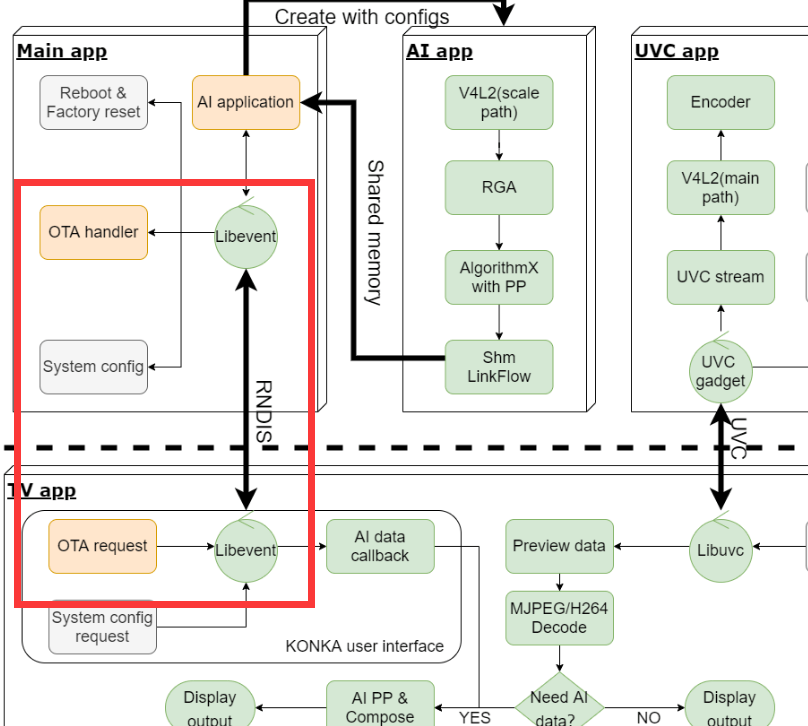

# 智慧屏OTA升级方案

文件标识：RK-SM-YF-535

发布版本：V1.0.0

日期：2020-07-23

文件密级：□绝密   □秘密   □内部资料   ■公开

**免责声明**

本文档按“现状”提供，瑞芯微电子股份有限公司（“本公司”，下同）不对本文档的任何陈述、信息和内容的准确性、可靠性、完整性、适销性、特定目的性和非侵权性提供任何明示或暗示的声明或保证。本文档仅作为使用指导的参考。

由于产品版本升级或其他原因，本文档将可能在未经任何通知的情况下，不定期进行更新或修改。

**商标声明**

“Rockchip”、“瑞芯微”、“瑞芯”均为本公司的注册商标，归本公司所有。

本文档可能提及的其他所有注册商标或商标，由其各自拥有者所有。

**版权所有 © 2020 瑞芯微电子股份有限公司**

超越合理使用范畴，非经本公司书面许可，任何单位和个人不得擅自摘抄、复制本文档内容的部分或全部，并不得以任何形式传播。

瑞芯微电子股份有限公司

Rockchip Electronics Co., Ltd.

地址：     福建省福州市铜盘路软件园A区18号

网址：     [www.rock-chips.com](http://www.rock-chips.com)

客户服务电话： +86-4007-700-590

客户服务传真： +86-591-83951833

客户服务邮箱： [fae@rock-chips.com](mailto:fae@rock-chips.com)

---

**前言**

**概述**

本文档介绍智慧屏产品形态下的OTA升级方案。

**产品版本**

| **芯片名称** | **内核版本** |
| ------------ | ------------ |
| RV1109/1126 | 4.19   |

**读者对象**

本文档（本指南）主要适用于以下工程师：

技术支持工程师

软件开发工程师

**修订记录**

| **版本号** | **作者** | **修改日期** | **修改说明** |
| ---------- | --------| :--------- | ------------ |
| V1.0.0    | 张伟 | 2020-07-23 | 初始版本     |

---

**目录**

[TOC]

---

## 流程框架

### HOST-DEVICE



如上图所示，OTA升级由TV端的app发起升级请求，基于RNDIS，通过网络传输，将OTA包传输DEVICE端的/data/update.img目录，DEVICE端收到OTA包后进行MD5校验，校验成功，则执行升级应用程序进行OTA升级。

## HOST端实现

### APK实现传输功能

APK需要实现对/data/update.img进行分包传输，sendCmd接口是对DEVICE端发送升级命令，sendData接口是对DEVICE端发送OTA包数据，具体接口说明请查看Rockchip AI Camera 安卓端API接口说明文档，代码实现可参考以下代码：

```java
    byte[] inUpdate = new byte[0]; //byte数组接受文件的数据
    int leaveNum = 0; //文件剩下的字符数
    long streamTotal = 0; //接受流的容量
    int streamNum = 0; //流需要分开的数量
    File inFile = new File("/data/update.img");
    FileInputStream inStream = null;
    try {
        inStream = new FileInputStream(inFile);
    } catch (FileNotFoundException e) {
        Log.d(TAG, "inStream  fail");
        e.printStackTrace();
        return;
    }
    mAIDeviceHandler.sendCmd(mDevHandle, AIDevice.RNDIS_CMD_UPGRADE, "DOWNLOAD");
    try {
        streamTotal = inStream.available();
    } catch (IOException e) {
        e.printStackTrace();
    }
    Log.d(TAG, "streamTotal is:" + streamTotal);
    //取得流文件需要分开的数量
    streamNum = (int) Math.floor(streamTotal / MAX_BYTE);
    //分开文件之后,剩余的数量
    leaveNum = (int) streamTotal % MAX_BYTE;
    Log.d(TAG, "streamNum is:" + streamNum + "leaveNum is:" + leaveNum);
    //文件的容量大于60Mb时进入循环
    if (streamNum > 0) {
        for (int i = 0; i < streamNum; ++i) {
            inUpdate = new byte[MAX_BYTE];
            //读入流,保存在byte数组
            try {
                inStream.read(inUpdate, 0, MAX_BYTE);
            } catch (IOException e) {
                e.printStackTrace();
            }
            try {
                sleep(10);
            } catch (InterruptedException e) {
                e.printStackTrace();
            }
            mAIDeviceHandler.sendData(mDevHandle, inUpdate, MAX_BYTE, 1);
        }
    }
    //写出剩下的流数据
    inUpdate = new byte[leaveNum];
    try {
        inStream.read(inUpdate, 0, leaveNum);
    } catch (IOException e) {
        e.printStackTrace();
    }
    mAIDeviceHandler.sendData(mDevHandle, inUpdate, leaveNum, 0);
```

## DEVICE端实现

### AB固件的编译

DEVICE端需要编译生成AB固件，参考Rockchip_Developer_Guide_Linux_Upgrade_CN文档，Linux A/B模式章节，进行相应配置生成AB固件。

### 升级功能的实现

DEVICE端完整接收TV端发送的OTA包后，进行MD5值校验，校验成功，则调用updateEngine升级程序进行OTA升级。