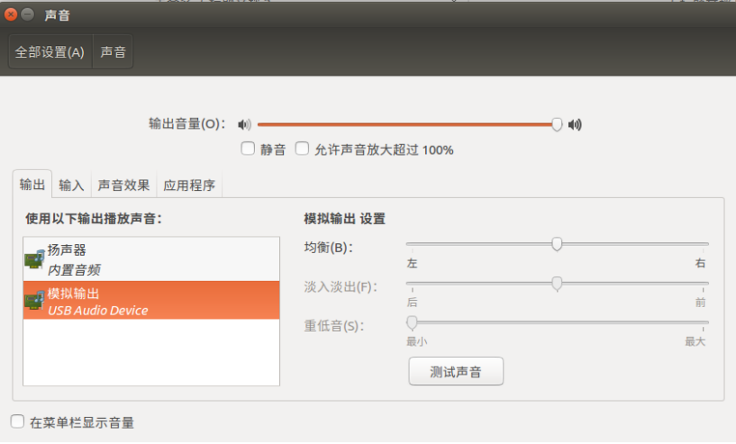
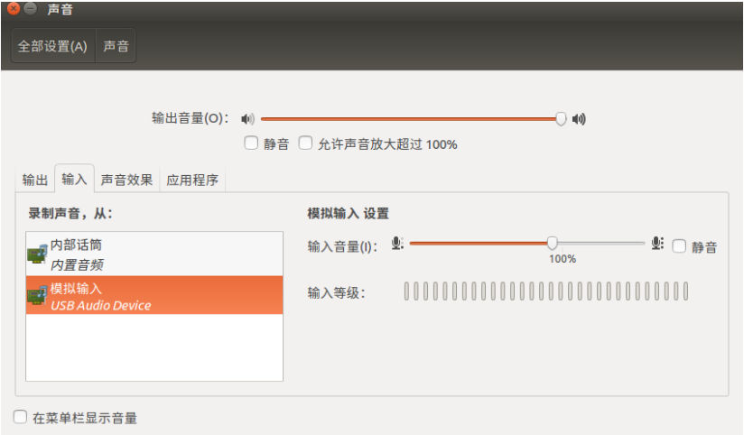

# Rockchip Linux UAC Quick Start

文件标识：RK-JC-YF-525

发布版本：V1.0.0

日期：2020-07-15

文件密级：□绝密   □秘密   □内部资料   ■公开

**免责声明**

本文档按“现状”提供，瑞芯微电子股份有限公司（“本公司”，下同）不对本文档的任何陈述、信息和内容的准确性、可靠性、完整性、适销性、特定目的性和非侵权性提供任何明示或暗示的声明或保证。本文档仅作为使用指导的参考。

由于产品版本升级或其他原因，本文档将可能在未经任何通知的情况下，不定期进行更新或修改。

**商标声明**

“Rockchip”、“瑞芯微”、“瑞芯”均为本公司的注册商标，归本公司所有。

本文档可能提及的其他所有注册商标或商标，由其各自拥有者所有。

**版权所有 © 2020 瑞芯微电子股份有限公司**

超越合理使用范畴，非经本公司书面许可，任何单位和个人不得擅自摘抄、复制本文档内容的部分或全部，并不得以任何形式传播。

瑞芯微电子股份有限公司

Rockchip Electronics Co., Ltd.

地址：     福建省福州市铜盘路软件园A区18号

网址：     [www.rock-chips.com](http://www.rock-chips.com)

客户服务电话： +86-4007-700-590

客户服务传真： +86-591-83951833

客户服务邮箱： [fae@rock-chips.com](mailto:fae@rock-chips.com)

---

**前言**

**概述**

本文主要描述了Linux SDK上，USB Gadget UAC(USB Audio Class)基本使用方法，旨在帮助开发者快速了解并使用Linux USB Gadget UAC功能。。

**产品版本**

| **芯片名称** | **内核版本** |
| ------------ | ------------ |
| RV1126/RV1109 | Linux V4.19 |

**读者对象**

本文档（本指南）主要适用于以下工程师：

技术支持工程师

软件开发工程师

**修订记录**

| **版本号** | **作者** | **修改日期** | **修改说明** |
| ---------- | --------| :--------- | ------------ |
| V1.0.0    | 何华 | 2020-07-15 | 初始版本     |

---

**目录**

[TOC]

---

## USB Gadget UAC配置

  Rockchip USB Gadget UAC(后续统称为UAC)，其基本情况如下：

- 支持UAC1(USB Audio Class specification 1.0)和UAC2(USB Audio Class specification 2.0)
- 支持录音和放音
- 支持多个采样率
- 暂不支持静音和音量调节
- 暂不支持多channels数据

### UAC 驱动配置

UAC功能配置在menuconfig如下位置：

```shell
Location:
  -> Device Drivers
    -> USB support
      -> USB Gadget Support
        -> Audio Class 1.0
        -> Audio Class 2.0
```

### UAC应用配置

UAC功能使能后，会生成对应的控制节点。应用可通过对应的控制节点，设置UAC支持的采样率，声道数量，以及数据类型

```
UAC1:   /sys/kernel/config/usb_gadget/rockchip/functions/uac1.gs0
UAC2:   /sys/kernel/config/usb_gadget/rockchip/functions/uac2.gs0
```

注意，只有对应驱动配置打开后才能看到如上控制节点。

下面以UAC2为例进行说明：

进入/sys/kernel/config/usb_gadget/rockchip/functions/uac2.gs0目录，可看到如下几个节点,

```shell
[root@RV1126_RV1109:/sys/kernel/config/usb_gadget/rockchip/functions/uac2.gs0]# ls
c_chmask  c_srate  c_ssize  p_chmask  p_srate  p_ssize  req_number
```

其中，c_xxx 节点表示UAC2录音控制节点(Capture)，p_xxx表示UAC2放音的控制节点(Playback)。

x_chmask: 录/放音声道数mask值(每个bit 1表示一个声道)。对于2声道音频，其值为3(0b‘11)。

x_srate: 录/放音的采样率，Rockchip UAC支持多采样率。

x_ssize: 录/放音数据的类型，单位bytes，对弈PCM_16的数据，其值为2.

例如：

```shell
[root@RV1126_RV1109:/]# echo 8000,16000,44100,48000 > /sys/kernel/config/usb_gadget/rockchip/functions/uac2.gs0/p_srate

[root@RV1126_RV1109:/]# echo 3 > /sys/kernel/config/usb_gadget/rockchip/functions/uac2.gs0/p_chmask

[root@RV1126_RV1109:/]# echo 2 > /sys/kernel/config/usb_gadget/rockchip/functions/uac2.gs0/p_ssize
```

设置UAC2 声卡支持采样率8K,16K,44.1K,48K，2 channels，PCM_16的数据。同理可对UAC2录音进行设置。

如上设置后，PC/TV和设备间传递音频数据，必须符合以上设置，否则ALSA打开USB声卡会失败。客户可根据

自己的实际需求，设置UAC声卡支持的参数。

需要注意的是，以上设置过程需要UAC功能使能前设置，UAC启用之后，将无法进行设置。

### UAC脚本

RV1126/1109 Linux中默认提供了UAC运行脚本。

uac.sh :(工程/external/uac_app目录) 该脚本为uac的运行脚本。该脚本会按照1.2中介绍的方法设置UAC录/放音声卡的参数，设置设备名称，序列号，生产商等信息，并设置UAC功能使能。当脚本运行成功后，可通过usb连接到支持UAC的设备/PC上，查看对应信息，下图为RV1126运行uac.sh后，Ubuntu PC上看到的信息：

```shell
/oem/usr/bin/uac.sh restart
```





不同的操作系统，对UAC版本的支持不一样，例如，某些版本的win7可能只支持UAC1，不支持UAC2。

uac.sh设置UAC版本的地方如下：

```
UAC=uac2
```

默认为使用UAC2，用户应需要根据实际情况(注意要打开对应驱动)，选择UAC版本。如需设置UAC1，可在脚本中，修改为uac1.

若客户产品需要使用到USB混合设备，比如UVC和UAC需要同时使用到，RV1126/1109 Linux SDK提供了另外一个脚本，请见/device/rockchip/oem/oem_uvcc/aicamera.sh和device/rockchip/oem/oem_uvcc/usb_config.sh。

usb_config.sh脚本包含了uac.sh功能，并包含了初始化uvc，rndis设备的脚本；aicamera.sh脚本调用usb_config.sh，完成uac，uvc，rndis设备的使能，并开启uac_app, uvc_app等。

aicamera.sh:

```shell
/oem/usr/bin/uac_app &
/oem/usb_config.sh uac2_rndis &
```

/oem/usb_config.sh uac2_rndis : 开启USB uac2 和 rndis功能。

/oem/usr/bin/uac_app & : 运行uac_app, uac_app的功能见下一章节。

同uac.sh, 客户需根据实际情况，选择UAC的版本号，如只支持UAC1，则需将其修改为uac1_rndis。

如需更复杂的USB混合设备功能，请参考《Rockchip_Quick_Start_Linux_USB_Gadget_CN.md》。

## UAC_APP

### uac_app的基本流程

uac_app是Rockchip开发的一个应用程序，运行在Rockchip Linux设备上，完成UAC的录音和放音功能。

代码路径：external/uac_app

主要功能：根据对UAC uevent事件的监听，调用librockit.so，完成UAC录音/放音开启，结束，以及采样率设置的功能。

以当前设备为RV1126和Ubuntu PC为例进行说明。uac的整个流程如下：

1. 运行uac_app可执行程序，开启UAC事件的监听

```shell
./oem/usr/bin/uac_app
```

2. 执行uac.sh的脚本，使能uac功能，并设置uac声卡参数，以uac.sh为例，手动运行uac,sh

```shell
/oem/usr/bin/uac.sh restart
```

3. Ubuntu端开始uac放音，数据流Ubuntu PC-->RV1126

```shell
aplay -v Dhw:1,0 -c 2 -r 48000 -f s16_le test_48k.wav
```

   说明：声卡hw:1,0是UAC使能后，Ubuntu PC端识别到的USB声卡。
   以上命令，是在Ubuntu PC上播放test_48k.wav文件(48K, 2channels, PCM_16)到USB声卡

4. uac_app监听驱动的UAC uevent事件，获取当前数据的采样率并打开对应的USB声卡开启录音，从USB声卡读取数据，并按照事先定义好的行为，对数据进行处理(见2.2 uac_app的配置)

5. Ubuntu PC端放音/播放结束，aplay退出播放。uac_app会根据驱动的UAC uevent事件，结束当前RV1126上从USB声卡的录音的流程并退出。

   同理，当Ubuntu PC端开启录音(arecord), uac_app会根据监听，按照事先定义好的行为，往UAC 声卡写数据。

### uac_app的配置

uac_app在监听驱动的uevent事件后，会调用librockit来完成UAC功能。librockit会按照事先定义的一组处理方式，对音频数据进行处理。目前，uac_app预先定义了2个json文件(目录:external/uac_app/configs)，来定义UAC的处理。还是以RV1126和Ubuntu PC为例，进行说明：

usb_recode_speaker_playback.json:  数据流 Ubuntu PC-->RV1126 usb声卡-->resample->RV1126 speaker

mic_recode_usb_playback.json:  数据流 RV1126 Mic-->resample->RV1126 usb声卡->Ubuntu PC

当Ubuntu PC开启音频播放后，数据流从USB声卡发往RV1126.  uac_app监听到Ubuntu PC打开USB声卡的事件，并获取音频采样率后，调用librockit，加载usb_recode_speaker_playback.json文件，创建UAC录音(RV1126从USB声卡录音)流程。usb_recode_speaker_playback.json中定义了当前UAC的行为，以下是对json文件中用到的部分文本，进行简单说明：

```json
"node_name"       : "xxxx",         : 根据node的名字，创建对应的节点
"node_source_uri" : "hw:1,0",       : 定义声卡/文件的名字, 用户需按照产品实际声卡名/序号 进行修改
"node_buff_type"  : 0,              : buffer的类型，音频时永远设置为0
"node_buff_count" : 4,              : 放置pcm数据的buffer的数量
"node_buff_size"  : 2048,           : 放置pcm数据的buffer大小，单位bytes
"node_buff_alloc_type" : "malloc",  : 放置pcm数据buffer的分配方式，音频设置为malloc即可，用于区分视频DRM，ION等其他分配方式
"opt_alsa_mode"   : "nonblock",     : alsa open时的模式，未设置时为阻塞方式。nonblock为非阻塞方式，  非阻塞模式与阻塞模式相比，会增加cpu的使用率，但是能在Ubuntu PC退出录/放音时，及时退出。
"opt_samaple_rate": 48000,          : 默认打开声卡的采样率
"opt_format"      : "audio:pcm_16", : 数据的格式，可选的值为audio:pcm_8,audio:pcm_16等
"opt_channel"     : 2,              : 声道数
"opt_channel_layout"  : "int64:3"   : 声道layout，前缀int64表明该数据为int64类型。
"stream_input"    : "audio:pcm_x",  ：当前节点数据输入流编号，x的值为0，1，2.....
"stream_output"   : "audio:pcm_x"   : 当前节点数据输出流编号，x的值为0，1，2.....
```

需要注意的是：

1. "opt_channel_layout"为int64型，必须为"int64:x", x为layout的, layout每一bit表示一个声道，普通的左右2声道数据，layout为二进制0b' 11, 即数值3，因此左右2声道的数据，"opt_channel_layout"需设置为"int64:3"。

2. "stream_input"和"stream_output" ，前后相连的节点，前一级的stream_output和它后一级节点的stream_in的值必须相同，比如usb_recode_speaker_playback.json中， node_0的"stream_output"为"audio:pcm_0"，node_1的"stream_input"    必须为"audio:pcm_0",表明node_0的数据传递给node_1.

 音频常用的node_name:

```
alsa_capture:  ALSA读数据节点。通过该节点，从某声卡读取音频数据。
alsa_playback:  ALSA写数据节点。通过该节点，将PCM数据写往某声卡。
resample: 重采样节点。通过该节点，可将音频采样率,声道数重采成设置的采样率和通道数。
alg_3a： 老的3A算法处理节点。
```

 从usb_recode_speaker_playback.json文件可知，该文件定义了3个节点node_0，node_1和node_2：

 node_0:   alsa_capture， alsa的录音节点。"node_source_uri"定义了录音声卡的名称。"hw:1,0"当前设备上识别到的USB声卡名称，客户需按照实际产品的USB声卡修改该值(uac.sh运行成功后，可通过aplay -L查看声卡信息)。打开USB声卡的默认参数，由node_0的opt_samaple_rate(采样率)，opt_channel(声道数)和opt_format(数据格式)定义。uac_app会根据监听到的uevent事件，获取 Ubuntu PC发送数据的采样率，从而动态通过invoke接口设置到alsa_capture，从而读取到正确的数据。

node_1:  resample节点，该节点负责将上级传递过来的数据，重采样成node_1中opt_samaple_rate，opt_channel和opt_format定义的数据输出。如送入的数据和设置的参数都一致，则直接将数据送往下一级节点，否则，从采样成规定的数据后送往下一级节点。

 node_2:  alsa_playback, alsa的录音节点。"node_source_uri"定义了放音声卡的名称。"default:CARD=rockchiprk809co"为当前RV1126 SDK EVB板speaker声卡。客户需按照实际产品的speaker声卡修改该值。打开speaker声卡的默认参数，由node_2的opt_samaple_rate，opt_channel和opt_format定义。当数据流从上级节点流入到当前节点时，会判断数据的采样率，声道数以及数据格式，当以上参数与打开的声卡不一致时，会关闭声卡，然后按照数据的参数重新打开声卡输出。

因此，usb_recode_speaker_playback.json定义的行为是从USB声卡上读取数据，并从RV1126 speaker播放的流程(PC->RV1126 USB->resample->RV1126 speaker)。

同理可知，mic_recode_usb_playback.json定义了从MIC录音，经过resample后，从UAC声卡发出PCM数据的流程(RV1126 MIC->Resample->RV1126 USB->PC)。需要注意的是，RV1126 mic和speaker通常配置的是同一组i2s，这就意味着mic和speaker只能使用相同的采样率打开设备，尤其是2个设备同时打开时，不同的采样率设置给同一组i2s会导致问题。因此，目前采用的方法是mic和speaker都配置48K的采样率。当UAC录/放音同时存在时，比如Ubuntu PC 16K放音给USB声卡，且同时以44.1K从USB声卡录音，会同时存在如下数据流：

- PC(16K) -> RV1126 USB(16K) -> resample(48K) -> RV1126 speaker(48K)
- RV1126 mic(48K) -> resample(44.1K) -> RV1126 USB(44.1K) -> PC(44.1K)

### UAC 采样率的设置

配置在json文件中的采样率等配置，只是创建UAC录/放音的默认设置，当UAC驱动支持多采样率时，UAC驱动会上报PC/TV/Remote device打开USB声卡的采样率到uac_app，uac_app会调用librockit的接口，设置录/放音采样率。

对于RV1126录音流程(usb_recode_speaker_playback.json)， 当Ubuntu PC以某采样率播放音频到USB声卡时，uac_app根据uevent事件，获取到Ubuntu PC的音频采样率，设置node_0:alsa_capture从USB声卡读取数据。同理，当Ubuntu PC端以某采样率从USB声卡录音时(mic_recode_usb_playback.json)，uac_app根据uevent事件，获取到Ubuntu PC的录音的采样率，设置node_2(alsa_playback)前的resample节点，将前级节点的音频数据重采成PC要求的采样率，发给node2(alsa_playback)发送给PC。