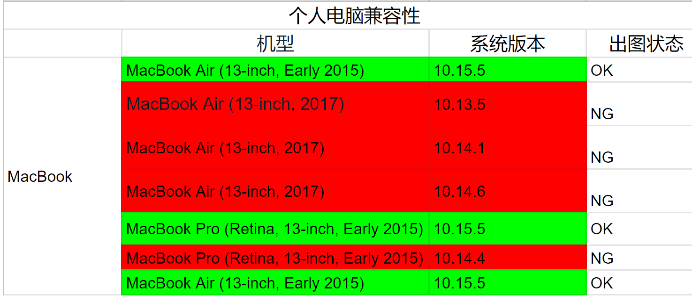

# RV1126_RV1109_UVC产品USB模块总结

文件标识：RK-KF-YF-539

发布版本：V1.0.0

日期：2021-01-25

文件密级：□绝密   □秘密   ■内部资料   □公开

**免责声明**

本文档按“现状”提供，瑞芯微电子股份有限公司（“本公司”，下同）不对本文档的任何陈述、信息和内容的准确性、可靠性、完整性、适销性、特定目的性和非侵权性提供任何明示或暗示的声明或保证。本文档仅作为使用指导的参考。

由于产品版本升级或其他原因，本文档将可能在未经任何通知的情况下，不定期进行更新或修改。

**商标声明**

“Rockchip”、“瑞芯微”、“瑞芯”均为本公司的注册商标，归本公司所有。

本文档可能提及的其他所有注册商标或商标，由其各自拥有者所有。

**版权所有 © 2021 瑞芯微电子股份有限公司**

超越合理使用范畴，非经本公司书面许可，任何单位和个人不得擅自摘抄、复制本文档内容的部分或全部，并不得以任何形式传播。

瑞芯微电子股份有限公司

Rockchip Electronics Co., Ltd.

地址：     福建省福州市铜盘路软件园A区18号

网址：     [www.rock-chips.com](http://www.rock-chips.com)

客户服务电话： +86-4007-700-590

客户服务传真： +86-591-83951833

客户服务邮箱： [fae@rock-chips.com](mailto:fae@rock-chips.com)

---

**前言**

**概述**

本文档旨在总结RV1109 UVC相关产品上USB模块情况和改进建议。

**产品版本**

| **芯片名称** | **内核版本** |
| ------------ | ------------ |
| RV1126/1109  | Linux 4.19   |

**修订记录**

| **版本号** | **作者**  | **修改日期** | **修改说明** |
| ---------- | --------- | :----------- | ------------ |
| V1.0.0     | HuangJC、CW | 2021-01-25   | 初始版本     |
|      |  |  |  |
|            |           |              |              |

---

**目录**

[TOC]

---

## 背景介绍

Rockchip RV1126/RV1109 Linux 平台支持基于标准Spec/USB Video Class 1.1 Spec/USB Audio Class 1.0 Spec/USB Audio Class 2.0 Spec 进行开发的 UVC/UAC 产品 ，如（带mic）USB CAMERA模组，智慧屏模组，USB同屏器等，支持的USB功能如下 ：

1. UVC function：USB video class  ，为USB视频捕获设备定义的协议标准，目前已成为USB org标准之一。协议版本有1.0/1.1/1.5。
2. UAC function：USB Audio Class，定义了在USB规范下实现音频的设备的实现和控制功能。协议版本目前有UAC1.0/2.0。
3. RNDIS function：RNDIS是指Remote NDIS，基于USB实现RNDIS实际上就是TCP/IP over USB，它主要使用USB协议作为其下层传输，向上层提供虚拟的以太网连接。
4. ADB function：Android调试桥。

### USB端点及FIFO情况

| USB  function | epin      | epout     | txfifo（*8B)  |
| ------------- | --------- | --------- | ------------- |
| UVC 1.1       | 2         | 0         | 4+775（isoc） |
| UAC 1.0/2.0   | 1（录音） | 1（播放） | 53            |
| RNDIS         | 2         | 1         | 3+196（bulk） |
| ADB           | 1         | 1         | 196           |

RV1126/RV1109 USB复合设备对endpoint支持情况：7 epin, 6 epout (包括ep0)，RXFIFO 一共有 0x185 * 8 bytes，TXFIFO 一共有 0x51e * 8 bytes，可以自由分配 。所以产品对复合设备的数量和类型需要限制:

1. 所有 OUT endpoints 共享一个 RxFIFO；
2. 每个 IN endpoint 独享一个 TxFIFO；
  TxFIFO 可以根据USB 复合设备的功能进行动态分配，如果要支持动态分配，需要在内核 DTS usbdrd_dwc3 节点中，增加属性 “snps,tx-fifo-resize” ，如：

  ```
  &usbdrd_dwc3 {
        status = "okay";
        snps,tx-fifo-resize;
        dr_mode = "peripheral";
  };
  ```

## 开发情况

对比之前RV1108 等linux SDK USB  device功能开发情况，目前RV1126/RV1109 USB AI Camera SDK平台新增和完善了很多UVC Camera相关产品功能,功能完善度和usb兼容性有了很大提升,已有客户作为标准usb通用模组产品量产.

### UVC

| UVC Features      | RV1108 SDK | RV1109 UVC SDK | 备注                                                         |
| ----------------- | ---------- | -------------- | ------------------------------------------------------------ |
| H265格式支持      | N          | Y              | 支持基于framebased的h265格式支持                             |
| OSD水印功能       | N          | Y              | 支持叠加OSD输出                                              |
| ROI编码功能       | N          | Y              | 支持感兴趣区域编码                                           |
| ISOC传输          | P          | Y              | 1108SDK遗留isoc传输花屏问题,1109修复                         |
| Mac兼容           | P          | Y              | 1109测试覆盖主流mac os版本，修复低版本上uvc不可用等问题      |
| Windows 兼容      | N          | Y              | 1109解决了win10 9代10代笔记本不出图问题<br/>1109解决了笔记本lpm配置不出流问题等<br />1109覆盖了主流会议系统软件视频通话功能 |
| Linux兼容         | P          | Y              | 1109解决了h264无法预览问题                                   |
| Android兼容       | P          | Y              | 1109支持适配了海思,MTK等主流TV平台                           |
| 异常恢复          | N          | Y              | 1109支持检测uvc异常自恢复                                    |
| PU/CT/XU功能      | P          | Y              | 1109新增支持主流usb camera PU/CT指令和功能,支持16个以上XU指令扩展等 |
| 出流速度优化      | P          | Y              | 1109优化出图速度第一次在800ms内,切换分辨率在500ms内          |
| 内存优化          | P          | Y              | 1109优化流程,改用dma内存,改成统一buffer流程,减少2套轮转buffer |
| MJPG编码插帧      | N          | Y              | 1109支持MJPG编码插帧，满足客户1080P@60FPS,4K@30FPS的需求     |
| 更友好的debug信息 | P          | Y              | 支持动态输出诸如UVC各阶段延时，camera帧率，编码大小，USB传输时间，保存编码前后码流等debug信息 |
| 休眠唤醒          | P          | Y              | 支持USB auto suspend功能                                     |
| 热拔插            | N          | Y              | 支持USB热拔插功能                                            |

### UAC

1. 支持UAC 1.0 和 UAC 2.0
2. 添加UAC_APP,支持完整的uac播放、录音、音量控制等功能；
3. 支持导入音频算法

### RNDIS

开发了从USB device到host端的完整AI信息传输和显示的解决方案

1. 引入libevent模块实现基于rndis网络连接通信功能
2. 使用protubuf lite实现ai、ota数据等信息稳定传输和功能扩展

## 典型问题复盘

在RV1126/RV1109项目开发过程中，USB模块相关问题主要集中在下面几类：

### USB兼容性问题

兼容性问题一般表现为个别host无法正常识别uvc，个别应用uvc功能异常等。目前配合客户做不同复合设备配置下对不同host的测试，已初步完成对主流HOST：Mac/Windows/Linux/Android 设备基本的兼容性覆盖测试。几个典型项目问题分析如下：

#### 项目问题一：康佳智慧屏电视USB2.0口无法枚举成高速设备

**1.问题描述：**

RV1109 UVC设备插入海思810等host平台USB 2.0口，无法枚举成高速设备，导致UVC功能无法使用。

**2.分析过程：**

1. 通过实验， 发现海思平台 Chirp-K 的判决阈值估计为 550mV 左右，比USB2 Spec 规定的最低幅值500mV高一些。

2. RV1109  chirpK 默认幅值为400mV，USB IF 规定的测试标准项目中，没有测试 Chirp K 的幅值指标，只有测试 Chirp K 的时间指标。但按照USB2 Spec 文档中的标准，1109 USB2 PHY的幅值是低于标准范围的。

**根本原因是RV1126/RV1109 USB2 PHY Vendor (Naneng) 在设计 PHY IP 时，考虑到功耗问题，特意将高速握手的第一个 Chirp K 信号幅值从标准的 800mV 降低到 400mV 左右，引入了兼容性问题。 **

**3.解决方案：**

电流补偿，在chirpK阶段电压校准完成后，通过GPIO控制上拉电阻为DM提供额外的电流

优点：软件控制逻辑简单，对中断响应慢的容错率更大；提升幅度较大，在上拉电阻为220Ω的时候可以达到600mV, 可以达到inno phy的幅度；成本低，仅需增加三个电阻和一个三极管

缺点：DM上的分支会影响眼图质量，对布线的要求更高

#### 项目问题二：小米无flash方案烧录时USB识别问题

**1.问题描述：**

 在MTK958C的TV盒子和DELL的ubuntu PC上，连接MASKROM状态的1126时候，发现USB 识别错误

**2.分析过程：**

该问题与USB PHY的兼容性有关系。问题点跟之前处理的高速握手失败一样，因为 1126 高速握手阶段 Chirp K 幅值偏低，导致高速握手失败。

虽然1126硬件已经修改了 Chirp K 电压补偿的电路，但需要软件配合才行。而 Maskrom 软件无法修改，所以Maskrom 高速握手失败的问题，无法通过软硬件手段解决；

Maskrom 被误识别为 full speed 后，在采用 linux 内核的 Host 平台，会发出 GetDescriptor (Device qualifier) 的请求，而 Maskrom USB 驱动没有处理该请求，导致USB 识别失败。

**3.解决方案：**

因为 Maskrom USB 驱动无法更改，所以只能尝试**修改 Host 平台端的 USB 驱动**，在Maskrom 被误识别为 full speed 后，避免 Host 平台发出 GetDescriptor (Device qualifier) 的请求。
当Maskrom下载完 usbplug 后，USB 会重新枚举，这时候，USB驱动软件可以修改，提高 Chirp K 电压幅值，保证高速握手成功。

#### 项目问题三：安可USB摄像头无法在某些MacBook上使用

**1.问题描述：**

**2.分析过程：**

通过实验，发现除了描述符配置3072,UVC APP在probe阶段也需要保证回复给host端的dwMaxPayloadTransferSize和描述符微帧配置一致，才能在MAC OS 10.13/10.14上正常使用UVC。而1109 UVC APP的dwMaxPayloadTransferSize默认配置一直为1024,所以在MAC上无法兼容。

**3.解决方案：**

修改UVC APP 读取描述符微帧配置，赋值给dwMaxPayloadTransferSize解决。

#### 遗留问题

目前遗留如**Windows系统UAC和RNDIS复合无法同时正常安装两种设备驱动的问题**(Windows 系统的USB Host驱动对 UVC/RNDIS/UAC/ADB 的配置顺序有严格要求)还待分析。

这类问题目前主要方法为：通过对比正常设备的对应USB描述符配置，找到差异点进行修改验证，或通过协议或host对应文档如windows 官方uvc开发说明文档做对应适配。

### USB控制器通信异常

第二类问题，通常表现为uvc select timeout问题、复合设备中某个设备异常。此类问题通过几个典型项目问题来总结：

#### 项目问题一：康佳智慧屏模组项目usb select timeout

**1.问题描述：**

  康佳智慧屏模组测试阶段发现，TV正常连接camera后，通过不同相机应用快速切换，概率出现摄像头移除提示，无法再正常打开camera。

**2.分析过程：**

1. 复现后先分析日志，发现每次摄像头被移除表面原因是uvc app读取usb控制器状态出现timeout，无法和usb驱动通信了导致主动走uvc恢复流程，重新枚举设备,日志无法进一步定位为何usb驱动无法回复应用。

2. 几次复现都表现在host发送stream on指令后的开流阶段，uac app端开始出流，但usb驱动无法继续送流，怀疑控制器异常或host未取流，接分析仪复现抓包分析host端交互行为是否有异常；

3. 通过几次复现抓包分析，定位到开流指令后，host端发送大量request过来要求回复，其中某个request回复时间较长超过500ms（正常协议要求不超过5s），此时host端认为异常走异常流程不再取流，但对比海思camera正常，进一步分析上述request，发现request本身流程没有问题，不存在特殊无法回复问题，最终发现代码此时在等待isp出流超过500ms，原先逻辑等待出流和request操作在一个线程导致晚request指令回复慢了500ms.

**3.解决方案：**

  修改uvc app出流代码逻辑，uvc逻辑主线程不做耗时事件处理，保证request指令回复及时，避免控制器与host交互异常。

**4.总结：**

在问题排查过程中发现这类问题出现概率不高，由于和host端行为关系比较大，日志无法很好体现问题异常点，问题分析定位困难且耗时。目前总结比较好的排查方式为：

1. 找到高概率触发场景，再接分析仪复现抓包分析。

缺点是现场可能无usb分析仪调试条件，且搭建抓包环境不一定方便，需要分解问题类型，如本例中类型问题，可通过uvc app中添加动态request的日志打印，usb驱动中也加入针对request指令的打印来协助定位这类问题。

#### 项目问题二：小米智慧屏模组项目rndis配置后usb无法通信

**1.问题描述：**

小米智慧屏MTK平台模组测试阶段发现，如下操作后camera通信无法成功：

1. 在Mi6机器里先把配置脚本/vendor/bin/init_product.sh(adb remount才能修改)里的网络usb0 IP配置去掉，保存后重启
2. 启动demo apk，同时开启一个模型（开启命令不会生效，因为网络不通）
3. 关闭demo apk，手动在TV端配置网络，并确认ping ok
4. 开启demo apk，然后会黑屏，rndis网络和预览都会失败

**2.分析过程：**

1. 复现后先分析日志，发现日志中打印的rv1126端信息均正常，host认为出异常的时间点，camera端应用未正常收到任何驱动上报的事件，初步怀疑和usb驱动或控制器有关

2. 找到高概率复现场景，都表现在host先开uvc再开始rndis通信，之后再打开uvc出流usb这边无法正常响应指令了；

3. 通过几次复现抓包分析，host端操作无异常，初步排除host指令问题。分析过程，和正常情况区别只是，正常情况rndis先开始通信，uvc后开始通信，异常情况相反。排查驱动流程，发现目前代码rndis第一次通信时也会触发resize txfifo行为重新配置所有usb断电的txfifo，导致uvc fifo配置被改变引起usb控制器异常

**3.解决方案：**

 修改usb驱动resize txfifo的判断逻辑，设备触发ep使能操作时不再对所有usb设备做reset txfifo，只在uvc ep使能时做处理，保证各个设备fifo分配正常

**4.总结：**

这类问题若找不到规律出现概率不高，同样和host端行为关系比较大，日志无法很好体现问题异常点，问题分析定位困难且耗时，并且抓包可能也无法快速定位问题点。需要usb驱动预留对应的debug接口或者调试方法，如该问题复盘发现若能通过下面命令打印对比txfifo大小就能快速确认问题：

```
cat /sys/kernel/debug/ffd00000.dwc3/regdump
```

#### 项目问题三：康佳智慧屏模组项目USB OTA升级老化死机

**1.问题描述：**

康佳智慧屏Camera模组OTA升级老化测试发现升级程序执行reboot流程后卡住，内核卡死。

**2.分析过程：**

1. 复现后先分析日志，发现日志中打印的rv1126端升级程序信息均正常，最后的log还没到device shutdown就挂了。此时串口可以进fiq，底层同事分析stack，是get_parent device的时候crash，可能是某个模块的parent已经被释放.
2. 重新查看异常前的日志发现升级操作之前有进行热拔插消息后的usb uvc ubind/bind操作，usb设备重新枚举恢复，这个操作内核会报一个warning提示，进一步分析warning原因是usb的parent gadget出异常了，项目有使用rndis复合设备作为usb net连接通信，热拔插恢复过程gadget先于 net usb0 free，而free后， 指针并未置0，导致net usb0依然去获取gadget导致crash；
3. 通过几次加内核debug补丁拷机复现，发现问题点相同：开机的时候usb net使用的是刚开始的gadget ，触发usb reprobe操作后，gadget销毁重新创建新的，reboot的时候usb net还是旧的gadget，且已经被释放，导致use-after-free 。简单来说就是usb reprobe操作要建立在usb上的子设备都需要先销毁 。

**3.解决方案：**

 修改usb restart脚本，在ubind操作之前先确保执行RNDIS设备的销毁动作：

```diff
diff --git a/oem/oem_uvcc/aicamera.sh b/oem/oem_uvcc/aicamera.sh
index 7f2d45a..ef62984 100755
--- a/oem/oem_uvcc/aicamera.sh
+++ b/oem/oem_uvcc/aicamera.sh
@@ -28,6 +28,8 @@ check_alive()
        echo " uvc app die ,restart it and usb reprobe !!!"
        sleep 1
        rm -rf /sys/kernel/config/usb_gadget/rockchip/configs/b.1/f*
+       echo none > /sys/kernel/config/usb_gadget/rockchip/UDC
+       rmdir /sys/kernel/config/usb_gadget/rockchip/functions/rndis.gs0
        echo ffd00000.dwc3  > /sys/bus/platform/drivers/dwc3/unbind
        echo ffd00000.dwc3  > /sys/bus/platform/drivers/dwc3/bind
        /oem/usb_config.sh rndis off #disable adb
```

**4.总结：**

这类问题若只看最后日志，不好看出和USB模块相关，需结合异常前的USB相关操作行为判断是否有怀疑点。但上述例子中RNDIS设备未销毁重建仍可以正常使用的现象，一定程度上也容易误导debug方向，不容易看出问题，可能后续驱动可以考虑加一些明显异常提示等方式改进。

## 改进建议

### USB驱动程序的改进期望

| 期望改进点                | 备注                                                         |
| ------------------------- | ------------------------------------------------------------ |
| USB调试信息完善           | 增加uvc等设备驱动常用的如request, setup事务调试信息和动态使能方法，如提供节点方式使能或者打印状态；<br />好处：一些只有客户手上有环境复现的兼容性或uvc无响应问题，可以不需要耗时搭建分析仪抓包环境，借助命令和串口打印能够分析定位问题，加速一线问题解决。 |
| USB控制器状态监测机制完善 | 需要驱动提供状态信息给上层确认是否要走异常恢复。             |
| USB热拔插稳定性           | 例如自供电设备vbus常供电的case：拔掉usb->phy没检测到disconnect->插上usb->通信异常复位->disconnect |
| UVC 1.5支持               | 满足客户对UVC 1.5的产品需求                                  |
| UVC低延时方案             | 同编码并行，降低预览延时                                     |

### USB控制器的改进期望

| 期望改进点                | 备注                                                         |
| ------------------------- | ------------------------------------------------------------ |
| USB端点数                 | RV1126上USB端点偏少，特别是IN端点，无法满足诸如海信商显对两路uvc+adb+rndis+uac的复合设备配置需求 |
| USB fifo大小              | 同上述需求，RV1126上USB fifo大小比较临界。 例如目前我们uvc+uac+rndis+adb使用1237，而usb的txfifo总大小是0x51e(1310) ，无法再增加一路uvc |
| 提高USB2 phy chirp-k 幅值 | 虽然可以通过软硬件补偿Chirp-K电压方案绕过，但maskrom下依然存在无法枚举成high-speed情况。maskrom下的workaround方案有两个弊端，一方面是需要修改 Host 平台端的 USB 驱动，另一方面是下载 “DDR 初始化固件” 和 “USBPLUG 固件相比USB 2.0增加耗时 242 ms左右。 |


