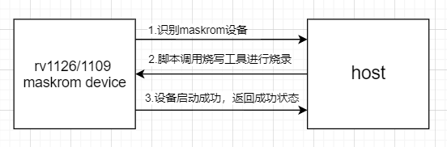
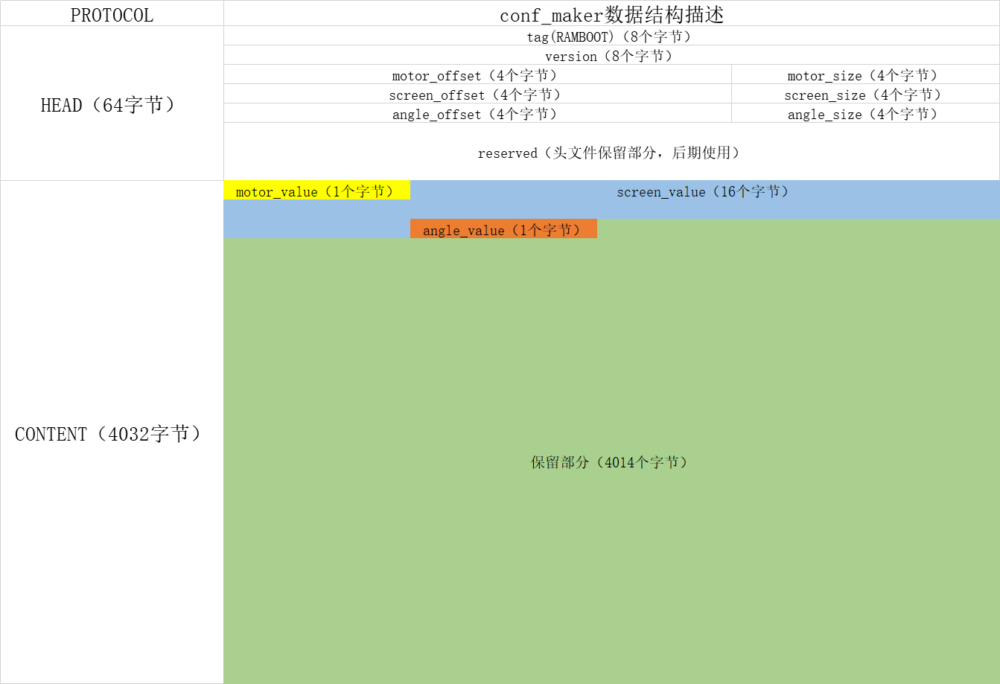

# Rockchip Ramboot方案介绍

文件标识：RK-KF-YF-526

发布版本：V1.1.0

日期：2020-07-14

文件密级：□绝密   □秘密   □内部资料   ■公开

**免责声明**

本文档按“现状”提供，瑞芯微电子股份有限公司（“本公司”，下同）不对本文档的任何陈述、信息和内容的准确性、可靠性、完整性、适销性、特定目的性和非侵权性提供任何明示或暗示的声明或保证。本文档仅作为使用指导的参考。

由于产品版本升级或其他原因，本文档将可能在未经任何通知的情况下，不定期进行更新或修改。

**商标声明**

“Rockchip”、“瑞芯微”、“瑞芯”均为本公司的注册商标，归本公司所有。

本文档可能提及的其他所有注册商标或商标，由其各自拥有者所有。

**版权所有 © 2020 瑞芯微电子股份有限公司**

超越合理使用范畴，非经本公司书面许可，任何单位和个人不得擅自摘抄、复制本文档内容的部分或全部，并不得以任何形式传播。

瑞芯微电子股份有限公司

Rockchip Electronics Co., Ltd.

地址：     福建省福州市铜盘路软件园A区18号

网址：     [www.rock-chips.com](http://www.rock-chips.com)

客户服务电话： +86-4007-700-590

客户服务传真： +86-591-83951833

客户服务邮箱： [fae@rock-chips.com](mailto:fae@rock-chips.com)

---

**前言**

**概述**

本文档旨在指导工程师如何快速使用Rockchip Linux 平台Ramboot方案。

**产品版本**

| **芯片名称** | **内核版本** |
| ------------ | ------------ |
| RV1126/1109  | Linux 4.19   |

**读者对象**

本文档（本指南）主要适用于以下工程师：

技术支持工程师

软件开发工程师

**修订记录**

| **版本号** | **作者** | **修改日期** | **修改说明** |
| ---------- | -------- | :----------- | ------------ |
| V1.0.0     | 林其浩   | 2020-07-14   | 初始版本     |
| V1.1.0     | 翁韬     | 2021-03-08   | 烧录传参     |
|            |          |              |              |

**目录**

[TOC]

---

## 简介

Rockchip Linux平台支持flash启动，及无flash ramboot启动方式。

1. flash启动方式，通过将固件烧写到flash中，上电后通过引导程序启动系统。

2. ramboot启动方式，通过将固件直接烧录到RAM中，通过引导程序启动系统。

这两种模式各有优缺点，用户根据需求选择使用。flash启动方式和无flash启动方式，在启动流程上无太大区别，主要在于loader和uboot引导位置差异，下面主要介绍RV1126/1109 SDK中无flash ramboot方案。

## Ramboot模式

### 概述

ramboot模式使用在无flash的机器上，但相应会在ram中常驻部分空间。ramboot模式主要由Loader、trust、uboot、boot（kernel+rootfs）组成，host端通过特定的烧脚本rv1126_rv1109_usb_upgrade.sh以及烧写工具upgrade_tool对连接在host端上的maskrom设备进行烧写，使无flash设备启动，正常工作。

### 配置和编译

device/rockchip/rv1126-1109/BoardConfig-ramboot-uvc.mk为参考ramboot config。

```shell
 1:  #!/bin/bash

# Target chip
export RK_CHIP=RV1126
# Target arch
export RK_ARCH=arm
# Uboot defconfig
export RK_UBOOT_DEFCONFIG=rv1126-ramboot
# Uboot image format type: fit(flattened image tree)
#export RK_UBOOT_FORMAT_TYPE=fit
# Uboot SPL ini config
export RK_SPL_INI_CONFIG=RV1126MINIALL_RAMBOOT.ini
# Kernel defconfig
export RK_KERNEL_DEFCONFIG=rv1126_defconfig
# Kernel defconfig fragment
export RK_KERNEL_DEFCONFIG_FRAGMENT=rv1126-uvc-ramboot.config
# Kernel dts
#export RK_KERNEL, which must modify cmdline
#export RK_KERNEL_DTS=rv1126-evb-ddr3-v13
export RK_KERNEL_DTS=rv1126-ai-cam-ddr3-v1-ramboot
# boot image type
export RK_BOOT_IMG=zboot.img
# kernel image path
export RK_KERNEL_IMG=kernel/arch/arm/boot/zImage
# kernel image format type: fit(flattened image tree)
export RK_KERNEL_FIT_ITS=boot.its
# parameter for GPT table
export RK_PARAMETER=parameter-buildroot-fit.txt
# Buildroot config
#export RK_CFG_BUILDROOT=rockchip_rv1126_rv1109_uvcc
# Recovery config
export RK_CFG_RECOVERY=
# Recovery image format type: fit(flattened image tree)
export RK_RECOVERY_FIT_ITS=boot4recovery.its
# ramboot config
export RK_CFG_RAMBOOT=rockchip_rv1126_rv1109_ramboot_uvcc
# Pcba config
export RK_CFG_PCBA=
# Build jobs
export RK_JOBS=12
# target chip
export RK_TARGET_PRODUCT=rv1126_rv1109
# Set rootfs type, including ext2 ext4 squashfs
export RK_ROOTFS_TYPE=cpio.gz
# Set ramboot image type
export RK_RAMBOOT_TYPE=CPIO
# Set oem partition type, including ext2 squashfs
export RK_OEM_FS_TYPE=ext2
# OEM build on buildroot
export RK_OEM_BUILDIN_BUILDROOT=YES
# Set userdata partition type, including ext2, fat
export RK_USERDATA_FS_TYPE=ext2
#OEM config
export RK_OEM_DIR=oem_uvcc
#userdata config, if not define this, system will format by RK_USERDATA_FS_TYPE
export RK_USERDATA_DIR=userdata_normal
#misc image
export RK_MISC=
#choose enable distro module
export RK_DISTRO_MODULE=
# Define package-file for update.img
export RK_PACKAGE_FILE=rv1126_rv1109-package-file-ramboot
```

将**RK_KERNEL_DTS**和**RK_CFG_RAMBOOT**修改为需要的板级配置及文件系统配置，并将kernel dts的cmdline修改为如下命令即可：

```shell
bootargs = "earlycon=uart8250,mmio32,0xff570000 console=ttyFIQ0 snd_aloop.index=7"
```

按照如下进行编译：

```shell
1:  ./build.sh device/rockchip/rv1126-1109/BoardConfig-ramboot-uvc.mk
2:  ./build.sh kernel
3:  ./build.sh uboot
4:  ./build.sh ramboot
```

编译完成后在./rockdev/目录下生产相应镜像文件，MiniLoaderAll.bin, trust.img, uboot.img, boot.img 。

### host端操作说明



ramboot固件烧录流程如上图所示，具体的操作如下：

1. 通过usb将rv1126/1109设备连接至host设备，host识别到rv1126/1109 maskrom状态。

2. 将upgrade_tool, rv1126_rv1109_usb_upgrade.sh以及./rockdev/目录的MiniLoaderAll.bin, trust.img, uboot.img, boot.img 文件，通过adb 或其他方式推到host端的**同一目录下**。

3. 在host端修改upgrade_tool和rv1126_rv1109_usb_upgrade.sh可执行权限。

4. 在host端对应目录下，执行以下命令烧录：

   ```shell
   ./rv1126_rv1109_usb_upgrade.sh MiniLoaderAll.bin uboot.img trust.img boot.img
   ```

### 烧录传参

由于ramboot模式无法持久化数据，所以很多情况下需要host传递开机初始化数据到rv1126/1109设备，方法如下：

1. 构建一个4K大小的bin文件，数据格式如下：



生成的文件可参考``resources/params.bin``。

2. kernel驱动对0xF800地址的bin文件进行解析，保存在/sys/bus/nvmem/devices/rkrom0/nvmem，应用自行解析协议中对应的数据。

3. host端烧录脚本新增加烧录bin文件的语句，语句如下：

```shell
UPGRADE_TOOL $CONF_ADDR $COFNIG_IMG
```

其中$CONFIG_IMG为bin文件的路径，$CONF_ADDR为烧录地址，目前定义的地址为0xF800。

## 附录

1. rv1126_rv1109_usb_upgrade.sh：

```shell
#!/system/bin/sh
PROGRAM=${0##*/}

if [ $# -ne 4 ]; then
	echo 'Usage: '$PROGRAM' loader uboot trust boot'
	exit
fi
DIR=$(cd `dirname $0`; pwd)
UPGRADE_TOOL=$DIR/upgrade_tool
LOADER=$DIR/$1
UBOOT=$DIR/$2
TRUST=$DIR/$3
BOOT=$DIR/$4
UBOOT_ADDR=0x2000
TRUST_ADDR=0x42000
BOOT_ADDR=0x80000

if [ ! -f $UPGRADE_TOOL ]; then
	echo $UPGRADE_TOOL 'is not existed!'
	exit
fi

if [ ! -f $LOADER ]; then
	echo $LOADER 'is not existed!'
	exit
fi

if [ ! -f $UBOOT ]; then
	echo $UBOOT 'is not existed!'
	exit
fi

if [ ! -f $TRUST ]; then
	echo $TRUST 'is not existed!'
	exit
fi

if [ ! -f $BOOT ]; then
	echo $BOOT 'is not existed!'
	exit
fi

echo 'start to wait device...'
i=0
while [ $i -lt 5 ]; do
	$UPGRADE_TOOL ld > /dev/null
	if [ $? -ne 0 ]; then
		i=$(($i+1))
		echo $i
		sleep 0.01
	else
		break
	fi
done
if [ $i -ge 5 ]; then
	echo 'failed to wait device!'
	exit
fi
echo 'device is ready'

echo 'start to download loader...'
$UPGRADE_TOOL db $LOADER > /dev/null
if [ $? -ne 0 ]; then
	echo 'failed to download loader!'
	exit
fi
echo 'download loader ok'

echo 'start to wait loader...'
$UPGRADE_TOOL td > /dev/null
if [ $? -ne 0 ]; then
	echo 'failed to wait loader!'
	exit
fi
echo 'loader is ready'

echo 'start to write uboot...'
$UPGRADE_TOOL wl $UBOOT_ADDR $UBOOT > /dev/null
if [ $? -ne 0 ]; then
	echo 'failed to write uboot!'
	exit
fi
echo 'write uboot ok'

echo 'start to write trust...'
$UPGRADE_TOOL wl $TRUST_ADDR $TRUST > /dev/null
if [ $? -ne 0 ]; then
	echo 'failed to write trust!'
	exit
fi
echo 'write trust ok'

echo 'start to write boot...'
$UPGRADE_TOOL wl $BOOT_ADDR $BOOT > /dev/null
if [ $? -ne 0 ]; then
	echo 'failed to write boot!'
	exit
fi
echo 'write boot ok'

echo 'start to run system...'
$UPGRADE_TOOL rs $UBOOT_ADDR $TRUST_ADDR $BOOT_ADDR $UBOOT $TRUST $BOOT > /dev/null
if [ $? -ne 0 ]; then
	echo 'failed to run system!'
	exit
fi
echo 'run system ok'
```

2. ramboot烧写工具**upgrade_tool**请联系对应SDK负责人员或FAE提供。

3. conf_maker代码如下：

```c
#include <stdlib.h>
#include <stdio.h>
#include <string.h>

struct HEAD
{
    uint8_t tag[8];
    uint8_t version[8];
    uint32_t motor_offset;
    uint32_t motor_size;
    uint32_t screen_offset;
    uint32_t screen_size;
    uint32_t angle_offset;
    uint32_t angle_size;
    uint8_t reserved[24];
};

struct MOTOR
{
    uint8_t motor_value;//设置为0 1 2
};

struct SCREEN
{
    uint8_t screen_value[16];//目前定义为DL1L、DL2L、DL1K，默认为55寸DL1L
};

struct ANGLE {
    uint8_t angle_value;//1为上视角，非1为下视角
};

struct PROTOCOL
{
    struct HEAD head;
    struct MOTOR motor;
    struct SCREEN screen;
    struct ANGLE angle;
};

int main(int argc, char *argv[]) {
    char *p = (char *) malloc(sizeof(uint8_t) * 4096);
    if (p == NULL)
    {
        printf("malloc faild\n");
        return 0;
    }
    memset(p, 0, sizeof(uint8_t) * 4096);
    struct PROTOCOL protocol;
    strncpy(protocol.head.tag, "RAMBOOT", sizeof(protocol.head.tag));
    strncpy(protocol.head.version, "1.0.0", sizeof(protocol.head.version));
    protocol.head.motor_offset = sizeof(struct HEAD);
    protocol.head.motor_size = sizeof(struct MOTOR);
    protocol.head.screen_offset = sizeof(struct HEAD) + sizeof(struct MOTOR);
    protocol.head.screen_size = sizeof(struct SCREEN);
    protocol.head.angle_offset = protocol.head.screen_offset + sizeof(struct SCREEN);
    protocol.head.angle_size = sizeof(struct ANGLE);
    char file_path[128];
    for (int i = 0; i < argc; ++i)
    {
        printf("i = %d, argv = %s\n", i, argv[i]);
    }
    for (int i = 0; i < argc; ++i)
    {
        switch(i) {
            case 1:
                strncpy(file_path, argv[i], sizeof(file_path));
            case 2:
                protocol.motor.motor_value = atoi(argv[i]);
                printf("motor_value = %d\n", protocol.motor.motor_value);
                break;
            case 3:
                strncpy(protocol.screen.screen_value, argv[i], sizeof(protocol.screen.screen_value));
                printf("screen_value = %s\n", protocol.screen.screen_value);
                break;
            case 4:
                protocol.angle.angle_value = atoi(argv[i]);
                printf("angle_value = %d\n", protocol.angle.angle_value);
            default:
                break;
        }
    }
    memcpy(p, &protocol, sizeof(struct PROTOCOL));
    FILE *fp = fopen(file_path, "wb+");
    if (fp == NULL)
    {
        printf("open file failed\n");
        return 0;
    }
    fwrite(p, sizeof(uint8_t), 4096, fp);
    fclose(fp);
    free(p);
    return 0;
}
```

4. 驱动修改如下：

```diff
From 48d1528588553b3ce98d7d3a7d68842f3bc0ff19 Mon Sep 17 00:00:00 2001
From: "lei.chen" <lei.chen@rock-chips.com>
Date: Mon, 1 Mar 2021 16:41:46 +0800
Subject: [PATCH] driver: nvmem: add hostinfo driver

Signed-off-by: lei.chen <lei.chen@rock-chips.com>
Change-Id: I5eff08a71c9c9118b6f3b120c150016c6326490b
---
 arch/arm/boot/dts/rv1126.dtsi |   8 +++
 drivers/nvmem/Makefile        |   2 +
 drivers/nvmem/rockchip-rom.c  | 130 ++++++++++++++++++++++++++++++++++++++++++
 3 files changed, 140 insertions(+)
 create mode 100644 drivers/nvmem/rockchip-rom.c

diff --git a/arch/arm/boot/dts/rv1126.dtsi b/arch/arm/boot/dts/rv1126.dtsi
index cdb162b..c184d24 100644
--- a/arch/arm/boot/dts/rv1126.dtsi
+++ b/arch/arm/boot/dts/rv1126.dtsi
@@ -333,6 +333,10 @@
 			reg = <0x0 0x0>;
 		};

+        host_info: host-info@0x1F00000 {
+			reg = <0x1F00000 0x1000>;
+		};
+
 		isp_reserved: isp {
 			compatible = "shared-dma-pool";
 			inactive;
@@ -351,6 +355,10 @@
 		};
 	};

+	rk_rom: rk-rom{
+		compatible  = "rockchip,rkrom";
+	};
+
 	rkcif_dvp: rkcif_dvp {
 		compatible = "rockchip,rkcif-dvp";
 		rockchip,hw = <&rkcif>;
diff --git a/drivers/nvmem/Makefile b/drivers/nvmem/Makefile
index ccaa901..001c6e1 100644
--- a/drivers/nvmem/Makefile
+++ b/drivers/nvmem/Makefile
@@ -25,6 +25,8 @@ obj-$(CONFIG_QCOM_QFPROM)	+= nvmem_qfprom.o
 nvmem_qfprom-y			:= qfprom.o
 obj-$(CONFIG_ROCKCHIP_EFUSE)	+= nvmem_rockchip_efuse.o
 nvmem_rockchip_efuse-y		:= rockchip-efuse.o
+obj-y	+= nvmem_rockchip_rom.o
+nvmem_rockchip_rom-y		:= rockchip-rom.o
 obj-$(CONFIG_ROCKCHIP_OTP)	+= nvmem-rockchip-otp.o
 nvmem-rockchip-otp-y		:= rockchip-otp.o
 obj-$(CONFIG_NVMEM_SUNXI_SID)	+= nvmem_sunxi_sid.o
diff --git a/drivers/nvmem/rockchip-rom.c b/drivers/nvmem/rockchip-rom.c
new file mode 100644
index 0000000..5032969
--- /dev/null
+++ b/drivers/nvmem/rockchip-rom.c
@@ -0,0 +1,130 @@
+#include <linux/device.h>
+#include <linux/memblock.h>
+#include <linux/module.h>
+#include <linux/of.h>
+#include <linux/of_address.h>
+#include <linux/nvmem-provider.h>
+#include <linux/platform_device.h>
+
+#define ROM_SIZE	4096
+
+static u8 hostinfo[ROM_SIZE];
+
+void rk_get_hostinfo(void *val, unsigned int offset, size_t bytes)
+{
+	if (offset + bytes > ROM_SIZE)
+		return;
+
+	memcpy(val, hostinfo + offset, bytes);
+}
+EXPORT_SYMBOL_GPL(rk_get_hostinfo);
+
+static int rockchip_rom_read(void *context, unsigned int offset, void *val,
+			     size_t bytes)
+{
+	memcpy(val, hostinfo + offset, bytes);
+
+	return 0;
+}
+
+static int rockchip_rom_write(void *context, unsigned int offset, void *val,
+			      size_t bytes)
+{
+	return 0;
+}
+
+static struct nvmem_config econfig = {
+	.name = "rkrom",
+	.owner = THIS_MODULE,
+	.read_only = true,
+	.reg_read = rockchip_rom_read,
+	.reg_write = rockchip_rom_write,
+	.stride = 1,
+	.size = ROM_SIZE,
+	.word_size = 1,
+};
+
+static int rkrom_remove(struct platform_device *pdev)
+{
+	struct nvmem_device *nvmem = platform_get_drvdata(pdev);
+
+	return nvmem_unregister(nvmem);
+}
+
+static int __init rk_hostinfo_init(void)
+{
+	int ret;
+	u8 *vaddr;
+	struct device_node *node;
+	struct resource res;
+	phys_addr_t start, size;
+	void *begin, *end;
+
+	node = of_find_node_by_name(NULL, "host-info");
+	if (!node) {
+		pr_err("%s.%d: fail to get node\n", __func__, __LINE__);
+		goto out;
+	}
+
+	ret = of_address_to_resource(node, 0, &res);
+	if (ret) {
+		pr_err("%s.%d: fail to get resource\n", __func__, __LINE__);
+		of_node_put(node);
+		goto out;
+	}
+
+	of_node_put(node);
+
+	start = res.start;
+	size = resource_size(&res);
+	if (!size) {
+		pr_err("%s.%d: size = 0\n", __func__, __LINE__);
+		goto out;
+	}
+	vaddr = phys_to_virt(start);
+	memcpy(hostinfo, vaddr, ROM_SIZE);
+
+	begin = phys_to_virt(start);
+	end = phys_to_virt(start + size);
+	memblock_free(start, size);
+	free_reserved_area(begin, end, -1, "hostinfo");
+
+out:
+
+	return 0;
+}
+
+static int rkrom_probe(struct platform_device *pdev)
+{
+	struct device *dev = &pdev->dev;
+	struct nvmem_device *nvmem;
+
+	econfig.dev = dev;
+	nvmem = nvmem_register(&econfig);
+	if (IS_ERR(nvmem))
+		return PTR_ERR(nvmem);
+
+	platform_set_drvdata(pdev, nvmem);
+
+	return 0;
+}
+
+static const struct of_device_id rkrom_of_match[] = {
+	{.compatible = "rockchip,rkrom",},
+	{ /* sentinel */ },
+};
+
+MODULE_DEVICE_TABLE(of, rkrom_of_match);
+
+static struct platform_driver rkrom_driver = {
+	.probe = rkrom_probe,
+	.remove = rkrom_remove,
+	.driver = {
+		   .name = "rockchip,rkrom",
+		   .of_match_table = rkrom_of_match,
+		   },
+};
+
+subsys_initcall(rk_hostinfo_init);
+module_platform_driver(rkrom_driver);
+MODULE_LICENSE("GPL v2");
--
2.7.4

```
