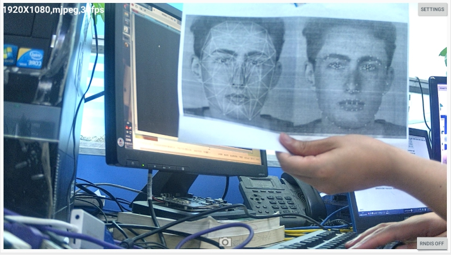
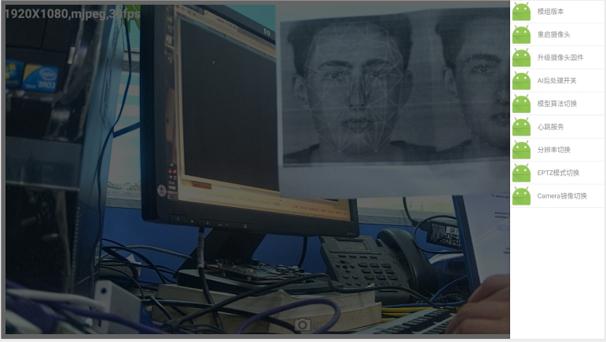

# Rockchip RV1126/RV1109 Linux Smart Camera SDK 快速入门

文档标识：RK-JC-YF-516

发布版本：V1.1.0

日期：2020-05-19

文件密级：□绝密   □秘密   □内部资料   ■公开

---

**免责声明**

本文档按“现状”提供，福州瑞芯微电子股份有限公司（“本公司”，下同）不对本文档的任何陈述、信息和内容的准确性、可靠性、完整性、适销性、特定目的性和非侵权性提供任何明示或暗示的声明或保证。本文档仅作为使用指导的参考。

由于产品版本升级或其他原因，本文档将可能在未经任何通知的情况下，不定期进行更新或修改。

**商标声明**

“Rockchip”、“瑞芯微”、“瑞芯”均为本公司的注册商标，归本公司所有。

本文档可能提及的其他所有注册商标或商标，由其各自拥有者所有。

**版权所有** **© 2020** **福州瑞芯微电子股份有限公司**

超越合理使用范畴，非经本公司书面许可，任何单位和个人不得擅自摘抄、复制本文档内容的部分或全部，并不得以任何形式传播。

福州瑞芯微电子股份有限公司

Fuzhou Rockchip Electronics Co., Ltd.

地址：     福建省福州市铜盘路软件园A区18号

网址：     [www.rock-chips.com](http://www.rock-chips.com)

客户服务电话： +86-4007-700-590

客户服务传真： +86-591-83951833

客户服务邮箱： [fae@rock-chips.com](mailto:fae@rock-chips.com)

---

## **前言**

**概述**

本文主要描述了RV1126/RV1109 Linux Smart Camera SDK的基本使用方法，旨在帮助开发者快速了解并使用RV1126/RV1109 Linux Smart Camera SDK开发包。
本开发包适用但不限于电视AI camera产品，提供灵活的数据通路组合接口，满足客户自由组合的客制化需求。

**产品版本**

| **芯片名称** | **内核版本** |
| ------------ | ------------ |
| RV1126/RV1109 | Linux 4.19 |

**读者对象**

本文档（本指南）主要适用于以下工程师：

技术支持工程师

软件开发工程师

**修订记录**

| **版本号** | **作者** | **修改日期** | **修改说明** |
| ---------- | --------| :--------- | ------------ |
| V1.0.0 | HuangJC | 2020-05-07 | 初始版本     |
| V1.1.0 | HuangJC | 2020-05-19 | 修改编译命令     |
|            |          |              |              |

## **目录**

---
[TOC]
---

## 开发环境搭建

### 命令提示约定

以下是本文涉及命令输入时的执行环境的约定：
执行在 Linux 服务器

```
Server $
```

执行在device端控制台

```
RK $
```

### Linux服务器配置

Ubuntu 16.04系统：
编译环境搭建所依赖的软件包以及安装命令如下：

```shell
Server $ sudo apt-get install repo git-core gitk git-gui gcc-arm-linux-gnueabihf u-boot-tools device-tree-compiler gcc-aarch64-linux-gnu mtools parted libudev-dev libusb-1.0-0-dev python-linaro-image-tools linaro-image-tools autoconf autotools-dev libsigsegv2 m4 intltool libdrm-dev curl sed make binutils build-essential gcc g++ bash patch gzip gawk bzip2 perl tar cpio python unzip rsync file bc wget libncurses5 libqt4-dev libglib2.0-dev libgtk2.0-dev libglade2-dev cvs git mercurial rsync openssh-client subversion asciidoc w3m dblatex graphviz python-matplotlib libc6:i386
```

Ubuntu 17.04系统：
除了上述软件包外还需如下依赖包：

```shell
Server $ sudo apt-get install lib32gcc-7-dev  g++-7  libstdc++-7-dev
```

## SDK目录结构说明

进入工程目录下有buildroot、app、kernel、u-boot、device、docs、external等目录。每个目录或其子目录会对应一个git工程，提交需要在各自的目录下进行。

- buildroot：定制根文件系统。
- app：存放上层应用程序。
- external：相关库，包括多媒体相关，uvc等。
- kernel：kernel代码。
- device/rockchip：存放每个平台的一些编译和打包固件的脚本和预备文件。
- docs：存放开发指导文件、平台支持列表、工具使用文档、Linux 开发指南等。
- prebuilts：存放交叉编译工具链。
- rkbin：存放固件和工具。
- rockdev：存放编译输出固件。
- tools：存放一些常用工具。
- u-boot：U-Boot代码。

## SDK编译说明

### 切换CAMERA产品配置

在根目录执行命令：./build.sh BoardConfig-uvcc.mk

```shell
Server $ ~/SDK_Linux/rv1109$ ./build.sh BoardConfig-uvcc.mk
processing option: BoardConfig-uvcc.mk
switching to board: /disk3/huangjc/SDK_Linux/rv1109/device/rockchip/rv1126_rv1109/BoardConfig-uvcc.mk
```

### 查看编译命令

在根目录执行命令：./build.sh -h|help

```shell
Server $ ./build.sh help
Usage: build.sh [OPTIONS]
Available options:
BoardConfig*.mk    -switch to specified board config
uboot              -build uboot
spl                -build spl
kernel             -build kernel
modules            -build kernel modules
toolchain          -build toolchain
rootfs             -build default rootfs, currently build buildroot as default
buildroot          -build buildroot rootfs
ramboot            -build ramboot image
multi-npu_boot     -build boot image for multi-npu board
yocto              -build yocto rootfs
debian             -build debian9 stretch rootfs
distro             -build debian10 buster rootfs
pcba               -build pcba
recovery           -build recovery
all                -build uboot, kernel, rootfs, recovery image
cleanall           -clean uboot, kernel, rootfs, recovery
firmware           -pack all the image we need to boot up system
updateimg          -pack update image
otapackage         -pack ab update otapackage image
save               -save images, patches, commands used to debug
allsave            -build all & firmware & updateimg & save

Default option is 'allsave'.
```

查看部分模块详细编译命令，例如：./build.sh -h kernel

```shell
Server $ ./build.sh -h kernel
###Current SDK Default [ kernel ] Build Command###
Server $ cd kernel
Server $ make ARCH=arm rv1126_defconfig
Server $ make ARCH=arm rv1126-evb-ddr3-v10.img -j12
```

### U-Boot编译

U-Boot编译命令：`./build.sh uboot`

```shell
### 查看U-Boot详细编译命令
Server $ ./build.sh -h uboot
###Current SDK Default [ uboot ] Build Command###
Server $ cd u-boot
Server $ ./make.sh rv1126
```

### Kernel编译

Kernel编译命令：`./build.sh kernel`

```shell
### 查看Kernel详细编译命令
Server $ ./build.sh -h kernel
###Current SDK Default [ kernel ] Build Command###
Server $ cd kernel
Server $ make ARCH=arm rv1126_defconfig
Server $ make ARCH=arm rv1126-evb-ddr3-v10.img -j12
```

### Recovery编译

Recovery编译命令：`./build.sh recovery`

```shell
### 查看Recovery详细编译命令
Server $ ./build.sh -h recovery
###Current SDK Default [ recovery ] Build Command###
Server $ source envsetup.sh rockchip_rv1126_rv1109_recovery
Server $ /home/user/sdk/device/rockchip/common/mk-ramdisk.sh recovery.img rockchip_rv1126_rv1109_recovery
```

### Rootfs编译

Rootfs编译命令：`./build.sh rootfs`

```shell
### 查看Roofs详细编译命令
Server $ ./build.sh -h rootfs
###Current SDK Default [ rootfs ] Build Command###
Server $ source envsetup.sh rockchip_rv1126_rv1109_uvcc
Server $ make
```

### 固件打包

固件打包命令：`./mkfirmware.sh`

固件目录：rockdev

### 全自动编译

进入工程根目录执行以下命令自动完成所有的编译：

```shell
./build.sh all
```

## 刷机说明

### EVB板正面示意图


### EVB板背面示意图


### 硬件接口功能表


### Windows 刷机说明

SDK 提供 Windows 烧写工具(工具版本需要 V2.71 或以上)，工具位于工程根目录：

```shell
tools/
├── windows/AndroidTool
```

如下图，编译生成相应的固件后，设备烧写需要进入 MASKROM 或 BootROM 烧写模式，
连接好 USB 下载线后，按住按键“Update”不放并按下复位键“RESET”后松手，就能进入
MASKROM 模式，加载编译生成固件的相应路径后，点击“执行”进行烧写，也可以按 “recovery" 按键不放并按下复位键 “RESET” 后松手进入 loader 模式进行烧写，下面是 MASKROM 模式的分区偏移及烧写文件。(注意： Windows PC 需要在管理员权限运行工具才可执行)


注：烧写前，需安装最新 USB 驱动，驱动详见：

```shell
<SDK>/tools/windows/DriverAssitant_v4.91.zip
```

### Linux 刷机说明

Linux 下的烧写工具位于 tools/linux 目录下(Linux_Upgrade_Tool 工具版本需要 V1.49 或以上)，请确认你的板子连接到 MASKROM/loader rockusb。比如编译生成的固件在 rockdev 目录下，升级命令如下：

```shell
Server $ sudo ./upgrade_tool ul rockdev/MiniLoaderAll.bin
Server $ sudo ./upgrade_tool di -p rockdev/parameter.txt
Server $ sudo ./upgrade_tool di -u rockdev/uboot.img
Server $ sudo ./upgrade_tool di -misc rockdev/misc.img
Server $ sudo ./upgrade_tool di -b rockdev/boot.img
Server $ sudo ./upgrade_tool di -recovery rockdev/recovery.img
Server $ sudo ./upgrade_tool di -oem rockdev/oem.img
Server $ sudo ./upgrade_tool di -rootfs rocdev/rootfs.img
Server $ sudo ./upgrade_tool di -userdata rockdev/userdata.img
Server $ sudo ./upgrade_tool rd
```

或升级整个 firmware 的 update.img 固件：

```shell
Server $ sudo ./upgrade_tool uf rockdev/update.img
```

或在根目录，机器在 MASKROM 状态运行如下升级：

```shell
Server $ ./rkflash.sh
```

## EVB板功能说明

EVB板TV Camera固件支持如下功能：

- 支持标准UVC Camera功能，最高支持4k预览（rv1126）
- 支持多种NN算法，包括人脸检测，人体姿态或骨骼检测，人脸关键点检测跟踪等，支持其他算法扩展
- 支持USB复合设备稳定传输
- 支持NN前处理和数据后处理通路
- 支持智能电视或PC等多种终端设备预览
- 支持EPTZ

### 如何显示主camera预览

使用usb线连接evb的usb otg口与上位机，如TV端或PC端usb host 口，上电开机。默认会自动启动uvc camera应用及rndis服务。使用串口连上EVB板子运行**ifconfig usb0**可获取**预配置的RNDIS 虚拟网口IP地址**。

```shell
RK $ ifconfig usb0
usb0      Link encap:Ethernet  HWaddr 8E:F3:7D:36:13:34
          inet addr:172.16.110.6  Bcast:172.16.255.255  Mask:255.255.0.0
          UP BROADCAST RUNNING MULTICAST  MTU:1500  Metric:1
          RX packets:4884 errors:0 dropped:16 overruns:0 frame:0
          TX packets:4843 errors:0 dropped:0 overruns:0 carrier:0
          collisions:0 txqueuelen:1000
          RX bytes:257305 (251.2 KiB)  TX bytes:787936 (769.4 KiB)
```

使用串口连接EVB板子的PC端配置如下：

```shell
波特率：1500000
数据位：8
停止位：1
奇偶校验：none
流控：none
```

Android智能电视使用RKAICameraTest应用或其他标准camera应用，PC端使用amcap或mycam等uvc camera应用，打开即可看到预览，切换格式或分辨率参考上位机所用应用切换即可。



### 如何测试AI模型后处理

在电视端打开RKAICameraTest应用，看到预览后点击RNDIS按钮连接RNDIS，成功后点击SETTINGS按钮选择“模型算法切换”选项，选择要使用的模型算法，默认为人脸检测算法，然后点击“AI后处理开关”，当人脸在镜头前出现即可看到AI处理效果：




### 如何测试EPTZ功能

在电视端打开RKAICameraTest应用，看到预览后点击RNDIS按钮连接RNDIS，成功后点击SETTINGS按钮选择“EPTZ模式切换”选项，在倒计时完成后，再打开应用即可，此时在界面左上角会显示是EPTZ模型还是普通智能预览模式：


## 应用软件框架

总体结构如下：


其中,RV1109端应用与源码程序对应关系如下：

> **1.main app 对应<SDK>/app/smart_display_service：负责rndis 服务端功能实现，命令处理，nn数据转发等操作；**
>
> **2.AI app 对应<SDK>/app/mediaserver：负责将一路camera数据送到npu做对应nn算法处理，通过共享内存机制传递给main app；**
>
> **3.uvc app 对应<SDK>/external/uvc_app:：负责uvc camera完整功能的实现和控制。**

### uvc_app

请参考：

```shell
<SDK>/external/uvc_app/doc/zh-cn/uvc_app.md
```

### mediaserver

请参考：

```shell
<SDK>/docs/Linux/AppcationNote/Rockchip_Instructions_Linux_MediaServer_CN.pdf
```

### 其它

其它linux应用框架或模块资料，请参考下列目录对应文档：

```shell
<SDK>/docs/Linux/
```

## FAQ

### 如何重编一个模块

以mpp模块为例，重编可以使用：

```shell
make mpp-rebuild
```

### 使用gdb调试

打开buildroot的gdb配置，然后重新编译打包文件系统

```diff
buildroot目录下
diff --git a/configs/rockchip_rv1126_rv1109_uvcc_defconfig b/configs/rockchip_rv1126_rv1109_uvcc_defconfig
index 0f04334e40..8d9a10fd06 100644
--- a/configs/rockchip_rv1126_rv1109_uvcc_defconfig
+++ b/configs/rockchip_rv1126_rv1109_uvcc_defconfig
@@ -7,6 +7,7 @@
 #include "bt.config"
 #include "video_mpp.config"
 #include "rv1126_rv1109_arm.config"
+#include "gdb.config"
 BR2_TOOLCHAIN_EXTERNAL_PATH="$(TOPDIR)/../prebuilts/gcc/linux-x86/arm/gcc-arm-8.3-2019.03-x86_64-arm-linux-gnueabihf"
 BR2_TOOLCHAIN_EXTERNAL_CUSTOM_PREFIX="arm-linux-gnueabihf"
 BR2_TOOLCHAIN_EXTERNAL_GCC_8=y
```

注：运行gdb时，需要在gdb启动后，手动配置信号

```shell
RK $ handle SIGILL pass nostop noprint
```

