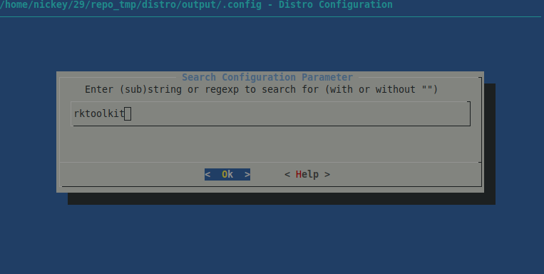
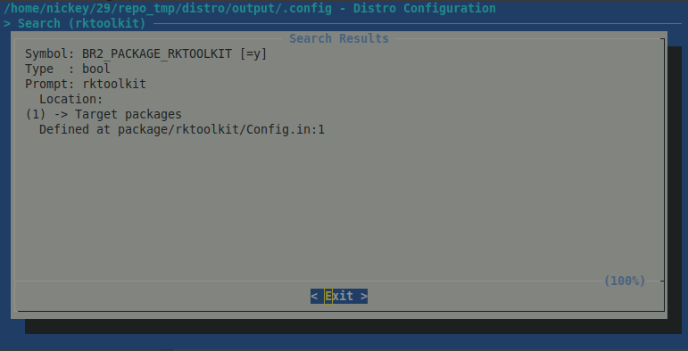
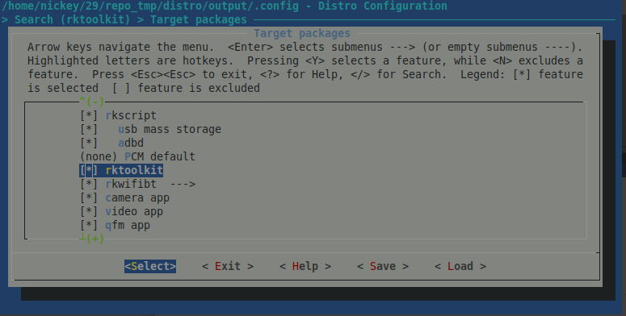
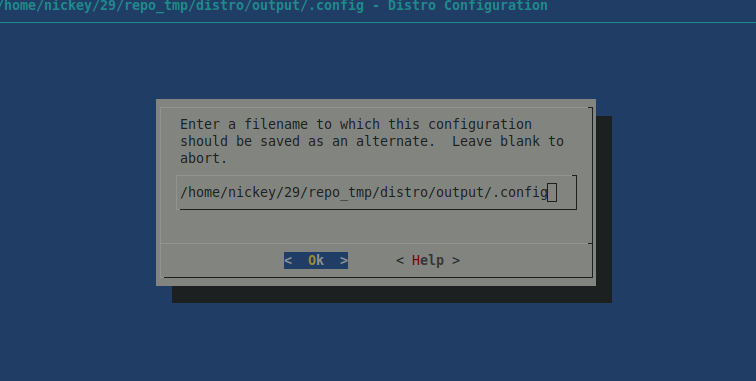

# Rockchip Debian10 Developer Guide

ID: RK-KF-YF-332

Release Version: V1.0.1

Release Date: 2020-03-27

Security Level: □Top-Secret   □Secret   □Internal   ■Public

---

**DISCLAIMER**

THIS DOCUMENT IS PROVIDED “AS IS”. FUZHOU ROCKCHIP ELECTRONICS CO., LTD.(“ROCKCHIP”)DOES NOT PROVIDE ANY WARRANTY OF ANY KIND, EXPRESSED, IMPLIED OR OTHERWISE, WITH RESPECT TO THE ACCURACY, RELIABILITY, COMPLETENESS,MERCHANTABILITY, FITNESS FOR ANY PARTICULAR PURPOSE OR NON-INFRINGEMENT OF ANY REPRESENTATION, INFORMATION AND CONTENT IN THIS DOCUMENT. THIS DOCUMENT IS FOR REFERENCE ONLY. THIS DOCUMENT MAY BE UPDATED OR CHANGED WITHOUT ANY NOTICE AT ANY TIME DUE TO THE UPGRADES OF THE PRODUCT OR ANY OTHER REASONS.

**Trademark Statement**

"Rockchip", "瑞芯微", "瑞芯" shall be Rockchip’s registered trademarks and owned by Rockchip. All the other trademarks or registered trademarks mentioned in this document shall be owned by their respective owners.

**All rights reserved. ©2020. Fuzhou Rockchip Electronics Co., Ltd.**

Beyond the scope of fair use, neither any entity nor individual shall extract, copy, or distribute this document in any form in whole or in part without the written approval of Rockchip.

Fuzhou Rockchip Electronics Co., Ltd.

No.18 Building, A District, No.89, software Boulevard Fuzhou, Fujian,PRC

Website:     [www.rock-chips.com](http://www.rock-chips.com)

Customer service Tel:  +86-4007-700-590

Customer service Fax:  +86-591-83951833

Customer service e-Mail:  [fae@rock-chips.com](mailto:fae@rock-chips.com)

---

## **Preface**

 **Overview**

This document will introduce building, configuration, usage, and  key points during development of Debian10 in Rockchip Linux SDKs.

**Main Functions**

| **Classification** | **Functions**                                                |
| ------------------ | ------------------------------------------------------------ |
| Data communication | Wi-Fi, Ethernet card, USB, SDCARD, etc.                      |
| Applications       | Desktop, settings, file manager, audio and video playback, etc. |

**Intended Audience**

This document (this guide) is mainly intended for:

Technical support engineers
Software development engineers

---

 **Revision History**

| **Date**   | **Version** | **Date**    | Revision History             |
| ---------- | ----------- | :---------- | ---------------------------- |
| 2020-02-06 | V1.0.0      | Nickey Yang | Initial release              |
| 2020-03-27 | V1.0.1      | Nickey Yang | Update the document's format |

---

## **Contents**

[TOC]

---

## **1 Set up the Development Environment**

### **1.1 Choose a Development System**

Ubuntu 18.04 is recommended to be used as an operating system of a compilation host. After the operating system is installed and the network environment is configured, you can continue with the following steps to complete installation of compilation tools.

### **1.2 Compilation Tools Installation**

```bash
sudo apt-get install repo git-core gitk git-gui gcc-arm-linux-gnueabihf u-boot-tools device-tree-compiler gcc-aarch64-linux-gnu mtools parted libudev-dev libusb-1.0-0-dev python-linaro-image-tools linaro-image-tools autoconf autotools-dev libsigsegv2 m4 intltool libdrm-dev curl sed make binutils build-essential gcc g++ bash patch gzip bzip2 perl tar cpio python unzip rsync file bc wget libncurses5 libqt4-dev libglib2.0-dev libgtk2.0-dev libglade2-dev cvs git mercurial rsync openssh-client subversion asciidoc w3m dblatex graphviz python-matplotlib libc6:i386 libssl-dev texinfo liblz4-tool genext2fs xutils-dev libwayland-bin bison flex cmake
```

If an error is reported during compilation, you can install corresponding software packages according to the error messages.

## **2 Directory Structure**

```bash
.
├── distro
│   ├── configs   #The default configurations of different chip platforms, and users can add customized configurations
│   ├── download  #the source package downloaded from internet during building process
│   ├── output    #output Files during building
│      ├── log    #Logs generated during building, installation, and packaging
│      ├── build  #The files generated by each package during building
│      ├── images #The root file system images after packaging and compression
│      ├── target #Complete root file system
│   ├── overlay   #The overlay directory will cover the root file system to meet the requirements of customization
│   ├── package   #Store Config.ini and make.sh required for building of different packages
│   ├── scripts   #Scripts for Building, installation, and packaging
│   ├── support   #added for building some packages, you can download the source package and add local patches to build
├── app           #qt application source code for launcher, camera, setting, etc.
├── buildroot     #buildroot directory
└── external      #Source code such as libdrm, mpp, rktoolkit provided by Rockchip
```

At present, when building Qt APP on Debian10, qmake built by Buildroot will be used. So if you need to build Qt APP on Debian10, please build Buildroot first.

## **3 Configuration and Compilation**

### **3.1 Default Configuration and Compilation**

Take RK3288 as an example to introduce the compilation and development of Debian10 system as follows:

```bash
cd distro
make rk3288_defconfig   #defconfig is located in configs directory
```

After execution, the final configuration file used for building will be generated and stored in output/.config.

```bash
./make.sh               #Automatically complete download, compilation, and packaging of each package into a file system
```

### **3.2 Add Local Source Code Package and Build**

It is going to describe how to integrate a local package into Debain10 below. Building `package` means that distro/make.s script executes make.sh in the corresponding packages according to the configurations enabled in `.config`. Here we will take rktoolkit as an example:

1. Add rktoolkit to package/Config.ini:

```bash
   package/Config.in
           source "package/rkscript/Config.in"
   +       source "package/rktoolkit/Config.in"
           source "package/rkwifibt/Config.in"
```

2. Create a new rktoolkit folder, then write make.sh and Config.in in this folder:

```bash
   package/rktoolkit/Config.in
   +config BR2_PACKAGE_RKTOOLKIT
   +       bool "rktoolkit"
   +       help
   +         "io and update tool"
   package/rktoolkit/make.sh
   +#!/bin/bash
   +set -e
   +$GCC $TOP_DIR/external/rktoolkit/io.c --sysroot=$SYSROOT_DIR -I$SYSROOT_DIR/usr/include -I$SYSROOT_DIR/usr/include/$TOOLCHAIN -o $TARGET_DIR/usr/bin/io
   +$GCC $TOP_DIR/external/rktoolkit/update.c $TOP_DIR/external/rktoolkit/update_recv/update_recv.c --sysroot=$SYSROOT_DIR -I$SYSROOT_DIR/usr/include -I$SYSROOT_DIR/usr/include/$TOOLCHAIN -I$TOP_DIR/external/rktoolkit/update_recv/ -o $TARGET_DIR/usr/bin/update
```

3. Build rktoolkit separately:

```
   ./make.sh rktoolkit
```

   The log of building is as follows:

```
   building pkgs: rktoolkit
   I: Running command: /home/nickey/29/repo_tmp/distro/package/rktoolkit/make.sh
   ...(part of contents are omitted)
   build rktoolkit done!!!
```

4. Rebuild rktoolkit:

```
   ./make.sh rktoolkit-rebuild
```

   Or

```
    rm -rf output/build/rktoolkit/
    ./make.sh rktoolkit
```

When building a package, the script will check whether the package has been successfully built according to output/build/rktoolkit/. If it has been successfully built, the package will not be built. So for the rktoolkit package debugging, after the source code is modified, please use the above command to rebuild.

**Notice**：

Individual packages building will also be installed in the output/target directory, but the file system will not be packaged. You have to execute the following command to complete the file system packaging.

```
./make.sh image
```

### **3.3 Modify Configurations**

The above steps are all default configurations. When there are some customized requirements, you have to add or remove some packages, or modify the package configuration options. Debian10 supports two ways to modify configurations: graphical modification and modify directly.

#### **3.3.1 Direct Modification**

Add in the configs/rk3288_defconfig directly:

```
 BR2_PACKAGE_RKTOOLKIT=y
```

#### **3.3.2 Graphical Modification**

Take adding rktoolkit as an example:

```
make menuconfig
```


Enter / to pop-up the search interface as follows, enter rktoolkit, and press enter button:



Press 1, choose the searched rktoolkit package:



Enter a space to check this package:



Save to the `.config` used in build finally.



```
./make.sh
```

Build rktoolkit and package it into the root file system.

#### **3.3.3 Save Configurations**

```
make savedefconfig
```

The above commands will save output /.config configurations back to configs /rk3288_defconfig.

## **4 FAQs**

### **4.1 Lack of mkdir Permissions**

The following log appears when `make rk3288_defconfig`:

```
mkdir -p /output/build/buildroot-config/lxdialog
mkdir: unable to create directory "/output": lack of permissions
Makefile:186: recipe for target '/output/build/buildroot-config/conf' failed
make: *** [/output/build/buildroot-config/conf] Error 1
```

Solution: because the $CURDIR variable required in Makefile is empty, restart a shell terminal.

### **4.2 Public Key is not Available**

The log of public key is not available appears during build:

```
Reading package lists... Done
W: GPG error: http://mirrors.ustc.edu.cn/debian buster InRelease: The following signatures couldn't be verified because the public key is not available: NO_PUBKEY 04EE7237B7D453EC  NO_PUBKEY 648ACFD622F3D138  NO_PUBKEY DCC9EFBF77E11517
```

Solution: run `make.sh` without sudo, and add the key to access server using the following command.

```
sudo apt-key adv --keyserver keyserver.ubuntu.com --recv-keys 04EE7237B7D453EC 648ACFD622F3D138  DCC9EFBF77E11517
```
