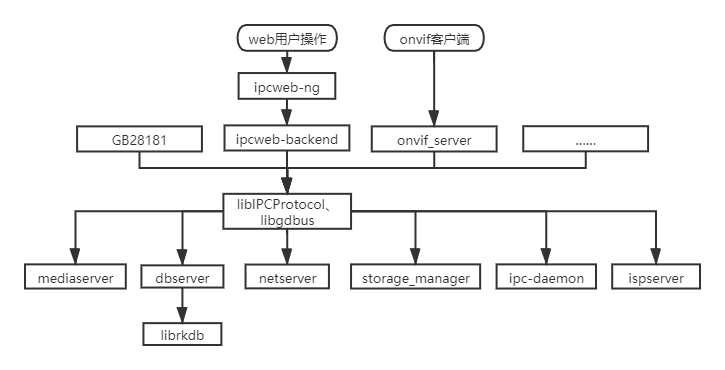

# Rockchip Linux应用开发基础

文件标识：RK-FB-YF-358

发布版本：V1.0.0

日期：2020-04-28

文件密级：□绝密   □秘密   □内部资料   ■公开

---

**免责声明**

本文档按“现状”提供，福州瑞芯微电子股份有限公司（“本公司”，下同）不对本文档的任何陈述、信息和内容的准确性、可靠性、完整性、适销性、特定目的性和非侵权性提供任何明示或暗示的声明或保证。本文档仅作为使用指导的参考。

由于产品版本升级或其他原因，本文档将可能在未经任何通知的情况下，不定期进行更新或修改。

**商标声明**

“Rockchip”、“瑞芯微”、“瑞芯”均为本公司的注册商标，归本公司所有。

本文档可能提及的其他所有注册商标或商标，由其各自拥有者所有。

**版权所有** **© 2020** **福州瑞芯微电子股份有限公司**

超越合理使用范畴，非经本公司书面许可，任何单位和个人不得擅自摘抄、复制本文档内容的部分或全部，并不得以任何形式传播。

福州瑞芯微电子股份有限公司

Fuzhou Rockchip Electronics Co., Ltd.

地址：     福建省福州市铜盘路软件园A区18号

网址：     [www.rock-chips.com](http://www.rock-chips.com)

客户服务电话： +86-4007-700-590

客户服务传真： +86-591-83951833

客户服务邮箱： [fae@rock-chips.com](mailto:fae@rock-chips.com)

---

**前言**

**概述**

本文档提供Linux应用开发基础说明。

**产品版本**

| **芯片名称** | **内核版本** |
| ------------ | ------------ |
| RV1109       | Linux 4.19   |
| RK1806       | Linux 4.19   |

**读者对象**

本文档（本指南）主要适用于以下工程师：

技术支持工程师
软件开发工程师

**修订记录**

| **版本号** | **作者**   | **修改日期** | **修改说明** |
| ---------- | ---------- | :----------- | ------------ |
| V1.0.0     | Fenrir Lin | 2020-04-28   | 初始版本     |

**目录**

---

[TOC]

## 1 简介：

### 1.1 应用

主要应用路径位于SDK工程的app路径下，对应功能如下：

| 应用名称        | 模块功能               |
| --------------- | ---------------------- |
| ipcweb-ng       | web前端工程            |
| ipcweb-backend  | web后端工程            |
| ipc-daemon      | 系统管理及守护以下应用 |
| storage_manager | 存储管理               |
| netserver       | 网络服务               |
| mediaserver     | 多媒体服务             |
| dbserver        | 数据库服务             |

### 1.2 库

主要库路径位于SDK工程的app路径下，采用dbus的进程间通信机制。主要开发libIPCProtocol即可。

| 库名称         | 主要功能                                           |
| -------------- | -------------------------------------------------- |
| libIPCProtocol | 基于dbus，提供进程间通信接口，以便跨进程调用函数。 |
| librkdb        | 基于sql，提供对数据库操作的接口。                  |
| libgdbus       | 提供dbus支持。                                     |

### 1.3 应用框架

应用框架如下：



web前端根据用户的操作，使用GET/PUT/POST/DELETE四种方法，调用不同的web后端接口。

web后端中，使用libIPCProtocol提供的函数，通过dbus进行跨进程间通信，来调用相应的服务。

具体服务中，会根据传入的参数，进行相应的操作，从而使web前端的操作生效。

除了web使用的http协议外，还可使用GB28181、ONVIF等协议。此框架可以兼容不同应用，可以不耦合。

## 2 数据流

数据流主要为web前后端之间的http协议和dbus总线上的通信数据。统一使用JSON格式。

### 2.1 GET

以获取当前网卡信息为例，首先web端在进入配置-网络-基础设置时，会自动刷新，并向web后端发送一条请求，摘要如下：

```http
Request URL: http://{{板端IP地址}}/cgi-bin/entry.cgi/network/lan
Request Method: GET
```

web后端收到这条Request后，会判断URL和Method的信息，调用libIPCProtocol提供的netserver_get_networkip函数，向dbus总线发送一条如下的消息**(可使用dbus-monitor工具监控)**：

```shell
method call time=1588045737.411643 sender=:1.371 -> destination=rockchip.netserver serial=2 path=/; interface=rockchip.netserver.server; member=GetNetworkIP
   string "eth0"
```

netserver服务收到这条消息后，去获取当前eth0网卡的IP地址，再通过dbus进行回复。

```shell
method return time=1588045737.419339 sender=:1.4 -> destination=:1.371 serial=357 reply_serial=2
   string "[ { "link": { "sInterface": "eth0", "sAddress": "72:94:20:67:b4:b8", "iNicSpeed": 1000, "iDuplex": 1, "sDNS1": "10.10.10.188", "sDNS2": "58.22.96.66" }, "ipv4": { "sV4Address": "172.16.21.204", "sV4Netmask": "255.255.255.0", "sV4Gateway": "172.16.21.1" }, "dbconfig": { "sV4Method": "dhcp", "sV4Address": "", "sV4Netmask": "", "sV4Gateway": "", "sDNS1": "", "sDNS2": "" } } ]"
```

web后端对dbus消息进行处理后，通过http发送以下信息给web前端，进而显示在网页界面上。

```json
response:
{
	"ipv4": {
		"sV4Address": "172.16.21.204",
		"sV4Gateway": "172.16.21.1",
		"sV4Method": "dhcp",
		"sV4Netmask": "255.255.255.0"
	},
	"link": {
		"sAddress": "72:94:20:67:b4:b8",
		"sDNS1": "10.10.10.188",
		"sDNS2": "58.22.96.66",
		"sInterface": "eth0",
		"sNicType": "1000MD"
	}
}
```

### 2.2 PUT

以设置IP地址为例，web前端发送如下请求：

```http
Request URL: http://172.16.21.204/cgi-bin/entry.cgi/network/lan
Request Method: PUT
Request Payload:
{
	"ipv4": {
		"sV4Address": "172.16.21.205",
		"sV4Gateway": "172.16.21.1",
		"sV4Method": "manual",
		"sV4Netmask": "255.255.255.0"
	},
	"link": {
		"sAddress": "72:94:20:67:b4:b8",
		"sInterface": "eth0",
		"sNicType": "1000MD",
		"sDNS1": "10.10.10.188",
		"sDNS2": "58.22.96.66"
	}
}
```

web后端调用libIPCProtocol提供的dbserver_network_ipv4_set函数，向dbus总线发送如下消息

```shell
method call time=1588054078.249193 sender=:1.447 -> destination=rockchip.dbserver serial=3 path=/; interface=rockchip.dbserver.net; member=Cmd
   string "{ "table": "NetworkIP", "key": { "sInterface": "eth0" }, "data": { "sV4Method": "manual", "sV4Address": "172.16.21.205", "sV4Netmask": "255.255.255.0", "sV4Gateway": "172.16.21.1" }, "cmd": "Update" }"
```

该消息发往的interface是**rockchip.dbserver.net**，将会update数据库中NetworkIP这张表的数据。同时netserver会监听到此interface的广播，根据消息中的IP地址去进行设置。

web后端的部分接口会再获取一次最新值，返还给前端。

## 3 ipcweb-ng

### 3.1 开发基础：

web前端，采用Angular 8框架。

**使用语言：** Typescript，JavaScript，HTML5，CSS3

**参考文档:**

[Angular官方入门教程](https://angular.io/start)
[TypeScript中文网](https://www.tslang.cn/)
[w3school](https://www.w3school.com.cn/)

**代码路径：** app/ipcweb-ng

**编译命令：**

```shell
#在app/ipcweb-ng目录下
ng build --prod
#将编译生成在app/ipcweb-ng/dist目录下的文件，都移动到device/rockchip/oem/oem_ipc/www路径下
#在SDK根目录下
make rk_oem dirclean && make rk_oem #重新编译oem
./mkfirmware.sh #打包oem.img,再进行烧写
```

### 3.2 开发环境

```shell
sudo apt update
sudo apt install nodejs
sudo apt install npm
sudo npm install -g n # 安装 n 模块
sudo n stable # 用 n 模块升级
npm npm --version # 确认 npm 版本
sudo npm install -g @angular/cli # 安装 Angular 命令行工具
```

### 3.3 在线调试

启动webpack开发服务

```shell
ng serve
```

成功的话，可见以下log

```shell
** Angular Live Development Server is listening on 0.0.0.0:4200, open your browser on http://localhost:4200/ **
```

随后使用chrome浏览器访问 <http://localhost:4200/>，即可在线调试。

也可使用`ng build --prod`命令编译，将生成在dist目录下的文件，推送到板端，替换/oem/www下的文件。如果浏览器访问页面未更新，需要清理浏览器图片和文件的缓存。

### 3.4 代码框架

```shell
src/
├── app
│ ├── about # 关于页面，项目说明文字
│ ├── app.component.html # 应用主入口
│ ├── app.component.scss # scss 样式文件
│ ├── app.component.spec.ts # 测试 spec 文件
│ ├── app.component.ts # app 组件
│ ├── app.module.ts # app 模块
│ ├── app-routing.module.ts # 主路由
│ ├── auth # 认证模块，包括登录页面，用户认证
│ ├── config # 配置模块，包含所有配置子组件
│ ├── config.service.spec.ts # 配置模块测试 spec 文件
│ ├── config.service.ts # 配置模块服务，用于与设备通信以及模块间通信
│ ├── footer # footer 模块，版权声明
│ ├── header # header 模块，导航路由，用户登录/登出
│ └── preview # 预览模块，主页面码流播放器
├── assets
│ ├── css # 样式
│ ├── i18n # 多国语言翻译
│ ├── images # 图标
│ └── json # 调试用 json 数据库文件
├── environments # angular 发布环境配置
│ ├── environment.prod.ts
│ └── environment.ts
├── favicon.ico # 图标
├── index.html # 项目入口
├── main.ts # 项目入口
├── polyfills.ts
├── styles.scss # 项目总的样式配置文件
└── test.ts
14 directories, 16 files
```

详细模块位于 src/app/config

```shell
$ tree -L 2 src/app/config
├── config-audio # 音频配置
│ ├── config-audio.component.html
│ ├── config-audio.component.scss
│ ├── config-audio.component.spec.ts
│ └── config-audio.component.ts
├── config.component.html # config组件主页面
├── config-event # 事件配置
├── config-image # ISP图像配置
├── config-intel # Intelligent智能分析配置
├── config.module.ts # 配置模块
├── config-network # 网络配置
├── config-routing.module.ts # 配置模块子路由
├── config-storage # 存储配置
├── config-system # 系统配置
├── config-video # 视频编码配置
├── MenuGroup.ts # 菜单数据类
├── NetworkInterface.ts # 网络接口数据类
└── shared # 一些共享子模块，可复用，方便后面主模块调整
    ├── abnormal
    ├── alarm-input
    ├── alarm-output
    ├── center-tip
    ├── cloud
    ├── ddns
    ├── email
    ├── encoder-param
    ├── ftp
    ├── hard-disk-management
    ├── info
    ├── intrusion-detection
    ├── intrusion-region
    ├── isp
    ├── motion-arming
    ├── motion-detect
    ├── motion-linkage
    ├── motion-region
    ├── ntp
    ├── osd
    ├── picture-mask
    ├── port
    ├── pppoe
    ├── privacy-mask
    ├── protocol
    ├── region-crop
    ├── roi
    ├── save-tip
    ├── screenshot
    ├── smtp
    ├── tcpip
    ├── time-table
    ├── upgrade
    ├── upnp
    └── wifi
```

## 4 ipcweb-backend

### 4.1 开发基础：

web后端，采用ngingx+fastcgi，调试可以使用curl、postman或者直接与web前端联调。

**使用语言：** C++

**参考文档:**

[HTPP协议知识](https://www.w3schools.com/tags/ref_httpmethods.asp)
[RESTful API 规范](https://google.github.io/styleguide/jsoncstyleguide.xml)
[Nginx + CGI/FastCGI + C/Cpp](https://www.cnblogs.com/skynet/p/4173450.html)
[POSTMAN](https://www.postman.com/)

**代码路径：** app/ipcweb-backend

**编译命令：**

```shell
#在SDK根目录下
make ipcweb-backend-rebuild
make rk_oem dirclean && make rk_oem #重新编译oem
./mkfirmware.sh #打包oem.img，再进行烧写
```

**配置文件：**

nginx配置文件位于buildroot/board/rockchip/puma/fs-overlay/etc/nginx/nginx.conf，部分摘要如下：

```nginx
location /cgi-bin/ {
	gzip off;
	# 网页根目录
	root /oem/www;
	fastcgi_pass unix:/run/fcgiwrap.sock;
	fastcgi_index entry.cgi;
	fastcgi_param DOCUMENT_ROOT /oem/www/cgi-bin;
	# CGI 应用唯一入口
	fastcgi_param SCRIPT_NAME /entry.cgi;
	include fastcgi_params;

	# 解决PATH_INFO变量问题
	set $path_info "";
	set $real_script_name $fastcgi_script_name;
	if ($fastcgi_script_name ~ "^(.+?\.cgi)(/.+)$") {
		set $real_script_name $1;
		set $path_info $2;
	}
	fastcgi_param PATH_INFO $path_info;
	fastcgi_param SCRIPT_FILENAME $document_root$real_script_name;
	fastcgi_param SCRIPT_NAME $real_script_name;
}
```

### 4.2 编译环境

可以在SDK根目录下使用make ipcweb-backend编译，也可以使用以下命令编译。

```shell
mkdir build && cd build
【可选】该项目使用Google Test作为测试框架。初始化googletest子模块以使用它。
  git submodule init
  git submodule update

cmake .. -DCMAKE_TOOLCHAIN_FILE=<path_of_sdk_root>/buildroot/output/rockchip_puma/host/share/buildroot/toolchain .cmake

make
```

### 4.3 调试环境

1、将编译出的entry.cgi文件推送到设备端的/oem/www/cgi-bin/路径下，确保entry.cgi文件的权限和用户组如下：

```shell
-rwxr-xr-x 1 www-data www-data 235832 Apr 26 20:51 entry.cgi
```

2、确保设备端nginx服务已经启动，可使用ps命令查看。

```shell
538 root     12772 S    nginx: master process /usr/sbin/nginx
539 www-data 13076 S    nginx: worker process
```

3、使用ifconfig -a命令获取设备端的IP地址。

4、使用curl命令进行调试，示例如下：

```shell
$ curl -X GET http://172.16.21.217/cgi-bin/entry.cgi/network/lan
{"ipv4":{"sV4Address":"172.16.21.217","sV4Gateway":"172.16.21.1","sV4Method":"dhcp","sV4Netmask":"255.255.255.0"},"link":{"sAddress":"84:c2:e4:1b:66:d8","sDNS1":"10.10.10.188","sDNS2":"58.22.96.66","sInterface":"eth0","sNicType":"10MD"}}
```

5、由于CGI不能使用标准输出流，所以log保存在以下路径。

```shell
$ cat /var/log/messages
# 调试log输出到syslog
$ cat /var/log/nginx/error.log
# 网页服务器错误log
$ cat /var/log/nginx/access.log
# 网页服务器访问log
```

## 5 ipc-daemon

### 5.1 开发基础：

系统守护服务，提供系统维护相关服务，初始化和确保dbserver/netserver/storage_manager/mediaserver的运行。

**开发语言：** C

**代码路径：** app/ipc-daemon

**编译命令：** 在SDK根目录下，`make ipc-daemon-rebuild`

### 5.2 对外接口

以下接口位于app/libIPCProtocol/system_manager.h中。

| 函数名称             | 函数功能     |
| -------------------- | ------------ |
| system_reboot        | 系统重启     |
| system_factory_reset | 恢复出厂设置 |
| system_export_db     | 导出数据库   |
| system_import_db     | 导入数据库   |
| system_export_log    | 导出调试日志 |
| system_upgrade       | OTA固件升级  |

## 6 storage_manager

### 6.1 开发基础：

存储管理服务，提供文件查询、硬盘管理、录像抓图配额等功能。

**开发语言：** C

**代码路径：** app/storage_manager

**编译命令：** 在SDK根目录下，`make storage_manager-rebuild`

### 6.2 对外接口

以下接口位于app/libIPCProtocol/storage_manager.h中。

| 函数名称                          | 函数功能             |
| --------------------------------- | -------------------- |
| storage_manager_get_disks_status  | 获取硬盘状态         |
| storage_manager_get_filelist_id   | 根据ID获取文件列表   |
| storage_manager_get_filelist_path | 根据路径获取文件列表 |
| storage_manager_get_media_path    | 获取媒体文件路径信息 |
| storage_manager_diskformat        | 硬盘格式化           |

## 7 netserver

### 7.1 开发基础：

网络服务，提供获取网络信息，扫描Wi-Fi，配网等功能。

**开发语言：** C

**代码路径：** app/netserver

**编译命令：** 在SDK根目录下，`make netserver-rebuild`

### 7.2 对外接口

以下接口位于app/libIPCProtocol/netserver.h中。

| 函数名称                | 函数功能                      |
| ----------------------- | ----------------------------- |
| netserver_scan_wifi     | 扫描Wi-Fi                      |
| netserver_get_service   | 获取Wi-Fi或以太网的service信息 |
| netserver_get_config    | 获取service对应的配置信息     |
| netserver_get_networkip | 获取eth0或wlan0的网卡信息     |

## 8 dbserver

### 8.1 开发基础：

数据库服务，对数据库进行初始化，提供对数据库相关操作接口。

**开发语言：** C

**代码路径：** app/dbserver

**编译命令：** 在SDK根目录下，`make dbserver-rebuild`

### 8.2 对外接口

接口位于app/libIPCProtocol/dbserver.h中，主要对数据库不同table进行select、update、delete等操作。

### 8.3 调试环境

修改完代码，重新编译后，设备端需要执行以下操作：

```shell
killall dbserver
rm /data/sysconfig.db
#将新编译的dbserver推送进来替换
dbserver&
```

可使用以下命令，发送dbus消息来查询数据是否正常。

```shell
# dbus-send --system --print-reply --dest=rockchip.dbserver / rockchip.dbserver.net.Cmd \
> string:"{ \"table\": \"ntp\", \"key\": { }, \"data\": \"*\", \"cmd\": \"Select\" }"

method return time=1588123823.096268 sender=:1.5 -> destination=:1.6 serial=7 reply_serial=2
   string "{ "iReturn": 0, "sErrMsg": "", "jData": [ { "id": 0, "sNtpServers": "122.224.9.29 94.130.49.186", "sTimeZone": "posix\/Etc\/GMT-8", "iAutoMode": 1, "iRefreshTime": 60 } ] }"
```

## 9 mediaserver

提供多媒体服务的主应用，具体开发请参考《MediaServer开发基础》

## 10 libIPCProtocol

### 10.1 开发基础：

基于dbus，提供进程间通信的函数接口。

**开发语言：** C

**代码路径：** app/LibIPCProtocol

**编译命令：** 在SDK根目录下，`make libIPCProtocol-rebuild`

### 10.2 对外接口

其中接口为对dbus通信的封装，各个服务的对外接口均在此库中提供。

## 11 应用开发流程

**从数据库到web应用的开发，自底向上的开发流程如下：**

dbserver → libIPCProtocol → ipcweb-backend → ipcweb-ng

1、dbserver：建表，并对数据进行初始化。

2、libIPCProtocol：封装对这张表进行读写操作的函数。调试可参考demo路径下的代码，编写测试程序，也可以用dbus-monitor工具，监控dbus总线。测试时，将编译生成的libIPCProtocol.so和测试程序推送到设备端即可。

3、ipcweb-backend：在相应的ApiHandler下，调用封装好的函数。用curl或postman测试对该URL进行get/put正常。测试时，将编译生成的entry.cgi推送到设备端即可。

4、ipcweb-ng：开发相应界面和注册回调，确保web前端可以正常地读写数据库。测试时，可在PC端直接指定URL中的IP地址为设备端IP地址进行调试，也可以将编译生成的文件夹推送到设备端，直接访问设备端IP地址进行调试。

**具体服务的开发，可以在以上第二步完成后并行开发。如果该操作无需保存状态，可以省去第一步。**

服务获取配置信息有两种方式，一种是去读数据库的配置，另一种是监听相应的dbus接口。

前者通常用于进行初始化，可以在重启后读数据库的配置来进行初始化。

后者通常用于实时配置，当web端的命令转换为dbus总线上的消息时，可以一对多地广播。写入数据库保存配置的同时，也可以让监听到此消息的服务进行实时配置。

