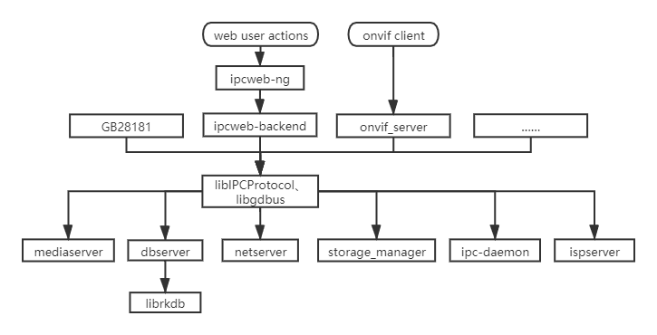
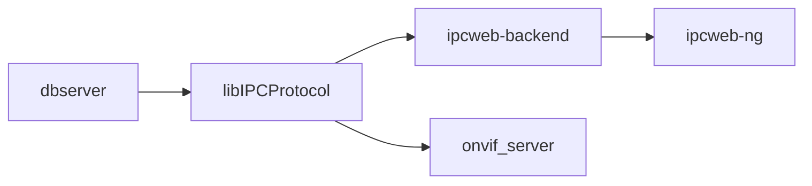

# Rockchip Linux Application Development

ID: RK-FB-YF-358

Release Version: V1.3.1

Release Date: 2020-10-15

Security Level: □Top-Secret   □Secret   □Internal   ■Public

**DISCLAIMER**

THIS DOCUMENT IS PROVIDED “AS IS”. ROCKCHIP ELECTRONICS CO., LTD.(“ROCKCHIP”)DOES NOT PROVIDE ANY WARRANTY OF ANY KIND, EXPRESSED, IMPLIED OR OTHERWISE, WITH RESPECT TO THE ACCURACY, RELIABILITY, COMPLETENESS,MERCHANTABILITY, FITNESS FOR ANY PARTICULAR PURPOSE OR NON-INFRINGEMENT OF ANY REPRESENTATION, INFORMATION AND CONTENT IN THIS DOCUMENT. THIS DOCUMENT IS FOR REFERENCE ONLY. THIS DOCUMENT MAY BE UPDATED OR CHANGED WITHOUT ANY NOTICE AT ANY TIME DUE TO THE UPGRADES OF THE PRODUCT OR ANY OTHER REASONS.

**Trademark Statement**

"Rockchip", "瑞芯微", "瑞芯" shall be Rockchip’s registered trademarks and owned by Rockchip. All the other trademarks or registered trademarks mentioned in this document shall be owned by their respective owners.

**All rights reserved. ©2020. Rockchip Electronics Co., Ltd.**

Beyond the scope of fair use, neither any entity nor individual shall extract, copy, or distribute this document in any form in whole or in part without the written approval of Rockchip.

Rockchip Electronics Co., Ltd.

No.18 Building, A District, No.89, software Boulevard Fuzhou, Fujian,PRC

Website:     [www.rock-chips.com](http://www.rock-chips.com)

Customer service Tel:  +86-4007-700-590

Customer service Fax:  +86-591-83951833

Customer service e-Mail:  [fae@rock-chips.com](mailto:fae@rock-chips.com)

---

**Preface**

**Overview**

This document presents basic introduction for Linux application development.

**Product Version**

| **Chipset** | **Kernel Version** |
| ----------- | ------------------ |
| RV1109      | Linux 4.19         |
| RK1806      | Linux 4.19         |

**Intended Audience**

This document (this guide) is mainly intended for:

Technical support engineers

Software development engineers

**Revision History**

| **Version** | **Author** | **Date**   | **Change Description**                                       |
| ----------- | ---------- | :--------- | ------------------------------------------------------------ |
| V1.0.0      | Fenrir Lin | 2020-04-28 | Initial version                                              |
| V1.1.0      | Fenrir Lin | 2020-06-04 | Add ispserver and onvif_server                               |
| V1.1.1      | CWW        | 2020-06-29 | Update RK_OEM build and pack command                         |
| V1.2.0      | Allen Chen | 2020-08-24 | Update ipcweb-ng                                             |
| V1.3.0      | Fenrir Lin | 2020-09-16 | Add dbserver external interface,<br/>update onvif_server development environment |
| V1.3.1      | Fenrir Lin | 2020-10-15 | Update file path                                             |

---

**Contents**

[TOC]

---

## Overview

### Applications

Applications are mainly located in the app directory of the SDK project, and the corresponding functions are as follows:

| Application Name | Module Function                              |
| ---------------- | -------------------------------------------- |
| ipcweb-ng        | web front-end project                        |
| ipcweb-backend   | web back-end project                         |
| ipc-daemon       | system management and guard the applications |
| storage_manager  | storage management                           |
| netserver        | internet service                             |
| mediaserver      | multimedia service                           |
| dbserver         | database service                             |
| ispserver        | image signal processing server               |
| onvif_server     | onvif protocol server                        |

### Libraries

The libraries are mainly located in the app directory of the SDK project, and take dbus inter-process communication mechanism. Mainly develop libIPCProtocol.

| Libraries Name | Main Functions                                               |
| -------------- | ------------------------------------------------------------ |
| libIPCProtocol | based on dbus, provides inter-process communication interface<br/>to call functions across processes. |
| librkdb        | based on sql, provides an interface to database operations.  |
| libgdbus       | provide dbus support.                                        |

### Application Framework

The Application framework is as follows:



Currently, the following two ways are supported:

1. According to the user's operation, the web front-end calls different interfaces of web back-end in these four ways: GET/PUT/POST/DELETE. In the web back-end, the functions provided by libIPCProtocol are used to communicate between processes through dbus to call the corresponding services.
2. The onvif client or NVR that supports onvif protocol, can call the interface of onvif_server directly, and use the functions provided by libIPCProtocol to call the corresponding service through onvif standard protocol.

In a specific service, operations will be done according to the incoming parameters, so that the user's operation will take effect.

In addition to the above two ways, other ways such as GB28181 protocol can also be added. This framework can be compatible with different applications and could be decoupled.

## Data Stream

Data stream is mainly HTTP protocol between web front-end and back-end and the communication data on dbus. both of them are JSON format.

### GET

Take getting the current network card information as an example. First of all, when web enters the configuration-network-basic settings, it will automatically refresh and send a request to the web back-end. The abstract is as follows:

```http
Request URL: http://{{IP address of the board}}/cgi-bin/entry.cgi/network/lan
Request Method: GET
```

After receiving this request, the web back-end will judge URL and Method information, call the netserver_get_networkip function provided by libIPCProtocol, and send the following message to the dbus (**can be monitored by dbus-monitor tool**):

```shell
method call time=1588045737.411643 sender=:1.371 -> destination=rockchip.netserver serial=2 path=/; interface=rockchip.netserver.server; member=GetNetworkIP
   string "eth0"
```

After receiving this message, netserver service obtains the current IP address of eth0 network card, and then replies via dbus.

```shell
method return time=1588045737.419339 sender=:1.4 -> destination=:1.371 serial=357 reply_serial=2
   string "[ { "link": { "sInterface": "eth0", "sAddress": "72:94:20:67:b4:b8", "iNicSpeed": 1000, "iDuplex": 1, "sDNS1": "10.10.10.188", "sDNS2": "58.22.96.66" }, "ipv4": { "sV4Address": "172.16.21.204", "sV4Netmask": "255.255.255.0", "sV4Gateway": "172.16.21.1" }, "dbconfig": { "sV4Method": "dhcp", "sV4Address": "", "sV4Netmask": "", "sV4Gateway": "", "sDNS1": "", "sDNS2": "" } } ]"
```

After web back-end processes the dbus message, it will send the following information to the web front-end via http, which is then displayed on the web interface.

```json
response:
{
	"ipv4": {
		"sV4Address": "172.16.21.204",
		"sV4Gateway": "172.16.21.1",
		"sV4Method": "dhcp",
		"sV4Netmask": "255.255.255.0"
	},
	"link": {
		"sAddress": "72:94:20:67:b4:b8",
		"sDNS1": "10.10.10.188",
		"sDNS2": "58.22.96.66",
		"sInterface": "eth0",
		"sNicType": "1000MD"
	}
}
```

### PUT

Take setting an IP address as an example, web front-end sends the following request:

```http
Request URL: http://172.16.21.204/cgi-bin/entry.cgi/network/lan
Request Method: PUT
Request Payload:
{
	"ipv4": {
		"sV4Address": "172.16.21.205",
		"sV4Gateway": "172.16.21.1",
		"sV4Method": "manual",
		"sV4Netmask": "255.255.255.0"
	},
	"link": {
		"sAddress": "72:94:20:67:b4:b8",
		"sInterface": "eth0",
		"sNicType": "1000MD",
		"sDNS1": "10.10.10.188",
		"sDNS2": "58.22.96.66"
	}
}
```

The web back-end calls the dbserver_network_ipv4_set function provided by libIPCProtocol to send the following message to dbus:

```shell
method call time=1588054078.249193 sender=:1.447 -> destination=rockchip.dbserver serial=3 path=/; interface=rockchip.dbserver.net; member=Cmd
   string "{ "table": "NetworkIP", "key": { "sInterface": "eth0" }, "data": { "sV4Method": "manual", "sV4Address": "172.16.21.205", "sV4Netmask": "255.255.255.0", "sV4Gateway": "172.16.21.1" }, "cmd": "Update" }"
```

The message is sent to rockchip.dbserver.net interface, which will update the data in the NetworkIP table in the database. At the same time, netserver will monitor the broadcast of this interface and set according to the IP address in the message.

Some interfaces of the web back-end will obtain the latest value again and return it to the front-end.

## ipcweb-ng

### Development Preparation

The web front-end takes Angular 8 framework.

**Development language:** Typescript, JavaScript, HTML5, SCSS

**Reference documents:**

[Angular Official Quick Started Tutorial](https://angular.io/start)
[TypeScript Chinese website](https://www.tslang.cn/)
[w3school](https://www.w3school.com.cn/)

**Code path:** app/ipcweb-ng

**Build command:**

```shell
# The development environment needs to be installed for the first use, see 3.2 Development Environment
# In app/ipcweb-ng directory
ng build --prod
# Move the compiled files in the app/ipcweb-ng/dist directory to the app/ipcweb-backend/www path. After this operation, the www will be copied while compiling ipcweb-backend
# In SDK root directory
make ipcweb-backend-rebuild # Recompile the back-end file and copy www to the corresponding path according to the configuration
make rk_oem-dirclean && make rk_oem target-finalize # rebuild oem
./mkfirmware.sh # pack oem.img, and then flash again
```

**Common compilation conflicts:**

```shell
# The error message is as follows, for the type definition conflict
ERROR in ./src/app/shared/player/download.worker.ts (./node_modules/worker-plugin/dist/loader.js?{"name":"0"}!./src/app/shared/player/download.worker.ts)
Module build failed (from ./node_modules/worker-plugin/dist/loader.js):
# You should modify node_modules\@types\emscripten\index.d.ts as following
# conflict
declare function addFunction(func: () => any, signature?: string): number;
# modify
declare function addFunction(func: Function, signature?: string): number;

# The error message is as follows, which is an alias conflict
Type alias 'PluginConfig' circularly reference
Type alias 'ProtractorPlugin' circularly reference
# You should modify node_modules\protractor\built\index.d.ts as following
# conflict
import { PluginConfig, ProtractorPlugin } from './plugins';
export declare type PluginConfig = PluginConfig;
export declare type ProtractorPlugin = ProtractorPlugin;
# modify
import { PluginConfig as PluginCfg, ProtractorPlugin as ProtractorPlu} from './plugins';
export declare type PluginConfig = PluginCfg;
export declare type ProtractorPlugin = ProtractorPlu;
```

### Development Environment

```shell
# Ubuntu
sudo apt update
sudo apt install nodejs
sudo apt install npm
sudo npm install -g n # Install n module
sudo n stable # Upgrade with n module
npm npm --version # Confirm the npm version
sudo npm install -g @angular/cli # Install Angular command line tool
# in app/ipcweb-ng
sudo npm install # Install Angular and related dependencies

# Windows
# view https://nodejs.org/en/download/ to download nodejs
# Check whether the npm&node installation is successful, if it fails, go to the official website to download the latest version and install it
npm --version
node --version
npm install -g @angular/cli # Install Angular command line tool
# in pcweb-ng
npm install # Install Angular and related dependencies
```

### Online Debug

Start webpack development service:

```shell
ng serve
```

If successful, you will see the following log:

```shell
** Angular Live Development Server is listening on 0.0.0.0:4200, open your browser on http://localhost:4200/ **
```

Then use chrome browser to visit <http://localhost:4200/> to debug online.

You can also build with`ng build --prod` command , and the files generated in the dist directory need to be pushed to the board and replace the files under /oem/www. If the browser access page is not updated, you need to clear the browser pictures and files cache.

### Code Framework

```shell
src/
├── app
│ ├── about # About page and project description
│ ├── app.component.html # Application main entrance
│ ├── app.component.scss # scss style file
│ ├── app.component.spec.ts # Test spec file
│ ├── app.component.ts # APP components
│ ├── app.module.ts # APP module
│ ├── app-routing.module.ts # Master routing
│ ├── auth # Authentication module, including login page, user authentication
│ ├── config # Configuration module, including all configuration subcomponents
│ ├── config.service.spec.ts # Configure module test spec files
│ ├── config.service.ts # Configure module services for communication with  devices and communication between modules
│ ├── footer # The footer module, copyright notice
│ ├── header # The header modules, navigation routing, user login/logout
│ ├── preview # Preview module, stream player of the main page
│ ├── download # Video/screenshot download module, query and download of video/screenshot
│ ├── face # Face module, total face module, including parameters and management functions
│ ├── face-manage # Management module, face recognition registration and face recognition record management functions
│ ├── face-para # Face parameter configuration module
│ ├── shared # Share resource
│ │ ├── func-service # General services and functions
│ │ ├── player # Player module, player function module
│ │ └── validators # Angular validators functions
│ └── tip #Tip Box Management Module
├── assets
│ ├── css # Style
│ ├── i18n # Multilingual translation
│ ├── images # Icon
│ └── json # Json database file for debugging
├── environments # Angular released environment configuration
│ ├── environment.prod.ts
│ └── environment.ts
├── favicon.ico # Icon
├── index.html # Project entrance
├── main.ts # Project entrance
├── polyfills.ts
├── styles.scss # Total style profile of the project
└── test.ts
```

Detailed modules are located in src/app/config.

```shell
$ tree -L 2 src/app/config
├── config-audio # Audio configuration
├── config.component.html # Main page of config component
├── config.component.scss # Main page style
├── config.component.spec.ts
├── config.component.ts # config component
├── config-event # Event configuration
├── config-image # ISP/OSD image configuration
├── config-intel # Intelligent analysis configuration
├── config.module.ts # Module configuration
├── config-network # Network configuration
├── config-routing.module.ts # Configure module subrouting
├── config-storage # Storage configuration
├── config-system # System Configuration
├── config-video # Video encoding configuration
├── MenuGroup.ts # Menu data
├── NetworkInterface.ts # Network interface data
├── peripherals # Peripheral expansion module
└── shared # Some shared sub-modules can be reused to facilitate further adjustment of the main module
    ├── abnormal
    ├── advanced-encoder
    ├── alarm-input
    ├── alarm-output
    ├── cloud
    ├── ddns
    ├── email
    ├── encoder-param
    ├── ftp
    ├── gate-config
    ├── hard-disk-management
    ├── info
    ├── intrusion-detection
    ├── intrusion-region
    ├── isp
    ├── motion-arming
    ├── motion-detect
    ├── motion-linkage
    ├── motion-region
    ├── ntp
    ├── osd
    ├── overlay-snap
    ├── picture-mask
    ├── port
    ├── pppoe
    ├── privacy-mask
    ├── protocol
    ├── region-crop
    ├── roi
    ├── screen-config
    ├── screenshot
    ├── smtp
    ├── tcpip
    ├── time-table
    ├── upgrade
    ├── upnp
    ├── user-manage
    └── wifi
```

## ipcweb-backend

### Development Preparation

The web back-end takes nginx+fastcgi, and debugs by curl and postman, or directly debugs with the web front-end.

**Development language:** C++

**reference documents:**

[HTPP Protocol Knowledge](https://www.w3schools.com/tags/ref_httpmethods.asp)
[RESTful API Specification](https://google.github.io/styleguide/jsoncstyleguide.xml)
[Nginx + CGI/FastCGI + C/Cpp](https://www.cnblogs.com/skynet/p/4173450.html)
[POSTMAN](https://www.postman.com/)

**Code path:** app/ipcweb-backend

**Build command:**

```shell
#In the SDK root directory
make ipcweb-backend-dirclean && make ipcweb-backend
make rk_oem-dirclean && make rk_oem target-finalize #Rebuild oem
./mkfirmware.sh #Pack oem.img, and then flash
```

**Configuration files：**

The nginx configuration file is located in buildroot/board/rockchip/rv1126_rv1109/fs-overlay/etc/nginx/nginx.conf, part of the summary is as follows:

```nginx
location /cgi-bin/ {
	gzip off;
	# Web root directory
	root /oem/www;
	fastcgi_pass unix:/run/fcgiwrap.sock;
	fastcgi_index entry.cgi;
	fastcgi_param DOCUMENT_ROOT /oem/www/cgi-bin;
	# The only entry to the CGI application
	fastcgi_param SCRIPT_NAME /entry.cgi;
	include fastcgi_params;

	# Solve the PATH_INFO variable problem
	set $path_info "";
	set $real_script_name $fastcgi_script_name;
	if ($fastcgi_script_name ~ "^(.+?\.cgi)(/.+)$") {
		set $real_script_name $1;
		set $path_info $2;
	}
	fastcgi_param PATH_INFO $path_info;
	fastcgi_param SCRIPT_FILENAME $document_root$real_script_name;
	fastcgi_param SCRIPT_NAME $real_script_name;
}
```

### Building Environment

Please build `make ipcweb-backend` in the SDK root directory, or use the following command to build.

```shell
mkdir build && cd build
[Optional] The project takes Google Test as a testing framework. Initialize googletest submodule to use it.
  git submodule init
  git submodule update

cmake .. -DCMAKE_TOOLCHAIN_FILE=<path_of_sdk_root>/buildroot/output/rockchip_puma/host/share/buildroot/toolchain .cmake

make
```

### Debug Environment

1. Push the built entry.cgi file to the /oem/www/cgi-bin/ directory of the device, and ensure that the permissions and user groups of entry.cgi file are as follows:

```shell
-rwxr-xr-x 1 www-data www-data 235832 Apr 26 20:51 entry.cgi
```

2. Ensure that nginx service on the device has been started, which can be checked by ps command.

```shell
538 root     12772 S    nginx: master process /usr/sbin/nginx
539 www-data 13076 S    nginx: worker process
```

3. Use ifconfig -a command to obtain the IP address of the device.
4. Use curl command to debug, the example is as follows:

```shell
$ curl -X GET http://172.16.21.217/cgi-bin/entry.cgi/network/lan
{"ipv4":{"sV4Address":"172.16.21.217","sV4Gateway":"172.16.21.1","sV4Method":"dhcp","sV4Netmask":"255.255.255.0"},"link":{"sAddress":"84:c2:e4:1b:66:d8","sDNS1":"10.10.10.188","sDNS2":"58.22.96.66","sInterface":"eth0","sNicType":"10MD"}}
```

5. Since CGI cannot use the standard output stream, the log is saved in the following path.

```shell
$ cat /var/log/messages
# Debug log output to syslog
$ cat /var/log/nginx/error.log
# Web server error log
$ cat /var/log/nginx/access.log
# Web server access log
```

## ipc-daemon

### Development Preparation

A system daemon, provide system maintenance services, initialize and ensure the operation of dbserver/netserver/storage_manager/mediaserver.

**Development language:** C

**Code path:**  app/ipc-daemon

**Build command:** in the SDK root directory, `make ipc-daemon-dirclean && make ipc-daemon`

### External Interface

The following interfaces are located in: app/libIPCProtocol/system_manager.h.

| Function name        | Functions                  |
| -------------------- | -------------------------- |
| system_reboot        | System restart             |
| system_factory_reset | Reset the factory settings |
| system_export_db     | Export database            |
| system_import_db     | Import database            |
| system_export_log    | Export debug logs          |
| system_upgrade       | OTA firmware upgrade       |

## storage_manager

### Development Preparation

A storage management service, providing file query, hard drive management, video snapshot, quota and other functions.

**Development language:** C

**Code path:** app/storage_manager

**Build command:**  in the SDK root directory, `make storage_manager-dirclean && make storage_manager`

### External Interface

The following interface is located in app/libIPCProtocol/storage_manager.h.

| Function name                     | Functions                       |
| --------------------------------- | ------------------------------- |
| storage_manager_get_disks_status  | Get hard drive status           |
| storage_manager_get_filelist_id   | Get file list by ID             |
| storage_manager_get_filelist_path | Get file list by path           |
| storage_manager_get_media_path    | Get media file path information |
| storage_manager_diskformat        | Hard drive format               |

## netserver

### Development Preparation

A network service, providing functions such as obtaining network information, scanning Wi-Fi, and configuring networks.

**Development language:** C

**Code path:** app/netserver

**Build command:**  in the SDK root directory, `make netserver-dirclean && make netserver`

### External Interface

The following interfaces are in the app/libIPCProtocol/netserver.h.

| Function name   | Functions             |
| ----------------------- | ----------------------------- |
| netserver_scan_wifi     | Scan Wi-Fi            |
| netserver_get_service   | Get Wi-Fi or Ethernet service information |
| netserver_get_config    | Get configuration information corresponding to service |
| netserver_get_networkip | Get network card information of eth0 or wlan0 |

## dbserver

### Development Preparation

A database service, initializes the database and provides related operation interfaces to the database.

**Development language:** C

**Code path:** app/dbserver

**Build command:**  in the SDK root directory,  `make dbserver-dirclean && make dbserver`

### External Interface

The interfaces are located in app/libIPCProtocol/dbserver.h, which are mainly used to select, update, delete and other operations on different tables of the database.

#### Storage configuration interface

| Function name                             | Functions                 |
| ----------------------------------------- | ------------------------- |
| dbserver_update_storage_media_folder_duty | Update media folder duty  |
| dbserver_update_storage_config_mountpath  | Update mount path         |
| dbserver_update_storage_config_freesize   | Update storage free size  |
| dbserver_get_storage_disk_path            | Get disk path             |
| dbserver_get_storage_media_folder         | Get media folder path     |
| dbserver_get_storage_config               | Get storage configuration |
| dbserver_get_storage_plan_snap            | Get snap plan             |
| dbserver_set_storage_plan_snap            | Set snap plan             |
| dbserver_storage_snap_plan_parse          | Parse snap plan           |
| dbserver_storage_video_plan_parse         | Parse video plan          |
| dbserver_storage_get                      | Get storage table         |
| dbserver_storage_set                      | Set storage table         |

#### Network configuration interface

| Function name                        | Functions                              |
| ------------------------------------ | -------------------------------------- |
| dbserver_network_power_get           | Get network power status               |
| dbserver_network_ipv4_set            | Set IPv4 Configuration                 |
| dbserver_network_dns_set             | Set DNS Configuration                  |
| dbserver_network_nicspeed_set        | Set network interface controller speed |
| dbserver_network_ip_gets             | Get IP                                 |
| dbserver_network_service_delete      | Delete Wi-Fi                           |
| dbserver_network_service_connect_set | Connect Wi-Fi                          |
| dbserver_network_service_get         | get Wi-Fi configuration                |
| dbserver_network_power_set           | Set network power                      |
| dbserver_wifi_power_set              | Set Wi-Fi power                        |
| dbserver_ethernet_power_set          | Set ether net power                    |
| dbserver_wifi_power_get              | Get Wi-Fi power status                 |
| dbserver_ethernet_power_get          | Get ether net power status             |
| dbserver_ntp_set                     | Set NTP                                |
| dbserver_ntp_get                     | Get NTP configuration                  |
| dbserver_zone_get                    | Get time zone configuration            |
| dbserver_port_set                    | Set port                               |
| dbserver_port_get                    | Get port configuration                 |

#### Media configuration interface

| Function name                  | Functions                                       |
| ------------------------------ | ----------------------------------------------- |
| dbserver_media_set             | Set media table                                 |
| dbserver_media_set_by_token    | Set media table by token                        |
| dbserver_media_del_by_token    | Delete media table by token                     |
| dbserver_media_get             | Get media table                                 |
| dbserver_media_get_by_id       | Get media table by id                           |
| dbserver_osd_get               | Get OSD configuration                           |
| dbserver_audio_set             | Set audio                                       |
| dbserver_audio_get             | Get audio configuration                         |
| dbserver_video_set             | Set video                                       |
| dbserver_video_get             | Get video configuration                         |
| dbserver_video_region_clip_set | Set video region clip                           |
| dbserver_video_region_clip_get | Get video region clip configuration             |
| dbserver_stream_url_set        | Set stream URL                                  |
| dbserver_stream_url_get        | Get stream URL                                  |
| dbserver_media_profile_get     | Get media profile                               |
| dbserver_media_get_by_key_char | Get media table by the primary key of char type |
| dbserver_video_source_cfg_get  | Get video source configuration                  |
| dbserver_video_source_get      | Get video source                                |
| dbserver_video_enc_cfg_get     | Get video encode configuration                  |

#### System configuration interface

| Function name                     | Functions                                           |
| --------------------------------- | --------------------------------------------------- |
| dbserver_system_set               | Set system table                                    |
| dbserver_system_get               | Get system table                                    |
| dbserver_system_get_by_key_char   | Set system table by the primary key of char type    |
| dbserver_system_para_get_by_name  | Get system parameter by name                        |
| dbserver_system_para_set_by_name  | Set system parameter by name                        |
| dbserver_set_static_cap_option    | Set static capability options                       |
| dbserver_set_dynamic_cap_option   | Set dynamic capability options                      |
| dbserver_set_static_cap_range     | Set static capability range                         |
| dbserver_set_dynamic_cap_range    | Set dynamic capability range                        |
| dbserver_system_user_delete       | Delete user by id                                   |
| dbserver_system_user_add          | Add user by id                                      |
| dbserver_system_user_del_username | Delete user by user name                            |
| dbserver_system_user_set          | Set user information                                |
| dbserver_system_user_get          | Get user information                                |
| dbserver_system_user_num_get      | Get the number of users                             |
| dbserver_scopes_add               | Add Scopes                                          |
| dbserver_system_del_by_key_char   | Delete system table by the primary key of char type |
| dbserver_system_del_by_key_int    | Delete system table by the primary key of int type  |

#### Event configuration interface

| Function name                       | Functions                                                    |
| ----------------------------------- | ------------------------------------------------------------ |
| dbserver_event_set                  | Set event table                                              |
| dbserver_event_set_by_char_key      | Set event table by the primary key of char type              |
| dbserver_event_get                  | Get event table                                              |
| dbserver_event_get_by_id            | Get event table by id                                        |
| dbserver_event_get_by_key_int       | Get event table by the primary key of int type               |
| dbserver_event_get_by_key_char      | Get event table by the primary key of char type              |
| dbserver_event_delete_by_key_int    | Delete event table by the primary key of int type            |
| dbserver_event_delete_by_key_char   | Delete event table by the primary key of char type           |
| dbserver_face_list_add              | Add face to the face list                                    |
| dbserver_face_load_complete         | Write facial feature value recognition result                |
| dbserver_face_load_complete_by_path | Write facial feature value recognition result through image path |
| dbserver_face_list_delete           | Delete face from the face list                               |
| dbserver_snapshot_record_set        | Add snapshot record                                          |
| dbserver_face_reset                 | Delete all people                                            |
| dbserver_control_record_set         | Add control record                                           |
| dbserver_event_schedules_parse      | Parse event schedules                                        |
| dbserver_event_triggers_parse       | Parse event triggers                                         |

#### Peripherals configuration interface

| Function name            | Functions             |
| ------------------------ | --------------------- |
| dbserver_peripherals_set | Set peripherals table |
| dbserver_peripherals_get | Get peripherals table |

#### Basic database configuration interface

| Function name         | Functions                          |
| --------------------- | ---------------------------------- |
| dbserver_select       | Select database                    |
| dbserver_update       | Update database                    |
| dbserver_delete       | Delete database                    |
| dbserver_sql          | Use SQL to manipulate the database |
| dbserver_drop_table   | Drop table                         |
| dbserver_create_table | Create table                       |

### Debug Environment

After modifying the code and rebuilding, the device needs  following operations:

```shell
killall dbserver
rm /data/sysconfig.db
#Push the newly built dbserver to replace it
dbserver&
```

Please use the following commands to send dbus messages to query whether the data is normal.

```shell
# dbus-send --system --print-reply --dest=rockchip.dbserver / rockchip.dbserver.net.Cmd \
> string:"{ \"table\": \"ntp\", \"key\": { }, \"data\": \"*\", \"cmd\": \"Select\" }"

method return time=1588123823.096268 sender=:1.5 -> destination=:1.6 serial=7 reply_serial=2
   string "{ "iReturn": 0, "sErrMsg": "", "jData": [ { "id": 0, "sNtpServers": "122.224.9.29 94.130.49.186", "sTimeZone": "posix\/Etc\/GMT-8", "iAutoMode": 1, "iRefreshTime": 60 } ] }"
```

## mediaserver

### Development Preparation

Provides the main application of multimedia services, please refer to "docs/RV1126_RV1109/ApplicationNote/Rockchip_Instructions_Linux_MediaServer_EN.pdf" for details.

**Development language:** C++

**Code path:** app/mediaserver

**Build command:**  in the SDK root directory, `make mediaserver-dirclean && make mediaserver`

## libIPCProtocol

### Development Preparation

Provides a functional interface for inter-process communication based on dbus.

**Development language:** C

**Code path:** app/LibIPCProtocol

**Build command:**  in the SDK root directory, `make libIPCProtocol-dirclean && make libIPCProtocol`

### External Interface

The interfaces are packages for dbus communication, and the external interfaces of each service are provided in this library.
The core is calling methods of other applications through dbus, but there are two main interaction ways:

The first way: call the method of dbserver through dbus, write data into the database, and broadcast it at the same time. Applications that care about this parameter can do real-time processing through monitoring.

Advantages: when there are multiple applications that care about the same parameter, it is not necessary to call the interface of multiple applications, but let the applications process through monitoring by themselves. And the state is saved in the database, the application can call the function with the end of _get to read the data to initialize.

Disadvantages: the application needs to increase the monitoring part of dbus.

The sample is as follows:

```c
char *dbserver_media_get(char *table);
/*
 * Assign database table name，char *table = "audio"
 * The return value is formatted as follows
 */
{
    "iReturn": 0,
    "sErrMsg": "",
    "jData": [
        {
            "id": 0,
            "sEncodeType": "AAC",
            "iSampleRate": 16000,
            "iBitRate": 32000,
            "sInput": "micIn",
            "iVolume": 50,
            "sANS": "close"
        } ]
}

char *dbserver_media_set(char *table, char *json, int id);
/*
 * Assign database table name，char *table = "audio"。
 * Assign database table index，id = 0。
 * Assign data，char *json = "{\"iVolume\":50}"，Multiple parameters can be transmitted at the same time, as long as these parameters are in this table.
 * Other applications that monitor data changes in this table will receive the following dbus messages
 */
{
    "table": "audio",
    "key": {
        "id": 0
    },
    "data": {
        "iVolume": 50
    },
    "cmd": "Update"
}
```

The second way: directly call the specific application method remotely through dbus, most of them are operations that do not need to save the state in the database. Such as taking pictures, hard drive formatting, system restart, etc.

Advantages: applications do not need to monitor, just provide a remote call interface, and reduce the amount of code.

Disadvantages: The state of operations cannot be saved. If a parameter involves multiple applications, multiple functions need to be call while modifying the parameter.

Take the system restart as an example, call the Reboot method of the rockchip.system.server interface remotely through dbus related function. After the application of the corresponding interface receives the message, it will execute the function corresponding to this method. The core code is as follows:

```c
#define SYSTEM_MANAGER "rockchip.system"
#define SYSTEM_MANAGER_PATH "/"
#define SYSTEM_MANAGER_INTERFACE SYSTEM_MANAGER ".server"

dbus_method_call(userdata->connection,
                     SYSTEM_MANAGER, SYSTEM_MANAGER_PATH,
                     SYSTEM_MANAGER_INTERFACE, "Reboot",
                     populate_get, userdata, NULL, NULL);
```

### Notices

1. Because the length of the returned string is not fixed, some functions apply for memory dynamically, pay attention to memory free problem.
2. Mediaserver has no monitoring parameter changes currently, so in addition to writing audio and video related parameters, you need to call the interface provided by mediaserver.h for configuration.

## ispserver

### Development Preparation

For detailed development about image signal processing server, please refer to "docs/RV1126_RV1109/Camera/Rockchip_RV1109_RV1126_Developer_Guide_Linux_Ispserver_CN.pdf"

**Development language:** C

**Code path:** external/isp2-ipc

**Build command:**  in the SDK root directory, `make isp2-ipc-dirclean && make isp2-ipc`

## onvif_server

### Development Preparation

onvif protocol server.

**Development language:** C

**Reference documents:**

[WSDL Tutorial](https://www.w3school.com.cn/wsdl/index.asp)

[SOAP Tutorial](https://www.w3school.com.cn/soap/index.asp)

[Web Services Tutorial](https://www.w3school.com.cn/webservices/index.asp)

[onvif specification](https://www.onvif.org/profiles/)

**Code path:** app/onvif_server

**Build command:**  in the SDK root directory, `make onvif_server-dirclean && make onvif_server`

### Development Environment

1. Download gSOAP toolkit, build and install it.

2. Confirm the required wsdl file according to the requirements of each profile on the onvif official website. The typemap.dat file is located in the gsoap folder in the unzipped directory of the gSOAP toolkit. In order to recognize the event notification, you need to add the following content at the end of typemap.dat:

```c
_wsnt__NotificationMessageHolderType_Message = $ struct _tt__Message* tt__Message;
```

3. Convert wsdl file to pure C style header file onvif.h by wsdl2h tool.

```shell
wsdl2h -P -x -c -s -t typemap.dat -o onvif.h http://www.onvif.org/onvif/ver10/network/wsdl/remotediscovery.wsdl http://www.onvif.org/onvif/ver20/analytics/wsdl/analytics.wsdl http://www.onvif.org/onvif/ver10/analyticsdevice.wsdl http://www.onvif.org/onvif/ver10/media/wsdl/media.wsdl http://www.onvif.org/onvif/ver20/media/wsdl/media.wsdl http://www.onvif.org/onvif/ver10/deviceio.wsdl http://www.onvif.org/onvif/ver10/display.wsdl http://www.onvif.org/onvif/ver20/imaging/wsdl/imaging.wsdl http://www.onvif.org/onvif/ver10/recording.wsdl http://www.onvif.org/onvif/ver10/replay.wsdl http://www.onvif.org/onvif/ver10/search.wsdl http://www.onvif.org/onvif/ver10/receiver.wsdl http://www.onvif.org/onvif/ver20/ptz/wsdl/ptz.wsdl
```

4. In onvif.h, add `#import“ wsse.h”`, and modify `tev__StringAttrList` to `tt__StringAttrList`.

5. In wsa5.h, modify `SOAP_ENV__Fault` to `SOAP_ENV__Fault_alex`.

6. Generate the .h and .c files needed for server development with the onvif.h header file by soapcpp2 tool.

```shell
soapcpp2 -s -2 onvif.h -x -I import/ -I .
```

7. Select the required parts and move to the app/onvif_server directory, taking care not to overwrite the implemented functions.

8. Implement the functions in server_operation.c according to the detailed needs. The structures of input parameters and output parameters have been defined in soapStub.h in details, which can be filled in according to the specifications.

### Debug Environment

1. Make sure that the device running onvif_server is on the same local area network as the NVR or PC that needs to be connected.
2. Run discovering device on the NVR, or run ONVIF Device Manager, ONVIF Device Test Tool or other tools on the personal computer to discover the device, and then debug.
3. When debugging specific functions, you can judge whether the corresponding function is called by the printed log.
4. If you use ONVIF Device Test Tool or other packet capture tools, you will see the following data flow.

Request:

```xml
<?xml version="1.0" encoding="utf-8"?>
<soap:Envelope xmlns:soap="http://www.w3.org/2003/05/soap-envelope" xmlns:tds="http://www.onvif.org/ver10/device/wsdl" xmlns:tt="http://www.onvif.org/ver10/schema">
  <soap:Body>
    <tds:GetDNS />
  </soap:Body>
</soap:Envelope>
```

Response:

```xml
HTTP/1.1 200 OK
Server: gSOAP/2.8
X-Frame-Options: SAMEORIGIN
Content-Type: application/soap+xml; charset=utf-8
Content-Length: 2109
Connection: close


<?xml version="1.0" encoding="UTF-8"?>
<SOAP-ENV:Envelope
    xmlns:SOAP-ENV="http://www.w3.org/2003/05/soap-envelope"
    xmlns:SOAP-ENC="http://www.w3.org/2003/05/soap-encoding"
    xmlns:xsi="http://www.w3.org/2001/XMLSchema-instance"
    xmlns:xsd="http://www.w3.org/2001/XMLSchema"
    xmlns:wsa="http://schemas.xmlsoap.org/ws/2004/08/addressing"
    xmlns:wsdd="http://schemas.xmlsoap.org/ws/2005/04/discovery"
    xmlns:chan="http://schemas.microsoft.com/ws/2005/02/duplex"
    xmlns:wsa5="http://www.w3.org/2005/08/addressing"
    xmlns:xmime="http://tempuri.org/xmime.xsd"
    xmlns:xop="http://www.w3.org/2004/08/xop/include"
    xmlns:ns1="http://www.onvif.org/ver20/analytics/humanface"
    xmlns:ns2="http://www.onvif.org/ver20/analytics/humanbody"
    xmlns:tt="http://www.onvif.org/ver10/schema"
    xmlns:wsrfbf="http://docs.oasis-open.org/wsrf/bf-2"
    xmlns:wstop="http://docs.oasis-open.org/wsn/t-1"
    xmlns:wsrfr="http://docs.oasis-open.org/wsrf/r-2"
    xmlns:ns3="http://www.onvif.org/ver20/media/wsdl"
    xmlns:tad="http://www.onvif.org/ver10/analyticsdevice/wsdl"
    xmlns:tan="http://www.onvif.org/ver20/analytics/wsdl"
    xmlns:tdn="http://www.onvif.org/ver10/network/wsdl"
    xmlns:tds="http://www.onvif.org/ver10/device/wsdl"
    xmlns:tev="http://www.onvif.org/ver10/events/wsdl"
    xmlns:wsnt="http://docs.oasis-open.org/wsn/b-2"
    xmlns:timg="http://www.onvif.org/ver20/imaging/wsdl"
    xmlns:tls="http://www.onvif.org/ver10/display/wsdl"
    xmlns:tmd="http://www.onvif.org/ver10/deviceIO/wsdl"
    xmlns:tptz="http://www.onvif.org/ver20/ptz/wsdl"
    xmlns:trc="http://www.onvif.org/ver10/recording/wsdl"
    xmlns:trp="http://www.onvif.org/ver10/replay/wsdl"
    xmlns:trt="http://www.onvif.org/ver10/media/wsdl"
    xmlns:trv="http://www.onvif.org/ver10/receiver/wsdl"
    xmlns:tse="http://www.onvif.org/ver10/search/wsdl">
    <SOAP-ENV:Body>
        <tds:GetDNSResponse>
            <tds:DNSInformation>
                <tt:FromDHCP>true</tt:FromDHCP>
                <tt:DNSFromDHCP>
                    <tt:Type>IPv4</tt:Type>
                    <tt:IPv4Address>10.10.10.188</tt:IPv4Address>
                </tt:DNSFromDHCP>
                <tt:DNSFromDHCP>
                    <tt:Type>IPv4</tt:Type>
                    <tt:IPv4Address>58.22.96.66</tt:IPv4Address>
                </tt:DNSFromDHCP>
            </tds:DNSInformation>
        </tds:GetDNSResponse>
    </SOAP-ENV:Body>
</SOAP-ENV:Envelope>
```

### Notices

1. All pointers need to call soap_malloc directly or indirectly to apply for memory.
2. After the structure applies for memory, don't forget to call the function at the beginning of soap_default_tt__ to assign a default value, or manually assign a value or NULL to each member. Otherwise, although build successfully and there is no error within the function, but when checking the response structure, it will directly exit and it is difficult to troubleshoot.

## Application Framework Development Process

**From database to web application development, the bottom-up development process is as follows:**



1. dbserver: build tables and initialize data.
2. libIPCProtocol: package the function of reading and writing to this table. For debugging, you can refer to the code in the demo path to write a test program, or you can use the dbus-monitor tool to monitor dbus. When testing, push the built libIPCProtocol.so and the test program to the device.
3. ipcweb-backend: call the packaged function under the corresponding ApiHandler. Use curl or postman test to get/put  URL normally. During the test, push the entry.cgi generated from building to the device.
4. ipcweb-ng: develop the corresponding interface and registration callback to ensure that the web front-end can read and write the database normally. During the test, you can directly specify the IP address in the URL as the device's IP address on the PC for debugging, or you can push the built folder to the device and directly access the device's IP address for debugging.
5. onvif_server: package interface functions conforming to onvif protocol specification for other client devices conforming to the onvif protocol to call.

**Specific applications can be developed in parallel after the completion of the second step above. If you do not need to save the states of operations, you can skip the first step.**

There are two ways for applications to obtain configuration information actively, one is to read the configuration of the database, and the other is to monitor to the corresponding dbus interface.

The former way is usually used for initialization, and can be initialized by reading the database configuration after restarting.

The latter way is usually used for real-time configuration, when the commands on the web side are converted to messages on dbus , they can be broadcast one-to-many. While writing to the database to save the configuration, you can also configure the service that monitor this message in real time.

Applications can also provide an interface for dbus remote calling, which is called by the application without actively acquiring configuration information.

