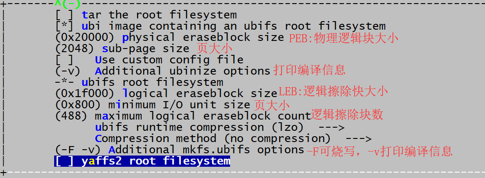

# Nand Flash Open Source Solution 开发指南

文件标识：RK-KF-YF-314

发布版本：V2.1.1

日期：2021-02-22

文件密级：□绝密   □秘密   □内部资料   ■公开

**免责声明**

本文档按“现状”提供，瑞芯微电子股份有限公司（“本公司”，下同）不对本文档的任何陈述、信息和内容的准确性、可靠性、完整性、适销性、特定目的性和非侵权性提供任何明示或暗示的声明或保证。本文档仅作为使用指导的参考。

由于产品版本升级或其他原因，本文档将可能在未经任何通知的情况下，不定期进行更新或修改。

**商标声明**

“Rockchip”、“瑞芯微”、“瑞芯”均为本公司的注册商标，归本公司所有。

本文档可能提及的其他所有注册商标或商标，由其各自拥有者所有。

**版权所有 © 2021 瑞芯微电子股份有限公司**

超越合理使用范畴，非经本公司书面许可，任何单位和个人不得擅自摘抄、复制本文档内容的部分或全部，并不得以任何形式传播。

瑞芯微电子股份有限公司

Rockchip Electronics Co., Ltd.

地址：     福建省福州市铜盘路软件园A区18号

网址：     [www.rock-chips.com](http://www.rock-chips.com)

客户服务电话： +86-4007-700-590

客户服务传真： +86-591-83951833

客户服务邮箱： [fae@rock-chips.com](mailto:fae@rock-chips.com)

---

**前言**

**概述**

Rockchip SDK默认采用闭源的miniloader 加载 trust 和 u-boot，所有存储设备（eMMc NAND/NOR Flash）都以block接口访问，对于想通过MTD 接口访问NAND / NOR Flash的开发者，Rockchip 提供了开源的SPL来加载trust和u-boot，并且在 u-boot中通过MTD接口访问NAND/NOR Fash 。

**产品版本**

| **芯片名称**    | **内核版本**         |
| --------------- | :------------------- |
| RK3308          | Linux 4.4, Linux4.19 |
| RV1126 & RV1109 | Linux 4.19           |

**读者对象**

本文档（本指南）主要适用于以下工程师：

技术支持工程师

软件开发工程师

**修订记录**

| **版本号** | **作者** | **修改日期** | **修改说明** |
| ---------- | --------| :--------- | ------------ |
| V1.0.0   | HKH        | 2019-06-20 | 初始版本               |
| V1.0.1   | HKH        | 2019-11-11 | 增加sd卡升级说明       |
| V1.0.2   | Ruby Zhang | 2020-07-08 | 格式修订               |
| V1.1.0   | Jair Wu    | 2020-07-10 | 新增u-boot编译说明     |
| V2.0.0   | Jon Lin    | 2020-10-19 | 完善驱动配置等详细信息 |
| V2.0.1 | Jon Lin | 2020-11-27 | 增加 UBIFS 多卷支持、增减 ubiattach 参数说明 |
| V2.1.0 | Jon Lin | 2021-01-27 | 添加更多 UBIFS 支持说明 |
| V2.1.1 | CWW | 2021-02-22 | 格式修订 |

---

**目录**

[TOC]

---

## 开源方案须知

### 开源方案特性

确认以下开源实现方案特性:

| 简称                           | 主要支持的颗粒类型 | 注册设备类型       | 主要支持文件系统 | 支持的烧录方式                  |
| ------------------------------ | ------------------ | ------------------ | ---------------- | ------------------------------- |
| SLC Nand 开源方案（并口 Nand） | SLC Nand           | mtd 设备、ubiblock | SquashFS、UBIFS  | USB 升级、SD 卡升级、烧录器升级 |
| SPI Nand 开源方案              | SPI Nand           | mtd 设备、ubiblock | SquashFS、UBIFS  | USB 升级、SD 卡升级、烧录器升级 |

主要确认：

* 选用的颗粒类型
* 文件系统是否符合需求

### Nand Flash 信息

在制作 UBIFS 镜像、IDB 镜像（Pre loader）时需要通过存储颗粒手册来确认 Nand flash 相关信息，并根据选择镜像制作参数，主要包括以下：

* page size，SLC Nand 通常为 2KB 或 4KB page size；
* page per block，SLC Nand 通常为 64 或 128；
* block size = page_size * page_per_block，SLC Nand 通常为 128KB，256KB；
* oob size，SLC Nand 通常为 64B，128B 或 256B。

在以下操作时，默认通常为 2KB page size，128KB block size 配置，如用其他颗粒，应做相应调整：

* 制作烧录器镜像
* 制作使用 UBIFS 文件系统的镜像；

可以通过通过查看颗粒手册来确认 flash 信息。


### 其余关键信息

UBIFS 在使用过程中有以下要求需要提交了解：

* UBIFS 镜像无法兼容 page size 或 block size 不一样的两种物料，所以物料选型要慎重。
* 文档中 SLC Nand 指并口 nand

## 存储软件驱动配置

### SPL & U-Boot

| 简称              | 主要支持的颗粒类型 | 主控驱动              | flash 框架            | 注册设备类型 | 主要支持文件系统 | 支持的烧录方式                  |
| ----------------- | ------------------ | --------------------- | --------------------- | ------------ | ---------------- | ------------------------------- |
| SLC Nand 开源方案 | SLC Nand           | drivers/mtd/ nand/raw | drivers/mtd/ nand/raw | mtd          | UBIFS            | USB 升级、SD 卡升级、烧录器升级 |
| SPI Nand 开源方案 | SPI Nand           | drivers/spi           | drivers/mtd/ nand/spi | mtd          | UBIFS            | USB 升级、SD 卡升级、烧录器升级 |

#### 配置说明

defconfig 配置如下：

增加

```shell
// MTD 驱动支持
CONFIG_MTD=y
CONFIG_CMD_MTD_BLK=y
CONFIG_SPL_MTD_SUPPORT=y
CONFIG_MTD_BLK=y
CONFIG_MTD_DEVICE=y

// spi nand 驱动支持
CONFIG_NAND=y
CONFIG_MTD_SPI_NAND=y
CONFIG_ROCKCHIP_SFC=y
CONFIG_SPL_SPI_FLASH_SUPPORT=y
CONFIG_SPL_SPI_SUPPORT=y

// nand 驱动支持
CONFIG_NAND=y
CONFIG_CMD_NAND=y
CONFIG_NAND_ROCKCHIP=y
CONFIG_SPL_NAND_SUPPORT=y
CONFIG_SYS_NAND_U_BOOT_LOCATIONS=y
CONFIG_SYS_NAND_U_BOOT_OFFS=0x8000
CONFIG_SYS_NAND_U_BOOT_OFFS_REDUND=0x10000

// rkfw 打包格式指定 uboot trust 地址（fit 格式则无需）
CONFIG_RKFW_TRUST_SECTOR=0X3000		#存储设备里面的烧写地址,以sector为单位的,1 sector=512 Bytes,即paramter.txt 里trust的起始地址
CONFIG_RKFW_U_BOOT_SECTOR=0X2000	#存储设备里面的烧写地址,以sector为单位的,1 sector=512 Bytes,即paramter.txt 里u-boot的起始地址
```

删除

```shell
CONFIG_RKFLASH=y
CONFIG_RKNANDC_NAND=y
CONFIG_RKSFC_NAND=y
```

#### 64 位芯片 SPL 编译处理

当选用32位 u-boot 系统编译时，仍需使用64位的 SPL ，因此需要先编译64位的u-boot，备份spl/u-boot-spl.bin，再编译32位的u-boot，打包前将spl/u-boot-spl.bin替换，以 RK3308 为例具体操作如下：

```shell
cd u-boot
./make.sh rk3308
cp spl/u-boot-spl.bin ..
./make.sh rk3308-aarch32
cp ../u-boot-spl.bin spl/
./make.sh spl-s ../rkbin/RKBOOT/RK3308MINIALL_WO_FTL.ini
```

该步骤生成的rk3308_loader_wo_ftl_v*.bin即可作为最终的Loader烧录至板上。

### Kernel

| 简称              | 主要支持的颗粒类型 | 主控驱动              | flash 框架            | 注册设备类型 | 主要支持文件系统 | 支持的烧录方式                  |
| ----------------- | ------------------ | --------------------- | --------------------- | ------------ | ---------------- | ------------------------------- |
| SLC Nand 开源方案 | SLC Nand           | drivers/mtd/ nand/raw | drivers/mtd/ nand/raw | mtd          | UBIFS            | USB 升级、SD 卡升级、烧录器升级 |
| SPI Nand 开源方案 | SPI Nand           | drivers/rkflash       | drivers/rkflash       | mtd          | UBIFS            | USB 升级、SD 卡升级、烧录器升级 |

#### SLC Nand 开源方案

配置：

```
CONFIG_RK_FLASH=n   /* 不兼容 */
CONFIG_MTD_NAND_ROCKCHIP_V6=y /* NandC v6 可根据 TRM NANDC->NANDC_NANDC_VER 寄存器确认，0x00000801 */
# CONFIG_MTD_NAND_ROCKCHIP_V9=y /* NandC v6 可根据 TRM NANDC->NANDC_NANDC_VER 寄存器确认，0x56393030，目前仅 RK3326 可选改方案 */
CONFIG_MTD_CMDLINE_PARTS=y
```

驱动文件：

```
./drivers/mtd/nand/raw/
```

SLC Nand 坏块管理策略：

Flash 的尾部预留 4 个 block 给坏块表存放，固件应避开该区域，可以考虑 flash 尾部 1MB 空间不使用，详细参考 “MTD 分区表注” 章节内的注意事项。

#### SPI Nand

配置：

```
CONFIG_RK_FLASH=y

CONFIG_RK_SFC_NAND=y     /* SPI Nand flash */
CONFIG_RK_SFC_NAND_MTD=y /* SPI Nand flash 及其分区注册为 mtd 设备，不选中则注册为普通 block 设备（rkflash0pn） */
CONFIG_MTD_CMDLINE_PARTS=y
```

驱动文件：

```
./drivers/rkflash
```

SPI Nand 坏块管理策略：

Flash 的尾部预留 4 个 block 给坏块表存放，固件应避开该区域，可以考虑 flash 尾部 1MB 空间不使用，详细参考 “MTD 分区表注” 章节内的注意事项。

驱动文件:

```
./drivers/rkflash/sfc_nand_mtd_bbt.c
```

### MTD 分区表

#### RK SDK 支持解析 GPT 并生成  MTD 分区表

RK 提供的 SDK 支持 u-boot 中解析 GPT 生成 cmdline mtdparts 信息，并传递给内核。

注意：

* SLC Nand 及 SPI Nand 开源方案每个分区应预留出 2~3 个 flash block size 的冗余空间，以便遇到坏块时，有冗余空间可替换，尤其注意 uboot 分区是否做到了空间预留；

* 分区起始地址应做 flash block size 对齐；

* SLC Nand 及 SPI Nand 开源方案预留最后 4 个 flash block 给全局坏块表，所以最后一个用户分区不应包括该区域，具体有以下两种情形：

  parameter.txt 内最后一个分区使用 grow 标志：代码内会自动调整最后一个分区 size，SDK 默认为此方案；

  parameter.txt 内最后一个分区未使用 grow 标志，或未使用 gpt 方案：最后一个用户分区不应定义到 flash 尾部 1MB 空间。

* 分区表要使用GPT表，即parameter.txt 文件中，配置如下字段

  ```
  TYPE: GPT
  ```

### dts 添加 rootfs 自动挂载信息

选择并添加相应的代码在 dts bootargs：

```
ubi.mtd=4 root=ubi0:rootfs rootfstype=ubifs
ubi.mtd=3 ubi.block=0,rootfs root=/dev/ubiblock0_0 rootfstype=squashfs    /* UBI block 上挂载 SquashFS 文件系统 */
```

注意：

1. 如果 mtd 分区由 u-boot 解析 GPT 获取，则与 parameter.txt 中的分区一一对应，从 mtd0 或者 mtdblock0 开始计数；
2. mtd 为 char 设备，mtdblock 为 block 设备

#### Vendor Storage

  文件parameter.txt里面添加一个分区“vnvm”可以启用vendor storage功能。
  “vnvm”分区大小需要配置为NAND FLASH块大小的整数倍，建议配置1MB。

### Buildroot

rootfs 以ubifs 为例，参照下图配置，具体配置参数详见 UBIFS 文件系统说明：


```
physical eraseblock size（物理逻辑块大小）：flash block size
sub-page（同页大小设置）：flash page size
logical eraseblock size（逻辑擦除块大小）：flash block size - 2 * flash page size，例如 128KB - 2 * 2KB = 0x1f000
minimum I/O unit size（页大小）：flash page size
```

配置完成后，使用make savedefconfig 保存Buildroot 的配置。

### 编译脚本补丁

build.sh 增加spl 编译，生成的 spl 文件位于u-boot/spl/u-boot-spl.bin，SDK 编译脚本会自动将spl打包到MiniloaderAll.bin 文件中，但一些芯片需要修订 SDK 部分脚本。

#### RK3308 补丁

**编译 Pre loader**

默认 SDK 存储驱动编译 Pre loader 为闭源的带 FTL 支持的 Miniloader 工程，不支持开源驱动框架，可以调整为以下两种方案中的一种：

闭源的未带 FTL 支持的 Miniloader.bin:

```diff
diff --git a/common/build.sh b/common/build.sh
index 671decd..c4fe085 100755
--- a/common/build.sh
+++ b/common/build.sh
@@ -46,7 +46,7 @@ function build_uboot(){
        if [ -f u-boot/*_loader_*.bin ]; then
                rm u-boot/*_loader_*.bin
        fi
-       cd u-boot && ./make.sh $RK_UBOOT_DEFCONFIG && cd -
+       cd u-boot && ./make.sh $RK_UBOOT_DEFCONFIG && ./make.sh spl-s ../rkbin/RKBOOT/RK3308MINIALL_WO_FTL.ini && cd -
        if [ $? -eq 0 ]; then
                echo "====Build uboot ok!===="
        else
```

开源的 SPL 支持：

参考 “64 位芯片 SPL 编译处理” 章节。

**修改 SDK 文件系统支持**

BoardConfig.mk 修改以下字段：

```shell
export RK_ROOTFS_TYPE=ubi
export RK_OEM_FS_TYPE=ubi
export RK_USERDATA_FS_TYPE=ubi
```

打包工具修改（tools 目录），不打包oem  和 userdata 如下：

```diff
diff --git a/linux/Linux_Pack_Firmware/rockdev/rk3308-package-file b/linux/Linux_Pack_Firmware/rockdev/rk3308-package-file
index 92c0259..260e2fe 100755
--- a/linux/Linux_Pack_Firmware/rockdev/rk3308-package-file
+++ b/linux/Linux_Pack_Firmware/rockdev/rk3308-package-file
@@ -9,8 +9,8 @@ uboot       Image/uboot.img
 boot        Image/boot.img
 rootfs      Image/rootfs.img
 recovery       Image/recovery.img
-oem                    Image/oem.img
-userdata:grow    Image/userdata.img
+#oem                   Image/oem.img
+#userdata:grow    Image/userdata.img
```

### SD 引导升级

SPL 方案支持sd卡升级方案，如需该功能，需要打开以下配置：

u-boot目录：

```diff
diff --git a/arch/arm/dts/rk3308-evb.dts b/arch/arm/dts/rk3308-evb.dts
index 3178d45..68853d6 100644
--- a/arch/arm/dts/rk3308-evb.dts
+++ b/arch/arm/dts/rk3308-evb.dts
@@ -330,7 +330,7 @@
        sd-uhs-sdr25;
        sd-uhs-sdr50;
        sd-uhs-sdr104;
-       status = "disabled";
+       status = "okay";
 };

 &u2phy {
```

```diff
-CONFIG_OF_SPL_REMOVE_PROPS="pinctrl-0 pinctrl-names clock-names interrupt-parent assigned-clocks assigned-clock-rates assigned-clock-parents"
+CONFIG_OF_SPL_REMOVE_PROPS=""
+CONFIG_SPL_PINCTRL_GENERIC=y
+CONFIG_SPL_PINCTRL=y
```

kernel目录:

```diff
diff --git a/arch/arm64/boot/dts/rockchip/rk3308.dtsi b/arch/arm64/boot/dts/rockchip/rk3308.dtsi
index 8a98886..970fb69 100644
--- a/arch/arm64/boot/dts/rockchip/rk3308.dtsi
+++ b/arch/arm64/boot/dts/rockchip/rk3308.dtsi
@@ -1166,6 +1166,8 @@
                nandc_id = <0>;
                clocks = <&cru SCLK_NANDC>, <&cru HCLK_NANDC>;
                clock-names = "clk_nandc", "hclk_nandc";
+               pinctrl-names = "default";
+               pinctrl-0 = <&flash_csn0 &flash_rdy &flash_ale &flash_cle &flash_wrn &flash_rdn &flash_bus8>;
                status = "disabled";
        };
```

```diff
diff --git a/drivers/mtd/nand/rockchip_nand_v6.c b/drivers/mtd/nand/rockchip_nand_v6.c
index 5a74427..31208ba 100644
--- a/drivers/mtd/nand/rockchip_nand_v6.c
+++ b/drivers/mtd/nand/rockchip_nand_v6.c
@@ -20,6 +20,7 @@
 #include <linux/gpio.h>
 #include <linux/interrupt.h>
 #include <linux/iopoll.h>
+#include <asm/io.h>

 #define        NANDC_V6_NUM_BANKS      4
 #define        NANDC_V6_DEF_TIMEOUT    20000
@@ -689,6 +690,7 @@ static int rk_nandc_probe(struct platform_device *pdev)
        int irq;
        int ret;
        int clock_frequency;
+       void __iomem *base;

        nandc = devm_kzalloc(dev, sizeof(*nandc), GFP_KERNEL);
        if (!nandc)
@@ -697,6 +699,8 @@ static int rk_nandc_probe(struct platform_device *pdev)
        nandc->dev = dev;

        r = platform_get_resource(pdev, IORESOURCE_MEM, 0);
+       base = ioremap(0xff000000, 0x10000);
+       printk("%s %x %x\n", __func__, readl(base + 0x60), readl(base + 0x68));
        nandc->regs = devm_ioremap_resource(dev, r);
        if (IS_ERR(nandc->regs))
                return PTR_ERR(nandc->regs);
```

recovery 的defconfig 需要打开宏

```shell
BR2_PACKAGE_MTD=y
```

编译完成后使用平台工具SDDiskTool_v1.59进行制卡，第一次升级需要在sd卡的根目录生成升级Flash需要的固件，所以时间会比较长，后面效率则会加快。

### 启动关键 Log

SPL Log

```shell
U-Boot SPL board init
U-Boot SPL 2017.09-03071-g9cb6379-dirty (Jun 28 2019 - 10:29:22)
```

启动成功之后，运行mount 命令，会有如下挂载：

```shell
# mount
ubi0:rootfs on / type ubifs (rw,relatime)
/dev/ubi6_0 on /oem type ubifs (rw,relatime)
/dev/ubi7_0 on /userdata type ubifs (rw,relatime)
```

## OTA

### Shell 命令升级 MTD 分区

首先要确定，如果 MTD  分区内的镜像使用 UBIFS 文件系统，要参考 “Shell 命令升级 UBIFS 镜像分区” 章节，所以该 MTD 分区主要针对 IDB、u-boot、kernel 等只读没有文件系统的固件分区。

**u-boot SLC Nand**

nand info：

```shell
nand info
```

nand erase：

```shell
nand erase off size
```

* off：block size 对齐，单位为 byte，仅支持十六进制
* size：block size 对齐，单位为 byte，仅支持十六进制

nand write：

```shell
nand write - addr off|partition size
```

* addr：memory 地址，仅支持十六进制
* off|partition：page size 对齐，单位为 byte，仅支持十六进制
* size：page size 对齐，单位为 byte，用十六进制

nand read：

```shell
nand read - addr off|partition size
```

* addr：memory 地址，仅支持十六进制
* off|partition：page size 对齐，单位为 byte，仅支持十六进制
* size：page size 对齐，单位为 byte，用十六进制

针对一个分区的升级，建议操作顺序：

```shell
tftp 0x4000000 rootfs.img
nand erase 0x600000 0x200000						/* 升级分区时先擦除整个分区 */
nand write 0x4000000 0x600000 0x200000
```

**u-boot SPI Nand**

SPI Nand 无法支持 nand cmd 命令，可选用 cmd/mtd.c 接口，依旧能跳过坏块。

mtd erase:

```shell
mtd erase <name> <off> <size>
```

* name：spi-nand0 for SPI Nand mtd devices

* off：page size 对齐，单位为 byte，仅支持十六进制
* size 对齐，单位为 byte，仅支持十六进制

mtd write:

```shell
mtd write <name> <addr> <off> <size>
```

* name：spi-nand0 for SPI Nand mtd devices

* addr：memory 地址，仅支持十六进制
* off：page size 对齐，单位为 byte，仅支持十六进制
* size 对齐，单位为 byte，仅支持十六进制

mtd read:

```shell
mtd read <name> <addr> <off> <size>
```

* name：spi-nand0 for SPI Nand mtd devices

* addr：memory 地址，仅支持十六进制
* off：page size 对齐，单位为 byte，仅支持十六进制
* size 对齐，单位为 byte，仅支持十六进制

针对一个分区的升级，建议操作顺序：

```shell
tftp 0x4000000 rootfs.img
mtd erase spi-nand0 0x600000 0x200000						/* 升级分区时先擦除整个分区 */
mtd write spi-nand0 0x4000000 0x600000 0x200000
```

kernel

flash_erase：

```shell
flash_erase       /* 例如: flash_erase /dev/mtd1 0 0 */
```

nanddump：

```shell
nanddump --bb=skipbad /dev/mtd3
```

1. --bb=METHOD, where METHOD can be 'padbad', 'dumpbad', or'skipbad':
2. padbad:  dump flash data, substituting 0xFF for any bad blocks
3. dumpbad: dump flash data, including any bad blocks
4. skipbad: dump good data, completely skipping any bad blocks (default)

nandwrite：

```shell
nandwrite -p /dev/mtd3 /rockchip_test/rockchip_test.sh
```

针对一个分区的升级，建议操作顺序：

```shell
flash_erase /dev/mtd4 0 0                       /* 升级分区时先擦除整个分区 */
nandwrite -p /dev/mtd3 /userdata/boot.img
sync
nanddump --bb=skipbad /userdata/boot_read.img
md5sum /userdata/boot_read.img ...              /* 建议添加校验 */
```

### Shell 命令升级 UBIFS 镜像分区

参考 "UBIFS 文件系统" -> "UBIFS OTA" 章节。

### 函数接口升级 MTD 分区

首先要确定，如果 MTD  分区内的镜像使用 UBIFS 文件系统，要参考 “Shell 命令升级 UBIFS 镜像分区” 章节，所以该 MTD 分区主要针对 IDB、u-boot、kernel 等只读没有文件系统的固件分区。

u-boot

* 建议参考 drivers/mtd/nand/nand_util.c，使用有坏块识别的读写擦除接口。
* 对于数据量较少的一次完整写行为（建议每次上电写数据量少于 2KB），可以考虑使用 RK  SDK 中 mtd 转 block 设备相应的接口，源码 drivers/mtd/mtd_blk.c，该 block 抽象接口有以下特点：

  无论单次写请求的数据量多大，都会擦除数据对应的 flash block，所以对于零碎且频繁的写行为如果调用该接口将会影响 flash 的寿命。

kernel

建议参考 ./miscutils/nandwrite.c ./miscutils/flash_eraseall.c，使用有坏块识别的读写擦除接口。

user

原则上依旧是参考 ./miscutils/nandwrite.c ./miscutils/flash_eraseall.c，结合 mtd 设备阶段支持的系列 ioctrl 命令，完成有坏块识别的读写擦除应用代码。

mtd device 支持的 ioctrl 选项在 include/uapi/mtd/mtd-abi.h 中。

## UBIFS 文件系统

### 简介

UBIFS 是 Unsorted Block Image File System 的简称，常应用于 raw nand 上的文件系统支持，作为 jffs2 的后继文件系统之一。UBIFS 通过 UBIFS 子系统处理与 MTD 设备之间动作。

### 配置

内核支持：

```
CONFIG_MTD_UBI=y
CONFIG_UBIFS_FS=y
CONFIG_UBIFS_FS_ADVANCED_COMPR=y
CONFIG_UBIFS_FS_LZO=y /* 建议选用 lzo 压缩 */
```

### 镜像制作及挂载

#### 预制作镜像

**命令详细说明**

```
Usage: mkfs.ubifs [OPTIONS] target
Make a UBIFS file system image from an existing directory tree
Examples:
Build file system from directory /opt/img, writting the result in the ubifs.img file
        mkfs.ubifs -m 512 -e 128KiB -c 100 -r /opt/img ubifs.img
The same, but writting directly to an UBIFS volume
        mkfs.ubifs -r /opt/img/dev/ubi0_0
Creating an empty UBIFS filesystem on an UBIFS volume
        mkfs.ubifs/dev/ubi0_0
Options:
-r, -d, --root=DIR         build file system from directory DIR, 待制作的文件系统目录
-m, --min-io-size=SIZE     minimum I/O unit size，最小输入输出大小, NAND FLASH 的最小读写单元，一般为 page size，有 4096 或 2048
-e, --leb-size=SIZE        logical erase block size 逻辑可擦出块大小，为 block size-2x (page size)，如 block_size 256KB page_size 2KB 应设置 -e 258048，如 block_size 128KB page_size 2KB 应设置 -e 126976
-c, --max-leb-cnt=COUNT    maximum logical erase block count 最大逻辑可擦出块数目，autoresize 时文件系统的的上限
-o, --output=FILE          output to FILE 输出文件名
-j, --jrn-size=SIZE        journal size
-R, --reserved=SIZE        how much space should be reserved for the super-user
-x, --compr=TYPE           compression type - "lzo", "favor_lzo", "zlib" or "none" (default: "lzo")
-X, --favor-percent        may only be used with favor LZO compression and defines how many percent better zlib should compress to make mkfs.ubifs use zlib instead of LZO (default 20%)
-f, --fanout=NUM           fanout NUM (default: 8)
-F, --space-fixup          file-system free space has to be fixed up on first mount(requires kernel version 3.0 or greater),如果是通过 u-boot 烧写需要使能此功能。
-k, --keyhash=TYPE         key hash type - "r5" or "test" (default: "r5")
-p, --orph-lebs=COUNT      count of erase blocks for orphans (default: 1)
-D, --devtable=FILE        use device table FILE
-U, --SquashFS-uids        SquashFS owners making all files owned by root
-l, --log-lebs=COUNT       count of erase blocks for the log (used only for debugging)
-v, --verbose              verbose operation
-V, --version              display version information
-g, --debug=LEVEL          display debug information (0 - none, 1 - statistics, 2 - files, 3 - more details)
-h, --help                 display this help text
```

**流程**

1. 制作 UBIFS 镜像（通常只需配置以下参数）

```
mkfs.ubifs -F -d rootfs_dir -e real_value -c real_value -m real_value -v -o rootfs.ubifs
```

2. 制作为 flash 烧写格式

```
ubinize -o ubi.img -m 2048 -p 128KiB ubinize.cfg
```

* -p：block size。
* -m：NAND FLASH 的最小读写单元，一般为 page size
* -o：输出的 ubi.img 文件

其中，ubinize.cfg 配置：

```
[ubifs-volumn]
mode=ubi
image=rootfs.ubifs
vol_id=0
vol_type=dynamic
vol_alignment=1
vol_name=ubifs
vol_flags=autoresize
```

* mode=ubi： 是强制参数，当前不能输入别的值，保留为以后扩展功能
* image=out/rootfs.ubifs：此文件为源文件
* vol_id=0：表示卷的 ID，UBI 镜像可能包含多个卷，这个用来区别不同的卷
* vol_type=dynamic：表示当前卷类型是可读写的，只读为 static
* vol_name=ubifs：卷的名称
* vol_flags=autosize：表示卷的大小是可扩展的

**实例**

page size 2KB，page per block 64，即 block size 128KB，分区 size 64MB：

```
mkfs.ubifs -F -d /path-to-it/buildroot/output/rockchip_rv1126_rv1109_spi_nand/target -e 0x1f000 -c 0x200 -m 0x800 -v -o rootfs.ubifs
ubinize -o ubi.img -m 2048 -p 128KiB ubinize.cfg
```

page size 2KB，page per block 128，即 block size 256KB，分区 size 64MB：

```
mkfs.ubifs -F -d /path-to-it/buildroot/output/rockchip_rv1126_rv1109_spi_nand/target -e 0x3f000 -c 0x100 -m 0x800 -v -o rootfs.ubifs
ubinize -o ubi.img -m 2048 -p 256KiB ubinize.cfg
```

page size 4KB，page per block 64，即 block size 256KB，分区 size 64MB：

```
mkfs.ubifs -F -d /path-to-it/buildroot/output/rockchip_rv1126_rv1109_spi_nand/target -e 0x3e000 -c 0x100 -m 0x1000 -v -o rootfs.ubifs
ubinize -o ubi.img -m 0x1000 -p 256KiB ubinize.cfg
```

**多卷镜像实例**

以 page size 2KB，page per block 64，即 block size 128KB，分区大小 8MB oem 和 分区大小 8MB userdata 复合的多卷分区为例：

```shell
mkfs.ubifs -F -d oem -e 0x1f000 -c 0x40 -m 0x800 -v -o oem.ubifs
mkfs.ubifs -F -d userdata -e 0x1f000 -c 0x40 -m 0x800 -v -o userdata.ubifs
ubinize -o oem_userdata.img -p 0x20000 -m 2048 -s 2048 -v ubinize_oem_userdata.cfg
```

设置 ubinize_oem_userdata.cfg 如下：

```ini
[oem-volume]
mode=ubi
image=oem.ubifs
vol_id=0
vol_size=8MiB
vol_type=dynamic
vol_name=oem

[userdata-volume]
mode=ubi
image=userdata.ubifs
vol_id=1
vol_size=8MiB
vol_type=dynamic
vol_name=userdata
vol_flags=autoresize

```

挂载分区：

```shell
ubiattach /dev/ubi_ctrl -m 4 -d 4 -b 5
mount -t ubifs /dev/ubi4_0 /oem
mount -t ubifs /dev/ubi4_1 /uesrdata
```

注意：

* 多卷中的独立分区无法单独简单升级，即 flash 读写接口直接升级多卷中特定卷，所以多卷内的分区 OTA 需求和频率应该相近

#### 空分区镜像制作

```
ubiformat -y /dev/mtd4
ubimkvol /dev/mtd4 -N userdata -m /* -N 指定卷名，-m 将分区设备 autorisize 可动态调整到最大 */
```

#### UBIFS 分区命令挂载

将 MTD 设备连接到 UBI 设备：

```shell
ubiattach /dev/ubi_ctrl -m 4 -d 4
```

* -m：指定 mtd 分区序号
* -d：绑定后的 ubi 设备编号，建议与 mtd 分区序号一致
* -b, --max-beb-per1024：每1024个eraseblock预期的最大坏块数，注意：
  1. 不带参数，默认为 20
  2. 分区镜像预制作：分区冗余 flash block < --max-beb-per1024 实际值 <  --max-beb-per1024 设定值，即实际值可能比设定值小
  3. 命令制作空分区为 UBI 镜像：--max-beb-per1024 实际值等于设定值
  4. SDK 默认值可设定为 10（可能旧版本 SDK 该值未设定）
  5. 如需优化空间，请灵活设定该值：4 + 分区所占 block 数 * 1%，例如：flash block size 128KB，oem 空间大小 16MB，占 128 flash block，可以考虑填值 5

```shell
mount -t ubifs /dev/ubi4_0 /oem
```

#### UBI 镜像分区损耗

UBI 镜像挂载文件系统后有效空间小于分区大小，主要存在 UBIFS 冗余信息和坏块替换所需的预留块的损耗。

**精确计算**

```
UBI overhead = (B + 4) * SP + 0 * (P - B - 4) /* 该空间用户无法获取 */
P - MTD 设备上物理除块的总数
SP - 物理擦除块大小,通常为 128KB 或 256KB
SL - 逻辑擦除块，即 mkfs 时 -e 参数值,通常为 block_size - 2 * page_size
B - 为坏块替换预留的 f1ash blocks,与 ubiattach- b参数相关
O - 与以字节为单位存储 EC 和 VID 文件头有关的开销, i.e. 0 = SP - SL
```

**通用案例1**

flash block size 128KB, page size 2KB，128 MB size, ubiattach -b 预留默认 20；

```
SP = block size = 128KB
SL = 128kb - 2 * 2KB = 124KB
B = --max-beb-per1024 * n_1024 = 20 * 1 = 20
O = 128KB -124KB = 4KB
UBI overhead = (20 + 4) * 128KB + 4KB * (P - 20 - 4) = 2976KB + 4KB * P
```

以对应分区为 32MB 为例，即 P = 256，那么最终损耗为 UBI overhead = 2976KB + 4KB * 256 = 4000KB

**通用案例2**

flash block size 128KB, page size 2KB，256 MB size, ubiattach -b 预留默认 20；

```
SP = block size = 128KB
SL = 128kb - 2 * 2KB = 124KB
B = --max-beb-per1024 * n_1024 = 20 * 2 = 40
O = 128KB -124KB = 4KB
UBI overhead = (40 + 4) * 128KB + 4KB * (P - 40 - 4) = 5456KB + 4KB * P
```

以对应分区为 32MB 为例，即 P = 256，那么最终损耗为 UBI overhead = 5456KB + 4KB * 256 = 6456KB

详细参考：Flash space overhead 章节 <http://www.linux-mtd.infradead.org/doc/ubi.html#L_overhead>

### UBI Block 支持 SquashFS

**内核配置**

```
+CONFIG_MTD_UBI_BLOCK=y
```

**dts 指定 rootfs**

```
dts 中 bootargs 参数指定了 cmdline 中相关 ubi 的参数。

- ubi.mtd=4              : 选择 MTD 设备（从0开始）
- ubi.block=0,rootfs     : "rootfs" 是 vol_name (参考 ubinize.cfg), block=0 指定了ubi block的序号
- root=/dev/ubiblock0_0  : 指定 rootfs 分区名；由 ubi block 驱动根据 ubi.block 参数生成的块设备
- rootfstype=squashfs    : 指定文件系统类型
```

**制作 SquashFS UBI volume**

Buildroot 默认会打包 SquashFS image。如需要另行打包，可使用mksquashfs命令，例如：

```shell
sudo mksquashfs squashfs-root/ squashfs.img -noappend -always-use-fragments
```

使用ubinize工具将 SquashFS 镜像打包成ubi image。

首先生成ubinize.cfg文件：

```shell
cat > ubinize.cfg << EOF
[ubifs]
mode=ubi
vol_id=0
vol_type=static
vol_name=rootfs
vol_alignment=1
vol_flags=autoresize
image=/data/rk/projs/rv1126/sdk/buildroot/output/rockchip_rv1126_robot/images/rootfs.squashfs
EOF
```

其中:

* vol_type 为 static 指定为只读
* image 指定 SquashFS image 的路径

然后使用ubinize打包image：

```shell
ubinize -o rootfs.ubi -p 0x20000 -m 2048 -s 2048 -v ubinize.cfg
```

-p：指定flash的物理擦除块大小

-m：指定flash的最小输入输出单元,当为nor flash时，此值应指定为1，当为nand flash时此值应指定为页面大小

-s：指定子页大小,当为nor flash时，此值应指定为1，当为nand flash时需指定此值为nand flash的子页大小

参数

输出 rootfs.ubi 文件即升级所用文件。

注意：

* Nand 产品使用开源方案应将 SquashFS 挂载在 UBI block 上而非 mtdblock，因为 mtdblock 没有加入坏块探测，所以无法跳过坏块.

**手动挂载 UBI block 参考**

```shell
ubiattach /dev/ubi_ctrl -m 4 -d 4   /* 先挂载 UBI 设备 */
ubiblock -c /dev/ubi4_0             /* UBI 设备上扩展 UBI block 支持 */
mount -t squashfs /dev/ubiblock4_0 /oem
```

### 镜像空间大小优化

通过以上描述可知，主要通过以下三点来优化镜像可用空间：

1. 选择合适的 --max-beb-per1024 参数，参考 “命令制作空分区 UBI 镜像及镜像挂载” 章节的 “-b 参数详述” 第 5 点
2. 使用 UBI 多卷技术来共享部分 UBIFS 冗余开销，参考 “镜像制作” 中多卷制作说明
3. 使用 UBI block 支持下的 SquashFS，参考 “UBI Block 支持 SquashFS” 章节

UBIFS 最小分区:

```
Minimum block num = 4（固定预留） + B + 17  /* B - 为坏块替换预留的 f1ash blocks,与 ubiattach - b 参数相关，UBIFS_MIN_LEB_CNT 等于 17 */
```

可通过 ubiattach 时打印 log 来判断，例如：

```
ubi4: available PEBs: 7, total reserved PEBs: 24, PEBs reserved for bad PEB handling: 20   /* B = 20 */
```

如果分区 available PEBs + total reserved PEBs < Minimum block num，则挂载时会报错：

```
mount: mounting /dev/ubi4_0 on userdata failed: Invalid argument
```

### UBIFS OTA

升级使用 UBIFS 的分区应使用 ubiupdatevol 工具，参考，命令：

```shell
ubiupdatevol /dev/ubi1_0 rootfs.ubifs
```

注意：

* rootfs.ubifs 为 mkfs.ubifs 命令所制作的镜像，非 ubinize 制作的最终烧录镜像

## PC 工具烧录

烧写工具支持 UBIFS 镜像烧写，识别到固件为 UBIFS，则先格式化分区，再烧写该分区：

* AndroidTools 工具版本必须在 V2.7.8 或者之上。
* upgrade_tools 应在 V1.5.6 或者之上

注意：

* PC 工具烧录会自动拷贝多份 IDB 固件在 block 1~ block 7，也就是：
  page size 2KB flash 前1MB 为 gpt 分区和 IDB 空间
  page size 4KB flash 前2MB  为 gpt 分区和 IDB 空间

## 烧录器烧录

### SPI Nand 镜像烧录

#### SPI Nand 制作烧录镜像

**输入文件：SDK 输出的用于 PC 工具烧录的镜像**

```shell
[/IMAGES] tree
.
├── parameter.txt               // 生成 gpt.img
├── MiniLoaderAll.bin           // 生成 idblock.img
├── uboot.img
├── boot.img
├── rootfs.img
├── oem.img
└── update.img                  // 过滤
```

**制作镜像**

工具 burner_image_kits 在 SDK rkbin/ 目录下，制作命令如下：

```
./rkbin/tools/burner_image_kits/make_spi_nand.sh <src_path> <dst_path> <soc> <block_size(KB)>
```

* src_path：SDK 输出的用于 PC 工具烧录的镜像路径；
* dst_path：输出路径；
* soc：所属芯片（小写），例如：rv1126
* block_size: flash block size。

例如： rv1126 block size 128KB flash:

```
./rkbin/tools/burner_image_kits/make_spi_nand.sh ./IMAGES ./out rv1126 128
```

**输出文件：用于烧录器烧的镜像**

```
[/out] tree
.
└── 2048B_128KB
    ├── gpt.img
    ├── idblock.img.bak     // IDB 固件，不烧录
    ├── idblocks.img        // idblock.img.bak 的多备份合成镜像，3 个备份，默认要求烧录此镜像
    ├── uboot.img
    ├── boot.img
    ├── rootfs.img
    └── oem.img
```

#### SPI Nand 烧录器烧录

**烧录地址**

假定 block size 为 128KB 的 flash，PC 烧录工具及相应烧录器镜像烧录信息对比如下：

| 烧录器镜像源文件：SDK 默认输出镜像 | PC 烧录工具扇区地址 | 烧录器镜像   | 烧录器块起始地址 | 结束地址 | 固件大小 | 备注       |
| ---------------------------------- | ------------------- | ------------ | ---------------- | -------- | -------- | ---------- |
| paramter.txt                       | 0                   | gpt.img      | 0x0              | 0x1      | 0x1      | Note 1     |
| MiniLoaderAll.bin                  | 0                   | idblocks.img | 0x1              | 0x7      | 0x6      | Note 2     |
| uboot.img                          | 0x2000              | uboot.img    | 0x20             | 0x47     | 0x20     | **Note 3** |
| boot.img                           | 0x4800              | boot.img     | 0x48             | 0xa0     | 0x50     |            |
| ...                                | ...                 | ...          | ...              |          |          |            |
| xxx.img                            | 0x3E000             | xxx.img      | 0x3e0            | 0x3fb    | 0x18     | Note 4     |

表格注释：

1. gpt.img 固定烧录在 block 0；

2. idblocks.img 固定烧录在 block1，要求结束地址为 block 7；

3. 除 gpt.img 和 idblocks.img 由特定的烧录地址要求，其他固件按照 parameter.txt 中的地址烧录，sector 单位为 512B/s，所以烧录器块地址 = sectors * 512B / block_size，简化换算：

   128KB block size：sectors / 0x100；

   256KB block size：sectors / 0x200。

   除了 gpt.img，其余固件均应比分区小 1~2 个 block size，以便冗余块替换分区内可能存在的坏块；

4. 尾部预留 4 flash block size 给坏块表空间，所以用户分区不应达到该区间，可以考虑定义 reverved 分区以避免用户使用或将来误用。

**注意事项**

1. 所有镜像不带 oob 数据，oob 空间烧录器自行填充全 FF；
2. 非空片烧录，烧录器应先擦除所有 flash 好块再烧录镜像；
3. 烧录器要开启烧录校验功能。

### SLC Nand 镜像烧录

#### SLC Nand 制作烧录镜像

**输入文件：SDK 输出的用于 PC 工具烧录的镜像**

```shell
[/IMAGES] tree
.
├── parameter.txt               // 生成 gpt.img
├── MiniLoaderAll.bin           // 生成 idblock.img
├── uboot.img
├── boot.img
├── rootfs.img
├── oem.img
└── update.img                  // 过滤
```

**制作镜像**

工具 burner_image_kits 在 SDK rkbin/ 目录下，制作命令如下：

```
./rkbin/tools/burner_image_kits/make_spi_nand.sh <src_path> <dst_path>  <soc> <block_size(KB)> <page_size(B)> <oob_size(B)>
```

* src_path：SDK 输出的用于 PC 工具烧录的镜像路径；
* dst_path：输出路径；
* soc：所属芯片（小写），例如：rv1126
* block_size：flash block size；
* page_size：flash page size。
* oob_size：flash oob size per page

例如： rv1126，block size 128KB page size 2KB  oob size 64B flash:

```
./rkbin/tools/burner_image_kits/make_slc_nand.sh ./IMAGES ./out rv1126 128 2048 64
```

**输出文件：用于烧录器烧的镜像**

```
[/out] tree
.
└── 2048B_128KB_SLC
    ├── gpt.img
    ├── idblock.img.bak     // IDB 镜像，不烧录
    ├── idblocks.img        // idblock.img.bak 的多备份合成镜像，3 个备份，默认要求烧录此镜像
    ├── uboot.img
    ├── boot.img
    ├── rootfs.img
    └── oem.img
```

#### SLC Nand 烧录器烧录

**烧录地址**

假定 block size 为 128KB 的 flash，PC 烧录工具及相应烧录器镜像烧录信息对比如下：

| 烧录器镜像源文件：SDK 默认输出镜像 | PC 烧录工具扇区地址 | 烧录器镜像   | 烧录器块起始地址 | 结束地址 | 固件大小 | 备注       |
| ---------------------------------- | ------------------- | ------------ | ---------------- | -------- | -------- | ---------- |
| paramter.txt                       | 0                   | gpt.img      | 0x0              | 0x1      | 0x1      | Note 1     |
| MiniLoaderAll.bin                  | 0                   | idblocks.img | 0x1              | 0x7      | 0x6      | Note 2     |
| uboot.img                          | 0x2000              | uboot.img    | 0x20             | 0x47     | 0x20     | **Note 3** |
| boot.img                           | 0x4800              | boot.img     | 0x48             | 0xa0     | 0x50     |            |
| ...                                | ...                 | ...          | ...              |          |          |            |
| xxx.img                            | 0x3E000             | xxx.img      | 0x3e0            | 0x3fb    | 0x18     | Note 4     |

表格注释：

1. gpt.img 固定烧录在 block 0；

2. idblocks.img 固定烧录在 block1，要求结束地址为 block 7；

3. 除 gpt.img 和 idblocks.img 由特定的烧录地址要求，其他固件按照 parameter.txt 中的地址烧录，sector 单位为 512B/s，所以烧录器块地址 = sectors * 512B / block_size，简化换算：

   128KB block size：sectors / 0x100；

   256KB block size：sectors / 0x200。

   除了 gpt.img，其余固件均应比分区小 1~2 个 block size，以便冗余块替换分区内可能存在的坏块；

4. 尾部预留 4 flash block size 给坏块表空间，所以用户分区不应达到该区间，可以考虑定义 reverved 分区以避免用户使用或将来误用。

**注意事项**

1. 所有镜像带 oob 数据；
2. 非空片烧录，烧录器应先擦除所有 flash 好块再烧录镜像；
3. 烧录器要开启烧录校验功能。

## 附录参考

[1] UBI FAQ: <http://www.linux-mtd.infradead.org/faq/ubi.html>

[2] UBIFS FAQ: <http://www.linux-mtd.infradead.org/faq/ubifs.html#L_lebsz_mismatch>

[3] MTD FAQ: <http://www.linux-mtd.infradead.org/faq/general.html>

