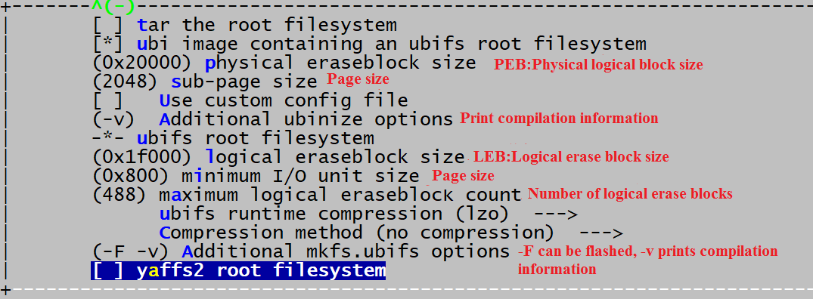

# Nand Flash Open Source Solution Develop Guide

ID: RK-KF-YF-314

Release Version: V2.0.0

Release Date: 2020-10-19

Security Level: □Top-Secret   □Secret   □Internal   ■Public

**DISCLAIMER**

THIS DOCUMENT IS PROVIDED “AS IS”. ROCKCHIP ELECTRONICS CO., LTD.(“ROCKCHIP”)DOES NOT PROVIDE ANY WARRANTY OF ANY KIND, EXPRESSED, IMPLIED OR OTHERWISE, WITH RESPECT TO THE ACCURACY, RELIABILITY, COMPLETENESS,MERCHANTABILITY, FITNESS FOR ANY PARTICULAR PURPOSE OR NON-INFRINGEMENT OF ANY REPRESENTATION, INFORMATION AND CONTENT IN THIS DOCUMENT. THIS DOCUMENT IS FOR REFERENCE ONLY. THIS DOCUMENT MAY BE UPDATED OR CHANGED WITHOUT ANY NOTICE AT ANY TIME DUE TO THE UPGRADES OF THE PRODUCT OR ANY OTHER REASONS.

**Trademark Statement**

"Rockchip", "瑞芯微", "瑞芯" shall be Rockchip’s registered trademarks and owned by Rockchip. All the other trademarks or registered trademarks mentioned in this document shall be owned by their respective owners.

**All rights reserved. ©2020. Rockchip Electronics Co., Ltd.**

Beyond the scope of fair use, neither any entity nor individual shall extract, copy, or distribute this document in any form in whole or in part without the written approval of Rockchip.

Rockchip Electronics Co., Ltd.

No.18 Building, A District, No.89, software Boulevard Fuzhou, Fujian,PRC

Website:     [www.rock-chips.com](http://www.rock-chips.com)

Customer service Tel:  +86-4007-700-590

Customer service Fax:  +86-591-83951833

Customer service e-Mail:  [fae@rock-chips.com](mailto:fae@rock-chips.com)

---

**Preface**

**Overview**

Rockchip SDKs use closed-source miniloader to load trust and u-boot by default. All memories (eMMC NAND or NOR Flash) are accessed through block interface. For developers who want to access NAND or NOR Flash through MTD interface, Rockchip provides open source SPL to load trust and u-boot, and access NAND or NOR Fash through MTD interface in u-boot.

**Product Version**

| **Chipset**     | **Kernel version**   |
| --------------- | :------------------- |
| RK3308          | Linux 4.4, Linux4.19 |
| RK1126 & RK1109 | Linux 4.19           |

**Intended Audience**

This document (this guide) is mainly intended for:

Technical support engineers

Software development engineers

**Revision History**

| **Version** | **Author** | **Date** | **Change Description** |
| --------- | ---------- | :-------- | ------------ |
| V1.0.0      | HKH        | 2019-06-20 | Initial version                                    |
| V1.0.1      | HKH        | 2019-11-11 | Add SD card upgrade introduction                   |
| V1.0.2      | Ruby Zhang | 2020-07-08 | Update the format of the document                  |
| V1.1.0      | Jair Wu    | 2020-07-10 | Add u-boot compile introduction                    |
| V2.0.0      | Jon Lin    | 2020-10-19 | Improve the driver configuration and other details |

---

**Contents**

[TOC]

---

## Notes on Open Source Solution

### Feature

Confirm these following feature:

| Note.                                         | Support Device Type | Register Device Type | Filesystem      | Download methods                                 |
| --------------------------------------------- | ------------------- | -------------------- | --------------- | ------------------------------------------------ |
| SLC Nand open source solution (Parallel Nand) | SLC Nand            | mtd、ubiblock        | SquashFS、UBIFS | USB download、SD card download、Flash Programmer |
| SPI Nand open source solution                 | SPI Nand            | mtd、ubiblock        | SquashFS、UBIFS | USB download、SD card download、Flash Programmer |

Main points：

* The device type to choose
* Does the filesystem meet the requirements

### Nand Flash Infomation

Making UBIFS images、IDB images(Pre loader) should depend on the concrete Nand flash infomation, including follow information:

* page size, SLC Nand is usually in 2KB or 4KB;
* page per block, SLC Nand is usually in 64 or 128;
* block size = page_size * page_per_block, SLC Nand is usually 128KB or 256KB;
* oob size, SLC Nand is usually in 64B, 128B or 256B.

The default configuration is mostly base on 2KB page size and 128 block size flash, change it if need when you perform the following process:

* Making Programmer images
* Making UBIFS filesystem images

The Nand flash information is mostly like this:


### Other Notes

* UBFFS images is not compatible with two different Nand flash with different page size or block size, Therefore, the selection of flash devices should be careful.
* SLC NAND in the document refers to the parallel port NAND

## Build Configuration Changes

### SPL & U-Boot

| Note.                         | Support Device Type | Driver Codes          | Flash Framework       | Device Register Type | Filesystem | Download methods                                  |
| ----------------------------- | ------------------- | --------------------- | --------------------- | -------------------- | ---------- | ------------------------------------------------- |
| SLC Nand open source solution | SLC Nand            | drivers/mtd/ nand/raw | drivers/mtd/ nand/raw | mtd                  | UBIFS      | USB download、SD card download、Flash Programmer  |
| SPI Nand open source solution | SPI Nand            | drivers/spi           | drivers/mtd/ nand/spi | mtd                  | UBIFS      | USB download、SD card download、Flash Programmer\ |

#### Configurations

The defconfig is configured as follows：

Add:

```shell
// MTD support
CONFIG_MTD=y
CONFIG_CMD_MTD_BLK=y
CONFIG_SPL_MTD_SUPPORT=y
CONFIG_MTD_BLK=y
CONFIG_MTD_DEVICE=y

// spi nand support
CONFIG_NAND=y
CONFIG_MTD_SPI_NAND=y
CONFIG_ROCKCHIP_SFC=y
CONFIG_SPL_SPI_FLASH_SUPPORT=y
CONFIG_SPL_SPI_SUPPORT=y

// nand support
CONFIG_NAND=y
CONFIG_CMD_NAND=y
CONFIG_NAND_ROCKCHIP=y
CONFIG_SPL_NAND_SUPPORT=y
CONFIG_SYS_NAND_U_BOOT_LOCATIONS=y
CONFIG_SYS_NAND_U_BOOT_OFFS=0x8000
CONFIG_SYS_NAND_U_BOOT_OFFS_REDUND=0x10000

// rkfw firmware uboot trust address（Needless in fit format）
CONFIG_RKFW_TRUST_SECTOR=0X3000		#The flashing address in memory is in sectors, 1 sector=512 Bytes, which is the start address of the trust in paramter.txt
CONFIG_RKFW_U_BOOT_SECTOR=0X2000	#The flashing address in memory is in sectors, 1 sector=512 Bytes, which is the starting address of u-boot in paramter.txt
```

Remove:

```shell
CONFIG_RKFLASH=y
CONFIG_RKNANDC_NAND=y
CONFIG_RKSFC_NAND=y
CONFIG_RKSFC_NOR=y
```

#### Compile Instrodution

64-bits:

Excute `./make.sh uboot` in root path of SDK or excute `./make.sh rk3308` in [ROOT PATH]/u-boot.

32-bits:

64-bits loader is needed in 32-bit u-boot compilation, so compile 64-bits u-boot firstly, backup spl/u-boot-spl.bin, replace spl/u-boot-spl.bin after compiling 32-bits u-boot, and then pack loader, commands are as follows:

```shell
cd u-boot
./make.sh rk3308
cp spl/u-boot-spl.bin ..
./make.sh rk3308-aarch32
cp ../u-boot-spl.bin spl/
./make.sh spl-s ../rkbin/RKBOOT/RK3308MINIALL_WO_FTL.ini
```

These commads will generate rk3308_loader_wo_ftl_v*.bin which you can flash into board as final loader.

### Kernel

| Note.                         | Support Device Type | Driver Codes          | Flash Framework       | Device Register Type | Filesystem | Download methods                                 |
| ----------------------------- | ------------------- | --------------------- | --------------------- | -------------------- | ---------- | ------------------------------------------------ |
| SLC Nand open source solution | SLC Nand            | drivers/mtd/ nand/raw | drivers/mtd/ nand/raw | mtd                  | UBIFS      | USB download、SD card download、Flash Programmer |
| SPI Nand open source solution | SPI Nand            | drivers/rkflash       | drivers/rkflash       | mtd                  | UBIFS      | USB download、SD card download、Flash Programmer |

#### SLC Nand Open Source Solution

Configuration：

```
CONFIG_RK_FLASH=n   /* It's not compatible */
CONFIG_MTD_NAND_ROCKCHIP_V6=y /* NandC v6 is depending on TRM NANDC->NANDC_NANDC_VER register, 0x00000801 */
# CONFIG_MTD_NAND_ROCKCHIP_V9=y /* NandC v9  is depending on TRM NANDC->NANDC_NANDC_VER register, 0x56393030, Currently only RK3326 is relevant */
CONFIG_MTD_CMDLINE_PARTS=y
```

Sources Codes：

```
./drivers/mtd/nand/raw/
```

Reserved 4 blocks for bad block table, so the firmware should not overlay the area and it's better to reserved 1MB, consult to "MTD Partition Table" chapter for detail.

#### SPI Nand Open Source Solution

Configuration：

```
CONFIG_RK_FLASH=y

CONFIG_RK_SFC_NAND=y     /* SPI Nand flash */
CONFIG_RK_SFC_NAND_MTD=y /* SPI Nand flash and partitions is register as mtd device,  otherwise block devices(rkflash0pn)  */
CONFIG_MTD_CMDLINE_PARTS=y
```

Sources Codes：

```
./drivers/rkflash
```

SPI Nand Bad blocks Management Strategy：

The last 4 blocks are reserved for Nand bad block table, it's better to reserve 1MB.

Sources Codes：

```
./drivers/rkflash/sfc_nand_mtd_bbt.c
```

Reserved 4 blocks for bad block table, so the firmware should not overlay the area and it's better to reserved 1MB, consult to "MTD Partition Table" chapter for detail.

### MTD Partition Table

#### Parse GPT And Generate MTD Partition In RK SDK

RK SDK support parsing GPT and generate mtdparts to kernel.

Notes：

* Each partition of SLC NAND and SPI NAND open source solution images should reserve 2 ~ 3 redundant flash block sizes, so that when bad blocks are encountered, there is redundant space to replace;

* Partition should start from address which is flash block size aligned

* The last 4 blocks are reserved for Nand bad block table, so the firmware should not overlay the area, there are two specific situations:

   parameter.txt  use the "grow" flag for the last partition in the code: the size of the  last partition will be automatically adjusted in the code, and the SDK  is the scheme by default;

   parameter.txt  The last partition in does not use the "grow" flag or does not use the  GPT scheme: the last user partition should not be defined to the 1MB  space at the end of the flash.

* The partition table should be GPT table, that is, configure the following fields in parameter.txt file:

  ```
  TYPE: GPT
  ```

#### Dts Adds Rootfs Mount Information

 Select and add the appropriate code in dts bootargs：

```
ubi.mtd=4 root=ubi0:rootfs rootfstype=ubifs
ubi.mtd=3 ubi.block=0,rootfs root=/dev/ubiblock0_0 rootfstype=squashfs    /* Mount SquashFS on UBI block */
```

Note：

1. MTD partitions is correspond with partitions parameter.txt, counting from mtd0 or mtdblock0;
2. mtd is char device, mtdblock is block device

#### Vendor Storage

  Add a partition "vnvm" in parameter.txt to enable vendor storage.
  The size of the partition needs to be an integer multiple of the NAND flash block size, it is recommended to configure 1MB.

### Buildroot

Takes ubifs as an rootfs example, refer to the configuration below,  please refer to ubifs for detailed parameters configurations:



When finishing the configuration, use "make savedefconfig" to save Buildroot configuration.

### Building Script Patch

Add spl building to build.sh. The generated spl file is located at "u-boot/spl/u-boot-spl.bin", but parts of SOC should patch following patches.

#### RK3308 Patches

**Building Pre loader**

The SDK generate Pre loader from the Miniloader project with FTL version which it not support this open source case, so you have to choose one of following patch:

Closed source without FTL support Miniloader.bin :

```diff
diff --git a/common/build.sh b/common/build.sh
index 671decd..c4fe085 100755
--- a/common/build.sh
+++ b/common/build.sh
@@ -46,7 +46,7 @@ function build_uboot(){
        if [ -f u-boot/*_loader_*.bin ]; then
                rm u-boot/*_loader_*.bin
        fi
-       cd u-boot && ./make.sh $RK_UBOOT_DEFCONFIG && cd -
+       cd u-boot && ./make.sh $RK_UBOOT_DEFCONFIG && ./make.sh spl-s ../rkbin/RKBOOT/RK3308MINIALL_WO_FTL.ini && cd -
        if [ $? -eq 0 ]; then
                echo "====Build uboot ok!===="
        else
```

Open source SPL:

consult to "Compile Instrodution" chapter.

**Modify SDK Filesystem Configuration**

Modify the following fields in BoardConfig.mk：

```shell
export RK_ROOTFS_TYPE=ubi
export RK_OEM_FS_TYPE=ubi
export RK_USERDATA_FS_TYPE=ubi
```

Package tools modification (tools directory), oem and userdata are not packaged as follows:

```diff
diff --git a/linux/Linux_Pack_Firmware/rockdev/rk3308-package-file b/linux/Linux_Pack_Firmware/rockdev/rk3308-package-file
index 92c0259..260e2fe 100755
--- a/linux/Linux_Pack_Firmware/rockdev/rk3308-package-file
+++ b/linux/Linux_Pack_Firmware/rockdev/rk3308-package-file
@@ -9,8 +9,8 @@ uboot       Image/uboot.img
 boot        Image/boot.img
 rootfs      Image/rootfs.img
 recovery       Image/recovery.img
-oem                    Image/oem.img
-userdata:grow    Image/userdata.img
+#oem                   Image/oem.img
+#userdata:grow    Image/userdata.img
```

### Partition Table

The partition table should be GPT table, that is, configure the following fields in parameter.txt file:

```shell
TYPE: GPT
```

### SD Booting Upgrade

The SPL solution supports SD card upgrade solution. If you need this function, the following configuration should be turned on:

U-Boot directory：

```diff
diff --git a/arch/arm/dts/rk3308-evb.dts b/arch/arm/dts/rk3308-evb.dts
index 3178d45..68853d6 100644
--- a/arch/arm/dts/rk3308-evb.dts
+++ b/arch/arm/dts/rk3308-evb.dts
@@ -330,7 +330,7 @@
        sd-uhs-sdr25;
        sd-uhs-sdr50;
        sd-uhs-sdr104;
-       status = "disabled";
+       status = "okay";
 };

 &u2phy {
```

```diff
-CONFIG_OF_SPL_REMOVE_PROPS="pinctrl-0 pinctrl-names clock-names interrupt-parent assigned-clocks assigned-clock-rates assigned-clock-parents"
+CONFIG_OF_SPL_REMOVE_PROPS=""
+CONFIG_SPL_PINCTRL_GENERIC=y
+CONFIG_SPL_PINCTRL=y
```

kernel directory:

```diff
diff --git a/arch/arm64/boot/dts/rockchip/rk3308.dtsi b/arch/arm64/boot/dts/rockchip/rk3308.dtsi
index 8a98886..970fb69 100644
--- a/arch/arm64/boot/dts/rockchip/rk3308.dtsi
+++ b/arch/arm64/boot/dts/rockchip/rk3308.dtsi
@@ -1166,6 +1166,8 @@
                nandc_id = <0>;
                clocks = <&cru SCLK_NANDC>, <&cru HCLK_NANDC>;
                clock-names = "clk_nandc", "hclk_nandc";
+               pinctrl-names = "default";
+               pinctrl-0 = <&flash_csn0 &flash_rdy &flash_ale &flash_cle &flash_wrn &flash_rdn &flash_bus8>;
                status = "disabled";
        };
```

```diff
diff --git a/drivers/mtd/nand/rockchip_nand_v6.c b/drivers/mtd/nand/rockchip_nand_v6.c
index 5a74427..31208ba 100644
--- a/drivers/mtd/nand/rockchip_nand_v6.c
+++ b/drivers/mtd/nand/rockchip_nand_v6.c
@@ -20,6 +20,7 @@
 #include <linux/gpio.h>
 #include <linux/interrupt.h>
 #include <linux/iopoll.h>
+#include <asm/io.h>

 #define        NANDC_V6_NUM_BANKS      4
 #define        NANDC_V6_DEF_TIMEOUT    20000
@@ -689,6 +690,7 @@ static int rk_nandc_probe(struct platform_device *pdev)
        int irq;
        int ret;
        int clock_frequency;
+       void __iomem *base;

        nandc = devm_kzalloc(dev, sizeof(*nandc), GFP_KERNEL);
        if (!nandc)
@@ -697,6 +699,8 @@ static int rk_nandc_probe(struct platform_device *pdev)
        nandc->dev = dev;

        r = platform_get_resource(pdev, IORESOURCE_MEM, 0);
+       base = ioremap(0xff000000, 0x10000);
+       printk("%s %x %x\n", __func__, readl(base + 0x60), readl(base + 0x68));
        nandc->regs = devm_ioremap_resource(dev, r);
        if (IS_ERR(nandc->regs))
                return PTR_ERR(nandc->regs);
```

Macros should be turned on in the defconfig of recovery

```shell
BR2_PACKAGE_MTD=y
```

When finishing building, use the tool SDDiskTool_v1.59 to make the card. First time to upgrade have to generate the firmware needed to upgrade Flash in the root directory of the SD card, so it will take longer time, but will be quicker later.

### Enable Key Log

SPL Log:

```shell
U-Boot SPL board init
U-Boot SPL 2017.09-03071-g9cb6379-dirty (Jun 28 2019 - 10:29:22)
```

Then run `mount` command and it will mount as follows:

```shell
# mount
ubi0:rootfs on / type ubifs (rw,relatime)
/dev/ubi6_0 on /oem type ubifs (rw,relatime)
/dev/ubi7_0 on /userdata type ubifs (rw,relatime)
```

## OTA

### Upgrade MTD Partitions By Shell Command

First of all, if the image in the MTD partition uses the UBIFS file system,  refer to the chapter "UBIFS OTA" chapter . Therefore, the MTD partition is mainly aimed at the firmware  partitions that are read-only and have no file system, such as IDB,  u-boot, kernel, etc.

**u-boot SLC Nand**

nand info：

```
nand info
```

nand erase：

```shell
nand erase off size
```

* off：block size aligned, unit byte, only hexadecimal is supported
* size：block size aligned, unit byte, only hexadecimal is supported

nand write：

```
nand write - addr off|partition size
```

* addr：memory address, only hexadecimal is supported
* off|partition：page size aligned, unit byte, only hexadecimal is supported
* size：page size aligned, unit byte, only hexadecimal is supported

nand read：

```
nand read - addr off|partition size
```

* addr：memory address, only hexadecimal is supported
* off|partition：page size aligned, unit byte, only hexadecimal is supported
* size：page size aligned, unit byte, only hexadecimal is supported

For instance:

```
tftp 0x4000000 rootfs.img
nand erase 0x600000 0x200000						/* Erase the whole partion before write */
nand write 0x4000000 0x600000 0x200000
```

**u-boot SPI Nand**

SPI Nand unable to support nand command,  cmd/mtd.c is available.

mtd erase:

```
mtd erase <name> <off> <size>
```

* name：spi-nand0 for SPI Nand mtd devices

* off：page size aligned, unit byte, only hexadecimal is supported
* size aligned, unit byte, only hexadecimal is supported

mtd write:

```
mtd write <name> <addr> <off> <size>
```

* name：spi-nand0 for SPI Nand mtd devices

* addr：memory address, only hexadecimal is supported
* off：page size aligned, unit byte, only hexadecimal is supported
* size aligned, unit byte, only hexadecimal is supported

mtd read:

```
mtd read <name> <addr> <off> <size>
```

* name：spi-nand0 for SPI Nand mtd devices

* addr：memory address, only hexadecimal is supported
* off：page size aligned, unit byte, only hexadecimal is supported
* size aligned, unit byte, only hexadecimal is supported

For instance:

```
tftp 0x4000000 rootfs.img
mtd erase spi-nand0 0x600000 0x200000						/* Erase the whole partion before write */
mtd write spi-nand0 0x4000000 0x600000 0x200000
```

**kernel**

flash_eraseall：

```
flash_eraseall
```

nanddump：

```
nanddump --bb=skipbad /dev/mtd3
```

1. --bb=METHOD, where METHOD can be 'padbad', 'dumpbad', or'skipbad':
2. padbad:  dump flash data, substituting 0xFF for any bad blocks
3. dumpbad: dump flash data, including any bad blocks
4. skipbad: dump good data, completely skipping any bad blocks (default)

nandwrite：

```
nandwrite -p /dev/mtd3 /rockchip_test/rockchip_test.sh
```

Take /dev/mtd4 for instance:

```
flash_eraseall /dev/mtd4                                       /* Erase the whole partion before write */
nandwrite -p /dev/mtd3 /userdata/boot.img
sync
nanddump --bb=skipbad /userdata/boot_read.img
md5sum /userdata/boot_read.img ...                             /* Add verification */
```

### Upgrade UBIFS Image By Shell Command

Consult to "UBIFS Instruction" -> "UBIFS OTA"  chapter。

### Upgrade MTD Partitions By APIs

First of all, if the image in the MTD partition uses the UBIFS file system,  refer to the chapter "UBIFS OTA" chapter . Therefore, the MTD partition is mainly aimed at the firmware  partitions that are read-only and have no file system, such as IDB,  u-boot, kernel, etc.

**u-boot**

Consult to drivers/mtd/nand/nand_util.c, Using those APIs with bad block management.

**kernel**

Consult to  ./miscutils/nandwrite.c ./miscutils/flash_eraseall.c, Using those APIs with bad block management.

**user**

Consult to ./miscutils/nandwrite.c ./miscutils/flash_eraseall.c and conbined with mtd ioctrl in include/uapi/mtd/mtd-abi.h.

## UBIFS Filesystem

### Instruction

UBIFS is the abbreviation of unsorted block image file system. UBIFS is often used in file system support on raw NAND as one of the successor file systems of JFFS2. UBIFS processes actions with MTD equipment through UBIFS subsystem.

### Configuration

Kernel Configuration：

```
CONFIG_MTD_UBI=y
CONFIG_UBIFS_FS=y
CONFIG_UBIFS_FS_ADVANCED_COMPR=y
CONFIG_UBIFS_FS_LZO=y /* Using lzo */
```

### Making Images

**Introduction For Commands**

```
Usage: mkfs.ubifs [OPTIONS] target
Make a UBIFS file system image from an existing directory tree
Examples:
Build file system from directory /opt/img, writting the result in the ubifs.img file
        mkfs.ubifs -m 512 -e 128KiB -c 100 -r /opt/img ubifs.img
The same, but writting directly to an UBIFS volume
        mkfs.ubifs -r /opt/img/dev/ubi0_0
Creating an empty UBIFS filesystem on an UBIFS volume
        mkfs.ubifs/dev/ubi0_0
Options:
-r, -d, --root=DIR         build file system from directory DIR,
-m, --min-io-size=SIZE     minimum I/O unit size, NAND FLASH 的 minimum write size, page size,4096B or 2048B
-e, --leb-size=SIZE        logical erase block size, 为 block size-2x (page size), If block_size 256KB page_size 2KB then -e equals 258048, If block_size 128KB page_size 2KB then -e equals 126976
-c, --max-leb-cnt=COUNT    maximum logical erase block count
-o, --output=FILE          output to FILE
-j, --jrn-size=SIZE        journal size
-R, --reserved=SIZE        how much space should be reserved for the super-user
-x, --compr=TYPE           compression type - "lzo", "favor_lzo", "zlib" or "none" (default: "lzo")
-X, --favor-percent        may only be used with favor LZO compression and defines how many percent better zlib should compress to make mkfs.ubifs use zlib instead of LZO (default 20%)
-f, --fanout=NUM           fanout NUM (default: 8)
-F, --space-fixup          file-system free space has to be fixed up on first mount(requires kernel version 3.0 or greater)
-k, --keyhash=TYPE         key hash type - "r5" or "test" (default: "r5")
-p, --orph-lebs=COUNT      count of erase blocks for orphans (default: 1)
-D, --devtable=FILE        use device table FILE
-U, --SquashFS-uids        SquashFS owners making all files owned by root
-l, --log-lebs=COUNT       count of erase blocks for the log (used only for debugging)
-v, --verbose              verbose operation
-V, --version              display version information
-g, --debug=LEVEL          display debug information (0 - none, 1 - statistics, 2 - files, 3 - more details)
-h, --help                 display this help text
```

**Process**

1. Making UBIFS Images

```
mkfs.ubifs -F -d rootfs_dir -e real_value -c real_value -m real_value -v -o rootfs.ubifs
```

2. Making  UBI volume

```
ubinize -o ubi.img -m 2048 -p 128KiB ubinize.cfg
```

* -p：block size。
* -m：NAND FLASH minimum write size which usually equals page size
* -o：output file

ubinize.cfg content：

```
[ubifs-volumn]
mode=ubi
image=rootfs.ubifs
vol_id=0
vol_type=dynamic
vol_alignment=1
vol_name=ubifs
vol_flags=autoresize
```

* mode=ubi： default.
* image=out/rootfs.ubifs：input file
* vol_id=0：volume ID, different volume id for different volume.
* vol_type=dynamic： static for read-only
* vol_name=ubifs：volume name
* vol_flags=autosize.

For Instance:

page size 2KB, page per block 64,  block size 128KB, partition size 64MB：

```
mkfs.ubifs -F -d /path-to-it/buildroot/output/rockchip_rv1126_rv1109_spi_nand/target -e 0x1f000 -c 0x200 -m 0x800 -v -o rootfs.ubifs
ubinize -o ubi.img -m 2048 -p 128KiB ubinize.cfg
```

page size 2KB, page per block 128, block size 256KB, partition size 64MB：

```
mkfs.ubifs -F -d /path-to-it/buildroot/output/rockchip_rv1126_rv1109_spi_nand/target -e 0x3f000 -c 0x100 -m 0x800 -v -o rootfs.ubifs
ubinize -o ubi.img -m 2048 -p 256KiB ubinize.cfg
```

page size 4KB, page per block 64, block size 256KB, partition size 64MB：

```
mkfs.ubifs -F -d /path-to-it/buildroot/output/rockchip_rv1126_rv1109_spi_nand/target -e 0x3e000 -c 0x100 -m 0x1000 -v -o rootfs.ubifs
ubinize -o ubi.img -m 0x1000 -p 256KiB ubinize.cfg
```

### Mount UBIFS

```shell
ubiattach /dev/ubi_ctrl -m 4 -d 4
```

* -m：mtd num
* -d：ubi binding device

```shell
mount -t ubifs /dev/ubi4_0 /oem
```

### Support SquashFS In UBI Block

Kernel Configuration

```
+CONFIG_MTD_UBI_BLOCK=y
```

**Define Rootfs In dts **

```
dts: bootargs: cmdline:

- ubi.mtd=4              : Choose mtd(From 0)
- ubi.block=0,rootfs     : "rootfs" is vol_name(Consult to ubinize.cfg), block=0 is ubi block index
- root=/dev/ubiblock0_0  : rootfs block dev name, generate from UBI block device drivers
- rootfstype=squashfs    : rootfs type
```

**Making SquashFS UBI volume**

Buildroot will automatically pack SquashFS image。If need, using mksquashfs command, for example：

```shell
sudo mksquashfs squashfs-root/ squashfs.img -noappend -always-use-fragments
```

Using ubinize to pack SquashFS image into UBI image:

Firstly generate ubinize.cfg：

```shell
cat > ubinize.cfg << EOF
[ubifs]
mode=ubi
vol_id=0
vol_type=static
vol_name=rootfs
vol_alignment=1
vol_flags=autoresize
image=/data/rk/projs/rv1126/sdk/buildroot/output/rockchip_rv1126_robot/images/rootfs.squashfs
EOF
```

Note:

* vol_type: should be static;
* image: input file, path to SquashFS image

then ubinize：

```shell
ubinize -o rootfs.ubi -p 0x20000 -m 2048 -s 2048 -v ubinize.cfg
```

-p, --peb-size: size of the physical eraseblock of  the flash this UBI image is created for in bytes,kilobytes (KiB), or  megabytes (MiB) (mandatory parameter)

-m, --min-io-size : minimum input/output unit size of the flash in bytes

-s, --sub-page-size: minimum input/output unit used for  UBI headers, e.g. sub-page size in case of NAND flash (equivalent to the minimum input/output unit size by default)

rootfs.ubi is the output file.

Note：

* When using the open source solution in NAND products, Squashfs should not be directly mounted on the mtdblock, because mtdblock does not add bad block detection, so bad block cannot be skipped.

### UBIFS OTA

升级使用 UBIFS 的分区应使用 ubiupdatevol 工具, 参考, 命令：

```
ubiupdatevol /dev/ubi1_0 rootfs.ubiimg
```

## PC Tools For Downloading

When download UBIFS images, the tools will automatically erase the whole partition, then download the images：

* AndroidTools tools version should equals V2.7.8 or above。
* upgrade_tools tools version should equals V1.5.6 or above。

Note:

* PC will download multyple

注意：

* PC tool burning will automatically copy multiple copies of IDB firmware from block 1 to block 7, that is:
  The first 1MB of page size 2KB flash is GPT partition and IDB space
  The first 2MB of page size 4KB flash is GPT partition and IDB space

## Flash Programmer

### SPI Nand Flash Programmer

#### Make SPI Nand Images

**Input Files：SDK Output Files For PC Tools**

```shell
➜  [/IMAGES] tree
.
├── parameter.txt               // 生成 gpt.img
├── MiniLoaderAll.bin           // 生成 idblock.img
├── uboot.img
├── boot.img
├── rootfs.img
├── oem.img
└── update.img                  // 过滤
```

**Make Images**

tool burner_image_kits in SDK rkbin/ directory, command：

```
./rkbin/tools/burner_image_kits/make_spi_nand.sh <src_path> <dst_path>  <soc> <block_size(KB)>
```

* src_path：SDK Output Files For PC Tools;
* dst_path：output directory；
* soc：chip(lowercase), e.g: rv1126
* block_size：flash block size；

e.g： rv1126 block size 128KB flash:

```
./rkbin/tools/burner_image_kits/make_spi_nand.sh ./IMAGES ./out rv1126 128
```

**output  files: Using For Flash Programmer **

```
➜  [/out] tree
.
└── 2048B_128KB
    ├── gpt.img
    ├── idblock.img.bak     // IDB image
    ├── idblocks.img        // idblock.img.bak multy copies in three
    ├── uboot.img
    ├── boot.img
    ├── rootfs.img
    └── oem.img
```

#### SPI Nand Flash Programmer Operation

**Programmer  Address**

Assume that flash block size is 128KB, AndroidTools and it's corresponding flash programmer  setting could be like this：

| Input File: SDK output | AndroidTools Start(sector) | Flash Programmer Images | Programmer Start(block) | End(block) | Size(block) | Note       |
| ---------------------- | -------------------------- | ----------------------- | ----------------------- | ---------- | ----------- | ---------- |
| paramter.txt           | 0                          | gpt.img                 | 0x0                     | 0x1        | 0x1         | Note 1     |
| MiniLoaderAll.bin      | 0                          | idblocks.img            | 0x1                     | 0x7        | 0x6         | Note 2     |
| uboot.img              | 0x2000                     | uboot.img               | 0x20                    | 0x47       | 0x20        | **Note 3** |
| boot.img               | 0x4800                     | boot.img                | 0x48                    | 0xa0       | 0x50        |            |
| ...                    | ...                        | ...                     | ...                     |            |             |            |
| xxx.img                | 0x3E000                    | xxx.img                 | 0x3e0                   | 0x3fb      | 0x18        | Note 4     |

Table Note：

1. gpt.img should be placed in block 0；

2. idblocks.img should be placed from block 1 to block 7；

3. Except gpt.img and idblocks.img, other images should be place in the address based on parameter.txt address, 512B/sector, flash programmer  Start block = sectors * 512B / block_size：

   128KB block size：sectors / 0x100
   256KB block size：sectors / 0x200
   Except gpt.img, other images size should less then partition size from 1 to 2  block size to make bad block replacement possible；

4. Resert the last 4 flash block size for bad block table, consider defining the reverted partition to avoid user use or future misuse.

**Other Note**

1. The image does not contain OOB data, fill it with "0xff" data by flash programmer ；
2. Erase all good blocks for none empty flash；
3. Enable verification

### SLC Nand Flash Programmer

#### Make SLC Nand Images

**Input Files：SDK Output Files For PC Tools**

```shell
➜  [/IMAGES] tree
.
├── parameter.txt               // 生成 gpt.img
├── MiniLoaderAll.bin           // 生成 idblock.img
├── uboot.img
├── boot.img
├── rootfs.img
├── oem.img
└── update.img                  // 过滤
```

**Make Images**

tool burner_image_kits in SDK rkbin/ directory, command：

```
./rkbin/tools/burner_image_kits/make_spi_nand.sh <src_path> <dst_path>  <soc> <block_size(KB)> <page_size(B)> <oob_size(B)>
```

* src_path：SDK Output Files For PC Tools;
* dst_path：output directory；
* soc：chip(lowercase), e.g: rv1126
* block_size：flash block size；
* page_size：flash page size。
* oob_size：flash oob size per page

e.g： rv1126 block size 128KB flash page size 2KB  oob size 64B flash:

```
./rkbin/tools/burner_image_kits/make_slc_nand.sh ./IMAGES ./out rv1126 128 2048 64
```

**output  files: Using For Flash Programmer**

```
➜  [/out] tree
.
└── 2048B_128KB
    ├── gpt.img
    ├── idblock.img.bak     // IDB image
    ├── idblocks.img        // idblock.img.bak multy copies in three
    ├── uboot.img
    ├── boot.img
    ├── rootfs.img
    └── oem.img
```

#### SLC Nand Flash Programmer Operation

**Programmer Address**

Assume that flash block size is 128KB, AndroidTools and it's corresponding flash programmer setting could be like this：

| Input File: SDK output | AndroidTools Start(sector) | Flash Programmer Images | Programmer Start(block) | End(block) | Size(block) | Note       |
| ---------------------- | -------------------------- | ----------------------- | ----------------------- | ---------- | ----------- | ---------- |
| paramter.txt           | 0                          | gpt.img                 | 0x0                     | 0x1        | 0x1         | Note 1     |
| MiniLoaderAll.bin      | 0                          | idblocks.img            | 0x1                     | 0x7        | 0x6         | Note 2     |
| uboot.img              | 0x2000                     | uboot.img               | 0x20                    | 0x47       | 0x20        | **Note 3** |
| boot.img               | 0x4800                     | boot.img                | 0x48                    | 0xa0       | 0x50        |            |
| ...                    | ...                        | ...                     | ...                     |            |             |            |
| xxx.img                | 0x3E000                    | xxx.img                 | 0x3e0                   | 0x3fb      | 0x18        | Note 4     |

Table Note：

1. gpt.img should be placed in block 0；

2. idblocks.img should be placed from block 1 to block 7；

3. Except gpt.img and idblocks.img, other images should be place in the address based on parameter.txt address, 512B/sector, flash programmer  Start block = sectors * 512B / block_size：

   128KB block size：sectors / 0x100
   256KB block size：sectors / 0x200
   Except gpt.img, other images size should less then partition size from 1 to 2  block size to make bad block replacement possible；

4. Resert the last 4 flash block size for bad block table, consider defining the reverted partition to avoid user use or future misuse.

**Other Note**

1. The image contain OOB data；
2. Erase all good blocks for none empty flash；
3. Enable verification

## Reference documents

[1] UBI FAQ: <http://www.linux-mtd.infradead.org/faq/ubi.html>

[2] UBIFS FAQ: <http://www.linux-mtd.infradead.org/faq/ubifs.html#L_lebsz_mismatch>

[3] MTD FAQ: <http://www.linux-mtd.infradead.org/faq/general.html>

