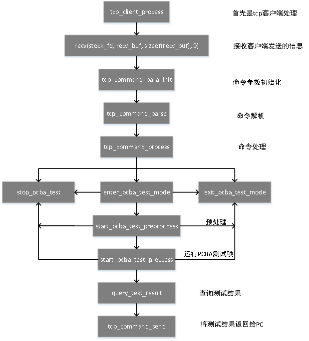

# PCBA测试开发指南

文件标识：RK-KF-YF-301

发布版本：V1.1.1

日期：2020-08-04

文件密级：□绝密   □秘密   □内部资料   ■公开

**免责声明**

本文档按“现状”提供，瑞芯微电子股份有限公司（“本公司”，下同）不对本文档的任何陈述、信息和内容的准确性、可靠性、完整性、适销性、特定目的性和非侵权性提供任何明示或暗示的声明或保证。本文档仅作为使用指导的参考。

由于产品版本升级或其他原因，本文档将可能在未经任何通知的情况下，不定期进行更新或修改。

**商标声明**

“Rockchip”、“瑞芯微”、“瑞芯”均为本公司的注册商标，归本公司所有。

本文档可能提及的其他所有注册商标或商标，由其各自拥有者所有。

**版权所有 © 2020 瑞芯微电子股份有限公司**

超越合理使用范畴，非经本公司书面许可，任何单位和个人不得擅自摘抄、复制本文档内容的部分或全部，并不得以任何形式传播。

瑞芯微电子股份有限公司

Rockchip Electronics Co., Ltd.

地址：     福建省福州市铜盘路软件园A区18号

网址：     [www.rock-chips.com](http://www.rock-chips.com)

客户服务电话： +86-4007-700-590

客户服务传真： +86-591-83951833

客户服务邮箱： [fae@rock-chips.com](mailto:fae@rock-chips.com)

---

**前言**

**概述**

本文档主要介绍Rockchip处理器内PCBA测试工具，使用该工具可以在量产阶段快速识别板端硬件中各个部件功能的好坏，文中通过实例介绍PCBA测试工具的使用方法和注意事项。

**产品版本**

| **芯片名称**                                          | **软件版本** |
| ----------------------------------------------------- | ------------ |
| 适用RK3308、RK3229、PX3-SE、RK3399、RK3288等Linux平台 | V1.6         |

**读者对象**

本文档（本指南）主要适用于以下工程师：

- 技术支持工程师

- 软件开发工程师

**修订记录**

| **日期**   | **版本** | **作者**   | **修订记录**                          |
| ---------- | -------- | ---------- | ------------------------------------- |
| 2018-05-20 | V1.0.0   | Chad.ma    | 初稿                                  |
| 2018-05-25 | V1.0.1   | Chad.ma    | 增加重启选项、camera测试说明          |
| 2018-07-30 | V1.0.2   | Chad.ma    | 修改3.3生成固件  增加附件常见错误总结 |
| 2018-08-06 | V1.0.3   | Chad.ma    | 增加第4章节                           |
| 2018-08-06 | V1.0.4   | Chad.ma    | 修改1.5节及3.3节                      |
| 2018-12-06 | V1.0.6   | Chad.ma    | 修改3.3.2小节                         |
| 2018-12-12 | V1.0.7   | Chad.ma    | 增加5.2.4小节                         |
| 2018-12-25 | V1.0.8   | Chad.ma    | 修改3.3.2小节                         |
| 2019-03-05 | V1.0.9   | Chad.ma    | 增加1.5.2小节                         |
| 2019-04-30 | V1.1.0   | Chad.ma    | 修订1.5章节  修订3.3章节              |
| 2020-08-04 | V1.1.1   | Ruby Zhang | 格式修订                              |

---

**目录**

[TOC]

---

## PCBA TEST Tool

### 概述

PCBA 测试用于帮助在量产的过程中快速地甄别产品功能的好坏，即重点 FCT（Functional Test）测试，进而提高生产效率。PCBA 测试工具在 Window 系统下开发，仅支持在Window系统下运行，配合设备端测试程序，即可以验证所需要重点关注的功能或器件的完整与好坏。

目前测试项包括：SD 卡测试、Wi-Fi 测试、蓝牙测试、DDR 测试、环麦测试、USB host 测试、LED 灯测试、放音测试、录音测试、按键测试、PDM Mic 测试、Audio Line in 测试、SPDIF IN/OUT 测试等，后续还可以添加扩展的测试项。

这些测试项目包括自动测试项和手动测试项，其中 SD 卡测试、Wi-Fi 测试、蓝牙测试、DDR 测试、环麦测试、USB host 测试为自动测试项目；led灯测试、放音测试、录音测试、按键测试、PDM Mic 测试、Audio Line in 测试、SPDIF IN/OUT 测试为手动测试项目。

自动测试项目无需人工干预测试结束后会直接上报测试结果并显示通过与否，人工测试项目需要人为判断测试项是否正确完成，并给出判断（通过或不通过）。

### 测试工具安装

运行 PCBA 工具的安装程序 PCBATool_Setup_xxxx.exe，成功安装后会在指定目录生成可执行程序及各种相关的配置文件和工具中用到的其他程序和库文件。


<center> 图 1‑1 PCBA Tool安装 </center>

其中：

"CamData"目录用来保存 camera 测试中抓取的摄像头某一时刻的一帧图片。保存为bmp格式。RK3308 未使用。

"Language"目录：存放工具语言配置文件。

"Log"目录：存放工具测试过程中的各种log文件，方便后续查找问题原因。

"Config.ini":工具配置文件，记录工具的配置项、语言配置与其他配置的信息。

**注意：**

如果指定自定义的安装目录，请使用全英文路径，避免工具中使用 ADB 工具在非英文路径下执行失败的问题。

### 测试工具介绍

图1-2 为 PCBA 测试工具打开后的主界面：


<center>图 1‑2 PCBA Tool图形界面</center>

如上图所示，PCBA Tool 主要分为五个部分：

- 第1部分为设备信息，测试开始后会获取设备名称及设备的 MAC 地址；

- 第2部分为设置测试项及控制测试启动与停止，以及人工测试项判断通过与否的按钮；

- 第3部分为测试项的显示列表框，将会显示测试类别与测试结果；

- 第4部分为测试各个测试项过程中的信息显示列表框，将显示测试过程及结果；

- 第5部分为设备连接状态，如果工具检测到设备可用（识别为 ADB 设备），显示一个绿色按钮图片，否则显示为橙色按钮图片。

### 配置测试项

点击工具主界面的设置按钮或者按 F2 快捷键，会弹出配置项设置对话框，如图1-2所示。选中某些测试项目后，点击确定按钮将会在上文介绍的第3部分测试项列表框中显示，并根据各个测试项定义好的测试类型（自动或人工测试）显示具体的测试类型。

目前RK3308平台支持的配置项为：SD 卡测试、WIFI测试、蓝牙测试、DDR 测试、环麦测试、USB host 测试、LED 灯测试、放音测试、录音测试、按键测试、PDM Mic 测试、Audio Line in 测试、SPDIF IN/OUT 测试等，后续还可以添加扩展的测试项。

其他 Rockchip 平台的芯片可以按照需求及硬件开发板情况去配置相应的测试项目。


<center> 图 1‑3 PCBA 测试项配置窗口</center>


<center> 图 1‑4 PCBA 配置完成窗口</center>

#### 测试项说明

1. WiFi 测试：自动测试项，测试WiFi 时设备会自动扫描周围的 WiFi 热点，根据扫描的结果判定成功与否。

2. 蓝牙测试：自动测试项，测试蓝牙时设备会先自动关闭蓝牙设备，然后重新开启蓝牙，加载固件后激活蓝牙，根据是否成功开启蓝牙控制接口 hci0，是否有蓝牙硬件地址，判定成功与否。

3. DDR 测试：自动测试项，测试 DDR 时，会自动读取设备的 DDR 容量，根据是否读取正确判定成功与否。

4. SD 卡测试：自动项测试，测试 SD 卡时会运行测试脚本，插入SD 卡，将测试设备节点是否存在，若存在，自动挂载 SD 卡到指定文件目录下，SD卡容量也会记录下来。60s超时未检测到设备节点将自动报错退出。

5. USB Host 测试：自动项测试，测试 USB Host 功能时会运行测试脚本，插入USB host 设备，测试设备节点是否存在，若存在，自动挂载host设备到指定文件目录下，设备容量也会记录下来。60s超时未检测到设备节点将自动报错退出。

6. LED 测试：人工测试项，测试 LED 时，设备第一轮亮红灯，第二轮亮绿灯，第三轮亮蓝灯，第四轮，三种颜色合成白灯；需要人工根据每种灯是否正常亮起，决定测试成功或者失败，点击通过或者不通过按键跳入下一项测试。

7. 放音测试：人工测试项，测试放音功能时，设备会播放存放在设备指定位置的音频数据。需要人工根据声音情况来决定测试成功或者失败，点击通过或者不通过按键跳入下一项测试。

8. 录音测试：人工测试项，测试录音功能时，设备会循环录制当前麦克风采集的一段音频，再把录到的声音通过设备播放出来。需要人工根据播放出来的声音情况决定测试成功或者失败，点击通过或者不通过按键跳入下一项测试。

9. 按键测试：人工测试项，测试按键时，需要人工去按下按键，如果设备检测到按键按下，工具会提示某一名称的按键按下，如果所有板级定义的可测按键均已按下，工具会弹窗提醒，通过后即为测试成功，否则测试失败。测试结果需要人工判断，点击通过或者不通过按键跳入下一项测试。

10. PDM Mic 测试：人工测试项，测试 PDM Mic 功能是否正常。需要人工根据播放出来的声音情况决定测试成功或者失败，点击通过或者不通过按键跳入下一项测试。

11. Audio Line in 测试：人工测试项，板级插入audio line in 设备后，播放音乐出来，需要人工根据喇叭播放的声音来决定测试成功或失败，点击通过或者不通过按键跳入下一项测试。

12. SPDIF IN/OUT 测试：人工测试项。

#### 测试流程说明

**Step1**：正确安装 PCBA 测试工具后，启动工具，如果工具右下角显示绿色按钮图标，表示已经正确扫描到已连接到PC的ADB设备。如果设备连接不成功，工具右下角将显示橙色按钮图标，表示当前设备不可用。

**Step2**：点击【设置】按钮，打开测试项的选择窗口，选择需要测试的测试项。【确定】后，工具主窗口测试列表框会显示即将要测试的项目列表。该次选择的配置也会保存在PCBA测试工具的安装目录下config.ini 文件中，测试项的配置文件如下图1-5所示。红框标识表示该测试项被选中，下次启动工具后将默认加载。


<center> 图 1‑5 PCBA测试工具配置文件 </center>

**Step3**：点击【开始测试】按钮后，首先同时测试所有的自动测试项以及第一个人工测试项；自动测试项无需点击【通过】或者【不通过 】。如下图1-6所示。


<center> 图 1‑6 PCBA 启动测试 </center>

**Step4**：人工测试项都是单项测试，每一项测试完成后都必须点击通过或者不通过来结束当前测试项，然后进入下一个测试项测试。 除按键测试会在信息提示框中显示出来按键具体键名（需设备端程序指定），测试完成后会弹窗提示外，其他的测试项均需要人工判断通过或者不通过。


<center> 图 1‑7 PCBA 按键测试</center>

#### Camera 测试项说明

Camera测试项比较特殊，故单列出来说明。因平台差异，camera 测试根据平台的不同而支持不同。PCBA 测试工具中已经根据平台的情况有对该项做判断，如果当前平台不支持 camera 测试项，工具界面右侧的 "Camera测试" 按钮将灰显，不能使用，本节说明可以跳过；若支持，该按钮将正常显示。


Config.ini文件中Dev_Plateform变量给出了平台定义，如果该变量未赋值，将正常显示"camera测试"按钮，但按下该按钮可能会因平台不支持而报错，从而功能不可用。

Camera测试用到的相关bin程序说明：

- **V4l2_test**:用来从camera数据流中抓取一帧的数据并写入文件。相关源码在 `./external/rk_pcba_test/camera_api` 目录。

- **nv12_to_bmp_main**：用作将 V4l2_test bin 程序抓取保存的nv12数据格式文件转为 bmp 格式，供 PC 端 PCBA 的工具显示使用，需配合 `libyuv.a` 静态库。相关源码路径在`./external/libyuv`下。

#### 重启选项说明

工具界面右侧"完成后重启设备"选项是针对大容量双系统的平台设计，为防止厂测时点错，设计了密码输入确认功能，只有正确输入密码才可启用该选项，否则默认不开启。密码可联系我司FAE获取。工具中已经固定写死该密码，不能修改。

双 rootfs 系统，如 A/B 系统，默认 system_a 烧写 pcba_rootfs.img，system_b 烧写正常的系统 img 固件。该选项选中后，如果所有配置的测试项全部通过，则会重启进入正常系统。相反，其他单系统平台重启后仍然进入 PCBA 测试的 rootfs 文件系统。

### 工具二次开发指引

PCBA 测试工具如需进行二次开发，扩展相关测试项目，相对比较简单，只需要根据以下步骤即可在 PCBA 测试工具上添加自己的测试项。

#### 工具开发流程说明

- 安装软件开发环境 VS2008（打上SP1补丁）。

- 打开源码工程，资源视图中 `IDD_SETTING_DIALOG` 对话框中添加新的测试项，添加一个 `CheckBox` 控件，重命名ID及caption。

- `SettingBase.h`头文件中添加测试项字符串变量及是否选择布尔型变量。

在`CIniSettingBase`类定义：


<center> 图 1‑8 添加测试项字符串变量及是否选择布尔型变量</center>

- `SettingBase.cpp` 源码文件中`LoadToolSetting`接口中添加对这两个变量的初始化赋值。可参考其他测试项变量的赋值。


<center>图 1‑9 变量的初始化赋值</center>

- `Config.ini`文件中添加测试项名称及是否默认选择设置。

以 SD 卡测试项为例，如下图1-8。

SdcardName 为 SD 卡测试项变量名，`echo_sdcard_test`为具体板端运行的bin程序名称。

SdcardTest 变量表示默认选中状态，0表示默认未被选中，1表示默认被选中。代码中将解析这两个变量的值。


<center>图 1‑10 PCBA config.ini 变量说明</center>

- 语言配置文件`Chinese.ini /English.ini` 中添加相应的测试项中英文字符，用来在软件界面中显示。同样以 SD 卡测试项为例：

  根据新添加的测试项的ID号，添加测试项中文显示。

  \[DIALOG_129]: 129表示`IDD_SETTING_DIALOG`对话框资源 ID。

  BUTTON_1010: 1010表示 SD 卡测试项的资源 ID，冒号后面表示将在软件界面上显示的名称“SD卡”。

**说明：**

**资源ID可以在VS工程中，打开resource.h中查看具体某个对话框或者复选框等控件的ID编号。**

`echo_sdcard_test`这里跟`config.ini`中`SdcardName`变量值保持一致。等号后的内容为软件界面测试项列表框中显示的字符串。


<center>图 1‑11 PCBA Chinese.ini变量说明</center>

- `PcbaTest.cpp`源文件及`PcbaTest.h`中：添加新加测试项的测试接口。


<center>图 1‑12 添加新加测试项的测试接口</center>

- `IPSearchDlg.cpp`源文件中：

`initTestCase`接口添加选中该新加测试项的代码，可参考其他测试项代码。

例如：

```shell
if (m_Configs.bCpuTest) {
TestCase.TestName = m_Configs.strCpuTest;
TestCase.bAuto = true;
TestCase.bTestLoop = true;
TestCase.nTestStatus = TEST_UNDO;
m_TestCaseList.push_back(TestCase);
}
```

`DoTestItem`接口添加选中执行新加测试项的代码，可参考其他测试项代码。

例如：

```shell
else if (strTestName.compare(m_Configs.strCpuTest) == 0)
{
 ret = m_DevTest.CpuTest(m_TestSocket, wstr2str(strTestName));
}
```

**说明：**

**TestCase 结构体具体定义如下图**


<center>图 1‑13 测试项结构体具体定义</center>

- `ConfigDlg.cpp`源文件中：

`BOOL CConfigDlg::OnInitDialog()` 中添加获取测试项复选框选中状态。

例如：

```shell
((CButton*)GetDlgItem(IDC_CHECK_CPU))->SetCheck(m_Configs.bCpuTest	?BST_CHECKED: BST_UNCHECKED);
```

`void CConfigDlg::OnBnClickedBtnOk()`接口中添加测试项默认选择状态的设置代码。

例如：

```shell
m_Configs.bCpuTest		 = (((CButton*)GetDlgItem(IDC_CHECK_CPU))->GetCheck() == BST_CHECKED);
```

至此，编译无错后新加测试项到此就结束了，运行工具软件，DEBUG 模式下可以断点调试跟踪，快速定位自己新加测试项代码是否运行正常。

#### 工具的打包与发布

**安装Inno Setup**

Inno Setup 是一个免费的 Window上执行的可执行程序安装制作软件，小巧、简便。软件下载地址： [inno setup下载地址](http://www.jrsoftware.org/)。

**PCBATool_package**

PCBATool_package 是打包工具的存放目录。将编译成功后将要发布的 PCBA 可执行程序及 ini 配置文件，支持的语言配置文件以及工具使用到的工具动态库dll放在该目录中。打开 pcbatool_setup.iss，这是 Inno Setup 的配置文件，修改必要的 App 信息后，执行“Run”（F9快捷键），运行无误后将在PCBATool_package目录的同级output目录生成打包的安装文件，同时会运行安装过程。如不需安装，点取消按钮；需要安装的话，执行安装过程。


<center>图 1‑14 PCBATool_package目录内容</center>


<center>图 1‑15 Info Setup Compiler编辑可打包的工具具体内容</center>

### 源码的获取

如果需要对 PCBA 测试工具进行二次开发，该工具的源码可以联系我司FAE获取。

## PCBA软件设计说明

### 设计框图


<center>图 2‑1 PCBA设计框图变量说明</center>

1. 测试工具通过adb协议与设备端作为通讯手段。

2. 每个测试程序都是一个独立的进程，互不影响。

### 设计流程


<center>图 2‑2 PCBA测试流程图变量说明</center>

### PCBA命令协议格式

PCBA 测试工具与设备端通过 ADB 协议，使用 Socket 套接字实现数据的交换。

下文将介绍 PCBA 测试工具与设备端的命令交互协议格式。

PC 端向设备端发送 command ，设备端向PC端响应 response ：

其中command 命令的格式如下：

Command:\<TYPE\>\<TEST_ITEM\>\<CMD\>\<MSG\>

各参数含义如表2-1所示。

| 命令格式 | TPYE | TEST_ITEM  | CMD            | MSG      |
| -------- | ---- | ---------- | -------------- | -------- |
| 格式说明 | 类型 | 测试项名称 | 具体执行的命令 | 附带信息 |

<center>表 2‑1 Command命令说明表</center>

Response命令的格式如下：

Response: \<TYPE\>\<TEST_ITEM\>\<RES\>\<MSG\>\<STATUS\>\<RESULT\>\<ERR_CODE\>

| 命令格式 | TPYE | TEST_ITEM | RES | MSG | STATUS | RESULT | ERR_CODE |
| -------- | ---- | --------- | ---- | -------- | ------ | -------- | -------- |
| **格式说明** | 类型 | 试项名称 | 响应 | 附带信息 | 状态 | 执行结果 | 错误码 |

<center>表 2‑2 Response命令说明</center>

下面详细列出各参数取值及含义：

**TYPE命令：**

| 参数取值 | **CMD**              | **RES**            |
| -------- | -------------------- | ------------------ |
| **说明** | PC端向设备端发送命令 | 设备端向PC响应命令 |

<center>表2‑3 TYPE命令参数取值与定义说明</center>

**TEST_ITEM命令**：

| 参数取值 | **KEY_test**<br/>**SDCard_test** <br/>**AUDIO_test**  **HDMI_test<br/>** **CAMERA_test** <br/> **USB_HOST_test**  **LED_test**  <br/>**……** |
| -------- | ------------------------------------------------------------ |
| **说明** | 1.“TEST  ITEM”为具体的测试项，测试项名称要与测试程序名相同 <br/>2. 要考虑支持测试项扩展 |

<center>表 2‑4 TEST_ITEM命令参数取值与定义说明表</center>

**CMD/RES命令：**

| 参数取值 | **ENTER**                       | **EXIT**                        | **START** | **SAVE**     | **QUERY**    |
| -------- | ------------------------------- | ------------------------------- | --------- | ------------ | ------------ |
| **说明** | 进入测试模式<br/>（不带测试项） | 退出测试模式<br/>（不带测试项） | 开始测试  | 保存测试结果 | 查询测试状态 |

<center>表 2‑5 CMD/RES命令参数取值与定义说明表</center>

**MSG命令**：

| 参数取值 | **msg**                                                      |
| -------- | ------------------------------------------------------------ |
| **说明** | command下发的数据或者response上传的数据，如果没有数据，不发送该选项 |

<center>表 2‑6 MSG命令参数取值与定义说明</center>

**STATUS命令**：PC发送每一个命令设备端都需要应答

| 参数取值 | **ACK**  | **NAK**  |
| -------- | -------- | -------- |
| **说明** | 应答成功 | 应答失败 |

<center>表 2‑7 STATUS命令参数取值与定义说明</center>

**RESULT命令**：PC下发“QUERY”命令查询测试结果，设备端需要返回测试结果给PC

| 参数取值 | TESTING | PASS     | FAIL     | VERIFY   | PRESS          |
| -------- | ------- | -------- | -------- | -------- | -------------- |
| **说明** | 测试中  | 测试成功 | 测试失败 | 测试完成 | 仅按键测试用到 |

<center>表 2‑8 RESULT命令参数取值与定义说明</center>

**ERR_CODE命令**：

| 参数取值 | **err_code**                                         |
| :------- | ---------------------------------------------------- |
| **说明** | 测试失败原因，测试成功不发送改选项   0x01-0xFF错误码 |

<center>表 2‑9 ERR_CODE命令参数取值与定义说明</center>

下面将举例说明上面命令的用法：

1. enter pcba test mode

进入测试模式:{"TYPE":"CMD", "CMD":"ENTER"}

进入测试模式应答:

正确：{"TYPE":"RES", "RES":"ENTER", "STATUS":"ACK"}

错误：{"TYPE":"RES", "RES":"ENTER", "STATUS":"NAK", "ERR_CODE":"err_code"}

2. exit pcba test mode

退出测试模式:

{"TYPE":"CMD", "CMD":"EXIT"}

退出测试模式应答

{"TYPE":"RES", "CMD":"EXIT"，"STATUS":"ACK"}

{"TYPE":"RES", "RES":"EXIT", "STATUS":"NAK", "ERR_CODE":"err_code"}

3. 以按键测试项为例：，其他测试项与此类似。

开始测试
{"TYPE":"CMD", "TEST_ITEM":"KEY-TEST", "CMD":"START"}

开始测试应答

{"TYPE":"RES", "TEST_ITEM":"KEY-TEST", "RES":"START", "STATUS":"ACK"}

{"TYPE":"RES", "TEST_ITEM":"KEY-TEST", "RES":"START", "STATUS":"NAK", "ERR_CODE":"err_code"}

4. 查询测试状态

{"TYPE":"CMD", "TEST_ITEM":"test_item", "CMD":"QUERY" }

查询状态应答

出错应答：{"TYPE":"RES", "TEST_ITEM":"test_item", "RES":"QUERY", "MSG":"msg", "STATUS":"NAK", "ERR_CODE":"err_code"}

正在测试：{"TYPE":"RES", "TEST_ITEM":"test_item", "RES":"QUERY", "MSG":"msg", "STATUS":"ACK", "RESULT":"TESTING"}

测试通过：{"TYPE":"RES", "TEST_ITEM":"test_item", "RES":"QUERY", "MSG":"msg", "STATUS":"ACK", "RESULT":"PASS"}

测试结果确认：{"TYPE":"RES", "TEST_ITEM":"test_item", "RES":"QUERY", "MSG":"msg", "STATUS":"ACK", "RESULT":"VERIFY"}

测试失败：{"TYPE":"RES", "TEST_ITEM":"test_item", "RES":"QUERY", "MSG":"msg", "STATUS":"ACK", "RESULT":"FAIL", "ERR_CODE":"err_code"}

某个按键按下：{"TYPE":"RES", "TEST_ITEM":"key_test", "RES":"QUERY", "MSG":"msg", "STATUS":"ACK", "RESULT":"PRESS"}(此应答仅针对按键测试)

## PCBA测试代码框架

### 代码结构

PCBA测试代码是在设备端执行的具体测试项的二进制程序，可以单独运行。测试程序位于工程源码`/extenal/rk-pcba-test` 目录，结构如下：

```
├── audio_test.h
├── bt_test.h
├── cJSON
│   ├── cJSON.c
│   └── cJSON.h
├── CMakeLists.txt
├── common.h
├── cpu_test.h
├── ddr_test.h
├── echo_audio_play_test.c
├── echo_audio_record_test.c
├── echo_audio_test.c
├── echo_auto_test.c
├── echo_bt_test.c
├── echo_cpu_test.c
├── echo_ddr_test.c
├── echo_discovery.c
├── echo_emmc_test.c
├── echo_key_test.c
├── echo_led_test.c
├── echo_pcbatest_server.c
├── echo_ringmic_pdm_test.c
├── echo_ringmic_test.c
├── echo_rotary_test.c
├── echo_rtc_test.c
├── echo_sdcard_test.c
├── echo_touchpad_test.c
├── echo_usbhost_test.c
├── echo_wlan_test.c
├── emmc_test.h
├── key_test.h
├── led_test.h
├── mic_test_Linux
│   ├── Makefile
│   ├── record_test.c
│   ├── record_test.h
│   ├── vibrate_test.c
│   └── vibrate_test.h
├── pcbatest_server.h
├── rk_pcba_test
│   ├── audio_test_start.wav
│   ├── rectest_400hz.wav
│   ├── sdcard_test.sh
│   ├── usbhost_test.sh
│   ├── vibration.wav
│   └── wifi.sh
├── rk_pcba_test_led.h
├── rtc_test.h
├── tinyalsa
│   ├── asoundlib.h
│   ├── pcm.c
│   ├── tinycap.c
│   └── tinyplay.c
└── wlan_test.h
```

### 代码框架说明

设备进行 PCBA 测试时，设备端是作为 TCP 中的服务器端，PC 端作为客户端；设备与 PC 的交互主要体现在`echo_pcbatest_server.c`代码中。`echo_pcbatest_server.c` 中设备和PC的交互流程如下图所示：



<center>图 3‑1 PCBA设备端测试代码框架</center>

### 生成固件

目前 PCBA 的测试程序编译可以使用两种方式，一种是使用 PCBA 测试的配置，单独生成 rootfs 的固件，单独烧写进 rootfs 分区，系统启动后就直接进入 PCBA 测试环境，此时连接将设备连接 PC，使用 PCBA 测试工具就可以进行测试。另外一种是将 PCBA 测试程序集成到 recovery 模式中测试，配合 misc 中写入特殊的 PCBA 测试命令，启动 PCBA 测试程序，测试完成后清除 misc 中 PCBA 测试命令，重启后可以进入正常系统。

两种方式有利有弊。对于存储空间有要求的情况下，可以使用第一种，缺点就是需要两次烧写 rootfs 分区，一次烧写 PCBA 测试的固件，完成之后再烧写正常的系统固件。对于存储空间比较充足的情况下可以将使用第二种方式，测试完成后自动重启进入正常系统。不需要再次烧写固件。

#### 单独生成rootfs固件

- RK3308的 EVB 板的 PCBA 测试程序编译方式如下：

  使用`buildroot/configs/rockchip_rk3308_pcba.defconfig`配置。

  详见配置如下图所示：


<center>图 3‑2 PCBA 默认配置</center>

工程目录下执行：

```
./build.sh pcba
```

编译成功后，可以在目录 `buildroot/output/rockchip_rk3308_pcba/images/`下看到生成的固件`rootfs.cpio`、 `rootfs.cpio.gz`、 `rootfs.ext2`、 `rootfs.squashfs`。

将固件`rootfs.squashfs`通过烧录工具烧写进 rootfs 分区。

将设备连接 PC，启动 PCBA 测试工具，可以开始测试。所有的测试项均测试完成，并且均通过测试后，需要重新烧写正常系统的 rootfs 固件到 rootfs 分区，以便设备可以进入正常系统。

**RK其他平台开发板的PCBA测试程序编译方式介绍：**

1. 方法类似上面介绍的 RK3308 编译方式，若`buildroot/configs/`目录下未找到相对应平台的 PCBA 配置文件`rockchip_rkxxxx_pcba.defconfig`（xxxx是具体的RK某一芯片平台名称），可以拷贝一份`buildroot/configs/`目录下编译正常 rootfs 系统的 defconfig 配置文件作为基础，然后将 PCBA 配置项和其他测试需要用到的配置项一点点添加进去。如图3-2所示，所以include项是编译正常rootfs的必备配置选项，其后`BR2_ROOTFS_OVERLAY`与`BR2_PACKAGE_PCBA`是 PCBA 测试的必备配置项，其他需要根据测试项和具体的硬件型号来做选项配置，也有可能这些选项已经被include在具体负责某一模块的配置文件中。

2. `BR2_ROOTFS_OVERLAY`配置项指定了编译时需要overlay的一些文件，可参照RK3308的，若没有fs-overlay-pcba目录，可在相应board/rockchip/rkxxxx/目录下创建一个，并复制RK3308对应目录下的文件，这里最重要的是data/目录下放置了RkLunch.sh，该脚本最终会被添加到etc/init.d/S98_lunch_init开机启动文件中，一开机就运行PCBA测试服务程序。

3. 添加`rockchip_rkxxxx_pcba.defconfig`配置文件后，在 SDK 根目录执行`source envsetup.sh`后，会自动生成新的lunch menu， 选择对应芯片平台的 PCBA 配置 combo 编号，然后 make pcba 开始编译，若有修改PCBA 中的代码或者添加/删除某些配置项，可执行`make pcba-dirclean`,再`make pcba-rebuild`。

4. 运行 `./build.sh pcba`，成功后在`buildroot/output/rockchip_xxxx_pcba/images`目录下生成 PCBA 的rootfs 固件，该固件只是正常 rootfs 中加入了 PCBA 的测试程序，烧录一个跟正常 rootfs 系统固件大小相差不多的 rootfs 固件，不一定是 pcba.img, 也有可能在 rootfs.ext2 、rootfs.ext4 、rootfs.squashfs 中选一个，需要根据具体 rootfs 的文件系统类型做出选择。

注意事项：

1. 需要修改 `buildroot/package/rockchip/partinit/partinit.mk` 文件，删除`"ln -s userdata data"`，该软链接会将 userdata 软链接到 data 目录中，导致 PCBA 测试项程序会被 userdata 分区覆盖。若需要该软链接，需要修改 PCBA 的 mk 文件，将 PCBA 的测试程序安装到其他指定目录中。

#### 编译到 recovery 中

为了方便 PCBA 测试及一次烧写固件即可完成 PCBA 测试，测试完成后重启机器即可进入正常系统（main system）的目的，可以将 PCBA 的测试程序集成到 recovery 模式中去进行测试，

需要第一次烧写特定的 misc 分区（该misc分区中有进入 PCBA 测试的特殊命令）后，启动 PCBA 测试，具体命令见图3 - 7中测试，可用 UE 或其他十六进制编辑器修改该 misc.img 内容。

**RK3308的 EVB 板的 PCBA 测试程序编译方式如下：**

PCBA 的详见配置文件如下图3 - 3。

配置文件路径为：

根目录`/buildroot/configs/rockchip/pcba_test.config`


<center>图 3‑3 pcba在recovery中的具体配置</center>

**注意：**

**该配置中所配置项中可能仅适合3308平台项目，如果是其他平台，则可根据自身平台需要添加或者删除其中某些配置，以便适配自身平台软硬件配置。**

Recovery 配置为：（recovery配置路径`buildroot/configs/rockchip_rk3308_recovery_defconfig`）


<center>图 3‑4 recovery的具体配置</center>

从上图中可看出，recovery 的配置文件中包含了 PCBA 的详细配置。

工程根目录下执行：

```shell
./build.sh recovery
```

编译后的执行文件如下图所示：


<center>图 3‑5 PCBA测试项代码编译结果</center>

因硬件设备设计的不同，客户需要根据自身板级配置对`exteral/rk_pcba_test`中的测试项代码做相应修改，SDK 中提供的代码仅针对 RK EVB 板做适配，有些测项代码可能不适配客户自己的硬件配置。如有修改设备端PCBA 的测试代码，请在修改代码后，SDK 工程根目录执行

```shell
make pcba-rebuild
```

再执行`./build.sh recovery`，将打包生成 recovery.img

在`./buildroot/output/rockchip_rk3308_recovery/images/`目录下。

根目录执行

```sehll
./mkfirmware.sh
```

生成所有分区固件到根目录`rockdev/`下。

将固件 recovery.img 烧写进 recovery 分区，

其他平台的 PCBA 编译方式具体参考各平台的说明文档。

注意事项：

1. 根目录`/buildroot/board/rockchip/rk3308/fs-overlay-pcba/etc`目录下 fstab , 该文件会覆盖 partinit 生成的 fstab，导致 recovery 模式异常。故不需要该 fstab。

```shell
~/3308/buildroot/board/rockchip/rk3308/fs-overlay-pcba/etc $ ls
asound.conf  init.d  inittab  profile.d
```

2. 需要修改`buildroot/package/rockchip/partinit/partinit.mk`文件，删除"ln -s userdata data"，该软链接会将 userdata 软链接到 data 目录中，导致pcba测试项程序会被userdata分区覆盖。 若需要该软链接，需要修改PCBA 的 mk 文件，将pcba的测试程序安装到其他指定目录中。

3. 需要修改`buildroot/package/rockchip/pcba/Config.in` 与 `pcba.mk`如下：


<center> 图 3‑6 pcba config与Makefile的修改</center>

该修改在 recovery 模式中去掉了data 目录对 userdata 的软链接，否则会影响到正常系统开机音频播放的功能。重新创建了data 目录，并将生成在 userdata 目录下的 binary 程序拷贝到data目录。

4. PCBA 在 recovery 中测试，misc 分区需烧录带 PCBA 测试命令的 misc.img。

如图3 - 7所给出的，PCBA  在 misc 中的命令格式。


<center>图 3‑7 misc.img中pcba测试的命令格式</center>

5. PCBA 测试工具端需勾选测试"完成后重启设备"选择框，选择该选择框后，所有测试项测试完成后并且均测试成功通过，则会给设备发送重启的消息。设备端接收到该消息后将会清除 misc 分区中**factory_pcba_tes**t的命令，并重置为 wipe_all 命令，该命令用来在下次进入 recovery 模式中格式化用户分区（userdata分区），进入正常系统。


<center>图 3‑8 PCBA测试工具重启设备选项</center>

6. 修改**echo_pcbatest_server.c**， 测试成功并完成后准备重启设备。

exit_pcba_test_mode 接口中如下图所示，增加 recovery 模式的判断及重置恢复出厂设置命令（misc 中写 wipe_all 命令），准备重启后再次进入 recovery 模式格式化用户分区后进入正常系统。


<center>图 3‑9 echo_pcbatest_server.c的修改</center>

7. 录音测试可能遇到的问题

如果 PCBA 录音测试遇到大于2声道的录音方式，例如采用以下命令进行录音：

```shell
arecord -Dhw:0,0 -f S16_LE -r 48000 -c 4 /tmp/record.wav
```

这里采用4声道录音，但是结果可能只有2声道有数据，如果遇到这种情况，请查看

`Buildroot/configs/rockchip/audio.config`中的配置。

需要将`BR2_PACKAGE_PULSEAUDIO=y BR2_PACKAGE_PULSEAUDIO_DAEMON=y` 这两个配置关闭。

```shell
buildroot/configs$ git diff rockchip
diff --git a/configs/rockchip/audio.config b/configs/rockchip/audio.config
index 8cf1207..f23cb5a 100644
--- a/configs/rockchip/audio.config
+++ b/configs/rockchip/audio.config
@@ -8,8 +8,8 @@ BR2_PACKAGE_ALSA_UTILS_ALSACONF=y
 BR2_PACKAGE_ALSA_UTILS_AMIXER=y
 BR2_PACKAGE_ALSA_UTILS_APLAY=y
 BR2_PACKAGE_LIBMAD=y
-BR2_PACKAGE_PULSEAUDIO=y
-BR2_PACKAGE_PULSEAUDIO_DAEMON=y
+#BR2_PACKAGE_PULSEAUDIO=y
+#BR2_PACKAGE_PULSEAUDIO_DAEMON=y

 # Copy alas configs
 BR2_PACKAGE_ALSA_CONFIG=y
```

## 带屏的PCBA测试

在某些RK平台上，可能支持带屏显示。于是，针对不需要配合上位机来进行 PCBA 测试的需求，可以像 RK 其他平台上运行 Android PCBA 测试一样，在屏上直接显示 PCBA 测试项及测试结果。本章节着重介绍这种情况下的PCBA 测试。

本节以 PX3-SE 平台为例，详细介绍有屏的 Linux 系统下 PCBA 的测试，因平台差异，用户应根据具体使用平台情况，对相应配置做调整。

### 测试代码

所有 PCBA 测试代码及屏上显示部分的代码均放在`external/rk_pcba_test`目录中。

根据平台情况，修改 cMakeList.txt

```shell
if (DEFINED  PCBA_PX3SE)
add_definitions("-DPCBA_PX3SE")
endif()

if (DEFINED  PCBA_3308)
add_definitions("-DPCBA_3308")
endif()

if (DEFINED  PCBA_3229GVA)
add_definitions("-DPCBA_3229GVA")
endif()
```

这里根据平台的情况，定义了相应的平台相关的宏。该宏中可以添加某些特有的测试项。

例如：

```shell
if (DEFINED  PCBA_PX3SE)
set(SRC_LIST echo_ringmic_test.c)
link_libraries(${CMAKE_CURRENT_SOURCE_DIR}/rk_pcba_test/libmictest.so)
add_executable( echo_ringmic_test ${SRC_LIST} )
endif()
```

如果定义了 PX3-SE 平台，则支持环麦测试项测试。其他平台与此类似，不再赘述。

Linux 平台下的 PCBA 测试代码，可以说是继承了 Android 平台下的 PCBA 测试思想，使用配置文件`rk_pcba_test/test_config.cfg` 来配置哪些测试项目需要执行与显示。具体到某一个测试项，可阅读`test_config.cfg` 中的测试模块配置示例。用户如需自己添加自定义的测试项，也可以参照`rk_pcba_test/pcba_minui`目录下的某个测试用例为例，扩展编写自己的测试项代码。编写完成记得添加到 `cMakeList.txt` 中参加编译。

### 编译及配置说明

PCBA 在 `Buildroot` 下 `package` 的配置文件说明：

`buildroot/package/rockchip/pcba/Config.in`文件

```shell
menuconfig BR2_PACKAGE_PCBA
        bool "rockchip pcba test"

if BR2_PACKAGE_PCBA
choice
        prompt "pcba test whether support screen"
        default BR2_PACKAGE_PCBA_NO_SCREEN
config BR2_PACKAGE_PCBA_SCREEN
        bool "pcba with screen"
        select BR2_PACKAGE_LIBDRM
        select BR2_PACKAGE_LIBPNG
        select BR2_PACKAGE_LIBPTHREAD_STUBS
        select BR2_PACKAGE_LIBZIP
        default n

config BR2_PACKAGE_PCBA_NO_SCREEN
        bool "pcba with no screen"
        default y

endchoice
endif
```

可以看到`BR2_PACKAGE_PCBA`菜单下有两种可选配置，"pcba with no screen" 与"pcba with screen"，默认使用"pcba with no screen"不带屏的 PCBA 测试方式，即 configs  中**BR2_PACKAGE_PCBA_NO_SCREEN=y**。
若需支持带屏方式的 PCBA 测试，这里需要选中"pcba with screen" ，即使用带屏的 PCBA 测试，**BR2_PACKAGE_PCBA_SCREEN=y**，该项打开后默认即会选中`BR2_PACKAGE_LIBDRM`、`BR2_PACKAGE_LIBPNG`、`BR2_PACKAGE_LIBPTHREAD_STUBS`、`BR2_PACKAGE_LIBZIP`这几个库的支持。

`buildroot / package/rockchip/pcba/pcba.mk`的说明：

```shell
PCBA_SITE = $(TOPDIR)/../external/rk_pcba_test
PCBA_SITE_METHOD = local

ifeq ($(BR2_PACKAGE_RK3036_ECHO),y)
PCBA_CONF_OPTS = -DPCBA_3036=ON
endif

ifeq ($(BR2_PACKAGE_PX3SE),y)
ifeq ($(BR2_PACKAGE_PCBA_SCREEN),y)
PCBA_CONF_OPTS = -DPCBA_WITH_UI=ON
PCBA_DEPENDENCIES = zlib libpthread-stubs libpng libdrm
endif

PCBA_CONF_OPTS += -DPCBA_PX3SE=ON
endif

ifeq ($(BR2_PACKAGE_RK3308),y)
PCBA_CONF_OPTS = -DPCBA_3308=ON
endif

ifeq ($(BR2_PACKAGE_RK3229GVA),y)
PCBA_CONF_OPTS = -DPCBA_3229GVA=ON
endif

define PCBA_INSTALL_INIT_SYSV
$(INSTALL) -d -m 0755 $(TARGET_DIR)/data
$(INSTALL) -D -m 0755 $(@D)/rk_pcba_test/* $(TARGET_DIR)/data
endef

$(eval $(cmake-package))
```

该.mk文件根据`configs`中配置文件中平台配置的定义而定义相应的 PCBA 配置宏定义。

```shell
ifeq ($(BR2_PACKAGE_PX3SE),y)
ifeq ($(BR2_PACKAGE_PCBA_SCREEN),y)
PCBA_CONF_OPTS = -DPCBA_WITH_UI=ON
PCBA_DEPENDENCIES = zlib libpthread-stubs libpng libdrm
endif
PCBA_CONF_OPTS += -DPCBA_PX3SE=ON
endif
```

解释如下：如果定义了 PX3-SE 平台，即 BR2_PACKAGE_PX3SE=y ，同时配置了带屏显示的 PCBA 测试，即`BR2_PACKAGE_PCBA_SCREEN=y`，则 PCBA 的配置项定义 PCBA_WITH_UI。同时定义依赖的相关库zlib libpthread-stubs libpng libdrm。这里只要定义了 PX3-SE 平台，配置项即会定义 **PCBA_PX3SE** 宏。

说明：这里的 **PCBA_CONF_OPTS**、**PCBA_DEPENDENCIES**，是 mk 文件中特有的语法。

用户当前平台如需支持带屏的 PCBA 测试，仿照该 pcba.mk 文件中其他平台的定义方式，添加自己当前平台的的定义。

这里给出`configs/rockchip_px3se_pcba_defconfig`中相关的关键配置：

```shell
......
BR2_PACKAGE_ROCKCHIP=y
BR2_PACKAGE_PX3SE=y
BR2_PACKAGE_PCBA=y
BR2_PACKAGE_PCBA_SCREEN=y
......
```

### 执行

参考`board/rockchip/px3se/fs-overlay-pcba/data/RkLunch.sh`

```shell
#! /bin/sh
if [ -f "pcba-core" ]; then
pcba-core &
fi

echo_pcbatest_server &
echo_auto_test echo_wlan_test &
echo_auto_test echo_bt_test &
echo_auto_test echo_ddr_test &
echo_auto_test echo_emmc_test &
echo_auto_test echo_rtc_test &

board/rockchip/px3se/fs-overlay-pcba/etc/init.d/S98_lunch_init
source /etc/profile.d/RkEnv.sh

case "$1" in
  start)
        source /data/RkLunch.sh
        printf "insmod vcodec service...\n"
        insmod /system/etc/firmware/vcodec_service.ko
        ;;
  stop)
        printf "stop finished\n"
        ;;
  *)
        echo "Usage: $0 {start|stop}"
        exit 1
        ;;
esac
exit 0
```

将 `RkLunch.sh` 放在开机初始化脚本中，开机启动之后就后台执行 `pcba-core`  与其他开机测试项目。

## 附录

### 常见错误总结

#### 打开 PCBATOOL 工具时报错

如图5-1所示，打开工具时提示如下错误"Initialize RKupdate dll failed"。


<center>图 5‑1 pcba tool打开报错</center>

**问题原因：**

导致该错误的原因是工具安装目录时，可能配置了错误的文件路径导致。

**解决方法：**

如下图所示，在工具安装目录下，打开 config.ini，修改 LogPath 与 TestPath 这两项的途径为当前工具安装目录。

比如这里我们工具安装路径在`D:\ROCKCHIP\PCBATool`目录下。

设置LogPath= D:\ROCKCHIP\PCBAToo\Log\

设置TestPath=D:\ROCKCHIP\PCBAToo\test\


<center>图 5‑2 pcba config.ini配置文件</center>

#### Adb forward fail 错误

如图5-3所示，打开工具后提示 "adb forward fail" 错误。


<center>图 5‑3 adb forward fail 错误</center>

**问题原因：**

导致该问题的原因可能是 ADB 端识别到多个设备，导致工具无法正确启动 ADB 程序启动服务。

**解决方法：**

PC 上打开命令提示符窗口，在 CMD 窗口上cd  到 ADB 工具安装路径下，执行"adb devices"命令，查看是否有多个设备连接，如果有多个设备连接 PC，请拔掉多余设备连接，一般可以解决该问题。

或者kill 掉 ADB 服务后重新开启。

CMD命令行中执行：

```shell
adb kill-server
adb start-server
```

之后再尝试。

#### Window 10下无法连接设备

如果在 Window 10 系统下运行该 PCBA 测试工具， 可能会遇到发现 ADB 设备而无法正常连接设备的情况。导致该问题的原因是程序与系统不兼容导致的。

解决方法是尝试使用 **win7 兼容模式**打开该测试程序。

**右击工具图标--》属性--》兼容性标签页--》“以兼容模式运行这个程序”**。


<center>图 5‑4 Win 10 系统下无法正常连接设备错误</center>

#### "upload file fail"上传文件失败错误

若出现上传文件失败对话框，是因为设备端当前系统中没有成功运行 PCBA 的测试服务程序 `echo_pcbatest_server` ，导致工具尝试从本地PC端通过 adb push 一个 binary 到设备端执行，但是本地工具安装目录 下test 目录中又不存在该文件，所以会弹出此错误对话框。

**解决方案：**

请检查设备端配置，确保：

1. 设备端 /data 目录下存在 echo_pcbatest_server 及其他测试项bin程序的存在；

2. PCBA 测试相关服务程序及自动测试项随系统成功启动。
