# PCBA Test Tool Developer Guide

ID: RK-KF-YF-301

Release Version: V1.1.1

Release Date: 2020-08-04

Security Level: □Top-Secret   □Secret   □Internal   ■Public

**DISCLAIMER**

THIS DOCUMENT IS PROVIDED “AS IS”. ROCKCHIP ELECTRONICS CO., LTD.(“ROCKCHIP”)DOES NOT PROVIDE ANY WARRANTY OF ANY KIND, EXPRESSED, IMPLIED OR OTHERWISE, WITH RESPECT TO THE ACCURACY, RELIABILITY, COMPLETENESS,MERCHANTABILITY, FITNESS FOR ANY PARTICULAR PURPOSE OR NON-INFRINGEMENT OF ANY REPRESENTATION, INFORMATION AND CONTENT IN THIS DOCUMENT. THIS DOCUMENT IS FOR REFERENCE ONLY. THIS DOCUMENT MAY BE UPDATED OR CHANGED WITHOUT ANY NOTICE AT ANY TIME DUE TO THE UPGRADES OF THE PRODUCT OR ANY OTHER REASONS.

**Trademark Statement**

"Rockchip", "瑞芯微", "瑞芯" shall be Rockchip’s registered trademarks and owned by Rockchip. All the other trademarks or registered trademarks mentioned in this document shall be owned by their respective owners.

**All rights reserved. ©2020. Rockchip Electronics Co., Ltd.**

Beyond the scope of fair use, neither any entity nor individual shall extract, copy, or distribute this document in any form in whole or in part without the written approval of Rockchip.

Rockchip Electronics Co., Ltd.

No.18 Building, A District, No.89, software Boulevard Fuzhou, Fujian,PRC

Website:     [www.rock-chips.com](http://www.rock-chips.com)

Customer service Tel:  +86-4007-700-590

Customer service Fax:  +86-591-83951833

Customer service e-Mail:  [fae@rock-chips.com](mailto:fae@rock-chips.com)

---

**Preface**

**Overview**

This document is intended to introduce Rockchip PCBA test tool which can quickly identify functions of each hardware component during mass production process. And introduce the usage and notices of the PCBA test tool through examples.

**Product Version**

| **Chipset**                                                 | **Software Version** |
| ----------------------------------------------------------- | -------------------- |
| RK3308/RK3229/PX3-SE/RK3399/RK3288 and other linux platform | V1.6                 |

**Intended Audience**

This document (this guide) is mainly intended for:

- Technical support engineers

- Software development engineers

**Revision History**

| **Date**   | **Version** | **Author** | **Revision History**                                         |
| ---------- | ----------- | ---------- | ------------------------------------------------------------ |
| 2018-05-20 | V1.0.0      | Chad.ma    | Initial release                                              |
| 2018-05-25 | V1.0.1      | Chad.ma    | Add reboot option, camera test introduction                  |
| 2018-07-30 | V1.0.2      | Chad.ma    | Update Section 3.3 Firmware Generation <br/ >Add problems frequently appeared |
| 2018-08-06 | V1.0.3      | Chad.ma    | Add Chapter 4                                                |
| 2018-08-06 | V1.0.4      | Chad.ma    | Update Section 1.5 and Section 3.3                           |
| 2018-12-06 | V1.0.6      | Chad.ma    | Update Section 3.3.2                                         |
| 2018-12-12 | V1.0.7      | Chad.ma    | Add Section 5.2.4                                            |
| 2018-12-25 | V1.0.8      | Chad.ma    | Update Section 3.3.2                                         |
| 2019-03-05 | V1.0.9      | Chad.ma    | Add Section1.5.2                                             |
| 2019-04-30 | V1.1.0      | Chad.ma    | Update Section 1.5 and Section 3.3                           |
| 2020-08-04 | V1.1.1      | Ruby Zhang | Update the format of this document                           |

---

**Contents**

[TOC]

---

## PCBA Test Tool

### Overview

PCBA test tool is used to help to identify product features during production quickly, or calling key FCT (Functional Test), to improve the production efficiency. PCBA test tool is developed under the Window system and only supports running in Window system. With the device-side test program, it can verify the integrity and quality of the functions or components that need to be focused on.

Current test items include: SD card test, Wi-Fi test, Bluetooth test, DDR test, ring MIC test, USB host test, led test, playback test, recording test, button test, PDM MIC test, Audio Line in test, SPDIF IN/OUT test, etc., which can be extended in future.

These test items include automatic test items and manual test items, in which SD card test, Wi-Fi test, Bluetooth test, DDR test, ring microphone test, USB host test are automatic test items; led light test, playback test, recording test, button test, PDM MIC test, Audio Line in test, SPDIF IN/OUT test are manual test items.

The automatic test items does not require manual intervention. When finishing test, the test result including passed or failed items will be reported directly. The manual test items need to manually judge whether the test item is passed or not and give the result (pass or fail).

### Test Tool Installation

Run the PCBA tool installer PCBATool_Setup_xxxx.exe, when successfully, it will generate an executable program and related configuration files and other programs and library files used in the tool in the specified directory.

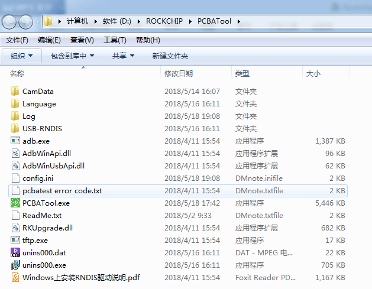

<center> Figure 1-1 PCBA Tool Installation </center>

Note：
The “CamData” directory is used to save a frame of a picture captured by camera in camera test, and save as bmp format. But it is not included in RK3308.

The “Language” directory: stores language configuration file of the tool.

The “Log” directory: store various log files during the tool test process to facilitate for troubleshooting later.

The “Config.ini”: a tool configuration file that records configuration information, language configuration, and other configuration information of the tool.

**Note:**
If you specify a custom installation directory, please make sure the path use full English name to avoid the problem of using ADB tool fail with non-English path.

### Test Tool Introduction

Figure 1-2 shows the main interface of the PCBA test tool


<center>Figure 1-2  PCBA Tool Interface</center>

As shown in the above figure, the PCBA Tool mainly included five parts.

- The first part is device information. When starting test, the device name and device MAC address  are obtained;

- The second part is used to set test items and control start and stop of tests, and buttons for judging whether to pass of the manual test items or not;

- The third part is the display bar of test items, which will display the test type and test results;

- The fourth part is the information display bar during the test of each test item, which will display the test process and results;

- The fifth part is the device connection status. If the tool detects that the device is available (identified as ADB device), a green button is displayed, otherwise it is displayed as an orange button.

### Test Items Configuration

Click the setting button on the main interface of the tool or press F2 shortcut key to pop up the configuration item settings dialog, as shown in Figure 1-2. After selecting some test items, click OK button to display in test item bar described in the third part above, and the test type will be displayed according to the test type (automatic or manual test) defined by each test item.
Currently, the configuration items supported by RK3308 platform are: SD card test, WIFI test, Bluetooth test, DDR test, ring MIC test, USB host test, led test, playback test, recording test, button test, PDM MIC test, Audio Line In test, SPDIF IN/OUT test, etc., and additional test items can be added later.
Other test items of Rockchip platform can be configured according to requirements and hardware development board conditions.

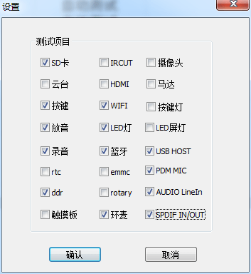

<center>Figure 1-3  PCBA Test Items Configuration Dialog</center>

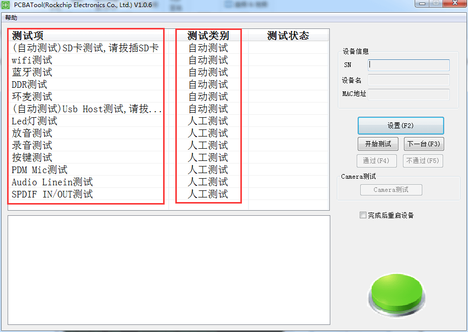

<center>Figure 1-4  PCBA Configuration is Completed</center>

#### Test Items Introduction

1. WiFi test: automatic test item. When testing WiFi, device will automatically scan the neighboring WiFi hotspots and determine whether it is successful or not according to the scan result.

2. Bluetooth test: automatic test item. When testing Bluetooth, device will automatically turn off the Bluetooth device first, then re-enable Bluetooth, activate Bluetooth after loading firmware, and according to whether the Bluetooth control interface hci0 is successfully enabled and whether there is a Bluetooth hardware address to determine whether it is successful or not.

3. DDR test: automatic test item, when testing DDR, it will automatically read DDR capacity of the device, according to whether the read is correct or not.

4. SD card test: automatic item test, when testing SD card, it will run the test script. When inserting a SD card, it will test whether there is a device node or not: if there is, automatically mount the SD card to the specified file directory and the SD card capacity will also be recorded. If the device node is not be detected within 60s timeout, it will automatically exit with an error.

5. USB Host test: automatic item test, when testing USB Host function, the test script will be running, when a USB host device is inserted, it will test whether there is a device node or not, if there is, automatically mount the host device to the specified file directory, the device capacity will also be recorded. If the device node is not be detected within 60s timeout, it will automatically exit with an error.

6. LED test: manual test items, when testing LED, device lights red for the first round, lights green for the second round and lights blue for the third round. In the fourth round, three colors are integrated into white lights. It is necessary to manually judge whether the test is successful or failed according to whether each light is normally on. Click pass or not pass to skip to the next test item.

7. Playback test: manual test item, when testing playback function, it will play the audio data stored in the specified position of the device. It is necessary to manually determine it is successful or failed of the test according to the audio, and click pass or not pass button to skip to the next test item.

8. Recording test: manual test item, when testing the recording function, device will cyclically record a piece of audio collected by the current microphone. Then play the recorded audio through the device. It is necessary to manually determine it is successful or failed of the test based on the played audio. Click pass or not pass button to skip to the next test item.

9. Button test: a manual test item, when testing a button, you need to manually press the button, if the device detects a button is pressed, the tool will prompt a button of a certain name, if all the board-level measurable buttons have been press and the tool will pop up a window to remind you that the test is successful after passing, otherwise the test is failed. The test results need to be judged manually, click pass or not pass button to skip to the next test item.

10. PDM MIC test: manual test item to test whether the PDM MIC function is normal. It is necessary to manually determine it is successful or failed of the test according to the played audio, and click pass or not pass button to skip to the next test item.

11. Audio Line in test: a manual test item, insert an audio line device into  the board, play music out, you need to manually determine it is successful or failed of the test according to the sound played by the speaker, click pass or not pass button to skip to the next test item.

12. SPDIF IN/OUT test: a manual test item.

#### Test Process Introduction

**Step1**: after the PCBA test tool is properly installed, start the tool. If the green button icon is displayed in the bottom right corner of the tool, it indicates that the ADB device connected to the PC has been correctly scanned. If the device connection is unsuccessful, an orange button icon will appear in the bottom right corner of the tool to indicate that the current device is not available.

**Step2**: click [Setting] button to open the selection window of the test item and select items to be tested. Click [OK], test list bar of the main window of the tool will display a list of items to be tested. The configuration of this selection will also be saved in the config.ini file in the installation directory of the PCBA test tool. The configuration file of the test item is shown in Figure 1-5. The red boxes indicate that the test item are selected. It will be loaded by default next time the tool is started.


<center> Figure 1-5  PCBA Test Tool Configuration File </center>

**Step3**: after clicking [Start Testing] button, firstly, test all the automatic test items and the first manual test item at the same time; the automatic test items do not need to click [pass] or [not pass]. See the following figure 1-6.


<center> Figure 1-6  PCBA Start Testing </center>

**Step4**: manual test items are single item test. After each test is completed, you have to click [pass] or [not pass] to finish the current test item, and then enter the next test item. Except button test, in which the detailed button name will be displayed in the information prompt window (need to be specified by the program of device). After the test is completed, a window will prompt, and other test items need to be manually judged to pass or not.


<center> Figure 1-7  PCBA Button Test</center>

#### Camera Test Item

Camera test is a special item, so it will be introduced in details here. Due to platform differences, camera testing is supported differently depending on platforms. The PCBA test tool has already judged this item according to platform situation. If the current platform does not support the camera test item, the “Camera Test” button on the right side of the tool interface will be grayed and invalid. This section can be skipped; if supported, the button will display normally.


The Dev_Plateform variable in the Config.ini file provides the platform definition. If the variable is not assigned, the “camera test” button will be displayed normally, but pressing the button may result in an error due to unsupported platform, and the function is not available.

It is going to describe related bin programs are used in the Camera test:

- **V4l2_test**: used to capture a frame of data from the camera stream and write to a file. The related source code is in the `./external/rk_pcba_test/camera_api` directory.

- **nv12_to_bmp_main**: it is used to convert the nv12 data format file saved by V4l2_test bin program into bmp format for PCBA tool display on PC. It needs to co-work with the `libyuv.a` static library. The related source code is in `./external/libyuv`.

#### Reboot Items

On the right side of the tool interface, the option “reboot the device after completion” is designed for the platform with large-capacity and dual-system. In order to prevent wrong clicking during factory test, password input function is designed. Only when inputting correct password, this item can be enabled. Otherwise, is not enabled by default. The password can be obtained from our FAE. And it has been fixed and written in the tool and cannot be changed.

Double rootfs system, such as A/B system, system_a is used to update pcba_rootfs.img, system_b is used to update normal system img firmware by default. When this option is selected, if all configured test items are passed, it will reboot into the normal system. In contrast, other single-system platforms still enter the rootfs file system for PCBA testing after rebooting.

### Further Development Guide

It is easier that if the PCBA test tool needs to do further development to expand test items: you only need to add your own test items on the PCBA test tool according to the following steps.

#### Development Process Introduction

- Install the software development environment VS2008 (with the SP1 patch).

- Open the source code project, add a new test item in the `IDD_SETTING_DIALOG` dialog in the resource views, add a `CheckBox` control and rename the ID and caption.

- Add a test item string variable and whether select a Boolean variable to the `SettingBase.h` header file.

Defined in the `CIniSettingBase` class:

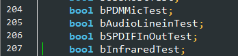


<center> Figure 1-8  Add a Test Item String Variable and Whether Select a Boolean Variable</center>

- The initialization assignment of these two variables is added to the `LoadToolSetting` interface in the `SettingBase.cpp` source code file. Please refer to the assignment of other test item variables.

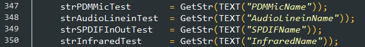


<center>Figure 1-9  Initialization Assignment of Variables</center>

- Add the test item name and whether it is configured by default in the Config.ini file.

Take the SD card test item as an example, as shown in Figure 1-8.

SdcardName is the variable name of the SD card test item, echo_sdcard_test is the name of the bin program running on the board.

The SdcardTest variable indicates the default selection state, 0 means not selected by default, and 1 means selected by default. The values of these two variables will be parsed in the code.


<center>Figure 1-10  PCBA config.ini Variable</center>

- The Chinese and English characters of the corresponding test items are added to the language configuration file `Chinese.ini /English.ini` to display in the software interface. Also take the SD card test item as an example:

  Add Chinese display to the test item according to the ID number of the newly added test item.

  \[DIALOG_129]: 129 indicates the `IDD_SETTING_DIALOG` dialog resource ID.

  BUTTON_1010: 1010 indicates the resource ID of the SD card test item, the content after the equal sign is going to display the name “SD card” on the software interface.

**Note:**

**The resource ID can be found in the VS project: open resource.h to obtain the ID number of a specific dialog box or check box.**

The `echo_sdcard_test` is consistent with the value of the `SdcardName` variable in `config.ini`. The content after the equal sign is the string displayed on test item list box of the software interface.

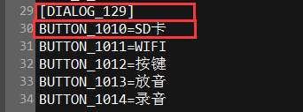


<center>Figure 1‑11  PCBA Chinese.ini Variable </center>

- `PcbaTest.cpp` source file and `PcbaTest.h`: add test interfaces for new test items.


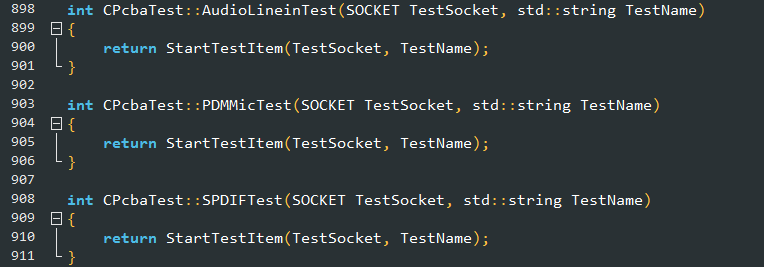

<center>Figure 1-12  Add Test Interfaces for the New Test Item</center>

- `IPSearchDlg.cpp`source code file:

The `initTestCase` interface adds the code to select the new test item, please refer to other test item codes.

For example：

```shell
if (m_Configs.bCpuTest) {
TestCase.TestName = m_Configs.strCpuTest;
TestCase.bAuto = true;
TestCase.bTestLoop = true;
TestCase.nTestStatus = TEST_UNDO;
m_TestCaseList.push_back(TestCase);
}
```

The `DoTestItem`Interface adds the code to select and execute the new test item code, please refer to other test item code.

For example：

```shell
else if (strTestName.compare(m_Configs.strCpuTest) == 0)
{
 ret = m_DevTest.CpuTest(m_TestSocket, wstr2str(strTestName));
}
```

**Note:**

**The TestCase structure is defined as shown below:**

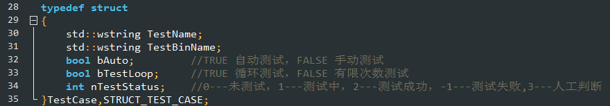

<center>Figure 1-13  Detailed Definition of Test Item Structure</center>

- In the source code of  `ConfigDlg.cpp`:

Add the selected status of getting test item check box in  `BOOL CConfigDlg::OnInitDialog()` .

For example：

```shell
((CButton*)GetDlgItem(IDC_CHECK_CPU))->SetCheck(m_Configs.bCpuTest	?BST_CHECKED: BST_UNCHECKED);
```

Add the setup code for the test item's default selection state in the `Void CConfigDlg::OnBnClickedBtnOk()`.

For example：

```shell
m_Configs.bCpuTest		 = (((CButton*)GetDlgItem(IDC_CHECK_CPU))->GetCheck() == BST_CHECKED);
```

At this point, the new test items are finished after compiling without error. Run the tool, breakpoint debugging and trace under DEBUG mode to quickly locate whether the new test item code is running normally.

#### Package and Release the Tool

**Install Inno Setup**

Inno Setup is a free executable software under windows that is small and simple. Software download address:  [inno setup download address](http://www.jrsoftware.org/).

**PCBATool_package**

PCBATool_package is the directory where the package tools are stored. The PCBA executable program and the ini configuration file to be released after successful compilation, the supported language configuration files, and the tool dynamic library dll used by the tool are stored in this directory. Open pcbatool_setup.iss which is the configuration file of Inno Setup. After modifying the necessary APP information, execute “Run” (F9 shortcut key). After running correctly, it will generate packaged installation files in the same level output directory of PCBATool_package directory. And it will run the installation process at the same time, if no need to install, click the cancel button; if needed, execute the installation process.

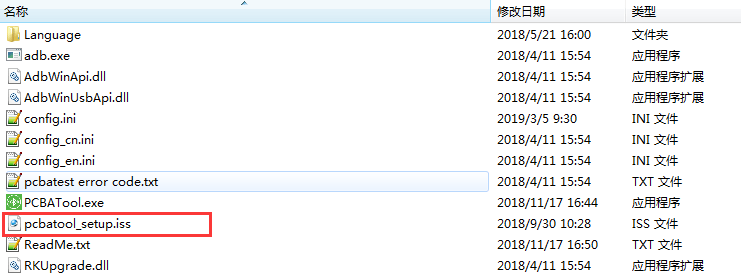

<center>Figure 1‑14  List of PCBATool_package Directory</center>


<center>Figure 1-15  Details of Info Setup Compiler Edit the Packable Tool</center>

### Source Code Obtaining

If you need to further develop the PCBA test tool, the source code can be obtained from our FAE.

## PCBA Software Design Guide

### Design Block Diagram

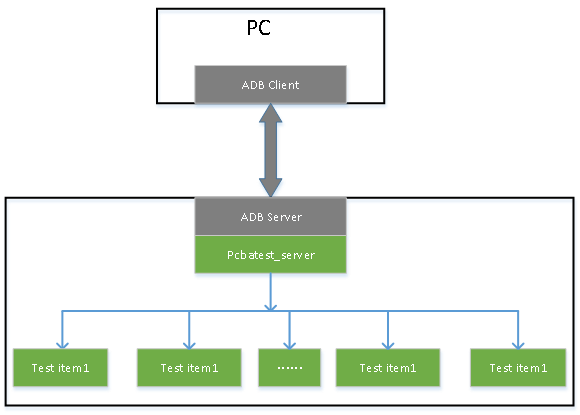

<center>Figure 2-1  Variables of PCBA Design Block Diagram</center>

1. The test tool communicate with the device through ADB protocol.

2. Each test program is an independent process and does not affect each other.

### Design Process

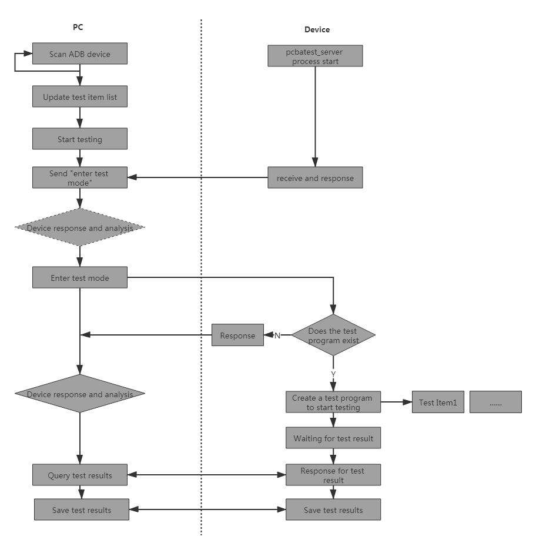

<center>Figure 2-2  Variables in the PCBA Test Flow Diagram</center>

### PCBA Command and Protocol Format

The PCBA test tool and device exchange data by socket through ADB protocol.

The command interaction protocol format between the PCBA test tool and the device will be described below.

PC sends a command to the device, and the device responds to the PC:

The format of the command is as follows:

Command:\<TYPE\>\<TEST_ITEM\>\<CMD\>\<MSG\>

Table 2-1 describes the meaning of each parameter.

| command format | TYPE | TEST_ITEM  | CMD            | MSG      |
| -------- | ---- | ---------- | -------------- | -------- |
| format introduction | type | the name of test item |detailed execution command | extra information |

<center>Table 2-1 Command Introduction</center>

The format of the response command is as follows:

Response: \<TYPE\>\<TEST_ITEM\>\<RES\>\<MSG\>\<STATUS\>\<RESULT\>\<ERR_CODE\>

| command format | TYPE | TEST_ITEM | RES | MSG | STATUS | RESULT | ERR_CODE |
| -------- | ---- | --------- | ---- | -------- | ------ | -------- | -------- |
| **format introduction** | type | the name of test item | response| extra information | status | result  | error code |

<center>Table 2-2 Response Command</center>

The values and meanings of each parameter are described in details below.：

**TYPE Command:**

| **values** | **CMD**              | **RES**            |
| -------- | -------------------- | ------------------ |
| **Note** | PC sends a command to device. | device responds to the command to the PC |

<center>Table2-3 Parameter Value and Definition of TYPE Command</center>

**TEST_ITEM Command**：

| **values** | **KEY_test**<br/>**SDCard_test** <br/>**AUDIO_test**  **HDMI_test<br/>** **CAMERA_test** <br/> **USB_HOST_test**  **LED_test**  <br/>**……** |
| -------- | ------------------------------------------------------------ |
| **Note** | 1. “TEST ITEM” is the detailed test item, and the test item name <br/>should be the same as the test program name. <br/>2. Test item extensions supporting should be considered. |

<center>Table 2-4 Parameter Value and Definition of TEST_ITEM command</center>

**CMD/RES Command:**

| **values** | **ENTER**                       | **EXIT**                        | **START** | **SAVE**     | **QUERY**    |
| -------- | ------------------------------- | ------------------------------- | --------- | ------------ | ------------ |
| **Note** | enter test mode<br/>(without test items) | exit test mode<br/> (without test items)<br/> | start testing | save test results | query test status |

<center>Table 2-5 Parameter Value and Definition of CMD/RES command</center>

**MSG Command:**

| **values** | **msg**                                                      |
| ---------- | ------------------------------------------------------------ |
| **Note**   | The data sent by command or the data uploaded by response. If there is no data, the option is not sent. |

<center>Table 2-6 Parameter Value and Definition of MSG command</center>

**STATUS Command**: device needs to response every command sent from PC.

| **values** | **ACK**             | **NAK**         |
| ---------- | ------------------- | --------------- |
| **Note**   | response successful | response failed |

<center>Table 2-7 Parameter Value and Definition of STATUS command </center>

**RESULT Command**: PC sends “QUERY” command to query test result, and the device needs to return the test result to PC.

| **values** | TESTING | PASS            | FAIL        | VERIFY         | PRESS                        |
| ---------- | ------- | --------------- | ----------- | -------------- | ---------------------------- |
| **Note**   | in test | test successful | test failed | finish testing | only used in the button test |

<center>Table 2-8 Parameter Value and Definition of RESULT command</center>

**ERR_CODE Command**:：

| **values** | **err_code**                                                 |
| :--------- | ------------------------------------------------------------ |
| **Note**   | The reason for test failure, successful test without sending this option 0x01-0xFF error code |

<center>Table 2-9 Parameter Value and Definition of ERR_CODE command</center>

The following examples show the usage of the above commands:

1. Enter pcba test mode

Enter test mode:{"TYPE":"CMD", "CMD":"ENTER"}

Enter test mode response:

Correct：{"TYPE":"RES", "RES":"ENTER", "STATUS":"ACK"}

Wrong：{"TYPE":"RES", "RES":"ENTER", "STATUS":"NAK", "ERR_CODE":"err_code"}

2. Exit pcba test mode

Exit pcba test mode:

{"TYPE":"CMD", "CMD":"EXIT"}

Exit test mode:

{"TYPE":"RES", "CMD":"EXIT"，"STATUS":"ACK"}

{"TYPE":"RES", "RES":"EXIT", "STATUS":"NAK", "ERR_CODE":"err_code"}

3. Take the button test item as an example: other test items are similar

Start testing

{"TYPE":"CMD", "TEST_ITEM":"KEY-TEST", "CMD":"START"}

Enter test mode response:

{"TYPE":"RES", "TEST_ITEM":"KEY-TEST", "RES":"START", "STATUS":"ACK"}

{"TYPE":"RES", "TEST_ITEM":"KEY-TEST", "RES":"START", "STATUS":"NAK", "ERR_CODE":"err_code"}

4. Query test status

{"TYPE":"CMD", "TEST_ITEM":"test_item", "CMD":"QUERY" }

Response to query status:

Error response: {"TYPE":"RES", "TEST_ITEM":"test_item", "RES":"QUERY", "MSG":"msg", "STATUS":"NAK", "ERR_CODE":"err_code"}

In test:{"TYPE":"RES", "TEST_ITEM":"test_item", "RES":"QUERY", "MSG":"msg", "STATUS":"ACK", "RESULT":"TESTING"}

Test pass: {"TYPE":"RES", "TEST_ITEM":"test_item", "RES":"QUERY", "MSG":"msg", "STATUS":"ACK", "RESULT":"PASS"}

Test result confirmation: {"TYPE":"RES", "TEST_ITEM":"test_item", "RES":"QUERY", "MSG":"msg", "STATUS":"ACK", "RESULT":"VERIFY"}

Test failed:{"TYPE":"RES", "TEST_ITEM":"test_item", "RES":"QUERY", "MSG":"msg", "STATUS":"ACK", "RESULT":"FAIL", "ERR_CODE":"err_code"}

A button is pressed: {"TYPE":"RES", "TEST_ITEM":"key_test", "RES":"QUERY", "MSG":"msg", "STATUS":"ACK", "RESULT":"PRESS"}(this response is only for button testing)

## Code Framework for PCBA Testing

### Code Framework

The PCBA test code is a binary program of some test items executed on the device and can be run separately. The test program is located in the project source directory `/extenal/rk-pcba-test`, and the structure is shown as follows:

```
├── audio_test.h
├── bt_test.h
├── cJSON
│   ├── cJSON.c
│   └── cJSON.h
├── CMakeLists.txt
├── common.h
├── cpu_test.h
├── ddr_test.h
├── echo_audio_play_test.c
├── echo_audio_record_test.c
├── echo_audio_test.c
├── echo_auto_test.c
├── echo_bt_test.c
├── echo_cpu_test.c
├── echo_ddr_test.c
├── echo_discovery.c
├── echo_emmc_test.c
├── echo_key_test.c
├── echo_led_test.c
├── echo_pcbatest_server.c
├── echo_ringmic_pdm_test.c
├── echo_ringmic_test.c
├── echo_rotary_test.c
├── echo_rtc_test.c
├── echo_sdcard_test.c
├── echo_touchpad_test.c
├── echo_usbhost_test.c
├── echo_wlan_test.c
├── emmc_test.h
├── key_test.h
├── led_test.h
├── mic_test_Linux
│   ├── Makefile
│   ├── record_test.c
│   ├── record_test.h
│   ├── vibrate_test.c
│   └── vibrate_test.h
├── pcbatest_server.h
├── rk_pcba_test
│   ├── audio_test_start.wav
│   ├── rectest_400hz.wav
│   ├── sdcard_test.sh
│   ├── usbhost_test.sh
│   ├── vibration.wav
│   └── wifi.sh
├── rk_pcba_test_led.h
├── rtc_test.h
├── tinyalsa
│   ├── asoundlib.h
│   ├── pcm.c
│   ├── tinycap.c
│   └── tinyplay.c
└── wlan_test.h
```

### Code Framework Introduction

When a device are in PCBA testing, the device is used as a server in TCP, and the PC is used as a client; the interaction between device and PC are mainly showed in the `echo_pcbatest_server.c` code. The interaction process between device and PC in `echo_pcbatest_server.c` is shown in the following figure:


<center>Figure 3-1 Test Code Framework on the PCBA Device Side</center>

### Firmware Generation

At present, the PCBA test program can be compiled in two ways. One is to generate a rootfs firmware separately by PCBA test configuration, and download into the rootfs partition separately. After the system starts, it will directly enter PCBA test environment. At this time, the connection will connect the device to PC, and the PCBA test tool can be used to test. The other way is to integrate the PCBA test program into the recovery mode to test, and write the special PCBA test command in the misc to start the PCBA test program. After the test is finished, the PCBA test command in the misc is cleared, and the system will enter the normal system after rebooting.

There are advantages and disadvantages to both ways. When memory is limited, you can choose the first one. The disadvantage is that you need to download the rootfs partition twice, download the firmware of the PCBA test at a time, and then download the normal system firmware after completion. When memory is sufficient, you can choose the second way, and the test is automatically restarted to enter the normal system after the test is completed and no need to download the firmware again.

#### Generate rootfs Firmware Separately

- The PCBA test program for RK3308 EVB boards are compiled as follows:

Configure `buildroot/configs/rockchip_rk3308_pcba.defconfig`

See the configuration as shown below:

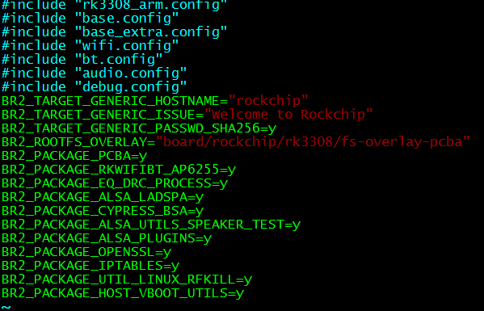

<center>Figure 3-2  PCBA Default Configuration</center>

Execute in the project directory:

```
./build.sh pcba
```

After compiling successfully, you can see the generated firmware  `rootfs.cpio`,  `rootfs.cpio.gz`,  `rootfs.ext2`,  `rootfs.squashfs`  in the `buildroot/output/rockchip_rk3308_pcba/images/` directory.

Download the firmware rootfs.squashfs into the rootfs partition through the upgrade tool.

Connect the device to PC and start the PCBA test tool to begin test. After all the test items have been passed, you need to download the rootfs firmware of a normal system to the rootfs partition again, so that device can enter the normal system.

**Compilation methods of PCBA test program of RK other platform development boards**

1. In the similar way of RK3308 compilation method described above. If the pcba configuration file rockchip_rkxxxx_pcba.defconfig (xxxx is the name of RK chip) of the corresponding platform is not found in the `buildroot/configs/` directory, you can copy one defconfig configuration file compiled by normal rootfs system under `buildroot/configs/` directory as a base, and then add PCBA configuration items and other configuration items needed for testing. As shown in Figure 3-2, the include items are necessary configuration options for compiling normal rootfs. After that, `BR2_ROOTFS_OVERLAY` and `BR2_PACKAGE_PCBA` are necessary configuration items for PCBA testing. Others items should be configured according to test items and hardware models. It is also possible that these options have been included in the configuration file of a detailed module.

2. The `BR2_ROOTFS_OVERLAY` configuration item specifies some files that need to be overlaid when compiling. Please refer to RK3308 related configurations. If there is no fs-overlay-pcba directory, create one in the corresponding board/rockchip/rkxxxx/ directory and copy the corresponding directory in RK3308 file. The most important thing is that RkLunch.sh is placed in the data/ directory. The script will eventually be added to the etc/init.d/S98_lunch_init boot file to run the PCBA test service as soon as it is powered on.

3. After adding the `rockchip_rkxxxx_pcba.defconfig` configuration file and executing `source envsetup.sh` in the SDK root directory, a new lunch menu will be automatically generated, select the pcba configuration combo number of the corresponding chip platform, and then `make pcba` to start compiling, if there is any modification in pcba code or adding/removing some configuration items, execute `make pcba-dirclean`, and then `make pcba-rebuild`.

4. Run `./build.sh pcba`, If successful, PCBA rootfs firmware will be generated in the `buildroot/output/rockchip_xxxx_pcba/images` directory. This firmware is just a normal rootfs test program added PCBA. Download a rootfs firmware with a normal rootfs system firmware size, which is not only pcba.img, may be one of rootfs.ext2, rootfs.ext4, and rootfs.squashfs. You need to make a selection based on the filesystem type of the specific rootfs.

**Note:**

1. You need to modify the `buildroot/package/rockchip/partinit/partinit.mk` file and delete `ln -s userdata data`. This soft link will link userdata to the data directory, causing the pcba test program to be overwritten by userdata partition. If you need this soft link, you need to modify the mk file of pcab and install the pcba test program to other directory.

#### Compile into Recovery

In order to facilitate PCBA test and finish PCBA test by only flashing firmware once and the machine can be reboot to enter the normal system after the test is completed. The PCBA test program can be integrated into the recovery mode for testing.

If you need to update the misc partition for the first time (there is a the special command to enter the PCBA test in the misc partition), start the PCBA test, the detailed commands are shown in Figure 3-7, the misc.img content can be modified by UE or other hex editor.

**The PCBA test program of RK3308 EVB board is compiled as follows:**

The detailed PCBA configuration file is shown in Figure 3-3 below.

The configuration file is located in:

`/buildroot/configs/rockchip/pcba_test.config` root directory.


<center>Figure 3-3  Detailed PCBA Configurations in Recovery</center>

**Note:**

**Items in this configuration may only be suitable for RK3308 platform project, if it is other platform, some of the configurations may be added or deleted according to the needs of the platform, so as to adapt the hardware and software configuration of the platform.**

Recovery  configuration：(recovery configuration directory: `buildroot/configs/rockchip_rk3308_recovery_defconfig`)


<center>Figure 3-4  Detailed Configuration of Recovery</center>

As seen from the above figure, the detailed configuration of PCBA is included in the recovery configuration file.

Execute in the project root directory:

```shell
./build.sh recovery
```

The executable file after compiling are shown below:

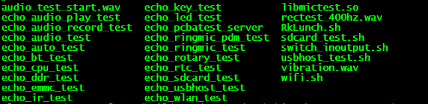

<center>Figure 3-5  Compilation Result of the PCBA Test Item Code</center>

Due to the different hardware design, customers need to modify the test item code in the `exteral/rk_pcba_test` according to your own board level configuration. The code provided in the SDK is only adapted for RK EVB boards, and some test item codes may not be adapted to customized hardware. If you modify the PCBA test code of device, please execute the following command in the SDK project root directory after modifying the code：

```shell
make pcba-rebuild
```

Then execute `./build.sh recovery`，will generate ecovery.img in the `./buildroot/output/rockchip_rk3308_recovery/images/` directory:

Execute the following command in the root directory:

```sehll
./mkfirmware.sh
```

To generate all partition firmware under the root directory `rocketdev/`.

Download the firmware recovery.img into the recovery partition.

PCBA compilation methods of other platforms refer to the documentations of each platform.

Notice:

1. The fstab in the root directory `/buildroot/board/rockchip/rk3308/fs-overlay-pcba/etc` is not needed, for which will overwrite the fstab generated by partinit, causing the recovery mode to be abnormal.

```shell
~/3308/buildroot/board/rockchip/rk3308/fs-overlay-pcba/etc $ ls
asound.conf  init.d  inittab  profile.d
```

2. The `buildroot/package/rockchip/partinit/partinit.mk` file should be modified and   `ln -s userdata data`should be deleted, this soft link will link userdata to the data directory, causing the pcba test program to be overwritten by the userdata partition. If you need this soft link, you need to modify the pck mk file and install the pcba test program to other directories.

3. You need to modify `buildroot/package/rockchip/pcba/Config.in` and `pcba.mk` as follows:：


<center> Figure 3-6  Modification in pcba config and Makefile</center>

The modification removes the soft link of data directory to userdata in the recovery mode, otherwise it will affect audio playback function during booting of the normal system. Re-create the data directory and copy the binary program generated in the userdata directory to the data directory.

4. PCBA is tested in recovery. The misc partition needs to be downloaded with misc.img og pcba test command.

5. As shown in Figure 3-7, the command format of pcba in the misc:


<center>Figure 3-7  Command Format for PCBA Test in misc.img</center>

5. The “Reboot device after completion” item should be selected on the PCBA test tool. It will sent reboot information to the device after the test is completed and successful. After receiving the message, the device will clear the **factory_pcba_test** command in the misc partition and reset it to the wipe_all command which is used to format the user partition (userdata partition) in the next recovery mode and enter the normal system.

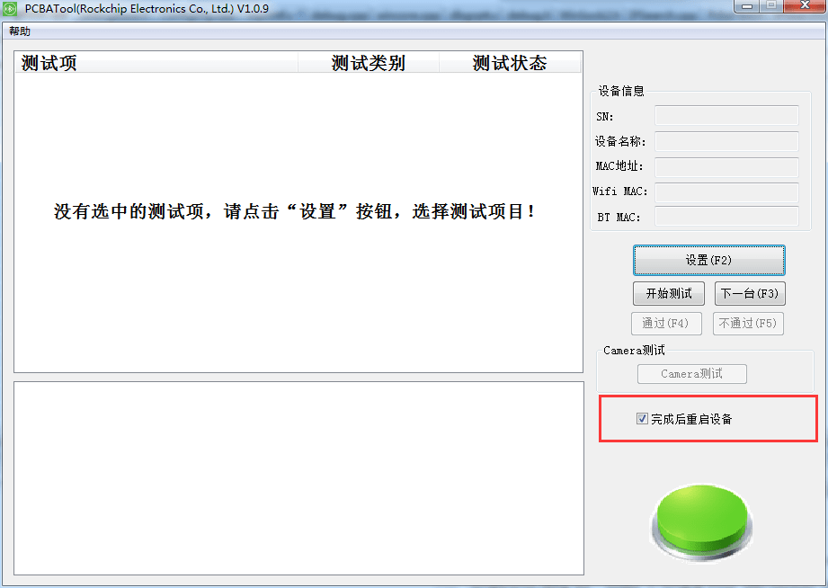

<center>Figure 3-8  Reboot Device Option of PCBA Test Tool</center>

6. Modify **echo_pcbatest_server.c**. When test pass, prepare to reboot the device.

The exit_pcba_test_mode interface as shown below, add recovery mode judgment and reset the factory command (write wipe_all command in misc), ready to reboot and then enter the recovery mode to format user partition and enter the normal system.


<center>Figure 3-9  Modification in the echo_pcbatest_server.c</center>

7. Problems that may be encountered in the recording test

If there are more than 2 channels in the PCBA recording test, for example, use the following command to record:

```shell
arecord -Dhw:0,0 -f S16_LE -r 48000 -c 4 /tmp/record.wav
```

4-channel recording was used here, but the result may be only 2 channels data. When this case happens, check the configuration in `Buildroot/configs/rockchip/audio.config`.

`BR2_PACKAGE_PULSEAUDIO=y` and `BR2_PACKAGE_PULSEAUDIO_DAEMON=y` should be turned off.

```shell
buildroot/configs$ git diff rockchip
diff --git a/configs/rockchip/audio.config b/configs/rockchip/audio.config
index 8cf1207..f23cb5a 100644
--- a/configs/rockchip/audio.config
+++ b/configs/rockchip/audio.config
@@ -8,8 +8,8 @@ BR2_PACKAGE_ALSA_UTILS_ALSACONF=y
 BR2_PACKAGE_ALSA_UTILS_AMIXER=y
 BR2_PACKAGE_ALSA_UTILS_APLAY=y
 BR2_PACKAGE_LIBMAD=y
-BR2_PACKAGE_PULSEAUDIO=y
-BR2_PACKAGE_PULSEAUDIO_DAEMON=y
+#BR2_PACKAGE_PULSEAUDIO=y
+#BR2_PACKAGE_PULSEAUDIO_DAEMON=y

 # Copy alas configs
 BR2_PACKAGE_ALSA_CONFIG=y
```

## PCBA Test with Screen

Some RK platforms support displaying with a screen. Therefore, for PCBA testing without computers, you can directly display PCBA test items and test results on the screen just like Android PCBA test running on other platforms of RK. This section will introduce the PCBA test in this case.

It will take PX3-SE platform as an example to describe the PCBA test under Linux system with screen in details. Due to platform differences, users should adjust the corresponding configurations according to their own platforms.

### Test Code

All PCBA test code and the code to display on the on screen are placed in the `external/rk_pcba_test` directory.

Modify cMakeList.txt according to the platform you chose.

```shell
if (DEFINED  PCBA_PX3SE)
add_definitions("-DPCBA_PX3SE")
endif()

if (DEFINED  PCBA_3308)
add_definitions("-DPCBA_3308")
endif()

if (DEFINED  PCBA_3229GVA)
add_definitions("-DPCBA_3229GVA")
endif()
```

According to the actual chip platform used, the corresponding platform-related macros are defined. Some unique test items can be added to this macro.

For example：

```shell
if (DEFINED  PCBA_PX3SE)
set(SRC_LIST echo_ringmic_test.c)
link_libraries(${CMAKE_CURRENT_SOURCE_DIR}/rk_pcba_test/libmictest.so)
add_executable( echo_ringmic_test ${SRC_LIST} )
endif()
```

If PX3-SE platform is defined, ring MIC test item is supported. Other platforms are similar.

The PCBA test code under Linux platform is similar to the PCBA test under Android platform. Use the configuration file `rk_pcba_test/test_config.cfg` to configure test items which need to be executed and displayed. For a specific test item, read the test module configuration example in `test_config.cfg`. If you need to add a customize test item yourself, you can also refer to a test case in the `rk_pcba_test/pcba_minui` directory as an example to expand your own test item code. Remember to add to `cMakeList.txt` to compile.

### Compilation and Configuration Introduction

Configuration files of PCBA package under Buildroot:

`buildroot/package/rockchip/pcba/Config.in`  file:

```shell
menuconfig BR2_PACKAGE_PCBA
        bool "rockchip pcba test"

if BR2_PACKAGE_PCBA
choice
        prompt "pcba test whether support screen"
        default BR2_PACKAGE_PCBA_NO_SCREEN
config BR2_PACKAGE_PCBA_SCREEN
        bool "pcba with screen"
        select BR2_PACKAGE_LIBDRM
        select BR2_PACKAGE_LIBPNG
        select BR2_PACKAGE_LIBPTHREAD_STUBS
        select BR2_PACKAGE_LIBZIP
        default n

config BR2_PACKAGE_PCBA_NO_SCREEN
        bool "pcba with no screen"
        default y

endchoice
endif
```

You can see that there are two optional configurations under the `BR2_PACKAGE_PCBA` menu, “pcba with no screen” and “pcba with screen”. “pcba with no screen” is used for PCBA test without screen by default, in other word set **BR2_PACKAGE_PCBA_NO_SCREEN=y** in configs.

If you need to support the PCBA test with screen, you need to select “pcba with screen”, if setting  **BR2_PACKAGE_PCBA_SCREEN=y**, `BR2_PACKAGE_LIBDRM`, `BR2_PACKAGE_LIBPNG`, `BR2_PACKAGE_LIBPTHREAD_STUBS` and `BR2_PACKAGE_LIBZIP` libraries will be selected by default.

buildroot /package/rockchip/pcba/pcba.mk introduciton:

```shell
PCBA_SITE = $(TOPDIR)/../external/rk_pcba_test
PCBA_SITE_METHOD = local

ifeq ($(BR2_PACKAGE_RK3036_ECHO),y)
PCBA_CONF_OPTS = -DPCBA_3036=ON
endif

ifeq ($(BR2_PACKAGE_PX3SE),y)
ifeq ($(BR2_PACKAGE_PCBA_SCREEN),y)
PCBA_CONF_OPTS = -DPCBA_WITH_UI=ON
PCBA_DEPENDENCIES = zlib libpthread-stubs libpng libdrm
endif

PCBA_CONF_OPTS += -DPCBA_PX3SE=ON
endif

ifeq ($(BR2_PACKAGE_RK3308),y)
PCBA_CONF_OPTS = -DPCBA_3308=ON
endif

ifeq ($(BR2_PACKAGE_RK3229GVA),y)
PCBA_CONF_OPTS = -DPCBA_3229GVA=ON
endif

define PCBA_INSTALL_INIT_SYSV
$(INSTALL) -d -m 0755 $(TARGET_DIR)/data
$(INSTALL) -D -m 0755 $(@D)/rk_pcba_test/* $(TARGET_DIR)/data
endef

$(eval $(cmake-package))
```

The .mk file defines the corresponding PCBA configuration macro based on the definition of the platform configuration in the configuration file in configs.

```shell
ifeq ($(BR2_PACKAGE_PX3SE),y)
ifeq ($(BR2_PACKAGE_PCBA_SCREEN),y)
PCBA_CONF_OPTS = -DPCBA_WITH_UI=ON
PCBA_DEPENDENCIES = zlib libpthread-stubs libpng libdrm
endif
PCBA_CONF_OPTS += -DPCBA_PX3SE=ON
endif
```

Note: if PX3-SE platform is defined, that is, `BR2_PACKAGE_PX3SE=y`, and the PCBA test with screen display is configured, that is, `BR2_PACKAGE_PCBA_SCREEN=y`, the configuration item of PCBA defines `PCBA_WITH_UI`, and define the dependent libraries zlib libpthread-stubs libpng libdrm at the same time. As long as PX3-SE platform is defined, the configuration items will define the **PCBA_PX3SE** macro.

Note: **PCBA_CONF_OPTS and PCBA_DEPENDENCIES** here are a unique syntax in the mk file.

 If your platform needs to support PCBA test with screen, follow the definition of other platforms in the pcba.mk file, and add the definition of your platform.

Key configurations of  `configs/rockchip_px3se_pcba_defconfig` are as follows:

```shell
......
BR2_PACKAGE_ROCKCHIP=y
BR2_PACKAGE_PX3SE=y
BR2_PACKAGE_PCBA=y
BR2_PACKAGE_PCBA_SCREEN=y
......
```

### Execution

Please refer to  `board/rockchip/px3se/fs-overlay-pcba/data/RkLunch.sh`

```shell
#! /bin/sh
if [ -f "pcba-core" ]; then
pcba-core &
fi

echo_pcbatest_server &
echo_auto_test echo_wlan_test &
echo_auto_test echo_bt_test &
echo_auto_test echo_ddr_test &
echo_auto_test echo_emmc_test &
echo_auto_test echo_rtc_test &

board/rockchip/px3se/fs-overlay-pcba/etc/init.d/S98_lunch_init
source /etc/profile.d/RkEnv.sh

case "$1" in
  start)
        source /data/RkLunch.sh
        printf "insmod vcodec service...\n"
        insmod /system/etc/firmware/vcodec_service.ko
        ;;
  stop)
        printf "stop finished\n"
        ;;
  *)
        echo "Usage: $0 {start|stop}"
        exit 1
        ;;
esac
exit 0
```

Put `RkLunch.sh` in the boot initialization script to execute `pcba-core` and other boot test items in the background after booting.

## Appendix

### Summary of Common Errors

#### Opening PCBA Tool Error

As shown in Figure 5-1, the following error “Initialize RKupdate dll failed” is prompted when the tool is opened.


<center>Figure 5-1  Opening PCBA Tool Error</center>

**Analysis:**

This error is caused by a wrong file path configuration when installing the tool.

**Solution:**

As shown in the figure below, in the tool installation directory, open config.ini and modify the path LogPath and TestPath as the current tool installation directory.

For example, the tool installation path here is in the `D:\ROCKCHIP\PCBATool` directory.

Set LogPath= D:\ROCKCHIP\PCBAToo\Log\

Set TestPath=D:\ROCKCHIP\PCBAToo\test\

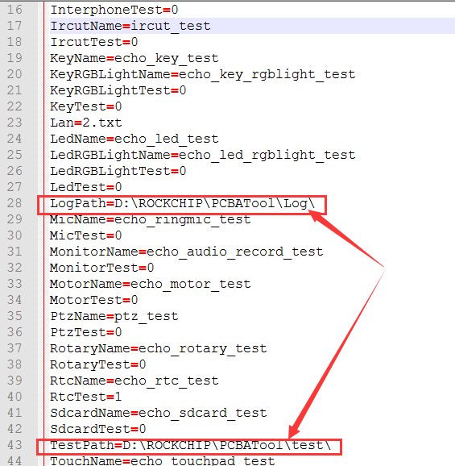

<center>Figure 5-2  pcba config.ini Configuration File</center>

#### Adb Forward Fail

As shown in Figure 5-3, the tool prompts “adb forward fail” after opening the tool:


<center>Figure 5-3  adb Forward Fail</center>

**Analysis:**

The reason for this problem may be that ADB recognizes multiple devices, causing the tool to fail to properly start the ADB program to start the service.

**Solution:**

Open a command window on PC, and cd to the adb tool installation path on the CMD window. Execute “adb devices” command to check whether there are multiple devices connected. If there are multiple devices connected to the PC, unplug other devices to solve this problems.

Or kill the adb service and re-open it.

Execute the following command in CMD command line:

```shell
adb kill-server
adb start-server
```

Try again later.

#### Unable to Connect Device under Window 10

If you run the PCBA test tool under Window 10, you may encounter an ADB device that is not properly connected to device. The reason for this problem is program is incompatibility with the system.

The solution is that try to open the test program using win7 compatibility mode.

**Right-click on the tool icon --> Properties --> Compatibility Tab --> “Run this program in compatibility mode”.**


<center>Figure 5-4  Device Cannot Be Connected Properly under Win 10 System</center>

#### Upload File Fail

If “upload file fail” dialog appears, it is because the test service program `echo_pcbatest_server` of the PCBA is not successfully running on the current system, causing the tool to try to push a binary from local ADB to device, but there is no this file in the  "test" directory of local tool installation directory, so this error dialog will be reported.

**Solution:**

please check the device configuration to ensure that:

1. There are “echo_pcbatest_server” and other test item bin programs are all in the /data directory of the device;

2. The PCBA test related service program and automatic test items are successfully started with the system.

