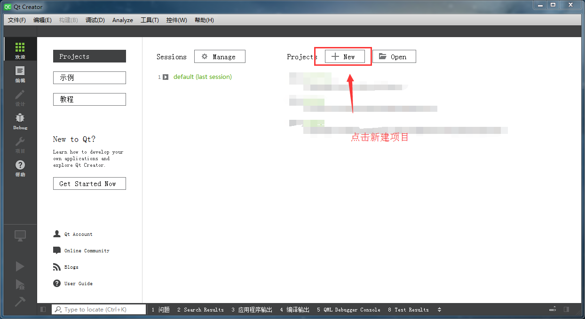
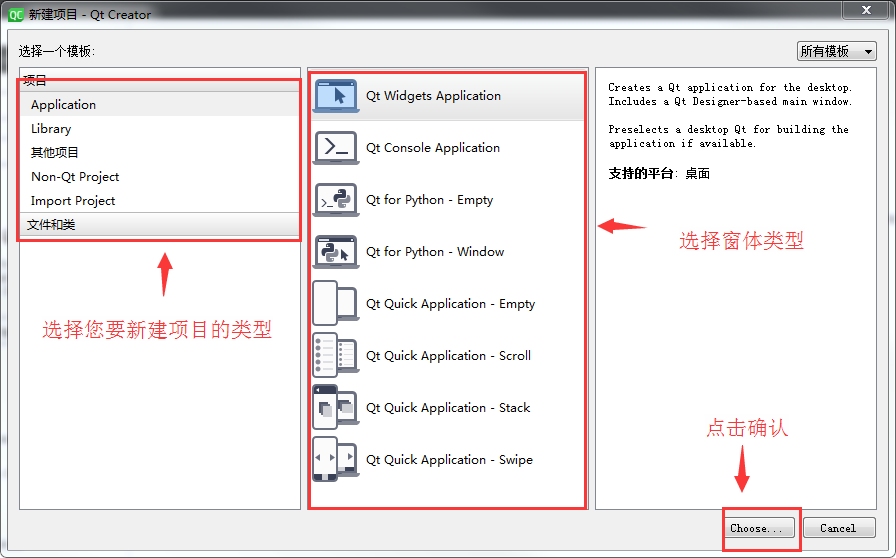
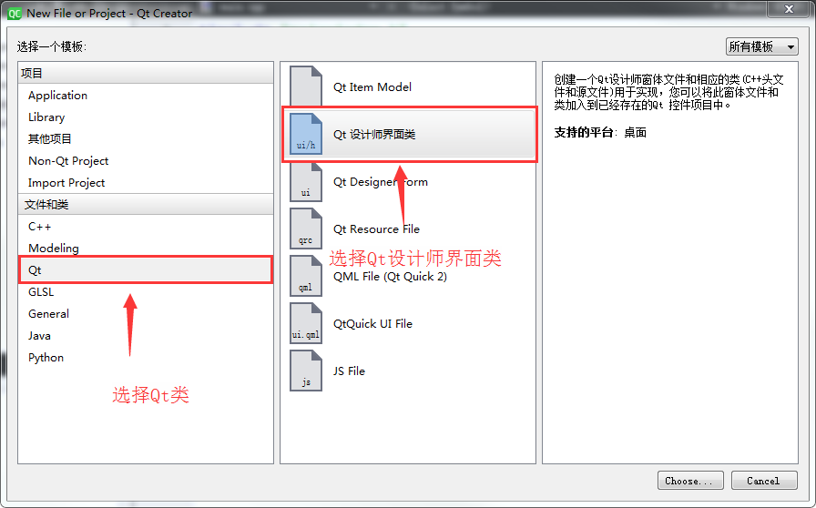
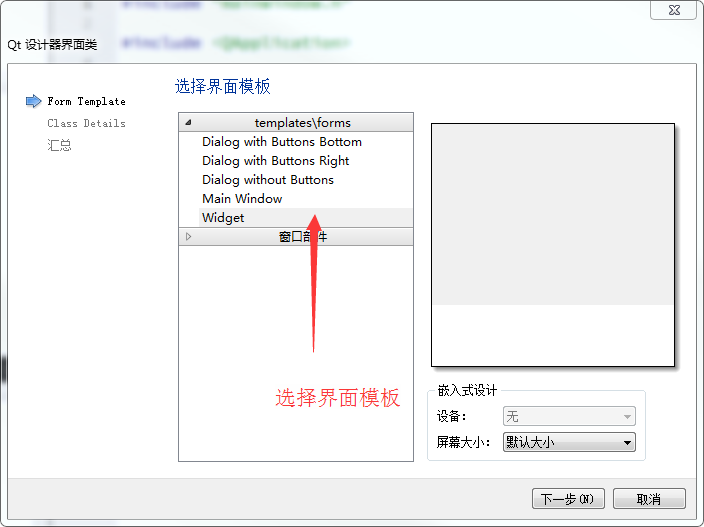
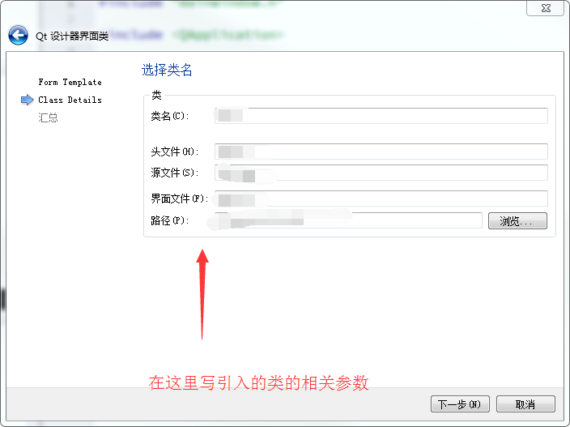
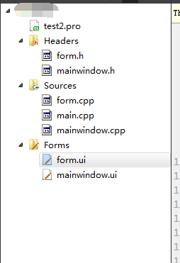

# Linux Qt 开发指南

文件标识： RK-SM-YF-340

发布版本：V1.2.0

日期：2020-06-28

文件密级：□绝密   □秘密   □内部资料   ■公开

**免责声明**

本文档按“现状”提供，瑞芯微电子股份有限公司（“本公司”，下同）不对本文档的任何陈述、信息和内容的准确性、可靠性、完整性、适销性、特定目的性和非侵权性提供任何明示或暗示的声明或保证。本文档仅作为使用指导的参考。

由于产品版本升级或其他原因，本文档将可能在未经任何通知的情况下，不定期进行更新或修改。

**商标声明**

“Rockchip”、“瑞芯微”、“瑞芯”均为本公司的注册商标，归本公司所有。

本文档可能提及的其他所有注册商标或商标，由其各自拥有者所有。

**版权所有 © 2020 瑞芯微电子股份有限公司**

超越合理使用范畴，非经本公司书面许可，任何单位和个人不得擅自摘抄、复制本文档内容的部分或全部，并不得以任何形式传播。

瑞芯微电子股份有限公司

Rockchip Electronics Co., Ltd.

地址：     福建省福州市铜盘路软件园A区18号

网址：     [www.rock-chips.com](http://www.rock-chips.com)

客户服务电话： +86-4007-700-590

客户服务传真： +86-591-83951833

客户服务邮箱： [fae@rock-chips.com](mailto:fae@rock-chips.com)

---

**前言**

**概述**

本文描述了Linux Qt的开发流程。

**产品版本**

| **芯片名称** | **内核版本** |
| ------------ | ------------ |
| K3036/RK3128/RK3326/RK3328/RK3399 | Linux 4.4  |

**读者对象**

本文档（本指南）主要适用于以下工程师：

技术支持工程师

软件开发工程师

**修订记录**

| **版本号** | **作者** | **修改日期** | **修改说明** |
| ---------- | --------| :--------- | ------------ |
| V1.0.0 | CJS | 2017-01-16 | 初始版本 |
| V1.1.0 | Nickey Yang | 2018-04-28 | 修订格式和内容 |
| V1.2.0   | Zack.Huang | 2020-06-28 | 整理内容和添加Qt creator章节 |

---

**目录**

[TOC]

---

## 1 Qt 介绍

Qt 是1991 年奇趣科技开发的一个跨平台的C++图形用户界面应用程序框架。它提供给应用程序开发者建立艺术级的图形用户界面所需的所有功能，同时良好的可扩展性也决定了Qt 程序的可发展性。目前Qt 支持的操作系统有:Windows、嵌入式Linux、MS/Windows - 95、98、NT4.0、ME、2000、XP、Vista 等，这意味着使用Qt 您只需一次性开发应用程序，无须重新编写源代码，便可跨不同桌面和嵌入式操作系统部署这些应用程序。

## 2 使用工具Qt Creator搭建Qt工程

Qt Creator 是一个用于Qt 开发的轻量级跨平台集成开发环境。与Qt 语言相辅相成，Qt Creator 能够跨平台运行，目前支持的系统包括Linux(32 位及64 位)，Mac OS X 和Windows。Qt Creator 的设计使得开发人员能够利用Qt 这个应用程序框架更加快速和轻易的开发任务。

另外，目前比较主流的Qt 开发方式除了Qt Creator IDE，还能利用Visual Studio+Qt 进行便携的开发，在Visual Studio 中下载安装Qt 插件，能很容易的部署起Qt 的开发环境。本套Demo 程序开发环境为Qt Creator。

### 2.1 新建工程

下面使用的是win7的32位Qt Creator作为例子来介绍Qt Creator的使用方法。

打开Qt Creator后出现如下图:



点击new后配置工程选项：



选择您工程的名称和保存路径：


之后一直点击下一步即可。创建成功后出现的界面：


### 2.2 使用图形化界面设计布局

Qt界面库的一大优点就是跨平台，您可以使用Qt Creator设计出好看的UI，然后移植进ARM的目标板上。下面介绍怎么使用Qt Creator来设计布局。Qt Creator的布局文件名为*.ui，一个项目必须要有ui文件,才可以使用图形化设计布局。新建一个ui文件;(文件->新建文件或项目)







创建好后出现UI编辑界面，如下图所示：


在这个界面上，您可以拖拽左边的控件来添加您窗体的控件，具体操作方法可以详见Qt Creatot官网<https://doc.qt.io>有丰富的教程。

### 2.3 工程源码结构介绍

在默认新建的项目中，会包含以下这4类文件：pro文件，cpp文件，h头文件，UI界面设计文件。



pro工程文件是qmake编译所需要的，具体编写方法见下文。cpp文件和h文件是c++的资源文件，ui文件是设计师设计界面文件，使用html语言来编写。

## 3 交叉编译Qt工程

### 3.1  Buildroot下构建QT工程

 在Buildroot中添加自己编写的Qt工程 ，下面介绍添加进Buildroot的方法。

在SDK/buildroot/package/目录下，新建您的工程文件夹，在文件夹中添加两个文件，`Config.in`和`项目文件名.mk`。

Config.in文件内容如下：

```shell
config BR2_PACKAGE_项目文件名
	bool "项目文件名"
	help
	  对于项目的介绍
```

项目文件名.mk的内容如下：

```makefile
################################################################################
#
# 项目名称
#
################################################################################

项目名称_VERSION = 1.0
项目名称_SITE = $(TOPDIR)/../app/项目文件夹                 //资源文件放的目录
项目名称_SITE_METHOD = local

项目名称_LICENSE = Apache V2.0
项目名称_LICENSE_FILES = NOTICE

define 项目名称_CONFIGURE_CMDS
        cd $(@D); $(TARGET_MAKE_ENV) $(HOST_DIR)/bin/qmake    //使用qmake
endef

define 项目名称_BUILD_CMDS
        $(TARGET_MAKE_ENV) $(MAKE) -C $(@D)      //编译命令
endef
（下同）
define ZACKTEST_INSTALL_TARGET_CMDS
        mkdir -p $(TARGET_DIR)/usr/share/applications $(TARGET_DIR)/usr/share/icon
        $(INSTALL) -D -m 0644 $(@D)/image/项目名称.png $(TARGET_DIR)/usr/share/icon/
        $(INSTALL) -D -m 0755 $(@D)/项目名称    $(TARGET_DIR)/usr/bin/项目名称
        $(INSTALL) -D -m 0755 $(@D)/项目名称.desktop    $(TARGET_DIR)/usr/share/applications/
endef

$(eval $(generic-package))
```

### 3.2 移植源码

在添加Buildroot后，您需要把您的工程资源文件夹添加到SDK中去编译，下面介绍添加源码的方法。

建议在SDK/app/目录下建立您的项目文件夹，在建立的项目文件夹中新建`项目名.pro`文件，内容如下：

```
#-------------------------------------------------
#
# 项目名称
#
#-------------------------------------------------

QT  += quickwidgets widgets  //这里添加需要的模块

TARGET = 项目名     //这里是生成的可执行文件的名称
TEMPLATE = app

INCLUDEPATH +=$$PWD main

HEADERS += \
    $$PWD/资源h文件.h \     //这里添加您项目的头文件

SOURCES += \
    $$PWD/资源c文件.cpp \   //这里添加您项目的cpp文件
FORMS += \                //这里添加您项目的UI文件
RESOURCES +=              //这里添加您的项目
```

之后在把您的cpp文件，h头文件，UI界面设计文件复制到`项目名.pro`文件所描述的目录下。下面是pro文件参数的详细说明：

1. 模板变量—TEMPLATE

模板变量告诉qmake 为这个应用程序生成哪种makefile，如TEMPLATE = app

下面是可供使用的选择：

A> app -建立一个应用程序的makefile。这是默认值，所以如果模板没有被指定，这个将被使用。

B> lib - 建立一个库的makefile。

C> vcapp - 建立一个应用程序的VisualStudio 项目文件。

D> vclib - 建立一个库的VisualStudio 项目文件。

E> subdirs -这是一个特殊的模板，它可以创建一个能够进入特定目录并且为一个项目文件生成makefile 并且为它调用make 的makefile。

2. 指定生成的应用程序信息—DESTDIR 与TARGET

例如：
DESTDIR += ../bin // 指定生成的应用程序放置在../bin 目录下

TARGET = pksystem // 指定生成的应用程序包名字为pksystem

3. 指定配置信息—CONFIG

CONFIG 用来告诉qmake 关于应用程序的配置信息。

例如：CONFIG+= qt warn_on release
A> qt 部分告诉qmake 这个应用程序是使用Qt 来连编的。这也就是说qmake 在连接和为编译添加所需的包含路径的时候会考虑到Qt 库的。
B> warn_on 部分告诉qmake 要把编译器设置为输出警告信息的。
C> release 部分告诉qmake 应用程序必须被连编为一个发布的应用程序。在开发过程中，程序员也可以使用debug 来替换release。

4. 指定执行qmake 生成的编译文件的存储位置—UI_DIR、MOC_DIR、OBJECTS_DIR 与RCC_DIR

例如：

UI_DIR += forms: 将.ui 文件qmake 转换生成的ui_*.h 文件存储在forms 目录下

RCC_DIR += res: 将Qt 的资源文件.qrc 转换生成的qrc_*.h 存储在res 目录下

MOC_DIR += moc : 含Q_OBJECT 的头文件转换成标准.h 文件的存放在moc 目录

OBJECTS_DIR += obj: 指定目标文件(obj)的存放在obj 目录下

5. 指定程序编译时依赖的相关路径—DEPENDPATH

DEPENDPATH += . forms include qrc sources

6. Qt 文件包含路径

INCLUDEPATH += . // 除Qt 应用目录外所包含路径

HEADERS += include/painter.h // 工程中包含的头文件

FORMS += forms/painter.ui // 工程中包含的.ui 设计文件

SOURCES += sources/main.cpp sources/painter.cpp // 工程中包含的源文件

RESOURCES += qrc/painter.qrc // 工程中包含的资源文件

另外如：

LIBS += -L folderPath //引入的lib 文件的路径-L：引入路径

Release:LIBS += -L folderPath // release 版引入的lib 文件路径

Debug:LIBS += -L folderPath // Debug 版引入的lib 文件路径

DEFINES += XX_XX_XXX //定义编译选项，在.h 文件中就可以使用：#ifdefine xx_xx_xxx
RC_FILE = xxx.icns

### 3.3 编译工程

回到目录SDK/下，编译项目模块

```
make 项目名称-rebuild
```

## 4 Qt Demo 程序说明

### 4.1 网络管理

在Demo 应用程序中，无线网络管理的书写基础Wpa_supplicant 书写。Wpa_supplicant是Linux 下无线连接的管理工具，我们可以用之来进行无线网络的配置。Linux 系统中已经自动集成了该软件。
在Qt Demo 应用程序的./Setting/ wpa_supplicant 目录下为Wpa_supplicant 的开源代码，目前已经集成在Qt Demo 程序中，因此可以这么说，Qt Demo 应用只是提供一个友好的用户界面，交互的操作由Qt5 完成，而底下实际的功能是由wpa_supplicant 完成。

在Demo 源码中wpa 相关的操作都集成在wapManager.cpp 类中，包括无线网络的开关、Wifi 数据的获取、无线网络的配置等等操作。要理解程序首先应该了解wap_supplicant 的一些接口与使用。

首先要知道怎么样与后台的wpa_supplicant 进行交互，wpa_supplicant 本身就提供了一套C/C++的接口，供外面程序调用，接口的头文件为wpa_ctrl.h，在WpaManager 类的cpp文件中，可以清楚的看见include 的头文件里，有#include “common/wpa_ctrl.h”。

在wpa_ctrl.h 头文件中，包含一组宏定义的事件消息和8 个函数接口。由于wpa_supplicant 交互的方式是基于数据报文的，通过向外界发送事先定义好的事件消息，而外面这根据这些事件消息来确定下步要执行的动作。

譬如：`#define WPA_EVENT_CONNECTED “CTRL-EVENT-CONNECTED”`

当程序从wpa_supplicant 获得这个宏定义消息后，就可以确定已经连接上确定的Wifi网络了，而在获得消息后，外面程序则可以使用8 个函数接口来操作wpa_supplicant 的行为。

而这些函数接口为：

```c
struct wpa_ctrl * wpa_ctrl_open(const char *ctrl_path);
void wpa_ctrl_close(struct wpa_ctrl *ctrl);
int wpa_ctrl_request(struct wpa_ctrl *ctrl, const char *cmd, size_t cmd_len,char *reply, size_t *reply_len,void (*msg_cb)(char *msg, size_t len));
int wpa_ctrl_attach(struct wpa_ctrl *ctrl);
int wpa_ctrl_detach(struct wpa_ctrl *ctrl);
int wpa_ctrl_recv(struct wpa_ctrl *ctrl, char *reply, size_t *reply_len);
int wpa_ctrl_pending(struct wpa_ctrl *ctrl);
int wpa_ctrl_get_fd(struct wpa_ctrl *ctrl);
```

wpa_ctrl_open 接口用来打开wpa_supplicant 的控制接口，在UNIX 系统里使用UNIX domain sockets，而在Windows 里则是使用UDP sockets，当然接口的路径并不是固定的，可以根据配置文件内的路径设置来改变。

wpa_ctrl_close 接口自然是用于关闭控制接口。

wpa_ctrl_request 接口是用来发送控制命令至wpa_supplicant，并且会接受命令成功执行与否的反馈消息。这是一个堵塞的动作，一般会至少等待2 秒钟用来接受反馈的回复消息。如果有未经主动请求的消息接受，堵塞的时间则会更长。

wpa_ctrl_attach 接口是为控制接口注册一个事件监视，但注册成功后就可以开始接口事件消息。

wpa_ctrl_detach 接口则是取消控制接口的事件监视。

wpa_ctrl_recv 接口是在控制接口的事件监视注册成功后，用来接受事件消息，这是一个堵塞的操作，当没有可用的消息时，就会一直堵塞。

wpa_ctrl_pending 接口是用来检测是否有即将到来的事件消息。

wpa_ctrl_get_fd 接口则是来获得控制接口的文件描述符号。

### 4.2 音视频播放器

在Qt5 中，废止了原本的多媒体框架phonon，转而引入QMediaPlayer，因此在Demo 程序中用QMediaPlayer 进行音视频播放器的开发。

QMediaPlayer 是一个多媒体流框架，其中封装了具体平台播放多媒体相关的操作，例如, 在Linux 中使用GStreamer 框架，而Windows 中则不然，使用QMeidaPlayer 能忽略平台的相关性，而Qt 的平台无关性不谋而合。

在应用中使用QMediaPlayer，除了需要添加必要的头文件之外，还需要在.pro(Qt 的工程配置文件) 添加QT += multimedia.

应用编译步骤(参考)

在工程代码下，Demo 应用程序的路径在app/carmachine 下，可以直接运行rk_make.sh脚本进行编译，编译生成可执行文件Carmachine。

脚本文件编译的步骤与下面的步骤相似，自己编写的Qt 应用可以按照下面的步骤进行编译。

项目源码拷贝到工程路径下：如

~/repo/buildroot/output/build/qt5multimedia-5.6.1-1/examples/multimediawidgets 下准备参与编译

修改Qt 项目的pro 文件，添加target.path 指定库文件的安装路径，如：

```
target.path = $$[QT_INSTALL_EXAMPLES] / multimediawidgets/Carmachine ISTALLS += target
```

其中Carmachine 为项目源码的名称，这句话将项目直接安装在项目的源码路径下。

注意：pro 文件与Qt 下的编译工具qmake 生成与各平台相关的makefile 文件。

在项目源码目录下执行qmake 并打包make

qmake 工具可以使用buildroot/output/usr/bin 目录下的qmake 工具

具体步骤如:(项目源码目录下)

~/repo/buildroot/output/host/usr/bin/qmake && make -j8

如果未出现编译错误,根据pro 文件的配置，在源码路径下可找到编译生成的可执行文件。

应用测试: 可将可执行文件烧写到文件系统中，可烧写在buildroot/output/target/bin 下.

串口中执行安装命令：

如cd bin && ./Carmachine -platform linuxfb -plugin EvdevTouch:/dev/input/event0

说明: 以前Qt4 的程序在嵌入式Linux 平台运行时，需要在命令行输入-qws 选项以启动Qt窗口系统服务，如"./HelloWorld -qws"；而使用Qt5 后，不再需要-qws，而需要通过-platform来指定要使用的QPA 插件，如"./HelloWorld -platform linuxfb"，如果不指定，则用默认的QPA插件，默认的QPA 插件通过上面的QT_QPA_PLATFORM 变量指定。

说明：-plugin EvdevTouch:/dev/input/event0 指定触摸事件