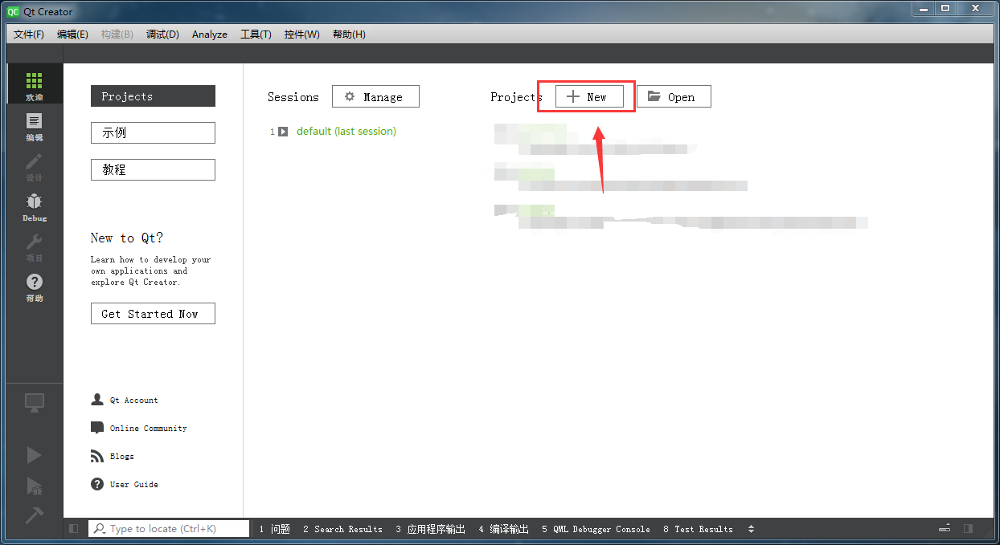
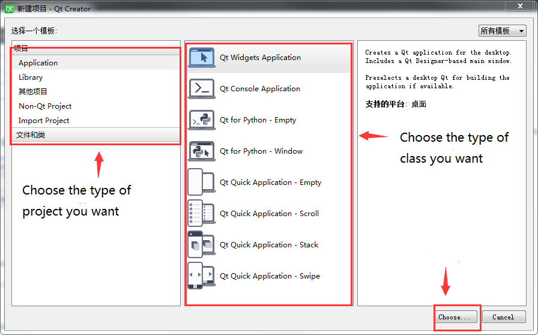
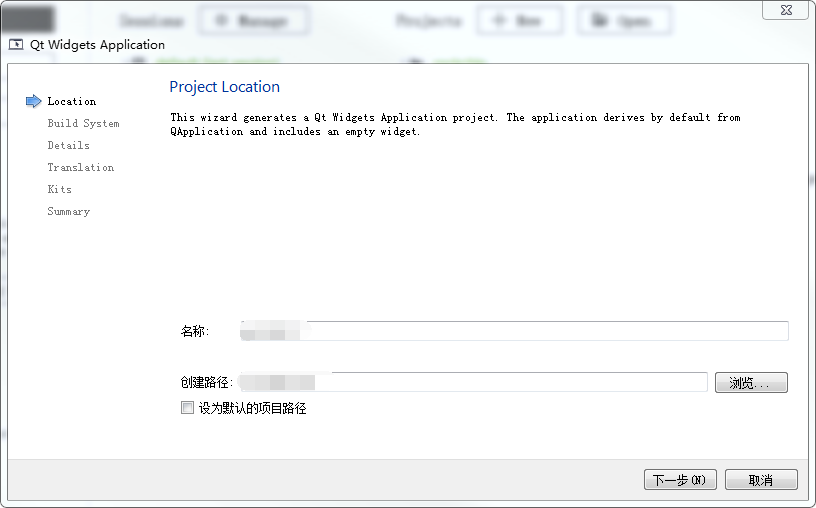
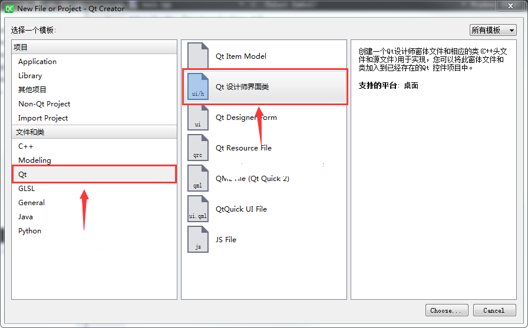
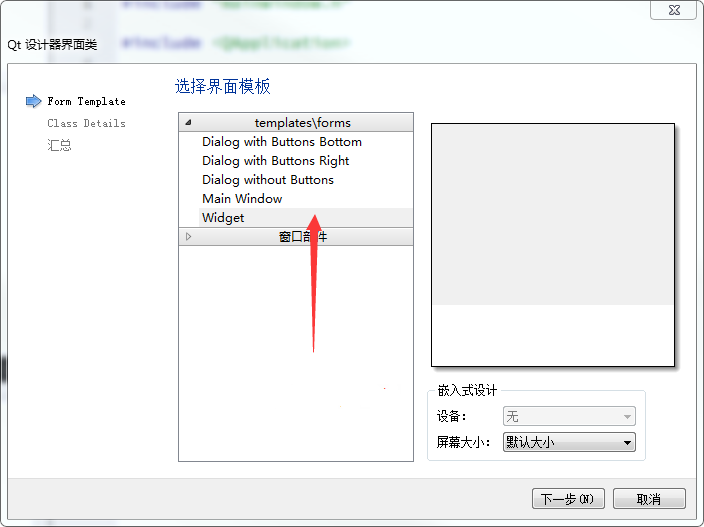
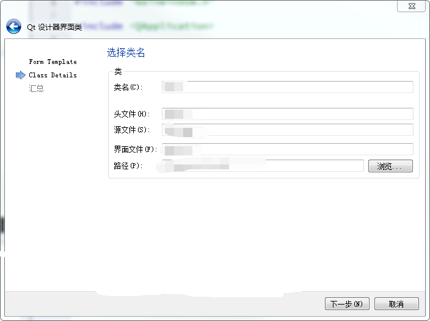

# Linux Qt Development Guide

ID: RK-SM-YF-340

Release Version: V1.3.0

Release Date: 2020-07-11

Security Level: □Top-Secret   □Secret   □Internal   ■Public

**DISCLAIMER**

THIS DOCUMENT IS PROVIDED “AS IS”. ROCKCHIP ELECTRONICS CO., LTD.(“ROCKCHIP”)DOES NOT PROVIDE ANY WARRANTY OF ANY KIND, EXPRESSED, IMPLIED OR OTHERWISE, WITH RESPECT TO THE ACCURACY, RELIABILITY, COMPLETENESS,MERCHANTABILITY, FITNESS FOR ANY PARTICULAR PURPOSE OR NON-INFRINGEMENT OF ANY REPRESENTATION, INFORMATION AND CONTENT IN THIS DOCUMENT. THIS DOCUMENT IS FOR REFERENCE ONLY. THIS DOCUMENT MAY BE UPDATED OR CHANGED WITHOUT ANY NOTICE AT ANY TIME DUE TO THE UPGRADES OF THE PRODUCT OR ANY OTHER REASONS.

**Trademark Statement**

"Rockchip", "瑞芯微", "瑞芯" shall be Rockchip’s registered trademarks and owned by Rockchip. All the other trademarks or registered trademarks mentioned in this document shall be owned by their respective owners.

**All rights reserved. ©2020. Rockchip Electronics Co., Ltd.**

Beyond the scope of fair use, neither any entity nor individual shall extract, copy, or distribute this document in any form in whole or in part without the written approval of Rockchip.

Rockchip Electronics Co., Ltd.

No.18 Building, A District, No.89, software Boulevard Fuzhou, Fujian,PRC

Website:     [www.rock-chips.com](http://www.rock-chips.com)

Customer service Tel:  +86-4007-700-590

Customer service Fax:  +86-591-83951833

Customer service e-Mail:  [fae@rock-chips.com](mailto:fae@rock-chips.com)

---

**Preface**

**Overview**

 This document describes Linux Qt development process.

**Product Version**

| **Chipset**                       | **Kernel Version** |
| --------------------------------- | ------------------ |
| K3036/RK3128/RK3326/RK3328/RK3399 | Linux 4.4          |

**Intended Audience**

This document (this guide) is mainly intended for:

Technical support engineers

Software development engineers

---

**Revision History**

| **Version** | **Author** | **Date** | **Change Description** |
| --------- | ---------- | :-------- | ------------ |
| V1.1.0 | CJS | 2017-01-16 | Initial version |
| V1.1.0 | Nickey Yang | 2018-04-28 | Fix the format and content |
| V1.2.0 | Zack.Huang | 2020-06-28 | Collate the content and add the Qt Creator section |
| V1.3.0 | Zack.Huang | 2020-07-11 | Add some explanation of the QT compilation options |

---

**Contents**

[TOC]

---

## Qt Introduce

Qt is a cross-platform C++ GUI application framework developed by  Trolltech technology in 1991.It provides application developers with all the functionality they need to build art-level graphical user interfaces, while good scalability determines the expansibility of Qt applications.Qt currently supports the following operating systems :Windows, embedded Linux, MS/ Windows-95, 98, NT4.0, ME, 2000, XP, Vista, etc. This means that with Qt you can develop applications once and deploy them across different desktops and embedded operating systems without having to rewrite the source code.

## Build a Qt Project by Qt Creator Tool

Qt Creator is a lightweight cross-platform integrated development environment for Qt development. Qt Creator and Qt language supplement each other, Qt Creator runs across platforms and currently supports Linux(32-bit and 64-bit), Mac OS X and Windows.Qt Creator is designed to enable developers to take advantage of the Qt application framework for faster and easier development tasks.

Besides Qt Creator IDE, Visual Studio+Qt can also be used for portable development. By downloading and installing Qt plug-ins in Visual Studio, Qt development environment can be easily  set up. The development environment of this Demo program is Qt Creator.

### New Project

The following takes win7 32-bit Qt Creator as an example to introduce the usage of Qt Creator.

After opening Qt Creator, the following figure appears:



 Click new to configure project options:



 Select the name of your project and save path:



 Then keep clicking next.The interface that appears after successful creation:


### Use Qt Creator to Design GUI

One of the great advantages of Qt interface library is that it is cross-platform. You can use Qt Creator to design a nice UI and port it to the  ARM target board. Here's how to use Qt Creator to design the layout.Qt Creator's layout file is called *.ui. A project must have a UI file to use graphical design layout. Create a new UI file.







 After creation, the UI editing interface appears, as shown in the figure below:

From this interface, you can drag and drop the left control to add controls to your form, Please see <https://doc.qt.io> for details.

### Source Code Structure Introduction

In the default new project, there will be four types of files: Pro file, CPP file, H header file, and UI interface design file.


Pro project files are needed for qmake compilation. See the following for specific compilation methods. cpp and h files are c++ resource files,  UI files are design interface files written in HTML language for designers.

## Cross-compile Qt Projects

### Build Qt Project in Buildroot

Add your own Qt project to Buildroot. The following will introduce how to add to Buildroot.

in SDK/buildroot/package/, create a new project folder,  add these two files `Config.in` and `proname.mk` to the folder.

```shell
config BR2_PACKAGE_proname
	bool "proname"
	help
	  An introduction to the project
```

proname.mk:

```makefile
################################################################################
#
# proname
#
################################################################################

PRONAME_VERSION = 1.0
PRONAME_SITE = $(TOPDIR)/../app/YOURPRO    //Resource file directory
PRONAME_SITE_METHOD = local

PRONAME_LICENSE = Apache V2.0
PRONAME_LICENSE_FILES = NOTICE

define PRONAME_CONFIGURE_CMDS
        cd $(@D); $(TARGET_MAKE_ENV) $(HOST_DIR)/bin/qmake    //qmake
endef

define PRONAME_BUILD_CMDS                 //build command
        $(TARGET_MAKE_ENV) $(MAKE) -C $(@D)
endef
define ZACKTEST_INSTALL_TARGET_CMDS
        mkdir -p $(TARGET_DIR)/usr/share/applications $(TARGET_DIR)/usr/share/icon
        $(INSTALL) -D -m 0644 $(@D)/image/PRONAME.png $(TARGET_DIR)/usr/share/icon/
        $(INSTALL) -D -m 0755 $(@D)/PRONAME    $(TARGET_DIR)/usr/bin/PRONAME
        $(INSTALL) -D -m 0755 $(@D)/PRONAME.desktop    $(TARGET_DIR)/usr/share/applications/
endef

$(eval $(generic-package))
```

### Porting Source Code

After Buildroot is added, you need to add your project resources folder to the SDK to compile, and here's how to add source code.

SDK/app/youpro  Create a new one in the project folder you created `proname.pro` file:

```
#-------------------------------------------------
#
# proname
#
#-------------------------------------------------

QT  += quickwidgets widgets      //Add the required modules

TARGET = proname                 //Here is the name of the generated executable
TEMPLATE = app

INCLUDEPATH +=$$PWD main

HEADERS += \
    $$PWD/name.h \               //Project header files

SOURCES += \
    $$PWD/souce.cpp \            //Project cpp files
FORMS += \                       //Project UI files
RESOURCES +=                     //add your project
```

 Then copy your cpp file, h header file, ui interface design file to the directory where the project [name.pro](http://name.pro/) file is located. The following is a detailed description of the PRO file parameters:

1. Template variables - TEMPLATE

The template variable tells QMake what kind of makefile to generate for this application, such as TEMPLATE = app.

Here are the options available:

A> app - Create an application makefile.This is the default value, so if the template is not specified, this will be used.

B> lib -  Create a library makefile.

C> vcapp -  Create a VisualStudio project file for the application.

D> vclib -  Create a VisualStudio project file for the library.

E> subdirs - This is a special template that creates a makefile that can go into a particular directory and generate a makefile for a project file and call make for it.

2. Specify the generated application information - DESTDIR and TARGET

such as：
DESTDIR += ../bin // Specify the generated application to be placed in../ bin directory

TARGET = pksystem //  Specify the generated application package name as PKSystem

3. Specify configuration information - CONFIG

 CONFIG is used to tell Qmake about the  configuration information of the application.

such as：CONFIG+= qt warn_on release
 A> qt tells qmake that the application is written by QT. This means that Qmake takes the Qt library into account when connecting and adding the required include paths for compilation.
B> warn_on ttell  Qmake that to set the compiler to output warnings.
C> release tell   Qmake that application must be linked as a published application.Programmers can also use Debug to replace Release during development.

4. Specify where to store the build files that qmake generates - UI_DIR, MOC_DIR, OBJECTS_DIR, and RCC_DIR

such as:

UI_DIR += forms: Store the ui_*.h files generated by the conversion of .ui files with qmake in the forms directory.

RCC_DIR += res: The proname*.h generated by Qt's resource file.qrc transformation is stored in the res/ directory.

MOC_DIR += moc: Convert the header file containing Q_OBJECT to a standard .h file and store it in the moc directory .

OBJECTS_DIR += obj: Store the specified target file (obj) in the obj director.

5. Specifies the associated path that the program depends on at compile time.

DEPENDPATH += forms include qrc sources

6. Qt file included path

INCLUDEPATH += . //  Contains paths in addition to the Qt application directory

HEADERS += include/painter.h //  Header files included in the project

FORMS += forms/painter.ui //  The ui design file included in the project

SOURCES += sources/main.cpp sources/painter.cpp //  Source files included in the project

RESOURCES += qrc/painter.qrc //  The resource files included in the project

In addition, such as:

LIBS += -L folderPath // Path to the incoming lib file -L: The incoming path

Release:LIBS += -L folderPath // The path to the release lib file that was introduced

Debug:LIBS += -L folderPath // The path to the debug lib file that was introduced

DEFINES += XX_XX_XXX // Define compilation options, which can be used in a.h file: #ifdefine xx_xx_xxx
RC_FILE = xxx.icns.

### Compile the project

 Go back to the directory SDK/ and compile the project module:

```
make proname-rebuild
```

### Buildroot QT related compilation options description

| compilation options                 | instructions                                                 | Support package size (bytes) |
| ----------------------------------- | ------------------------------------------------------------ | ---------------------------- |
| BR2_PACKAGE_QTBASE5                 | Whether to support QT，add qtbase (Required)                 | 21128724                     |
| BR2_PACKAGE_QT5CONNECTIVITY         | Whether to add a device connection class, such as Bluetooth  |                              |
| BR2_PACKAGE_QT5MULTIMEDIA           | Whether to add a multimedia class                            | 1719090                      |
| BR2_PACKAGE_QT5QUICKCONTROLS        | Whether to introduce the Qt Quick Controls service component | 4854537                      |
| BR2_PACKAGE_QT5WAYLAND              | Whether to add the Wayland display service component         | 817872                       |
| BR2_PACKAGE_QT5BASE_JPEG            | Whether to support JPEG image format                         |                              |
| BR2_PACKAGE_QT5BASE_PNG             | Whether to support PNG image format                          |                              |
| BR2_PACKAGE_QT5SVG                  | Whether to support bitmap format image format                | 355584                       |
| BR2_PACKAGE_QT5TOOLS                | Whether to add QT tools. which provide tools for developing and designing applications easily |                              |
| BR2_PACKAGE_QT5TOOLS_LINGUIST_TOOLS | Whether to support linguist host tools lconvert, lrelease and lupdate |                              |

 Here's a description of some of the font options:

```makefile
BR2_PACKAGE_BITSTREAM_VERA                Whether to support BITSTREAM_VERA
BR2_PACKAGE_CANTARELL                     Whether to support CANTARELL
BR2_PACKAGE_DEJAVU                        Whether to support DEJAVU
BR2_PACKAGE_FONT_AWESOME                  Whether to support FONTAWESOME
BR2_PACKAGE_GHOSTSCRIPT_FONTS             Whether to support GHOSTSCRIPT
BR2_PACKAGE_INCONSOLATA                   Whether to support INCONSOLATA
BR2_PACKAGE_LIBERATION                    Whether to support ERATION
BR2_PACKAGE_QT5BASE_FONTCONFIG            Whether to support QT5 font
```

## Qt Demo Programming Instructions

### Network Management

In the Demo application , The wireless network management is written base on Wpa_supplicant. wpa_supplicant is a wireless connection management tool for Linux that we can use to configure our wireless network. The software is automatically integrated into Linux systems.

Under the Qt Demo application./Setting/wpa_supplicant directory, the open source code for WPA_supplicant is now integrated into the Qt Demo program, so it can be said that the Qt Demo application only provides a friendly user interface with interactive operations done by Qt5, while the actual function in the basement is done by wpa_supplicant.

In the Demo source code, wpa-related operations are integrated in the wapManager. cpp class, including wireless network switch, Wifi data acquisition, wireless network configuration, and so on.To understand the program, you should first understand some of the interfaces and usage of wpa_supplicant.

The first thing to know is how to interact with wpa_supplicant in the background. wpa_supplicant itself provides a set of C/C++ interfaces for external programs to call. The header file for the interface is wpa_ctr.h. such as:
`#include “common/wpa_ctrl.h”`.

In the wpa_ctrl.h header file, contains a set of  Macro definition event messages and eight function interfaces.Because wPA_supplicant interacts based on data packets, it sends predefined event messages to the outside that determine the next action to be performed based on those event messages.

such as:`#define WPA_EVENT_CONNECTED “CTRL-EVENT-CONNECTED”`

When the program gets the macro definition message from wpa_supplicant, it can  make sure that it is connected to the defined Wifi network. Once it gets the message, the outside program can manipulate the behavior of wpa_supplicant using eight function interfaces.

The interfaces of these functions are:

```c
struct wpa_ctrl * wpa_ctrl_open(const char *ctrl_path);
void wpa_ctrl_close(struct wpa_ctrl *ctrl);
int wpa_ctrl_request(struct wpa_ctrl *ctrl, const char *cmd, size_t cmd_len,char *reply, size_t *reply_len,void (*msg_cb)(char *msg, size_t len));
int wpa_ctrl_attach(struct wpa_ctrl *ctrl);
int wpa_ctrl_detach(struct wpa_ctrl *ctrl);
int wpa_ctrl_recv(struct wpa_ctrl *ctrl, char *reply, size_t *reply_len);
int wpa_ctrl_pending(struct wpa_ctrl *ctrl);
int wpa_ctrl_get_fd(struct wpa_ctrl *ctrl);
```

wpa_ctrl_open is used to open the control interface of wpa_supplicant, using UNIX Domain Sockets in UNIX systems and UDP sockets in Windows. Of course, the path of the interface is not fixed and can be changed according to the path set in the configuration file.

The wpa_ctrl_close interface is naturally used to close the control interface.

The  wpa_ctrl_request interface is used to send a control command to wpa_supplicant and receive a feedback message indicating whether the command executed successfully or not. This is a blocked action, usually waiting at least 2 seconds for a reply message to be received. If unsolicited messages are received, the blockage is longer.

The wpa_ctrl_attach interface registers an event monitor for the control interface, but after successful registration, interface event messages can be started.

The wpa_ctrl_detach interface cancels event monitoring of the control interface.

wpa_ctrl_recv interface is used to receive event messages after the event monitoring registration of the control interface is successful. This is a blocked operation, and will remain blocked when no messages are available.

The wpa_ctrl_pending interface is used to detect incoming event messages.

The wpa_ctrl_get_FD interface is the file descriptor to get the control interface.

### Audio and video player

In Qt5, the original multimedia framework Phonon is abolished, and QMediaPlayer is introduced instead. Therefore QMediaPlayer is used for audio and video player development in the Demo program.

QMediaPlayer is a multimedia streaming framework that encapsulates platform-specific operations for playing multimedia. For example,using the GStreamer framework in Linux is not the case in Windows. QMeidaPlayer can ignore platform dependencies, which is coincides with the  independence of Qt platform.

To use QMediaPlayer in an application, you need to add Qt += Multimedia in `.pro` (Qt project profile) as well as the necessary header files.

Application compilation steps (for reference)

In the project code directory, the path of the Demo application is under the  app/carmachine, and the rk_mak.sh script can be directly run to compile and generate the executable file Carmachine.

The steps to compile the script file are similar to the steps below for your own Qt application to compile.

Copy the project source code to the project path: for example:

 `~/repo/buildroot/output/build/qt5multimedia-5.6.1-1/examples/multimediawidgets` is going to participate in compilation Modify the Pro file of the Qt project to add the installation path of the library files specified by target.path, such as:

```makefile
target.path = $$[QT_INSTALL_EXAMPLES] / multimediawidgets/Carmachine ISTALLS += target
```

Carmachine is the name of the source code of the project, which installs the project directly under the source path of the project.

Note: The pro file and the Qt compilation tool qmake generate makefiles related to each platform.

Execute qmake and package make in the project source directory.

qmake can refer to the tool in the buildroot/output/usr/bin/qmake directory.

The following is the detailed steps(in the project source directory):

```makefile
~/repo/buildroot/output/host/usr/bin/qmake && make -j8
```

If no compilation error occurs, the compiled executable can be found under the source path according to the pro file configuration.

Application tests: The executable file can be burned to the file system,in buildroot/output/target/bin.

Execute installation command in serial port:

such as:

```
cd bin && ./Carmachine -platform linuxfb -plugin EvdevTouch:/dev/input/event0
```

Note: When the Qt4 program was running on the embedded Linux platform,it was required to enter the -qws option on the command line to start Qt window system service,for example:"./HelloWorld -qws",With Qt5, instead of -qws, you need to specify the QPA plug-in to use via -platform,for example "./HelloWorld -platform linuxfb",If not, use the default QPA plug-in, which is specified by the QT_QPA_PLATFORM variable above.

Note: - the plugin EvdevTouch:/dev/input/event0 specified touch events.